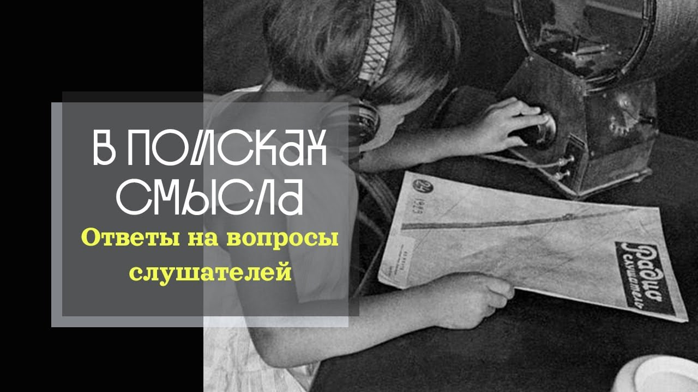

# Ответы на вопросы. Соблазн гностицизма: духовные корни заблуждений русской интеллигенции.

07 января 2026 г. [Аудиоверсия](https://www.youtube.com/watch?v=DS_ovdIxN38) 30:41

Павел Щелин отвечает на вопросы подписчиков о русской интеллигенции и её парадоксах.
Почему качество интеллигентности — уважение к другому, готовность сомневаться — не присуще самой интеллигенции как социальной группе?
Откуда взялось требование фрондёрства как обязательного признака принадлежности к «обществу с большой буквы»?
Что такое гностицизм интеллигенции и почему «Бесы» Достоевского остаются актуальным диагнозом?

**Е.Голуб:**
Ну вот очень сильно задели наших слушателей, твоих зрителей твои высказания по поводу интеллигенции.
Вот прям совсем.
Совсем нехорошо.

**П.Щелин:**
Очень смешно.
Кого-то задели, а кто-то прям обрадовался.
Спасибо, наконец-то хоть кто-то это сказал.

**Е.Голуб:**
Да, ну я лично считаю тебя человеком, как раз принадлежащим к интеллигенции, уж прости.
Поэтому будем считать, что это такая у тебя...

**П.Щелин:**
Самокритика.

**Е.Голуб:**
Рефлексия интеллигенции о самой себе в твоём лице.
Итак, вопрос звучит следующим образом.
Был ли отказ интеллигенции, имеется в виду русской интеллигенции, от ответственности перед властью ответом на отказ власти от ответственности перед Богом?

**П.Щелин:**
Мне бы очень хотелось с этим согласиться.
К сожалению, нет.
Вот этот разрыв происходит уже в XIX веке.
Пока царь остаётся миропомазанным, условно Бесы Достоевского написаны до 17-го года, а в нём уже всё вот это ключевое, собственно, тот феномен, который я описываю как гностицизм, присущий русской интеллигенции, он, наверное, вот с точки зрения литературы, конечно, лучше всего прочитать Бесы Достоевского для тех, кто не читал.

И вот это внутреннее состояние, на мой взгляд, вот эта духовная катастрофа, которая постигает эту социальную группу, там просто вскрыто с какой-то невероятной глубиной, точностью и при этом болью.
Вот прямо тебе скажу.
Так что нет, я боюсь то, что дело не в этом, я боюсь то, что это дело именно в...
То есть для меня это своеобразная мутация...
Для меня это своеобразное воплощение, то есть особое, изменчивое, но вообще не присуще собственно русской культуре или традиции проблемы, то есть то, что я называю западным гностицизмом, западное мышление, то есть это тот самый модерн, то самое кортезианство, тот самый, скажем так, примат обособленного разума над всеми другими слоями бытия, начиная от сердца до духа, от этики до чувства, то есть вот эта вся история.
И просто так получается, что эта трагедия Петровских уже реформ, что это приносится на русскую почву, начинает чувствовать себя отдельно, особо неуютно, она начинает ощущать себя как одновременно чужой против этого народа, но ему мерзко, условно, начинается быть этим государством, при этом чувство своей особой важности и значимости, потому что именно я являюсь проводником вот этого, то, что уже объявлено вроде бы самим государством, как важный источник священного знания, то есть технологии, мосты, понимаешь, да?

Это все Петровский, скажем так, Петровский импульс.
Но и в дальнейшем из этого соблазна уже начинается вот это желание, мы, может быть, тут как-нибудь сами поинженерим, построим, побудем, скажем так, инженерами человеческих душ.
Потом происходит мутация, собственно, которая современная, на которую я больше всего отсылаю, вот это то, что мы называем белой плитой, стульчик морального превосходства, ну, откровенно говоря, полное несоответствие заявленного, скажем так, моральной роли в обществе, да, то есть вот этого совести наций и тех реальных практик поведения и плодов, которые интеллигенции начинает себе позволять очень быстро.
Причем, опять, уже в 19 веке массово это начинает происходить.

И при этом, да, вот фраза «интеллигентный человек» долгое время считается, ну, некоторым знаком качества, знаком, если угодно, ну, настоящего человека, такого достойного человека.
Я просто скажу, что не только я, собственно, даже не только я это придумал, даже те люди, которые, по своей профессии были врагами России, допустим, Ричард Пайпс, американский историк, консультант всяких спецслужб в холодной войне, он феномен интеллигенции тоже прям так вскрывал, как очень такую специфическую, скажем так, среду накануне революции, и конечно, тоже, мягко говоря, комплиментарно ты это не назовешь.
Сложно это?

**Е.Голуб:**
Да, интересно, Клим Самгин был русским интеллигентом.
Или ты не читал?
«Жизнь Клима Самгина» не читал, да?
Ну, ладно, есть хороший сериал, кстати, еще в советское время, снятый «Жизнь Клима Самгина», оттуда несколько мемов, вроде как, «А был ли мальчик?».
Ну, если будет возможность, посмотри.

Хорошо, так, ну, неймется нашим зрителям и слушателям, давай-ка мы попробуем, ты попробуй, определить, по каким критериям мы относим человека к интеллигенции, и вот как ты понимаешь, что такое интеллигентность как качество.
Возьмешься отвечать?

**П.Щелин:**
Ну, вот тут противоречие, на самом деле, между...
Интересный вопрос, мне нравится вопрос, попробую ответить, а там решим.

Потому что интеллигентность так как качество, очень хочется описать по Лотману, и тогда это очень такое высокое достоинство.
Но вот эту внутреннюю интеллигентность, то, что по Лотману, я встречал в людях, которых я бы никогда не назвал интеллигентами.
Понимаешь?

**Е.Голуб:**
А напомни, пожалуйста, что Лотман говорил.
Ну, так в общих чертах, не обязательно цитировать.

**П.Щелин:**
Надо бы, тогда ставим на паузу, процитировать
Я это помню, как внутреннее мироощущение, конкретно эту цитату не скажу.

**Е.Голуб:**
Так, сейчас нам ничто не помешает сейчас вернуться.

**П.Щелин:**
Слава Богу, не прямой эфир.

> Ну вот, таким образом, значит, мы говорим о том, что интеллигентный человек стремится понять другого.
> А как стремится, а как воспринимает другого человек не интеллигентный?
> 
> Прежде всего, он убежден, что он думает правильно.
> Вот то, что неизбежно присутствует в самом понятии интеллигентности, сомнение.
> На этом стоит, ну, в общем, всё европейское мышление.
> 
> Известный французский философ XVII века Декарт, которому, как все мы помним, принадлежит известное высказывание «мыслю следовательно существую».
> По сути дела, это то, что мог бы написать на знамени своём всякий мыслющий человек, то есть всякий человек интеллигентный.
> «Мыслю следовательно существую».

**Е.Голуб:**
Да, да, понимаешь, то есть получается, что...

**П.Щелин:**
Противоречие.

**Е.Голуб:**
Противоречие очень серьёзное.

**П.Щелин:**
Первая фраза правильная.

**Е.Голуб:**
Я бы не сказал, опять-таки, правильно или неправильно.
Я бы сказал, что с первой характеристикой можно согласиться, как если определять человека интеллигентным, как человека, который готов понять другого, встать на другую точку зрения, услышать другого человека.
А вот о мыслящей...

Павел, по каким критериям следует относить человека к интеллигенции?
И что такое быть интеллигентным?
Интересует нашу, твою аудиторию.

**П.Щелин:**
Тут очень, кажется, двойной парадокс внутри этого вопроса.
Внутри интеллигентности и между интеллигентностью и интеллигенцией.

Наверное, лучше всего этот парадокс слышен в знаменитом определении Лотмана, посвящённом этой проблематике, где в первом предложении он называет человека, обладающего качеством интеллигентности, как человека, который пытается стремиться понять другого.
Но дальше он двигается в картезианскую европейскую традицию Декарта и говорит, что интеллигентность — это качество мыслящего человека.
И, на мой взгляд, здесь заложен вот этот первый парадокс.

Потому что первая часть со второй никак не связана причинно-следственными связями.
Для меня.
То есть, мне кажется, человек, который...
Я бы заменил не мыслящий, а живущий человек, то есть человек, который, неважно, живёт в каком-нибудь из этих домов, не знаю, сапожником он является, то есть не занимается активно мысленной деятельностью, не художник, не поэт, не писатель, но в своей жизни он стремится понять других, когда они встречаются на его пути.
Увидеть их боль, увидеть их радость, увидеть их потребность.

А вот когда мы просто ставим, скажем так, кавычки, скобки, центр на мышлении, мы как бы отделяем мышление от всей ткани и практики опыта бытия.
Возносим его оторвано на пьедестал.
И как следствие рождается, собственно, для меня парадокс интеллигенции.
Ну, парадокс в том, что часть того, что можно назвать интеллигенцией, соответствует критерию формально мыслящих.
Они работают в академической сфере, художественной сфере, литературе, ну, медиа, СМИ.
То есть формально то, что связано, так или иначе, с мышлением.
То есть не с работой с материей, а работой головой, работой с мыслью.

Но в моем опыте массового общения, последнее, что стремятся чаще всего эти люди, понять другого.
Вот более всего они убеждены о том, что они свет, вокруг них тьма, и эта тьма должна быть благодарна самому их явлению этой самой тьме.

**Е.Голуб:**
Знаешь, я с тобой наверное, в основном не соглашусь, потому что есть такие понятия или образы, которые усвоены с детства, и пусть они не совпадают с каким-то общепринятым определением, тем не менее я как относился, так и отношусь к понятию интеллигенция, к интеллигентный человек с уважением.
И в определении Лотмана то, что мне больше всего нравится, это как раз то, что интеллигентный человек готов сомневаться в своей правоте.
А то, что мы сегодня называем либеральной интеллигенцией, она как раз не готова сомневаться в своей правоте.

Для меня интеллигентный человек — это прежде всего человек с уважением относящийся к личности другого, кто бы ни был этот другой.
Это может быть образованный человек другой, может быть необразованный, но в моем понимании, хотя спрашивают это тебя, раз пошел разговор.
Интеллигентного человека отличает именно бережное отношение к личности другого.

**П.Щелин:**
Смотри, тогда опять по этому твоему критерию.
Собственно, я тут не вижу противоречия.
У меня немножко один критерий, которому интеллигенция сама не соответствует.
Но и твоему критерию интеллигенция не соответствует.

**Е.Голуб:**
Это не все.
Это же один из критерий.
Это первое, это основа.

Далее идет уровень образованности, уровень знания, осведомленности, если хочешь.
Кругозор.
Но это тоже не все.
И это тоже недостаточно.

И один из важнейших критерий, может быть, третий, это стремление реализовать себя через творчество, причем любое творчество.
Любое творчество.

Вот для меня три этих момента, три вот этих компонента, они и...
Подожди, пожалуйста.
Они и образуют то, что мы говорим, интеллигентность.
При том, что на интеллектуальную составляющую интеллигенции напирают именно наши западные партнеры, коллеги.

А вот русская интеллигенция, это всегда про личность и всегда про уважение.
Но давай подожди минуточку.
Все-таки, наверное, надо отделять интеллигенцию, русскую интеллигенцию и интеллигенцию либеральную.
Да, нет?

**П.Щелин:**
Так вот это и есть вопрос, потому что мы живем в парадигме, что кроме либеральной другой интеллигенции не существует.

**Е.Голуб:**
Вот.
То есть у нас либеральная интеллигенция, а не либеральная...

**П.Щелин:**
Мракобесы. Только.

**Е.Голуб:**
Да, вот это метаморфозы, которая, в общем, наверное, произошла за последние 50-70 лет.

**П.Щелин:**
Ты хорошо подметил разницу.
Я с тобой соглашусь даже на том уровне, где ты был между западной традицией с упором на мышление.
Кстати, Лотман об этом, по сути, говорит.
И вот тем, что описал ты.

Но тогда, допустим, для меня носителем, качеством интеллигентности, повторюсь, будет, допустим, столяр-коснодеревщик, который с уважением относится к другим людям, не осуждает, стремится понимать и, допустим, обладает прекрасной домашней библиотекой.
И для меня он будет интеллигент, но не будет интеллигенцией.

**Е.Голуб:**
Хорошо, допустим.

**П.Щелин:**
В общем, мне кажется, что-то тут нащупалось немножко.
По крайней мере, обозначены вот эти парадоксы.

**Е.Голуб:**
То есть интеллигенция — это не обязательно люди, обладающие интеллигентностью.
Вот так это выходит из твоих слов.

**П.Щелин:**
Да, абсолютно.

**Е.Голуб:**
Хорошо.
Тогда вопрос от наших слушателей.

Почему после распада Советского Союза на пьедестал, ну так дословно, выводили именно либеральную интеллигенцию, а не государственников?
Там Проханова, не знаю, Распутина?

**П.Щелин:**
Ну так, правильно, хорошее продолжение нашей предыдущей темы, потому что постепенно за период XX века сложилось вот это...
В общем, вот, появился...
Смотри, хороший вопрос, и вот что я заметил из того, что я еще не сказал.

Почему-то в русской традиции, можем сейчас порассуждать, почему, но постепенно, начиная с XVIII, а потом с XIX и достигнув пика в XX веке, к понятию интеллигенции добавился четвертый критерий, а именно то, что этот человек должен быть обязательно фрондером.
Он может там работать на государственные деньги, но он обязан немножко, ну немножко прям презирать это государство, брезговать.

**Е.Голуб:**
Находиться в оппозиции.

**П.Щелин:**
А если он не находится в этом, то он, конечно, не интеллигент, а просто пропагандист на зарплате.

**Е.Голуб:**
Ну то, что Акунин, Борис Акунин называл в своих историях государства российского обществом с большой буквы О.

**П.Щелин:**
Да.
Вот это общество обязательно должно быть антигосударственным.
То есть оно обязательно должно быть...
То есть французское слово фронда мне подходит больше всего.

**Е.Голуб:**
А может быть это то, что мы вынесли из уроков истории?

**П.Щелин:**
Нет, не думаю.
Ну я не оцениваю это по разным фразам.

**Е.Голуб:**
То есть может быть просто упор нарратива был в том, что интеллигенция была в оппозиции, вот это только интеллигенция, а на самом деле образованных людей было много?

**П.Щелин:**
Да, конечно.
Это абсолютно ложный нарратив.
Ну условно, славянофилы, огромное количество людей, публицистики православной, государственной, цивилизационной, того же 19-го, 20-го века есть.
Но всех их, как интеллигентов, никто не отнесет.
Постепенно...
Давай так, мы с тобой много говорим о мифах и нарративе.
Вот особенно в контексте русского языка, действительно, повторюсь, за длинный эволюционный период понятие интеллигенция неотрывно связано с понятием фронда и антигосударственного поведения.

**Е.Голуб:**
Может быть, будет правильно сказать, что либерально настроенные образованные люди присвоили себе право называться интеллигенцией, хотя изначально интеллигентными людьми, интеллигенцией могли называть себя или называли широкий круг.

**П.Щелин:**
Нет, но, кстати, Пайпс сказал, если вспоминать, Пайпс сказал, что вот это фрондерство, именно вот само возникновение интеллигенции как класса, неразрывно связано.
То есть оно было присуще изначально.

Но, условно, какой-нибудь Несмелов, один из моих любимых философов, может быть, сказал бы, что я интеллигентный человек, но интеллигенцией он себя не назвал.
Он бы сказал, ну, я профессор, я человек словесности, допустим.
Он бы не отнес себя к интеллигенции, как вот этой социальной группе общности с буквой О.

**Е.Голуб:**
Хорошо, тогда остановимся так, что есть интеллигентные люди, но они могут не быть интеллигенцией.

**П.Щелин:**
И чаще всего они как раз...
В моем опыте чаще всего они не являются.
А вот среди моего опыта интеллигенции интеллигентных людей я не встречал.

**Е.Голуб:**
Скажите, пожалуйста, а для тебя интеллигенция это оскорбительно?
Скорее, негативные коннотации?

**П.Щелин:**
Ну, сейчас да.

**Е.Голуб:**
Именно потому, что с приставкой либеральная всегда идет.

**П.Щелин:**
Ну, да, потому что это понятие, в принципе, для меня тождественное, но все-таки я нахожусь в контексте, я могу, конечно, переопределить и сказать, что интеллигенция — это интеллигентные люди, но оно тогда потеряет вот этот смысл, и я пока не обладаю достаточным авторитетом, чтобы, знаешь, одним словом понятие переопределить.

**Е.Голуб:**
Ну, хорошо, чтобы завершить уже этот раунд, давай так.
Как бы ты сегодня определил черты либеральной интеллигенции в контексте?

**П.Щелин:**
Ну, чаще всего это человек однозначно творческой профессии, то есть здесь вот этот критерий Лотманского мышления, то есть творчества, который ты тоже упомянул, сохраняется.
При этом он разделяет определенную ценностную парадигму.

**Е.Голуб:**
Какую?

**П.Щелин:**
Либеральную.
Ну, которую в моей версии, давайте прямо скажем, ту или иную версию гностицизма.
Для меня, кстати, советская интеллигенция гораздо больше попадает в эту категорию, потому что, ты сам знаешь, для меня либерализм, национализм, коммунизм — все три версии, ну, разные версии одной и той же принципиальной философской парадигмы гностической.
Вот.

То есть он разделяет, он не ставит ее под сомнение.
Последнее, что он стремится, это понять другого человека.
Ну, он по определению.

**Е.Голуб:**
Этот вот либеральный интеллигент.

**П.Щелин:**
Да, этот либеральный интеллигент.
Но при этом он искренне считает себя носителем вот этого абсолютного света в океане мрака.
Ну, и дальше, вот там есть варианты в зависимости от положения.
Либо ему за это все должны, либо он, наоборот, страдает, не понят этим жестоким миром.

**Е.Голуб:**
Что вызывает у тебя наибольшее неприятие в том сообществе, общности людей, которые ты относишь к либеральной интеллигенции?

**П.Щелин:**
Если по-честному?

**Е.Голуб:**
Честно, только так.
А зачем нам?

**П.Щелин:**
Огромная необразованность.

**Е.Голуб:**
То есть это необразованные, самоуверенные люди.

**П.Щелин:**
Нечто даже хамское, если честно.
Вот необразованность, переходящая в хамство, при ощущкнии абсолюта.

**Е.Голуб:**
Превосходство.

**П.Щелин:**
Ну, хутспа это одним словом называется.

**Е.Голуб:**
Мы продолжаем видео-версию подкаста «В поисках смысла».
И в сегодняшнем видео Павел Щелин, политический философ, отвечает на вопросы подписчиков своего телеграм-канала и ютуб-канала.
Продолжаем.

Наши образованные слушатели и зрители хотят узнать твое мнение о нескольких философах русских, интеллектуалах.
Поговорим о трех.
В начале о Николае Данилевском.
Что ты думаешь о его творчестве?

**П.Щелин:**
Данилевский, Евгений, на мой взгляд, философ, мыслитель, однозначно заслуживающий внимания и медленного, вдумчивого чтения.
Для XIX века, когда он работал, разумеется, в нем, в его трудах содержится огромное количество каких-то ну, прямо скажем, неточностей, больших допущений, которые в дальнейшем совершенно не оправдались, но не в этом их ценность.
Ценность находится в его философской части, попытке мыслить цивилизационно, попытке хоть как-то подняться на уровень целостностей, от уровня отдельных фактов и, скажем так, феноменов.
И с этой точки зрения его попытка, на мой взгляд, заслуживает не меньшего внимания, чем, ну, применительно, в XX веку заслуживает попытка Хантингтона или попытка Шпенглера или попытка любого другого цивилизациониста.

Здесь есть, наверное, общий такой комментарий про...
Я сам являюсь большим, ну, скорее, сторонником классических цивилизационных школ, да, если в этой рамке и оптике находиться.
Но, разумеется, я понимаю то, что ни одна из конкретных воплощений этих цивилизационных школ не является достаточно точной, чтобы, допустим, соответствовать возможно ожиданиям некого научного, знаешь, вот такого предельно точного подхода.
То есть это, скорее, все-таки больше по живописной метафоре глубокие очень мазки, такие.
Импрессионизм, даже такой больше, а не академическая живопись.
Но в них есть очень часто глубокие интуиции.
Вот Данилевский один из таких авторов.

**Е.Голуб:**
Хорошо.
А Лев Гумилев?

**П.Щелин:**
Точно так же я бы оценил.
То есть конкретика, могу говорить сколько угодно, но само обращение нашего внимания к проблеме того, что он назвал пассионарностью, крайне важно.

**Е.Голуб:**
Продолжение.
Владимир Соловьев.

**П.Щелин:**
Владимир Соловьев гораздо более сложный для меня философ.
В нем есть несколько тоже гениальных, на мой взгляд, прозрений.
Самое, на мой взгляд, гениальное - разворот оптики, что важно не то, что народ думает о себе, а то, что Бог думает о народе.

Разворот оптики с, если угодно, нижнего подхода к верхнему подходу.
И сам этот акт философский очень красивый.
Есть гениальное трампологическое наблюдение про...
И шутка про то, что человек произошел от обезьяны, так давайте же любить друг друга.
За эти две фразы я, на самом деле, за них одни я ему безумно благодарен.

Но при этом его в целом развитие творчества для меня, конечно, в каком-то смысле является опасным для читателя, потому что в нем содержится очень много гностических идей.
София, софиология и многие другие разные его открепления.
И неподготовленному читателю, который, ну, не понимает, не изучал, там, условно говоря, классическую православную апологетику, даже католическую, если угодно, апологетику.
То есть не знает ни того, ни другого, а сразу прыгает вот в такой гностический медицицизм, кажется, что все же понятно, все правильно так и есть, не имея возможности к различению.
Вот здесь для меня у Соловьева, конечно, он, при всех его больших достоинствах, не из тех философов, которых я рекомендовал читать неподготовленному читателю.

**Е.Голуб:**
Ну, хорошо.
А теперь в качестве десерта к вопросу о мыслителях очень многие интересуются, как же Павел Щелин относится к Александру Дугину.
Известно, что некоторые любят п роводить параллели между твоими высказываниями и высказываниями Дугина, находя в этом что-то прям общее и ставя вас, в общем, в один ряд, по крайней мере, по ряду тезисов или моментов.

**П.Щелин:**
Ну, есть тезисы, однозначно, которые мы разделяем.
Один из них, например, мне кажется, очень важный сегодня тезис о необходимости вестернологии в России.

**Е.Голуб:**
Как, как?

**П.Щелин:**
Вестернологии.
Изучение Запада как объекта.
Ну, то есть, это вообще революционная мысль, потому что либо ты впадаешь просто в попытку эмоционального отрицания традиционного, нашей парадигмы, либо безрассудного обожания просто.
Вот там источник света, мудрости и все-все-все.
Пожалуйста, идите, пожалуйста, научите нас убогих.

Оба этих подхода мне равно, скажем так, претят.
Вообще, это интересное свойство русского человека, что он, когда что-то изучает, он в это влюбляется.
Вот русский человек, который изучает Францию, Францию любит больше, чем все французы вместе взятые.
Вот патриот этой Франции так, что ни одному французу не придет.
Изучает Германию, это германофил, который просто вот, ну, никаких недостатков в ней не видит и так далее и тому подобное.

Вот идея вестернологии, как ее артикулирует Дунгет, это попытка посмотреть на, собственно, в данном контексте Запад, как, условно, уже это от меня, энтомолог смотрит, смотрит на бабочку.
Спокойно, беспристрастно, из своей позиции, из своей онтологии мировоззрения, не приписывая ему того, чего нет, но понимая его как некую целостность, вот эти примеры, этот феномен как некую целостность.
И сама эта идея, что он пытается артикулировать, пытается это продвигать, вот из последних его мыслей, то, под чем я вот однозначно готов подписаться, сам, собственно, сам к этому призываем.
Тут нет удивления.

Плюс нас с ним действительно роднит вот то, что попытка мыслить, попытка мыслить вне вот этой парадигмы трех категорий, условно, ложного выбора.
Либерализм, национализм, модернизм, а пойти на уровень все-таки предшествующий, некого предмодерного мышления.
Ну, я это формулирую уже, мы не можем вернуться назад, поэтому после модерновое мышление.
То есть, да, действительно, есть множество сходств и множество некоторых взаимозависимостей.

Но при этом, конечно, разные комментарии.

Первое.
Господин Дугин гораздо старше, чем я.
В его жизни есть самые разные периоды.
Условно, Дугин сегодняшнего дня и Дугин периода Мавлеевского кружка, это настолько разные люди, которые при изучении очень сложно давать ответ.
У меня сам, если с его Мавлеевским периодом, например, у меня...
Если меня спрашивают, как ты помнишь, с Дугину Мавлеевского периода, у меня будет очень жесткая несогласие, потому что, на мой взгляд, это предельно гностическая история, что происходило на том уровне.

Но вот его дальнейшее развитие, которое в большей мере идет в антигностическом, мне во многом, конечно, симпатично.
При этом, важный тоже комментарий.
Личностный.
Вот это интересно.
Проще говорить всегда о неживых человеках, да, о предыдущих философах.
А тут ты говоришь о живом человеке, который, возможно, это увидит.
И крайне сложно комментировать.
Особенно я его не знаю.

Но вот то, что мне заметно, то, что для того, чтобы взаимодействовать с Александром Дугином как с философом, нужно набраться огромного количества терпения.
Дугин однозначно не является философом.

**Е.Голуб:**
Не является?

**П.Щелин:**
Является.
Является философjv.
Именно философом, а не историком философии, не исследователем философии.
Он философию практикует.

Практика философии приводит к тому, что мысли его заводят в самые разные круги.
Причем, как правило, Дугин пишет ее сразу.
Особенно в своем телеграм-канале.
Вот в последние периоды.
И для того, чтобы взаимодействовать, нужно набираться огромного терпения.
Нужен навык вот этого видеть, там, крупицу философского золота в неком, там, потоке некой руды.
И, в принципе, так работает с большим любым философским мыслителем.

Условно говоря, читая всего Платона, далеко не каждая мысль Платона является золотом.
Ну и далее длинно по списку.
Это только у святых отцов бывает, что по-настоящему можно относиться к ценности, потому что чисто написано святым духом.
А в философии всегда так.

Какая-то философская, ну, какое-то зерно, какая-то крупица золота на фоне потока весьма часто странных высказываний, которые...
Ну, и здесь я могу просто о себе, обо мне, в принципе, можно сказать, ровно точно так же.
Ну, и в каком-то смысле это издержки философского метода, как практики.
Ты очень часто просто идешь за своей мыслью, и потом, а после думаешь, ну, вот здесь, скажем, она завела меня не совсем туда, куда бы завела она меня сейчас.
Но вот этот подход куда-то в сторону, он очень нужен, чтобы, ну, по моему опыту, чтобы прийти к этой крупице какой-то интуиции, какой-то вот внезапной, незапланированной мысли, которая будет предельно точной.
Пару таких мыслей вот в его творчестве я назвал вначале.

**Е.Голуб:**
Ну, я боюсь, что наши читатели или зрители хотели бы более конкретного ответа или более, может быть, ясной оценки.
Это не обязательно, что ты должен ее давать, но сейчас фигура Александра Гелевича, кажется, Дугина, да?

**П.Щелин:**
Да, Гелевича.

**Е.Голуб:**
Вызывает просто какое-то...
Ненависть такую, прям, физиологическую у ряду людей.

**П.Щелин:**
Любви тоже много вызывает.
Это наследие как раз то, что он практик философии.
Это практик.
Вообще, давай заметим, любая фигура публичная, которая пытается говорить искренне, хотя бы пытается, часто становится предметом противоречия.

**Е.Голуб:**
Быть искренним очень опасно.

**П.Щелин:**
Да, и вот от любви до обожания.
Как раз для меня вот эта полярность мнений на него во многом является следствием того, то, что он, как я сказал, именно философ.
То есть можно просто, понимаешь, заниматься академической историей философии, говорит, ну вот так рассказали тут, так рассказали тут, не пытаясь мыслить самому и не пытаясь сделать никакую интуицию.
Будешь очень неполярным.

**Е.Голуб:**
И безопасным.

**П.Щелин:**
Поэтому издержки метода.

**Е.Голуб:**
Хорошо.
Есть вопрос, связанный с современными медийными фигурами в православном поле.
Вот Владимир Легойда.
Что-то можешь сказать по этому поводу?

**П.Щелин:**
Человек...
Ничего кроме того, что человек ведет, как мне кажется, просветительскую работу со всеми издержками, в том числе этого жанра.
Вот если, условно, Дугин практикует философию, то, я бы сказал, Легойда пытается в основном работать на просветительском поприще со всеми его ограничениями.
На мой взгляд, он хорошо работает на своем поприще.

**Е.Голуб:**
Ну, в своей сфере он проявляет себя.

**П.Щелин:**
Это, кстати, очень всегда, наверное, знаешь, интересный такой рефрен.
Важно понимать, а что, собственно, человек делает.
Чтобы вот...
Какая система координат, относительно которой мы ставим?
Ну, условно, крайне сложно оценивать...

То есть, просветитель и философ — это не тождественные понятия.
Нет, бывали философы-просветители, но, на мой взгляд, они как раз как философы то ужасные.
Во всех своих жанрах.
