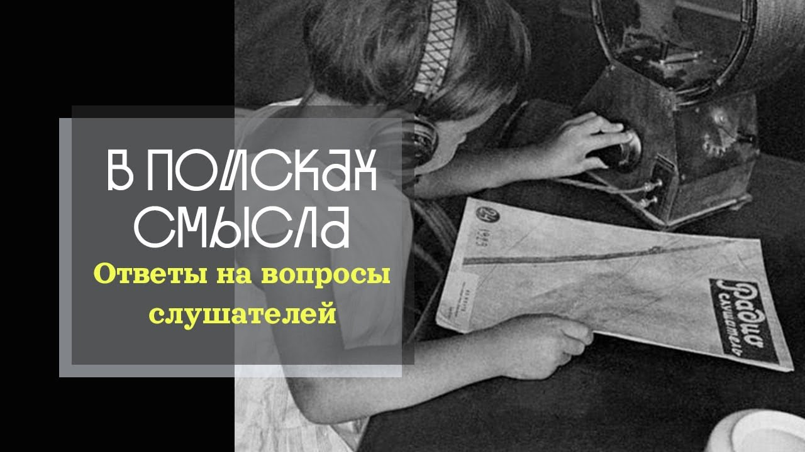

# Ответы на вопросы. "Всякая власть от Бога". Что это означает для тех, кто ей подчиняется?

09 января 2026 г. [Аудиоверсия](https://www.youtube.com/watch?v=Y8lgsmcDNGY) 37:13

Павел Щелин отвечает на вопросы подписчиков о православии.
Почему смирение — это не пассивность, а путь к той самой аутентичности, которую все ищут?
Как соотносятся демократия и монархия с христианским пониманием власти?
Существует ли свобода воли, если Бог всё знает заранее?
И почему попытка найти ответы на главные вопросы через накопление знаний — это тот же гностицизм?

**Е.Голуб:**
Вопросы православия.
Означает ли смирение пассивность или это активная позиция?
Давайте сделаем дисклеймер.

Павел Щелин не является ни старцем, ни богословом, ни дипломированным теологом.
Поэтому ответы Павла Щелина, говорю я за Павла Щелина, является его личной точкой зрения и не отражают официальную позицию кого бы то еще.

**П.Щелин:**
Вот я поэтому расскажу эту историю.
История была со мной в монастыре.
И как раз говорили о смирении с монахом.
Наверное, это логично поговорить о смирении с монахом тоже из прикладного личного опыта.
И вот он мне в этом общении конечно раскрыл глаза, что смирение, гораздо более точное понимание к нашей практике это искренность.
Это искренность перед тем, какой есть человек, какой есть ты, какой есть Бог, какой есть ты на своем пути к Богу.
И вот искренность перед своим именем.

На самом деле, я для себя понял, что то, что мы называем смирением, в каком-то смысле именно оно наиболее близко к тому, что сейчас называется...
Именно оно есть путь к тому, что сейчас все очень ищут, вот эта аутентичность.
Authenticity.
Вот эта история.
Или даже дозайн Хайдегера.
Вот это то, что в православной традиции называется смирением, это именно путь к вот этому центру.

**Е.Голуб:**
Да, интересно.
Получается, что для того, чтобы достичь вот этого смирения, нужно отсечь все те воспринятые некритично нарративы и картинки о себе, о мире.

**П.Щелин:**
Некритично у тебя?
Ну, допустим.

**Е.Голуб:**
Бездумно.
Подойдет?
Бездумно.
То, что сконструировано, то, что есть конструктом в тебе, вот потихонечку от этого отсечь.
И когда ты становишься самим собой, таким голеньким, открытым...

**П.Щелин:**
И вот почему смирится?
Это страшно.

**Е.Голуб:**
Да, это страшно, да.
И тогда речь идет о том, что ты становишься собой и отрываешься от Бога.

**П.Щелин:**
И перед Богом.
Ну, в православной традиции перед Богом.

**Е.Голуб:**
Ну, это же страшно, конечно.
А как же понты?
Как соотносится монархия и демократия с христианским пониманием власти?

**П.Щелин:**
Ну, демократия, ну, можно сказать, с христианским пониманием власти не соотносится примерно никак.
Точнее, полностью.
Ну, прямо...

**Е.Голуб:**
Демократия в современном изводе.

**П.Щелин:**
Да не, в любом.
Даже греческая, афинская демократия.
Тоже с христианством будет скрестить очень сложно.
Там, ну, вся эта тоже прекрасная структура.
По сути, власть Рублевки, власть безответственности, остракизм.
Вся вот эта приятная история.
Если мы реально читаем историю греческой демократии, как ты знаешь, я...
Вот даже на греческом уровне демократия явно не тот строй, который вызывает у меня уважение.

**Е.Голуб:**
Хорошо, давай я...
Ты же знаешь, я тоже не поклонник, скажем, того, что сейчас называется демократия, но я попытаюсь воспроизвести аргументы или тезисы тех, кто удивится.
Хорошо, ну вот разве избрание патриарха на соборе, например, где, как мы верим, или как должно быть, воля определяется духом через...

**П.Щелин:**
Я понял вопрос.
Но этот вопрос просто отражает философскую неточность, смысл демократии не в выборной процедуре как таковой.

**Е.Голуб:**
Это понятно.

**П.Щелин:**
Это тебе понятно.
Ты вот только что мне в вопросе сейчас, по сути, сделал акцент на выборную процедуру, в то время как сущность демократического процесса это так называемая власть от народа.
То, что власть появляется как результат суммирования индивидуальных воль, по сути.

**Е.Голуб:**
Так, мы сейчас пойдем в апотестас и акторитас.
Вот я сейчас говорю про акторитас, и про легитимизацию, да?

**П.Щелин:**
Ну то, что, окей, то, что ключевая легитимность идет снизу.
А уж, прости, в христианской традиции ключевая легитимность идет сверху.

**Е.Голуб:**
А как она проявляется?

**П.Щелин:**
А проявляться она вот уже может по-разному.
Но тот базовый первый принцип, что легитимность в христианской традиции идет сверху, а в демократической традиции легитимность идет снизу.

**Е.Голуб:**
Вот присутствующий сейчас здесь незримо наш общий знакомый сказал бы тебе, и что же это получается?
Что в церкви епископы, в общем, непогрешимый авторитет, и никуда от него не деться, и его самовластие, это прям вообще сверху данная ему легитимность.

**П.Щелин:**
Короткий ответ – да.
Да.
По грехам вашим, что называется.

И здесь в христианской традиции включается тот элемент, который политическая теория сама по себе использовать не может – элемент промысла.
В христианской традиции это будет ответ примерно такой.
Расскажу анекдот, хоть мне сказали, что я не умею рассказывать анекдоты, но я тебе расскажу.

В общем, был монастырь.
Монахи там правил особых не соблюдали.
То есть, посты не соблюдали, жили в свое веселье.
В общем, хорошо жили и с точки зрения еды, и с точки зрения других развлечений.
Вот такой у них был классный, как им казалось, настоятель.

Прислали им нового настоятеля.
Вот все-таки начало вводить проблемы.
Так, ну хоть один день в неделю вы у меня поститесь, пожалуйста.
И все-таки вино тоже, пожалуйста, не каждый день, а так тоже.
Ну, хотя бы пару дней можно и протрезветь на неделе.
Ну, и хоть давайте все все-таки на литургию-то ходить мы будем.
Хорошо.
Но монахи, конечно, обиделись.
Взвыли и начали неистово на тех литургиях, на которых они ходили, молить Господа, чтобы он послал им нового настоятеля и забрал уже от них этого тирана.

Господь услышал их молитвы, забрал этого настоятеля, прислал нового им, скажем так, руководителя.
Тот, конечно, по сути, уже начал с них устав требовать.
Не полный, не самый строгий, но прям уже устав, устав, устав, устав.
Ну, монахи взвыли прям просто не могу.
Там это уже совсем был беспредел.
Господи, что ж ты нас так наказываешь?
Нет, пожалуйста, чем мы виноваты перед тобой?
Пошли нам нового нормального настоятеля, как вот, собственно, можно, можешь же.

Ну, Господь, конечно, может.
Он послал им нового настоятеля.
Тот уже, по сути, всех их разогнал по индивидуальным кельям, суперстрогий пост, вода и хлеб, только причащение, ну, то есть любое вино только на причащении.

И тут-то монахи стали молиться за здравие.

**Е.Голуб:**
Ну, да.
Здесь, конечно, нужно контекст понимать, о чем идет речь.
Так, хорошо.

Я не стану оценивать твою способность рассказывать анекдоты, но давай все-таки вернемся к нашему примеру.
Правильно ли я понимаю, что ты хочешь сказать, что в церкви архипастырь именно такой, как заслуживает эта церковь?

**П.Щелин:**
Либо промыслительное, либо в награду, либо промыслительного исправления.

**Е.Голуб:**
Ну, условно говоря, если вам не нравится патриарх, обратитесь вокруг, и посмотрите, насколько христианской жизнью вы живете.
Те, которые возмущаются, собственно, этим патриархом.
И, возможно, если вы наконец-то войдете в традицию, в полноту жизни христианской, и патриарх у вас будет другой.

**П.Щелин:**
И будет какая-то мера.
То есть, да, вот здесь вот эта тайна.
Мы знаем, в православии, в христианстве употребляется такое слово часто, как некая мера.
Исполнилась мера страданий ваших, или исполнилась мера беззакония Содома.

То есть, какая-то мера есть.
Какая именно, никто не знает.
То есть, никто именно не знает, сколько там, условно, должно быть праведников в церкви, чтобы им послали святого архиепископа.
Никто не знает.
Но какая-то мера, видимо, есть.

**Е.Голуб:**
Да, ну, Павел Александрович, могу сказать, тебя тут, конечно, будут всячески мракобесом, так сказать, называть.
И что удивительно, чем яростнее тебя будут обличать как мракобеса, тем, скорее всего, этот человек дальше находится от церкви, и от христианства в частности.

Пойдем дальше.
Так.
Существует ли...
Минуту.
Монархия...
Про демократию мы там вскользь прошлись.
А монархия с христианским...

**П.Щелин:**
Ну, давайте так, короткий комментарий про...
Лучше всего, это, конечно, книга царств, которая, собственно, описывает христианское отношение к монархии во всех его сложных проявлениях.

**Е.Голуб:**
Маленькая рекомендация от меня.
Потерпите.
Посмотрите на...
Посмотрите лекции по книге царств Андрея Сергеевича Десницкого.

**П.Щелин:**
Ну, нет, все-таки здесь у меня будет альтернативный комментарий.
Вот здесь рискну...
Все-таки сначала прочтите со святоотеческими комментариями, а потом уже смотрите лекции.

**Е.Голуб:**
Да.
Хорошо.

Существует ли свобода воли у человека в христианском понимании?

**П.Щелин:**
Конечно.
Собственно, на этом все и стоит.
Из-за нее-то, собственно, все у нас...

**Е.Голуб:**
Для меня удивительный вопрос.
Как можно задать этот вопрос?
Ну, видимо, со стороны выглядит так, что для христианина вообще все запрещено, делай все по уставу, там...

**П.Щелин:**
Даже вопрос свободы воли это не снимает.
Пусть будет все запрещено, пусть делай все по уставу, но у тебя всегда есть выбор, делать или не делать.
Это же свобода воли.

**Е.Голуб:**
Ну, ведь, как я думаю, могут сказать, ну, вы же там пугаете адскими муками.

**П.Щелин:**
Все равно свобода воли.
Свобода воли, а не свобода ответственности.
То есть, давай так, есть свобода воли, а есть свобода от ответственности.

**Е.Голуб:**
Поясните.

**П.Щелин:**
Нет, ну, тут два разных вопроса.
Свободен ли я что-то...
Ну, простой, простите, пример.
Свободен ли я выйти из этого окна и прыгнуть вниз?

**Е.Голуб:**
Вообще абсолютно.

**П.Щелин:**
Свободен.
Свободен ли я от того, чтобы я расшибусь в лепешку по падению?

**Е.Голуб:**
Давай попроще.
Свободен ли я от того, чтобы пробовать наркотики?

**П.Щелин:**
Свободен.

**Е.Голуб:**
Ну, могут быть последствия.

**П.Щелин:**
Нет, будут последствия.
Они в любом случае будут.
Даже, условно, если понимать под наркотиком какой-нибудь, алкоголь.
Если его очень много пробовать, там последствия очень конкретные будут.
Цирроз печени, например.

**Е.Голуб:**
Ладно.
А Сапольски?
Как же Сапольски?
Он же нам все объяснил, что нет никакой свободы.
Все, мы полностью определены нашей физиологией.
И некоторые известные нам люди, особенно даже из числа хорошо образованных в благословии, весьма смущаются такого рода исследованиями.
Наука же доказала, свободы воли нет.
Что же делать?

**П.Щелин:**
Это возврат к вопросу о гуманитарном образовании.
Либо мы надолго уходим в то, как вот это все полностью безграмотно.
Вот, извини меня, философски безграмотно.
Философски безграмотный вопрос.
Либо, кратко, Сапольски не прав.

**Е.Голуб:**
Нас спрашивают, как быть результатами спора святого, нет, блаженного, Августина с еретиками пелагианствующими, да, пелагианцами, пелагианством, извините, мой выговор, на тему предопределения и свободы воли.

**П.Щелин:**
Вопросы по предопределению.
Ответ на него есть парадокс.

Абсолютная свобода воли человека, одновременно, сосуществует с абсолютным всезнанием Бога.
Другими словами, Господь действительно знает путь, потому что альфа и омега, начало и конец, то, что к Богу неприменимо даже понятие бесконечности.
Другими словами, Бог пребывает во временной категории, которая отлична от времени как такового.
Поэтому этот парадокс, ну, поэтому возникает парадокс.

С одной стороны, абсолютное всезнание Бога и предопределение, и поэтому вот есть такие иногда часто, часто формулировки некие, предвечный завет.
Агнец, принесенный от начала мира.
То есть вот это все, вот эта классическая временная проблема линейная, к Богу не решается.
И есть наша абсолютная свобода воли в каждый момент времени, как моя этическая судьба.

**Е.Голуб:**
Я думаю, тут многие бы постарались бы привести пример нашего понимания множественности миров, вот квантовые все вот эти теории о том, что одновременно существует множество вариантов, и мы актуализируем своей волей один из вариантов, в то время как все остальные варианты тоже возможны.

**П.Щелин:**
Они возможны, но их нет.

**Е.Голуб:**
Но их нет.
Но они возможны.
И они известны Богу.

**П.Щелин:**
Да.
Ну, это вот...
Я считаю, что это очень...
Вот здесь какая-то вот...
Возможно, мы тут что-то сказали очень безграмотное, но...

**Е.Голуб:**
Да, скорее всего.

**П.Щелин:**
Меня вот формула парадокса в своей простоте меня устраивает.

**Е.Голуб:**
Так и будет.
Ну, мы же не претендуем на...
Ни на что, по сути дела.
Мы разговариваем в свое удовольствие.

Так.

Допустимо ли для христианина врать ради спасения жизни, скажите, батюшка.
Ну, назвался груздем, полезай в кузов.

**П.Щелин:**
Спасение чьей жизни?
Давай так скажем.

**Е.Голуб:**
Пример из истории.

**П.Щелин:**
Канта или Квакера?

**Е.Голуб:**
Нет.
Грузовое судно.
39-й год.
Капитан.
Христианин.
Верующий.
Искренний.
В трюме судна прячутся евреи.
Приходят нацисты и говорят ему.
Значит, мы достоверно знаем, что у тебя в трюме находятся евреи.
Мы также знаем, что ты человек верующий и не станешь врать.
Поэтому, чтобы не мы тратили время, вот прямо сейчас возьми, скажи нам честно.
Есть ли у тебя какие-либо пассажиры в твоем трюме грузового судна?
Выбор капитана.

**П.Щелин:**
Ну, два, наверное, комментария.
Первый комментарий, это...
Я все думал, к чему он ссылает.
В такой формулировке это отсылка явно к делению вагонетки.

**Е.Голуб:**
Ну, конечно.

**П.Щелин:**
Вот.
И тут как бы православный ответ, насколько я читал, кстати, размышления на эту тему, будет звучать, наверное, так.

Бессмысленно пытаться логически, чисто логически, чисто умственно решать эти вопросы.
Вот эта несводимая личность этого, условно, человека за этой штукой, как несводимая эта личность капитана, примет решение в такой экзистенциальный момент между ним и Богом.
И Бог будет судить его в духе, в котором он принимал это решение.

**Е.Голуб:**
Видишь, здесь любой, кто слушает нас, скажет, да вы что, конечно, пусть соврет.
Господь его простит, зато невинные люди не погибнут.
А ты, Павел Александрович, то есть мудрствуешь, там, как бы а ответ однозначный.

**П.Щелин:**
А я считаю то, что, допустим, даже ответ однозначный.
Ум мой хочет тоже сказать, что ответ однозначный.
Но сам тот факт, что мы пытаемся найти универсальный ответ для любой ситуации умом, и есть тот принципиальный антиправославный взгляд.

Меня же спрашивают про православие, да?
То есть вот.
Вот в православии все равно то, что одним умом ты не найдешь ответа на такие вопросы.
Это и есть та самая сердечная мудрость или нус, условно.
Ум как нус, который, соответственно, будет проявляться в этот момент, а не ум как ratio.

**Е.Голуб:**
Рациональность.
То есть этот выбор должен быть не рациональным.

**П.Щелин:**
Сверх. Должен быть сверхрациональным.

**Е.Голуб:**
Следующий вопрос звучит как минимум странно, но он получил большое количество поддержки.
Да, звездочек.
Возможен ли в православии институт, заметьте, аналогичный католическому частилищу для более гибкой этической системы?
А?

**П.Щелин:**
Возможно ли в православии просто отказаться от троичности для большей гибкости?

**Е.Голуб:**
Да, возможно ли в православии католичество?
Для большей гибкости?
Ну, что вам?
Люди как-то будут меньше так вот это вот мучаться.
Будет надежды у них больше.
Глядишь, люди подтянутся.

**П.Щелин:**
Ну, давай серьезно.
По-моему, наша реакция показывает ответы.

**Е.Голуб:**
Нет, невозможно.
Так, у нас осталось еще не очень много вопросов, поэтому предлагаю довести разговор до конца.
И, да.

Я, конечно, от этих формулировок немного страдаю, но как есть, так есть.
Какова роль Богородицы в православном богословии и почитании?

**П.Щелин:**
Нет, это вопросы, уж простите, прям, дорогая аудитория, это хороший пример просто на будущее.
Первое, все-таки есть вопросы, на которые точно нет смысла спрашивать, уж простите меня, YouTube-философа, на которые есть банальная...
Не познакомившись с традицией, да?

То есть, либо человек, если человек, задающий такой вопрос, познакомился с традицией, ну, тогда раскрывайте, что вас не устраивает, условно говоря, в традиционном понимании, в каком традиционном понимании ответы на вопросы о Богородице.
А если не познакомились, ну, познакомьтесь сначала.

**Е.Голуб:**
Ну, да.

**П.Щелин:**
Это не то, чтобы неуважение, но как бы леность, что ли, которую не хочется...

**Е.Голуб:**
Расскажи-ка нам, Павел, вот на пальцах основы православной теологии, тут что-то нам тут читать, это Павел нам расскажет.

Хорошо.

Все вопросы примерно такие же.
Так что, если ты не хочешь, то давай просто будем их зачитывать, скажешь.
Туда, к вам, там.
Катехизис читаете.

Почему первосвященник не узнал Христа, если был посредником между Богом и людьми?

**П.Щелин:**
Нет, хорошее поинтереснее.
Здесь хоть можно что-то сказать.
Например, это я могу в философские вопросы ответить.

**Е.Голуб:**
Посредником?

**П.Щелин:**
Не про посредника дело.
Давай так, я скажу...

**Е.Голуб:**
Первая половина вопроса.

**П.Щелин:**
Не было.
Он предстоял, он приносил жертву.
Допустим, акт, когда первосвященник приносит жертву на алтаре, можно сказать, что в каком-то смысле...
Я даю тебе максимально благочестивую трактовку этого вопроса.
Я с тобой согласен.
Мы уже согласились про формулировки.

Но этот вопрос про не узнал, он, мне кажется, действительно искренен и интересен.
И что это значит в том числе для людей, которым эти все православные вопросы не очень интересуют.
Мне кажется, здесь есть отсылка и к очень более низкой, но одновременно общей философской проблеме, нашей проблемы сверхспособности человека сделать идола из чего и из кого угодно.

Другими словами, ну, классические пример уже в православной жизни.
Человек ради поста или пост ради человека?
Подобно этому.
То есть форма ради содержания или содержание ради формы?

Ну, вот с православной точки зрения все это вместе необходимо существованием единственного, то есть содержание я, ну, соответственно, простите меня, наформляет форму содержания некоторым духом, а форма это содержание условно говоря поддерживает, удерживает, не дает ему распасться.
И все вместе это движется к вот этому символическому единству.
Применительно к этому вопросу, это та самая очень частая ошибка, которую мы делаем абсолютно все, мне кажется, большую часть нашей жизни, даже если вы там не верующие, по своем горизонте, мы обожествляем форму и постепенно, постепенно теряем суть.
То есть нам очень сложно решить, ну, не то, что решить, нам очень сложно прожить жизнь так, чтобы, с одной стороны, обновление формы не приводило к распылению содержания, а с другой стороны, ну, скажем так, содержание не терялось в результате обожествления, если угодно, формы.

**Е.Голуб:**
Или чтобы содержание не выхолащивалось за счет непродуманного или непоследовательного изменения формы, как это уже не раз случалось на протяжении последних 500 лет.

**П.Щелин:**
Да, примерно именно о том и речь.
И вот в этом смысле, почему?
Если я не узнал, вот в контексте вопроса, ну, потому что на тот момент форма, условно, была гораздо важнее, чем содержание.

**Е.Голуб:**
Я думаю, это исчерпывающий ответ.
С моей точки зрения.

Почему библейские пророчества кажутся неточными, если Библия — это Слово Божие?

**П.Щелин:**
Ну, учитывая то, что все библейские пророчества были о Христе, именно пророчества, то они все во Христе исполнились.
Христос исполнил все пророчества.
Поэтому с этой точки зрения вопрос просто не совсем корректен.
Наверное, тогда вопрос идет, когда книга Апокалипсиса конкретно наступит по расписанию, но на это дан ответ в Деяниях, там не дано знать времена и сроки.

**Е.Голуб:**
Ну, вот здесь я вынужден вступить немного.
Ведь основные претензии к библейским пророчествам о Христе касаются того, кто это все переводил и как это все переводил.
И здесь мы вступаем на вот такую скользкую дорожку, потому что если вот благочестивый человек послушал Павла, еще других уважаемых людей, а потом столкнулся с тем, что, вообще говоря, скажем так, в другой традиции убедительно доказывает, что вот такие-то слова были выдернуты из контекста, и вообще это слово означает не это, а то, и вот вам корни, вот вам все.
Поэтому, в общем, притянуто это все дело.

Что такому человеку говорить, я лично не знаю.

**П.Щелин:**
Ну, тут вопрос, если человек находится внутри православной церкви, допустим, как в твоем вопросе, обрати внимание на свидетельство, то есть, опять, если исходить из того, что это тогда вопрос, ну, это, в конечном итоге, это будет вопрос веры, да?
То есть, если ты веришь в Христа и в Его воскресение, то тогда этот вопрос сам по себе пропадает.
И в противном случае, как говорит Павел, если Хрис...
Апостол Павел.
Если Христос не воскрес, то и вера моя без...
Ну, конкретную цитату сейчас не помню, но смысл в том, что ты веры моей нет.
Я действительно просто безумец, которым я говорю.
И все мученики тогда безумцы, и все свидетельства на протяжении последних двух тысяч лет просто результат больного ума.
Ну, наверное, кто-то так и скажет из, собственно, светских людей, но в твоей постановке вопрос звучал по-другому.

**Е.Голуб:**
Знаешь, я хотел бы развернуть этот твой ответ как ответ на другой вопрос, который тоже есть в списке наших вопросов.
Как соотносятся знание и вера?

Потому что нам привычно, пытаться постичь что-либо через тщательное изучение.
И вот в моем опыте этот путь не то чтобы порочный, но на него слишком много надежд возлагают.
Что вчитываясь в лингвистические анализы текстов одного, второго, третьего, там, толкователя, или там, не знаю, библейского археолога, или еще что-то.

**П.Щелин:**
Опять гностицизм.
Была беседа, то, что одна из центральных вообще идей гностицизма, то, что знание — это спасение.
Спасение в знании.

**Е.Голуб:**
Ну, знание — это сила.

**П.Щелин:**
Это уже другой тезис.

**Е.Голуб:**
Я понимаю.

**П.Щелин:**
А вера — это принципиально не про знание.
Это про, если угодно, сверхзнание.
Это вот, как мы говорили, есть миф как сверхистина, если угодно, сверхразум.
А есть вот попытка, условно, ну, это же так работает вот, не знаю, вот этот стул, вот эта книга, вот этот стул.
Ну невозможно его описать детально точно.
Он, в каком-то смысле, рассказ об этом столе всегда будет отличаться в зависимости от того, кто говорит, но при этом он будет больше, чем этот самый стул.
Давай так, да, соглашусь полностью.
Вот сама эта установка, что мне ну, достаточно будет получить какой-то набор идеальной, точной, правильной информации, и оно меня само по себе спасет - не спасет.
Не получится.

**Е.Голуб:**
Мне это очевидно, и я, в общем, здесь, конечно, с тобой не буду спорить, я попробую так выразиться.
Если бы можно было составить вот такой вот, скажем так, перечень безусловных доказательств истинности веры, то вера, в общем, не нужна была.
Это уже была бы не вера, да?

Там британские ученые убедительно доказали.
Сегодня одно, завтра другое.
Или то же самое относится к чудесам.
Почему нет чудес?
Показали бы чудо, все, вот чудо, все, поверили, ни вопросов нет.
И то бы, наверное, не...

**П.Щелин:**
Так нет, не поверили бы.
Это же, ну, вообще, в Евангелии это прямо, наверное, открывается.
Помнишь, как это?
Если бы мы...
Помнишь, богач и Лазарь, то, что это...
Пошли к ним, пожалуйста, сходи к моим братьям, чтобы они там это, наконец-то, ну, расскажи им мою историю, в общем, чтобы, хоть они ко мне тут не пришли, он говорит, на этих есть Моисей и пророки.
Нет, ну, пророки, это все замечательно, но ты им...

**Е.Голуб:**
Да, да, да.
Пойди, покажись, да.

**П.Щелин:**
Да, если Моисей пророкам не верует, то и мне не поверит.

**Е.Голуб:**
Это просто самый лучший, как бы, аргумент в этом случае.
Я бы хотел...
Вера требует от человека личного выбора.
Вот эта свобода воли, она как раз здесь в полноте своей проявляется.
Если бы вера была достижима путем внешних доказательств, это лишило бы человека свободы воли.

**П.Щелин:**
Соглашусь.

**Е.Голуб:**
То есть природа веры такова, что она в максимуме реализует вот это свойство человека, способность преодолеть ограничения разума.
Или сделать выбор свой, даже вопреки.

**П.Щелин:**
И не просто...
И смотри, тут есть интересная связь.
Вера и доверие.
Выбор доверять.
Выбор довериться истории, довериться традиции, довериться мифу, довериться чужому свидетельству.
Не проверить чужое свидетельство, не поместить его в колбочку, а довериться ему.
Ну, в конечном итоге доверить.
Не проверить Бога, не заключить с Богом сделку, а довериться ему.

**Е.Голуб:**
И мы можем надеяться, что те люди, которые делают такой выбор, они потом получают опытное подтверждение.

**П.Щелин:**
Которое больше, чем разум.
Которое сердце.

**Е.Голуб:**
Которое не нуждается в том, чтобы его обосновывали при помощи анализа, там, да, анализа, скажем так, движения твоих нейромедиаторов.
Да?

**П.Щелин:**
О том и речь.
Абсолютно.
Ну, или к тому вопросу, на то, что мы говорили, вот, про библеистику, да, то есть доверие этому истории, доверие церкви, таинству, традиции у тебя больше, чем, там, я не знаю, конкретная археологическая раскопка или конкретная, там, условно, вот, что-то еще, как это, углеводородный, не углеводородный анализ.

**Е.Голуб:**
Ну, какой-то анализ углеродный.

**П.Щелин:**
Карбон-дейтинг, короче, это называется.
Углеродный анализ, по-моему.
Вот, в общем, все вот это все.

**Е.Голуб:**
А в каком-то смысле эти все вещи, они настолько вторичные по отношению к главному, что когда люди концентрируются на том, вот, дней было семь, а это такие дни, и такие, а где были динозавры, а вот наука доказала.
Ну, это все такие вторичные вопросы, которые исчезают, если ты делаешь этот шаг веры.

**П.Щелин:**
Да.
Ну, и, собственно, если ты перестаешь находиться в рационалистической парадигме, а если ты хочешь оставаться в рационалистической парадигме и верить, ну, не получится, потому что это как бы верить.
Это в лучшем случае как бы верить.
Ну, опять вот эта категория, да?
То, что как бы просто абсолютный моральный закон, а не вера.

**Е.Голуб:**
Не получится.

**П.Щелин:**
Не, ну вот да.
То есть, кстати, хороший пример, но это вот философская, то есть кантовская идея, что можно иметь абсолютный моральный императив, как некий безличный закон, полученный разумом, который не требует веры.
Не работает.

**Е.Голуб:**
Ну, такой парадокс, да?
Что вера, скажем так, иноприродно попытки постичь...

**П.Щелин:**
Ну, не ино, а сверх, опять-таки.

**Е.Голуб:**
Ну, хорошо, сверх.
Ну, а чем сверх отличается от ино?

**П.Щелин:**
Ино настаивает на необходимом противоречии, да?
То есть, и даже противостоянии.

**Е.Голуб:**
А сверх включает в себя это, да?
Такая диалектика.
Прости, Господи.

Ну, хорошо, ладно, послушаем, что нам скажут опытные богословы и дипломированные теологи на наши рассуждения, но вот они мне откликаются в моем опыте и в понимании очень, очень сильно.
И живо.

А теперь поклеще.
Как христианину следует относиться к концепции абсурда у Камю и экзистенциализму в целом?

**П.Щелин:**
Молиться за упокой души их, потому что бедные люди.

**Е.Голуб:**
Ну, в целом понятно, а что конкретно?

**П.Щелин:**
Ну, в целом понятно то, что, ну...
Давай так, в каком-то смысле они более последовательны, чем многие другие, скажем так, наши современники и их современники, которые пытались вот усидеть на такой позиции.
Я, конечно, в Бога не верю, но христианские ценности норм.
Вот в каком-то смысле вот они точно более честные, чем вот эта позиция.

Но тот мир, который они обрисовали, конечно, на мой взгляд, не имеет ничего общего с природой мира, как он есть.
И это очень трагичный, ошибочный путь, такой путь к некому безумию даже.
Ну, грустно.

**Е.Голуб:**
Да, мы вернемся к этой теме.
Она достойна более подробного разбора.

**П.Щелин:**
Давайте спойлер.
У нас просто будет беседа на канале, посвященная конкретно вот вопросу экзистенциализма во всех его проявлениях.
С приглашенным гостем и мы это обсудим.

**Е.Голуб:**
Как соотносится, как написали, так и читаю, как соотносится развитие искусственного интеллекта и перспективы трансгуманизма с христианским пониманием человека?

**П.Щелин:**
Ну, перпендикулярно.

**Е.Голуб:**
То есть никак не соотносится.
Противоречит.

**П.Щелин:**
Противоречит, да.
То есть, если идея искусственного интеллекта, это идея преодоления человеческой природы через технологию, через объектификацию мира и объективизацию.

**Е.Голуб:**
Объективизацию.

**П.Щелин:**
Объективизацию, да.
Объективизацию мира и объективизацию самого человека, ну, буквально, превращение его в объект.
Простите, нейролинк очень классический пример.
Заменим свои клеточки, там, кремниевыми клеточками.
То есть, то, что живое и органическое, заменим полным объектом.

То христианский путь, это тоже преодоление антропологического несовершенства через сверхчеловеческое, богочеловеческое, путь обожения.
То есть, оба в каком-то смысле отвечают на проблему человеческого несовершенства.
Одни называют это первородным.
В одной традиции это называется первородный грех.
Другие...
Интересно, конечно.
Для акселерационистов он, конечно, не совсем первородный грех.
В общем, трагизм человеческого бытия.
Но ответ абсолютно разный.
В православии это обоживание, но в искусственном интеллекте это омашинивание.

**Е.Голуб:**
Омашинивание.
Отлично.
Так.
Ну и...
На этот раз финальный вопрос для тех, кто не любит слово последний.
Я не скажу крайний, я скажу финальный вопрос.

Может ли искусственный интеллект, стать инструментом для возвращения к более органичным формам социальной организации?
Я когда читаю это, у меня, конечно, скрежещат шестеренки, потому что...
Интуитивно понятно, я думаю.
Я перефразирую.

Может ли искусственный интеллект помочь нам устроить жизнь правильно, как-то естественно, лучшим образом?
Целостно, да?
Социальной организацией, да.
Прошу.

**П.Щелин:**
Ну, промыслительно, да.
Доведя его до катастрофы.

**Е.Голуб:**
Парадоксально.

**П.Щелин:**
Парадоксально или промыслительно, да.
Настолько доведя нас условно до предела, что иного выбора, чем вернуться к целостности и органике, для тех, кто захочет, ну, вот это, скажем так, витальный выбор против мортального выбора, не останется.
Вот в таком смысле, да.
Я боюсь, не тот смысл, который имел в виду задающий, но вот как есть.

Но, кстати, подобно вот этому, то, что мы говорили с тобой про гуманитарное образование и государство.
Вот парадоксально тоже вот эти технологии условно-искусственного интеллекта не оставляют структурам левиафана иного выбора, кроме как преобразиться во что-то иное, а иначе просто погибнут.

**Е.Голуб:**
Хорошо.
Ну, что ж, на этом мы завершим нашу запись ответов на вопросы.
И я должен сказать, заключительное слово, и дам тебе слово, чтобы ты его заключил.
Заключил заключительное.

Друзья, мы с Павлом общаемся не в формате оптимизации, кого бы то ни было, да?
Мы общаемся, стараемся общаться, как два субъекта уж.
И мы ведем так подкасты, мы записываем так наши видео, поэтому если в процессе разговора ваши вопросы были как-то перефразированы или искажены, не дай Бог.
Такой формат, пожалуйста, пишите нам комментарии по этому поводу.
И это не потому, что мы хотим запустить алгоритмы YouTube и повысить популярность видео.
Нет, на самом деле, правда, неинтересно.

Интересно узнать вашу искреннюю позицию.
Интересно, чтобы вы поправили там, где, возможно, я неверно задал вопрос.
Может быть, Павел что-то не договорил.
Да, неправильно понял.
Потому что мы делаем...
Отвечать могу только за себя.
Я делаю только то, что мне интересно.
И, конечно же, мое собственное влияние на вопросы тоже есть, что вы иногда замечаете.
Мы будем продолжать наши записи и приглашаем вас следовать за нами вот по этому пути в поисках смысла.

Павел?

**П.Щелин:**
Я поддерживаю все, что сказал Евгений.
Мне очень ценно, что нам вот сейчас удалось добавить к нашему подкасту.
Все-таки это действительно важно.
Хоть видео выходит и непосредственно на YouTube-канале, оно часть именно подкастной истории, которую мы с Евгением ведем вот уже, например, на протяжении нескольких лет.
И именно в ее контексте вот этот элемент живого ответа на накопившиеся вопросы зрителей мне кажется очень важным.
И мне очень важно было сделать вот этот шаг, хотя бы попробовать более органичным, если угодно, чем отвечать на ваши вопросы, глядя на моего соавтора через исключительно жидкокристаллический экран.

И отдельно напишите, если можно, вот в сравнении с предыдущим, скажем так, первым выпуском, и как вам больше понравилось, и почувствовали что-то иное, потому что я почувствовал очень много.
Мне было гораздо более естественно отвечать на ваши вопросы, глядя тебе в глаза, и вот находясь вот в этом зоне поля.
Потому что это всегда очень трепетно, когда люди задают вопрос.
Да, я иногда могу раздражиться.
Бывает такое дело.

Но в целом, каждый раз, когда тебе задают вопрос, особенно вопрос, который тебя самого тревожит, это накладывает очень большую ответственность.
Которую сложно нести одному, но гораздо проще нести, когда есть рядом друг, соавтор.
Поэтому да, будем продолжать именно в таком формате, как сейчас подкастов.

**Е.Голуб:**
Спасибо вам.
До новых встреч.
