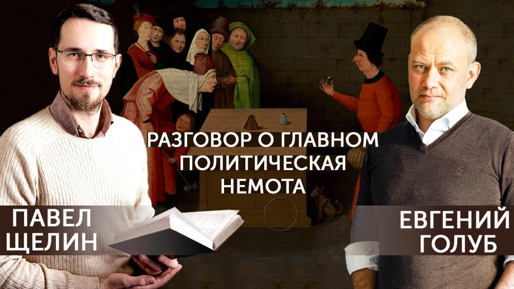

# Разговор о главном. Политическая Немота

03 августа 2023 [Аудиоверсия](https://www.youtube.com/watch?v=GCW_G8GIDBo) 01:06:19

По непонятной технической причине возникла проблема со звуком, и Евгения очень плохо слышно!
Приносим свои извинения за неудобства и рассчитываем на ваше терпение.
В будущих выпусках исправим эту проблему.

Представляю вашему вниманию новую беседу с Евгением Голубом.
Предмет обсуждения прост - "Почему сегодня разговор о политике превращается в бессмысленное толчение слов в ступе, и что и  когда было утеряно на пути контакта между миром и тем, как мы его называем".

**П.Щелин:**
Здравствуйте, уважаемые зрители канала Павел Щелин.
После долгого перерыва относительно, вот предлагаю вашему вниманию новое видео в формате моей беседы с уважаемым Евгением Голубом, моим соведущим по многим выпускам, соавтором подкаста «В поисках смысла», первый сезон которого вы можете посмотреть по ссылке, прикрепленной в описании к этому видео, а второй сезон будет этой осенью.
Мы над ним будем работать уже скоро.

Сегодняшняя наша встреча проходит в формате немножко отличном от, я бы сказал, большинства видео на моем канале, потому что чаще всего это все-таки происходит в формате полулекционном, пусть с моментом общения с уважаемым Евгением, но там присутствует мощная лекционная, скажем так, составляющая.
А сегодня бы, по сути, мне просто хотелось бы порассуждать вслух над теми вопросами, которые, мне кажется, являются самыми важными для настоящего момента, и при этом именно в силу своей самой такой сущностной важности, они, по сути, полностью-то и незаметны.
И это рассуждение, скорее, будет ближе не к формату человека уверенного, уже все проработанного, уже все выясненного, а скорее в формате такой дружеской кухонной интеллигентской беседы.

**Е.Голуб:**
Дорогие друзья, я в своем лице воплощаю заинтересованную аудиторию, заинтересованных слушателей Павла, которые хотят искренне понять, что он говорит, о чем он говорит.
И если моего багажа знаний недостаточно, то я буду задавать вопросы, уточнения, обобщения для того, чтобы вы, как и я, могли быть уверены, что мы понимаем Павла.

**П.Щелин:**
А я еще надеюсь, что ты будешь реагировать, то есть с какими-то всплесками живого интереса к той или иной проблематике.

Но это было все длинное предисловие, до сих пор не понятно, о чем, собственно, мне хочется сегодня с тобой общаться.
Общаться мне хочется о том, что для меня является как для человека, работающего со словами, с мыслью, со знаками в каком-то ключе самым важным, а именно о том, что на настоящий момент, если мы работаем со средствами массовой информации, начиная от самых желтых газет, до самых выдающихся наблюдений различных исследовательских институтов, то, на мое сугубое мнение, невозможно не чувствовать проблему разрушенного языка.
Другими словами, слова произносятся, тексты пишутся, даже какой-то анализ делается, а смысл не производится, потому что как будто сам язык описания происходящих процессов, реальности, ей полностью неадекватен.
В итоге получается какая-то бесконечная бессмыслица.

Разрушено, на мой взгляд, именно фундаментальнейшее свойство аналитики, а именно взаимодействие с тем, что есть, или даже конструирование чего-то иного на основе того, что есть, а вместо этого, по сути, имеется какая-то бесконечная форма магического заклинания без реальной магической силы.
Вот в таком состоянии я нахожусь.
Это влияет.
Я могу сказать, почему это влияет.

Потому что такое взаимодействие с миром помещает человека в состояние бесконечного двоемыслия.
Бесконечное двоемыслие – это бесконечная шизофрения.
Ну, то есть в конечном итоге это приводит к нездоровому психическому состоянию.
И знаешь, мне можно было бы еще сформулировать, махнуть рукой и сказать, да ладно, это все попытки хитрой такой манипуляции, как мы описывали.
То есть надо просто массой манипулировать, а на самом деле это люди наверху все понимают.

Но вот в последнее время у меня все больше и больше складывается ощущение, что подобные саморазрушительные процессы невозможно локализировать на самом деле, и как среда они начинают поглощать все вокруг себя.
Это слишком разрушительная среда даже для тех, кто формально должен заниматься манипуляциями.
По крайней мере так я это вижу.

**Е.Голуб:**
Другими словами, что если мы предположим, что изначально вот этот пустой язык предназначался для оболванивания, манипуляции массами, мы говорили об этом в одной из наших встреч, то сейчас эта пустота достигла такого уровня, когда этот язык уже не способен быть средством передачи какой-либо объективной информации, настолько он уже пустой.

**П.Щелин:**
Да.
Я вижу именно это, и тогда получается ситуация, как в семейных отношениях, что хуже всего отношения невынесенные, клонящиеся к разрыву, но по наружности сохраняющие вид доверия и дружбы.
То есть ощущение того...
Именно здесь в данном случае, отношения между реальностью и тем языком, который реальность описывает.

Мы делаем вид, что мы можем что-то еще понимать в происходящих моментах, но на мой взгляд, пока мы сохраняем отказ от работы с феноменами, какие они есть, и отказываемся от смелости называть эти феномены такими, как они есть.
Мы только углубляем и только усиливаем масштабы катастроф нынешних и катастроф грядущих.
В каком-то смысле получается лишь дополнительное усиление энтропии, усиление хаоса, и усиление саморазрушительных тенденций для человека, для общества, для более, скажем так, даже больших, скажем так, международных организаций, если угодно, и так далее, и тому подобное.
И с этим придется работать.

**Е.Голуб:**
Примеры.

**П.Щелин:**
Ну, я сейчас дойду до примеров.
Допустим, одним из таких для меня важных примеров является вся проблематика общественной жизни.
Что мы имеем?
Что мы имеем, как базовый, условно говоря, юнит современного анализа?

С точки зрения формальности мы все вынуждены говорить о том, что у нас есть граждане и государство.
Причем все граждане идентичны и взаимозаменяемы.
Что такое государство, на самом деле, в этом контексте не особо понятно.
И что такое гражданин, тоже не особо понятно, потому что это слишком большое множество, которое, по идее, должно объединять в себе абсолютно всех.
Но из опыта данности мы знаем, что оно прекрасно так не происходит.

Мы можем, конечно, заниматься очень долго самообманом, но мы прекрасно понимаем фундаментальную какую-то неоднородность любого общественного объединения.
Оно явно состоит из каких-то групп.
Но эти группы даже не могут быть описаны и выражены на хоть каком-то языке, который бы имел познавательную ценность.
Давай выберем самую нашу главную, мою любимую группу в этом положении.
Эта группа называется сегодня «Элиты».

Положение элит с точки зрения современного политического языка, это такая кошка Шрёдингера.
Потому что она одновременно есть, очевидно, что она есть.
Про них даже говорят.
Называют элиты такие, элиты сякие, эта элитная группа, эта элитная группа.
Но в реальности-то ее нет.
Ты ее никак не можешь обозначить, идентифицировать.
Формальных статусов у элит нет.
Никаких у них нет формальных статусов.

У них нет, условно говоря...
Примеры более адекватных языков.
Находясь в средневековье, ты понимал, что есть, допустим, сословие с четко выраженным юридическим статусом и с определенными своими предпосылками, с определенными своими природами, с обязанностями, взаимодействиями, то сегодня ты никак это выделить не можешь, потому что у тебя есть только граждане, все формально равны.
Элиты нет, но она есть.

И вот это именно то состояние, для меня вот этот ключевой момент.
Чего-то нет, но оно есть.
Что ты про этот момент думаешь?

**Е.Голуб:**
Что привыкли говорить?
Олигархия, олигархи.

**П.Щелин:**
Прекрасно.

**Е.Голуб:**
Одна из групп, которая фигурирует.
Некие олигархи, которые покупают депутатов, покупают политические силы и начинают влиять на политику.
Эта группа сегодня существует.

Иногда говорят о семьях, о том, что некоторые семьи связаны между собой, управляют общественными процессами.
Но это все, конечно, очень, очень жидко.

**П.Щелин:**
Ты прям сразу копнул в самую глубь, потому что можем перейти сейчас к другим примерам.
Ты заметь, сразу же ты начинаешь говорить слова, которые имеют в разы более понятное и в разы более осмысленное отношение к реальности.
Семья и олигархия.

С олигархией отдельно понятно, что олигархия в нынешнем виде это опять-таки пустое множество, потому что непонятно, что это такое.
Это просто очень богатый человек?
Нет.
Очевидно, что это очень богатый человек, который пытается влиять на политику.
Можно попробовать где-то такое высказать определение.
Но оно тоже недостаточно, потому что его как бы нет.
У вас нигде в законе олигарх не прописан.
У вас нигде на социальных уровнях нет этого олигархического статуса.

И с точки зрения формальной, интересы этого олигарха равны интересам сантехника дяди Пети.
По идее, вы декларируете, что у вас такая система.
Но очевидно, что такая системы, ее нету.
Ее быть, больше того, не может.
Но, как бы, вот это опять состояние.
Оно есть, но его нет.

И вот это я называю разрушение политического языка.
Потому что мы сразу окажемся в ситуации двое, трое, пяти, шестидесяти мыслия.
Как можно мыслить альтернативно?

Ну, возьмем примеры, все-таки, скажем так, чуть более древние, но отсюда не меняющие...
Тут важен сам подход.
Возьмем пример Древнего Рима.
У нас половина политических концепций заимствованы, ну, большая часть политических концепций заимствованы из Рима и Греции, поэтому работа с этими концепциями, на мой взгляд, имеет в разы большее отношение к проблематике жизни, чем может показаться на первый взгляд.
И что мы тогда увидим?

Социальная структура Древнего Рима была в разы более сложной с точки зрения формальности, с точки зрения описания и слов, но при этом, как мы увидим, не сильно-то сложнее того, что мы имеем сейчас.
Что у нас, имеется в виду, было в Древнем Риме?
Если брать совсем Древний Рим, то у нас есть так называемые патрицианские семьи.
Вот слышим олигархи такие большие, сразу возникает определенный образ.
Но что это было-то изначально?
Кто такие были патриции сами по себе?

И внезапно оказывается, что патриции в данности своей, это не более чем главы тех родов, то есть семейных групп, которые первые заселили район Рима.
И тогда сразу возникает, понятно кто они, откуда они, почему они взялись и почему они претендуют на свой особый статус.
Условно говоря, мы тут всегда жили, земля наша, нам земля принадлежит.
Мы тут первыми поселились, нам земля принадлежит.

Глава чего патриции?
Патриция – глава рода, gentle, gente.
И человек – это свой, это родственник.
Даже как однокоренные слова у тебя получаются.
Род, родственник, человек в данном случае.
А кто же тогда остальные?
А вот остальные оказываются пришлыми людьми, которые постепенно, со временем, создают не совсем людей, они создают население.
Плебс.

И тогда сразу возникает...
Понятно, что у тебя есть группа, которая в силу определенных причин обладает претензиями на особый статус.
Это и отношения исторические, это отношения владения.
Очень важный момент.
Именно этим родам де-факто принадлежит вся собственность, которая имеет хоть какую-то ценность, хоть какое-то значение.

В рамках этих родов есть ядро рода, то есть непосредственно родственники.
Есть те чужаки и те части плебса, которые так или иначе присоединяются к этому роду.
Ну, в силу вот отношений, в том или ином отношении зависимости.
Это называется очень хорошим словом клиенты, клиентелла.

У тебя есть, опять-таки, социальная группа, которая не обладает собственной возможностью для полноценного субъектного действия, банально, у нее собственности нет ценной.
У нее нет ни ценной собственности, ни опыта взаимодействия с длинными, скажем так, историческими процессами.
Но она присоединяется к тому...
Но она существует именно поэтому в отношениях зависимости с теми, соответственно, у кого оно есть.

И опять-таки, замечу, что очень важно здесь, именно сам принцип, что лежит в основе.
Очень понятные вещи.
Свой.
Причем понимаемый буквально.
Свой это родственник.
И чужой, который не родственник.
Вот это чужой.

**Е.Голуб:**
Насколько я помню, даже были специально разработаны правила, когда люди, состоящие в отношениях клиент-патрон, по-моему, да?

**П.Щелин:**
Да.

**Е.Голуб:**
На них вводились определенные ограничения при голосовании за выдвижение на должность.
Если есть такие связи, они были официальными, то также официально существовали определенные рамки и правила, ограничения, как функционировать в той политической системе.
Когда я об этом узнал, меня это очень удивило.

**П.Щелин:**
Абсолютно, конечно.
Потому что тогда сразу и возникает, понятно, что происходит, какое место.
Опять-таки, во-первых, сразу возникает...

**Е.Голуб:**
Язык отражает реальность.
Когда описание процессов соответствует реалиям, то тогда ориентироваться значительно легче.

**П.Щелин:**
Абсолютно.

**Е.Голуб:**
И, видимо, именно тогда и правила становятся понятными, и они, наверное, становятся более рабочими.
А у нас пока что, за исключением понятия внутреннее государство, никто ничего дальше не...

**П.Щелин:**
Даже понятия нет, даже...
Я с тобой, извини, что перебил, но ты прав.
Да и такого понятия нет, что такое внутреннее государство.
Ну что это такое?

**Е.Голуб:**
Вот эти патриции, которые сидят и дергают за веревочки.

**П.Щелин:**
Так они и не патриции, в том-то и дело.

**Е.Голуб:**
Не патриции, бюрократы наследственные.

**П.Щелин:**
Так они не особо тоже наследственные, то есть это вообще вот эта идея, то есть мы до этого дойдем немножко, может быть, в будущем, потому что это вообще возникает из другой области проблематики менеджерил-стейт, к ним вообще применим более...
Там вообще нужно вводить другую систему координат, чтобы, на мой взгляд, внести хоть какую-то осмысленность, и я тебе предложу в конце, вот чтобы, какую систему координат, у кого можно позаимствовать, чтобы какой-то смысл в это внести.

Давай договорим про Рим и патрициев немножко, потому что это связано с политикой.
Если мы вспоминаем Рим, то что у нас получается...
Кто царят скидывает?
Условно говоря, если у нас изначально был период царский, а потом был период республиканский в Риме.

Царя скидывают патриции, царя скидывают аристократы.
То есть получается...
Но они это скидывают не ради народа, как мы бы сегодня сказали, то есть не ради всей массы населения, которое населяет Рим, а ради людей.
Но опять-таки, по этимологии, люди в Древнем Риме, вот в буквальном этом смысле, хотя в современном итальянском это по-другому, это только члены рода.
Этот список людей, ради которых царь скидывается, прилагается.

И тогда сразу понятно становится, что такое политика в таком реальном контексте.
Политика — это борьба между родами и между патрициями за реальную власть внутри себя самих, а не, условно говоря, то, что мы думаем, когда мы сегодня говорим о политике.
Потому что, что такое сегодня политика, мы даже сказать это не можем.

Мы не можем сегодня сказать, что политика – это борьба родов за власть.
Хотя этот элемент де-факто гораздо более присутствует в том, что мы сегодня видим.
Может быть, это мне кажется, поправь, если я что-то не понимаю.

**Е.Голуб:**
Давай я откликнусь.
Я думаю, что существует...
Да, давай, и думаю вслух.
Роды, безусловно.
Опора на родственников, по крайней мере, в той среде, которую я знаю, очень важна и преобладает.

И клиентелла как часть рода.
И какие-то горизонтальные связи.
Скорее мы можем говорить о группировках, о некоторых группах, объединенных различными историями или интересами.
Да, скорее всего, что-то такое в широком смысле понятия рода.

**П.Щелин:**
И, я добавлю, если мы говорим, если мы вспоминаем, и все равно, и есть плебс.
Плебс никуда не делся.
Есть плебс как население.
Плебс именно как население.

**Е.Голуб:**
Электорат.

**П.Щелин:**
Одно из самых ненавидимых мною слов это электорат.
В Риме хотя бы честнее было.
Вот опять вопрос о честности.

Я сейчас пока даже не вношу нормативных оценок, какое устройство лучше и хуже.
Я просто вношу...
Мне важна сама ясность понимания и честность слов по отношению к действительности.
Вот слово плебс в разы честнее, чем слово электорат.
Хотя ты абсолютно прав, функция-то его не изменилась.
Потому что функция плебса в древнем Риме, это как раз по сути что?

Это просто инструмент давления.
Очень важно, его со счетов действительно нельзя сбрасывать, оно тебе нужно, потому что именно с помощью плебса, как при помощи дубинки или просто при помощи вот физического...
Условно говоря, вы собрались родами на какое-то собрание, сходку.
Принимать некое решение.
И один из вас приводит толпу этого самого плебса.
Они начинают громко кричать, громко топать, там, типа, Юлии правы, даешь Юлиев и так далее.

И через это один род давит на другой род.
И в принципе-то функция-то вот эта, она как бы гораздо более точна в реальном мире.
Но то, что вы используете что-то как давление, не означает то, что это что-то внезапно начинает обладать субъектностью или внезапно начинает обладать истинной властью.

Но при этом и другая крайность есть.
Нельзя это полностью игнорировать.
У нас оказывается очень странное вот это состояние, в котором пребывает огромное число населения, в котором их существование очень функционально, я бы так сказал.

**Е.Голуб:**
Инструментально.

**П.Щелин:**
Действительно, инструментально.
И тогда мы можем даже проследить развитие этой линии, если мы пытаемся оставаться в такой логике.
Плебс эволюционируют в массу, а массы эволюционируют в толпу.
И тогда понятно, что такое любая революция.
Любая революция – это когда группа патрициев против высшей власти при помощи толпы.

**Е.Голуб:**
Как-то большевистская революция, мне кажется, туда не очень укладывается.

**П.Щелин:**
Наоборот, как раз большевистская революция укладывается туда прекрасно, именно по той причине, если ты вспомнишь великолепный исторический анекдот, не в смысле шутка, а в смысле реальное событие, то, что на первом заседании РСДРП, рабочей партии, присутствовал один рабочий, и тот был агентом охранки.

**Е.Голуб:**
Нет, ну РСДРП, ладно.
Но февральская революция, наверное, да.
Но октябрьский переворот...

**П.Щелин:**
Так это именно переворот.
Он даже называется переворотом.

**Е.Голуб:**
Окей, то есть мы будем называть его правильно, переворотом, не революцией.

**П.Щелин:**
Так и февраль был.
Ну, то есть это, по сути, все переворот.
Очень сложно...
Тут вообще очень сложно проводить различия.
И я сейчас не пытаюсь дать полностью оценку.
Но тут важно понятие смысла.

То есть даже, может быть, оно было в этом случае чуть по-другому.
Но общий вектор скорее ближе к такому описанию, чем вот эта идея, так сказать, внезапно зародившегося самосубъекта, который внезапно самореализует собственную волю.
И при этом что?
И при этом потом куда-то исчезает в этот же момент, который тоже продолжает существовать в состоянии Шрёдингера.
Он как бы есть, но его абсолютно как бы нет.

Возьмем пример другой, из другой эпохи тоже.
Немножко другой эпохи, но связанные контексты.
Любимая наша демократия, именно как слово.
То есть что такое...
Давайте опять начнем с очень простой вещи.
Что такое Demos?
Буквально?

**Е.Голуб:**
Жители Демы.

**П.Щелин:**
Вот хорошо, очень важный момент.
Жители Демы.
Что такое Дема?
Дема это не весь город, это часть.

**Е.Голуб:**
Это административная единица некоторая.

**П.Щелин:**
Это не только административная единица.
На самом деле, культурно-исторически, Дема это производная от Фила, родственного объединения.
Родственного опять объединения.
Список населения Дема прилагается.

Там, условно говоря, население Дема, это мы бы сейчас сказали, ну вот, это те, кто живут за городскими стенами, с рабами, владеют рабами, и в таком количестве...
Собственно, давай еще раз.
Рабы и земля, то есть активы, давайте так скажем, владеют ценными активами.
И очень важно, что вот чем, допустим, греческая модель была сложнее и уже, чем та же римская, то что демо ограничено числом людей, которые, ну, то есть их число, естественно, ограничено, то есть они должны быть способны вместе собраться и быть услышанными друг другом.
То есть это очень небольшая на самом деле группа населения, даже просто технически.

Потому что точно так же демо может привлекать остальных, которые охлосы, простите, для того, чтобы оказывать давление на принятие решений тоже с помощью крика, давления и прочего.
Если брать в широком смысле славянскую русскую историю, то примерно такое происходило в городах.
Вот если помнишь, на Вече, условно говоря, у тебя есть боярские роды или какие-то другие группы.
И они заранее подбивают толпу, чтобы в нужный момент та начинала громко кричать.

**Е.Голуб:**
Да, так есть.
Я помню описание новгородского вече, как там были специальные десятники, которые организовывали хлопальщиков, топальщиков.
И такое же было и в Греции древней.

**П.Щелин:**
Абсолютно.

**Е.Голуб:**
Всегда создание впечатления народного возмущения или народного ропота, или наоборот народного приятия, это было технологий всегда.
Об этом мы знаем из источников, из описаний.
Ничего нового.

**П.Щелин:**
От Плутарха до летописей, абсолютно.
Это никуда не меняется.
Это структурная вещь.
Опять-таки слово демократия не имеет ничего...
Есть дифференциация, очень важно.
Нет ни одного реально исторического, концептуального, кроме нашей современности, периода, когда на уровне языка невозможно ничего дифференцировать.

Я повторюсь, мы можем четко на уровне языка в Греции и Риме проводить осмысленную дифференциацию, кто есть кто, кто чего хочет, ради чего он хочет и так далее.
Забегая вперед немножко, ну, точнее, забегая вбок, просто интересный факт, но это надо понимать.
Например, проблема демо и демократии заключается в чем?

Во-первых, она немасштабируема.
Очень важный момент.
И любое городское вече тоже не масштабируемо.
Это не масштабируется вообще никаким...
Ну, то есть это очень ограниченные штуки, очень ограниченное пространство людей.
Просто опускаем эти вещи.

А мы сейчас внезапно оказались в ситуациях, когда даже самое маленькое государство, оно по размерам в сотни раз больше любого греческого полиса.
Ну, за исключением там условной Андорры и условного Сан-Марино.
Хотя вот как раз Андорра и Сан-Марино это размер полиса примерно.
Крупного причем полиса, я добавлю.
Уже условная Венгрия, это уже слишком много.
Я молчу обо всем остальном.
Мы вообще должны понимать.

Но второе даже еще более интересное.
Кто главный враг для демократии?

Удивишься.

**Е.Голуб:**
Аристократия.

**П.Щелин:**
Аристократия, но в ее понимании даже более таком совсем прямом.

Лучшие.
Враг демократии это лучшие.
То есть любой, кто выделяется слишком сильно из этой системы.

И именно отсюда, допустим, возникает великолепный институт остракизма.
Если мы посмотрим на списки тех, кто был подвергнут процедуре остракизма, это не были какие-то моральные уроды, которые вредили обществу.
Они были все лучшими.
Полководцы, которые спасали город, великие философы, лучшая часть демо, которая внезапно стала слишком...
Ну, то есть, он своими достоинствами стал слишком выделяемый и слишком значимый.

**Е.Голуб:**
Получается, что механизмы демократии подразумевает некоторое уравнивание, и любая выдающаяся личность подозревается в потенциальной возможности или способности узурпировать власть и тем самым поставить под угрозу существующую систему.
Ну, как бы логично.

**П.Щелин:**
Абсолютно логично.
Причем очень тонкий и важный момент — узурпировать власть при помощи кого?

Вот здесь возникает настоящий важный треугольник.
При помощи охлоса, при помощи пресловутого народа, при помощи пресловутого населения.
И возникает более осмысленный реальный треугольник.

Патриции, демы, аристократы.
Те, кто чем-то владеет, назовем это так, то есть высшие собственники или применительно к украинскому политическому контексту - шляхта.
Против царя, ну или монарха, царя, высшей власти, короля, называйте это как хотите.
И народ, как население, но не народ как то, что мы называем это сейчас, а то население, которое владеет самим собой, но реальными активами не обладает, но может быть использовано чисто в качестве своей массы, как инструмент давления.
Оно само по себе является ресурсом.

**Е.Голуб:**
Другими словами, если выдающаяся личность получает ресурс влияния за счет своего авторитета, реально добытого, добытого какими-то действиями, реальными поступками, то вот этот ресурс, может быть, неосознаваемый или даже который не планируется использовать, ресурс влияния через охлос, этот потенциал становится опасным для демо, для вот этих собственников, и поэтому такой человек должен быть либо нивелирован каким-то образом, либо изгнан.
Ну, в общем-то, да, я думаю, что...

**П.Щелин:**
В рамках демократической модели.
Тут по-разному может быть, но в рамках демократической, как раз оригинальной демократической модели, которая не изменилась, оно именно так и есть.

Но опять, обрати внимание, пока мы остаемся, мы все просто сейчас накидываем, это не то, что я говорю, что сейчас происходит точно так же, я просто показываю то, что разные политические языки обладают разной познавательной ценностью.
То, что мы сейчас используем, оно все равно гораздо ближе даже к нашим нынешним реалиям, а уж подозреваю для реалий пресловутой Древней Греции этот язык был более чем адекватный для реального описания того, что происходило между ними.

**Е.Голуб:**
Пришло в голову.
И ведь сейчас то же самое.
Как только какая-то политическая фигура, деятель начинает приобретать авторитет, не хочется приводить конкретные примеры из наших сегоднях реалий, в силу, например, военных заслуг.

**П.Щелин:**
Очень важная категория, да.

**Е.Голуб:**
То этот человек, мы можем сейчас мысленно назвать фамилию, сразу становится неугоден, опасен, на него ищут компромат, и это сегодняшний способ его подвергнуть остракизму, изгнать, убрать ресурс.

**П.Щелин:**
Очень логично.
Более того, мы просто как анонс, вот то, что я предлагаю делать во втором сезоне нашего подкаста, в том числе это смотреть, обращаться к тем источникам, в которых живой политический язык сохраняется.
И могу сразу сказать анонс.
В качестве одного из первых таких источников будет биография Гая Мария, составленная Плутархом, которая, на мой взгляд, имеет отношение к нашей нынешней, сегодняшней реальности в разы больше, чем всё творчество современных СМИ, включая мое собственное, вместе взятых, я вам по-честному скажу.
Если не хотите ждать, сами берите Гая Мария, именно жизнеписание Гая Мария от Плутарха и расставляйте, соответственно, по персонажам.
Абсолютно ничего не изменилось.
Но вернемся к нашим другим баранам.

Во-первых, еще важно вспомнить вот из этого римского примера все-таки понимание клиентелы, и опять вспомнить по принципу, что опять важно.
В основе лежит не некая какая-то абстракция типа нации или некая абстракция типа гражданина, который...
Что такое гражданин, вообще непонятно сразу.
А вот в основе лежит кровь.
И владение землей конкретно.
И это понятно.

Понятно, откуда вы начинаете выстраивать свою всю политическую, условно говоря, систему, политическое мировоззрение, политическую концептуальную рамку.
Тут, кстати, очень интересный вопрос, который тоже люди могут сами себе задать.
Наши демократические граждане.
А кто вы будете по римским меркам-то сегодня?
Очень хороший вопрос.

Кто сегодня владеет любыми активами, имеют реальную ценность, так или иначе?
Тогда кто в рамках этой системы оказываетесь вы?
Это очень важный такой момент.

И более того, здесь я сразу могу пробрасывать, тут может вообще возникать вопрос, что даже олигархи, которые формально являются, даже те люди, которых мы называем олигархами в современных условиях, в странах периферии, в широком смысле этого слова, они даже не являются патрициями в полном смысле этого слова.
Даже они выступают, по сути говоря, в клиентских отношениях к тем институтам, которые реально владеют их активами.
Или на чьем одобрении, на чьем, скажем так, молчаливом согласии держится их владение этими самыми активами.

То есть вообще оказывается парадоксальная ситуация, что в огромном количестве государств даже собственных патрициев нет.
А есть только клиенты побогаче и плебс победней.
По римским меркам.

**Е.Голуб:**
Послушай, мне очень понравилась эта мысль.

Ведь действительно, фактически, то есть формально, легитимизирует власть народ, да?
Охлос, граждане.
Но фактически, решение, кого легитимизирует народ, принимает не народ.
И зачастую даже в сегодняшних реалиях решение принимается не внутри государства, а снаружи.
Кто хороший, кто правильный, кто неправильный.
Это отдельный разговор.

**П.Щелин:**
Тут важен сам принцип.
Мы пытаемся подняться над частностями.

**Е.Голуб:**
Обнулить любого претендента на местного патриция ничего не стоит.

**П.Щелин:**
Ну вон у нас далеко не ходить, вон вам Нигер.
Там вот вообще происходят процессы очень...
Это, конечно, не патрициат, но ситуация-то очень интересная.
Там же в чем весь основной конфликт возникает?

Есть население, как вот этот охлос-плебс.
Вот сейчас появилась, условно говоря, группа вооруженных людей.
Это даже не патриции, это просто, ну, в каком-то смысле можно назвать их аристократами, с чисто формальной точки зрения, как люди, владеющие оружием и умеющие им пользоваться.
И внезапно оказалось, что государство на бумаге есть, а элиты собственной в нем нет, патрициев собственных в нем нет, а государство есть.
И вот это, например, вторая принципиальная ложь, которая мешает вообще любому осмысленному разговору о всех происходящих в мире событиях, это убеждение о том, что все государства равны и в каком-то смысле идентичны.
Что очевидно.

**Е.Голуб:**
Равнозначны.

**П.Щелин:**
Равнозначны, да.
А оно так по природе быть...
Ладно, если бы оно было по природе, тут можно спорить о том, возможно ли это в принципе.
Но как минимум сейчас-то его точно нет.
Если у вас в государстве нет возможности держать собственную элиту, то вы клиентское государство.
Но клиент по определению не может находиться с патроном в отношениях иных, чем в отношениях зависимости.
И он не может быть юридически равен патрону.
Ты понимаешь, насколько большая проблематика возникает, да?

А языка, чтобы выразить эти отношения, у нас нет.
Это же тоже очень важно.

**Е.Голуб:**
Его нет не просто так, я думаю.
Отсутствие языка призвано скрывать реальность, как она есть.
Имитировать нечто другое, чего нет.
Но что продается как некая существующая система, в которой якобы работают некоторые законы и правила, которые на самом деле не работают.

**П.Щелин:**
Ну, согласен.
Тут, на мой взгляд, все-таки произошло чуть-чуть посложнее.
Я не буду, знаешь, как это, теория заговора, теория заговора.
Иногда все происходит естественным образом.
Все-таки, как это...

**Е.Голуб:**
Я не говорю про теорию заговора.
Стоп, стоп.
Побойся Бога.
Я говорю о том, что в силу разных причин мы пришли к этой ситуации.

**П.Щелин:**
Да, вот.
И тут интересно вспоминать, откуда все-таки один из источников прихождения нашего к этой ситуации.
Именно в том, потому что мы косвенно к нему уже...
Косвенно мы его уже затронули.

Возвращаемся про наш любимый треугольник народ, аристократия, высшая власть.
Ну, можем называть его монархом.
Так или иначе, она есть.
То есть, опять, высшая власть нужна.
Например, даже в модели римской и греческой происходит выделение высшей власти на какой-то срок.
Просто там эта высшая власть, она не передается по наследству, она временно, присловутые консулаты.
Два консула на период, по-моему, до двух лет, либо год, либо два года они там находятся, но все равно в этот момент они создают третью палку треугольника.
Очень другим способом, чем в монархии, но все равно в этот момент возникает этот треножник.
Потому что там, правда, чуть больше, там еще из плебса можно выделить трибуна, который как бы тоже немножко влияет на эту ситуацию, но тоже другим способом.
Но все равно система в этом плане оказывается более-менее устойчивой.

Так вот, вся наша политическая система, весь наш политический язык родом из либерализма, из рода либерального проекта.
Но тут надо понимать, в чем был либерализм.
Вот именно в его властном прикладном понимании.
Он, конечно, ни про какую не про свободу был.
Он был про освобождение.
И тут надо понять про освобождение кого?

Аристократии.
Либерализм это идеология освобождения аристократии от ответственности перед высшей властью.
И, соответственно, даже перед плебсом, потому что очень интересный момент, в тот момент, как только аристократия сбрасывает с себя ответственность перед высшей властью, она вообще теряет всю ответственность перед даже самым плебсом.

Ей плебс-то не нужен, по-хорошему.
В идеале это лишние для аристократии люди.
Их более разумные отношения просто мы и клиенты, и мы разбираемся между собой.
А вот это то, что возникает, всякие чужаки и пришлые инородцы, ну просто люди расплодились какие-то внезапные, которые вроде не наши, а они тут есть.
Ей по сути своей это не надо.

**Е.Голуб:**
Для осуществления политической власти не нужно.

**П.Щелин:**
Да, да.
Да и для экономической деятельности.
У них и так уже ресурс по большей части есть.
И есть те клиенты, которые так или иначе...
И есть те, кто находится с ними в прямых созависимых отношениях.
Так или иначе.
То есть в зависимости от актива.

Здесь, правда, я согласен, в зависимости от конкретного ресурса, исторической эпохи, актива, может меняться ситуация.
Но в рамках общего подхода особой заинтересованности-то у них в этом нет.
Ну а что провозглашает либерализм?

Либерализм провозгласил, прежде всего, освобождение аристократии от ответственности перед государством, перед монархом и перед народом.
Вот реально, что он провозгласил.
Через пресловутые индивидуальные права.
Не поменяв никаким образом, разумеется, систему собственности, не поменяв никаким образом систему отношений, он именно провозгласил вот это самое.

И хуже того, ради этого он совершил догматическую революцию, поставив в основу своего анализа то, что не существует в природе.
То, что не существует в социальной природе - атомизированного индивида.
Атомизированного индивида в социальной природе не существует.
Это, условно говоря, знали греки, человек это социальное животное, знали в принципе...
Любую политическую теологию или политическую философию, возьмите, до либерализма, все исходят из того, что человек так или иначе, он не полностью атомизирован.
Он все равно находится в отношениях с другими людьми.
Он людям нужен, и люди ему нужны.
И, соответственно, так или иначе, нужно смотреть на это как некую целостность.

А либерализм проводит революцию и начинает ставить всю свою политическую доктрину, повторюсь, на том, чего не существует.
Может быть, ладно бы, если бы это существовало.
Тут можно спорить, хорошо это или плохо.
Но проблема в том, что вот такого атомизированного человека не существует в принципе.
И в итоге они ставят в свое основание то, что противоречит всему предыдущему накопленному историческому опыту.
Это же очень важный момент.
Что, кстати, в принципе неудивительно, учитывая то, что одно из ключевых понятий в либеральной политической теологии – это чистая доска пресловутого Джона Лока, "табула раса".

То, что, условно говоря, вот рождается человек, и на нем можно написать вообще все, что угодно.
Вообще нет никаких условий, которые на него каким-то образом повлияют.
Но по опыту...
Даже из опыта понятно, что оно не так.
То есть как бы из любого социально-политического опыта понятно, что оно не так.

В итоге уже создается вот на этом уровне разрыв.
Если у нас в основе всего нашего политического мышления то, чего нет, то понятно, что по сути нам нужно создавать параллельную систему смыслов, чтобы каким-то образом в эту параллельную систему вписывалось.
А жить мы продолжаем потому, что есть.
Роды как были, так и остались.
Отношения кровно-родственные как были, так и остались.
Отношения взаимосвязи власти, собственности и зависимости как были, так они и остались.

Но мы говорить о них теперь нормально не можем.
Нам приходится вечно...
Нам приходится перманентный, условно говоря, симулякр создавать.
Понимаешь, что меня тревожит именно и что, скажем так, на мой взгляд является критическим?
И почему это является критическим для текущего момента?

**Е.Голуб:**
Потому что ты не можешь управлять тем, с чем ты не можешь осуществлять связь обратную, взаимодействовать, если тебе нет объектов в языке или система, которая выстроена на неадекватной реальности, то ты приходишь в результате к коллапсу.

**П.Щелин:**
Именно.
В том-то и проблема.
Хуже того, этот коллапс становится как бы самовоспроизводящимся именно потому, что даже условно то, что мы называем элитой, ну, условно говоря, сегодня президенты, премьер-министры, даже у них нет языка, то есть даже они вынуждены постоянно находиться в ситуации двоемыслия.
Какой-то язык у них точно есть, на котором они реально решают вопросы, условно говоря, давайте переводить, то есть есть какие-то слова, термины, поля смысла, в рамках которого они решают вопросы и делают дела.
Но при этом, я глубоко уверен, даже внутри них самих этот язык не полностью легитимизирован, потому что все равно их постоянно окружает другой язык.

И в итоге накладывается вот эта множественность, условно говоря, языковая, которая ну просто и так систему, которая резко усложнилась, делает вообще критически сложной.
То есть в ней просто такая перегрузка сложностью начинается, помноженная на объективную, скажем так, когнитивную боль людей, которые вынуждены жить одним образом, а думать по-другому.
Это просто как кипящий котел с закрытой крышкой, если угодно.

**Е.Голуб:**
То есть то, что я привык считать лицемерием, которое пронизывает все современное общество, я имею в виду современное, давай назовем западное общество, слои лицемерия.
Ты говоришь о том, что это неизбежно в связи с необходимостью совмещать концепты, которые декларируются, и реальное решение задач, которые, ну, которые, в общем-то, никуда не...

**П.Щелин:**
Да, причем, заметьте, я бы даже накинул еще больше.
Концепты-то живут тоже своей жизнью.
Не надо думать, что это люди очень умные.
Они сами этими концептами пользуются, потому что им кто-то в университете это рассказал.

Мы учились в университетах, я учился в разных университетах.
Я же понимаю, как это происходит.
Вам все равно, ну, психика мозга так работает.
Вам что-то рассказали, эти концепты у вас уже проникли.
Вы все равно каким-то образом будете пользоваться.
Происходит естественным образом их эволюция, а рефлексия по поводу слов вообще присутствует на очень маленьком уровне.
Это вообще естественное состояние.
Ну, люди делом заняты.

И вот здесь возникает вопрос.
Проблема реальной-то жизни тоже никуда не делась.
Дела-то все равно делать надо.
Вопросы-то все равно надо решать.
У вас получается принципиальный же конфликт между тем языком, который вы выучили, и тем, как сама практика жизни, условно говоря, на вас влияет.

И в этом смысле, на мой взгляд, можно смело утверждать, что та система, в которой мы живем, ты уже правильно сказал, как последнее развитие макролиберальной системы, она, возможно, обладает рядом достоинством.
Допустим, материальное благополучие в целом, оно действительно вроде создает на порядок лучше.
Но она однозначно самая лицемерная система, которая у нас когда-либо была.
Вот здесь ты абсолютно прав.

Это действительно самая лицемерная система, потому что она не позволяет говорить о том, что реально происходит.
И через это помещает вообще весь политический дискурс в состояние бесконечного сумасшедшего дома, в котором...
Уже к нынешнему моменту, потому что мы находимся на поздней стадии этого процесса, реально могут преуспевать, ну, только, как это правильно сказать, ну, скоморохи.

Вот я даже употреблю старое слово.
Только те, кто используют язык для развлечения, для эмоциональной вспышки.
Либо и власть придержающих, и самого населения.
Ну, в общем, эпатажники.
Главное громкий заголовок, который забудется уже через полдня.
Но ты понимаешь, насколько происходит накапливание давления.
Разрушается сама способность мыслить.

Потому что даже люди, которые бы и хотели что-то серьезно обсуждать, у них языка нет, чтобы это нормально осмыслить.
И получается, как только в тот момент они вынуждены использовать слова и смыслы из виртуальности, они оказываются в положении, где, может быть, по-человечески и репутационно они стремятся отличаться от простого скомороха, но сущностно не могут.
Потому что что тот виртуальность описывает, что эти виртуальности описывает.
Понимаешь, что я имею в виду?

**Е.Голуб:**
Для меня это звучит так.

Очень часто люди жалуются на то, что в политику приходят недобросовестные, нечистоплотные, лживые люди.
Потому что ты говоришь, а другие не смогут там выжить, потому что держать в уме несколько пластов реальности, говорить на одном языке, мыслить по-другому, решать вопросы еще третьим образом, для этого нужны особенные свойства, которые целостный человек, видимо, не может в себе сохранить, не может сохранить целостность, оставаясь в этой системе.
Как ты думаешь?

**П.Щелин:**
Абсолютно, конечно.

В политику, в теории, на какое-то время ты можешь производить очень жесткий отбор хотя бы на высшие должности, где у вас будут реально профессионалы, которые смогут это удерживать.
Ну, словственно, наш любимый Бернейс, он, в основном, именно это и предлагал.
Давайте у нас будут самые выдающиеся профессионалы, которые будут заниматься манипуляциями, но они будут способны это удерживать.
То есть, как бы в теории.

Но, во-первых, оказывается, что, повторюсь, вы не можете ограничить саморазрушение.
У вас теперь ваши самые, те же самые профессионалы, они сами уже, полностью этим ядом отравились, и они сами уже не сильно отличаются по уровню мышления, реальной способности взаимодействовать от тех, кем они призваны управлять.
Но то, кого ты описываешь, хуже того.

У нас теперь такие же, условно говоря, пятимыслящие люди приходят в околополитику.
Очень принципиальный момент, в околополитику сейчас, а это, ну, в наших условиях это пресловутая площадка, на которой мы с тобой находимся, YouTube.
Тут отдельно возникает почему, здесь мы вспоминаем наши предыдущие лекции.
Общество массовое, соответственно, все вот эти...
Плеб стал массой, масса стала толпой, причем толпой виртуальной, и вот с этой толпой надо каким-то образом взаимодействовать.
Соответственно, основной элемент взаимодействия с этой толпой это посылание ей вот таких вот сигналов, вот чисто как бьют по нервным окончаниям.
Чистоплотный человек таким заниматься не может, потому что для чистоплотного человека есть такое понятие как репутация.

Он может ошибаться, но ему неприятно постоянно осознанно врать людям.
А получается именно это-то как бы в этой системе-то и остается, потому что все равно нет ценности.
Все равно нет ценности от реального описания происходящих событий.

**Е.Голуб:**
Я все-таки повторю то, что я сказал.
Я думаю, что для чистоплотного человека, я назову его цельного человека, жить в такой шизофренической реальности, когда тебе нужно сознательно транслировать то, что ты знаешь, не является отражением реальности, это тяжело.

**П.Щелин:**
Смотри, извини, что перебью, но сейчас я усилю.
Хуже того, такому человеку еще в разы сложнее.
Почему?

Он это даже сказать не может.
Он это только чувствует.
Потому что языка, чтобы сказать этого нет.
То есть он чувствует, что есть какой-то фундаментальнейший, принципиальнейший разрыв между тем, то, что он видит, и тем, что он формально знает.
И это просто начинает такого человека вгонять...
Ну, депрессия это начинается.
Это называется депрессия.
Это начинается уход полностью в частную жизнь.
Это полный уход в...
Условно говоря, гори оно синим пламенем, потому что вот что происходит с человеком, у которого есть хотя бы зачатки базовой этической системы.
Я бы это так усилил.

**Е.Голуб:**
Зачатки этической системы.
Да.

**П.Щелин:**
Ну, вот она проблема.

**Е.Голуб:**
Роскошь обладать внутренними этическими нормами, она требует отказа от действия, от функционирования в современной политической системе, в общественной системе практически.

**П.Щелин:**
Ну, она ее делает предельно сложной.
Давай, чтобы мне в комменты накидали, чем же вы тогда занимаетесь тут перед нашими ясными очами.
Ну, вот, пытаемся.

Но сказать, что это легко дается, очень сложно это дается именно и психологически, и концептуально.
Вот эта постоянная проблема поиска смысла и поиска чего-то того, подноготной под событиями, она дается очень непросто и имеет свою, ну, как бы цену.
В частности, отказ от погони за массовостью.
Осознанный отказ от погони за массовостью.
То, что имеет свои, в нынешней системе, абсолютные издержки.

**Е.Голуб:**
Подожди, но ведь мы говорим о том, что накоплен тысячелетний опыт.
И язык существовал, отражающий реальность.
И какие-то, как ты говоришь, базовые элементы этой системы по сути не изменились.
Может быть просто вернуться к предыдущему языку?

**П.Щелин:**
Может быть.
Но просто вернуться не получится.
Мне просто кажется, что как раз это то, чем стоит...
Это все к вопросу, кто виноват, мы, допустим, немножко поговорили.
А более интересный, конечно же, вопрос это, что делать.
И вот что делать, это вернуться...

Прямо скажу, это своего рода и призыв, и своего рода объявление, чем я планирую заниматься вот в ближайшее время, надеюсь, с твоей помощью.
Разработка политического языка, который хоть будет описывать как-то то, что есть.
Сначала нужно создавать политический язык.

Причем больше того, я уточню.
Этот политический язык, он еще для каждой культуры будет значительно отличаться, потому что есть хотя общие какие-то параметры, в каждой культуре есть свои очень важные особенности, которые влияют на этот политический язык.
Ну банально общества разные.
В некоторых обществах возникают лакуны, группы, которых в других обществах нет и они по-другому влияют, и это все важно.

Но сначала, ты абсолютно прав, нужно создавать реальный политический язык.
И опорой в этом создании разумеется будет опыт тех политических языков, которые уже нам показывают, как можно говорить о происходящем с опорой на реальность, я бы это так сказал.
Этот вопрос не просто - бей того, борись против всего, делай...
Ну, то есть, такие простые, понятные, условно говоря, тезисы, не требующие другого.
А то, что, по сути, реально нужно, это именно создание языка.
Как просто первого этапа.

**Е.Голуб:**
Выражение «вы за демократию» или «за авторитаризм» в этом языке не будет иметь...

**П.Щелин:**
Полностью бессмысленно.
А да, так оно и сейчас бессмысленно.
Это бессмысленное выражение.

**Е.Голуб:**
Ну да, я же сказал то же самое, потому что оно, по сути, бессмысленно.

**П.Щелин:**
Да, то есть сначала нужно создать язык, на котором хотя бы можно описывать.
Ну, просто пример.

Это я уже говорил публично, но могу спокойно повторить, и поэтому спокойно повторю сейчас.
Даже нынешняя война, вот описанная в терминах международного права, описанная в терминах государства против государства, описанная в терминах вот, ну, скажем так, даже в терминах холодной войны, по сути это все бессмыслица.
В то же время, если вы просто попробуете сформулировать ее как то, что сегодня война идет за право шляхты самим свободно выбирать себе верховного сюзерена на международном уровне, то внезапно когнитивная ценность этого выражения становится резко выше, чем разговор о международном праве и территориальной целостности.

**Е.Голуб:**
Я думаю, это стоит отдельного разговора.

**П.Щелин:**
Разумеется.
Это не просто так, потому что это отдельная вся проблематика войны и мира тоже.
Потому что это, наверное, третий узловой момент, который сегодня находится в состоянии полной бессмысленности.
Либеральная норма своего позднего изъяна вместе с Эммануилом Кантом, как одним из наследников, привела к тому, что...
И это, наверное, самое большое, что меня поражает.
Это действительно, даже на уровне, что мы сегодня называем лица принимающие решения, то есть многие премьеры, премьер-министры, президенты, даже те, которые вынуждены заниматься насилием, все равно в их головах сидит догма о том, что мир это состояние нормы, а война это исключение.

Но проблема в том, что весь, вот буквально весь исторический опыт, начиная от мира до буквально дня сегодняшнего, говорит прямо противоположное.
Просто статистически посмотрите, сколько в мире войны, периодов войны, в том или ином виде, сколько во времени периодов мира.
То есть явно, что исключением является состояние мира.
Просто это исторический факт, я не вношу здесь даже ценностную оценку, но просто исторический факт говорит вам об этом.

Но в представлении, картина существует прямо противоположная.
А из-за этого, опять-таки, невозможно нормально обсуждать происходящее событие, вообще невозможно нормальное отношение строить.
Единственная реакция на происходящее событие становится реакцией истерической.

**Е.Голуб:**
Ну, это опять-таки стоит отдельного разговора.

**П.Щелин:**
Я просто немного занимаюсь накидыванием.
Но есть просто вещи, которые являются историческими фактами.
Кто является таким главным врагом, на мой взгляд, пресловутый анти-историцизм.
Даже уже на уровне у многих подсознательное игнорирование всего исторического накопленного опыта и искреннее убеждение, что вот как история была в тот момент, как я родился, такой она должна быть всегда.

**Е.Голуб:**
Это попытка рассказать о прошлом тем языком, который уже не отвечает и сегодняшней реальности.

**П.Щелин:**
Ну да, это скорее то, что ты сказал.
Это побочный эффект.
Это мы начинаем прошлое описывать нашим современным языком.

**Е.Голуб:**
Да, да.
Попытка говорить о прошлом современным языком.

**П.Щелин:**
Вместо того, чтобы на основе прошлого опыта пытаться описывать то, что происходит прямо здесь и сейчас.
Потому что люди-то не меняются.
Люди как были людьми, так и остались.

Какие-то базовые форматы отношений, то есть, ну, например, опять повторюсь, род и земля.
Как был род из земля, так и остался род из земля.
Как было интуитивное понимание, что чужой это не родственник, так оно и осталось.
Вы можете в зеркало посмотреть и себе признаться, кто является чужим интуитивно.
Но не родственник.

Дальше есть расширенные категории родства, конечно, мы можем расширять, вот дальше возникают расширения, что как бы тот, кто говорит со мной на одном языке, он как бы все-таки в какой-то мере является мне родственником.
Но опять - в какой-то мере.
Тут очень четко проходит дифференция.
Есть прямой родственник, отдаленный родственник, средний родственник.
И это есть.
Это есть в том, как мы взаимодействуем с окружающим миром, как оно реально происходит.
Но говорить об этом мы не можем.

И, соответственно, призыв должен идти к языку, на котором мы сможем обсуждать то, что есть.
Вот такое, условно говоря, мой небольшой, скажем так, вывод из нашей с тобой сегодняшней беседы.
И своего рода анонс для будущих бесед и для будущих лекций.
Потому что, на мой взгляд, сейчас это самое важное.

Потому что в противном случае, конечно, да, по сути, как было, так и будет.
Можно, конечно, заниматься бессмысленными высказываниями и комментировать яркие разные вспышки, и в какой-то мере, наверное, это необходимо.
Но для того, чтобы даже эти яркие вспышки комментировать, нужен язык, на котором ты эти вспышки комментировать сможешь.
Вот мой какой основной тезис.

**Е.Голуб:**
Давай в конце, чтобы я понял, представляя себе аудиторию.
Под языком, что ты понимаешь?
Понятия, концепты, теории?
Что именно?
Потому что в каждом языке достаточно много всего накоплено.

**П.Щелин:**
Систему понятий.

**Е.Голуб:**
То есть это система понятий.

**П.Щелин:**
Да.

**Е.Голуб:**
Система понятий, которая будет адекватна реальности.

**П.Щелин:**
Да.

**Е.Голуб:**
Мы можем четко сказать, да, вот называя, применяя это понятие и наполненное вот этим смыслом, мы говорим о реальности.
Не о симулякрах, не об имитациях, а о реальности.
То есть мы говорим о честном языке, адекватном языке.

**П.Щелин:**
Да, ну чтобы мы условно могли сказать там, я не знаю, патриций, ну это в качестве шутки.
Патриций Трамп при помощи плебса попытался, так сказать, устроить локальный переворот в Капитолии.
И даже это будет обладать большим смыслом, чем то, что опять-таки мы вынуждены обсуждать, когда мы говорим о понятиях демократии и прочее.

Хорошо, допустим, оставьте вы демократию, просто понимайте, что это такое.
Если для вас демократия это реально власть демо, то есть усиленная, можно сказать, усиленная власть демо, то есть усиленная власть населения, усиленная охлосом власть населения за городскими стенами, окей.
Но тогда и боритесь за это честно, а то получается бесконечная цепочка обманов.

А то получается, что охлос должен бороться за права демо, думая, что он борется за свои собственные права.
А потом все оказываются в состоянии удивления, ах как так получилось, что ничего не изменилось и наша жизнь не улучшилась.

**Е.Голуб:**
Или Охлас должен умирать на самом деле за права шляхты, при этом думая что умирает за что-то другое.

**П.Щелин:**
Абсолютно, ну да.
И опять тогда понятно, вы не поймите неправильно, в истории охлос очень часто умирал за права условно патрициев, но он это делал в разы более осознанно.
Ему либо деньги платили, либо он прям погибал.

**Е.Голуб:**
Да, он за это получал определенные плюшки, четко понятные.

**П.Щелин:**
Именно, очень важно концептуально, понятные плюшки.
Он понимал, что как бы он хорошо, условно говоря, этому патрицию не послужит, патрицием он от этого не станет.

**Е.Голуб:**
Но он получит от патриция свои дивиденды.
Ему не скажут: ну спасибо, дорогой, иди домой, спасибо, мы победили.

**П.Щелин:**
Возвращаясь к проблематике Гая Мария, например, там тоже интересно получилось в Риме.
Рим же очень долго охлос в армию рекрутировать не хотел.
И плебс в армию рекрутировать не хотел.
Именно по той простой причине.
И именно рекрутирование плебса в армию массовое, и разных таких совсем клиентов, привело к тому, что буквально через одно поколение, то есть уже буквально на следующее...
Гай Марий это не сделала, а вот кто шел за ним, Сулла, это сделал.
У вас лояльность плебса сменилась с республики, так или иначе, какая-то лояльность у них была, на лояльность конкретному командиру легиона.
Очень конкретному командиру легиона.
Императору.

**Е.Голуб:**
Он меня вознаградит за лояльность.

**П.Щелин:**
Да.

**Е.Голуб:**
А я не воюю за то, чтобы моя аристократическая семья сохраняла еще века влияние.
Я за свой конкретный интерес.

**П.Щелин:**
Да, и опять, можно сколько угодно говорить, что мы продвинутые, то, что прошло 2000 лет, но не получается.
Если мы начинаем просто смотреть и читать без вот этого отношения, что до нас жили одни идиоты, и, соответственно, то, что никто ничего не знал, а мы такие прогрессивные и освобождены от уз истории, то внезапно оказывается то, что, во-первых, процессы не меняются.
Это первое удивление.
Ты внезапно начинаешь чувствовать интуитивно какую-то схожесть с происходящими событиями.
А потом ты понимаешь, что там язык присутствует, на котором эту схожесть описывать можно, а в твоей современности такого языка нет.

**Е.Голуб:**
Просто, друзья, читайте Плутарха.

**П.Щелин:**
Вообще, да.

**Е.Голуб:**
Вот хотя бы откройте его описание Солона, и там очень много интересных высказаний по поводу демократии.

**П.Щелин:**
И это мы только взяли одну принципиальную линию.
Просто как такая небольшая затравочка.
Это одна все-таки принципиальная, интуитивно понятная проблематика, соответственно, род, земля, кровь, патриций.
И это весь, условно говоря, большой греческий и так далее, римский опыт.
Это один из принципиальных кусков нашего наследия.
Но очевидно, что этого было бы недостаточно, потому что если было бы достаточно, условно говоря, весь мир говорил бы только на этом языке.

А есть еще второе принципиальное измерение, которое вот мы с тобой тоже будем отдельно разбирать.
И я думаю, мы с тобой сделаем то, что пока на русском языке толком никто не делал.
Последовательно прочитаем одно из величайших произведений политической теологии - "Мукадиму" Хальдуна.
Даже в русском переводе ее нет, есть только отрывки, но на английском есть, поэтому мы с тобой ее сможем осилить.
А это величайший арабский философ, то есть как бы вообще, на мой взгляд, один из величайших.
Политический философ, так точно.
Это величайший арабский политический философ.
Весь арабский мир, для них главный авторитет в политической науке — это Хальдун, если ты не в курсе.

**Е.Голуб:**
Я не слышал никогда.

**П.Щелин:**
Вот.
Как это: а вы даже не знаете этих имен.
Но что он ставит в основу?

У него первичная данность другая.
У него тоже первичная данность географическая.
По сути, его первичная данность, что география — это судьба.
И суть этой судьбы в том, что география по нему принципиально делится на два компонента.

Оседлость, территориальность и движимость, открытое пространство.
И разные свойства этих, скажем так, территориальностей, принципиально создают разную элиту.
И дальше там начинается все очень интересно.

И применительно к современной проблематике мы можем сказать, что в силу феномена глобализированного мира у нас на всю проблематику феномена оседлых родов, оседлых собственностей, условных оседлых вот этих всех систем, наложилась проблематика глобальной экстерриториальной элиты.
Которая принципиально является вот этими пресловутыми глобальными кочевниками.
Даже заметь, иногда слово такое употребляется.
Но непонятно, что оно означает в политическом смысле.

А если мы будем использовать даже те смыслы, которые могут достаться нам из Хальдуна, то мы тогда и поймем, чем отличается кочевая элита, какие у нее особенности, какие у нее отношения к оседлой среде, какие у нее вообще бывают взаимоотношения, какие основные циклические этапы развития в ней происходят.
И вообще открывается сразу внезапно очень интересный сложный мир.
Потому что в западной традиции есть только один устойчивый архетип кочевой внетерриториальной элиты.
Есть только одна модель внетерриториальной элиты.
Вообще во всей системе западного исторического смысла, которая присутствует, и ты это знаешь, это очень романтизированный образ элиты.

**Е.Голуб:**
Ну давай.

**П.Щелин:**
Пираты.
Моряки, пираты, море.

Море это территория свободного пространства.
Там не действуют законы рода, на море рода нет.
На море есть капитан, выбранной командой, с абсолютной властью на время плавания.
И то, может быть бунт на корабле.
И там абсолютно другие отношения между людьми.
Но они экстерриториальные.
Они набеговые.
Им вообще принципиально не важно, как у вас там будет на земле отношение.
Понимаешь, да?

**Е.Голуб:**
Да.

Я не знаю, что ты имел в виду, когда говорил «понимаешь», но...

**П.Щелин:**
Давай так сформулируем: интересно.
Давай лучше другое.

**Е.Голуб:**
Я наверное в третий раз скажу, что, блин, это стоит еще одного отдельного разговора.

**П.Щелин:**
Так вот как бы список разговоров на будущее.
Каждый из этих вопросов обсуждать будем.
Но сейчас мне просто важно поставить саму проблему.
Да, это такими большими, крупными очень, как валиком импрессионисты иногда рисуют.
Вот такого уровня мазки.
Я пока ответов не даю.
Я пока повторюсь, просто хочу проблему поставить.
Признаюсь, как и в любых случаях, не буду скрывать, откуда это возникло.
Из личного желания обсуждать что-то осмысленное.

Потому что вот был у меня период затянувшегося молчания.
Во многом он был связан с тем, что у меня было такое ощущение, что говорю, не говорю, какая-то чушь происходит.
Вот, честное слово.

**Е.Голуб:**
Ты пытаешься говорить о реальности, используя понятия, которые реальность не отражает.

**П.Щелин:**
Да, и мне каждый раз, когда я пытаюсь все-таки писать что-то осмысленное, нужно делать оговорки на, не знаю, на страницу, чтобы объяснить, что я вкладываю в то или иное слово.

**Е.Голуб:**
Ну что ж, может быть, пришло время формировать этот язык, или, по крайней мере, приступить к этому.

**П.Щелин:**
Да, я думаю, то, что пришло.
И я обращаюсь к нашей аудитории с просьбой поддержать это начинание в любой доступной вам форме.

Либо в форме вашего внимания, которое в современных условиях действительно является важнейшим ресурсом и важнейшим капиталом, либо в форме потенциальных и финансовых поддерживаний, если на то будет желание.
Опять-таки, здесь абсолютно спонсоров у нас нет.
Это чисто на наших и когнитивных начинаниях, просто зона интереса.
Ну и очень важно тоже в ваших комментариях, пишите те слова, символы, поля символов или концептов, которые на ваш взгляд имеют отношение к реальности, о которых все забыли или все упускают.
Вот тоже очень важный момент.

**Е.Голуб:**
Я на правах воплощенной аудитории хочу поблагодарить тебя за то, что ты поднимаешь это все вверх, потому что многие вещи, о которых ты говоришь, они интуитивно ощутимы, но не сформулированы.
Уже тома есть политологии, учебники от толстых до популярных.
Что значит нет языка?

Просто сказать такое, это нужно иметь определенную смелость и готовность быть закиданным всякими помидорами.

**П.Щелин:**
Да, это у нас с тобой, думаю, будет присутствовать.

Но вот ты очень важное слово сказал, это тоже просто даже на личном опыте такая завершающая история в конец, что послужила одним из толчков.
Очень часто, когда я работаю с клиентами, с людьми, они, даже люди просто пишут в сообщениях, они именно эту фразу пишут.

> Большое вам спасибо, что вы помогли выразить словами то, что я интуитивно всегда чувствовал.

Это же и есть симптом того, что мы живем в одном мире, а на словах его выразить не можем.
И эта ситуация не нормальная, потому что язык-то он для того и нужен.
Зачем нам язык, который нам не описывает мир, как он есть?

**Е.Голуб:**
Ну что ж, на этом, наверное, мы закончим.

**П.Щелин:**
Да, на этом мы сегодня закончим.
Мы с новыми силами скоро приступим к уже такой более концептуальной работе с такими вот вещами.
Поговорим про Рим, про Грецию и про Хальдуна, который, повторюсь, нам крайне необходим.
И посмотрим, что из этого получится.
На крайний случай просто почитаем хорошую литературу и обсудим впечатления этой самой литературы, применительно к современной действительности.

**Е.Голуб:**
Ждем комментариев, уважаемые.

**П.Щелин:**
Да.
Соответственно, в ожидании этих самых комментариев, в труде над ними, берегите себя, уважаемая аудитория.

Всех вам благ и до новых встреч.

**Е.Голуб:**
Всего доброго.
