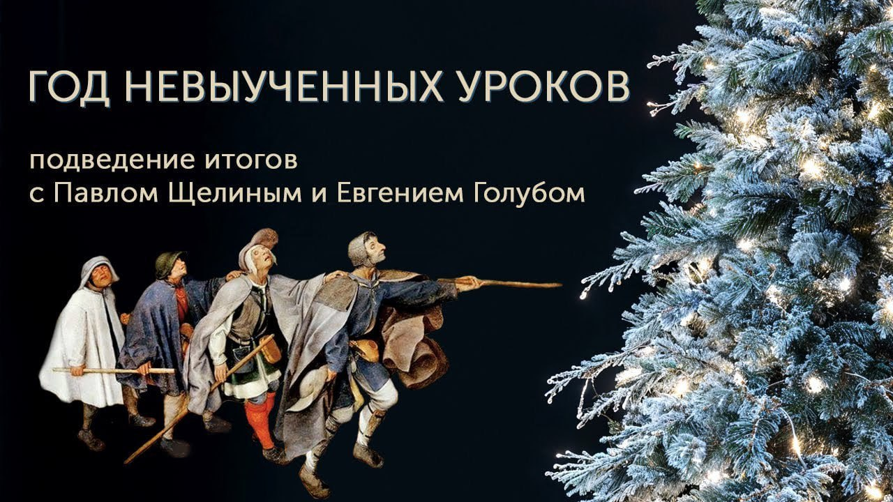

# Год невыученных уроков

28 декабря 2024 [Аудиоверсия](https://paradoks-pinkera-pilotnyy-vypusk.simplecast.com/episodes/year2024) 39:45

Элиты неспособны адаптироваться к изменяющимся реалиям: политики игнорируют трещины в фундаменте цивилизации, цепляясь за устаревшие и оторванные от реальности нарративы, прикрывая это иллюзией своей непогрешимости.

**Е.Голуб:**
Здравствуйте, дорогие друзья!
В эфире подкаст Павла Щелина и Евгения Голуба «В поисках смысла».
У микрофона Евгений Голуб.

**П.Щелин:**
И Павел Щелин.

**Е.Голуб:**
Мы решили записать внеочередной выпуск, условно новогодний, поскольку мы продолжаем работать над четвёртым сезоном, он получается довольно сложным.
Ну и чтобы не откладывать в долгий ящик общение с нашими дорогими слушателями, с теми, кто общается с нами, с Павлом в основном, в группе Telegram, мы такое приняли решение.

**П.Щелин:**
Есть ряд устоявшихся медиатрадиций, которые я считаю довольно благими.
Одна из них — это подведение определённых итогов года.

Происходит она в разных форматах.
Иногда это обзор новостных событий, иногда это всё-таки некая форма размышления, медитации.
Я предлагаю нам сделать что-то среднее из кухонной посиделки и, так или иначе, небольшого такого даже меланхолического наблюдения о том сущностном, что произошло в 2024 году и какое наследство он передаёт, условно говоря, году следующему.

**Е.Голуб:**
Начинай, а я буду реагировать на твои слова.
Может быть, добавлю что-нибудь.

**П.Щелин:**
Я очень сильно надеюсь, потому что я, когда готовился к нашему эфиру, у меня размышлений было очень-очень-очень много, с одной стороны, а с другой стороны, по прошествии довольно короткого периода времени, чему сильно помогает лежание в кровати, они как-то все просеялись к двум довольно известным высказываниям, которые, тем не менее, мне кажется, очень точно описывают состояние не даже какого-то конкретного политика, общества, народа или прочего, а именно Zeitgeist, если уж угодно.
Давайте заимствовать страшное немецкое слово «дух времени» из германской философии.

Первое высказывание — это знаменитая фраза Тейлиана про Бурбонов.
То, что они ничего не забыли и ничему не научились.
Ну, а второй тезис, он связан уже с более такой нишевой, скажем так, субкультурой.
Я тебе скидывал когда-то давно мем исторический, мой любимый, про «выводы будут сделаны».
Надеемся, выводы будут сделаны.

**Е.Голуб:**
Нет, не помню уже.
А что там было?

**П.Щелин:**
Ну, там описывается череда исторических событий в Восточной Европе, и в конце такой старый мужичок солдат, который обычно расхлебывает все негативные последствия, такой с указительным видом смотрит и говорит, надеемся, выводы сделаны будут.
Ну и вот комментарий с моей стороны, соответственно, никаких выводов никем сделано не было.
Это я очень отчетливо вижу по, ну, собственно, всем высказываниям, заявлениям, процессам, которые происходят вокруг.
И вот это для меня, на самом деле, очень парадоксально.

Несмотря на то, что, казалось бы, три года идут события, которые все самые разные комментаторы, включая твоего покорного слугу, часто описывают, ну, довольно в сильных терминах.
Тридцатилетняя война, третья мировая, вторая, там, третья мировая, вторая тридцатилетняя, Рубикон, слом мировой системы.
Очень большие такие заявления, они и правда большие происходят.

Кому рассказать три года назад, что, условно говоря, будет казаться нормой к концу 2024 года, пальцем бы у виска крутили сильно.
Отдельные причины, почему крутили, но тем не менее.
По идее, впечатление должно было бы сильное быть произведено.

А вот это сильное впечатление, тем не менее, вообще не транслируется ни в качество принятия решений, ни даже в рефлексию по поводу этих решений, как на уровне элитном, так и на уровне, условно, говорящей медиасреды.
Потому что говорящая медиасреда тоже как-то все переливает из пустого в порожнее, обсуждает все, что угодно, кроме, собственно, сути происходящих событий.
Вот такое странное у меня наблюдение в 24-м годе.
Готов копать дальше, но для начала хотел бы сверить часы.

**Е.Голуб:**
Ты знаешь, я в последнее время очень активно слушаю разного рода обозрения, некоторые не больше минуты-двух, некоторые больше, но я хочу здесь осторожно высказать с тобой несогласие.
Почему?

Потому что мне приходится встречать всевозможные рефлексии, иногда довольно интересные, глубокие.
Появились буквально в этом году, или, по крайней мере, они вышли на какой-то уровень интересных видеоканалов YouTube, философов, психологов, академических образованных людей, которые дают довольно глубокий анализ.
Другое дело, что они не в тренде, они имеют очень небольшую аудиторию, но палитра мнений и суждений очень часто сходных в оценках с тем, о чём мы с тобой говорим и к чему, к каким выводам мы приходим, всё-таки есть.

**П.Щелин:**
Хорошо, Жень, давай тогда скорректируем.
Я, конечно, имел в виду прежде всего то, что называется мейнстримом.
Ну, или то, что обладает достаточно большой аудиторией.
Да, разумеется, есть голоса.
И голоса в истории были всегда, которые говорили здравые вещи.
Но это, собственно, и есть второй мем.
Почему второй мем, повод, вспомнил про «надеемся, выводы будут сделаны».
Собственно, вот эти голоса для меня не попадают в эту категорию.
Есть люди, которые замечают, есть люди, которые пытаются рассуждать интересно, и мне интересно их смотреть.

Но меня поражает именно то, что на фоне больших групп, на фоне людей с большим количеством аудитории, а главное, на уровне людей, принимающих решения, здесь может быть моя политическая, если угодно, деформация идет, я не вижу, честно говоря, ни малейшего сдвига.
Я объясню.

Я могу подробно рассуждать, как я это вижу, например, в контексте американских выборов.
Я могу это обсуждать, как я это вижу в контексте российской политики, я могу это обсуждать, как я вижу в контексте политики европейской, в контексте политики украинской.
Но вот на уровне чего-то того, что будет определять так называемый вектор, ну то есть куда это оно движется, вот там рефлексии не происходят.
Рефлексия происходит, вот ты правильно заметил, по краям, по очень таким то, что называется фринч, краям одежды.
Это очень интересно слушать, это мне помогает сильно и к эфирам готовиться, и время занимать.
В общем, есть определённый у меня пессимизм.
Потом объясню, почему у меня пессимизм.

**Е.Голуб:**
Ты знаешь, а у меня несколько другое впечатление, или скорее дополняющее.
Я слышу, конечно, постольку-поскольку я могу выглядывать за пределы своего пузыря информационного, очень большой запрос и всё громче звучащие голоса с вопросом, чем объяснить происходящее безумие.
Всё больше людей оценивают происходящее как безумие.
Поэтому всё больше интереса к тем, кто пытается рационализировать происходящее, дать какое-то внятное объяснение истоков и последствий.

Вот в моём окружении, я говорю сейчас «широкое окружение», многие люди чаще употребляют слово «безумие» на разных языках, то есть творится безумие.
И вот на этот вопрос те, кто наделены сейчас властью, очевидно, не дают какой-либо, сколько-нибудь внятный ответ.
Они продолжают, вот здесь я с тобой соглашусь, они продолжают вести себя так, как если бы знали, что делать, и игнорируют вот это вот происходящее безумие.
Но, с другой стороны, их тоже можно понять, да?

Как транслировать растерянность, какие-то делать резкие движения, это может привести к панике, к какой-то неразберихе.
Может быть, в этом дело.
Давай подумаем в этом смысле.

Я думаю, что происходящее вокруг нас, в нашей цивилизации, вот это вот безумие, какое-то самоубийственное, очевидно практически всем.
Но другое дело, как на это люди реагируют.
Кто-то продолжает жить, как если бы ничего не происходило.
Кто-то обезболивает себя, уходя с головой в частную жизнь или в какие-то развлекательные истории.
Ну а те, кто держит в руках рычаги власти, очевидно, пытаются лихорадочно из этого вырулить, делая вид, что всё идёт по плану.

**П.Щелин:**
Ну вот не могу здесь до конца согласиться, частично.
Не согласен даже с очевидностью.

Как раз-то мне кажется, что вот это то, что ты описываешь, ну, воронка саморазрушения, я с тобой, кстати, согласен, как определённый диагноз происходящих событий, но она-то и не является очевидным.
Или если даже человек приходит чаще...
Я часто встречаю, что люди, ну, доходят до такой, знаешь, точки, что, дескать, ну да, что-то вроде идет не так глубоко, но не хватает ни смелости, ни духу, ни просто, скажем, компетенции смотреть в причины этой воронки.
Иногда, скажем так, поиск, как правило, заканчивается на уровне - пришли нехорошие икс.
А до этого все было хорошо, надо убрать нехороших икс, и тогда вот все, оно наладится.
То есть смотреть на реальную причинность, вот эту глубокую причинно-следственную связь, ну, допустим, то, что это началось не сегодня, не вчера, не сто лет назад, а четыреста лет по некоторым параметрам, но сил-то особо-то у людей не хватает.

А вот на уровне элиты, власть продержащих, я, честно говоря, с тобой не согласен совершенно.

**Е.Голуб:**
Приведи примеры.
Ты же говорил, что ты можешь проиллюстрировать свою мысль примерами из американской повседневности.

**П.Щелин:**
Ну, допустим, на уровне американской повседневности у нас есть две политические силы основные, да?
То есть я их по-разному называю, но давай пойдем по общепринятому.
Демократическая партия и республиканская партия.

Вот у тебя демократическая партия проигрывает выборы в силу того, что она занималась упорным отрицанием реальности.
Мы с тобой это отдельно обсуждали.
В частности, в вопросах то, что нельзя, условно говоря, гнобить большинство населения бесконечно, рано или поздно приходит ответочка.
Механизм обратной связи был поломан, и в конечном итоге победа Тональда Трампа – это была победа рассерженного, вынесенного за скобки мужского избирателя.
Вот тебе реальная простой кейс, то есть необучаемость.

Были ли сделаны выводы по итогам этих событий, если смотреть по демократической прессе?
Нет.
Ну, то есть, если вот простой пример.
Виноват в случившемся кто угодно, кроме нас самих.
Мы все сделали правильно, просто не сделали правильно достаточно.
Точно так же произошло в 2016 году, и вот оно с тех пор не изменилось.
То есть, допустим, вот тебе пример - политическая партия не может признать то, что мы сделали ряд ошибок.
Вот, наверное, знаешь, выходим.

Я вижу доминирующий просто какуй-то триумф, я тебе больше бы сказал, во всем политическом классе, я потом перейду к республиканцам, философии "я не лох".
Я вижу просто эпический ее триумф.
Ты нигде не видишь способности сказать «мы ошибались», «я ошибался».
Очень много сторонников готовые сказать «они ошибались», «они плохие».

Ну вот сейчас этим занимается Трамп.
Если бы не Байден, войны бы не было.
Вот если был бы я, то войны бы там не случилось.
И вообще, если был бы я, то мы бы победили Китай.
Сейчас приду я, мы снова победим Китай.

Реальность говорит прямо о другом.
Если бы был бы ты, война, скорее всего, также бы случилась.
То есть, ты не спаситель мира.
У тебя реальных предпосылок для таких высказываний нет.
А политик реально так думает.
Соответственно, будут разочарования.

Ну и в целом, переходя уже на республиканский уровень, основной посыл господина Трампа и внутренней и внешней аудитории, то, что я могу мир через силу, Америка через силу, сделаем Америку великую в ваших глазах за ваш счет.
Вот примерно такой посыл.
Проблема в том, что сейчас это невозможно.
Ситуация изменилась, мышление осталось.
И паттерн-то остался тот же самый, потому что просто условно у демократов паттерн «все было хорошо, наш план развивался, пока не пришел плохой Трамп и нехорошие антиглобалисты», а у Трампа «все было хорошо, пока не пришли плохие глобалисты, которые поломали нашу американскую мечту, теперь мы придем и снова эту американскую мечту вернем».
Ну вообще структура мышления идентичностная.
И способности смотреть реально на предпосылки, ну, например, сказать - господа, мы больше не можем это делать.
Вот у нас изменились обстоятельства.
Мы можем делать это, это, это, а это делать мы больше не можем.

Такое даже на уровне мышления политик себе позволить не может.
Вместо этого идет крик, идет цепляние, ну, за откровенно фантастические цифры.
Ну, это если брать частный случай, ну, например, вот поведение республиканское и сейчас будущей администрации по вопросам будущих переговоров, относительно потенциальных в Восточной Европе.
Ну, как ты понимаешь, абсолютно взятые с потолка, фантастические нарисованные цифры, они не сильно способствуют тому, что называется credibility.
Когда говорят о том, что там каждую неделю гибнет на 100 тысяч больше солдат противника, знаешь, это как бы не сильно доставляет уверенности в том, что там вообще на другой стороне находятся адекваты.

Да и даже в этом случае, вот смотри, есть переговоры.
Мы видим то, что каждая из сторон говорит сама с собой.
То есть, это вот абсолютное.
Все выдумывают какие-то гениальные планы, не задаваясь банальным простым вопросом, а есть ли минимальная заинтересованность вашего контрагента в этом самом плане.
Потому что если этой заинтересованности нет, чего воду толочь?

Но поведение ведется такое, как будто есть предположение, что от самого факта повторения слова «мир, мир, мир, мир, мир» оно наступит.
Но оно так не работает.
Знаешь, как бы говорят мир-мир, а миру нет, написано у Езекииля.
Вот здесь то же самое, а потому что стороны банально общаются только между собой, то есть они занимаются согласовыванием внутри себя планов, на которые я бы сам мог согласиться, при этом вообще не учитывают, по сути говоря, внешний круг обстоятельств.
И это вот маленький частный случай, но такой же в каждой внутренней политике, в каждой внешней политике во многих всех вот этих узлах, которые формируются.

А в итоге потом происходит Сирия, условно.
Когда все внезапно обрушается, казалось бы, из ниоткуда, и как оно так получилось.
И вот это я имею в виду под вот этой логией.
Никто ничего не забыл, то есть все гордые, все полны обид, все полны, знаешь, вот накопленного прям рессентимента такого глубокого, то есть я же не лох, но никто ничему не научился.
То есть на элитном уровне, чтобы принимать сложные какие-то структурированные тонкие выводы, вот заниматься такой политической работой, тоже нет.
Вот такое у меня наблюдение.

**Е.Голуб:**
Но это рецепт катастрофы, когда в такой ситуации люди игнорируют реальность.
Это происходит не так, чтобы редко, последние, по крайней мере, годы.
В конце концов, упирается в то, что действительные противоречия, конфликты, они обрушивают всю эту выдуманную ситуацию.

Например, как в Сирии, ты хорошо сказал.
Там же, по последним данным, Алеппо захватило несколько сотен боевиков, которым противостояло несколько тысяч военнослужащих сирийской армии.
Хороший пример.

**П.Щелин:**
Сирия здесь просто уж очень, она как-то под конец года, это фанфары рока из девятой симфонии Бетховена.
Вот оно вот примерно так звучит.
Та-да-да-там.

**Е.Голуб:**
Я, по крайней мере, не вижу никаких предпосылок, никаких признаков того, что вот этот аутизм такой политический каким-то образом будет вылечен.
Что с одной стороны, что с другой.

Про Китай ничего не могу сказать.
Не понимаю до конца эту цивилизацию.
Ну а вот если слушать, как ты говоришь, мейнстрим европейский, американский, российский, то да, как будто бы люди живут в трёх разных реальностях.

**П.Щелин:**
Да, они вообще не пересекаются.

**Е.Голуб:**
И они старательно делают вид и продолжают делать вид, что эти реальности единственные существующие.
Когда ты знаешь позицию, или новости слушаешь с разных сторон, а потом смотришь средства массовой информации, то ты видишь, что какая-то часть просто обрезается как несуществующая.
То есть цель — самосохранение, самоуспокоение.
Ну вот так.

Как-то кажется, что глобальные пузыри надуваются.
Гибнут люди, разрушаются дома, разрушаются города, напряжение растёт.
Рано или поздно это закончится каким-то глобальным копцом, если не сказать как-то по-другому.
И, может быть, только после этого уже волей-неволей начнётся возврат к какому-то реалистичному мышлению.

Я склонен по своему обыкновению винить во всём постмодернизм.
Не знаю, было ли когда раньше, здесь стоит это исследовать, может быть, уже и встречалось раньше, вот такое игнорирование реальности.
Или это следствие того, что такие большие нарративы, мета-нарративы, они потихоньку все растворились, и жить в своём мире стало нормально.
У вас такая правда, у нас такая правда.

Ну, политики теперь тоже живут в своём мире.
Кто-то себе придумывает очередной гендер, а кто-то себе придумывает политическую реальность и отправляет граждан на убой.

**П.Щелин:**
Я бы очень хотел винить только постмодернизм, но мне кажется, он выступает здесь просто катализатором.
Я тебе сейчас прочитаю одну цитату, а ты мне скажешь год, в котором она могла бы быть написана.

> Цель настоящего очерка – дать определение, в чем заключаются внешние задачи России.
> Спросите англичанина, как разумеет он английские интересы.
> Ответ вы получите стереотипный и ясный.
> 
> Скольких бы вы русских не спрашивали, каждый ответит по-своему и совершенно различно.
> Русский простолюдин горячо любит свою родину, но ему неизвестно, в чем заключаются ее интересы.
> Этого не знает и наша витающая в отвлеченностях интеллигенция.
> Не знают этого и те, кому по долгу службы, ведать бы надлежало, политики профессионалы.
> 
> Между тем, без уяснения конечных целей, чисто эмпирически, вести политику невозможно.

**Е.Голуб:**
Ну, очевидно по стилю, что это начало 20-го, конец 19-го века.
Скорее всего, начало 20-го, перед кризисом.

**П.Щелин:**
Образованный человек.

Был дипломат такой Юрий Карцев.
Он оставил интересный ряд очерков на эту тему.
Понимаешь, мало что изменилось.

**Е.Голуб:**
Да вообще, кажется, ничего не изменилось, да?

С точки зрения, по крайней мере, коммуникации, которая идет с российской стороны, кажется, что абсолютно там либеральная интеллигенция живет, так сказать, своими представлениями, ну а все остальное так же, как в этой цитате.
Но нам-то от этого не легче.

**П.Щелин:**
Нам-то от этого не легче, да.
Я же говорю, у меня поэтому немножко такое, возможно, это связано с моим возрастом.
Мне эти последние три года выглядят все-таки событиями достаточно большими.

Казалось бы, ну, можно было бы начать думать и соображать.
Ну, хотя бы соотносить какие-то разные представления, хотя бы мифологемы с тем, что, ну, окей, ты, допустим, у тебя была какая-то мифологема три года назад.
Допустим, вот три года...
Возьмем войну, как есть.
Три года назад все полны своих мифологем.
У России свои мифологемы, там о едином братском народе, прочее, прочее, прочее.
Ну вот это просто такая ключевая такая дружбонародная, братсконародная мифологема.

У Украины полно своих мифологем, у Запада своя мифологема про бензоколонку там с гранатой и прочее.
Вот мифологемы, окей.
У вас есть какие-то мифологемы, которыми вы описываете реальность.
Но прошло три года.
Эти три года обрушили все предыдущие мифологемы.

**Е.Голуб:**
На уровне здравого смысла, уже кажется, перестать пора транслировать всю эту ерунду.
Но нет.
Ну, может быть, потому что ничего другого не осталось.
Нет понимания, не смогли отрефлексировать.
Но как ты это объясняешь?

**П.Щелин:**
Я это не объясняю.
Нет, объяснить это тем, что не успевают, объяснить невозможно, потому что, как ты правильно заметил, успевают и объясняют.
Что называется, было бы желание.
Опять-таки, три года достаточно большой срок, и реальность объясняет достаточно больно то, что некоторые мифологемы не работают, мягко говоря.

Причем, давай сделаем важную для меня все-таки оговорку.
Объясняют всем одновременно.
Я очень не хочу, чтобы мой тезис сегодня поняли о том, что есть вот какой-то адекватный субъект, или есть один неадекватный субъект, а все вокруг адекватные.
Нет.
Весь трагикомизм современного положения, что все неадекватны по-своему.

**Е.Голуб:**
Может быть, они заложники неадекватности, но я не верю, что люди, которые в состоянии управлять такими сложными системами, очень сильно отстают от нас с тобой в интеллектуальном смысле.
Другое дело, что они заложники, может быть, этих нарративов и позиций, и не могут отступить от них в силу каких-то своих, может быть, даже очевидных причин.

**П.Щелин:**
Я сделаю здесь два наблюдения.

Первое, мне кажется, управлять гораздо проще, чем кажется.
В каком смысле?

Огромное количество процессов в современной жизни висит на самоуправлении.
И на самом-то деле не так много есть нужных областей, но они критично важны.
Допустим, порядок и безопасность, поддержание, вот этот тонкий слой порядка.
Но за его пределами практически все висит на самоорганизации, поэтому только оно как-то и работает.
Здесь я, кстати, гораздо больше верю в спонтанность.
Но это отдельная такая тема.

А вот про заложники нарративов я с тобой согласен, я поэтому упомянул философию вот эту «я не лох».
Какая-то заколдованная петля.
События должны происходить определенным образом, потому что я так думаю.
Я же не могу думать неправильно.
А если я думаю неправильно, то я лох.
Но я же не лох, поэтому...

И вот эта петля вот этого кругового движения, она на самом деле является заколдованной ловушкой.
В чем проблема?

Проблема в том, что в итоге начинает происходить исключительно самосбывающееся пророчество.
Объясню пример.
У тебя есть пример.
Возьмем американское общество с вот этой левой повесткой, которая привела к тому, что рассердила мужской электорат, и произошло ровно то, чего так боялись вот эти мужские шовинисты, привели к победе своего плохого варварского кандидата.
Но даже если бы там были попытки это осознать, и вот это было очень интересно, на выборах Камалы Харрис, они почувствовали некую проблему и начали пытаться создавать контрнарратив, мужчины за Камалу Харрис.
Ну, по сути, это выглядело...
Привело это к прямо обратному эффекту.
Это привело к еще большей мобилизации мужского электората против Харрис, потому что продукт, который они произвели, ну, это была очень плохая комедия, очень плохая шутка.

**Е.Голуб:**
Я знаю, что это выглядело как издевательство, да?

**П.Щелин:**
Причем ненамеренное.
Ну, это просто вот человек, который вообще не понимает причину происходящего вот этого отторжения.
Там были ролики, типа - я мужицкий мужик, я пью пиво, я хожу на футбол, я хожу за Харрис.
Это как будто, вот знаешь, попытка через стереотип победить.

**Е.Голуб:**
Да, да, да, да.
Я понял, да.
Могу представить.

**П.Щелин:**
Я тебе потом пришлю.
Это великолепно выглядело.
Эффект был прямо обратный.

Сейчас я вижу, например, происходит ровно то же самое весь этот год в совершенно другой стране, совершенно в другом контексте.
Это Россия, например, и мигрантская проблема.

Попытки лечить объективно углубляющийся кризис через фестивали плова и рассказы о дружбе народов приводят к прямо противоположному действию, к радикализации одних и к усилению безнаказанности других.
Но вот ровно та же проблема.
На самом деле феномен ровно тот же самый с психологической точки зрения.

Даже если вот эта государственная машина считывает сигнал, что тут что-то происходит не так, она настолько не готова посмотреть в базовые посылки своего мировоззрения, что даже попытки ее как-то отреагировать на сигнал об опасности приводят только к усилению саморазрушительных процессов.
Вот оно, понимаешь, в чём ловушка и парадокс.

**Е.Голуб:**
Я понимаю твою мысль, но ничего хорошего не сулит.
Мало того, что люди игнорируют реальность и не пытаются углубиться в понимании причин и истоков проблем.
Так их действия их усугубляют и ускоряют, и это значит, что вот этот кризис и этот коллапс, он может произойти быстро, неожиданно достаточно, и глобально.

**П.Щелин:**
Ну, знаешь, я бы сказал в том-то и дело.
Парадокс, что он будет не сколько, на мой взгляд, глобально, сколько одновременно в разных местах.
Или непонятно как.
Это какая-то сейчас, оказывается, адская лотерея, когда любой может в любой момент коллапсировать.

Пример американский.
Всем уже понятно, в Америке действительно раньше это были сказки, но сейчас есть объективная проблема с этим ростом госдолга.
Он действительно за последние 4 года пошел уже как клюшка вверх.
Невозможно его выплачивать, этот процент, то есть ужас, все говорят.
Вот приходит тебе новый кандидат, который типа приходит как такой проэкономический кандидат.
Вот сейчас что он говорит?
Давайте снимем потолок.
Давайте вообще уберем потолок.

Или Европа.
Допустим, контекст войны.
Европа говорит.
Ну, то есть видит, условно.
Предположим, что мы играем за европейскую, за западную сторону.

Мы проигрываем войну на поле боя, но мы не можем признать, что мы проигрываем войну на поле боя.
Поэтому все те решения, которые мы пытаемся применять, они все приходят половинчатые.
Не тогда, когда вовремя, и в конечном итоге лишь ведут нас по той спирали эскалации, в которой мы сами проигрываем.

Паттерн один и тот же, внутри и вовне, во всех структурах.
Вот почему для меня это итог года.
Потому что это общее, казалось бы, с самыми разнообразными калейдоскопами, не связанных с собой событий.
То есть какой-то порок мышления.

Вот действительно, я с тобой согласен, это философская проблема, и я бы даже сказал, теологическая проблема.
Но вот какой-то фундаментальный глубокий порок мышления, который при всем желании действительно делает невозможным...
Опять, слово «невозможное» — оно тут странное.
Возможно то - легко.

**Е.Голуб:**
Ну, исходя из реалистичной картины мира.
То есть ты принимаешь реальность с ситуацией, как она есть, начинаешь действовать, опираясь на действительность.

**П.Щелин:**
Ты можешь минимизировать банально убытки.
По крайней мере, ты можешь начать использовать стратегию минимизации убытков.
Окей, это невозможно.
Вот это надо отсечь.
Окей, а вот здесь уже можно что-то начинать делать.
И так далее и тому подобное.

Но вот заметь, никто не готов делать вот этот шаг.
Отсекать и принимать убытки.
Тоже важный момент.
Вот какая-то глобальная жадность.

**Е.Голуб:**
Такая позиция воспринимается как капитуляция, поражение.
Ну, прежде всего, конечно, это звучит в словах украинского политического руководства.

**П.Щелин:**
Ну, западного точно так же.
Ты говоришь, поражение.
Ты берешь сейчас с войну, но она же не только про войну.

Допустим, в домашней политике.
Ну, например, допустим, можно отсечь убыток, если признать, что это мы себе больше позволить не можем.
Наша экономика вот это себе позволить не может.
Или этот стандарт мы позволить не можем, или эту политику мы позволить не можем и так далее.
Или эту, допустим, культурную политику мы позволить не можем.

Ну, допустим, вот я говорил про Россию, но то же самое, например, происходило в этом году в Великобритании, погромы в Бирмингеме.
Очевидная проблема то, что вот он конфликт между вот этой мигрантской массой, и даже не просто, они же граждане все уже, они же паспорта получили, и простите, коренным населением.
И эта проблема сейчас решается только через отсечение.
Вы, конечно, можете попытаться отсечь полностью коренное население, но тогда отсекайте его тоже полностью, не пытайтесь вот это поддерживать.

Это третий такой фундаментальный вывод, переходя к прогнозу на 25-й, что не готов признать никто на данный момент, применительно к любой проблеме.
То, что любая проблема сегодня может решаться только в формате чрезвычайного положения.

**Е.Голуб:**
То есть признать то, что как раньше не будет, придется чем-то жертвовать.

**П.Щелин:**
И оно не решается нормально.

**Е.Голуб:**
Нормально?
В каком смысле нормально?
Не решается обычными методами, да?

**П.Щелин:**
Да, нельзя ее решить, просто приняв там пару законов.
Нельзя любую проблему сегодня решить просто через нормальное, допустим, функционирование институтов.
Потому что как раз ваши институты уже не функционируют.
Они эту проблему только порождают.
И даже если вы посылаете сигнал институтам решить какую-то проблему, они эту проблему только усугубляют.

**Е.Голуб:**
Ты рисуешь такую картину, как если бы система застыла на пороге какого-то глобального слома и перехода.
Который болезненен, который неприятен, ведёт к большим издержкам, но который необходим, потому что старые механизмы, старые методы просто перестали работать, а усугубляют ситуацию.

**П.Щелин:**
Да, и хуже того, они ее своим усугублением, они накапливают вот этот потенциал будущего взрыва.

**Е.Голуб:**
Чем дольше ее игнорируют, тем больше и глубже и масштабнее будет вот этот взрыв.

**П.Щелин:**
Условно говоря, сколько говорили о вот этой проблеме мультикультурализма в Европе, над ней смеялись.
Потом сколько говорили, вот те же кричали в набат, там про проблему, допустим, у России визовый режим со странами Средней Азии и прочее.
Тогда эти проблемы можно было решать институционально.
А ведь заметь, сейчас, с другого берега океана Атлантического, Трамп, с мигрантами.
Он же, по сути, говорит о том, что он как раз мигрантскую проблему, вот здесь у него лампочка зажглась, будет решать именно в режиме чрезвычайного положения.
Ну, по крайней мере, он говорит.
Я тоже думаю, что он мало чего сделает, но говорит он, что я просто посажу всех на автобус и всех депортирую.
Это чрезвычайное положение, вот о том и речь.

В обход всех юридических процедур, в обход всех структурных принятий политик, билей и прочем.
Возможно, что эту проблему не решит.
Тут важна сама логика того, что все эти проблемы такого масштаба могут быть решены только через выход, уж простите, политической зоны комфорта в зону чрезвычайного положения.
И здесь есть фундаментальная проблема.

Почему будет, на мой взгляд, сопротивление до последнего, по выходу вот в это чрезвычайное положение?
Почему оно упадет на политиков, а не политики его инициируют?

Потому что в зоне чрезвычайного положения понятно, кто ответственность несет.
Ты, собственно, фактом объявления чрезвычайного положения, по сути говоря, позиционируешь себя как ответственное лицо за последствия тех решений, которые в нем будут приняты.

**Е.Голуб:**
Послушай, старые добрые древние римляне не стеснялись в чрезвычайных ситуациях назначать диктатора, который был неограниченной властью, но после завершения этого полугодового или сколько срока, он мог быть наказан, если результата нет.
Вот этот механизм был ими осознан, и он работал очень долго.
И в конце концов и Цезарь, и все так называемые доминат и принципат сначала.
То есть это же было следствием именно накопившихся проблем и способом объявить условно-чрезвычайное положение.
Значит, это вероятнее всего, потому что по моему глубокому убеждению природа людей не меняется, по крайней мере, за несчастные несколько тысяч лет, то, что нас вероятнее всего...
Давай перейдём уже к прогнозам, сколько же можно.

Не знаю, как в следующем году, но, вероятно, нас ждут такие изменения в организации социума...
Те социумы, которые выживут, смогут отказаться от устоявшихся форм управления и самоорганизации, или организации, и придут к каким-то другим, может быть, известным раньше.
Не знаю, больше будет авторитаризма.

**П.Щелин:**
Авторитаризма-то больше будет в любом случае.
Тренд на авторитаризм мы видим, причём даже в самых демократических, в кавычках, странах.
Мой любимый румынский конституционный суд отменяет выборы, причем он даже в решении пишет о том, что выборы прошли в соответствии со всеми процедурами, но кандидат победил не тот, поэтому извините.
Это потрясающее решение.

Рост авторитаризма-то нас ждет в любом случае.
Проблема в том, что пока везде у нас рост безответственного авторитаризма.
У нас побеждают авторитарные лидеры, которые играют в стронгмен.
Но ответственность они нести точно так же не готовы, как условно там демократический кандидат, понимаешь, да?
В этом проблема.

То, что ты как бы в прогноз закладываешь, я с тобой согласен.
Ну, опять вопрос 25-й, 26-й, но, честно говоря, я думаю, это реально становится вопросом года-двух.
Именно слом институциональных попыток удержания ситуации, переход в ситуацию в неконтролируемом.
Причем в разных странах по разным причинам.

Тут очень важно для меня вот это осознание, то, что это не то, что, знаешь, есть какой-то...
Потому что чаще всего у людей, вот почему сложно разговаривать.
Пытаешься с кем-то обсуждать какую-то отдельную проблему, и людей это успокаивает.
Ну, слава богу.
Как будто проблемы в одной точке снимают накал проблем в другой точке.
Нет.
Моё наблюдение в том, что все катастрофические сценарии реализуются везде одновременно по собственным внутренне связанным причинам, но с самим фактом своего присутствия, единственное, что они могут сделать, это усиливать друг друга в разных странах.

**Е.Голуб:**
Я сейчас вот что тебе скажу.
Вот я стану на позицию нашего слушателя, который уже последние три года каждый год пугает, что в следующем году будет полная катастрофа.
И у него уже такой иммунитет.

Ну а ещё одни, значит, кассандры нам тут вещают, что придёт всем край.
Но ведь не пришел, как-то же мы живем, ходим по ресторанам, некоторые, ходят на работу.
Да, где-то стало сложнее, где-то чуть беднее.
Куда-то не поедешь, о чем-то не скажешь.
Но в целом так вот, чтобы катастрофы, так вроде как и нет.
Поэтому, ребят, заканчивайте вот это нас пугать.

**П.Щелин:**
Ну вот смотри, и вот здесь я, конечно, вспоминаю, знаешь, другой большой мем этого года, сколько раз ты вспомнил про Римскую империю за прошедшие сутки.
Так она и катастрофа.
Понимаешь, здесь тогда гигантский коллективный синдром Симпрония, по-моему, его так звали, или Гай Симпроний, который оставил очень большую переписку в V веке своим друзьям, товарищам.
И вот как он вошел, как он стал известным сегодня, почему синдром называется, может неправильно я его назвал.

В общем, светит солнышко, поют птички, мирно и величественно течет река Тибр.
Я живу в самой великой стране.
Как я благодарен богам за то, что я римлянин.
Ну, а через полгода варвары разграбят Рим.

**Е.Голуб:**
То есть ты хочешь сказать, что обыватель, обычный человек, он всячески стремится поддерживать в себе вот эту уверенность, что жизнь как была, так и будет, и вот много маленьких радостей.
Не стоит тут катастрофу ожидать.

**П.Щелин:**
А ты понимаешь, вот здесь, мне кажется, ложное противоречие, если уж на то пошло.
Если мы примем, что жизнь вообще состоит только, ну, целиком из катастроф, то обыватель-то в принципе прав.
Какие бы катастрофы вокруг этого обывателя не происходили, но в целом, свою вот эту обывательскую нишу сохранить мы можем.
И это на самом деле для психики, вполне возможно, и является одним из немногих здоровых способов в нынешних условиях.
Но другого-то оно не отменяет.
Все равно катастрофы происходят.

И если уж вы начали думать о происходящих процессах на таком большом уровне, то, что вы можете сохранить свою лакуну нормальности, более того, в любой катастрофе можете адаптироваться, не снимает реальности катастроф и не снимает причинно-следственной связи катастроф.
Я, наверное, вот про это говорю.
Для меня это ложная дихотомия.
Можно в условиях катастроф наслаждаться светом солнца.
Абсолютно противоречия нет.

**Е.Голуб:**
Наш прогноз такой.
Мы находимся в разворачивающейся катастрофе, но не волнуйтесь, вы как пили по утрам кофе, с очень большой вероятностью будете продолжать его пить, ходить гулять в парк, пробежками заниматься, любить, растить детей.
Ну, контекст будет меняться иногда быстрее.

**П.Щелин:**
Ну, периодически возможно, что кофе сильно подорожает, на улицах будут патрули странных людей со странными повязками, непонятно откуда для вас взявшиеся.
Ну, может быть, кто-то где-то что-то сгорит где-то на окраине города в результате.

**Е.Голуб:**
Ну, может быть, не водителем Uber, так разносчикам газет всегда можно будет пропитаться, да?

**П.Щелин:**
Ну, вот что-то, да, вот из такого рода.
Если воспринимать эту, скажем так, эти два регистра.
И, в принципе, наверное, вот мудрость удерживать их оба в том плане, что какая бы катастрофа не произошла, вот эта зона семей, вот эта зона...

**Е.Голуб:**
Повседневности какой-то.

**П.Щелин:**
Да, зона повседневности, зона гемюта, даже если уж на то пошло, зона домашнего семейного круга, она всегда сохраняется.
В противном случае люди бы не выжили.

**Е.Голуб:**
То есть, катастрофы будут глобальными, повлияют на всех, но отчаиваться не нужно.
И в конце концов, что нам до той Римской империи сейчас?
Так то же самое будет до нашего миропорядка через какое-то количество лет.
Ну, если обойдёмся без ядерки, конечно.

**П.Щелин:**
Да, и с ней, наверное, тоже переживём.
Но это не отменяет того факта всё-таки для прогнозирования тем, кому...
Понимаешь, что здесь, скажем, есть риск.
Чтобы в этой зоне находиться, тут очень самому надо многие вещи для себя отсечь.
Тут вот тоже происходит большая зона отсекания.
И вот для тех, кому, скажем так, есть что отсекать и есть что сохранить, вот здесь нужно, конечно, пожелать особой осторожности, ответственности и тревожности, чтобы как раз...

**Е.Голуб:**
Поясни, что такое отсекать, сохранить?
Давай как-то ты чуть разверни это.

**П.Щелин:**
Классический пример.
Многие люди раньше жили на пять домов.
Ну, на три дома, на два дома.

**Е.Голуб:**
Ты про Штаты, наверное, говоришь.
Где кто-то тут на пять домов жил.

**П.Щелин:**
Нет, я больше про Россию говорю.
Была популярная тема, когда летать в Европу на выходные.
Ну, вот такого рода вещи.

**Е.Голуб:**
Ну, знаешь, я как бы с таким стилем жизни не знаком.
Я думаю, все-таки он был там очень тонкого.

**П.Щелин:**
Тонко, не тонко, но он был.
Он достаточно был распространен.
Ну, вот отсекать в том плане, понимать, что в изменяющихся условиях вы можете удержать.
Ну, допустим, работы на удаленке тоже могут быть далеко не всегда.
Ну, вот такого рода хаос, такого рода кризисы.

Здесь возникает вот этот банальный совет простраивания внимания к тому месту, в котором вы находитесь, к тем вот как раз, к ларьку кофе, который рядом условно с вами, к стойке с газетами, которая рядом с вами, к людям, которые рядом с вами.
Я вот про это именно скорее говорю.

**Е.Голуб:**
Знаешь, а у меня есть надежда такая, все-таки мне кажется, что рыночные отношения, рынок, механизмы капиталистические, они все-таки проникли в человеческий мир слишком далеко.
У нас уже всё стало товаром, и отношения стали товаром, супружеские отношения стали товаром.
Я инвестирую в отношения, инвестирую в себя.
Я там бренд, я там проявляюсь, я там то, я там сё.

Человек настолько стал каким-то таким предметом купли-продажных таких отношений, что это делает его уязвимым в период катастроф.
В период катастроф выживает солидарность, взаимопомощь, которая, как мне кажется, у меня такая гипотеза, всё-таки основывается на чём-то большем, чем какая-то выгода, сиюминутная выгода.
Наверняка кто-то скажет, что наоборот, но это всё более прагматично.
То, что я видел в мои периоды трудных жизненных обстоятельств, мне кажется, люди объединяются на основе общих ценностей, на основе отношений в большей степени, чем на основе сиюминутной выгоды.

И, может быть, это всё как-то, кроме глобального переустройства политической карты и системы взаимоотношений, может быть, развернёт и этот тренд в то, что мы все маленькие предприятия по производству ценностей для остальных.
И если мы эту ценность не способны генерировать, то ничего из себя не представляем и просто какой-то трэш.

**П.Щелин:**
Я с тобой здесь соглашусь.
И здесь вот тогда, если говорить о позитивном элементе любой катастрофы, с историософской точки зрения, любая катастрофа в жизни, она работает как потоп.
Она смывает все старое, все некрепкое, что и так уже прогнило, что и так уже нежизнеспособное, и, соответственно, заставляет, помещает всех участников процесса в состояние вот этого предельного экзистенциального выбора.
Либо выбери жизнь, либо выбери смерть, как пишет об этом Второзаконие.

Тут просто есть, конечно, лично небольшой зуд.
В том плане то, что, казалось бы, за последние три года, казалось бы, куда уж меньше вам тут всем экзистенциальных выборов.
Но вот это к вопросу о том, что...

**Е.Голуб:**
Видишь, недостаточно.

**П.Щелин:**
Недостаточно, да.
И вот это как раз заставляет немножко даже нервничать о масштабах потрясений, необходимых, чтобы включилась соображалка.
Но исторический закон - не доходит через голову, постучимся через печень, он, видимо, будет работать по полной программе.

Но в целом, как ты правильно подмечал, это имеет позитивный на длинном этапе характер.
Да, потому что выживает только настоящее.

**Е.Голуб:**
Да, вот давай позитивно будем завершать то, что вот это предчувствие катастрофы, потопа, это предчувствие в том числе и обновления.
Обновление — это всё-таки надежда на новые способы взаимодействия людей, или новые старые способы взаимодействия, на то, что всё лживое, чего так много накопилось в сегодняшнем мире, что оно уйдёт, отступит или будет отброшено.

**П.Щелин:**
Прекрасное завершение.
На полном серьёзе давай тут и закончим.
И в Новом году пожелаем всем нашим участникам, нашим зрителям, нашим слушателям именно крепкого основания под ногами, чтобы не быть прахом, носимым ветром, потому что ветра будут, бури будут, и тем важнее иметь вот то самое крепкое настоящее основание, за которое вы можете держаться.

**Е.Голуб:**
И я всё-таки, как заклинание, всё-таки повторю своё пожелание, которое у меня было ещё в 2021 году, и которое, к сожалению, не оправдалось.
Тогда я желал сохранения мира.
Теперь я хочу просто, чтобы как можно скорее наступил мир, чтобы прекратилась война.
И будем на это надеяться.

**П.Щелин:**
Ну что ж, с надеждой, и до новых встреч.

**Е.Голуб:**
До новых встреч.
