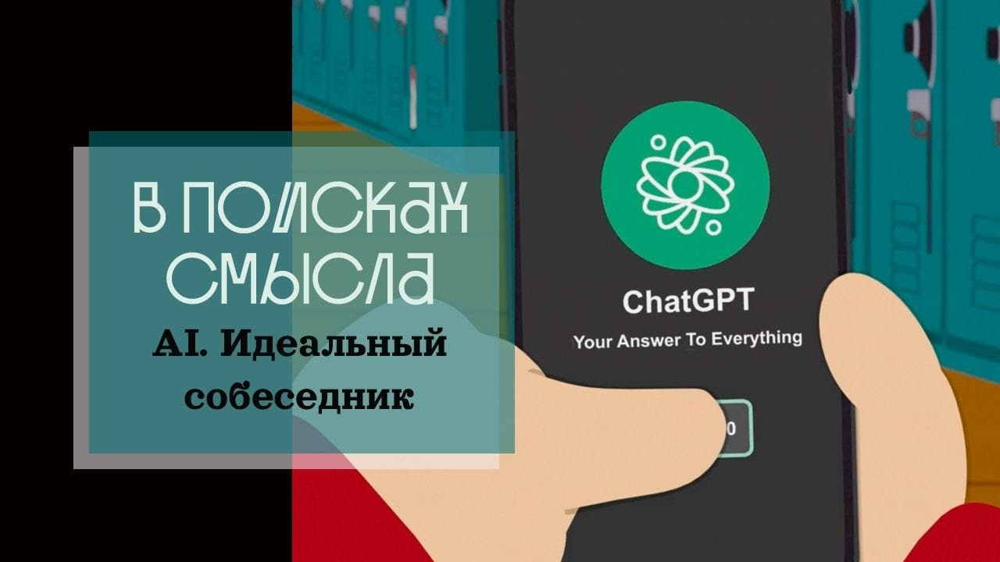

# AI. Идеальный собеседник

22 апреля 2023 [Аудиоверсия](https://paradoks-pinkera-pilotnyy-vypusk.simplecast.com/episodes/ai) 28:23

От шедевров литературы и кино к сериалу South Park.
Смешит или пугает зрителя 4 серия 26 сезона Deep Learning?
Способен ли AI утолить ненасытную потребность человека модерна во постоянном внимании?
Нейросеть, как идеальный собеседник.
Угрожает ли технологии Chat GPT будущему креативного среднего класса?
Новые требования к творческим способностям в эпоху AI.

**Е.Голуб:**
Нейросеть станет лучшим собеседником для эмоционально-чувствительного человека.

**П.Щелин:**
Среднеэмоциональная потребность, которая ожидается зачастую в отношениях, она стала такой, что удовлетворить её может только искусственный интеллект.

---

**Е.Голуб:**
Здравствуйте, друзья!
В эфире очередной выпуск подкаста Евгения Голуба и Павла Щелина «В поисках смысла».
Сегодня темой или затравкой для нашего разговора послужит необычное произведение, необычная серия знаменитого мультсериала «Южный парк».

**П.Щелин:**
Приветствую вас, уважаемые зрители.
Действительно, сегодня затравкой для нашего эфира стала четвёртая серия 26 сезона этого мультсериала.
В силу той темы, которая в нём поднимается, для вас это, я думаю, не станет большим удивлением.
Потому что в своей ироничной манере этот, скажем так, сатирический титан американской мультипликационной индустрии поднимает проблематику чата GPT и его влияние на социальные отношения.

**Е.Голуб:**
Нужно сказать, что этот сериал-то вообще на самом деле...
Саркастический, развлекательный, юмористический.
Предполагается, что за кадром раздается хохот и все остальное.
Но я, честно говоря, когда посмотрел эту серию, мне было вообще совершенно не смешно, а наоборот очень-очень грустно.

**П.Щелин:**
Весь, скажем так, золотой фонд South Park — это именно пора подумать.
Но тем не менее, тема чата GTP сейчас обсуждается крайне активно, крайне сильно.
Мы, с одной стороны, не хотели просто ловить хайп, как говорят современные блогеры.
Тем не менее, она действительно достаточно важная для будущего человечества и социальных отношений проблематика.
И мы решили вот с такой достаточно юмористического ключа подойти к этому вопросу и выйти на какие-то большие, глубинные, проблематичные, что называется, аспекты, которые, возможно, до сих пор не были обсуждены, по крайней мере, с той интенсивностью, как бы нам этого хотелось.

**Е.Голуб:**
Точно, потому что основная дискуссия крутится вокруг угроз искусственного интеллекта или того, что называют искусственным интеллектом.
То, что послужило для меня поводом тревожиться или огорчаться, то, о чём я не слышал ни разу в многочисленных бурных дискуссиях.
Давайте, наверное, начнём с того, что коротко перескажем сюжет этой серии.

Всё крутится там вокруг того, что одна из девочек хвастается подружкам.
тем, какие замечательные, эмоциональные, трогательные сообщения она получает от своего друга.
Ну и все начинают ей завидовать откровенно.
Заканчивается дело тем, что одна из её подружек жалуется своему молодому человеку, что от него таких сообщений не приходит.
И он уже в поисках решения приходит к тому самому герою, который умудряется писать такие проникновенные сообщения своей девочке.
На что он открывает ему страшные тайны, что вообще-то он пользуется специальным приложением на основе чата GPT, которая позволяет ему не тратить много времени на всю эту ерунду, скажем так.
В мультфильме намного более грубые выражения используются, потому что его подружка задолбала этими смс-ками, а так он тратит буквально несколько секунд и отправляет им то, что генерирует чат.
Вопрошающий, да, был страшно изумлён, но, придя домой с некоторой неуверенностью, он начинает пользоваться этим чатом, приложением на основании чата, и оказывается, что это производит волшебный эффект просто на отношения.
Показывает, как девушка начинает получать такие трогательные, такие глубокие, такие глубоко заинтересованные в ней тексты.
Она тут же радуется.
Она не может отрываться от этой переписки.
Она показывает всем.
В то время как мы видим, что молодой человек отправляет их одной рукой, не глядя, занимаясь своими делами.
Прям сидя в туалете, играя в баскетбол, играя в компьютерные игры, и тем самым, в общем-то, он себя снимает это всё тяготы общения со своей барышней.
Ну и, в конце концов, девушка просит его написать какую-то сказку на ночь для неё, на что он даёт это задание чату GPT, и тот присылает большую трогательную историю, и мы видим, как девушка засыпает с блаженной улыбкой от того, что она видит, насколько хорошо к ней относится молодой человек.

**П.Щелин:**
Параллельно в серии просматривается вторая линия, связанная с проблематикой домашних заданий.
Тот же главный герой, Стэн, начинает использовать чат GPT для того, чтобы делать домашние задания в школе.
Очень быстро выясняется, что, во-первых, они очень, получается, разумеется, качественные, стандартные вот эти эссе, которые генерируют ему чат.
И также выясняется то, что помимо него есть еще четыре парня, которые заняты той же самой деятельностью.
Это такая вторая конфликтная линия.
Она полна своей иронии, потому что впоследствии проверяющий эти задания учитель сам устает проверять эти задания, начинает генерировать фидбэк на то, что генерировала нейросеть.
И здесь очень много иронии.
Больше деталей я, наверное, вам рассказывать не буду.
Рекомендую самим посмотреть.

**Е.Голуб:**
Серия называется Deep Learning.

**П.Щелин:**
Да, Deep Learning.
И, думаю, перейдем к тем темам, которые мы с тобой хотим обсудить.
В данном случае для нас это просто триггер к фундаментальной проблеме.
И вот первая фундаментальная проблема, которую высветила эта серия, высветила чат GPT, — это проблематика эмоционального интеллекта.
Это проблематика, с одной стороны, эмоционального запроса в современном развитом демократическом обществе, можно сказать, проблемы эмоциональных потребностей в отношениях в постмодерне.
С одной стороны, неспособность среднестатистического человека эту потребность заполнить.
А с другой стороны, как показывается, машина может справляться с этим гораздо более эффективно.

**Е.Голуб:**
Ну потому что в её распоряжении весь опыт человечества за многие сотни лет, скорость к реакции, использование всего этого дела.

**П.Щелин:**
Я думаю, здесь именно важны все элементы, поднятые мной во введении.
Первое — это качественное изменение потребностей в отношениях.
По-научному это называется романтизация повседневности.
То есть если классическая семейная модель предполагала прежде всего отношения скорее прагматические, то есть вы вступали в своего рода контракт с определенной лайф-целью на всю жизнь, с определенными экономическими компонентами, с определенными компонентами воспроизведения, ну то есть дети.
В рамках этой модели вот эта эмоциональная составляющая, она присутствовала, она важна, но в принципе даже если ее не будет, то есть более важные вещи, которые удерживают людей вместе.

**Е.Голуб:**
Это было такое партнерство, скорее, союз для совместного проживания и выживания.

**П.Щелин:**
Не просто проживание, здесь именно слово выживание, мне кажется, более применимо, и партнерство здесь выглядит немножко потребительски.
Я бы здесь это смотрел все-таки именно в более историческом контексте.
То есть это не было именно про потребление.
Было довольно взрослое осознание то, что в одиночку решить вот эти большие социальные проектные элементы человеческой жизни невозможно, то есть планировать на 70 лет, особенно в контексте следующих поколений.
И, соответственно, у каждого члена семьи были определенные обязанности, ответственности и так далее.
А в 70-е, в связи с изменением, кстати, в экономике тоже, но и психологии, то есть тут сложно сказать, что идет впереди.
В зависимости от вашей философии вы разные будете давать ответы на этот вопрос.
Происходит, с одной стороны, изменение экономической модели, то есть семья становится ненужной в плане экономики массово.
Человек может спокойно прожить в одиночку всю жизнь.
Это принципиальное изменение, такого не было никогда ранее.

**Е.Голуб:**
То есть семья, получается, восполняет потребность только в эмоциональном общении?

**П.Щелин:**
Не только из семьи, из отношений, потому что отношения всегда являются проекцией вашей семейной модели, выкидывается всё, кроме вот этого эмоционального компонента.
То есть пребывание с этим человеком должно вам давать чувствовать себя эмоционально хорошо.
Это происходит вот на рубеже как раз нашего уже периода.
С последнего мы живем то, что называется постмодерном.
И здесь наблюдается просто проблема то, что люди в целом это не вывозят.
Особенно это хорошо видится вот в серии «Недаром показано гендерное различие», потому что в целом мужчинам не свойственно этим заниматься.
То есть мужчины традиционно ассоциируются, например, с прагматикой, они ассоциируются с некоторой экономической деятельностью, а оказывается, что этот навык не особо нужен.
И тогда возникает вопрос, как удовлетворить эмоциональные потребности партнера.

**Е.Голуб:**
Я думаю, что ты, конечно, немножко преувеличиваешь, потому что все-таки и экономические навыки тоже важны.
И вот в той же Европе, насколько мы знаем, трудно выдержать жизнь, давление экономическое в семье, у которых нет двух работающих людей.

**П.Щелин:**
Там о другом идет речь.
Но при этом же в Европе проще жить в подвале у родителей, ну и в Америке тоже, чем создавать отношения, если вас интересует экономический вопрос.
Здесь можно долго уходить в детали.
Я просто подчеркнул, над чем немножко серия иронизирует.
Она иронизирует над тем, что среднеэмоциональная потребность, которая ожидается зачастую в отношениях, она стала такой, что удовлетворить её может только искусственный интеллект.

**Е.Голуб:**
Интересно.
Я как раз вот об этом не думал.
Я всегда думал, что испокон веков потребность в эмоциях, в отношениях была достаточно высокая.
Ну иначе откуда же вся поэзия, вся романтическая проза, всё вот это вот наше наследие?

**П.Щелин:**
На самом деле есть книжки, исследования, я сходу не скажу, но они подчеркивают, вот культ романтической любви, он возникает только в XIX веке по-настоящему, на массовом уровне.
До этого, конечно, были культ прекрасной дамы, культ трубадуров, но это очень локализовано и очень для конкретных социальных классов.
Это очень специфическая ниша в большой социальной модели.
А вот массовый культ романтической любви на высоком уровне возникает только в XIX веке, а на коммерциализированном уровне только в 50-е и 60-е годы с эпохой потребления в США.

**Е.Голуб:**
Мы говорим о том, что две тенденции или два явления, которые отличают наше время.
С одной стороны, бытовая экономическая независимость человека от семьи, отсутствие потребности в партнёре для выживания и воспитания детей.
Будем говорить так, что и в детях потребность тоже снизилась.
Но осталась потребность в эмоциональном комфорте, в общении.

**П.Щелин:**
Даже уточню, Жень, тут, наверное, важнее не просто в эмоциональном комфорте, а в нарциссическом эмоциональном комфорте.

**Е.Голуб:**
То есть быть важным, быть в центре чего-то внимания, да?

**П.Щелин:**
Ну, как это же в этой серии.
То есть девочка хочет постоянного внимания к ней.
То есть не реального эмоционального контакта с молодым человеком в том мире, который они могут создать в этих условиях, а того, что она хочет вот в силу своего нарциссического представления о самой себе.

**Е.Голуб:**
Да, и ей важно делиться этим с другими, показывать, что она важна.
Точно.
Теперь всё совпало.
Нарциссизм, как характерная черта последних, может быть, не знаю, ста лет возрастающих, нарциссическая компонента всего.
И как потребность в удовлетворении вот этих нарциссических всех дыр — эмоциональность.
Завышенная эмоциональность и одновременно, о чём мы ещё не говорили, неспособность человека генерировать вот это эмоциональное содержание.

**П.Щелин:**
Я здесь даже уточню, это неадекватное, на мой взгляд, ожидание.
Потому что, на мой взгляд, вот этого нарциссического монстра нормальный человек удовлетворить не может.
В этом-то и суть парадокса.
То, что для удовлетворения этого нарциссического монстра чат GTP действительно подходит в разы лучше.
То есть это же главный парадокс получается, что степень нарциссической потребности среднестатистического человека в эпоху постмодерна достигла таких масштабов, что удовлетворить ее может только нейросеть.
По-моему, вот в этом суть.

**Е.Голуб:**
Ты знаешь, я смотрел на это с другой стороны.
Я не воспринимал это как постоянную потребность.
Для меня вот этот эпизод был как некоторый всплеск потребности.
Скорее всего, ты прав.
Мне показалось грустным то, что в принципе человек оказывается не способен проявлять какую-то эмоцию, выраженную в тексте.
Для меня это следствие другого явления, о котором мы ещё пока не говорили, о снижении в целом когнитивной функции человека.

**П.Щелин:**
Вторая проблематика этого эпизода показывает проблему перспектив креативных профессий.
Вопреки всем опасениям футурологов и предсказаниям, оказалось, что на данный момент работа краснодеревщика или сантехника в разы более защищена, чем работа условного человека креативной профессии.
И в сериале очень хорошо показана причина этого процесса.
Причина заключается в том, то, что практически 90, наверное, процентов работы того, что мы склонны считать креативной деятельностью, на самом деле не является креативной деятельностью, а просто является комбинаторикой уже совершенного.
И вот в месте комбинаторики, в месте склеивания просто различных кусочков информации, которые уже присутствуют, человеку конкурировать с нейросетью невозможно.
И вот в этом возникает фундаментальная проблема и на уровне социума, и на уровне экономики.
Потому что если мы движемся в эпоху, где единственной ценностью будет обладать способность генерировать что-то принципиально новое, то это требует совершенно других когнитивных способностей от человека.

**Е.Голуб:**
Слушаю тебя и размышляю.
Мне не приходило в голову действительно, что потребность в эмоциональной компоненте общения значительно выросла за последнее время.
Ну, может быть, в силу той литературы или того общения, которое у меня есть, мне кажется, что всегда потребность в эмоциях была высока.
И мне казалось, что в начале 20-го, в конце 19-го века эта эмоциональность, может быть, даже была ещё выше, эта чувствительность к эмоциям.

Но, видимо, скорее можно объединить две позиции в том смысле, что это было уделом очень небольшого количества людей
А сейчас в силу экономических причин или в силу того же благополучия, о котором мы говорили в первом выпуске нашего подкаста, гораздо большее количество людей достигли такого состояния, когда для них эмоциональный комфорт и внимание к личности, к своей персоне, что потребность — это тоже культивируется современной культурой, в общем-то, достигло того, что жадность или неудовлетворённая потребность постоянно растёт.
Размер этой дыры всё больше увеличивается.
Приходит время наилучшего мастера компиляции комбинаторики.

**П.Щелин:**
Вот это самое главное, то, что в области комбинаторики конкурировать с нейросетью уже через год-два будет невозможно.
И здесь к вам, уважаемым слушателям, я задаю очень простой вопрос.
Вы должны осознать, чем ваша работа является по сути.
И если ваша работа по сути является не более чем комбинаторикой, ну, допустим, вы берете стандартные образцы исковых заявлений, заполняете их под конкретный случай.
Нейросеть справится с этой работой в разы лучше.
Если вы что-то делаете стандартное в области текста, будь то написание новостей, даже генерироваание контента, где вы просто пересказываете и комментируете действия других людей, у вас будут большие проблемы.
Потому что комбинация искусственного интеллекта с нейросетью, ну, допустим, еще добавим дипфейки, то есть можно будет создавать реалистичные видеоаватары, с ними действительно невозможно конкурировать.
По сути, это удар по вот так называемому креативному среднему классу.

Это будущее.

**Е.Голуб:**
То есть сегодня все боятся, в кавычках, конечно, за судьбу программистов, которые могут заменить искусственный интеллект, нейросеть.

**П.Щелин:**
Это тоже вполне вероятно.
Огромное количество программистов занимается не генерированием нового, а либо поддержанием старого, либо из уже существующих кусочков собрать единое.
Вот если вы программист на этом уровне, то у вас тоже будут проблемы.

**Е.Голуб:**
Скорость прогресса этой технологии изумляет.
Буквально за полгода-год достигнуты такие результаты, которые ошеломляют.
Я думаю, что вы легко найдёте в интернет последнее исследование, которое расскажет вам и о химических соединениях, и о том, как нейросеть обманывала человека, чтобы добиться нужного результата.
Историй всё больше и больше.
Видишь, я начал со своей грусти по поводу того, что нейросеть станет лучшим собеседником для эмоционально-чувствительного человека.

**П.Щелин:**
Она, с одной стороны, может дать эмоцию, а с другой стороны, сама вроде в эмоциях пока не нуждается.
То есть она может удовлетворять вот эту бесконечную энергетическую дыру.

**Е.Голуб:**
Она не расходует свою энергию.
Человеку, чтобы сгенерировать эмоцию, нужно потратить энергию, собственно, психическую.
Она не бесконечна.
Нейросеть делает это комбинаторно, абсолютно ничего не тратя, ну, кроме электрической энергии.

**П.Щелин:**
И мы этого захотим.
И вот тоже очень важный момент, что среднестатистический человек, скорее всего, этого захочет.
Если он не проведёт радикальной философской трансформации внутри себя, некого радикального преображения, в котором он волевым усилием убьёт в себе в той мере, в которой она есть сейчас, вот эту нарциссическую потребность, то он выберет нейросеть.

**Е.Голуб:**
Значит, он выберет нейросеть, потому что волевой компонент современного человека не хватает на то, чтобы зарядку делать по утрам, а не говоря уже о том, чтобы отказаться от удовлетворения нарциссической потребности.
Я совершенно не сомневаюсь, что через некоторое время будет конкуренция двух нейросетей.
Одна нейросеть будет генерировать сообщения, а другая будет отслеживать, кем именно сгенерировано это сообщение.
Какие-то будут значки, что вот это аутентичное, а это сгенерировано машиной, наверное.

И ещё та вещь, о которой я хотел поговорить, но ведь это означает такого рода применение инструмента, ослабление способности человека вообще генерировать какой-то творческий контент.
Творчество всегда в некоторой степени или в большой степени компиляция с какими-то своими добавлениями.
А если можно будет получать содержимое, не напрягаясь, почему бы этого не делать?
Мы сейчас ходим в спортзалы, чтобы развить свою мускулатуру и выносливость, в то время как нашим предкам не пришло бы это в голову, мышцы им были нужны для выживания.
Как ты думаешь, не приведёт ли развитие этих инструментов к деградации ещё одной сферы человеческой деятельности?

**П.Щелин:**
Я не знаю, какое у нас будущее, но это точно ставит фундаментальный вызов.
Потому что, повторюсь, мне кажется, на этот момент люди недооценивают, насколько комбинаторика является становым хребтом современной экономики в области креативной деятельности.
Поскольку мы с тобой занимаемся подобной деятельностью, мы чуть больше это видим.
Мы прекрасно с тобой понимаем, что 90% спикеров, даже официальных государственных, даже на очень чувствительных должностях, можно уже сейчас заменять на нейросети.
Они не произносят ничего нового, они просто генерируют слова, которые в них вложил кто-то другой, или они сами просто вложили, реагируя на действия вот этой системы.
Суть в том, что там нет вот этого радикального акта создания чего-то нового, творения чего-то нового.

**Е.Голуб:**
Точно.
Я хотел сказать только, что каждый из наших слушателей может сам убедиться в этом.
Очень просто.

Вам нужно будет зайти по ссылочке на чат GPT и задать любой политический вопрос.
Любой вопрос, связанный с политической тематикой.
То, что вы получите в ответ, и нужно сказать, что на любом языке эта нейросеть вам может ответить, ничем не будет отличаться от ответа любого политика.
Настолько близко, что ошеломляет.
Понимаем, что первых, кого может заменить нейросеть, это спикеров политических деятелей, представителей политической элиты, которые пытаются заявлять своё мнение о любой проблеме.

**П.Щелин:**
И вот здесь наступает вот этот момент.
С одной стороны, единственным ценным в наступающем мире постчатов является способность к творчеству, способность к свободному мышлению.
А с другой стороны, все предыдущие десятилетия вся система образования была направлена на уничтожение этой способности.
Ну, по крайней мере, если не на уничтожение, то на подавление.
То есть мало того, что мы стоим перед вызовом, мы к этому вызову подступаем максимально неподготовленными.
То есть у нас все наши институты не готовы социально к этой реальности.
Вот это очень важный момент.

**Е.Голуб:**
Да, мы говорим о том, что современное образование так или иначе родилось в эпоху развития капиталистического производства.
Необходимо было готовить массово специалистов, рабочих, работников.
Массовое образование, оно неизбежно шаблонно.

**П.Щелин:**
Давайте прямо говорить, не просто рабочих, а солдат.
То есть система современного образования, прусская модель, рождается после поражения Германии при Йене и Ауэрштедте.
И во многих наработках Фихта была создана идея в том, что новой армии нужен солдат, который будет готов выполнять приказы послушно и умирать в пропорциях, которые в эпохи до XIX века были бы невообразимы.
То есть корень нашего современного образования очень...
В нем по дизайну в исходном коде заложено стремление к ограничению свободного творческого порыва человека, потому что его сложно контролировать.
А мы должны контролировать человека, чтобы получить ожидаемый результат.
Нам очень важно контролировать, чтобы средний результат был вот в пределах нормы.

И вот прямо поэтому чат GPT и бьет.
Вот именно поэтому я эту программу с тобой хотел записать.
Мы очень недооцениваем именно вот этого глубинно-психологических перемены в требованиях к когнитивным способностям не просто отдельного человека, а, я повторюсь, среднего человека.
Потому что, ну, допустим, какие-то творческие гении, творческая элита всегда существовала, будет существовать.
Но ее всегда было мало, а для других было чем заняться.
Вопрос.
Если вы сейчас убиваете все эти креативные профессии, в кавычках, креативный в кавычках, то куда вы этих людей денете?

**Е.Голуб:**
Ну, вопрос риторический.
Мне пришло в голову, что наиболее подготовленные к технологиям люди — это были дворянские дети, которые получали домашнее образование с репетиторами.

**П.Щелин:**
А современная элита так и получает.
Если вы посмотрите на детей всех этих криптомиллионеров и миллиардеров в силиконовой долине, они образование получают примерно как дворянские дети 19 века.

**Е.Голуб:**
Там уже ничего шаблонного нет.
Нет единой программы для 30 или 25 детей, утвержденной и разработанной по единому стандарту.
Индивидуальный подход к человеку и стремление научить его думать самостоятельно, встречаться с произведениями искусства и литературы.

**П.Щелин:**
Ну, тут два варианта.
Там либо это, либо там всё-таки требования к среднестатистическому школьнику, такие, как в дореволюционных гимназиях, когда есть, с одной стороны, стандартная программа, но степень сложности этой стандартной программы такова, что волей-неволей в человеке возникает эта способность генерировать новое.
Это изучение древних языков, это латынь, древнегреческий, это и сочинение такого уровня, которое сегодня не напишет 99% журналистов и так далее и тому подобное.

**Е.Голуб:**
Для того, чтобы убедиться в этом, достаточно открыть книгу начала XX века или даже просто газетную статью прочитать.

**П.Щелин:**
Лучше газетную статью.
Очень видно, как изменился язык на уровне газеты и очень даже сильно изменился язык на уровне писем, которые люди друг другу писали.
То есть как они описывали окружающий мир.
Они условно могли описать пейзаж за окном, используя там 30-40 прилагательных.
Смотрите, сколько вы прилагательных в своей собственной речи используете, уважаемые слушатели.
Я здесь от вас не отделяю.
У меня гораздо беднее речь, чем она была в начале XX века.

**Е.Голуб:**
Делаю вывод, что это следствие системы образования.

**П.Щелин:**
Ну всей целиком.
Система образования не возникает в вакууме.
Она возникает как реакцию на определённый государственный и экономический запрос.

**Е.Голуб:**
Завершая наш разговор, мы можем сказать, что возникновение нейросетей — это вызов, масштаб которого ещё предстоит осмыслить.
Скорее всего, это то явление, которое, может быть, превзойдёт по степени влияния появления смартфонов или, может быть, интернета, или, по крайней мере, сопоставимо с этим.

**П.Щелин:**
Оно точно произойдёт.
Это сравнимо, наверное, с изобретением парового двигателя.
Если вот промышленная революция началась с изобретения парового двигателя и механической прялки в 18 веке и последствия, которые потом пошли в создание индустриальной эпохи и так далее, вот чат GPT — это вот такого рода масштаб перемен.

Это даже, мне кажется, не конвейер Форда.
Хотя конвейер Форда тоже был таким вот фундаментальным сдвигом, который создал по-настоящему современное массовое производство.
А это вот из такого масштаба.
Повторю, самое важное, что мы вообще к этому не готовы.

Мы с тобой как философы не особо к этому тоже готовы.
Главное, к этому не готовы социальные и государственные системы, системы образования, потому что скорость, время на адаптацию.
То есть чат GPT достигнет своей уже критической массы в течение ближайшего года полутора.
Год-полтора — это вообще никакой срок, чтобы менять не школьную систему, никакую систему.
То есть времени на адаптацию нет.
Получается, с чем вы сейчас в этот новый дивный мир входите, вот насколько у вас сейчас есть способность генерировать новые идеи, по-настоящему новые, не просто пересобирать, а что-то новое создавать, вот настолько вы в этом новом мире будете успешны.

Я почему начал с краснодеревщиков?
Если вы можете оригинальную фигурку из дерева выточить, вам в каком-то смысле в разы лучше, чем, повторюсь, какому-нибудь маркетологу или новостнику в среднестатистическом информагентстве.

**Е.Голуб:**
Мы как бы стоим перед локомотивом, который движется прямо на нас.
И тут уже зависит от того, насколько хорошо ты умеешь прыгать в сторону или как быстро ты можешь соображать в этой ситуации.
Подготовиться невозможно.
То, с чем мы сейчас пришли, как ты говоришь, с тем, что пришли наши дети, то и определит судьбу и будущее на ближайшие 20 лет.

**П.Щелин:**
Думаю, да.
Возможно, и на больше.
Если такую какую-то подводить позитивную коду, но все-таки мы оказались в этом мире, какая вот практическая рекомендация всем?
Делать волевые усилия, направленные на формирование в ваших детях именно этой способности по творению нового.
То есть вот этот старый мир, где было важно прилежное исполнение, он в каком-то смысле уходит.
Важна именно способность к творчеству, но к творчеству настоящему.
Вот здесь тонкий момент.
Сама проблематика творчества за последние 30 лет очень сильно в каком-то смысле деградировала и является очень своего рода такого, мне кажется, фейком.
А вот способность к настоящему генерацию новых идей она тоже достаточно сильно в мире позднего капитализма отвергалась.
А здесь внезапно она оказывается ценностью.
Поэтому читайте стихи, пишите стихи.

**Е.Голуб:**
Занимайтесь самообразованием, прикасайтесь к классике, занимайтесь развитием себя, своей личности.
Таким образом вы станете способными на истинное творчество.
Шаблонное мышление может родить только шаблонные какие-то продукты, которые к творчеству отнести будет нельзя и которые за вас нейросеть сделает в тысячу раз быстрее.

**П.Щелин:**
Самообразование, причём именно направленное на создание вот этой способности.
И здесь, к сожалению, без огромных волевых усилий не обойтись, потому что, повторюсь, это на 180 градусов разворот по сравнению с тем, что было вот всю нашу жизнь.

**Е.Голуб:**
Так что серость вымрет?
Серость обречена?

**П.Щелин:**
Ну, не совсем.
Она обречена с точки зрения шансов на комфортную жизнь по-настоящему.

Но, с другой стороны, вполне возможно, что именно здесь будет подключена вот эта идея базового дохода.
Главное, вы потеряете право говорить что-либо мировой элите, потому что старый демократический контракт работал на чем?
То есть элите нужны были голоса.
Вы имели право на эти голоса, потому что вы отвечали за кровь и движение экономики.
То есть, условно говоря, без этих рабочих реально не было бы экономики и действий.
Теперь вы потеряете возможность реально требовать, потому что в любой момент вам могут сказать, вы-то нам и так не нужны, то, что вы сейчас этой работой обладаете, исключительно плод нашего благого к вам отношения.
Вы еще и что-то требуете?
То есть, на самом деле, это вообще еще отдельная тема, но чат GPT убивает массовые демократии в том смысле, в каком они были последние 20-30 лет.

**Е.Голуб:**
Все опасаются того, что нейросети захватят мир, починив себе электрические приборы.
Осознание того, о чём ты говоришь, что нейросети полностью изменят, вообще говоря, ландшафт жизни всей, и политической, и экономической, всей.
Этого почему-то пока никто не опасается.

**П.Щелин:**
Предсказание, которое я рискну делать, и с которым я практически более-менее уверен, что в будущем реальным голосом, то есть голос — это в данном случае способность реально влиять на принимаемое решение, будет пропорционально вашей творческой способности по генерации чего-то принципиального нового.
Вот такой мой философский прогноз на ближайшие 20 лет.

**Е.Голуб:**
Я считаю его оптимистичным.
В какой-то степени даже испытываю торжество, потому что до сих пор приходилось объяснять, зачем людям знакомиться с творчеством Гомера или Шекспира.
Так получается, что те, кто не будет прилагать к этому усилий, останется за бортом и обречён прозябать.

**П.Щелин:**
Берегите себя, самообразуйтесь и до новых встреч.

**Е.Голуб:**
Да.
А мы будем прилагать для этого все возможные усилия.
