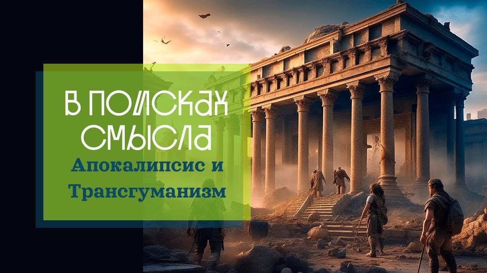

# Апокалипсис и Трансгуманизм

11 марта 2023 [Аудиоверсия](https://paradoks-pinkera-pilotnyy-vypusk.simplecast.com/episodes/apocalypse) 33:15

Почему авторов одного из самых популярных документальных сериалов Netflix «Древний Апокалипсис» (Ancient Apocalypse) обвиняют в системном расизме?
Почему малейшее сомнение в мейнстрим идеях воителей социальной справедливости (SJW) чревато агрессивной «отменой» сомневающегося?
«Мнение приличных людей», как вечно ускользающий от описания критерий оценки этически верной позиции.
Феномен трансгендерности, как выраженное стремление к пределу «созидающей себя» личности. 

**П.Щелин:**
А в ситуации перманентной культурной революции у тебя этого нет.
В ситуации перманентной культурной революции те мысли, которые были для тебя добродетельными и самоочевидными вчера, уже могут таковыми не быть сегодня.
Одна из причин эскапизма – да идите вы нафиг, я не могу участвовать в этой социальной игре.

Нет нерелигиозных мировоззрений.
Их просто не существует.
Любое мировоззрение является либо напрямую религиозным, либо является симулякром религиозного мировоззрения, то есть идеологией.

---

**Е.Голуб:**
Здравствуйте, сегодня у нас второй выпуск подкаста «В поисках смысла».
Я Евгений Голуб, основатель проекта «Otium Academy», общаюсь с политическим философом Павлом Щелином.

Мы стараемся в нашем разговоре понять причины исчезновения, как нам кажется, идей и больших смыслов из нашей жизни.

В прошлый раз мы говорили о том, что я называю парадоксом Стивена Пинкера, который коротко заключается в том, что развитие технологий, которые никто не пытается оспаривать, не привело к тому, что люди стали счастливее.
Как бы Пинкер не пытался нас в этом разубедить, есть масса других примеров и признаков, по которым мы видим, что совершенно прекрасные достижения научно-технического прогресса приводят иногда к совершенно неожиданным результатам.

Павел, с чего мы сегодня начнём?

**П.Щелин:**
А сегодня мы будем говорить об одном современном культурном феномене.
В качестве эксперимента попробуем пообсуждать некоторые культурные феномены современности.
При этом нисколько даже сами по себе, сколько как дорожные знаки и указатели на ту большую фундаментальную проблему, которую мы обсуждаем, а именно проблема осмысленности смысла большого нарратива и их неизбежности и необходимости в культурной жизни.

Культурный феномен, который я предложил на сегодняшнее обсуждение, это недавний документальный фильм, вышедший на Нетфликсе, называется «Древний апокалипсис».
Для всех слушателей рекомендую познакомиться.
Если доступа к Нетфликсу нет, есть другие способы, как найти источник.

Суть фильма очень проста.
Суть фильма заключается в том, что археолог с длительным временным стажем, но лишенный профессиональных связей в академии, то есть его не любят традиционные образовательные институты, занимается исследованием древних культур и древних цивилизаций, и его основной аргумент в том, что примерно в конце ледникового периода произошла некая глобальная катастрофа, в результате которой с лица Земли была стерта более развитая цивилизация, фактически история человечества была перезапущена заново.

Фильм не такой длинный, всего 8 серий, довольно хорошо снят, на мой взгляд, красиво.
Американские Netflix документалки, они, так сказать, всегда относительно в высоком качестве.
Но что интересно, я бы не стал его обсуждать сам по себе, а вот что обсуждать предлагаю, это то, что эта документалка стала самой популярной за последний год на этой платформе.

Вот этот ее столь радикальный успех, он на самом деле, мне кажется, говорит о большем, чем может показаться на первый взгляд.
Да, сразу же скажу, понятно, что создателя этой документалки уже обвинили в том, что он сторонник превосходства белой расы, расист и прочее.

**Е.Голуб:**
Откуда они это взяли?

**П.Щелин:**
Связь там идет очень простая.

Ну, он ставит под сомнение традиционную историографию, назовем это так, и довольно много, если ты заметил по ходу фильма, выступает против того, что он называет мейнстрим, то есть mainstream archeology, mainstream culture.
Условно говоря, у современных борцов за социальную справедливость, в кавычках, с моей стороны в кавычках, с их стороны искренне, по сути, любое выступление против единственного правильного мнения, это является сторонником расизма и белой расы.
То есть у них уже условный рефлекс.

Если ты выступаешь против мейнстрима, хоть в одном из вопросов, это значит, что ты можешь усомниться против мейнстрима в любом из других вопросов.
Дословно, некоторые статьи критики были подобны тому, что люди сейчас посмотрят этот фильм и начинают задаваться какими-то вопросами.
Так дойдет до того, что они будут задаваться вопросами по поводу мятежа 6 января и о правильности государственных политик во время ковида.

Ну, дословно, цитаты из статьи.

**Е.Голуб:**
Это прекрасно.

**П.Щелин:**
Это отдельный феномен.
Он интересен сам по себе.

Но то, что применительно к самому сериалу, все-таки для меня важнее именно сама его популярность.
Подчеркну, здесь даже немножко так получилось то, что несколько недель назад я общался с нетипичным для себя социальным кругом.
Это либеральные достаточно люди, работающие в одной из тех-компаний здесь, в Соединенных Штатах.

И вот, несмотря на то, что они в целом целиком полностью либеральны, сам фильм им дико понравился.
Они его смотрели, обсуждали, в общем, были в восторге.

Здесь как бы со стороны мейнстрима был промах, а вот со стороны фильма было попадание ко всем, я бы сказал, политическим слоям и группам, вне зависимости от их политических предпочтений.
И это уже интересно само по себе на самом деле.
То есть это уже достаточно редко в современных условиях, в современной реальности.

**Е.Голуб:**
Что вызвало такую реакцию?
Что больше всего понравилось?

**П.Щелин:**
А вот здесь вот очень интересный момент.
Мне кажется, на уровне чисто человеческом, знаешь, такое ощущение детского какого-то даже искреннего восторга.
Тайна, загадка, разгадка, ощущение смысла.
Вот к вопросу, почему поднимает фильм.
На самом деле, смысл.

Если ты помнишь, по ходу фильма он ставит тезис о том, что человечество страдает от культурной амнезии с его точки зрения.
И вот эта культурная амнезия, то есть его фильм, это способ преодолеть эту самую амнезию.

Разумеется, мои знакомые в таких терминах не обсуждали.
За всеми их словами, на мой взгляд, скрывалась потребность в неком большом смысле, большой истории, большом нарративе.
То есть подобная история, условно говоря, древней цивилизации, которая гибнет в результате большой катастрофы, а потом цивилизация снова перезапускается.
Можно сказать, что это очень слабый, очень наивный...
Я еще в своем детстве читал кучу подобной литературы.

**Е.Голуб:**
Ну, Атлантида и все такое.

**П.Щелин:**
Атлантида, исследования.
Но вот как раз это и есть.
Это и есть возвращение к некому большому мифу, к некой большой истории.
Пусть очень на простом уровне, пусть очень так просто, символично, может быть, даже коряво.

Но вообще-то это создает хоть какую-никакую, но большую рамку того, что есть человечество, откуда оно пришло, какие вызовы перед ним могут стоять, и кто мы такие.
На самом деле вот эта простая схема, простая история, она дает лучший ответ на такую большую экзистенциальную на самом деле проблему, чем всё, что предлагается на современном, так или иначе, популярном рынке идей.
Заметь вот этот интересный факт.

Он же так и есть.
Такой экскурс небольшой в историю будет полезен.
Здесь мы приходим к одному из ненамеренных последствий.
Попробую гадать, какой эпохи.

**Е.Голуб:**
Все к модерну, все к 15 веку.

**П.Щелин:**
На мой взгляд, больше проблема уже просветителей.

Модерн, но это просветители, наши дорогие.
Потому что именно просветители, по сути говоря, же создали очень простую картинку.
Она гностическая, целиком и полностью картинка, согласно которой есть некое царство тьмы, царство мрака, которое было до нас и из него мы выходим в некое царство света.
То есть очень простая историческая картинка.

С одной стороны, должна была прекрасно работать.
И, собственно, вся вот эта идея просвещения, вся привлекательность просвещения, вся логика просвещения, весь его, так сказать, "опил", то, что называется по-английски, она строится на этой модели.

**Е.Голуб:**
Наш предыдущий знакомый Стивен Пинкер написал книгу о просвещении сегодня.
Он себя считает наверняка частью этого процесса развития просвещения, выхода из тьмы в свет.
И доказательством этого выхода он считает несомненные достижения научно-технического прогресса, что для него это bottom аргумент.
Было темно, стало светло.

Ты сейчас говоришь, что, в общем, это то, к чему стремились просветители.
И выходит так, что, на твой взгляд, мы находимся в той ситуации, когда это уже никого не устраивает, это объяснение, этот нарратив движения к свету себя исчерпал.

**П.Щелин:**
Всё тоньше.
Дело в том, что в этой схеме заложено как раз одно из фундаментальных противоречий этого движения.
Я не знаю, насколько мы с тобой будем практиковать этот сократический метод, поэтому насколько я буду тебя мучить, но попробуй угадать, какое противоречие я имею в виду.

**Е.Голуб:**
Движение от точки из тьмы к свету, то есть от меньшего к лучшему, это позитивизм.
Если же мы узнаём о том, что были высокоразвитые цивилизации, то тогда получается, что это движение как минимум нелинейное.

**П.Щелин:**
Это ты уже смотришь на частные детали, что очень хорошо, историческое мышление.
Я говорю о более фундаментальном логическом противоречии.
Логическое противоречие очень простое.

В рамках этой модели история де-факто обязана начинаться каждый раз с каждым новым поколением.
Вся логика просвещения уничтожает саму историю.
Не просто какую-то отдельную историю тьмы, а историю как таковую.
Потому что если мы даже находимся в логике прогресса, то по логике вещей каждое следующее поколение радикально лучше предыдущего.
А значит, это предыдущее поколение является тьмой.

То есть де-факто у тебя зона света всегда ограничена исключительно настоящим, исключительно текущим поколением.
Одновременно с этим у тебя происходит полное уничтожение предыдущего накопленного исторического опыта, потому что единственное моральное отношение к этому опыту – это стыд.

То есть то, что человек может испытывать по отношению к этому опыту, что ему дозволено испытывать по отношению к этому историческому опыту, это стыд.
Но в итоге у тебя получаются оторванные индивиды, которые не видят, у которых нет никакой временной опоры, потому что все, что находится в прошлом, это тьма.
И вот эта, получается, закольцованная система, или даже ее, наверное, тот может и математически выражать, это такая функция, которая как бы возникает из ниоткуда, по сути, и по мере своего развития постоянно уничтожает саму себя.

То есть это очень некомфортная политическая система, историческая, логическая.
Это логическое противоречие.

**Е.Голуб:**
Разве уничтожает?
Может быть, обесценивает, но в каком смысле уничтожает?

**П.Щелин:**
Ну, обесценивает, уничтожает, но с точки зрения социального, по сути, уничтожает.
Прошлое всегда хуже.
Оно всегда хуже.
В нем нет ничего хорошего по определению.

Причем ты же замечаешь, временные отрезки-то постоянно уменьшаются.
То есть, если, условно говоря, когда начиналось под прошлым, принималась исключительно, ну, допустим, католическая церковь, а еще там, допустим, опыт Рима был хорошим Римом.
По мере развития у тебя прошлое становится, не знаю, вчера это прошлое.
Там месяц назад это прошлое, год это прошлое.
То, что было хорошо 10 лет назад, уже плохо сегодня.

Если ты посмотришь, например, просто как изменилась политическая риторика, не беру каких-то, знаешь, консерваторов, я беру просто риторику Демократической партии.
Прочитай предвыборную программу Обамы 2008 года, условно говоря, и сравни ее с позицией того же Обамы нынешнего.
А прошло всего-то навсего там 10 лет.

**Е.Голуб:**
Просвети меня в этом.
Я не знаком с программой Обамы.

**П.Щелин:**
Ну, скажем так, в 2008 году Обама выступает за традиционную семью.

**Е.Голуб:**
То есть сегодня это уже оскорбительно звучит.

**П.Щелин:**
Ну, конечно.
А сегодня Верховный суд принимает закон, в котором законодательным образом, по сути закрепляется, что традиционная семья – это осколок прошлого, и как прогрессивная Америка защищает прямо противоположные ценности.

Здесь я даже не выношу свою ценностную оценку на данный момент, я просто подчеркиваю, сколь быстро это происходит.
И вот это ускорение постоянного движения и создает то, что я называю уничтожением истории.
В рамках логики просвещения истории нет и быть не может.

Но если это работало на хотя бы, понимаешь...
В XVIII-XIX веках хотя бы это, ну, на протяжении поколений это могло длиться.
Ну, условно говоря, вот конфликт отцов и детей, да, Тургеневский.

У тебя, условно говоря, есть отцы и дети, но хотя бы есть отцы и дети.
А сейчас мы двигаемся по мере ускорения к тому, что даже внутри одной человеческой жизни, внутри одной человеческой психики у тебя происходит постоянное стирание собственного накопленного прошлого опыта.
И здесь мы как раз входим, вот это не случайно, я тебе могу сказать, это и есть утопический проект так называемого культурного марксизма, созданный как раз в 70-е годы такими авторами, как Паулу Фрейре, это вот бразильский теоретик образования.
И он напрямую говорит о том, что его целью является перманентная культурная революция.

То есть если у Троцкого была перманентная революция, то у Фрейре это перманентная культурная революция, согласно которой процесс перемен, он должен длиться бесконечно.
То есть как только у тебя общество двигается на один шаг по направлению к прогрессу, этот шаг автоматически становится недостаточным для этого прогресса, нужно двигаться дальше.
То есть вот это постоянноя рефлексия, постоянная трансформация, постоянное преображение, постоянные изменения.
И это заложено в модель, которая вот находится в образовании.

Но у этого есть побочный эффект.
Я не беру о том, насколько это бесполезно с точки зрения философии.
Проблема в том, что психика это не выдерживает.
То, что мы обсуждали в предыдущий раз, на мой взгляд, это одно из следствий.
Нравится нам это или не нравится.
Но одна из фундаментальных задач любого общества, любой системы культур, любой системы знаков и символов – это создавать человеку устойчивые рамки и координат, в рамках которых он может планировать собственную жизнь.
Причем это планирование, оно очень редко происходит, вы знаете, так осознанно.
Так сел, написал на бумажке.
Нет.
Но это вот то, что ощущается в культуре, в словах, в самоощущении.
То, что тебе, условно говоря, на простом уровне не надо подбирать слова.

Ты можешь просто говорить, не боясь о том, что ты скажешь что-то не то.
Потому что более-менее есть культурный код, в рамках которого вроде говорить можно всё, что угодно.
То есть банально вот на таком уровне это происходит в _неразборчиво_.

**Е.Голуб:**
Ты его воспринимаешь, этот код, само собой разумеющимся, у тебя не возникает чувства опасности, ты ориентируешься в этой системе координат, поэтому у тебя психологически расслабленное более состояние.

**П.Щелин:**
Да, да, тут можно спорить, конечно, о деталях, о границах, насколько это расслабление происходит, насколько оно не происходит, но в какой-то мере оно происходит.
А в ситуации перманентной культурной революции у тебя этого нет.

В ситуации перманентной культурной революции те мысли, которые были для тебя добродетельными и самоочевидными вчера, уже могут таковыми не быть сегодня.
Собственно говоря, это и есть фундаментальная проблема.
Одна из причин эскапизма – да идите вы нафиг, я не могу участвовать в этой социальной игре.

Как я могу участвовать в этой социальной игре, если в ней правила меняются каждый день?

**Е.Голуб:**
А кто ее задает?
Кто играет?
Кто задает правила?

**П.Щелин:**
А вот здесь мы приходим к тому, что стали современные институты.
Это новая жреческая каста, современные институты.
Собственно, единственное, чему учат современные академии, это умение разбираться в этой лингвистической игре.

То есть умение отслеживать, какое мнение на нынешнюю точку времени является приемлемой.
То есть, условно говоря, вот эта толпа в Твиттере.
Как быть на правильной стороне толпы Твиттера, как понимать, какие мнения и позиции являются в нынешний момент приемлемыми.
Собственно, это, по сути говоря, единственное, чему учит современный гуманитарный университет.

Но все-таки современный гуманитарный университет, во-первых, это очень ограниченная, как ни крути, форма.
Во-вторых, даже в рамках этой формы все практики, которые там созданы, они нездоровые.
То есть, если бы это была здоровая форма, ладно бы.

На практике вот эта, условно говоря, основная партия молодых комсомольцев, она, собственно, является, по-моему, основным потребителем всех стимулирующих или подавляющих веществ в зависимости от предпочтений.
Потому что одной из частей вот этой культурной революции, в которую они сами себя помещают, это вот перманентная культурная революция внутри себя самих.
То есть они должны над собой постоянно рефлексировать.
Все вот эти тренинги по белой хрупкости или тренинги по внутреннему расизму, то, что они пытаются проводить в больших корпорациях, но начинают-то они с себя.
Они в такой атмосфере живут.
Им самим в этой атмосфере жить некомфортно, просто они боятся себе в этом признаться, потому что они теряют свой жреческий статус в этот момент и теряют свою добродетельность.
А это единственный источник их сакральной добродетельности, сакральной, так сказать, ценности, если тебе угодно.
То есть это все, над чем висит их, по сути говоря, религиозная система мировоззрения.

Здесь мы приходим немножко косвенно к тому взгляду, то, что все то, что мы обсуждаем, оно, конечно, упирается в тот спорный для многих слушателей, но абсолютно очевидный на уровне философии факт, что любое мировоззрение является религиозным мировоззрением.

Нет нерелигиозных мировоззрений.
Абсолютно.
Их просто не существует.
Любое мировоззрение является либо напрямую религиозным, либо является симулятором религиозного мировоззрения, то есть идеологией.

**Е.Голуб:**
Мы обязательно к этому придём.
Обязательно.
Сейчас я хотел бы вернуться к теме древнего апокалипсиса.

Если я правильно понимаю, речь идёт о том, что простое рассуждение о возможности древней высокоразвитой цивилизации 10-12 тысяч лет назад сбивает с толку последователей вот этого нового религиозного культа.
Я всё-таки пока ещё не понимаю, почему.

Что тут такого?
Чем это им угрожать может?

**П.Щелин:**
Ну, получается, что история началась не с нас.
В культе Просвещения заложено имплицитно вот это утверждение, что история началась с нас.
Мы избранные.

А тут получается, что мы не совсем избранные-то.
Может быть, были другие избранные.

**Е.Голуб:**
Избранные кто?
Носители знания?

**П.Щелин:**
Носители знания, да.

**Е.Голуб:**
Поклонники Просвещения, интеллекта, разума?
Двигатели к всё более разумному миру?

**П.Щелин:**
Ты смотришь сейчас на уровне идеи, а тут мы как группа-носитель.
То есть тут скорее групповое мышление.
То есть именно то, что мы избранные как группа, которая обладает правильным набором ценностей.

Классический образ просветителя.
То есть вспоминай вот этих напыщенных, не очень приятных людей во французских салонах, которые с таким апломбом, цинизмом и презрительной улыбочкой смотрят на всех окружающих.
Они же это делают не просто потому, что они неприятные люди.
Они в этом акте декларируют свою, по сути, религиозную избранность.

То есть это избранная группа.
Мыслят они себя исключительно как избранная группа.
Позднее просто, что происходит в XIX и XX веках, идут дебаты о том, кто, собственно, является этой избранной группой, каковы критерии вхождения в эту избранную группу.
Но модель, принцип остается все равно неизменной.

И вот одна из основ кодекса вот этой избранности – это то, что, по сути, история начинается с нас.
То, что нет никакого большого нарратива.
Не случайно то, что в 20 веке во второй его половине начинается вот это движение деконструирования.

По сути говоря, все культуры до этого, начиная там с каких-то самых простых мифов индейцев Северной Америки, продолжая, допустим, через Гесиода, его знаменитую градацию на века, библейский символизм и так далее, все они мыслили историю как некую цельность.
Твое положение в настоящем было не положением атомизированного индивида, а было положением индивида, который связан с прошлым и проецирует себя в будущее.
То есть это была укорененность не просто пространственная, но это была укорененность временная на уровне психики.
Причем это ощущалось не какими-то только интеллектуалами.
Это ощущалось каждым членом общества, начиная от самого простого крестьянина.

Даже самый простой крестьянин понимал, что было в прошлом, почему он находится в этой временной точке, и какая у него более-менее перспектива на будущее.

**Е.Голуб:**
Разве без этого ощущения вообще можно жить?
Я не представляю.

**П.Щелин:**
Так вся современная культура построена на том, что этого ощущения нет.
Это вот в том-то и дело, что вся современная культура по мере развития идей просвещения, она и строилась последовательно на уничтожении исторического мышления.
И период деконструкции, вся культура деконструкции, все то, что было посвящено, чтобы развенчать исторические мифы, показать о том, какая история на самом деле не такая.

**Е.Голуб:**
То есть это история угнетений и лжи, а мы сейчас, наконец, всё раскроем и развенчаем, и выведем наружу?

**П.Щелин:**
Мы выведем наружу, да, но тут это и момент, что ладно, а дальше-то что?
В этом-то и момент.
Подвисал-то вопрос, а дальше-то что?
То есть, что деконструкторам удалось хорошо?
Им, правда, удалось хорошо разрушить все большие нарративы.
Последовательно.
То есть, довольно талантливо.
Это многие работы историков-деконструкторов, это качественные работы, я не могу ничего сказать.

Они со своей задачей разрушения больших нарративов справлялись осмысленно.
Тут можно немножко отдельно поговорить о том, почему это происходит, если хочешь.
Но давай просто эти...
На данный момент могу отметить, что деконструкция действительно работает, потому что деконструкция опирается на фундаментальную проблему любого большого нарратива.

Любой большой нарратив, он символический.
То есть любой большой нарратив, он оперирует символами.
А символ, он всегда научно неточен.
Он метафорически точен, он метанаучно точен.
Но научно, то есть фактически, он весьма неточная штука.

Если ты своей ставишь целью, будучи вооружённой научными критериями, деконструировать что-то, то ты деконструировать можешь вообще всё, что угодно.
Дай мне тему, я тебе её деконструирую.
При достаточном количестве ресурсов и желания деконструировать можно что угодно.

**Е.Голуб:**
А вот когда ты говоришь «деконструировать», ты что имеешь в виду?

**П.Щелин:**
То, что история была не такая.
То, что вы думали, условно говоря, Колумб это герой, он оказался не герой, а как это, знаешь, есть такой грубый анекдот времен Советского Союза, но здесь он очень точный.
Весь принцип деконструкции в истории выражен простой фразой.

> Оказался наш отец не отцом, а сукою.

Вот, собственно, вся история.
Вот основной принцип любой исторической деконструкции.

**Е.Голуб:**
Для того, чтобы выносить суждение, нужна всё равно какая-то система координат.
Для того, чтобы сказать хороший-плохой, чтобы поставить оценку, нужна система координат.
Как-то её нужно задавать.

**П.Щелин:**
А вот здесь тонкий момент.
Системs координат нет, но ты её не формулируешь.

**Е.Голуб:**
То есть она есть или её нет?

**П.Щелин:**
Она как коn Шрёдингера.

Мы её знаем, но мы её формально вам никогда не скажем, потому что в тот момент, когда мы её скажем, мы сами себя ограничим.
Но есть мнения, которые разделяют все приличные люди.

**Е.Голуб:**
Что это хорошо, а это плохо.

**П.Щелин:**
Да.

**Е.Голуб:**
Мне кажется, что это не может долго продлиться, потому что это противоречит каким-то фундаментальным вещам в нашем мышлении.

**П.Щелин:**
Я с тобой согласен, но уточню, что недолго в историческом смысле.

**Е.Голуб:**
Ну да, естественно.

**П.Щелин:**
Недолго в историческом смысле западная культура точно 50 лет в активной фазе.

**Е.Голуб:**
А это заразно?

**П.Щелин:**
О, это прекрасно заражается.
Это очень заразная штука.

**Е.Голуб:**
А почему?
В чем привлекательность?

Я не могу найти ничего привлекательного в этом.
То есть что, ощущение избранности?
Что может давать человеку желание присоединиться к этому?

**П.Щелин:**
Конечно, ощущение избранности.
Это мышление секты, это мышление религиозного культа.

В мире, где у тебя разрушены массовые традиционные ценности традиционной религии, системы смыслов и символов традиционных религий, потребность в религиозном мироощущении никуда не делась.
И вот это стремление быть избранным, подсознательное, которое особенно сильно заложено в протестантскую культуру, во все страны протестантской культуры, оно просто, по сути, не имеет никаких внутренних механизмов защиты.

В этом смысле, условно говоря, версия коммунизма, которая распространилась в странах православной культуры, заметь, очень сильно отличается от коммунизма в странах протестантской культуры, потому что оно работает по-другому.
То есть если, условно говоря, в странах православной культуры избранность, она всегда групповая характеристика, причем такая групповая характеристика на уровне всего общества, коллективно спасается.
Спасение, оно, по сути, принадлежит не человеку, а группе.
Мы всегда как бы вместе погибнем, вместе и спасемся.

То вот у протестантов-то нет.
У протестантов надо еще эту группу найти.
Надо эту группу отгадать.
Ты же не знаешь, какая группа избрана, а которая нет, по дефолту.
Но ты должен в это верить.
Это же основа мышления.
То есть наверняка знать ты не можешь, но ты должен в это искренне верить.

Будучи перемещенной на секулярную почву, вот этот исторический марксизм, историческая деконструкция, она достигает своих целей.
Особенно в академической среде.
То есть ты, получается, не просто потребляешь наркотики и наслаждаешься сексуальной свободой, а ты находишься на правильной стороне истории.
Ни много, ни мало.

Возвращаясь к тому, что я хотел дополнить, про деконструкцию.
Суть деконструкции была в том, что она была успешна.
Прокладывая мостик к древнему апокалипсису, в чем его-то привлекательность.

А привлекательность в том, что деконструкция успешно разрушила все большие нарративы.
Человеку не на что опереться.
Вся история – это ужас, ужас, ужас.
Хороших людей там вообще нет.
А если даже они хорошие, то он никогда не может быть уверен в том, что завтра они не будут объявлены плохими.
Потому что наши ценности изменятся.

И получается, что человек остался на холодном ледяном ветре исторического времени.
И ему на нем дико неуютно.
То есть вот этот мир больших нарративов при всех своих недостатках, он гораздо теплее и уютнее.
В нем хоть какая-то система координат, в нем хоть какой-то смысл.

А мир деконструированной истории – это мир пустоты.
Мир такого голого перекати-поля, в котором шарик, который катится по этой бескрайней пустыне – это и есть ты.
Ты человек и есть вот этот шарик.
Это создаёт огромную зияющую пустоту, зияющую дыру, которую люди заполняют в меру своих сил и способностей.

**Е.Голуб:**
Звучит так, как если бы мы начали с древнего апокалипсиса, а заговорили о приближающемся.
Потому что, как мне кажется, последовательно двигаясь по тому направлению, что ты описываешь, я не сталкивался с этим явлением, кроме как в средствах массовой информации, отголоски в YouTube-роликах, не приближался, лично не встречался с такими людьми.
Для меня это выглядит маргинальной странностью, которая должна как поветрие пройти.

**П.Щелин:**
Ты с молодежью давно разговаривал в последний раз?

**Е.Голуб:**
Да, та молодежь, с которыми я общаюсь, видимо, еще не очень в курсе.

Я просто пытаюсь понять для себя.
Ну хорошо, вот всех объявили плохими, условно говоря.
Всех поместили в клеточку беда-беда, негодяи.
Всех деконструировали, снесли все памятники, закрыли там парк этим расистам и негодяям.
Хорошо, дальше что?

Ведь любая идея, она живет, пока она что-то, ну хорошо, какое-то время разрушает, но надо же что-то созидать.

**П.Щелин:**
Она созидает самого себя.
Это такой алхимический принцип, птица Феникс и прочее.
Единственное, что она созидает, это самого себя.

Мы с тобой косвенно затрагивали, почему феномен трансгендеров является ключевым феноменом в современной западной культуре.
Созидание самого себя.
Единственное, что ты созидаешь, это самого себя.
Это абсолютная замкнутость.
Это замкнутость всего мира на самом себе.

Вот в этом огромном, холодном, неуютном историческом мире твоя задача, следуя неизвестным, ну, известным правильным людям, следуя гнозису, созидать самого себя.
Такое мировоззрение, по сути говоря, предлагается в качестве основы, повторюсь, для общества в рамках позднего этапа просветительского проекта.
Я недаром с него начал.

Это уже все было заложено, условно говоря, у Руссо.
Уже у Руссо вот это все есть.
Просто это написано другим языком, это формулируется чуть в других критериях, но по сути своей это все уже есть у Руссо.

Просто потребовалось несколько столетий, чтобы это достигло, ну, современной стадии, назовем это так.
Неизбежным концом вот этой темы является саморазрушение человека и цивилизации, схлопывание, такая точка сингулярности.

**Е.Голуб:**
Да, если мы говорим, что человек замкнут по самому себе, то в конечном итоге он...
Какое-то удивительное одиночество.

Ну, я даже не хочу представлять, это какой-то ужасный мир, совершенно жуткий, совершенно неуютный.
Нет ни одной причины его сохранять, скажем так.

**П.Щелин:**
Смотри все, что мы видим, и то, что мы обсуждали в предыдущий раз, и все, что мы видим в современной культуре.
Где ты видишь любовь-то к этому миру в современной культуре?
Где ты видишь желание бороться за этот мир?
Именно за мир, как целостность некоторую.
Где ты видишь вообще хоть какую-то витальность?

Заметь, вся современная западная культура, соответственно, европейская, американская, да, и восточноевропейская, в большей ее части, потому что мы...
Отдельный разговор на тему колонизации модерном всего земного шара.
Но она вся мортальна.
У нас вся культура о смерти.
У нас вообще культура не о жизни.
У нас ничего живого в культуре не осталось.
У нас вся культура про смерть.

Причем только смерть не в честном её виде, а вот именно подсознательном.
То есть это вот то, что бы, условно говоря, психоаналитики назовут это подсознательное стремление к самоуничтожению, к смерти.

Даже современный экологизм в нынешнем его виде — это, по сути, то же самое мортальное проявление.
Человечество настолько ужасно, что давайте исчезнем, а природа вот тогда сама по себе будет, живая.
То есть функция жизни переносится на природу, а человечество должно умереть.

**Е.Голуб:**
Но ведь это неустойчивая система.
Я не вижу ни одного шанса у неё выжить, по крайней мере, победить в конкуренции с большими нарративами.

**П.Щелин:**
Так они и не хотят.
А какие большие нарративы-то остались?
Они же, понимаешь, это же наступает в нынешнем варианте, когда они думали, что все большие нарративы они разрушили.

**Е.Голуб:**
Ислам, по крайней мере, я, насколько понимаю, еще...

**П.Щелин:**
Вот с исламом, да, абсолютно точно указываешь.
Они думали, что единственный вариант, который, по сути говоря, оставался большим нарративом на рубеже 2000-х годов, это был ислам.

Думаю, у них были варианты, как покончить с исламом в том или ином виде.
Можно растлить, можно разбомбить, можно подкупить.
Здесь феномен Афганистана очень интересен.
Что произошло в Афганистане, и как раз то, что 20 лет трансформации привело к тому, что все сбежало в три недели, это очень показательный пример.

Да, ты абсолютно согласен.
Но чтоб ты понимал, они искренне думают, что все большие нарративы им разрушить удалось.
Но в рамках своей культуры это им правда удалось.
Они в рамках своей культуры разрушили все большие нарративы, а весь остальной мир, они думают, условно говоря, должен подчиниться их воле, потому что они являются источником технологий.
Потому что если ты не хочешь, чтобы тебя отключили от вот этого источника благ современности, условно говоря, от микрочипов, то будь добр, слушайся нас.

Это же вообще-то не добровольная система, она вся построена на власти.
Ты правильно заметил, если у вас нет культуры ценностей, а есть только замкнутые на сами себя индивиды, какие единственные отношения между ними могут быть?

Власти, борьбы за власть, подчинение и угнетение.
То есть это все связано, конечно, абсолютно.

**Е.Голуб:**
Спасибо за твой рассказ.
Я никогда не думал о том, о чём ты говоришь, видимо, потому что я всё-таки погружён немного в другую реальность.
Тебе в Соединённых Штатах виднее.
Звучит жутко.

Звучит жутко, и можно было бы сказать, что неожиданный поворот от древнего апокалипсиса к ощущению приближающегося апокалипсиса новой культуры, которая стремится к самоуничтожению заставляет задуматься.
Мне было бы интересно, конечно, что скажут нам наши слушатели.
Согласны они с этим?
Чувствуют ли что-либо подобное?

Мог бы осторожно заметить, так очень аккуратно возразить.
Мне кажется, что скорость, с которой это явление распространяется, не учитывает инерцию поколений.
Всё-таки пока ещё живёт слишком много людей, которые причастны к большим нарративам или к отголоскам больших нарративов.

И если прочитать комментарии к некоторым вот таким особо радикальным видео или к обсуждению видео, то видно, что и в тех же Соединённых Штатах, и в Европе огромное количество людей приходят в ужас и не хотят иметь с этим ничего общего.
Поэтому остаётся надежда, что этот монстр сам себя сожрёт и не успеет загадить мозги нашим детям и внукам.

**П.Щелин:**
Тоже в завершении два дополнения.
Хочу поддержать в двух моментах.

Первая частная проблема, вторая проблема более общая.
То есть частная проблема вот этого отсутствия нарративов.

Она действительно в том...
Ну, во-первых, есть поколенческий разрыв.
Ты абсолютно прав в том, что есть большие нарративы.

Во-вторых, уже сейчас очевидно, что есть просто незападная культура, которая от своих больших нарративов отказываться не собирается.
Это как раз про ислам, про даже тот же Китай, если у тебя угодно, про буддизм.
Какие-никакие, но там большие нарративы есть.
Индия не особо попадает под эти все нарративы.
Да даже Восточная Европа, при всей нашей специфике, она очень сильно не является комфортной зоной для этих нарративов.
Хотя здесь есть нюансы.

Вторая, более фундаментальная проблема вот у этой всей культуры, есть же ахиллесова пята.
Есть такая проблема, проблема самовоспроизводства.

По мере собственного ускорения она сталкивается с тем, то, что абсолютно непонятно, каким образом она может самовоспроизводить себя.
Ну, потому что если ты искренне веришь в эту культуру, условно говоря, мортальную и внеисторическую, если тебе угодно, антиисторическую, то один фундаментальный вопрос это, а, собственно, зачем тебе жить и зачем тебе продолжать жизнь в будущем?

И, ну, условно говоря, абсолютно непонятно, каким образом эта культура рассчитывает на самосохранение в вечности.
Отсюда два следствия.

То есть, скажем так, вот вам причина двух феноменов современной жизни, которые вы могли видеть, но вряд ли задумывались, где их философские и психологические корни.

Ну, первое – это вот фокусировка на технологическом бессмертии.
То есть, вот это, условно говоря, старые деды, которые вот только и думают о бессмертии, о технологиях, говорят вот об этом с таким восторгом, как они переселят свое тело, как они переселят свое сознание в компьютер.
Вот это вот первое решение этой проблемы.
То есть в буквальном смысле вот вся идеология трансгуманизма, она висит на тему того, что проблемы воспроизводства в этой системе просто нерешаемы.

**Е.Голуб:**
Снял с языка.
То есть трансгуманизм, получается, не случайно моден в повестке дня.

**П.Щелин:**
Причем, заметь, среди кого?

Он моден среди людей, которые не имеют других ключей к бессмертию.
Не религиозных в классическом смысле, то есть бессмертия души, да и не физическом.

Ну, условно говоря, люди, которые не могут иметь детей, не хотят иметь детей, не могут иметь детей в силу сексуальных предпочтений и так далее и тому подобное.
То есть вот это технологическое решение проблемы бессмертия, скажем так, вот.
Либо являются просто очень старыми людьми, которым смерть случится, а они хотят в трансгуманизм, им бессмертие хочется.

А второе – это вот объяснение того, что неслучайно ключевая борьба современности и борьба будущего – это культурная борьба за образование.
Потому что единственный способ этой идеологии временно двигаться в будущем, это паразитировать на следующем молодом поколении.
Но поскольку собственных детей у них мало, значит, надо заражать чужих детей.
Это как вирус.
Значит, тебе нужно получить контроль над всеми образовательными институтами, разорвать связь поколений, разорвать те большие истории и превратить уже детей других людей вот в новых...

**Е.Голуб:**
Носителей.

**П.Щелин:**
Таких рабочих муравьев своей идеологической системы.
Носителей этой системы, да.
Собственно, вот.

И последний пункт – к источникам надежды.

Но даже все это не работает.
Подсознательно даже во всех этих людях сохраняется тоска по большому нарративу, о чем и свидетельствует популярность древнего апокалипсиса, на мой взгляд, с которого мы начали.

То есть даже среди самых либеральных людей подсознательно сидит огромнейшая жажда большого нарратива.
Сами признаться, они пока не могут, рефлексировать не могут, но она в них неистребима, потому что, на мой взгляд, это часть человеческой природы.

Но об этом поговорим как-то в следующий раз.

**Е.Голуб:**
Спасибо, Павел.
Сегодня мы прощаемся и встретимся через неделю.

**П.Щелин:**
До новых встреч.
