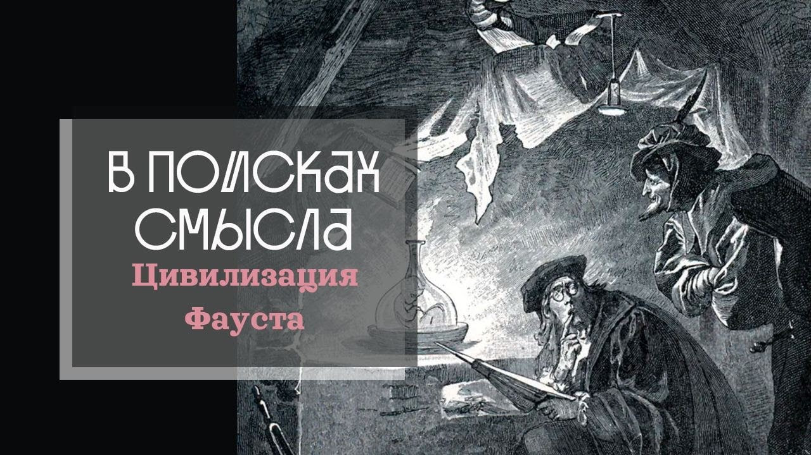

# Цивилизация Фауста

18 марта 2023 [Аудиоверсия](https://paradoks-pinkera-pilotnyy-vypusk.simplecast.com/episodes/faust) 31:56

В третьем выпуске подкаста говорим о том, что делает историю доктора Фауста такой важной для понимания  устремлений и тупиков цивилизации модерна.
Торжество и бессилие Разума, скука и отчаяние того, кто «разумнее всех глупцов», тщетность обрести целостность и, несмотря ни на что, – уверенность автора в спасении героя.
Спустя почти 200 лет после того, как был написан финал трагедии, мы находим в метафорах автора близкие нам сегодня смыслы.

**П.Щелин:**
Связь современной науки и оккультизма, она более чем прямая.

Все классики научной деятельности, от Ньютона до Бейкона, никто из них не занимался чистой наукой в современном понимании этого слова.
Эти люди преследовали в основном оккультные цели.

Если вы хотите понять, как мыслят и какие ограничения есть у нынешних элит, читайте произведение Гёта именно с этой целью.

---

**Е.Голуб:**
Здравствуйте, уважаемые слушатели!
В эфире подкаст Евгения Голуба и Павла Щелина.
Евгений Голуб — это я, основатель образовательного проекта Otium.Academy.
А Павел Щелин —

**П.Щелин:**
… широко известный в узких кругах политический философ.

**Е.Голуб:**
… который к моей радости согласился вместе со мной поговорить, поучаствовать в поисках смысла в формировании или формулировании парадоксов, той реальности, которая нас окружает.
И если мы не сможем найти ответы или разгадать эти парадоксы, то мы хотя бы сформулируем вопросы или попробуем сформулировать, в чём, собственно, эти парадоксы заключаются.

Сегодня у нас уже третья встреча.
Сегодня Павел предложил посмотреть на происходящее, на современность глазами доктора Фауста.

И мой вопрос к Павлу, почему именно Фауст?

**П.Щелин:**
Я солидарен в анализе цивилизации современности, как цивилизации Фауста, которая употреблялась и многими авторами уже в начале 20 века.
В частности, в комментариях на Шпенглера Сикорский так и описывал то, что цивилизация Европы, цивилизация Запада, я бы сказал, цивилизация модерна, это и есть цивилизация доктора Фауста или Фаустова цивилизация.
И, на мой взгляд, это одно из самых точных описаний, самых точных определений, которое позволяет нам проникнуть к сути самого вопроса, к сути самих вещей.
А суть самих вещей, она во все времена примерно остаётся неизменной.

Это трансцендентная мотивация, то есть позиционирование себя во времени, те цели, которые ставятся относительно временного пространства среди творческой элиты, культурной элиты, политической элиты.
Поскольку мы не имеем возможности потрогать эти мотивации напрямую — это довольно все-таки закрытые группы — приходится довольствоваться культурными артефактами, одним из которых, разумеется, является произведение Гёте «Фауст».

В связи с этим я и предложил его для нашего с тобой сегодняшнего обсуждения.
Потому что, как я в течение своей жизни понял, Фауст и Гёте — это тот случай, когда все слышали, но очень мало кто знает, а собственно, в чем конкретно состоит это произведение.
К той же категории Шекспир очень часто относится, если брать классиков западной литературы.

**Е.Голуб:**
Да, обычно все останавливаются на том, что пожилой учёный, обретя молодость при помощи сатаны, совратил юную девушку, потом убил её брата и в результате она была казнена.
Я думаю, что дальше мало кто продвигается.

**П.Щелин:**
Между тем, произведение ключевое.
Но можно начинать с самого начала.
Во-первых, очень хорошо, что это постановка вопроса.
Мы вспоминаем, кто такой Фауст.
Это воплощение разума.

То есть с самого начала Гёте приводит нас к очень фундаментальному вопросу.
Если мы вспомним, с чего начинается западная цивилизация, да и весь проект современности...
Точнее, не западная цивилизация, а проект современности, то он начинается, по сути, с переоценки роли разума в человеческой жизни и создания немного-немало культа разума.
То есть в период уже с 17 века, 18 век, вот эта идея разума с большой буквы, который своими светлыми лучами разгоняет тьму невежества, разум, который человека и отделяет от животного мира, и создаёт из человека полубога или даже бога, в зависимости от разных авторов этой эпохи.

Но в самом начале произведения Гёте разум показывает свою ограниченность.
Здесь в этом плане Гёте делает очень такой смелый шаг, на мой взгляд, и он показывает нам то, что вот этот Фауст, это не просто человек, а это человек, достигший пределов познания, ни много ни мало.
Если ты помнишь, вначале он выучил вообще все, что можно, включая тайные оккультные науки, которые здесь, разумеется, не случайны.
Для Гёте он еще не держал скрытым тот элемент, который сейчас принято игнорировать в научной среде, но надо понимать, что связь современной науки и оккультизма, она более чем прямая.

Все классики научной деятельности, от Ньютона до Бэкона — никто ни из них не занимался чистой наукой в современном понимании этого слова.
Эти люди преследовали в основном оккультные цели.
Они хотели власти над миром, они хотели общаться с демонами, они хотели контролировать демона, они хотели создавать алхимические разные приспособления.
И это было не случайно.
То есть, опять, сейчас я очень часто встречаю мнение, что это, дескать, простые предрассудки.
Но тут мне очень интересен парадокс.

То есть, вы одновременно превозносите этих людей как величайших жрецов вашего храма, разума, научного мышления и прочего, но и в то же время считаете их деревенскими бабушками, полными предрассудков.
Тут уже, как говорится, «либо трусы наденьте, либо крестик снимите», следуя знаменитому анекдоту.

И здесь вот этот образ Фауста нам важен.
В принципе, он показывает очень простую вещь.
С самого начала то, что разум сам по себе, как бы нам не хотелось, он будет не самодостаточен.
Он не наполнит человека, он не даст ему ответы на его трансцендентные запросы.
Это мы видим буквально в первой главе.
По крайней мере, я её читаю примерно таким образом.

**Е.Голуб:**
Очевидно, что главный герой, Фауст, в начале произведения испытывает пресыщенность знаниями, тоску, он подумывает даже о самоубийстве, он уже не знает, чем заняться, где обрести смысл, чем себя развлечь и, по сути, скучает, находится в таком состоянии уныния, выражаясь языком христианских понятий, и в этом состоянии он вызывает демона.
Ну и дальше, собственно, начинается развитие сюжета.

**П.Щелин:**
Да, но это литературный персонаж.

А если мы переводим его именно на историю философии, то здесь, повторюсь, для меня важен именно каждый из персонажей, как символическое воплощение той или иной идеи.
Здесь начинается вот эта фаустианская демонстрация ограниченности разума с позиции самого разума.
Она же характерна для всей европейской цивилизации.
Это одно из её глубинных противоречий.

То есть, что сделала западная цивилизация современности, на чём она получила свою силу и позволила ей, по сути, доминировать над всем миром?

Разумеется, это было обращение к материальной культуре, которую до этого не ставила ни одна цивилизация, кроме Рима, а, возможно, даже и Рим в той степени не ставил.
Красноречивый пример — порох был изобретён ещё в Китае, но Китай не додумался, как эти изобретения трансформировать в оружие мирового доминирования.
А Европа сделала.

Даже уточним: не просто Европа, а Европа капиталистическая, Европа протестантская, Европа модерна.
Всё это Европа сделала, и она через это получила власть над миром.
И в этом смысле мы будем постоянно уходить в библейские темы, потому что в каком-то смысле Европа пошла на сделку с дьяволом, как на получение материального блага.

С тех пор это и есть преследование, а если угодно, тень, призрак всей западной цивилизации.
Я объясню, что я имею в виду.

Если механизмы познания, механизмы науки существовали, разумеется, во времена Средневековья, то есть для любого человека, который будет читать произведение Фомы Аквинского, любого человека, который будет знакомиться с Аристотелем и прочими, будет очевидно, что люди, населявшие европейский континент до нового времени были чем угодно, кроме как отсталыми дикарями.
Это абсолютно миф, что Европа была каким-то местом отсталости.

Просто посмотрите на эволюцию доспехов, на эволюцию архитектуры.
Там за столетия проводятся изменения, которые Рим не сделал за тысячелетия...
Ну, по сути, за тысячелетия.
Если вы посмотрите на структуру Готического собора, то с точки зрения архитектуры, это инновации в разы больше, чем Рим сделал за весь свой собственный период.
Вот просто в таком вакууме если брать.

Разумеется, это не было какое-то царство без познания, без разума.
Но это было действительно царство и культура, в которой разум был предельно ограничен.
И ограниченность его была целями.
Разум всегда был ограничен благом.
Познание рассматривалось не как сама цель, а как средство достижения того или иного блага.
Причём высшим благом, разумеется, у нас было постижение Бога Божественного.
Что происходит в самом начале цивилизации модерна?

Познание отделяется от блага.
С познания, с разума снимаются оковы, если угодно, необходимости ограничивать себя этикой, эстетикой, представлениями о должном, представлениями о правильном.
И, по сути, единственный критерий, который более-менее остаётся — это критерий рациональной пользы.
То есть если это приносит деньги или если это приносит власть, то это хорошо, но это очень инструменталистский подход.

**Е.Голуб:**
Это происходит не сразу, насколько я понимаю, это происходит постепенно.
Большинство учёных того времени, они остаются религиозными людьми?

**П.Щелин:**
Они остаются людьми религиозными, но с точки зрения культуры у разума пропадает это ограничение.
Ну и по-разному, например, знаменитая цитата Бэкона, вот это, «Знание — сила», она же не случайна.

Она именно про то, то что Бэкон, который сам, между прочим, был оккультистом...
Здесь мы сейчас скажем, почему оккультизм здесь становится важен...

Этот подход, он предполагает, что знание — это способ получить власть над миром.
То есть, если у тебя раньше познание — это путь к Богу, то теперь у меня это знание — это власть над миром и материал преображения этого мира.
И это происходит вот в самом начале нового времени.
То есть, если вот будешь читать Бэкона, то там описывается этот процесс в метафорах.
Он примерно говорит о том, что задача разума приобрести знания, чтобы поступить с природой, подобно тому, как мужчина поступает с девушкой.

То есть очень такая даже сексуальная метафора происходит, если тебе угодно.

**Е.Голуб:**
Сравнение природы с мастерской ещё довольно аккуратное, скажем так, или вежливое.

**П.Щелин:**
Это очень вежливое, да.
То есть сравнение природы с мастерской — это такое более эстетическое.
Если читать совсем отцов-основателей современного научного проекта, там метафоры могут быть и сильно жёстче.

Основная идея — это власть.
Знание становится инструментом власти.
И это создаёт успех Европы.
Казалось бы, очень простая идея, маленькая, можно сформулировать в одном предложении, но масштабы её революции и последствий, они вот последние 400 лет, мы их и наблюдаем.

Когда у тебя...
у вас знание становится инструментом, властью, у вас меняется всё.
У вас меняется структура социальных отношений, у вас меняется мотивация, у вас меняется представление о допустимом, должном и возможном.
У вас появляются абсолютно другие представления о ресурсах.
Но в этом контексте у вас остается большая дыра.
И эта дыра заключается в...
А, собственно, зачем?
Власть ради власти?

Ну вот на простом уровне можно сказать, да.
По моему опыту и общению с людьми, и по моему прочтению, очень мало людей готовы заниматься просто властью ради власти.
Это уже нужно обладать вот такой запущенной психопатией, на самом деле, потому что ни один человек для самого себя, прежде всего, не будет объяснять свое стремление к власти, как просто стремление к удовлетворению собственного эго.
Значит, возникают потребности иного порядка.

И поскольку от потребностей божественных вы так или иначе отказались, вам надо их преобразовать и трансформировать.
И отсюда возникают различные современные гностические проекты знания, гностические проекты, в которых знание сливается с властью ради некого преобразования мира в нечто другое.
А дальше возможны разные сценарии.
И на этом пути сделки, условно говоря, с оккультными темными силами, как метафорой, они более чем допустимы.

Действительно, чем примечателен Фауст, возвращаясь к нему как к произведению, то, что с самых первых страниц мы видим, в принципе, всю развернувшуюся эту драму.
То есть уже во всей первой главе вся эта драма видна, если уметь читать.
Сама завязка драмы, мы имеем что — условно говоря, мысленный эксперимент.

Вот человек, преподаватель, ученый, который продвинулся по пути познания предельно глубоко.
Метафорой «знание — силы» он получил, насколько это было возможно человеку.
Но это оказывается недостаточно, он оказывается в ловушке смыслов, как ты правильно описывал, он думает о самоубийстве, и единственный его выход — это в дикой гордыне такой, такой наглой даже гордыне, попытаться заключить сделку с дьяволом.

И он ее заключает.
То есть, если подключать здесь фрейдистские метафоры, можно тут как бы использовать условно с темной стороной собственной природы, с темной стороной самого себя...
Но завязка-то идет именно в этом.
То есть, условно говоря, лучшее воплощение этой цивилизации не имеет иного выхода, кроме как обратиться к оккультизму.

**Е.Голуб:**
В какой момент дьявол может забрать к себе душу Фауста?

В тот момент, когда он скажет: «Остановись мгновение, ты прекрасно».
То есть фактически Фауст хочет обрести полноту жизни, которую он не может обрести иначе, хочет достичь такого состояния, когда его жизнь будет исполнена, по сути, вот этим предельным смыслом, тем смыслом, который он не может найти в знаниях, доступных ему.

**П.Щелин:**
Абсолютно.
Это очень ключевой момент, потому что на самом деле (здесь Гёте это не пишет, но я рискну здесь предположить) — это как раз иллюстрация того предельного парадокса, в котором оказывается вот эта элита современности после того, как она разорвала цельное восприятие мира.
Потому что в чём различие цивилизации до модерна от цивилизации современности?

Идеалом модерна, идеалом предыдущей цивилизации, начиная на самом деле от Платона, было знание цельное, была жизнь цельная, где слово не расходится с делом, мысль с чувством, вера и разум находятся в состоянии гармонии.
Вообще идеал был цельность, причем эта цельность переживалась по-разному на уровне крестьянина одним образом, на уровне монаха другим образом, на уровне университетского профессора другим образом, на уровне князя или монарха в 4-м и 5-м, но на самом деле каждый из них так или иначе стремился обрести жизнь как некое цельностное переживание.

А вот эта революция «знание как сила, знание как власть, знание как инструмент господства и доминирования», побочным своим эффектом ненамеренным, оно же разрушило цельность самой жизни.
Вот это декартовское разделение мира на «res cogi-tans» и «res extensa» — на вещь мыслимую, на вещь протяженную, оно разорвало не только мир, оно разорвало сами души людей, которые находились в авангарде этого проекта, находились в авангарде этих ценностей.

Это опять-таки ироничным образом получается.
Заметь, тут все просто наполнено какой-то дикой иронией, потому что получается, на примере Фауста, единственный способ восстановить эту целостность — пойти на сделки с дьяволом.
Я это интерпретирую именно так.

**Е.Голуб:**
Интересно, давай чуть остановимся здесь.
Я хотел бы лучше понять твою мысль.
Почему произошел этот разрыв?
Где эта точка разрыва?

**П.Щелин:**
Фундаментальная точка разрыва происходит, конечно, во времена религиозных войн.
На уровне культуры она происходит из отчаяния.
То есть это уже нас ведет, беседу… уходим мы немножко от Фауста.
Но здесь, наверное, надо давать контекст.

Контекст заключается в том, что цивилизации современности предшествует период религиозных войн.
Есть образ Великой Отечественной войны, есть образ Второй мировой войны.
Вот это примерно то же самое, но для современников, наверное, гораздо хуже.
Это ужасно.

**Е.Голуб:**
Давай здесь сделаем маленькую историческую справку.

Обычно принято считать началом модерна или нового времени XVI век: протестанты, Лютер, 1517 год.
Война, о которой ты говоришь, вероятно, это 30-летняя война, да?
1618-48гг.

**П.Щелин:**
Ты правильно говоришь.
По-хорошему, можно начинать с Тутора, потому что сюда относится и крестьянская война в Германии, и религиозные войны во Франции.
Это столетие войн католиков и гугенотов.
Там то ли семь, то ли восемь войн за сто лет.
То есть, постоянная какая-то бесконечная резня, причем резня по европейским меркам с очень большой жестокостью.

С таким удовольствием, с таким усердием европейцы друг друга не резали до этого, если уж на то пошло.
То есть это примерно период в 100-120 лет, беспрерывно.
Где-то затихает, где-то усиливается.
Но вот если в целом рассматривать весь европейский континент, т.е. это такая Вторая мировая война длиной в 100 лет.

**Е.Голуб:**
Да, и при этом людьми движет стремление правильно верить в Бога, истинной верой.

**П.Щелин:**
Да, это очень важно, потому что вопрос-то там стоит именно, по сути, очень глубинный, философский.
Вопрос стоит об интерпретации.
Кто имеет право интерпретировать текст?

Все наталкивается на то, что у вас есть библейский текст, который вы все признаете, его ту или иную сакральность, но вы не можете согласиться о том, а чья интерпретация этого текста верна.
И у вас нет никаких возможностей.
По-хорошему, вы должны были бы согласиться об этом через разумное рациональное исследовательское познание, но у вас не получается.

То есть Европа пробовала.
Столетия попытки рационального познания божественного текста приводят часть элиты в состояние тоже отчаяния, в состояние уныния, в состояние апатии, из которого происходит попытка выйти харизматическим образом.
То есть протестанты — это же такое харизматическое движение.
Оно, по сути, говорит о том, что культу разума предшествует его определенное отрицание в рамках протестантской культуры.

Но это отрицание только в вопросах веры.
По сути, они говорят о том, то что вера — это штука мистическая и настолько иррациональная, что любые попытки свести ее к некому рациональному основанию богохульны по своей природе.
Поэтому все, что человеку доступно в вопросах веры, это верить в собственную избранность, либо верить в избранность собственной группы и надеяться на то, что Бог всё сделает.

**Е.Голуб:**
Секундочку.
Вот сейчас у меня в голове начинают нагреваться извилины мои, потому что до сегодняшнего дня я был уверен, что протестанты-то как раз это именно те люди, которые подходят к вопросам веры и спасения рационально.

Может быть, это больше мой опыт сегодняшнего дня, ведь многочисленные протестантские церкви, они же связаны постоянно с изучением Писания, с толкованием, с определением.
По сравнению с той же православной церковью, ультра-рациональный подход к вопросам веры.

**П.Щелин:**
Это образованный, но не рациональный.
Ты, мне кажется, здесь путаешь два момента, потому что рациональный...
Наверное, тут важно понять тогда инструментализацию.
То есть, что такое христианские церкви в целом, чем они отличаются?

Все они, по сути, являются тем или иным механизмом спасения…

**Е.Голуб:**
Да.

**П.Щелин:**
… и эти механизмы спасения, они крайне разные.
То есть, если мы берем католическую церковь...
Ну, пока что мы находимся в Западной Европе, мы можем рассматривать именно как драму внутри католической церкви.
Там очень продуманный механизм спасения.

У тебя вот конкретные институты.
Причем, именно в период к 15 веку этот механизм доходит до какой-то просто предельности.
То есть, условно говоря, каждый грех имеет соответствующий приговор сороков, годов в чистилище.
Откуда возникает эта проблема?

Это же проблема не на пустом месте возникает.
Проблема возникает, когда мы последовательно идем по пути правовой логики.
Условно говоря, ты совершил преступление, что ты должен сделать в нормальной жизни?
Отсидеть.

А тут у тебя бесконечное количество грехов относительно бесконечной, условно говоря, сущности Бога.
И как это все оценивать?

Вот теологи католической церкви очень много проводили мыслительной работы о том, какому греху какой срок принадлежит, как это можно оценить, смягчить, ускорить.
То есть, это все становится очень механизированным, в этом смысле, предельно рациональным.
Рационально, как в суде.
Вот у тебя судья, обвинитель, приговор.
То есть, в этом смысле рациональность.

**Е.Голуб:**
Римские корни все тут.

**П.Щелин:**
Да-да-да-да-да, вот все наследие римской традиции по полной программе.

А когда я говорю то, что протестантизм иррационален, он иррационален в том, то что он говорит, что нет никакого механизма спасения, кроме божественной воли.
Ты либо избран от рождения к спасению, либо нет, точка.

Остальное это как бы тебе, условно говоря, в помощь.
Да, вот изучение Писания это хорошо, так, может быть, ты поймешь, избран ты или нет.
С точки зрения вот корней, это предельно мистическая, харизматическая штука.
Там основа именно вера самого себя в собственную избранность.
И, собственно, все протестантские цивилизации, даже когда они сейчас перестают быть напрямую христианскими, сохраняют в себе эту сердцевину.
Поиск избранности, оправдание собственной избранности — вот это уже различные методы.

Ты можешь быть оправдан избранностью через материальный успех, через финансовый успех, либо через свой социальный статус, либо через свое усердие.
Это все не рационально в том смысле, в каком был рационален институт исповеди, например.
Потому что институт исповеди — это конкретные правила, которыми ты следуешь для достижения определенного результата, если тебе угодно.

**Е.Голуб:**
120 лет религиозных войн и резня.
Я знаю, это любимое твое определение — усталость.

**П.Щелин:**
Усталость от этого вопроса.
Усталость от вопроса о вечном.
И собственно, одно из определений модерна для меня — это попытка вынести вопрос о вечном за скобки.

И посмотреть, что будет с нашей цивилизацией, с нашей культурой, если мы вынесем вопрос о вечном за скобки.

И вот Фауст, почему он интересен, потому что это происходит уже примерно через сто лет после того, как вопрос о вечном мы вынесли за скобки, и уже становится абсолютно очевидно и понятно, что этот вопрос за скобки не выносим.
То есть невозможно вынести этот вопрос за скобки.

Но поскольку от попыток найти консенсус вокруг божественного мы уже отказались, в силу памяти, условно говоря, нашего предыдущего драматического опыта, все, что нам остается — это попытки поискать внизу, поискать в оккультном, поискать в темном, поискать в загадочном, поискать в демоническом.

Оцени, если переходить ближе к нашему сегодняшнему дню, сам персонаж Фауста, саму его психологию.
Что нам в нем важно?

Мне важно в нем несколько вещей.
Вот это сочетание таланта, наглости и гордыни.

**Е.Голуб:**
Я так же, наверное, как Фауст, иногда ловлю себя на том, что полнота жизни мне видится там же, где Фауст искал её в конце произведения — в свершениях, в построении идеального города, благополучного общества, покорении природы.

**П.Щелин:**
в утопии.

**Е.Голуб:**
Да.
И вот это практически то, где, в тот момент, когда он восклицает: «Остановись мгновение, ты прекрасно», или, по крайней мере, так слышит это Мефистофель.

Будучи уже слепым, Фаусту кажется, что вот идёт завершающий этап формирования этой утопии.
И радость от своего могущества, как бы целесообразного или разумно использованного могущества разума-то и даёт ему иллюзию платы жизни.
У меня такое впечатление.

Что ты скажешь?

**П.Щелин:**
Классно.
Здесь ты вышел на фундаментальную проблему, то что если следовать логике произведения, то вот мы видим, первая часть — это попытка, условно говоря, восстановить целостность, восстановить смысл собственной жизни через некий индивидуальный путь, если тебе угодно.
Ну то есть вот через те удовольствия, которые человек получает, как разорванная атомистическая личность, если угодно.
Ну, там, секс, еда, развлечения и прочее, то есть вот такого рода вещи.

А вторая часть — это попытки восстановить целостность, опять-таки разорванную, но уже через некие социальные проекты, через воссоздание общественной целостности, то есть возврат к вот этой классической арестотельской «человек — животное социальное».
Но заметь, это происходит опять не естественным, а механистическим путём.
И вот это вот фундаментальная черта эпохи модерна, эпохи просвещения.

То есть это всегда происходит через навязывание собственной воли.
То есть даже весь его утопический проект — это навязывание его личной индивидуальной воли на, по сути, весь остальной мир.
И вот, возвращаясь к вопросу о современности, мне кажется, вот этот механизм мышления, он полностью сохраняется в современной элите.

**Е.Голуб:**
Я вот вдруг подумал, ты говоришь, меня, как искры пронизывает.
Посмотри, в финальной части вот эта парочка старичков с их часовенкой, их верой, их нежеланием отказываться от традиции, их старым домом, звук колокола, то, что становится невыносимо для Фауста.
Как это напоминает сегодня нетерпимость прогрессистов к традиции, желание её вытеснить и разрушить.
Это просто удивительно.

**П.Щелин:**
Это напоминание о том, то что они потеряли.
Это напоминание о том, то что они потеряли и пытаются механистически воссоздать.
Ну, гомункул.
Начинается же опять.
Вначале у тебя гомункул, только в одной коробке.
И, по сути, весь социальный проект утопии, который строит Фауст, вся его плотина — это, по сути, такой же гомункул, но на примере целого общества.

**Е.Голуб:**
Он же что говорит?

«Я же хочу этим ребятам добра.
Вот их пересели в новый дом, им там будет уютно и хорошо.
Они неразумны и сопротивляются, ну, что с них взять?
Ну вот это осталось последнее несовершенство в моём совершенном мире».

И он поручает Мефистофелю переселить эту пару, и это заканчивается их убийством и тем, что их дом и часовня сожжены.
Ведь действительно, это похоже на тот этап, который мы сейчас наблюдаем воочию.

**П.Щелин:**
Абсолютно.
Это в этом плане Гёте очень хорошо показывал..
А потому что...
И опять, почему это удается?
То есть для меня это признак того, то что он показывает именно внутренний психологический механизм.
И внутренние психологические механизмы, они довольно ограничены в людях.
То есть мы не настолько, знаешь, разнообразные все, уникальные личности, чтобы у каждого был свой индивидуальный путь.
По большей части, мы идем по очень проторенным дорогам.

И гениям типа Гёте… а Гёте был гением.
У меня много к нему различных претензий, но гением он был… им удается видеть вот эти линии, протяженные в будущее, то есть предсказать, к чему приведет глубинное желание.
А любое глубинное желание, оно про вечность, про трансцендентное, про смысл и прочее.
И вот здесь ты абсолютно прав.

То есть вся утопия прогресса, весь искусственный проект человека, он не может двигаться по-настоящему.
То есть ему всегда будет мало, он всегда будет предельно нетерпим к любому элементу, который не вписывается вот в этот искусственный механистический мир.
И причем эта ненависть, она глубоко иррациональна.
Это же очень важный момент.

Для его гениального проекта «Плотина» эти старички, ну, по-хорошему, можно было найти решение, при котором они бы остались, часовенка бы стояла, и вот ваша идеальная фаустовская утопия бы состоялась.
Но сам факт их жизни, повторюсь, для меня это, мне кажется, на психологическом уровне и Фаустом, и современностью переживается как вызов.

То есть это парадокс, но именно в этом они видят потерянный рай, подсознательно, в цельности.
Потому что вот эти два внешне непривлекательных, необразованных, скорее всего, книжек в жизни, кроме Библии, возможно, и не читавших вообще, они уже по дефолту обладают вот этой цельностью, которой ты, скитающийся дух разума, нет, не обладаешь абсолютно совсем.
Все твои искусственные попытки бесполезны.

**Е.Голуб:**
Да, ты можешь демонстрировать презрение, уничижение, уничижительное отношение, но внутренняя тоска по целостности, она всё равно тебя будет снедать.

**П.Щелин:**
А отсюда недалеко до убийства.

Здесь как раз вариант, то что убийство и насилие возникают не случайно, потому что воля, не ограниченная этикой, не ограниченная благом, особенно в контексте с тем, то что её раздражает, не имеет никаких по-хорошему сдержек.
Это ж тоже очень важный момент.

**Е.Голуб:**
Поэтому у меня и вызывает такой вопрос финал Фауста.
Почему он спасён?

Я не могу понять.
Это, мне кажется, парадокс.
Сколько я не читал комментариев и объяснений, мне внутри это не звучит справедливым.

**П.Щелин:**
Я с тобой абсолютно согласен.
Я абсолютно не знаю, почему...
То есть, по логике текста я не понимаю, почему Фауст спасён.

На самом деле, для меня, наверное, самое такое адекватное объяснение — это, элементарно, желание автора понравиться публике.
Это очень плохое объяснение, но лучшего я не вижу.
Ну, условно говоря, публике нравится Фауст, и давайте спасём Фауста, потому что, условно говоря, у Пушкина с Онегиным было примерно вот схожее отношение, ну, в какие-то моменты.
То есть там влияние публики на автора, оно иногда происходит, особенно когда вы пишете длинный текст.

Но по логике самого текста спасение Фауста выглядит абсолютно нелогичным, но при этом оно выглядит абсолютно репрезентативным, мне кажется, от вот этого мироощущения фаустианцев.
Вот с точки зрения Фауста...
Вот здесь такая есть медвежья услуга, возможно, даже для будущего, то что, может быть, если бы Гёте показал крах вот этого, полноценную расплату, возможно, в последующие два столетия условно фаустианцев был бы хотя бы повод задуматься.

Но вот то, то что в конце Фауст, после всей своей жизни, которая...
Мы это описали в очень малых эпизодах, там он много чего совершает...
Он из таких мелких эпизодов, но они вообще-то там с Мефистофелем устраивают финансовую аферу, которая разрушает государство так, между делом, в Саксонии.
Там интересный момент, такое предвестие финансовых пирамид, финансовых кризисов нашей вот грядущей...

**Е.Голуб:**
… ну, это стоит отдельного разговора, конечно.
Очень интересно о выпуске бумажных денег, ничем толком не обеспеченных, и о современной финансовой системе — это стоит отдельного разговора.

**П.Щелин:**
Если говорить прямо, современные финансисты — фаустианцы в буквальном смысле этого слова.
Фауст в буквальном смысле занимался тем, что строил пирамиду финансовых махинаций.

**Е.Голуб:**
… Выпускал обеспеченные фантазийными кладами бумажные деньги для спасения империи.

**П.Щелин:**
Почему он получает хэппи-энд — никто не знает.
То есть, я тоже не нашел ни одного адекватного объяснения, почему в конце Фауста ждет хэппи-энд.
Но я глубоко вот на практике знаю то, что люди, которых мы можем назвать сегодня условно фаустианцами, они искренне верят, что у них все будет хорошо.

Потому что… Потому что хэппи-энд.
Вот этот механизм, на самом деле, в этом смысле литературно гениален, потому что, несмотря на то, что по логике произведения он абсолютно не вытекает, а вот по логике психологической самого, условно, «фаустианского персонажа», он действительно такой.

**Е.Голуб:**
Скажем так, он выкручивается из сделки с дьяволом, его погибшая возлюбленная за него ручается, помогает, молит за него, и Господь его милует.
Значит, ты считаешь, что такой финал вдохновил фаустианцев на все их дальнейшие подвиги?

**П.Щелин:**
Такой финал отражает внутреннее мироощущение подобного человека.
Они искренне уверены в собственный хэппи-энд, что бы они ни делали.

**Е.Голуб:**
Скажи, а «фаустианец» — это ты только что придумал или есть такое определение?

**П.Щелин:**
Не, ну, точно не я придумал, просто техническое слово.
Можно сказать так, фаустианец — тот, кто мыслит примерно в своей жизни, как профессор Фауст.

**Е.Голуб:**
… мировоззрение Фауста.

**П.Щелин:**
Мировоззрение Фауста, да.
Разные есть деривативы.

Кто-то говорит о фаустовской цивилизации, кто-то говорит в целом вот о цивилизации заката, как у Шпенглера это, например, было.
Но все они упираются в этого персонажа, потому что, повторюсь, наш модерн, вот наша современность — это цивилизация, конечно, Фауста.

Реклама книжки.
Если вы хотите понять, как мыслят и какие ограничения, в скобках — никаких внутренних, есть у нынешних элит, читайте произведение Гёте, именно с этой целью.
Тогда, возможно, вам будет интересней.

**Е.Голуб:**
В переводе Холодковского.
Очень рекомендую.

**П.Щелин:**
Очень, действительно, рекомендую.
И, повторюсь, именно читайте не просто как такой абстрактный долг, а именно с вопросом попытаться посмотреть в душу, ну, условно, состава World Economic Forum.
Потому что вот, на мой взгляд, просто идеальное сборище фаустианцев, это оно примерно находится там, просто стопроцентная концентрация.

Люди, которые создают гомункулов на уровне социальных цивилизаций и на уровне собственной частной жизни, потому что, подозреваю, вот первая часть фаустианской эпопеи — она проявляется в полной программе в их жизнях, а вот уже, когда им наскучивает или параллельно, начинаются попытки создать гомункула из общества в целом, такого большого механистического человека.

Надо понимать, что наша роль с вами, уважаемые читатели, в этой истории, она, конечно, скорее всего, вот роль тех, над кем эксперимент проводится.
То есть мы вряд ли являемся с вами частью этих элит… Точно думаю, не являемся, иначе вряд ли бы вы нас слушали… Это даёт вам хотя бы более чёткое представление, понимание о вот том характере рисков и глубине рисков, которые окружают нас на нынешнем этапе.

Чтобы такая кода была, повторюсь, с чего всё начинается, начинается всё с ощущения расколотой жизни и неизбежностью возникаемой на месте этого раскола пустоты, которую заполнить невозможно ничем.

**Е.Голуб:**
Мне кажется, сегодня получился очень интересный, содержательный разговор.
Вопросов осталось много.

Пытаемся за один такой выпуск ответить на все эти вопросы, но, мне кажется, что мы дали пищу для размышлений и будем рады услышать ваши комментарии, ваши мысли по этому поводу.
Читайте Фауста, читайте комментарии к Фаусту.
Это обогатит вашу жизнь пониманием причин или, может быть, натолкнёт на ответы относительно того, как мыслят современные элиты.

Павел, огромное спасибо.

**П.Щелин:**
Тебе огромное спасибо и до новых встреч.

**Е.Голуб:**
Пока.
