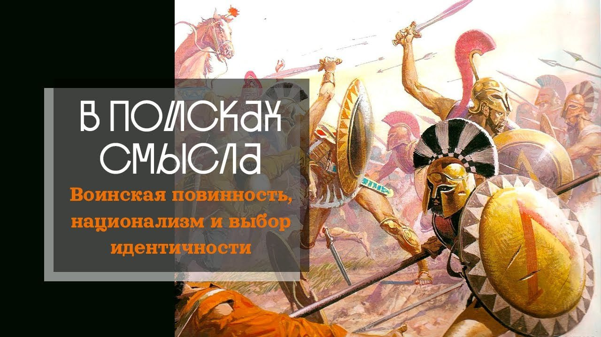

# Воинская повинность, национализм и выбор идентичности

21 мая 2023 [Аудиоверсия](https://paradoks-pinkera-pilotnyy-vypusk.simplecast.com/episodes/final) 19:13

В финале первого сезона мы поговорим об истоках возникновения обязанности гражданина защищать государство, о жгучей и парадоксальной (по крайней мере для некоторых) потребности человека принадлежать воображаемому сообществу – нации.
Расскажем о том, чему мы планируем посвятить второй сезон поисков смысла.



**П.Щелин:**
Если вы думаете, что массовое школьное образование создавалось для того, чтобы людей обучать знаниям из любви к знаниям, то вы глубоко ошибаетесь.

**Е.Голуб:**
Мне иногда искренне жаль тех людей, которые эмоционально вовлечены в переживания за воображаемую общность, которая во многом является созданной кем-то в целях, далёких от целей и интересов конкретного человека.

---

**Е.Голуб:**
Здравствуйте, уважаемые слушатели подкаста «В поисках смысла».
В эфире заключительный выпуск первого сезона.
У микрофона Евгений Голуб и политический философ Павел Щелин.

**П.Щелин:**
Здравствуйте.

**Е.Голуб:**
Сегодня мы выбрали две темы для разговора, после чего мы поговорим о наших планах на будущее.

Первой темой будет отношение гражданина и государства.
Мы решили поговорить об этом в связи с последними событиями, уже более чем года, мы поговорим о всеобщей воинской обязанности, откуда она возникла, почему сегодня она вызывает столько вопросов и как к этому следует относиться, если пытаться относиться ко всему здраво.

Павел, какая история возникновения всеобщей воинской повинности?

**П.Щелин:**
Ну, в современном виде мы обязаны этим Великой Французской революции, хотя «великая» можно, наверное, брать в кавычках, хотя по последствиям действительно «великая».

Именно тогда молодое государство придумывает новый принципиальный способ отношения человека и государства, и при этом новый же способ комплектования своей армии при помощи массового призыва.
По-французски это называется «levé en masse».

Основная идея была в том, что раз все граждане этого государства наделяются политической субъектностью, то, соответственно, долг умирать за это государство тоже становится всеобщим.
В той эпохе, которая предшествовала Великой Французской революции, всё-таки было разделение принципиальной обязанности и субъектностей.
Субъектность не предполагалась равная для каждого человека.
Она отличалась в зависимости от вашего сословия, в зависимости от вашего положения в обществе и в зависимости от вашего долга.
То есть было сословие воюющее, было сословие работающее, было сословие молящееся.

Остаток армии комплектовался за счет рекрутских наборов, что также все-таки предполагало интеллектуальный выбор.
Да, в контексте, например, Российской империи рекрутский набор был не особо добровольным мероприятием, но при этом весьма ограниченным.
А в Европе же даже этот самый набор, пусть и часто при помощи обмана, предполагал добровольное решение человека подписать контракт с вербовщиком.

Есть несколько известных фильмов «Фанфан Цюльпан», и там в самых начальных сценах это просто представлено очень хорошо.
Будет интересно посмотреть, как оно было до Великой Французской революции.

Но с Великой Французской революцией происходят принципиальные изменения, а именно государство внезапно получает возможность формировать реально большие армии, которые ни одна рекрутская система не могла воспроизвести.
И просто Французская республика получила огромное численное преимущество.
Это к вопросу о том, как Франция могла воевать против всей Европы.
В том числе именно поэтому.
То есть она могла мобилизовывать в разы большее число населения, чем любое другое европейское государство.

**Е.Голуб:**
У меня два больших вопроса.
И первый вопрос.

Франция называла себя республикой.
Отсылая, видимо, нас к прошлому Великой Римской Республике.
И если мы заглянем дальше в прошлое, что римляне?

Ведь обязанностью римского гражданина было защищать республику.
В чём было отличие тогда?

**П.Щелин:**
Ну, смотри, если говорить про именно, собственно, Римскую республику, то да.
То есть особенность римского гражданина эпохи республики состояла в том, что служба в армии, по сути, была привилегией.
Это даже был не просто долг, это была привилегия.

То есть, если ты помнишь, есть известное британское, правда, стихотворение, в котором хорошо выражен, тем не менее, римский этос, что 

```
И смерти нет почётней той,
что ты принять готов
за землю пращуров своих,
за храм своих богов.
```

То есть вот это римский этос, римская логика, которая действительно предполагала военную службу как священный долг римского гражданина.

Но на самом деле уже к концу республиканского периода эта система меняется, и легионы начинают формироваться по другим принципам.
Это особенно происходит уже на самом деле в эпоху гражданских войн.

То есть уже в эпоху Великих гражданских войн Рима легионеры, по сути, перестают быть гражданами, которые перешли на военную службу по зову государства, а скорее становятся профессиональными военными с целью большей эффективности, которую всю жизнь служат.
Ну а позднее, во времена Римской империи, то эта система так и остается.
То есть солдаты — это дело пожизненное, это дело профессиональное, а позднее в основном еще стали на эту службу брать наемников, потому что сами римляне в армии уже служить отказывались, для них было гораздо больше, более приятного времяпрепровождения.
Всякие германцы в основном и приходили на эту службу.
То есть германцы просто давали оружие, и позднее же эти германцы устраивали переворот.
В общем, начиналась очень веселая, интересная история.

**Е.Голуб:**
В Римской республике, если я правильно понимаю, в начале республики военная служба была почетным долгом, привилегией, и она была добровольной.

**П.Щелин:**
Это как бы добровольно, но отказаться нельзя, насколько я помню.
То есть нельзя было просто сказать нет.
То есть если Рим собрал легионы, то ты в этот легион идешь.
То есть это все-таки было важно.

Поэтому, например, после битвы при Каннах римляне могли эти легионы восстанавливать.
То есть там была проблема скорее в пропускной способности и экономической возможности обеспечить эти самые легионы.
Но именно во времена республики просто отказываться от этого долга, если мне память не изменяет, было нельзя.
Хотя, может быть, буду ошибаться.

Но на уровне этики общества точно нельзя.

**Е.Голуб:**
Ну, границы Рима не закрывали, не запрещали покидать республику, если ты вдруг не хотел служить в легионе.

**П.Щелин:**
Ну тогда вообще закрывать границы было весьма сложно, просто по техническим причинам.

**Е.Голуб:**
В Греции, в Афинской республике Сократ воевал.

**П.Щелин:**
В афинской демократии, да, политическая субъектность прямо пропорциональна способности нести военную службу, да.
То есть, в принципе, французы просто применили тот же принцип, но на новом историческом витке.

**Е.Голуб:**
То есть, они не изобрели ничего нового, они адаптировали известные истории к тому времени.
И получили большое численное преимущество в вооруженных силах.

**П.Щелин:**
Да.

**Е.Голуб:**
А что дальше?

**П.Щелин:**
А дальше все начали эту систему копировать, потому что это как гонка вооружения.
Если твой противник таким оружием обладает, тебе придется ее копировать.
И началось множество интересных социальных процессов.

Одним из них стал столь знакомый нашим слушателям феномен, как массовое школьное образование.
Если вы думаете, что массовое школьное образование создавалось для того, чтобы людей обучать знаниям из любви к знаниям, то вы глубоко ошибаетесь.
Теоретик современных системы школьного образования, ну, в ее основной массе это был Фихте, в речи германской нации прямо формулировал то, что после того сокрушительного поражения, которое Пруссия потерпела от французов, нам нужно создать новую систему, которая никогда не допустит этого повторения.
И главным инструментом этой системы стала школа.

В школе ребенок должен был выучить несколько вещей, а именно жизни в коллективе, в будущем, я считаю, взводе, послушанию офицеру, тире учителю, не задавать лишних вопросов, и, главное, дисциплине.
И чтобы потом, когда этот ученик попадает на поле боя, он под градом пуль не бежит, а стоит и послушно выполняет команды, указания и приказы.
Вот, собственно, для чего система школьного образования-то и создавалась.
И с этой задачей она справилась очень успешно.
Бисмарк нисколько не лукавил, что именно прусский школьный учитель выиграл войну 1871 года.

То есть он абсолютно здесь был прав.
И опять другие страны просто начали постепенно систему копировать.

**Е.Голуб:**
У меня, конечно, есть сомнения, что только ли в целях формирования армии.

**П.Щелин:**
Ну и это в том числе.
Но если с точки зрения государства, это было на самом деле одной из главных задач.

**Е.Голуб:**
Я бы сказал, что вот такое послушание и дисциплина, и умение жить и сотрудничать в коллективе с развитием промышленности и с усложнением жизни в государстве, оно нужно было не только в армии.
Государственная служба, административные аппараты тоже нуждались в таких же навыках.

**П.Щелин:**
Согласен, это можно считать дополнением.
Оно так получилось, что всё общество начало меняться, и эти навыки бы оказались предельно востребованы, но изначально вот эта армейская составляющая была крайне важна.
То есть это, что называется, не просто, знаешь, так совпало.

Государство вообще очень не любит инвестировать во что-то деньги, если это не связано с войной.

**Е.Голуб:**
Что пришло мне в голову?

Ведь требовать готовности пожертвовать собой, вообще жертвовать своей жизнью — это же предельная жертва человека, это предельный дар.
Когда мы говорили немного о других вещах, мы говорили, что максимум, что может отдать человек любимому — это свою жизнь.
Ничего больше он дать не может.

**П.Щелин:**
Нет больше той любви, чем тот, кто положит за други своя.

**Е.Голуб:**
И получается, что государство требует этого дара, этой жертвы предельной.
И в обмен, что оно предоставляет в обмен?

Или, может быть, оно создаёт вот эту иллюзию?

**П.Щелин:**
А вот здесь как раз наступает реальная проблема, то, что по задумке в этой системе в обмен гражданин получает политическую субъектность, то есть пресловутый голос на выборах.
То есть возможность своим голосом теоретически влиять на власть.
То есть вот оно, главное обещание.
На уровне символа и на уровне структуры вот он, главный приз.
Вот она, главная награда.

**Е.Голуб:**
А я сейчас попробую продвинуть свою мысль здесь.
Потому что, мне кажется, мало кого можно убедить умирать за политические права.

Если поставить выбор, знаешь что, дружище, давай так, хочешь иметь политические права, будь готов умирать.
Я думаю, человек очень сильно подумает и скажет, я, пожалуй, не уверен, что я этого хочу.

А вот если взращивать любовь человека к чему-то прекрасному, большому, родительскому, вечному, то тогда да, тогда умирать за это кажется этически оправданным, и тогда можно любить это.
И тут мы переходим ко второй теме, теме национализма и теме причастности человека к чему-то большему.

Мы говорили за пределами этого выпуска о том, что меня лично удивляет то, насколько для людей важно принадлежать к какой-то группе.
И как эта группа, будь то команда, будь то болельщики какой-то команды или уличная банда, становится ценностью, иногда сверхценностью.
Когда же мы говорим о государстве, о том, что стали 200 лет назад называть нацией, то вот это сверхценное, то, что предполагается любить, ради него, наверное, уже и можно требовать этой предельной жертвы.

Не видишь ли ты связи между ростом или возникновением национальных государств, массовой мобилизацией и пропагандистскими призывами умирать за отечество, под которым очень часто скрывается государство, власть имущие, элиты, которые, в принципе, не готовы на самом деле делиться ни властью, ни ресурсами, но требовать предельной жертвы они будут.

**П.Щелин:**
Ну здесь ты абсолютно прав.
Даже дело не в том, что вижу я или что видишь ты, а это просто известный исторический опять-таки факт, исследованный вдоль и поперек.

Возвращаясь к школьной системе, второй важный компонент, для чего была нужна школа, это именно для создания национальных государств.
То есть именно в школе эти национальные государства по сути создавались, причем абсолютно насильственным методом.
Я здесь даже не буду приводить в пример никакие потенциально задевающие кейсы.

**Е.Голуб:**
Да, можем Францию взять.

**П.Щелин:**
Да, именно.
Франция считается классическим примером.

Именно через систему школьного образования была разрушена огромная сложность региональных французских идентичностей и создана, по сути, единая французская система идентичностей.
То есть это все прямая взаимосвязь вот этого эксперимента XIX века.

Нация, массовая армия, массовое школьное образование.
Ну и можно даже сказать, ты прав, начало массовой экономики, как вот этой промышленной революции.
То есть, по сути, выход масс на сцену и превращение этой массы в основной инструмент вот этой коллективности.

Вот здесь ты прав, происходит подмена, что именно такая масса начинает мыслиться как главный способ этой самой коллективности, потому что этому вот в эпоху Средневековья предшествовал в разы более сложный узор коллективности.
То есть я был коллектив там как горожанин, как член цеха, как верующий, это мои отдельные.
Это все были разные коллективности, наслаиваемые друг на друга, и все они были по-своему важны.
И нельзя сказать, что одна из них всегда необходимо доминировала над другой.
То есть это была в разы более сложная система.

**Е.Голуб:**
И эти идентичности, они были в какой-то степени, если я так могу сказать, более реальные, потому что ты знал членов своего прихода, этих людей, ты нёс перед ними личные обязательства, цеха, деревни своей, даже города же были небольшие.

**П.Щелин:**
Да, абсолютно.

**Е.Голуб:**
А после того, как пошла эпоха массовости во всём, от образования до армии, то это невозможно было физически знать-то всех, кто принадлежал к этой супербольшой группе.

**П.Щелин:**
Это исключительно то, что называется воображаемым сообществом.
То есть это всё существует исключительно в воображении, онтологически.
И оно обезличено.
Здесь ты абсолютно прав.

Если предыдущая система строилась на личных отношениях, прежде всего, то новая система стала обезличенной.
Но в обмен, повторю то, что ты говорил, как бы получили вот эти мощные политические, социальные и прочие права.
Как бы.

Вот такой своего рода обмен.

**Е.Голуб:**
Я хочу завершить обсуждение этой темы.
Она, конечно же, огромная, но мне иногда искренне жаль и до боли жаль тех людей, которые эмоционально вовлечены в переживания за воображаемую общность, которая во многом является рукотворной, может быть, созданной кем-то в целях, далёких от целей и интересов конкретного человека.
Но вот это присоединение, прилепление, принадлежность к этому воображаемому сообществу, оно приводит к реальным трагедиям, к слому жизни, к жертвам.

И, видимо, сейчас уже время перейти к тому, О чём мы будем говорить во втором сезоне?

Мы будем говорить о проблемах идентичности.
Как ты видишь обсуждение этой темы?

**П.Щелин:**
Как я ее увижу, мы узнаем во втором сезоне, если говорить более подробно.
Но я бы сказал, почему нам это показалось важным и почему мы решили все-таки сделать это центральной узловой точкой всего нашего второго сезона.

Потому что это повторяющаяся тема.
То есть, если кто не в курсе, напоминаю то, что мы сделали чат, где мы общаемся с нашими уважаемыми слушателями, уважаемыми подписчиками.

И для меня это в том числе пространство, по которому я некий срез, если тебе угодно, по которому многие вещи я могу отслеживать.
Могу замечать темы, которые повторяются.

Понятно, что одна из самых больших проблем, путаница, при этом на что есть огромный запрос для того, чтобы размыслить и разобраться, это вот проблематика идентичности, проблематика имени, проблематика того, что значит быть, что значит быть кем-то, почему быть именно кем-то важно, как это соотносится с другими областями жизни.
И это на самом деле, правда, очень сложная проблема.

Это же не самоочевидные всё вещи, то есть в этом-то вся и суть.
То, что философской базы, если угодно, философского смыслового фундамента явно в этих вопросах не хватает, особенно на простом понятном языке.
И поэтому, я думаю, это, во-первых, для нас с тобой будет плодотворное направление, чтобы для себя разобраться, в конце концов.
Во многом мы эти подкасты делаем, потому что мы сами с тобой пытаемся в чем-то разобраться, в важных для нас вещах.
Но я думаю, слушателям будет крайне полезно.

И это действительно одна из принципиальных узловых тем политической философии, философии как таковой.
Что такое имя, какие ответственности оно возлагает, если угодно, на человека, отражают ли наши слова реальность или каким образом реальность присутствует в наших словах.
То же самое можно применить к идентичности.
Отражает ли идентичность реальность или реальность присутствует в идентичности?

Является идентичность чистым воображением?
То есть мы сказали, например, сейчас про нацию, что это воображаемое сообщество, но я бы сказал, что это только одна из граней на самом деле.

Оно действительно воображаемое сообщество?
Не только это.
Там есть еще другие, множество важных граней, которые опять-таки тоже упираются вот в эти философские проблемы идентичности, что это такое, как оно функционирует в обществе.

Я думаю, то, что мы в процессе выйдем на более глубокое рассуждение о проблематике символического мышления, что является принципиально важным для традиционалистской повестки, о которой мы с тобой говорили уже в этом сезоне в предыдущих выпусках.
Так что, да, я бы сформулировал в целом то, что здесь вскрылась достаточно непаханое в современной публичной дискуссии на русском языке поле.
Ну и давай попробуем эту деляночку вспахать, что называется.

**Е.Голуб:**
Могу ли я сказать, что мы попробуем с тобой поставить под вопрос или помочь человеку задаться вопросом прежде всего к самому себе?

А кто я такой и почему я себя таковым считаю?

**П.Щелин:**
Можно, да, можно.

**Е.Голуб:**
Что в основе моего мировоззрения, моих взглядов?
Насколько это взгляды мои?
Насколько я могу их отстоять?
Насколько они обоснованы для меня самого?

И если нет, то почему я принимаю их на веру?
И, может быть, просто согласиться с тем, что какая-то часть нашего мировоззрения — это аксиомы или принятые на веру ценности и понятия, которые мы впитали из контекста, в котором мы жили или живём.

Наверное, так я попробую по-своему сказать что-то.

**П.Щелин:**
Я бы согласился, что это тоже.
То есть это более частный случай.
Я думаю, это то, что мы будем говорить.

То есть сразу скажу, что по стилю понятно, мы не будем заниматься деконструкцией ради деконструкции, как это любят постмодернисты.
Но сначала надо будет описать, что есть.
То есть мне нужно сначала прояснять в принципе, как оно это по идее работает вот в реальности.

А потом, соответственно, как это относится к каждому отдельному человеку.
И вот это, повторюсь, очень большой комплекс вопросов, которые мы будем формировать в процессе на самом деле.
То есть это у нас как раз вот лето для этого есть.

Также хочу добавить то, что, разумеется, только такими сложными темами в каком-то смысле наш следующий сезон не ограничится.

Обещаем продолжить иногда реагировать на интересные, актуальные культурные феномены, которые позволяют поговорить о нечто сложном, как уже было в этом сезоне.
Как мы заметили, то, что осталось очень важным и очень трепетным для наших уважаемых слушателей, для наших уважаемых зрителей, можно сказать.

**Е.Голуб:**
Хорошо.
Тогда в заключении я предложу всем, кто нас слушает, присоединяться к чату обсуждения.

Если вам по каким-то причинам неловко или вы не хотите участвовать в дискуссиях, есть группа пожеланий авторам, мы внимательно изучаем и будем готовы и отвечать на ваши вопросы во время подкаста или отвечать прямо в тексте чата.

Да, еще упомянем, что в этом же чате мы будем размещать информацию о наших онлайн-встречах слушателей.
Многие вещи лучше всего обсуждать, ну если не глаза в глаза, то камера к камере или глаза в камеру.
Поэтому еще раз приглашаем в наше поле общения и увидимся или услышимся скоро.

**П.Щелин:**
Осенью в формате подкаста, но не переключайтесь, будут и другие форматы.
Так что все будет хорошо.

**Е.Голуб:**
Спасибо, друзья.
До встречи.

**П.Щелин:**
До встречи.
