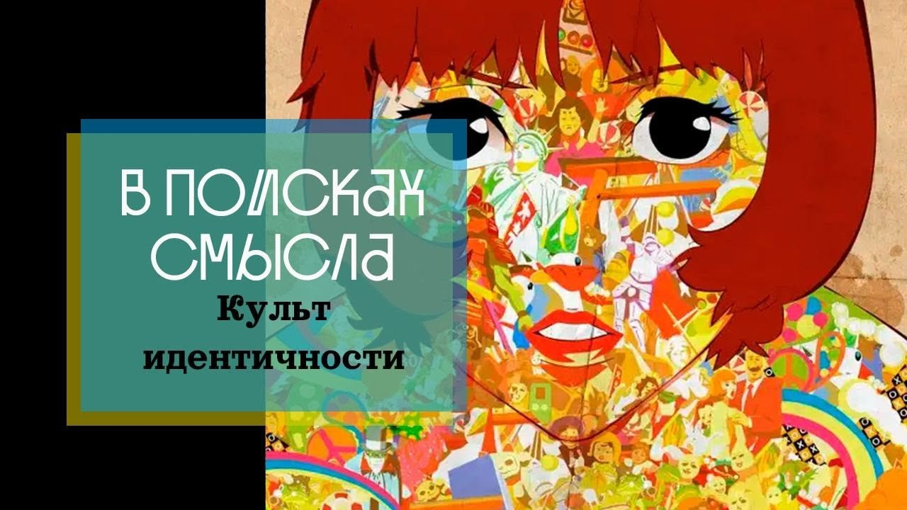

# Культ идентичности

25 марта 2023 [Аудиоверсия](https://paradoks-pinkera-pilotnyy-vypusk.simplecast.com/episodes/identity) 31:39

Размышляем об истоках современного культа идентичности.
Жан-Жак Руссо и миф о благородном дикаре.
Восприятие любой культуры, как культуры угнетения личности.
Превозношение аутентичности и иллюзия освобождения в постмодернизме.
Перверсия христианской этики, требование эмпатии, как оружие бунта против традиции.
Философские истоки феномена. 

**П.Щелин:**
Теория идентичности утверждает, что онтологический статус человека и других людей тоже определяется исключительно его субъективным желанием.

**Е.Голуб:**
Вам нужно быть аккуратным со своей природой, она стремится к греху, она стремится к плохому.

---

**Е.Голуб:**
Здравствуйте, друзья!
В эфире очередной выпуск еженедельного подкаста «В поисках смысла».
У микрофона ведущий Евгений Голуб и мой всегдашний собеседник, соавтор подкаста, политический философ Павел Щелин.

**П.Щелин:**
Всех приветствую!

**Е.Голуб:**
Сегодня мы собираемся поговорить на непростую тему, иногда даже опасную тему.
Мы поговорим про проблему идентичности.
Для меня эта тема возникла из ниоткуда, несколько лет, может быть, до 10 лет назад, и вдруг заняла доминирующую позицию в современной повестке.
Обсуждать это стало непросто, обсуждать это стало опасно.

Очень много людей стали обижаться, стали очень чувствительны к тому, как и кто говорит о них, об их идентичности.
Первый мой вопрос, главный вопрос, который у меня в этой связи к Павлу — что происходит?
Откуда возникла такая важность темы идентичности в нашем мире?

**П.Щелин:**
Сегодня слушателям придется поработать вместе с нами и покопать достаточно глубоко в историю.
Потому что ответ на вопрос об идентичности, об ее роли в современном обществе, это, с одной стороны, скрыто в объективной базовой философской проблеме, которую сейчас представлю.

А с другой стороны, является следствием очень конкретной традиции ответа на эту базовую проблему, сформированную, я бы сказал, примерно в современном её виде уже к концу XVIII века.
То есть как бы мы видим, на самом деле, это не проблема 30 или даже 10 или 2 лет.
Это проблема очень глубокая, очень древняя.
Не знаю, с чего лучше начать?

Можешь выбрать.
Тебе хочется сначала менее абстрактно или потом более абстрактно?

**Е.Голуб:**
Начнём с менее абстрактного.
Перейдём к абстрактному.

**П.Щелин:**
Хорошо.
Тогда мы должны поговорить о таком товарище, как Жан-Жак Руссо.

Современным культом идентичности мы обязаны, по сути говоря, именно Руссо.
В XVIII веке именно Руссо принадлежит абсолютно исторически необоснованная, но ставшей классической идея по сути о том, что любая культура, любая цивилизация являются репрессивными институтами, являются репрессивными феноменами по отношению к человеку, который в своем базовом дефолтном состоянии является благородным дикарем.
То есть именно Руссо же создает миф о благородном дикаре.
Создает, популяризирует окончательно.
Там были, конечно, предпосылки, но на массовом уровне такой концепция популярностью не обладала.

А вот именно при Руссо эта концепция возникает в ее, по сути, уже современном виде.
Возникает вот эта идея естественного состояния человека как некого утерянного первобытного рая.
И, соответственно, если мы стоим на этом подходе, то действительно, любая традиция, любая культура, любой социальный кодекс являются современным словом, по сути, инструментами угнетения.
Не более того.
Это уже по полной программе заложено в Руссо.

Надо сказать, конечно, что антропологически это полностью необоснованное утверждение.
Я очень рекомендую книжку «War Before History».
Просто почитайте книжку.
Она так и называется, есть на Либгене, которая, по сути, объясняет очень простой факт, что вся история человечества в кавычках до цивилизации — это бесконечная история конфликта, насилия и уж точно не царство платонической, свободной, невинных отношений, любви, игры, гармонии с природой и так далее и тому подобное.
То есть антропологически этот миф обоснован был никак.

Но именно в культурном воображении он стал играть огромную роль.
Причем впоследствии этот миф иногда получал, скажем так, дополнительные усиления вплоть до XX века, вплоть до части антропологов.
Наверное, ты слышал о такой культовой фигуре в американской антропологии Маргарет Мид?

**Е.Голуб:**
Да.

**П.Щелин:**
Именно, по сути же, ее исследования стали одним из источников вдохновения для современного левого движения, потому что на примере анализа одного из индонезийских племен она доказывала гипотезу о том, что, дескать, опять в дикаре был свободный культ любви без угнетения, без вот этих европейских традиций.
Тут, как ты понимаешь, влияние Фрейда уже к середине XX века по полной программе чувствуется.
И вот мы обнаружили наконец-то этого идеального дикаря, условно говоря, то, что оно так и было, а вот злобная культура нас надавила.

Иронично, что сейчас мы точно знаем, что то племя, с которым Мид работала, ее напрямую обманывало.
Там внутри была своя система очень строгих сексуальных табу и правил, каким они следовали.
Это было что угодно, чем то, что в итоге она написала, но опять-таки...

**Е.Голуб:**
Она видела то, что хотела видеть, ей нужно было...

**П.Щелин:**
Это правда тот случай, когда объект исследования очень сильно, скажем так, намеренно проманипулировал исследователем.
Итогом-то стало что?

Вот из Руссо через Маркса, Фрейда и к неомарксистам через часть современной левой антропологии, вот эта идея о том, что, по сути, любая культура равняется угнетению, перетекает в современный порядок.
И тогда, соответственно, необходимой твоей задачей становится утверждение собственной идентичности.
Что в этом контексте становится идентичностью?

Идентичность становится некоторым феноменом, который каждый человек должен...
С одной стороны, говорится, что имеет право, но скорее, на самом деле, это даже морально-нравственный долг.
То есть должен очистить себя от всех наслоений культуры и обрести некое authentic self.

**Е.Голуб:**
Да, как раз у меня на языке вертелось слово «аутентичность», стало очень модно.
Насколько ты аутентичен?
Насколько твое поведение соответствует твоим истинным внутренним потребностям?

**П.Щелин:**
Звучит неплохо, и более того, это религиозная, по сути, задача.
Это задача религиозного освобождения.
То есть это задача освобождения, по сути говоря...
Это тонкий момент.

Прямо теоретики идентичности не говорят о душе, разумеется, но по сути речь идет о том, что долг каждого человека освободить собственную душу.
Раскрыть собственную душу, раскрыть свое собственное естественное «я», а все, что мешает ему на пути этой задачи, является структурами угнетения.
И, соответственно, долг — это борьба против этих структур угнетения.

**Е.Голуб:**
Предполагается, что внутреннее «я» прекрасно само по себе, от своей природы, и ничего плохого в нём быть не может.

**П.Щелин:**
Наследие Руссо — то, что вот в естественном состоянии любое «я» по умолчанию является прекрасным, и достаточно только сбросить структуры культуры, структуры цивилизации, чтобы вот это началась бесконечная, по сути, хиппи-коммуна, сексуальная оргия, мир естественности, танца, игры.
Ну вот это такая песня Джона Леннона «Imagine» на максималках, если ты помнишь.
Это вот гимн вот этого движения, по сути говоря, это «Imagine» Джона Леннона, где вот «Imagine no religion, imagine no possessions, no...».
Короче, один глобальный мир свободный.

На самом деле, в современном виде это очень такая комбинация, с одной стороны, престарелых хиппи и поколений молодых людей, которым эти престарелые хиппи, ну, какое-то время не очень престарелые, десятилетиями раздалбывали мозги на массовом уровне.
То есть вот философское это начинается с Руссо.
На массовом уровне, конечно, это переходит, начиная с 70-х годов, с момента прихода неомарксистских профессоров в американские университеты и перехвата ими контроля над американским университетом.
Они создают, по сути, новое поколение.

**Е.Голуб:**
Прямо противоположно пониманию человека тому, что мы слышим у христианских проповедников, в христианском нарративе, как угодно сказать можно, то, что вам нужно быть аккуратным со своей природой, она стремится к греху, она стремится к плохому.
Нужно прислушиваться и всё время сверять себя с чем-то данным свыше.

**П.Щелин:**
Разумеется, эта концепция полностью противоречит христианству, хотя она является интересным образом перверсией христианства.
То есть она могла возникнуть только в постхристианской культуре, потому что только в постхристианской культуре был такой упор на личность, на личностное переживание, на личный религиозный опыт.
И, по сути говоря, мы видим перверсию этого личного религиозного опыта в том мире, где Бог выносится за скобки.

То есть, если не удивительно, что это приходит именно с Руссо.
Скажем так, отношение Руссо к религии можете прочитать отдельно.
Но, скажем так, оно было, мягко говоря, сектантское в лучшем случае.
Назовем это так.

Но также оно противоречит не только христианству, оно противоречит в принципе любой традиции, которая опирается на объективность.
Исламской, любой племенной на самом деле даже традиции.
Те самые любимые, условно говоря, руссо-благородные дикари, обладают очень жесткой системой табу и связью с реальностью.
Это очень важный момент.

Но по сути, любая традиция, которая утверждает некий объективный характер мироздания, то, что реальность есть, не просто как плод вашего субъективного желания, а то, что реальность существует как некая данность, она вступает в противоречие, разумеется, с этой всей теорией идентичности.
Потому что, по сути говоря, теория идентичности утверждает очень радикальные философские вещи.
По сути говоря, теория идентичности же утверждает, что онтологический статус человека и других людей тоже определяется исключительно его субъективным желанием.
Это очень тонкий момент, заметь.
Это сильно проявилось, вот сейчас проявляется в дебатах относительно пола.

**Е.Голуб:**
Ну, трансгендер — это тот человек, который определяет себя сам и ждёт, что также будет определять все остальные, даёт себе такое право.

**П.Щелин:**
Заметь, очень тонкий момент, который люди не до конца понимают, в чём тонкость этих дебатов.
Тонкость дебатов не в том, что во внешних проявлениях.
Потому что внешние проявления мы видим в разных культурах, включая культуры европейские, Рим, Греция и после.
То есть это всегда присутствовало в человеческом обществе.
Условно говоря, то, что раньше называлось...
Раньше по старым критериям учебников называлось гендерная дисфория.
Эта проблема существовала.

Что стало новым, это именно онтологическое утверждение.
Условно говоря, X, который выглядит как пол Y, то есть в результате утверждения.
Или пол X, который хочет, чтобы к нему на социальном уровне относились как к полу Y.
То есть это очень важно.
То есть это не о социальных отношениях.
Утверждение идет о том, что согласно моему внутреннему субъективному заявлению меняется онтологический статус реальности.

**Е.Голуб:**
Да, именно так я это понимаю.

**П.Щелин:**
Пол X равно пол Y.
Но это очень тонкий и важный момент, почему вопрос-то становится очень критичным.
Потому что на самом деле здесь происходит разрушение языка как такового.

**Е.Голуб:**
Да, понятия вообще перестают существовать.
Они начинают расплываться.

**П.Щелин:**
Потому что, по сути говоря, вам предлагается в каждый момент времени проводить бесконечную рекомбинаторику языка.
А это невозможно.
Мы не можем установить бесконечное число бесконечных общественных договоров по поводу определения.
То есть, условно говоря, мы не можем с каждым человеком проводить дебаты чисто на уровне общества.
Я молчу на то, что на философском уровне это невозможно.

**Е.Голуб:**
О том, какая реальность.
Что такое реальность?
Как мы интерпретируем реальность в каждом конкретном случае?

**П.Щелин:**
В каждом конкретном случае.
Причем для каждого из нас нет никакого объективного критерия.

**Е.Голуб:**
Это, кажется, такое фундаментальное утверждение, что объективного критерия не может быть в принципе, а те, кто это утверждает, расисты, дискриминаторы, сторонники патриархата и прочие негодяи.

**П.Щелин:**
Разумеется.
Это то, что видится на публичном уровне, но, допустим, предположим, что мы находимся в самой благожелательной обстановке и не ставим целью оскорбление друг друга, мы имеем логическую проблему.

**Е.Голуб:**
Именно логическая проблема вызывает больше всего у меня возмущение.
Я не чувствую себя в праве показывать другому человеку, как ему с собой относиться.
Но когда от меня требует принять отсутствие определений как таковое, это вызывает у меня мировозренческий кризис.

**П.Щелин:**
Разумеется.
И я на самом деле-то они готовы, потому что на самом деле у них есть система определения, и эта система определения заключается в том, что это перманентная культурная революция.
Здесь мы снова возвращаемся к вот этим марксистским теоретикам 70-х годов, цель которых, как мы с тобой обсуждали на предыдущих подкастах, по-моему, бесконечное движение к утопии.
Это бесконечное движение к утопии, которое никогда не достигается, но которое необходимо двигать в процессе.
То есть вот этот процесс культурной пересборки должен происходить постоянно, потому что, повторюсь, любая культура является культурой угнетения.
Условно говоря, это хорошо видно на примере феминизма.

Как только феминизм достиг своей определенной цели, сам феминизм стал культурой угнетения, и потребовалась следующая стадия, которая тоже станет культурой угнетения.
И этот процесс будет продолжаться до бесконечности.
Цикл культуры угнетения продолжается до бесконечности.
Потому что существует только одна реальность.
Субъективная воля индивида, знания и культурные структуры угнетения.
То есть борьба вокруг этого языка, борьба вокруг знания, борьба вокруг власти.
То есть на самом деле это очень грустный и жестокий мир, который приводит к сумасшествию.

Надо понимать, что вот в этих условиях это неизбежно влияет на психические заболевания.
И тут не надо путать причину со следствием, условно говоря.
Психологический кризис – это не следствие отсутствия толерантности, это следствие того, что в ходе борьбы за толерантность разрушается сама возможность речи, говорения, разрушается возможность контакта с реальностью и диалога людей вокруг реальности.
Мы живем в обществе, а тут нам, получается, уничтожается основа нашего существования в обществе – язык.
Даже на теоретическом уровне.

Потому что если каждый из нас может устанавливать собственный язык, то тогда никакого языка, повторюсь, невозможно.
То есть если я в любой момент могу выдумать себе новую идентичность и при этом почему-то долг всего общества перестроить все самого себя ради моего эмоционального, очень важный момент, комфорта, то мы разрушаем всю возможность коллективного согласия.
Но это полбеды.

Потому что на самом деле, конечно, проблема возникла-то не на пустом месте.
Когда мы говорим про Руссо и прочее, это же не то, что просто возник безумный человек.
Здесь я уже перехожу ко второй части, более теоретической.

Вся эта проблема упирается в более фундаментальное противоречие, которое можно назвать двойственность феномена имени.
В статье Павла Флоренского есть такой отрывок.

> В отношении к своему носителю имя представляется двояко.
> 
> Во-первых, оно представляет своего носителя, указывая, что есть некто, и затем, что он есть.
> 
> Во-вторых, оно противопоставляется своему носителю, влияя на него то, как предзнаменование грядущего, то, как орудие наговора, то, наконец, как орудие призывания.

На самом деле, здесь он более-менее суммирует вот эту двойственность имени, которая понимает любая традиционная культура, начиная от самого примитивного племени с ведьмами.
Ну, словно говоря, вся магия построена на вот этом магии имени.
О чем здесь говорит Павел Флоренский?

По сути, он говорит задолго до Джордана Питерсона о драме имени и любой идентичности, даже укорененной в реальности.
То, что любая идентичность является тираничной.
В каком-то смысле, действительно.
То, что часть природы самой реальности действительно является неким угнетением.
Вот в этом плане, иронично, в Руссо действительно есть определенная доля истины.

В каком-то смысле, действительно, для каждого человека культура, цивилизация, определенные нормы, социальные практики, даже просто факт нашего существования, наша телесность.
Давайте радикализируем.
Наша телесность уже действительно является неким инструментом угнетения, является первичным элементом столкновения с реальностью.

То есть, с одной стороны, это то, что нас формирует, делает то, что это мы.
То есть, потому что мы неотделимы от нашей телесности и от нашего места рождения, от нашего воспитания, от нашей семьи.
На самом деле, в глобальном смысле, мы неотделимы от всего этого накопленного опыта.
Это то, что делает нас нами, формирует нашу идентичность.

Но одновременно с этим оно же действительно и угнетает.
Оно ограничивает, с одной стороны, и оно всегда неполное.
Вот это бесконечное, условно говоря, аморфное, внутреннее.
Я, условно, душу в идентичность и не впишешь.
Действительно, это большая проблема.
Социальные отношения – это всегда отношения масок.
Это всегда отношения персон.
Это всегда отношения некоторых ролей, как актеров в театре.
И в этом действительно есть элемент угнетения и тирании.
Иногда этот элемент может доходить очень далеко.

То есть, допустим, любая традиционная структура имеет в себе вот этот, скажем так, скрытый риск скатывания в тиранию.
В тиранию идентичностью с другой стороны, то, что ты есть только твоя вот эта внешняя условно говоря, идентичность.
Вот условно говоря, у тебя есть долг мужа, и ты этот долг должен исполнять любой ценой, и все.

Ну, то есть традиционная нормальная культура, и в этом действительно есть определенный элемент тираничности.
И вот эта философская динамика, если тебе угодно, вот этот философский конфликт между именем, пробел, идентичностью, как нечто формирующим, как нечто угнетающим, он, во-первых, объективен, во-вторых, он никуда не денется.
И это надо принять.
И вот тонкий момент.

Культура и традиции все-таки стремятся как-то разработать механизмы принятия.
Ну, например, если мы возвращаемся к Джордану Питерсону, его ответ на эту драму, вот он так и стоит.
Прими то, что жизнь — это страдание, ну, то есть такой немножко элемент буддизма, но, по сути, то, что жизнь полна трагизма, и прими ответственность за эту жизнь.
И вот через эту ответственность обрети достоинство.
То есть вот таким образом в борьбе обретешь ты удовлетворение от вот этой жизненной драмы через максимальное принятие на себя максимальной ответственности.

**Е.Голуб:**
Я пытаюсь понять, какая может быть альтернатива?
Отрицание реальности, получается.

**П.Щелин:**
Правильно.
Руссоистская альтернатива в качестве радикального ответа, по сути, что предлагает современный марксизм, он предлагает, по сути, полное отрицание реальности.
Раз реальность полна угнетения, давайте разрушим реальность.
Всю.

**Е.Голуб:**
Поскольку я как личность, как само-осознающаяся материя считаю возможным согласиться с какими-то ограничениями, то я их отрицаю.
Потому что это даёт мне ощущение транс-существования поверх любых ограничений формы, физики, общества и так далее.

Но это же опять-таки, если ты игнорируешь реальность, то заканчиваются обычно те, кто её игнорирует.
Поэтому я не совсем понимаю, насколько это может быть жизнеспособным.
То, о чём мы говорили, это путь к сумасшествию.

**П.Щелин:**
Мне кажется, в историческом смысле это, разумеется, не жизнеспособное.
Но, опять, исторический смысл мыслит столетиями.

А вот на горизонте, как мы видим, ну, в принципе, мы видим, что европейская культура последовательно к этому шла.
То есть внутри европейской культуры постоянно происходило разрушение институтов традиций и постоянное увеличение фактора эмансипации.
То, что мы с тобой тоже обсуждали.
Ну, этот фактор освобождения в сторону большей ausentnicity.

Проблема состоит в том, сейчас ключевая на самом-то деле, внутри постмодерной, постхристианской культуры крайне сложно найти хоть какую-то точку опоры, хоть какую-то точку основания.
То есть вот этот процесс разрушения ты произвел, а дальше-то что?
На основе чего ты сейчас будешь собирать?

Вот у тебя есть куча депрессивных, суицидальных и психически расстроенных индивидов, которые при этом являются абсолютными скептиками и циниками, не признают никакой большей ценности, кроме как вот это собственное самовыражение, благо собственного «я».
И можно сказать, а почему они должны хоть что-то другое признавать?
Если единственным, по сути говоря, благом провозглашается освобождение твоего скрытого, никому кроме тебя неизвестного, и уж даже тебе не всегда известного, некого вот этого скрытого духа, заключенного в тебе, то с какой стати ты должен признавать любой внешний авторитет?

Как это перезагрузить, я не знаю.
Но я могу тебе точно сказать, что это будет больно.
То есть мы увидим в дальнейшем еще большую радикализацию этого движения, потому что, опять-таки, остановиться оно не может.
Вся его суть вот в этом вечном радикальном движении все более и более authentic self и разрушение всей реальности в поисках этих authentic self.
Здесь действительно ты абсолютно прав, как говорил Гильдебранд.

> Антологическая структура реальности не изменится от того, что мы назовём её неправильной и несправедливой, но в конечном итоге она ударит того, кто от неё отказывается по голове, подобно граблям.

Небольшая перефразировка, но, по сути говоря, смысл остаётся примерно таким.

**Е.Голуб:**
Удивительно, в чём привлекательность этого?
Я пытаюсь понять, что могло бы быть привлекательным.

**П.Щелин:**
Ну, надежда на освобождение, надежда на разрыв вот этой тюрьмы, ощущение себя самого как человека, закованного в тюрьму.
Вот это тираническое начало имени.
То есть вот это острое ощущение тиранического начала любой идентичности.

Привлекательность в том, что вот эта иллюзия, это очень важно, эта иллюзия, она очень привлекательная иллюзия полной, предельной, радикальной индивидуальной свободы.
По сути же, традиция длинная.
Идет от Руссо к романтикам XIX века, потом к вот этому декаданству Серебряного века.
На самом деле, на уровне культуры вот этот образ такого вот человека, который утонченный, которого общество не понимает.
А внутри себя каждый считает таким человеком, давайте уж будем честными.
То есть каждый человек внутри себя может найти, наверное, элементы вот такой идентичности.

И привлекательность в том, что дарится иллюзия освобождения.
Иллюзия освобождения из вот этой клетки ограничений, клетки реальности, выхода за пределы реальности как некой структуры угнетения.
Но проблема опять-таки в том, что реальность от этого не меняется.
И можно говорить о многом.
То есть, например, мне очень нравится пример канадского иконографа Джонатана Пежо.

Разница между христианской историей и вот историей вот этого нового понимания.
Он это называет margin, то есть отвергнут.
То есть надо понимать, что вообще-то в культуре, любая культура-то, она же на самом деле действительно супер тиранична по отношению примерно к 20% населения.

Любая культура функционирует, что у тебя есть символический центр, который более-менее вписывается в 80%, и 20%, который по краям, по которым эта культура-то на самом деле бьет.
Прям, знаешь, вот безо всяких обиняков бьет по всем, кто не вписывается.
Это может быть критерий и сексуальный, и этнический, и культурный просто, и какой-то там, не знаю, бытовой, классовый, какой угодно.
Но суть в том, что всегда есть те, кто в эту культуру-то сильно не вписывается.

И в каком-то смысле можно сказать, что весь этот проект – это такой бунт.
Это огромный бунт людей, которые вот этот вот элемент тиранического начала любой идентичности переживали особенно остро, и в качестве своего главного оружия они выбрали перверсию христианской этики.
Что они делают?

Они используют, условно говоря, вот этот пример внимания к униженным и оскорбленным, который присутствуют в христианской этике.
Помоги нищему, накорми голодного, посети человека в больнице, в тюрьме, вот то, что является христианской основой милосердия.
Но они это милосердие превращают в эмпатию.
Они превращают эмпатию в оружие.

Разница истории заключается в том, что если в христианском сюжете пастух идет за блудной овцой в пустыню и готов рискнуть собой, чтобы эту овцу вернуть назад в стадо, то в рамках этой истории вот эта блудная овца стоит посреди пустыни и орет на пастуха, чтобы он привел все стадо к ней в пустыню.
И, соответственно, в этом это и заключается парадокс.

Но основное – это вот это желание блудной овцы.
Вот представь, что ты эта блудная овца, стоящая в пустыне, при этом ты уже искренне веришь, что ты уникальная личность, которую все, скажем так, вот это тираническое начало реальности угнетало психологически всю свою сознательную жизнь.
Ну и тут много совпало.
Марксистские традиции, революции, тайные общества, не тайные общества.
Ну вот, в общем, XX век подарил много побочных, скажем так, факторов, которые повлияли на возможность именно к 70-м радикализации и массовизации вот этого проекта.
Вот так вот это есть.

**Е.Голуб:**
Да, но я, видимо, очень далёк от такого сознания, потому что у меня две эмоции возникают, когда ты говоришь об этом.
Первое — одиночество, звенящее одиночество человека, которое неопределяемое.

А второе — ощущение безопорности вот такого.
Если ты ничем не определяем, то ты превращаешься в ничто.
То есть, а что ты есть, если ты не это, и не то, и не то, и не то, и не то?

**П.Щелин:**
Тогда ты становишься тем, то, что ты сказал.
То есть, по сути говоря, есть обожествление самого себя, да.

**Е.Голуб:**
Обожествление.
Я говорю и произвожу реальность.
Интересно очень.

**П.Щелин:**
Разумеется, ты абсолютно прав.
Откуда это рождается на уровне культуры?

Это рождается в тех людях, в которых уже на протяжении столетий постепенно достигало критической массы число атомизированных людей.
Вот эти социальные институты традиций, которые делали то, что в немецком языке называется "гемют".
Может быть, знаешь вот это понятие "гемют".

По-русски это скорее уют, но это нечто большее.
Это вот такая, знаешь, такая оболочка реальности из привычности устоявшегося.
Оно такое ламповое, теплое, некоторое удобное.
То есть оно вот скорее про это.

Но тут вообще-то надо говорить прямо.
Капитализм этот "гемют" разрушил, особенно на рубеже 19-го и 20-го века.
Он разрушил все традиционные социальные институты.
Он атомизировал людей, по большому своему счету.
И он этих атомизированных людей выкинул, опять-таки, на холодный достаточно ветер вот этой реальности, в котором внезапно на каждого была возложена ответственность по вот этому самоутверждению, самопоиску.
Это очень большая доля ответственности, которая происходит с человеком по мере разрушения традиционных структур.
Скажем так, нарастала критическая масса.

Какое-то время еще старые институты типа семьи, церквей работали, и они создавали рамки.
Тут же надо понимать, что уже к началу XX века церковь как авторитет тоже была разрушена.
То есть уже начиная с Просвещения, особенно по ходу всего XIX века, реально, особенно на уровне интеллекта, интеллектуалов, вот это традиционное начало, по сути говоря, уже было полностью делегитимизировано.

Дальше просто мы начинали постепенно собираться, вот эта критическая масса, когда вот это шизофреническое решение объективной философской проблемы двойственного начала любой идентичности была предложена через решение отрицания всего.
Но, по сути говоря, если ты подумаешь, что к тому моменту собралось, опять-таки, достаточное число вот этих одиноких, оторванных людей, перемешанных, не связанных между собой какими-то институтами и связями, то понятно, откуда берется вот это ядро, закваска, если тебе угодно, вот этого нового проекта.

Дальше она распространяется как вирус через инструменты образования, потому что именно в 60-е годы, 70-е годы внутри левого движения происходит радикальный переворот.
Переосмысляются идеи Лукача, идеи Грамши, и они начинают долгий марш через институты.
Они начинают просто индоктринацию с системы образования.
То есть они решили, революция, условно говоря, у нас с рабочим классом не получается, потому что рабочий класс по своему существованию в мире уже является слишком сильно угнетенным, он не понимает и не поймет, потому что капитализм работает слишком хорошо.
Они, гады, не хотят делать революцию, они хотят материальных благ.

То есть даже будучи оторванными, угнетенными на самом деле, отчужденными от всего, они все равно хотят только материальных благ, потому что уже с самого детства они запрограммированы условно определенным образом.
Значит, нам левым силам надо хакнуть вот это все, и они идут в университет.
И уже вот мы получаем через 50 лет вот эту новую современную ситуацию.

**Е.Голуб:**
Какие можно сделать из этого выводы для людей, далёких от политической философии?

**П.Щелин:**
Ну, вывод-то можно сделать очень простой.
Человек — существо действительно трагическое.
Мы живём в мире, в котором вот эта двойственность любой идентичности любого имени является неизбежным фактором.

Но при этом надо понимать, что решение этой проблемы, которую предлагают современные культура идентичности, условно говоря, и в академии, и в культуре, и в медиа, и в СМИ, и в социальных проектах, является аналогом лечения головной боли или мигрени при помощи гильотины.
То есть мы признаем реальность головной боли, но, наверное, гильотина не лучший метод по решению этой головной боли.

А лучшим методом по решению этой головной боли является под тем или иным соусом то, что говорит Питерсон.
Признание этой трагичности и преодоление ее через, условно говоря, то, что называется в исламе большим джихадом, внутренним джихадом, врастание в идентичность, врастание в социальные структуры, создание вокруг себя социальных структур.
То есть это правильно, опять возвращаемся к теме.
Кто особо уязвим к этому?

Люди, у которых нет никаких социальных чувств опоры, нет никаких других социальных источников тепла.
И значит, надо воссоздавать традицию вокруг самого себя.
Здесь как раз я не жду никаких больших движений сверху, но я вижу всегда огромный потенциал для движения снизу.
То есть вы не сможете, может, изменить всё общество, но создать определённую зону, в которой вот этот вирус идентичности будет встречен определённым иммунитетом среди ваших близких, это вам возможно в гораздо большей степени, особенно если вы понимаете вот эти философские корни.

**Е.Голуб:**
Тема большая, и нам стоит к ней вернуться уже с позиции выработки иммунитета.
Может быть, мы поговорим об этом в следующий раз.

А сегодня я хотел бы предложить в качестве заключения такой свой вывод.
То, что некоторым из нас кажется необъяснимым, совершенно ниоткуда взявшимся, странным и сумасшедшим в виде огромного давления, особенно в западной культуре, со стороны требующих себе особых прав меньшинств, не является чем-то парадоксально ниоткуда взявшимся.
Это есть определённое следствие эволюции философских взглядов на личность, которая, по словам Павла, я склонен ему доверять, тянется ещё с конца XVIII века.
Поэтому это всё гораздо серьёзнее, чем может показаться.

Это не просто подростковый бунт или какое-то групповое сумасшествие, которое эпизодически или вдруг массово входило в университеты, это гораздо серьёзнее.
Для того, чтобы разобраться в этом, нужно посвятить определённое время для того, чтобы понять, что с этим делать, как к этому относиться.

**П.Щелин:**
Кстати, если уж так пошли, я могу порекомендовать одну книжку, недавно вышедшую, которая может послужить хорошим введением в эту тему.
Называется «The Rise of Modern Self».
То есть, опять-таки, есть на Либгене для тех, кто не обладает доступом к западным, скажем так, библиотекам.
Поэтому рекомендую.

**Е.Голуб:**
Итак.
Как бы мы могли охарактеризовать то, что происходит сейчас?

**П.Щелин:**
То, что мы видим сейчас, на мой взгляд, является, как ты правильно сказал, следствием эволюции одного из неудачных, но в силу множества обстоятельств, внешне привлекательного способа ответа на одну из фундаментальных философских проблем.
Будучи, возможно, тут работает моё предубеждение, поскольку сам являюсь философом, мы видим здесь очередное подтверждение того тезиса, что все социальные проблемы являются, по сути говоря, производными от некоторых философских проблем, что является, в свою очередь, производными от проблем религиозных.

И то, что вопрос о вечном, о смысле, о реальности, о том, что истинно, и о том, каковы критерии истины, невозможно вынести за скобки.
Проект, в котором каждый сам определяет собственную истинность, оборачивается коллективным сумасшествием.

Эволюция идеи идентичности, которая, в принципе, начиналась достаточно привлекательно, достаточно невинно, особенно так в веке 18-м, ну, кто-то может сказать.
По объективным данным, то, что мы видим по действительно массовому сумасшествию, повторюсь, когда у вас в современных американских Соединенных Штатах порядка 30% молодежи сидит на антидепрессантах или диагностирует в той или иной форме психическое заболевание, это уже, в принципе, достаточно показательный критерий.
Вот это коллективное сумасшествие, к сожалению, то, что нам придется всем коллективно, кстати, и преодолевать.

Поэтому будем здоровыми частями организма, будем вырабатывать иммунитет, а надеюсь, что наши путешествия в поисках смысла будут каким-то подспорьем для вас, уважаемые слушатели.

**Е.Голуб:**
Отлично.
На этом мы сегодня заканчиваем.

Спасибо, Павел.
Вернемся к этой теме через неделю.
