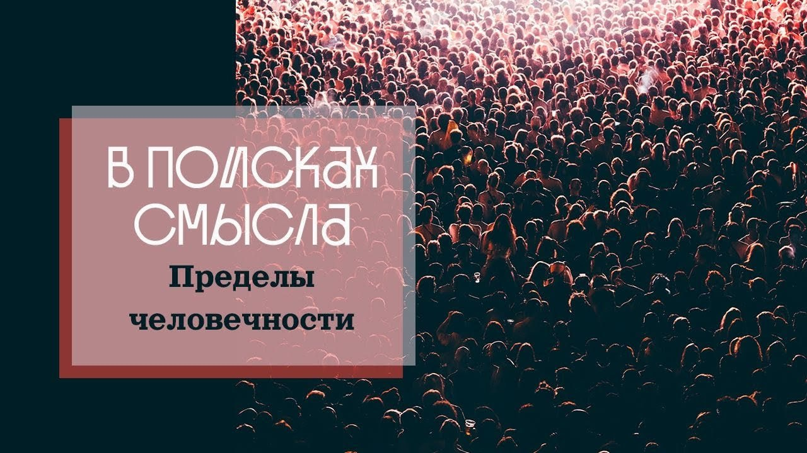

# Пределы человечности

15 апреля 2023 [Аудиоверсия](https://paradoks-pinkera-pilotnyy-vypusk.simplecast.com/episodes/limits) 28:52

Сведение в цивилизации модерна человека к набору физиологических функций и потребностей.
Человек, как вещь среди других вещей.
Образ счастья, как состояния максимального удовлетворения физиологических потребностей.
Человечность, проявляемая в свободе выбора отказаться от чувственных удовольствий.
Человечность, как способность подняться над устремлением к материальному благополучию. 

**Е.Голуб:**
Человек не сводим только к набору физиологических потребностей.

**П.Щелин:**
Из семён ошибочных суждений, родившихся столетия назад, разворачивается драма нашей современности.

**Е.Голуб:**
Здравствуйте, друзья.
В эфире выпуск подкаста «В поисках смысла».
С вами Евгений Голуб и Павел Щелин.

**П.Щелин:**
Здравствуйте.

**Е.Голуб:**
Сегодня ты предложил начать с обсуждения одного любопытного законопроекта, который подан на рассмотрение в штате Массачусетс.
О чём речь?

**П.Щелин:**
Речь о том, что заключённые тюрем получат возможность снизить срок своего наказания от 60 дней до 1 года в обмен на почку, костный мозг, кусок печени или что-то подобное.
По сути, вводится инициатива некоего телесного подношения в обмен на обещание свободы для самых, можно сказать, незащищённых групп населения.
Новость об этом законопроекте, прошедшая достаточно незамеченной в русскоязычной среде, заставила меня задуматься о проблематике, которую мы с тобой подняли в предыдущем выпуске — о пределе человечности, о том, что есть человек: просто товар, материальная вещь, или нечто большее.

Речь идёт о разделении на «элоев» и «морлоков», практически напрямую из антиутопий.
То, что было на страницах бумаги, становится новостной лентой.

**Е.Голуб:**
Ты не преувеличиваешь?

Послушай, всегда ведь можно было получить уменьшение тюремного срока, если ты совершил какие-то добрые дела, вёл себя хорошо — исторические прецеденты известны.
Тут напрашивается аналогия: кому-то нужен костный мозг, это не смертельно, ты можешь проявить инициативу и тебя поощрят снижением срока.
Что здесь такого прямо ужасного?

**П.Щелин:**
Во-первых, ужасное — это лицемерие и асимметрия.
Понятно, что доступ к этим органам получат люди обеспеченные, в то время как тюремное население состоит из необеспеченных людей, которые (ни более ни менее) превращаются в «магазины запчастей» для богатых.
Это большая проблема.

Торговля органами недаром один из самых прибыльных криминальных бизнесов.
Речь идёт не о благотворительности или самопожертвовании, на что иногда идут родственники больного ребёнка, больного человека.
Это прямо противоположное по вектору мероприятие — речь идёт о создании условий, в которых человек полностью лишается собственной человечности и доводится до состояния, повторюсь, животного.

**Е.Голуб:**
Да, тут сразу приходит в голову сюжет сериала, когда отбирается какой-то товарищ с нужным органом, его подставляют под криминал, а потом настойчиво рекомендуют пожертвовать свои органы для сокращения срока.

**П.Щелин:**
Масштабы потенциального злоупотребления здесь безграничны.
Во-первых, качественно меняется вопрос сути тюремного заключения — это восстановление справедливости, наказание за проступок или элемент коммерциализации человеческого тела.

Опять-таки, ни в одной стране мира, даже в США, нет по-настоящему честной, независимой и свободной от злоупотреблений судебной системы, мы постоянно видим проблемы, скандалы.
Часть из них раздуты СМИ, но часть абсолютно реальна, и создание такого огромного открытого окна Овертона...

Давайте уж прямо скажем: самое главное в этой новости то, что мы принципиально раздвигаем восприятие человека, человеческого тела по отношению к другим людям.
Здесь самое важное — попытка привести в зону легальности и нормализации то, что, на мой взгляд, не должно быть легализовано или нормализовано в принципе.
То есть это, по сути, дегуманизация, возведённая в закон.

**Е.Голуб:**
Ну хорошо, дегуманизация.
Но разве сейчас нельзя продать свой орган официально?
Я не знаю… Нет такого?

Придёшь и говоришь: «Я хочу почку продать, у меня лишняя есть».
Или это только криминальные структуры?

**П.Щелин:**
Слушай, хороший вопрос.
Честно, врать не буду, надо смотреть.

В определённых обстоятельствах, разумеется, это возможно, но это идёт скорее через «донейшн».
Я знаю, что люди могут жертвовать свои органы, если они, допустим, погибают в автокатастрофе.

Многие могут оставить в завещании специальный пункт о такой возможности.
Если у вас близкий родственник, вы тоже можете пожертвовать.
Но, напрямую, легально, именно как продажа — это до сих пор криминальное мероприятие.

**Е.Голуб:**
Ты заговорил про дегуманизацию.
Я правильно понимаю, речь идёт о том, что человек всё больше и больше рассматривается как набор физиологических потребностей, функций?
Модная сейчас тенденция — говорить о том, что и мышление наше — случайное соединение разного рода химических веществ.

Соответственно, если это целиком живое существо, которое может быть использовано по частям, почему, собственно, этого не делать?

**П.Щелин:**
Разумеется.
Нам важна не сама новость, она для нас скорее как лампочка, указывающая на более глубокий культурный процесс, который заключается в достижении некоего предела материализма.
Человек рассматривается исключительно как материальное тело, как просто вещь среди других вещей.
Вот эта абсолютизация вещи на философском уровне прямо связана с феноменами, которые находятся совсем в другой области.

Например, современное понимание счастья, которое продвигает культура — по сути, максимальное удовлетворение потребностей этой материальной вещи, материального тела, причём в стремлении именно к моменту «не-делания».
«Остановись, мгновение, ты прекрасно».
Пока человек стремится к счастью, он ещё несчастлив, и в этот момент он является активным деятельным субъектом.
Но в момент достижения материального счастья из человека пропадает субъектность и агентность, и он становится просто (в идеале) абсолютной вещью, полностью растворённой в потоке позитивных восприятий окружающего мира и ограждённой от негативных.

Если мы посмотрим, именно это и продвигается как нарратив счастья не только в отношении торговли органами, но и в социальных СМИ, в TikTok, среди молодёжных субкультур, (тема смены полов и так далее).
То есть основная цель — вот это растворение в потоке субъективно позитивных ощущений, которые делают человека полностью недуховным.

**Е.Голуб:**
Желательно в непрерывном таком потоке.
Чем длительнее и непрерывнее он будет, тем лучше.

И тут не случайно ты упомянул «остановить мгновение».
Можно отсылать слушателей к нашему выпуску «Цивилизация Фауста», поскольку это как раз то, к чему стремился Фауст, что он считал пределом своей жизни и после чего был согласен отдать душу дьяволу.
Это стремление ты сейчас описал, но уже с другой стороны или под другим углом.

**П.Щелин:**
И это как раз логично, что цивилизация Фауста приходит к стремлению остановки момента.
Но в этом-то и парадокс: для остановки момента мы должны лишить человека человечности.

Мне кажется, вот это самый важный момент: если мы сохраняем в человеке человечность, то остановить мгновение мы не можем, в нём остаётся проблематика борения, стремления, в нем остается способность к самопреодолению, к самоограничению.
В этом нет того счастья, как оно понимается в исключительно материалистическом смысле.

**Е.Голуб:**
Слушай, а что такое человечность?
Я тебя перебиваю, потому что думаю вместе с тобой.

Я тоже много раз сталкивался с тем, что сегодняшние устремленности как-то очень смахивают на устремления домашней скотины: быть в тепле, хорошо кушать, вовремя получать свою долю секса и ни о чём не думать.
А что такое человечность?
Что это...

**П.Щелин:**
Я договорю, что такое человечность, но сначала короткий комментарий.
Помнишь знаменитый монолог из фильма «Мёртвый сезон»?

Там как раз идея о том, что есть газ Rh-17, который в малых дозах приводит к гениальности, а в больших превращает человека в состояние тупой рабочей скотины.
И знаменитый монолог, где изобретатель этого газа говорит: 

> Ну а что Вы возмущаетесь, товарищ советский разведчик?
> Эти люди будут счастливы без всяких потребностей.
> Разве мул несчастлив от того, что он мул?
> Этот человек-мул будет искусственно выведен, никогда не будет знать другой жизни, не будет волноваться о том, что он такой, какой есть.
> По итогам своего тупого труда он будет получать миску питательного горохового супа и женщину.

То, что ты сказал — просто калька с этой фразы, сказанной 60 лет назад, то есть фильм достаточно старый, а оказался в этом смысле пророческим.

Между тем, что касается человечности, самое главное, мне кажется — это свобода, но понимаемая не в либертинском смысле, а свобода как возможность выбора не хотеть чувственного удовольствия, свободность к самоограничению, свободность к борению, к возрастанию над самим собой.

Ты помнишь, в Писании есть знаменитая цитата о том, что: «раб греха не свободен».
Свобода заключается в том, что человек, в отличие от других животных, может подняться над своими материальными и чувственными стремлениями в пользу выбора чего-то другого.
И в этом есть парадокс — настоящая свобода человеческой воли существует лишь в той мере, в которой человек может хотеть и не делать то, что он хочет.
Это, если угодно, знак идеализма.
Почему сознание не материально, сознание идеально.

Из материальной природы такое ощущение возникнуть не могло.
И вот это, мне кажется, максимально глушится, максимально убивается.
Человеку постоянно говорится, что «ты просто часть материальной природы, ты просто набор случайных химических элементов.
Всё, что тебе доступно — лишь максимальное удовлетворение чувствительных нейронов в твоем мозгу.
Всё, что этому способствует — хорошо, всё, что этому не способствует — нехорошо».

**Е.Голуб:**
А то, о чем ты говоришь, было описано как следующий уровень пирамиды —более тонкие удовольствия, которые, по сути, ничем не отличаются от более грубых, просто в силу интеллектуальной или эстетической развитости ты массируешь себе нейрончики, размышляя о высоких материях.

**П.Щелин:**
Если нет никакой разницы между барабанным боем племени Тумба-Юмба и фугой Баха.
Да, это очень популярно.
Просто, условно: одним это одни нейроны включает, другим — другие.
И это тоже убийство человечности, отрицание способности человека воспринимать вечное, способности входить в резонанс с высотой, способности движения вверх, вытягивания человека, отрыва от материалистичности, понимаемой как бесконечный поток нейронного наслаждения.
И это культура.
Чем отличается человек от животного?

Человек создаёт культуру в высоком смысле этого слова.
Нам настойчиво предлагают отказаться от этой роли и обменять её на горшки с мясом.
Если ты помнишь, в книге Исход был момент, когда евреи идут по пустыне, уже устали и начинают жаловаться Моисею: «Нафига ты нас привел в эту пустыню?
У нас в Египте было нормально».

**Е.Голуб:**
В тюрьме сейчас компот или что там, макароны?

**П.Щелин:**
Да, да, да, да, да.
Это, по сути, библейская цитата, про компот.
Там то же самое было, просто про горшки с мясом.
Сегодня люди, которые искренне продвигают подобные идеи, предлагают человеку именно это.

**Е.Голуб:**
Получается, Великий Инквизитор побеждает, да?

Стремление обеспечить людям счастье за счёт лишения их свободы воли — эта тема никуда не пропадает.

**П.Щелин:**
Эта тема абсолютно никуда не пропадает.
Другое дело, что счастья здесь нет, в этом-то и проблема.
То есть оно здесь есть, только понимаемое очень узко, а главное — невозможным.
Ведь мы с этого начали: как остановить мгновение счастья для такого человека?
Сделать его полностью вещью.
Но как сделать живую природу неживой природой?

Есть разные версии, здесь как раз возникает тема виртуальной реальности: дескать, в виртуальной реальности это мгновение может быть остановлено.
Но я не верю.
Есть определённая особенность человека: остановить мгновение по-настоящему надолго невозможно.
И тогда весь этот проект ломается.

**Е.Голуб:**
Я сейчас вспоминаю то, о чём мы говорили.
Мы же начали с того, что, несмотря на прекрасные, совершенно фантастические достижения научно-технического прогресса и решения массы бытовых проблем, уровень счастья у наших поколений ниже, чем был у наших бабушек и дедушек.
Не измерял, но субъективно так кажется: они были более жизнелюбивые, жизнерадостные, стойкие люди, насколько я могу помнить и сравнивать.
Это, во-первых.

Во-вторых, мы говорили о том, что человечество упорно отворачивается от трансцендентного и пытается решить задачу полноты жизни разными способами, каждый раз попадает в тупик и пытается сделать это заново.
Как ты думаешь, почему?

**П.Щелин:**
Я бы, во-первых, осторожно сказал, что человечество — это очень громкая фраза.
Мне кажется, проблема не только и не столько в человечестве, сколько, (простите, буду звучать немножко как человек в шапочке из фольги) в конкретных проектных идеологических группах, которые своей целью ставят ненависть по отношению к трансцендентному.

Это очень интересно: они не отрицают его существование, но они де-факто его ненавидят.
То есть, условно говоря, это то, что Эрик Фогелен называл «гностическим мышлением».
Это люди, пораженные обидой на трансцендентное, вся цель которых — такой вот гигантский огромный бунт против трансцендентного.
Есть разные элитные группы, большая часть из которых на протяжении столетий этими проектами занимается.

**Е.Голуб:**
Любой человек, который хотя бы поверхностно посвящён в, скажем так, иудейский или христианский нарратив, скажет: «Павел, это Вы нам сейчас про нечистую силу, что ли, рассказываете?»

**П.Щелин:**
Про философов-просвещенцев, например, и про их наследников.
Вполне конкретные люди со вполне конкретными идеями.

Это же парадокс истории идей: вам не надо так уж много людей, чтобы столкнуть камушек, который образует лавину.
И из семян ошибочных суждений, родившихся столетия назад, разворачивается драма нашей современности.
Я говорю об этом.

**Е.Голуб:**
Вернёмся, опять-таки получается, что в XVI век...

**П.Щелин:**
Для тех, кто слушает меня довольно много, не будет открытием следующее моё утверждение: я убеждён, что в XVI веке при столкновении с реальными проблемами, с реальными вопросами был дан принципиально неправильный ответ на эти проблемы и на эти вопросы.
И да, нам придётся на уровне идей проводить полную работу по переосмыслению.
То есть нам придётся не просто отказаться от модерна (отказаться от него мы не можем, мы плоть его), но качественно его переосмыслить, отказаться от всех ошибок модерна и сделать шаг к тому, что я называю «после модерна».
То есть вернуться в до-модерн мы не можем, но и жить в модерне у нас больше нет шансов.
A модерн — это цивилизация последних 400 лет.
Значит, нужно его преображение.

Что можно преобразить, то и преобразим, а что невозможно, от того придётся отказываться.
Мы допустили много ошибок на уровне культуры, на уровне идей и так далее.

**Е.Голуб:**
Хорошо, допустим, все наши просветители, Жан-Жак Руссо и прочие ребята, которые апеллировали к чистоте, невинности природы и жаждали приблизиться к ней, в конце концов привели нас к тому, что уже за органы можно скостить себе срок.
Представим, что они ошибались.
Мы видим, что человек не сводим только к набору физиологических потребностей или каких-то ещё более тонких способов удовлетворения сенсорного голода, что есть нечто большее.
И когда мы говорим о чём-то большем, мы, конечно же, говорим о трансцендентном.
А когда мы говорим о трансцендентном, мы говорим о разных традициях.

Говоря о дегуманизации, о бесчеловечности, мы, с одной стороны, уже достаточно хорошо с тобой обсудили сведение человека к животному, но если мы посмотрим на другую сторону, на высоту по этой вертикали, подымем глаза к традиционным, христианским, религиозным идеалам, то часто мы видим настолько недостижимые вершины, что, кажется, требования религии к человеку совершенно обескураживающие.
Не могло ли быть так, что именно понимание религиозного идеала как совершенства и осознание недостижимости этого совершенства толкнуло человечество (европейскую цивилизацию) в другую сторону?

Как ты думаешь?

**П.Щелин:**
Я с тобой полностью согласен.
Ты даже не представляешь, насколько ты прав.

Другое дело, чтобы подробно объяснить эту тему, нам с тобой потребовались бы отдельные, как минимум, пара выпусков.
Как из культуры европейского средневековья рождается отчаяние и глобальный невроз, из которого затем рождается Реформация, из которой затем рождается модерн.

Это как раз следствие некоторых концептуальных ошибок, наверное, тоже полёта до-модерновой культуры в её, прежде всего, католическом исполнении.
То есть это всё-таки плод развития именно западной цивилизации и плод некоторых ошибок в психологическом восприятии.
Что такое человек в его отношении к божественному и насколько возможен контакт между человеком и божественным.

Здесь очень много разных тем, которые на самом деле стоит обсуждать.
Отвечая кратко: да, ты в целом прав, но эта проблема не сущностная.
То есть она сущностная по своим значениям, но она необязательная.

Здесь есть два аспекта.
С одной стороны, есть проблематика неустранимой иерархичности нашего бытия.
Если мы говорим о том, что есть нечто лучше, есть нечто хуже, есть что-то выше, есть что-то ниже, то да, ты можешь, (как это делают, например, современные радикальные левые теоретики), говорить о том, что сам шаг разделения на лучшее и худшее в любой области является угнетением и дегуманизацией.

Но я считаю, что это софистика.
Наличие чего-то лучшего с точки зрения соответствия некой объективной реальности не дегуманизирует того, кто этому стандарту не соответствует.
Оно скорее призывает его стремиться к этой высоте.

Опять-таки, это не дегуманизация а, если угодно, призыв к принципиальной человеческой способности к преодолению, к возрастанию над самим собой.
И тут, в отличие от материалистического понимания счастья, в каком-то смысле путь идет прежде цели, само движение по этому пути является достаточно самоценным, чтобы оправдать эти усилия.

**Е.Голуб:**
Современному человеку это сложно понять.
Мы воспитаны и живём в конкурентной среде, где достижение — всё, а путь — это, конечно, неплохо, но мейнстрим: покажи, чего ты добился.
Если ты не достиг идеала, значит, ты, как бы помягче сказать, неудачник.

Получается, что если мы обратимся к религиозному идеалу, который недостижим, то обрекаем людей на невроз, поскольку понимание важности пути в отношении к результату это не то, что для нас характерно.

**П.Щелин:**
Не обязательно.
Это зависит от того, от какой традиции мы идём.
Есть традиция юридически-бюрократическая, а есть традиция (условно) терапевтическая.

И даже в рамках христианства это разные традиции.
В рамках терапевтической традиции важнее именно взрастание, постоянный процесс внутреннего преображения.
Поэтому я бы здесь уточнил, о какой версии идет речь.
С этой точки зрения у нас сейчас уникальный момент.

Думаю, на нашей жизни мы увидим достижение некоего предела этого движения по пути модерна.
Подобные законопроекты, с обсуждения которых мы начали эту беседу, подтверждают этот тезис.

А для нас, людей доброй и длинной воли, время осмыслить, что произошло не так, где конкретно мы свернули, посмотреть максимально честно не только на модерн, но и на то, что ему предшествовало, и проведя эту концептуальную работу, понять, как войти в послемодерновое будущее.
Здесь можно черпать огромный оптимизм — как не впасть, с одной стороны, в невроз, а с другой стороны — как не разрушить всю систему восприятия человеком реальности и при этом не впасть полностью в животное состояние — это же очень интересная задача, если на неё смотреть под таким углом.

**Е.Голуб:**
Знаешь, чем дольше живу, тем больше привыкаю не говорить «никогда» и «это невозможно, непредставимо».
Всё непредставимое, что невозможно было себе представить, произошло за последнее время.

Давай доведём до предела наше с тобой рассуждение.

Если мы говорим, что 500 лет назад, находясь в некой религиозной традиции, европейская цивилизация (мы сейчас говорим о ней) свернула не туда, сделала какой-то неверный выбор, пошла не той тропинкой и в силу разных обстоятельств пришла к тому, что мы видим сейчас, то логически стоит прийти к предположению, что нам нужно вернуться на путь традиции каким-то новым образом.

Честно говоря, при всём моём понимании, что не стоит говорить о невозможности чего бы то ни было, не могу себе этого представить.

Я недавно ещё раз вспоминал свои поездки.
В Европе от традиции практически ничего не осталось, по крайней мере на внешнем, бытовом уровне.
У меня был интересный разговор со знакомыми, которые живут в Германии, они с удивлением выяснили, что их вопрос во время Рождества о Христе был воспринят как оскорбление: «Причём здесь ваш Христос?
Это семейный праздник».

**П.Щелин:**
Я с тобой абсолютно согласен.
Здесь я буду максимально исторически настроен и скажу прямо: просто не все культуры сохранятся.

Иногда культура, если очень хочет обречь себя на самоуничтожение, то и обрекает.
Но традиция шире, чем культура конкретной страны.
Цивилизации шире стран, это надо понимать.
Традиции шире, чем страны, их гораздо меньше, чем стран.
То есть полноценных традиций в разы меньше, чем количество государств.

И здесь гораздо важнее цивилизационное мышление.
Концепты работают сквозь границы, они работают через сердца и души людей.

**Е.Голуб:**
То есть если брать Соединённые Штаты Америки, то в конце концов амиши выживут.

**П.Щелин:**
Не только.
Традиционные католики выживут.
Все группы, которые в США стабильно показывают свой численный прирост как группы: радикальные протестанты меннониты, типа амишей, (погуглите, кто такие амиши), традиционные католики (очень важно — не католики, которые поклонники Папы Франциска, а католики — поклонники Тридентской мессы, то есть до Второго Ватиканского собора, православные сообщества, исламские сообщества, иудейские сообщества.
Кстати, в Израиле то же самое: за счёт чего Израиль держится?

За счёт ультраортодоксов, которые ничего не делают, кроме как живут в рамках своей традиции.

**Е.Голуб:**
6 с половиной ребёнка на семью, в итоге в среднем для Израиля, да.

**П.Щелин:**
Вне зависимости от развития.
Получился очень интересный эксперимент.
Действительно, мы достигли предела, когда рождаемость падает по причине того, что нет экономических причин для её воспроизведения.
Поэтому чем богаче страна, тем меньше число рождений.

Но при этом даже в самых богатых странах единственные группы, которые продолжают свою традицию — это религиозные группы.
Здесь простой ответ: либо вы к своей традиции относитесь с уважением, с пиететом, с пониманием её значения в вот таком сакральном трансцендентно-историческом смысле, либо вы исчезнете.

Очень простой выбор.
История предлагает вам очень простой выбор.

**Е.Голуб:**
Человечество упорно хочет заменить это трансгуманизмом, навешать себе девайсов и преодолеть это ограничение, о чем мы с тобой говорили в одном из выпусков.

**П.Щелин:**
Хочет, но именно те новости, с которых мы начали, и показывают, что цена очень велика.
Надо понимать, что цена преодоления человека — это убийство человека.

То, что будет по итогам трансгуманизма, не является человеком.
Вот это очень важный момент, на мой взгляд.
Поэтому назвать это преодолением я не могу, это именно мутация, алхимия в чистом виде: давайте возьмём ртуть, и сделаем из неё золото.

**Е.Голуб:**
Это отказ от человечности, полный.
То есть эти два полюса, эти две вершины (или дно и вершина), в конечном итоге упрутся в предел.
С одной стороны, отказ от человечности приведёт к созданию некоторого такого человека-машины, гибрида, который не будет размножаться естественным путём, а будет каким-то образом пытаться себя реплицировать.

**П.Щелин:**
Скорее всего, это мечта о бессмертии.
Чтобы те поколения, которые живы сейчас, никогда не умирали, по крайней мере, «элои» из этих поколений.

**Е.Голуб:**
А на другой вершине люди, которые себя относят к какой-либо религиозной традиции, которая не смешивается с «элоями».
И есть ещё третья сторона, которая ко всему относится скептически и пытается просто эксплуатировать и тех и других.

**П.Щелин:**
На самом деле эта третья сторона всегда находится в пассиве и проигрывает.
То есть эксплуатируют-то всегда ее.

Огромная ошибка думать, как эти все условные давосские бизнесмены и прочие.
Пока вы не работаете на уровне концептуальных идей, вами всегда кто-то управляет, и это относится даже к самым богатым людям, это просто забавно наблюдать.

**Е.Голуб:**
У меня сегодня разговор предельных формулировок.
Получается так: тезис о том, что человек есть мера всех вещей привёл к отказу от человека и от человечности, или постепенно приводит к отказу.

**П.Щелин:**
В материалистическом его понимании, да.
Разумеется.

**Е.Голуб:**
То есть эта идея себя потихоньку исчерпывает.
Мы говорим об идеях, которые либо развиваются и создают некоторые смыслы для движения в каком-либо направлении, либо сами себя уничтожают.

**П.Щелин:**
Разумеется.
Главное же противоречие заключается в том, что мы каждодневно самим фактом своего существования, самим мышлением свидетельствуем о том, что мы больше, чем просто материальная вещь.
И даже самые радикальные атеисты просто феноменологически самим фактом своей жизни об этом свидетельствуют.
В любой момент, когда они делают некое обобщающее утверждение, допустим: «вселенная такова», или «я считаю, что это правильно», или «я считаю, что это неправильно», в этот момент они утверждают некую телеологичность, идеалистичную природу реальности собственного мышления.
Это главный парадокс.

Поэтому, когда они при этом пытаются утверждать, что на самом деле человек — это просто набор нейронов, то в этот момент мы оказываемся в ситуации внутреннего раскола и внутренней шизофрении, внутренней разорванности.
И любая культура, любая цивилизация, любой человек в таком состоянии может пребывать только до поры до времени.
Причём эта «пора до времени» измеряется здоровьем той системы, от которой он (человек) отталкивался.
То есть это паразитическая, по сути, система.

Пока у вас есть кого пожирать, вы можете этими идеями себя развлекать, но рано или поздно вы достигаете того момента, что больше пожирать вам некого, и вы начинаете пожирать сами себя.

**Е.Голуб:**
Идея выдыхается полностью, исчерпывается, не питается, никто её не поддерживает.
И тогда без идеи, без этой системы происходит коллапс.

**П.Щелин:**
Он происходит как на уровне отдельного человека, отдельной человеческой души, так и на уровне государства, на уровне цивилизации и культуры.

История не терпит пустоты — надо понимать, что на место таких, условно говоря, исторических неудачников приходят другие культуры, другие идеи и другие цивилизации.
Это тоже факт.

**Е.Голуб:**
Грубо говоря, ислам вытеснит всех «вырожденцев» с территории Европы.

**П.Щелин:**
В историческом смысле да, конечно.
Если ничего не изменится, то, разумеется, да.

**Е.Голуб:**
А радикальные и последовательные католики из Латинской Америки доберутся до северных американских штатов.

**П.Щелин:**
Ну кстати, процесс латинизации Соединённых Штатов, он же идёт.
Это видно даже по выборным предпочтениям.
Ошибка демократической партии думать, что условные латиноамериканские мигранты просто по факту своего бытия «не белыми» (в прямом смысле этого слова) будут за них голосовать.
Но последние выборы показывают огромный сдвиг: это в массе своей консервативное население, которое мыслит очень консервативными категориями и во всю эту левую повестку вписываться не хочет «от слова совсем».

**Е.Голуб:**
Давай чем-нибудь завершим.

**П.Щелин:**
Завершим мы, наверное, таким хорошим тезисом: несмотря на всю эту сложность, несмотря на окружающую вас дегуманизацию, помните о том, что самим фактом вашей жизни вы утверждаете свою божественную природу, в каком-то смысле, только так она и возможна.
И если бы в вас не было от трансцендентного, от божественного, то вы бы не могли его даже помыслить.

Поэтому, если вы можете об этом задумываться — черпайте в этом утешение, не отчаивайтесь и стремитесь к горнему, к высшему, к борению, к вытягиванию себя, к отрыву от некой пустоты.
