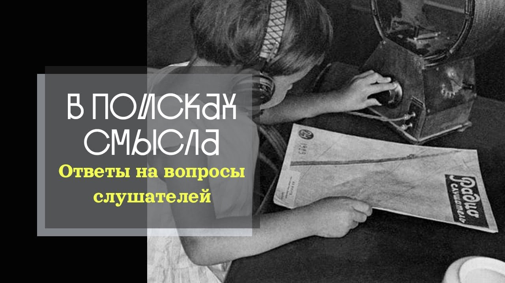

# Ответы на вопросы слушателей

13 мая 2023 [Аудиоверсия](https://paradoks-pinkera-pilotnyy-vypusk.simplecast.com/episodes/otvety) 27:03

- Можно ли объяснить ребенку, что такое трансцендентное?
- Почему протестанты, католики и православные по-разному реагируют на современную повестку?
- Кто эти деконструкторы больших нарративов, о которых часто вспоминают авторы подкаста?
- Какой именно теории заговора отдает предпочтение Павел Щелин?

Отвечаем на эти и другие вопросы слушателей подкаста.



**Е.Голуб:**
Я думаю, что после этого выпуска нас тем более с тобой уличат в том, что мы сторонники теории заговора.
Какое-то количество людей закидает нас всякими гнилыми предметами.

**П.Щелин:**
Это никакая не теория заговора, это просто следствие элементарного наблюдения за реальностью.

**Е.Голуб:**
Неужели все эти усилия бесчеловечные и невероятные по масштабу могут быть следствием планов чьих-то?

**Е.Голуб:**
Здравствуйте, друзья!
Сегодня в эфире предпоследний выпуск первого сезона подкаста «В поисках смысла».
У микрофона Евгений Голуб и со мной, как всегда, Павел Щелин.

**П.Щелин:**
Приветствую вас, уважаемые слушатели!

**Е.Голуб:**
Этот выпуск мы решили посвятить ответам на ваши вопросы.
Их очень много.
Мы попробуем ответить на самые глубокие, что ли, на те вопросы, которые мы не успеем ответить, мы ответим в письменном виде.
Тем, кто не знает, расскажу, а тем, кто знает, напомню, что у нас есть специальная группа в Telegram, где мы общаемся со слушателями, отвечаем на вопросы, возникает масса интересных дискуссий, что может быть темой отдельного подкаста.

Итак.

Я начну читать вопросы, Павел попробует на них отвечать.
Если мне что-то будет непонятно, я становлюсь на позицию слушателя, я буду задавать уточняющие вопросы дополнительные.

**П.Щелин:**
Ну, для справки ты тоже можешь отвечать, не надо всё на меня-то скидывать.

**Е.Голуб:**
Хорошо, начнём с самого общего такого вопроса.
Наши слушатели заботятся о своём подрастающем поколении и задают вопрос.

Как можно было бы объяснить молодому человеку, атеисту, агностику, без какого-либо религиозного опыта?
Что такое трансцендентная или трансцендентность?
Вообще эта задача решаемая?

**П.Щелин:**
В строго научном смысле, разумеется, она нерешаемая.
Но мы тут с вами не наукой занимаемся.
Если исходить из практического опыта, то я бы разделил задачу на два этапа.

Первый этап — это автореферентные вопросы.
Сначала нужно пробудить в человеке вообще потребность в смысле.
Привлечь его внимание к тому факту, что у него есть некая система ценностей, система этики, которыми он руководствуется в процессе своей деятельности.
Это отдельный сложный этап, но рано или поздно автореферентными вопросами.

Что такое автореферентный вопрос?

А почему?

А кто сказал, допустим, он говорит, это хорошо?
А почему это хорошо?

Или а это должно?
Или нужно делать то-то, то-то и то-то.
А почему нужно? Кому нужно?

Вот такое называется автореферентные вопросы.

Соответственно, когда уже возникает проблема признания то, что этика существует, что есть некая система ценностей, которой он руководствуется в жизни, можно начать оттуда выстраивать выход на то, что же может являться источником такой системы ценностей, такой системы этики.
И там начинаются разные пути.

Вообще лучший способ привлечь внимание подростка к чему-нибудь — это быть ему примером.
Давайте прямо говорить, интеллектуальный опыт помогает меньше всего.
Самое лучшее, что человек может сделать — это примером своей жизни свидетельствовать о том, что выходит за границы.

И тут вопросы, конечно, возвращаем об ответственности.
На каждом традиционалисте лежит очень большая ответственность, потому что в тот момент, когда нам кто-то задаёт подобные вопросы, будь то наши дети, будь то коллега по работе, будь то человек из аудитории, на нас лежит ответственность представлять ту систему ценностей, ту систему этики, которую мы отстаиваем, в том числе и косвенно отстаивать трансцендентное.

То есть вот такой метафорой, парадоксом, автореферентным вопросом я бы двигался в этом направлении.

**Е.Голуб:**
Прозвучало, как по мне, немного сложно.
Я бы ответил просто, объяснить нельзя.
Так же, как невозможно объяснить человеку, что такое воспитывать ребёнка, если у человека нет опыта воспитания ребёнка, нет опыта рождения ребёнка.

Это можно в какой-то степени образами передать, но не более того.
Это знание будет интеллектуальным, условным, поверхностным, неглубоким.
Только личный опыт переживания даёт то, что мы подразумеваем под словами «опыт трансцендентного».

Лучше всего об этом Сурожский написал, его опыт встречи.
Я думаю, что хорошо бы познакомиться с этой цитатой Антоний Сурожский.
Кто не знает, поищите его книгу.

**П.Щелин:**
Сразу скажу, по гамбургскому счету я с тобой согласен, но раз уж тут задали несколько пар практических вещей, которые могут быть полезны, я добавил.
Я с тобой согласен.

За человека вы путь пройти не сможете.
То есть есть некоторые вещи, которые человек может сделать только сам.
Другие люди могут ему в этом помогать, именно будучи некими точками отражённого света либо привратниками-проводниками.
Но вот именно шаг в каком-то направлении в конечном итоге — это вот свобода воли, личный выбор человека.
То есть здесь надо честно себе в этом понимать.
Вот так бы я закольцевал ответ на этот вопрос.

**Е.Голуб:**
Следующий вопрос о религиозных ответвлениях христианства, как назвал это наш слушатель.
Вопрос звучит так.

Почему различные религиозные ответвления христианства по-разному следуют за общими трендами.
Имеется в виду радужные флаги, которые до последнего момента не украшали католические храмы, например.

Итак, что говорит наш слушатель?
Где-то ограничивается хором геев на Рождество, а где-то права трансдетей призывают беречь.

**П.Щелин:**
Весь вопрос вижу, он задан из Америки, то есть это американский контекст.
И он идёт, на самом деле, вглубь сути протестантизма, как он произошел на американской почве.
В чем принципиальное отличие от протестантизма, в чем его же сила и в чем его же слабость?

Это свобода интерпретации текста.
Безграничная свобода интерпретации текста.
Протестантская традиция, собственно, не признает никакой традиции, она не признает никакого фундаментального авторитета.
Ну, допустим, у католиков есть папа, у православных есть предания и соборы.
У православных, по сути, есть свобода индивидуального творчества в опыте контакта со священным писанием.
И эта свобода приводит к тому, что иногда рождаются самые строгие, самые дисциплинированные, самые мощные, то, что Вебер называл протестантской этикой, вот эти все пуритане в котелках и картинках, которые прибыли на Мэйфлауреле.
А иногда это рождается интерпретацией текста по принципу «я художник, я так вижу», и вот сочетать несочетаемое, как описывает наш слушатель.
То есть это все следствие свободы интерпретации, которая в протестантизме на каждом.

**Е.Голуб:**
Наша внимательная слушательница прислала несколько вопросов, которые бы мне хотелось озвучить.
В наших выпусках мы говорим о некоторых деконструкторах, которые разрушают большие нарративы, которые намерены покончить с исламом.
Что это за историки-деконструкторы?
Фигура осталась нераскрытой.
Давайте работы и фамилии.

**П.Щелин:**
Отдельный пример, самый современный, чтобы вы посмотрели, это Николь Ханна Джонс, проект 1620, по-моему, он называется или 16.
Суть в чем, журналистка Нью-Йорк Таймс, с точки зрения профессиональной она псевдоисторик, но она получает сейчас огромные деньги, ее считают супербольшим авторитетом во всех левых кругах.
Суть в чем, ее суть провести работу, согласно которой сформировать дискурс, в котором реальное основание США — это не 1776 год, декларация независимости, вот эти ценности Life, Liberty and Pursuit of Happiness, а рабство.
То есть она ставит камнем-основанием США рабство, соответственно, другая дата, и она всю дальнейшую американскую историю реконструирует исключительно через призму рабства и развития арабской проблематики.
Это вот просто, пожалуйста, один из примеров.

А как это работает?
Ну, это работает очень просто.
По сути, деконструктор — это метод.
Возвращаемся к философии постмодернизма, то есть, опять-таки, хронологически философия постмодернизма проникает в американские образовательные круги примерно в 70-е годы.
Затем она, по сути, занимает доминирующее положение на гуманитарных факультетах.
И появляется запрос на подобного рода исследования.
То есть начинаются выделяться гранты.
Гранты запускают механизм еще больших грантов.
Здесь определенная есть воронка в современном образовании.
И у вас все больше и больше элементарных исследователей от магистров до докторов наук, которые занимаются вопросами по типу того, что я описал на примере Николь Хайна Джонс.
Но это можно применить к любому.

Например, опыт женщин-трансгендеров в 1850 году, как это свидетельствует об их, допустим, страданиях.
То есть смена нарратива.
То есть это я немножко сейчас из головы придумал, но не сомневаюсь, что есть подобное исследование, или, допустим, феминистическое исследование ледников, или небинарность такая-то.
И это все работает через университеты.
Деконструкция — это общий процесс, то, что у вас был один большой нарратив, то есть вот Америка — страна land of free and the home of brave, а мы создаем целый, по сути, исследовательский класс, который движет философией, которая думает, что это не так, а было все совсем по-другому.
И мы вам сейчас объясним, как это совсем по-другому с точки зрения нашей системы ценностей.

**Е.Голуб:**
Да, и сейчас в это легко поверить.
Сейчас можно нарратив.
Америка — это страна несправедливо нажитого богатства, где трудом чернокожих рабов создано несправедливое преимущество для белых.

Я видел отрывок мультфильма, и там ключевой был номер выступающих подростков, которые поют, что рабы создали эту страну.
То есть они читают речёвочку и каждый раз привев «это рабы создали эту страну».
И, в общем-то, таких примеров, я думаю, уже достаточно много.

**П.Щелин:**
На популярной культуре это, например, сейчас появляется в активной тенденции по рекастингу.
То есть, условно говоря, когда все исторические персонажи, которые были явно не афроамериканцами, внезапно становятся афроамериканцами, даже если это скандинавский викинг.
Это вот буквально пример из того, что прочитал на прошлой неделе.
Пожалуйста, там какой-то сериал на какой-то большой стриминговой платформе, и там норвежский викинг превратился, ярл превратился в черную женщину по сюжету.

**Е.Голуб:**
Да я видел недавно отрывок из сериала про Екатерину Великую, и там российские крестьянки тоже чернокожие почему-то.
Ну, в общем, да.

**П.Щелин:**
И вот отвечая на вопрос, это вот все про это.

**Е.Голуб:**
Нужно понять, что это не просто забавное недоразумение, а это сознательная работа по деконструкции.
И снесению всего, вообще говоря, здания истории, исторических материалов и так далее.

Один из ключевых вопросов, которые в той или иной степени звучат, это про глубинное государство, про тайную власть.
Нам всячески приписывают то, что мы сторонники теории заговора, и этим самым умножают на ноль все наши рассуждения.
Ну, собрались какие-то традиционалисты, придумали заговор.
Что их слушать там?
Тысячу первый раз одно и то же.

**П.Щелин:**
Я начну ответ на этот вопрос с рассуждения Берлиоза на Патриарших прудах.
Рекомендую посмотреть в Телеграм.
Мы скинем.

Это знаменитый отрывок о том, кто же управляет жизнью человеческой.

Неужели вы думаете, что он сам ею управляет?
Что он так науправлялся, что у него рак легких, и он теперь не едет в Кисловодск.

Знаменитый монолог Берлиоза на Патриарших.
Не Берлиоза, а Воланда, простите, на Патриарших.
Здесь классика идет в помощь.

Сразу скажу, ни я ни Евгений, не являемся сторонниками теории заговора в том виде, в каком ее воспринимает популярная культура.
Но при этом давайте рассуждать логически.

Есть необходимость в управлении.
Любое общество всегда является продуктом некого управления.
То есть это чисто по природе фрактал, опять-таки, по той самой причине.
Пока вам не задана цель, вы не знаете, что делать.
Соответственно, любое общество вырабатывает так или иначе структуру, которая именно создает вот эти цели и теоретическую систему смыслов.
От древнеиндийских брахманов до греческих жрецов до христианских священников и так далее и тому подобное.
Это происходит в любом обществе.

Соответственно, эта власть всегда тесно оказывается в контакте с властью финансовой и денежной, потому что от того, какие у вас ценностные ориентиры, собственно, и будет формироваться разная структура по жизни внутри общества, по управлению этим обществом, по распределению благ и доходов внутри общества.
То есть это базовая структура реальности, которая никуда не девается.

Дальше мы задаем вопрос, какой еще необходимый ингредиент нужен, чтобы управлять просто наиболее эффективно.
Элемент передачи информации.
Элемент преемственности.

То есть в идеале нужно, чтобы ваше следующее поколение управленцев получило эту информацию от предшественников, ну и продолжило заданный курс, а не разнесло все проекты "до основания а затем".
И вот таким образом, вот с этой точки зрения глубинное государство существует.

То есть что имеется в виду под глубинным государством?
Это те группы, которые способны мыслить исторически, которые способны передавать своим наследникам знания и ресурсы по поддержанию того или иного исторического проекта, в который они искренне верят, который наделен той или иной степенью сакральности.
Разными методами они эти свои цели проводят в жизнь.

То есть это никакая не теория заговора, это просто следствие элементарного наблюдения за реальностью.
В этом смысле теория заговора, можно сказать, существует.
Но это из разряда, мне очень нравится пример.
Как ты думаешь, какие семьи в современной Флоренции являются самыми богатыми?

**Е.Голуб:**
Те, которые переняли свои деньги от предков?

**П.Щелин:**
Ну, простой ответ.
Те же, что и в 15 веке.
И вот буквально.

То есть вот в этом смысле глубинное государство существует.
Они же не просто существуют.
У вас есть деньги.
Вы, разумеется, начинаете думать об идеях разных.
Вам деньги уже перестают быть интересными.
Там начинаются разные проекты, о которых мы с вами описываем.
Кому-то справедливости хочется, кому-то миром править, кому-то еще что-то.

**Е.Голуб:**
Есть придирчивый слушатель, слушательница, опять-таки, задаёт вопрос.
Упоминали о том, что в XX веке Соединённые Штаты наводнили марксисты, некие траксисты, марксисты, которые подготовили сегодняшний левый поворот.
Требуют фамилий, требуют авторов, требуют работы.

**П.Щелин:**
Ну, первое, начните с Грамши.
Фундаментальное переосмысление марксизма происходит именно в работах Антонио Грамши.
Он итальянец с периода Второй мировой войны.
До Штатов он не доехал, но вдохновил очень многих.
Именно он переосмысливает идею культурной революции.
То есть он закладывает эти основы теоретически.

Ключевой же элемент — это неофранцузская школа, это Хоркхаймер, это Маркузе.
То есть если говорить про современную Америку, то ключевое влияние оказал именно Маркузе.
Ключевая там у него была идея от экологизма до вот этого современного, собственно, марксизма нового типа через воспитание новой касты бюрократов.
Это была во многом его идея.

Можно вспомнить феминисток, начиная от Симона де Бувар, заканчивая Джудит Баттлером, заканчивая всем феминизмом третьей волны, которая опять-таки накрывается Шаймина примерно в этот же самый период.
И в целом я здесь вам рекомендую больше, чем конкретные работы.
Я вам порекомендую источник на YouTube, где в доходчивой, понятной форме человек читает эти все работы, погружается в них, разбирается.
Называется New Discourses, автор Джеймс Линдзи.
Вот всеми силами туда рекомендую.

**Е.Голуб:**
Вопрос, связанный с выпуском про контролируемое медицинское насилие, про контроль насилия при помощи медикаментозных средств, ну и вообще, видимо, про медикаментозную зависимость современного молодого поколения.
Ставится вопрос, это элемент проекта трансгуманизма или это просто рыночная победа лобби фармацевтических компаний?

**П.Щелин:**
Мне кажется, здесь есть прекрасный элемент взаимодополнения.
В рамках логики капитализма фармакологическим компаниям крайне элементарно выгодны эти процессы, то есть то, что называется бигфармой.
Это не случайно, на этом делаются огромные деньги.

Было несколько расследований в прошлом году касательно работы гендерных клиник.
И это просто бездонная бочка денег, там суммы крутятся какие-то потрясающие.
На каждом человеке, там на человеке можно пару миллионов заработать.
Примерно такой порядок цен.

Но при этом, наверное, вот эта медикаментализация является одним из, мне кажется, своего рода экспериментов.
В частности, психических заболеваний.
Потому что проблема-то не снимается, и мы возвращаемся к антиутопиям Хаксли.
То, что сомы грамм и нету драм.
То есть гораздо проще управлять населением, которое находится в состоянии подобной зависимости.
То есть если вы просто циничный управленец, вы бы подобного желали.
Уж не знаю, насколько вы бы стали свой план предлагать в жизни, но помыслить это достаточно просто.

Опять-таки, по той самой причине, что человек, подверженный слабостям и страстям и зависимостям, им гораздо проще манипулировать, гораздо проще управлять.
А если еще при этом на этом деньги можно заработать, так совсем прекрасно.

**Е.Голуб:**
Я с тобой согласен.
Думаю, что здесь вначале возникла потребность в способе справляться со стрессом.
Затем на эту потребность откликнулись фармкомпании.
Ну а затем, как бы так уже, если продолжать эту идею, те элиты, которые мы подразумеваем в нашем разговоре, использовали этот тренд, чтобы завести ситуацию еще дальше.

Наших слушателей, да и меня, честно говоря, не покидает вопрос.
Всё происходящее, уничтожение нарративов и ценностей, вот это вот возвеличивание человека как меры всех вещей, превращение человека в такой нарциссический клубок потребностей в поглаживаниях и восхищениях и прочим-прочим, разборку истории до деконструкции, уничтожение какой-то базовой логики в рассуждениях, в том, что касается последних тенденций, трансгендерности и так далее.
Это выглядит нашим слушателям, как какой-то путь к сознательному сокращению численности человечества, если не к уничтожению этого всего.

И вопрос, в котором в оригинале у автора много восклицательных и вопросительных знаков.

Неужели это всё намерено?
Неужели все эти усилия бесчеловечные и невероятные по масштабу могут быть следствием планов чьих-то?

**П.Щелин:**
Уважаемый слушатель, доклад "Пределы роста" Римского клуба когда написан?

Уже в 70-е годы элиты прямым открытым текстом постулируют, что людей развелось слишком много, создается слишком большая нагрузка на планету, то что нужно вообще-то этот рост как-то подсокращать.
Это вот, к вам, один из таких просто ну самых на виду открытых планов, примеров.
Что называется, все в открытой, абсолютно ничем не скрывается.

**Е.Голуб:**
Подстановка проблемы не означает автоматический выбор самого варварского какого-то решения.
Ведь могут возразить, там учёные обнаружили, предупредили, человечество начало задумываться об энергопереходах и так далее, и так далее.
Почему же так сразу делать вывод, что вот манифестировали проблему и занялись истреблением человечества?

**П.Щелин:**
Давайте поиграю в адвоката дьявола.

С их точки зрения всё делается предельно гуманно.
Людям дается, по сути, свободный выбор.

Вы сами выбираете, в какую игру вам играть, какими пороками себя развращать, на какие обманки вам ловиться.
И с точки зрения выбора-то тут полностью сохраняется.
А чтобы понять лучше психологию мышления такого человека, я рекомендую уважаемым слушателям зайти таки в нашу группу, где выложен отрывок из великолепного советского фильма «Мертвый сезон».
И там есть диалог доктора Хасса.

В котором он очень хорошо, абсолютно спокойно, абсолютно цинично выражает вот такой некий план.
Там по сюжету фильма идет то, что разрабатывается некое химическое оружие, которое в малых дозах приводит к вспышке гениальности, а в больших дозах производит модификацию человека на генетическом уровне в тупое животное, которому просто нужна миска теплого бобового супа, тупая работа, и при этом он будет счастлив.

Вообще его монолог крайне напоминает знаменитое «Вы не будете ничем владеть, и вы будете счастливы».
Это очень звучит неприятно в этом контексте.

Вам надо понимать одну принципиальную вещь.
Это я заметил по обсуждению наших чатов, я им задал вопрос.
Прежде чем возмущаться, вы должны честно себе ответить на следующий вопрос.

А кто такие люди с точки зрения социальности?
И ответ на это вас непринятнейшим образом удивит.

Несмотря на все эти разговоры о гуманизме, об общих декларациях прав человека и прочем, в реальности людьми группы социальные, что во времена Древней Греции, что во времена Средневековья, что во времена Индии, что во времена Китая, что сегодня, людьми в полной мере считаются только те, кто с тобой одинаковым образом соединяется со священным.
А все остальные, как говорил Редьярд Киплинг, сотрудник британской разведки и великолепный автор, это «Полубесы-полулюди».
То есть, почитайте знаменитое стихотворение «Бремя белого человека» Редьярда Киплинга.
Там проскальзывает очень много относительно именно психологии восприятия на высоком элитном уровне мира.

**Е.Голуб:**
Тут я сразу начинаю вспоминать наши с тобой собственные разговоры.
И Жан-Жака Руссо, там, 18-19 века, обожествление простого дикого человека, создание из этого какого-то кумира и идола.
И это как-то не вяжется, да?

**П.Щелин:**
Это вяжется очень легко, потому что мы же понимаем, что реальным кумиром Руссо был Руссо.
Ему этот дикарь был нужен для того, чтобы вот его и ту группу просвещенных вокруг него поднять на пьедестал.
Дикарь, опять-таки, в данном случае является инструментом.
Я конкретно эту цитату из стихотворения сейчас вам не скажу.

К сожалению, элиты мыслят очень российскими категориями, вам важно понимать.
Есть такой фильм "С широко закрытыми глазами".
И там по сюжету герой попадает на закрытую гностическую вечеринку в пригороде Нью-Йорка.
И вот там прям вот все как надо.
Секс, разврат, наркотики, чувство собственного избранничества.
То есть мы избранные, мы люди.
А остальные — это те, которыми надо управлять на их же флагах.

Что писал Киплинг?

```
Неси это гордое бремя, родных сыновей пошли
На службу тебе подвластным народам на край земли.
На каторгу ради угрюмых, мятущихся дикарей
Наполовину бесов, наполовину людей.
```

И не жди благодарности за это.

То есть, на самом деле, с их точки зрения, они нам услугу оказывают, мы должны принимать.
Мы просто их щедрости не понимаем.

**Е.Голуб:**
Мы дерзаем ставить себя на один уровень с этими сверхлюдьми.

**П.Щелин:**
Они-то понимают, вот они видят эти большие процессы.
Вот то, что называл земля перенагревается, там энергопереход, еще что-то.
А как вы это населению объясните?
Люди глупые, читать не любят, не умеют, как говорил Гитлер.

К сожалению, надо понимать, что вот этот элитный расизм, он никуда не делся.
И для тех, кто не знает, расизм вообще-то в Британии придуман.
Первые теоретики расизма полноценные, они вообще-то британцы были по национальности.
Так что расизм — это базовая структура.
Ну давайте тут не будем винить элиты, мы же сами такие же.

С точки зрения человека в полноценном смысле человек — это только тот, кто по-настоящему на него похож.
И с точки зрения философии тот, кто в полной мере только тот, кто с ним, условно говоря, одинаково верит.
То есть тот, кто одинаковым образом соединяется со священным.
Дальше мы можем говорить о том, что к другим мы можем относиться с милосердием или не с милосердием.
По-разному бывает.
Но по-честному это некое базовое свойство человеческой природы.
И если оно есть у вас, на низких уровнях, почему вы не думаете, что его нет на высоких уровнях?

**Е.Голуб:**
Хорошо, то есть получается, как 200 лет назад или 300 лет назад нацией и народом считали себя только аристократы, так же они себя и представляли.
То есть когда они представляли интересы нации перед монархами, они имели в виду исключительно и только себя.
Это известный исторический факт, это в документах отражено.

Польская аристократия, французская аристократия подразумевала под нацией исключительно себя.
Все остальные — это...

**П.Щелин:**
Да и под людьми в полном смысле.
Свинопасы — это не вполне люди.

**Е.Голуб:**
Поэтому, собственно, и вот эти все преступления по отношению к крепостным крестьянам, они даже до конца не воспринимались как преступления против людей.
Ты хочешь сказать, что вот это же мышление никуда не исчезло, а эволюционировало в то, что есть некие закрытые группы или полузакрытые группы, которые считает только себя в полной мере людьми, и которым для управления ресурсами, людьми, миром, контролем за ситуацией, передачей ресурсов детям необходимо добиться радикального сокращения численности людей и такой сегрегации на элоев и марлоков, то, о чём мы говорили.

**П.Щелин:**
По крайней мере, пока да.
На данный момент я это понимаю примерно так.
Может быть, я глубоко ошибаюсь, обвиняйте меня во всей конспирологии, но это выглядит предельно логично.
И очень по-человечески.

То есть это не выглядит именно, знаете, как некое то, ах как люди могут так вести.
Примерно так они на полном протяжении истории себя и ведут за редкими исключениями.
Поэтому это выглядит предельно логично.

**Е.Голуб:**
Не могу с тобой сразу согласиться, потому что очень много возникает вопросов не в рамках этого выпуска.
Но, наверное, нужно сделать очень серьезные уточнения.

Мы сейчас говорим о некой группе или слое, или касте людей в пределах определенной географии.

**П.Щелин:**
В XX веке они стали сетевыми.
То есть вот это такая элита, которая сетевает.

В этом смысле они не расисты, цвет кожи не так важен, как те ценности, принципы и посвящения, которые ты разделяешь.
Собственно, современные институты — это один из способов, как всегда было, отбора людей в эту самую элиту.

Ты должен пройти все определенные этапы, и если ты докажешь в себе определенную ценность, то ты можешь войти в этот круг условной международной бюрократии.
Назовем это так.
А внутри международной бюрократии есть свои закрытые круги и так далее и тому подобное.

Очень хороший пример внешне, как выглядит евробюрократ.
Вот евробюрократ — это прям идеальный пример низшего уровня вот этого социального слоя.

**Е.Голуб:**
Глядя сейчас на известные фигуры европейской бюрократии, которые часто мелькают на экранах, будем думать о словах Павла, что это как раз самые низкие ступени и наиболее часто встречающиеся представители вот этой закрытой группы.

**П.Щелин:**
В прошлом году Боррель проговорился, когда он выступил со спичем, что, дескать, Европа — это сад, а весь остальной этот мир — джунгли, и надо беречь наш прекрасный сад от того, чтобы эти грязные джунгли в него не проникли и в него и не разрушили.
Тут важен сам паттерн мышления.
Вот паттерн мышления, он примерно такой.

**Е.Голуб:**
Да, было такое.
Он потом долго извинялся и оправдывался за эти слова.

Я думаю, что после этого выпуска нас тем более с тобой уличат в том, что мы сторонники теории заговора.
Какое-то количество людей закидает нас всякими гнилыми предметами.

**П.Щелин:**
Я отвечу на теорию заговора аналогией с дьяволом.
Есть знаменитая цитата, забыл чья, к сожалению, философ XX века, но она предельно глубокая.

> Высочайшим трюком и успехом дьявола было убеждение людей в том, что его не существует.

**Е.Голуб:**
Хорошо.
Будем думать о том, что отрицание теории заговора есть хитрый механизм заговорщиков по самосохранению.
И на этом мы закончим наш выпуск с ответами на вопросы в виде выпуска подкаста.

В следующий раз мы поговорим о наших планах и о наших задачах на второй сезон.
И, возможно, еще ответим на пару вопросов, если хватит времени.

**П.Щелин:**
В частности, ответим на пару технических вопросов по тому, как подкаст чувствует себя по итогам первого сезона, как он будет развиваться, какие мы выводы сделали, какие мы задачи поставили.
То есть оставайтесь с нами, не переключайтесь.

И подсоединяйтесь к группе, там дискуссии идут очень интересные.

**Е.Голуб:**
Ссылка на доступ к группе в описании.
Ну а пока прощаемся с вами и до новых встреч и в эфире, и в группе слушателей подкаста.

**П.Щелин:**
Всех благ вам, дорогие друзья.
