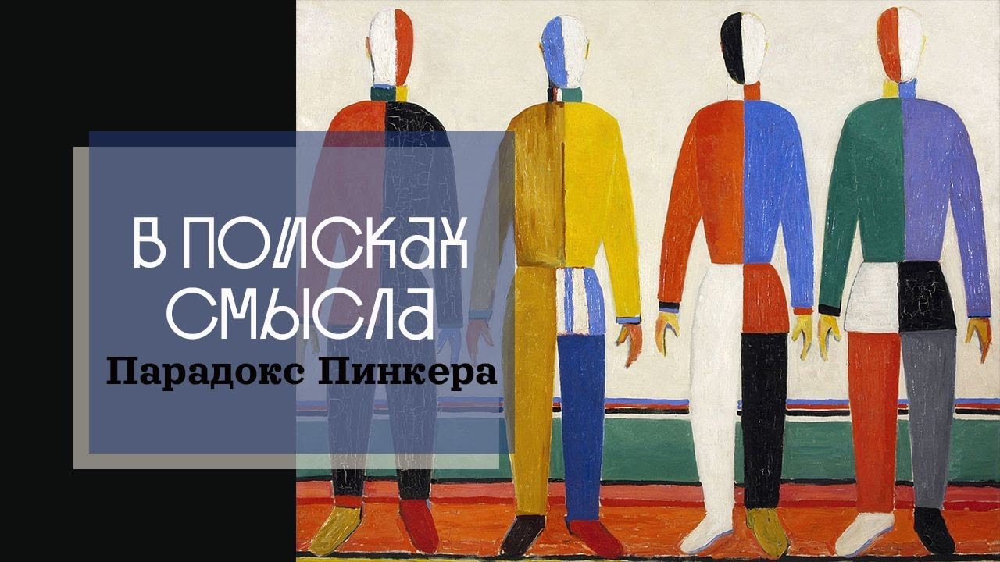

# Парадокс Пинкера

03 марта 2023 [Аудиоверсия](https://paradoks-pinkera-pilotnyy-vypusk.simplecast.com/episodes/pinker) 28:33

Парадоксом Пинкера мы назвали удивительное несоответствие между грандиозными достижениями научно-технического прогресса, принесшими в нашу жизнь комфорт и безопасность, и растущим уровнем психических проблем граждан самых экономически развитых стран.
При чем тут ученый и популяризатор науки Стивен Пинкер?
Об этом пилотный выпуск подкаста Павла Щелина и Евгения Голуба - «В поисках смысла».

**П.Щелин:**
Теплые туалет и канализация в доме — это вообще-то роскошь, недоступная монархам на почти всем протяжении человеческой истории.

То, что классическая философия называет «экзистенциальные проблемы современной жизни», они либо намеренно вытеснены в тень.

Напрямую этот вопрос о жизни, о смерти, о смысле, собственно, откуда и заголовок нашего подкаста «В поисках смысла».

Его избегают как огня.

---

**Е.Голуб:**
Здравствуйте!
Вы слушаете пилотный выпуск подкаста «В поисках смысла».
У микрофона Евгений Голуб, основатель образовательного проекта «Otium Academy», и мой собеседник, политический философ Павел Щелин.

**П.Щелин:**
Добрый вечер!

**Е.Голуб:**
В этом подкасте мы приглашаем вас в совместное путешествие в поисках смысла, происходящего с нами и вокруг нас, к истокам того, что происходит.

**Е.Голуб:**
Первый наш выпуск мы решили назвать «Парадокс современности».
Павел, как вы видите этот парадокс?

**П.Щелин:**
Можно сказать так.
Никогда человечество не жило столь богато с точки зрения материальной культуры, но при этом же никогда в нём не были столь глубоки и столь активны тенденции к саморазрушению, как на уровне отдельных человеческих личностей, так и на уровне государств.
По крайней мере для меня именно это является ключевым внутренним противоречием цивилизации современности, о котором, причем, публично говорится крайне мало, хотя следы и последствия этого парадокса мы видим на всех уровнях окружающей нас реальности.

**Е.Голуб:**
В то же время есть люди, я думаю, что именно явление таких людей, как Стивен Пинкер, например, который написал целую книгу, убеждая вокруг всех, что ребята, всё хорошо, мы движемся в верном направлении.
То есть само появление, необходимость такого рода автора, оно само по себе иллюстрирует то, что, наверное, вопрос этот как-то существует.
Не правда ли?

Зачем вдруг описывать ситуацию и убеждать всех, что всё не напрасно?

Нашумевшая книга, 4 или 5 лет назад, я уже не помню точно, она вышла, называется «Просвещение сегодня», наполненная всякого рода данными, таблицами, графиками.
И основная цель — показать, что прогресс существует.
Стивен Пинкер такой яркий ученый.

Он, выступая публично, много раз с таким хорошо выверенным сарказмом говорит, что есть люди, которые сомневаются в прогрессе.
И они при этом не перестают пользоваться результатами прогресса, но они в нем сомневаются.
И этим сомневающимся Пинкер предоставляет просто какое-то бешеное количество данных, таблиц, графиков, которые должны не оставить ни крупицы сомнения в том, что все отлично, прогресс есть.
Ну, на что он делает упор?

Прежде всего, конечно же, на продолжительность жизни.
Любимый его график, он обычно с него начинает, вот посмотрите, продолжительность жизни была 35 лет, а сейчас в некоторых странах до 80.
Обратите внимание, детская смертность, там каждый пятый ребенок не доживал до 5 лет, теперь у нас там меньше процента или процент детской смертности.

Вот голод, смерть от голода, вот вам график, практически ее нет, незначительное количество.
Вот вам что там, экстремальная бедность в 17 веке.
По его расчётам, 90% людей жили в экстремальной бедности, а сейчас там около 10%.
Ну и так далее, и так далее, и так далее.
Очень интересно.

Он говорит, например, об образовании, о том, что в 15 веке, почему-то здесь он говорит о 15 веке, образованных людей было процентов 5-10, сейчас больше 90%.

Что ещё мне понравилось, это продолжительность рабочего дня, которая с его точки зрения сократилась до 8.
Не знаю, кто учитывает здесь обычные переработки, сплошь и рядом в западных компаниях существующие.

И любопытные данные по поводу того, к чему привело внедрение всякого рода прекрасных девайсов в нашу жизнь, типа стиральных машин и холодильников.
От 60 часов в неделю на домашний труд мы теперь, значит, тратим по расчётам Пинкера около 15 часов в неделю.

То есть, казалось бы, просто процветание, всё есть.

**П.Щелин:**
Да, я тут просто хотел бы уточнить, что вся статистика, которую приводит Пинкер, она действительно взята не с потолка.
Он честный исследователь, насколько я могу судить.
Его данные правдивы.

То есть, те феномены, на которую он описывает, те аспекты реальности, на которые он делает акцент, они действительно существуют.
Это действительно книжка, которая во многом является, мне кажется, результатом его личного удивления.
И вот мне как философу здесь интересно именно само удивление, потому что сам тот факт, что несмотря на объективную данность всех этих изменений, они не очевидны, они не ощущаются как прогресс человеком.
И что потребовалось написание подобной книжки говорит о том, что происходит что-то еще.

**Е.Голуб:**
Он как раз это объясняет, что во всем виновата пресса, она смакует плохие новости, и поэтому, мол, вы не замечаете того, что творится.
Глупо отрицать, насколько продвинулась наука и техника за последнее время.

Ну, в общем, я лично столкнулся с тем, как продвинулась медицина.
И, в общем, только благодарен этому прогрессу.
В медицине, по крайней мере, лично обязан ему многим.
Но, видимо, это не совсем всё.
И один из слайдов выступлений Пинкера заставил меня улыбаться.

Он выступает на TEDx, рассказывает о критериях оценки прогресса.
И последний из критериев — это уровень счастья.
Ну и я тоже жду, что как же он измерял это счастье.
Значит, какой-то график будет там.
Но нет.
Он просто на пустом слайде говорит, мы там 85% населения чувствует себя счастливыми сейчас.
Как он это мерил?

Не знаю.
Вот насколько здесь можно говорить о каком-то честном исследовании.
Он мимоходом.
Все остальное очень хорошо исследовано.
Это так сказал и побежал дальше.
Ну, видимо, не случайно.

Как вы думаете?

**П.Щелин:**
Нет, здесь я как раз абсолютно уверен, что не случайно.
Счастье меряют по-разному.
Есть абсолютно разные социологические проекты, которые посвящены этой проблеме.

Но как раз и в среднем там вывод довольно негативный.
Наблюдается гораздо более негативная тенденция, что в развитых странах этот уровень счастья точно не идет по той кривой, которую от него ожидали.

То есть нет нелинейной зависимости, нет независимости, некой посвященной углублению качества проживания жизни в самых-самых развитых странах, даже таких, как скандинавских.
Иногда по этим рейтингам самой счастливой страной оказывается страна типа Бутана, которую сложно обвинить в некоем безумном уровне материального прогресса.

И в целом-то как раз вот здесь проблема-то и зарыта, что если мы будем смотреть на статистику Пинкера в параллели с другими статистическими данными, то мы увидим большущий парадокс.
Как раз счастье, как переживаемые эмоции, как раз какой-то оптимизм в социальной жизни и в жизни именно поколенческой, межчеловеческих отношений по мере роста материально-технического прогресса становится меньше.

То есть мы не можем говорить, что они там полностью разошлись или что мы живем в самом несчастном из миров, я хочу это уточнить.
Но что мы точно видим, то что тренд идет обратный тому, что мы ожидали.

То есть если мы будем вспоминать, например, весь технологический оптимизм, ну, допустим, тех же 60-х, 70-х годов, когда люди писали о технике, то есть все вот эти, не знаю, кто-то может, это уже вопрос другого поколения, но я точно знаю то, что в 70-е, например, в Советском Союзе, в Америке дико популярна была тема космоса.

**Е.Голуб:**
Да фантастика-то великолепная, огромное количество.
Осваиваем планеты, двигаемся во времени, изменяем мир к лучшему, Стругацкие.

**П.Щелин:**
Технооптимизм, да, вот мир Полудня Стругацких, на самом деле, это было не только про СССР, это было и про Соединенные Штаты, множество фантастики было так или иначе посвящено вот такому оптимизму, а даже если это не было посвящено оптимизму в культуре, это отражалось во всем, от материальных новшеств до общего духа эпохи.

И вот теперь мы можем с достаточно большой уверенностью сказать, что этот тренд просто не состоялся.
Если осматривать просто технический, материальный, медицинский прогресс, то за последние 30-40 лет скачок, наверное, еще больше, чем за предшествовавшие им 70.
Но счастья здесь стало точно больше, а вот тревожных социальных тенденций стало в разы больше.

И вот здесь мы можем поговорить о другой части статистики.
А именно о том, что чем более развитая страна, тем более лидирующее место в ней в плане смертности занимает то, что можно назвать смерть от безнадеги или смерть от отчаяния.
То есть сюда относятся смерти от передозировки наркотическими веществами, алкоголизм.
Но в основном это связано именно с двумя понятиями.
Конечно, алкоголизм, наркотики, самоубийство.

То есть вот такая вот триада.

**Е.Голуб:**
Да, это открытая статистика, которую можно легко проверить.
И я сам был очень удивлен.
Я сначала подумал, что данные 2019 года накопительно представлены за 30 лет, но оказалось нет.

Данные 90-го в сравнении с данными 2019-го выглядят как ошибка, потому что получается, что за почти 30 лет уровень смертности от запрещенных веществ, злоупотреблений, вырос там в 12 раз.
Это не включая опиатов, которые выросли еще тоже в 10 раз.

То есть алкоголь переместился с первого места на третье, и смертность от злоупотребления алкоголем выросла в 2 раза.
Возникает очень много вопросов.

Если мы становимся все более продвинутыми технически, живем более комфортно, почему такая потребность в наркотиках и алкоголе?
И это смертность, это же только уже какие-то фатальные случаи.
Нет пока статистики, я не нашел о том, какое количество людей употребляют наркотики.
Первое.

И во-вторых, в этом случае специально оговорено, что марихуана исключена.
Потому что считается, что употребление марихуаны не может привести к смерти.

Налицо стремление людей на уровне химических веществ как-то себя, ну что ли, осчастливить или транквилизировать каким-то образом.
Отчего же это происходит?

**П.Щелин:**
Я уточню слушателям то, что та статистика, которую привел Евгений, она, конечно, по США, но в целом тренд примерно такой же во всех развитых странах.
То есть это общий, опять-таки, если говорить о тренде и длинной тенденции, то он наблюдается именно таким.

Более того, если говорить про Соединенные Штаты, то там есть статистика именно для меня более пугающее, а именно то, что параллельно вот этому числу смертности от условно назовем их, транквилизаторов, происходит настоящая вот не временная, а стратегическая пандемия психического заболевания.

Некоторые цифры достигают просто каких-то умопомрачительных моментов.
Так, в США на фоне ковида в моменты пика по разным опросам 40% населения говорило о том, что они нуждаются в медикаментозных антидепрессантах на фоне стресса, вызванного пандемией.
Причем, что хуже, всего, эта тенденция еще более в целом стабильно распространена среди подростков.

То есть количество подростков, которые потребляют антидепрессанты в Соединенных Штатах на горизонте 20 лет выросло в десятки раз.
Это даже в сравнении с моим детством, а я достаточно молодой человек, это какая-то просто немыслимая цифра, да.

Условно в нашей молодости мы и выпить могли, и особенно там втайне от родителей, но массового приема антидепрессантов точно не было.

**Е.Голуб:**
Да никто слова такого, наверное, не знал толком.
Антидепрессанты — это были уже для каких-то крайних случаев.

Мы слышали про поколение прозака.
Когда ты сталкиваешься со статистикой, когда частью субкультуры становится обсуждение, какого рода антидепрессанты ты принимаешь.
Это такой символ времени.

Я вот долго пытался вспомнить какой-то позитивный, радостный фильм, не детский, для взрослой аудитории.
И мне ничего не пришло в голову.

Все, что сейчас выходит, оно носит какой-то оттенок такого пессимизма, что ли.
Какие темы вот сейчас, Павел, какие темы приходят в голову?

**П.Щелин:**
Тут интересно, тут не все, конечно, тут небольшой комплекс.
Они все объединены единой темой, я с вами абсолютно согласен косвенно.

Ну, тема именно вот этого некого бегства от реальности.
А жанры, соответственно, у нас есть прямая там такая трагедия, такая драма, что называется, некая антиутопия мрачного характера.

Есть популярный жанр фэнтези, но это не оптимистическая фэнтези, это фэнтези в жанре вот именно брутальности, жестокости, такого...
Ну вот, «Игра престолов» — самый такой выдающийся example этого жанра.

Наконец, есть довольно популярный жанр, ну, например, в японской культуре — это попаданчество или эскапизм.
Кстати, вот здесь японская культура с постсоветской культурой очень сильно схожа.
Я не знаю, следили вы или нет, но вот в России, да и в Украине, огромное количество разной попаданческой литературы о том, как человек переселяется там уже в зависимости от желаний.
Кто в Сталина, кто в Черчилля, кто в в Рузвельта, ну, в общем, кто в Грозного, кто еще в кого-то.
В Японии просто есть огромный жанр манги, так и называется, и сикай, попаданчество.

Причем это всегда одно примерно то же.
Герой, работающий на скучной офисной работе клерка, очень часто либо погибает в случайном автомобильном происшествии, либо от переутомления на работе, либо уже сразу, будучи школьником, напрямую переносится в какой-то другой фэнтезийный мир, где он уже, в зависимости от желаний сценариста, может так или иначе самореализоваться, назовем это так.
Там уже есть варианты и сценарии, но жанр очень популярный, очень растущий в своей популярности.

И, наконец, последняя такая вот..
Уже совсем популярный жанр, это уже американский, это вот то, что мы называли, я бы сказал, цинизм.
Предельный цинизм, то есть социальная драма как воплощение предельного цинизма и разочарования в человечестве и уже вот такого смирения с неизбежностью финала.
Вот, наверное, самым ярким примером это вот, если помните, был фильм «Не смотри вверх» прошлого года.

**Е.Голуб:**
Да, да, это который заявлялся как комедия.

**П.Щелин:**
Да-да-да, который заявлялся как комедия, но вот он является таким, я бы сказал, верхушкой айсберга.
Вообще, посмотрите на всю эволюцию супергеройского жанра в тех же Соединенных Штатах.

Если супергерои 70-х, 80-х, 90-х, 2000-х — это оптимистический жанр, это хорошие парни, которые так или иначе побеждают плохих парней, за редкими исключениями.
И Бэтмен там является вот таким антигероем, один из немногих антигероев, которые вот ставят некие сложные вопросы о темной теневой стороне человеческой психики.

То сейчас назвать супергеройский фильм, в котором просто супергерой был бы супергероем и не мучился от каких-то неразрешимых социальных противоречий, мы вообще назвать не можем.

**Е.Голуб:**
Ну да, если мы еще вспомним сериал «Парни» в русском переводе или «Boys» в английском, то там просто собрание, прямо скажем, сомнительных людей, моральным обликом и мотивацией.
Нарциссов, извращенцев и прочее, прочее, прочее.

То есть это, по-моему, «Boys» — это уже вершина или там завершение цикла супергероев.
Вот герои нашего времени.

**П.Щелин:**
Да, это герой нашего времени.
Здесь важно, что супергерой — это, ладно, то есть мне могут спокойно возразить, что во все времена были такие, повторюсь, антигерои.
Да, действительно, был еще в 70-е.

Кстати, хороший вопрос, почему именно в 70-е в Америке выходил комикс «Watchmen» — «Хранители».
То есть как раз тоже такой первый пример антигеройской драмы, я бы сказал.
Но это было в меньшинстве.

Это то, что было, условно говоря, на границе социального восприятия, перешло в ее центр.
То есть даже те фильмы, которые должны быть самыми массовыми, кассовыми, они совсем не оптимистические.
Они совсем драматические, они совсем безнадежные.
То есть как бы никакого оптимистического выхода там не предлагается.
И, повторюсь, здесь именно важен тренд.

Как раз я-то ничего не ожидал от технологического прогресса уже.
Ну, по мере осознания я оптимизма не ожидал.
Но, условно говоря, люди, подобные Пинкеру, должны ожидать.
В этом-то и парадокс.

То, что если их ключевой тезис верен, и это же не только их тезис, это огромный проект длиной в столетие, то, что по мере развития материальной культуры и освобождения человека от цепей, по сути, физической реальности, наступит счастье, наступит освобождение, наступит раскрепощение, наступит заря оптимизма, творчества и радости.
И вот этого просто не происходит.
Та гипотеза, которую закладывали, вот она не оправдывается ни на уровне культуры, ни на уровне социума.

Для меня это очень тревожная статистика, гораздо более тревожная, даже скажу, чем война.
Войны в истории были, и было их много.
То есть вся история человечества, откройте любой учебник, это история войн.

А вот чтобы 40% населения сидело на антидепрессантах, то есть химическим образом подавляло нейронные реакции в своем мозге, такого мы не знали.
И мы не знаем, к каким последствиям это может привести.
Мы не знаем, какое общество возникнет из людей, которые десятилетиями потребляют подобного рода вещества.

Это не просто алкогольный напиток, я не знаю, во время фестиваля урожая.
Это именно каждодневная медикализация человеческого состояния.
Вот это вообще же страшно.
То есть, по сути говоря, современное общество говорит человеку, что если ты что-то испытываешь и чем-то недоволен, если ты что-то в реальности не можешь принять, вот тебе простое решение, прими таблеточку.
В этом смысле мы гораздо больше к антиутопии Хаксли, чем к антиутопии Оруэлла, если вы помните, две великие антиутопии 20 века.

Для тех, кто не знает, Джордж Оруэлл, этот 1984, это вот все мы знаем, страшный, тоталитарный большой брат.
Для людей Советского Союза, наверное, гораздо более актуальные, скажем так, произведения.

Но пока выходит, что стратегически к реальности был гораздо более ближе другой британский автор, а именно Олдос Хаксли.
И у него основной аргумент в том, что там общество, которое сидит на наркоте.

Вот в буквальном смысле.
Все общество сидит на наркотике.
Вот абсолютно все общество сидит на наркотике.
Там жесткая кастовая система.
Кстати, это отдельный вопрос о жесткости кастовых систем в современном обществе.

**Е.Голуб:**
Генетическое моделирование в меру известных тогда технологий.
Попытка сразу на уровне генетики задать свойства людей.
Одни работают физически, другие занимаются умственным трудом и так далее.
Ну и полная половая свобода.

**П.Щелин:**
И каста правящих.
То есть да, там у него 4 группы, альфа, бета, гамма, дельта.

**Е.Голуб:**
Да, я помню, это отличная тема.
И опять-таки то, что им предписывается в случае негативных эмоций выпить таблеточку "сомы", которая там делится по уровню крепости, но это обязательно.

**П.Щелин:**
Да, там лозунг я очень хорошо помню.

> Сома грамм, и нету драм.

То есть вот дословно цитата из книжки.
И в каком-то смысле можно переводить на современное общество.
У тебя проблема?
Выкури косячок или прими прозак.

**Е.Голуб:**
И это еще же не все методы избегания реальности.
Есть химическое, есть виртуальные миры, тоже способ уйти в виртуальный мир, погрузиться в игры.
Есть проекты эскапизма, которые набирает популярность с каждым годом всё больше и больше.

Жизнь офф-грид, вне проводов, вэн-лайф, какие-то яхтенные движения.
Такое впечатление, что люди задались целью сбежать от той комфортной жизни, которой они должны наслаждаться в теории.

Спрашивается, чего вдруг у людей возникает потребность забраться в какую-то глушь, построить дом так, чтобы не подключать электричество, и потом рассказывать всем и собирать сотни тысяч восторженных отзывов о том, как же это здорово наконец-то выйти из беличьего колеса.

**П.Щелин:**
Здесь как раз интересно.
Интересно даже не сколько то, что кто-то это делает.
Ладно, на больших социальных группах бывает разное.

А вот то, что эти ролики собирают миллионы просмотров, вот это интересно.
То, что есть запрос на потребление, и, ну, по сути, переживание, реализацию собственного желания за счет просмотра действий чужого человека.

То есть работает это примерно так.
То есть люди, которые смотрят эти ролики, они, скорее всего, сами так и хотят сделать, но не могут.
В силу разных причин, возможностей, навыков и так далее.
И вот как бы симулируют свое желание через просмотр подобного вот wood life или off-grid life.
Это абсолютно верно.

Ну да, и вот мы наталкиваемся на этот парадокс, что вопреки всем ожиданиям и вопреки объективной реальности технологического медицинского прогресса, то есть Пинкер прав.
И вот повторюсь, он прав.
То есть его данные правдивы.
Он не выдумывает, он не берет их из головы.
Ну, может быть, за редчайшими исключениями какие-то манипулятивные, но в целом его данные правдивы.

Это абсолютно честное утверждение, что никогда в истории человечества не жило так материально благополучно, как оно живет сейчас.
Не знаю, за какой-нибудь смартфон или компьютер, ученый конца 19 века величайший, да он руку бы отдал, чтобы оно бы его исследование ускорило, я не знаю, насколько.

**Е.Голуб:**
Да, я думаю, еще 30-40 лет назад это было мало представимо, что такое можно поместить в такую маленькую коробочку.

**П.Щелин:**
И тем не менее, по мере насыщения реальности материальными благами, просто доведения их до какого-то предела, мы видим социальную тенденцию бегства от реальности самыми различными методами.
От каких-то совсем нишевых вещей до, повторюсь...
Самое массовое, конечно, это вещества.

Тут можно говорить что угодно, но вот эта массовая медикализация человеческого состояния, которая происходит как средство эскапизма, это, наверное, самые непредсказуемые последствия.
Кстати, здесь же можно отнести и нашу общую беду, это злоупотребление экранами, дофаминовую ловушку зависимости, потому что, по сути, это точно такая же наркотическая ловушка зависимости, как и классические наркотики.
Просто работает чуть-чуть по-другому.

От просмотра экранов мы получаем дофаминовый всплеск, когда приходит нотификация, когда яркость, когда лайк или что-то подобного рода.
То есть здесь как бы на самом деле точно такой же наркотик, просто в более, скажем так, скрытой так или иначе форме.

**Е.Голуб:**
Социально приемлемый к тому же.

**П.Щелин:**
Социально приемлемый, да, можно так сказать.
И это парадокс.

**Е.Голуб:**
Я попробую выразить этот парадокс по-другому.

То есть что получается, что мы не знаем, мы еще с вами не разбирали сколько, то есть цель 300-летних или там 400-летних усилий сделать жизнь человека лучше.
В материальном смысле, избавить его от унизительного тяжелого труда, осчастливить его тем, что дать ему комфорт, и чтобы было тепло, сухо, чтобы у него была возможность читать, писать, чтобы вся эта мечта всех поколений, она уже, можно сказать, осуществилась.

**П.Щелин:**
Ну, к 60-м и 70-м, я бы сказал.

**Е.Голуб:**
Да.
Мы достигли той точки, в которой можно сказать, что все потребности человека удовлетворены материальные.
Дальше потребности начали уже, мне кажется, изобретать и создавать.

Никто не мог и подумать, что мне такое нужно.
А от него оказывается, да, хорошо.
То есть все известные XIX веку или даже XX потребности в середине или там в последней третьей XX века большей частью населения или там основной частью населения, были удовлетворены.
А в 21 веке, как мы знаем от Пинкера, то и, наверное, половина или двух третей населения удовлетворены.
То есть две трети населения живут уже в раю по меркам 19 века.

И они несчастливы.

**П.Щелин:**
Ну, кстати, да, это такой тонкий момент, но теплый туалет и канализация в доме — это вообще-то роскошь, недоступная монархам на почти всем протяжении человеческой истории.
Так, для справки, если вы будете в Европе смотреть, как жили монархи, то холодно они жили.
Почему собаки королей спали часто с ними в одной комнате или в одной кровати?

Да для тепла они спали, потому что холодно по ночам.
А сегодня это так или иначе доступно абсолютному большинству населения планеты.
В развитых странах так просто всем.
Даже самые беднейшие классы, сидящие на социальных пособиях, они сидят в относительном тепле, по историческим меркам так совсем в тепле и со всеми удобствами.

Невозможно отрицать этот факт.
Это действительно невозможно.
Это действительно в историческом смысле какое-то невероятное состояние человека.

**Е.Голуб:**
Да, осталось еще достаточно много людей, которые стремятся к такому же уровню комфорта, который есть в Европе, в США.
Но если они заглянут в души или в головы тех людей, которые, как им кажется, находятся на пике благополучия, они что там видят?

Пустоту, отчаяние, антидепрессанты.
Им наши разговоры покажутся какой-то блажью.

Но всё-таки, если мы уже сейчас знаем, что по мере увеличения материального достатка счастье и радость не увеличиваются, или они, можно сказать, практически исчезают, по крайней мере, из сферы культуры, из-за того, что нас окружает, то, наверное, цель выбрана была неправильно.
Как вы думаете?

**П.Щелин:**
Ну, скорее, цель была выбрана неполной, или, скорее, были допущены ошибки в понимании человеческой природы.
Причём здесь поразительно с точки зрения культуры и символов.
Эту ошибку мы знаем на протяжении тысячелетий в очень лаконичной форме.

Это первое искушение Христа в пустыне знаменитое, то, что когда ответ идет не хлебом единым, жив человек.
И, по сути, переводя на язык более научный или язык современный, можно просто сказать, что материальных благ самих по себе недостаточно.
И человек не может быть ими удовлетворен.

Но это ставит нас перед вопросами, перед многоточиями, потому что если не это, то что?

И вот здесь мы сталкиваемся с тем, что для всей современной культуры ответы на эти вопросы представляют крайне болезненную тему на самом деле.
Именно в такой формулировке.

То есть мы отдельно будем, я думаю, в будущем в других подкастах об этом говорить, но я затрону сейчас чуть-чуть то, что практически все то, что классическая философия называет экзистенциальные проблемы современной жизни, они либо намеренно вытеснены в тень, то есть они не обсуждаются, либо все их обсуждение глубоко сублимировано.
То есть обсуждаются симулякры этих вопросов.

Напрямую этот вопрос о жизни, о смерти, о смысле, собственно, откуда и заголовок нашего подкаста «В поисках смысла».
Его избегают как огня.

Да даже проведите эксперимент.
За каким-нибудь обедом, за разговором попробуйте задать вашему родственнику вопрос, а вот что ты думаешь о смерти?
А зачем ты живешь?
А в чем источник твоей радости?
И так далее, и тому подобное.

Он на вас будет смотреть, как на сумасшедшего.
И это не случайно.

И, допустим, вы можете сказать, да, это не светская тема, но...
Например, в 19-м еще веке именно такие вопросы были светскими темами разговора.
Те, кто читал классическую литературу, вы посмотрите, что там люди обсуждают именно за такими застольями.

Они обсуждают философию, они обсуждают экзистенциальные проблемы, они обсуждают именно чуть ли не богословие, и это нормальная тема светской беседы.
И то есть это, да, можете сказать, что крестьяне это не обсуждали.
Ну, отдельно как-нибудь объясню, как мыслил средневековый, условно говоря, крестьянин, но как раз, условно говоря, образованная элита именно этот вопрос-то и обсуждала.

А по современным меркам мы все стали образованной элитой.
То есть мы должны были бы ожидать, что мы теперь все займемся этими вопросами, как, кстати, просветители и надеялись.
Но вот нет.

Мы обсуждать готовы какие угодно вопросы.
Мы готовы обсуждать какую угодно мишуру, симулякор, какую угодную бесконечную подделку из новостного шума, кроме тех самых вопросов, которые нас и тревожат.

Потому что мой аргумент, что именно эти вопросы о жизни, смерти, смысле, они-то и подавляются антидепрессантами.
То есть не имея возможности найти ответа ни в культуре, ни в обществе, ни в философии, скажем так, те люди, то есть опять здесь люди разные, есть те, кто до сих пор это имеют и находят.
И, кстати, статистика очень хорошо показывает, что те люди, у которых есть хоть какие-то ответы на эти вопросы, у них все лучше и с суицидами, и с депрессиями, и с медикаментализацией.

Но для большинства на данный момент нет, этого нет.
И этот вопрос вытеснен.
И он страшный вопрос.
Он ставит под сомнение нечто очень фундаментальное в современной культуре.
Культуре в очень широком смысле этого слова, как все его способы человеческого сосуществования.
И для меня, как для философа, это, конечно, является предметом огромного интереса.
И с радостью, думаю, в будущем будем это обсуждать.

**Е.Голуб:**
Сегодня мы остановимся на том, что зафиксируем этот парадокс.
Я еще не знаю, может быть его стоит назвать парадоксом Пинкера, хорошо звучит.

Парадокс Пинкера.

Пинкер как будто бы этот парадокс озвучивает, но находит объяснение в том, что просто пресса неправильно освещает, непропорционально много уделяет внимания нехорошему, да и вообще о хорошем говорить нечего.

**П.Щелин:**
Может быть.

**Е.Голуб:**
Но мне кажется, что проблема не в том, то есть если зафиксировать, что мы не чувствуем радости от достижений прогресса.
Прогресс есть, отрицать его бессмысленно, но радости от этого нет.
Смысла от этого не прибавляется.
Вот эти 40 часов, которые освободились в неделю у человека от домашнего труда, не пошли на что-то, что даёт ему ощущение полноты жизни, осмысленности существования.

Они уходят на какие-то занятия, отвлекающие или связанные с его зависимостью, или погружающие его в какое-то дурманящее состояние.
Вот так бы я этот парадокс обрисовал.
Есть прогресс, счастья нет.
Что будем делать?

Поговорим об этом в следующий раз или поговорим о том, откуда началось это движение, когда человек выбрал своей целью исключительно материальные блага, когда он стал надеяться только на свой разум и как это вышло.

**П.Щелин:**
Для меня основная идея, я бы выразил так, что каким образом и когда были заложены философские основания нашей современности, и какие в них заключены парадоксы и противоречия на уровне дизайна.

Вот здесь я буду, условно говоря, косвенно спорить с Пинкером и прочими, потому что для Пинкера текущее состояние, можно сказать, как случайность.
Такое временное неудобство, временная неувязочка, но со временем как-нибудь решим.
Или как любят говорить верящие в науку, но со временем в будущем наука разберется.

**Е.Голуб:**
Да-да-да, кстати, отличная тема.
Он так и говорит, что у нас есть задачи, которые мы решаем.
Вот мы решили задачу голода, решили задачу образованности.
Сейчас есть некоторая неудовлетворенность с жизнью.

Поставим задачу и решим.
Есть магия, есть ученые, есть наука.
Они там сфокусируются и разберутся.

**П.Щелин:**
А мой философский ответ будет, что условно в самом исходном коде философском, цивилизации современности заложены неразрешимые противоречия внутри этой системы.
Во время наших подкастов, я думаю, очень часто я предлагаю сделать что?

Брать какой-то современный культурный феномен общественный, и вскрывать его столетние предпосылки и основы.

Из тех, например, которых меня очень интересует, это успех в этом месяце сериала, который называется «Древний апокалипсис».
По сути, альтернативная история.
На первый взгляд, казалось бы, просто маленький культурный феномен, но если покопаться, он указывает на нечто очень важное, что пропало и чего не хватает современному человеку, от чего он несчастен.
