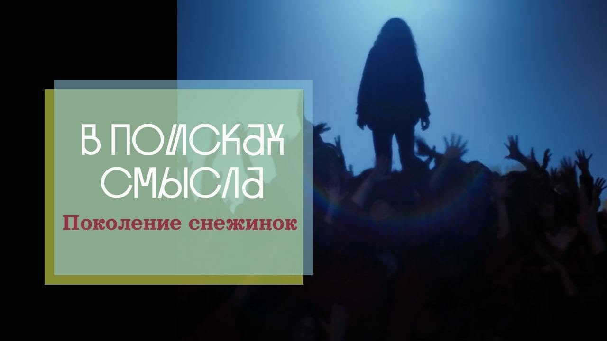

# Поколение Снежинок

08 апреля 2023 [Аудиоверсия](https://paradoks-pinkera-pilotnyy-vypusk.simplecast.com/episodes/snowflakes) 29:30

Продолжаем тему общества и насилия.
Цена предельно лицемерного способа организации социальной жизни.
Проблемы поколения Z или поколения снежинок.
Агрессивные жертвы воображаемого насилия и поворот к тоталитаризму во имя инклюзивности, толерантности и защиты окружающей среды.

**П.Щелин:**
Многие родители хотят, чтобы их ребенок был некой жертвой, и тогда он становится дополнительно модным аксессуаром.

---

**Е.Голуб:**
Здравствуйте, друзья.
Мы записываем очередной выпуск подкаста «В поисках смысла».
Мы — это я, Евгений Голуб, и мой постоянный собеседник, соавтор подкаста, политический философ Павел Щелин.
Сегодня мы решили продолжить разговор о насилии.

Павел, почему?

**П.Щелин:**
Мне кажется, тема, которую мы подняли в предыдущем подкасте (а именно — где мы рассуждали с тобой о значении фильма «Заводной апельсин», для понимания процессов, происходящих в современном обществе) осталась недоговорённой.
А с другой стороны — буквально на днях вышел материал, идеально продолжающий тему нашей беседы.
Это исследование, точнее, документ, посвящённый состоянию психологического здоровья подростков Соединённых Штатов Америки.

Цифры там красноречивы и прямо связаны с темой предыдущего выпуска: проблематика насилия, вытесненной агрессии и цены, которую общество платит за лицемерную организацию социальной жизни.
И вот об этом мы поговорим в ближайшие полчаса.

Я предлагаю тебе понемножку начать, поскольку я знаю, ты этот документ прочитал.
Расскажи вкратце, какие цифры произвели на тебя самое большое впечатление и какие выводы ты из этого сделал?

**Е.Голуб:**
Я посмотрел этот материал.
Это исследование Центра по контролю и предотвращению заболеваний в США.

Я несколько скептично отношусь к любым статистическим или социологическим опросам, потому что обычно они заказываются или проводятся с целью поддержать какую-то позицию.
Но в данном случае сложно подозревать ангажированность, потому что Центр по контролю и предотвращению заболеваний в США вряд ли был заинтересован показать, что 57% девушек-подростков чувствуют постоянную грусть и безнадёжность, и 22% всех подростков подумывают о самоубийстве.

**П.Щелин:**
22% девочек и 11% мальчиков.

**Е.Голуб:**
Цифры достаточно высокие.
Тут есть и общий уровень грусти, безнадёжности среди подростков, и 22% из них думают о суициде.
Мне, конечно, хочется сразу перейти к выводам и связать эти данные с теми истериками в TikTok, которые мы видим на тему идентичности и гендерных вопросов.

Давай начнём вот с чего: ты считаешь, что мы можем доверять этим данным?
Ты считаешь, что мы можем пока обойтись без того, чтобы сравнить эти данные с предыдущими исследованиями в этой сфере?
Мы все знаем, что подростки склонны печалиться и подумывать о нехорошем.

Насколько здесь иллюстративно то, что мы видим, и можем ли мы двинуться дальше?

**П.Щелин:**
Если бы это было единичное исследование или единичные цифры, можно было бы их отмести.
Но на самом деле, для тех, кто следит за темой, подобного рода тренд отмечается последние 20 лет.
То есть подобные цифры (порядок был поменьше, разумеется) выходили в 2019 году и ещё ранее.
В целом — это то, что мы уже обсуждали в наших первых подкастах: тренд на количество «смертей отчаяния» в американском обществе растёт.
То есть, количество смертей от самоубийств, или вызванных злоупотреблением различными веществами, последовательно растёт все последние десятилетия.
Все цифры очень хорошо укладываются в тренд.

Прямо скажу, я не считаю, что этот CDC (Центр по контролю заболеваний) является безумно честным источником информации, которому можно доверять с закрытыми глазами.
Но здесь нам важно общее состояние, общая картина, которую, на мой взгляд, эти цифры более-менее адекватно рисуют.

Это подтверждается косвенными индикативными данными.
Достаточно заглянуть в социальные сети — немножко анекдотический способ оценки, но тем не менее, он подтверждается статистическими рядами.
Он также подтверждается более глубинными психологическими изменениями восприятия реальности так называемым поколением Z, поколением зумеров, о которых говорят различные социологи, биологи, культурологи.
То есть это не является какой-то предельно новой информацией.

Правда, у меня замысла продолжать эту тему буквально неделю назад не было, но, на мой взгляд, это исследование даёт нам с тобой возможность немного углубиться в проблематику этой достаточно амбициозной задачи, в каком-то смысле взглянуть сверху на эксперимент по созданию так называемого «непоротого поколения» и того, к каким последствиям это привело.

**Е.Голуб:**
«Непоротое поколение»?

**П.Щелин:**
Ну да, есть такое известное высказывание.
Это означает, что одно «непоротое поколение» привело дворянство к отмене крепостного права, с тех пор оно (это выражение) используется.
В целом это было достаточно позитивное наблюдение в контексте той эпохи, от которой оно первоначально пошло.

Но я его употребляю сейчас в смысле того, как изменились практики воспитания, в особенности прежде всего на Западе, примерно на рубеже девяностых годов и далее, когда началась смена фокусировки семейной модели с того, что называется нуклеарной семьёй (мама, папа, несколько детей, при этом всё равно сохраняется определённая расширенная семейная модель, то есть у тебя в картине мира остаются какие-то родственники: бабушки, дедушки, дяди, тёти) в сторону модели, где в центр поставлен ребёнок.

Это произошло именно тогда.
То есть, по сути, вся семейная жизнь стала выстраиваться вокруг ребёнка, вокруг его желаний, поблажек, вокруг его эмоционального самочувствия.
Тогда же начинаются разговоры о полной недопустимости телесных наказаний, удовлетворении любых запросов, стремлении оградить ребёнка от любого дискомфорта и так далее.
Ты, наверное, это всё застал.
То есть, для тебя не является новостью то, что я описываю.

**Е.Голуб:**
Ну, я являюсь, в общем-то, ярким проводником такого рода подхода, потому что моё детство пришлось на 70-е годы.
Мои родители — это дети, рождённые сразу после войны, родители которых участвовали в войне.
Они выросли в жёстких условиях и, конечно, в меньшей степени, но всё-таки транслировали своё отношение к жизни и понимание методов воспитания на моих сверстников и на меня.

Поэтому да, приходилось сталкиваться с какими-то жёсткими ограничениями, которые воспринимались как несправедливые по отношению ко мне, наверное, все дети это так воспринимали.
Когда у меня самого родились дети, мне хотелось вырастить их в другой обстановке.

И в это же время тренды на внимательное отношение к личности ребёнка, отсутствие жёстких запретов, диалог с ребёнком, обсуждение ограничений — всё это казалось очень разумным.
Поэтому мои дети как раз и есть поколение Z.

**П.Щелин:**
Я имею в виду всё-таки конкретный социологический и психологический сдвиг, который произошёл прежде всего на Западе.
То, что ты описываешь — это немного другой процесс, который в советском контексте ему предшествовал.
А именно, я описываю тот период, когда сама модель семьи стала детоцентричной.
То есть на Западе это происходит в шестидесятые-семидесятые годы.
Тогда же одновременно происходит коммерциализация всего того, что связано с детством.
Было бы заблуждением считать, что детей не любили, что детей полностью игнорировали до шестидесятых-семидесятых годов.

**Е.Голуб:**
Ты связываешь это с коммерцией, с тем, что надо было больше детских товаров продавать?
Соответственно, детей нужно было поставить в центр?

**П.Щелин:**
Это было связано частично с тем, что тогда начинается расцвет, прежде всего на Западе, того общества потребления, которое потом будет описано социологами, культурологами именно в его гипертрофированной форме, то есть триумф пиара, триумф технологий продаж, коммерциализация всего, что связано в принципе со всеми сферами жизни, дети не стали исключением.
То есть, дети были помещены в центр вот этого семейного, скажем так, потребления.
Именно тогда происходит очень много развития всего того, что связано со всей индустрией детства: начиная от курток, игрушек, одежды и так далее.
Список идёт бесконечный.
Постоянно придумываются новые товары, новые потребности.

Точно так же придумываются способы передачи, по сути, воспитания на аутсорсинг, потому что родителям тоже необходимо потреблять.
То есть, мы говорим всё-таки сначала о западном мире.

В постсоветское пространство это пришло уже позднее, скорее в девяностые-двухтысячные.

**Е.Голуб:**
У меня дети родились в конце девяностых-в двухтысячных, как раз это время и пришло.
И я столкнулся с тем, что ребёнку можно купить практически любую игрушку, можно найти всё что угодно, появилась масса разных видов колясок, всякого рода развлекушек.

Так что я считаю, что я всё-таки соучастник этого процесса, и в полной мере пожинаю его плоды, потому что дети мои сейчас выросли, и я сталкиваюсь с тем, видимо, о чём ты хочешь поговорить.

**П.Щелин:**
Я просто объясню, в чём еще происходит сдвиг.
То есть, я буду говорить не об индуктивных проблемах, а о более общем тренде.
Какой происходит парадигмальный сдвиг в этот период?

Парадигмальный сдвиг, повторюсь, происходит в том, что семья из естественной, где она живёт некой жизнью, в которой дети являются её естественной частью (то есть они рождаются, включаются в семейные отношения, включаются в хозяйственные отношения).

**Е.Голуб:**
У них есть свои обязанности, они участвуют в семье не на равных, всё-таки, а на какой-то подчинённой роли, но о них проявляют заботу.

**П.Щелин:**
То есть это не то, что там, условно говоря, дети находятся в каком-то загоне и являются рабской силой.
Нет.
Но идея в том, что это происходит в неком таком естественном, циклическом, поточном, если тебе угодно, режиме.

А перелом происходит к модели, где ребёнок становится центром всей семейной жизни, и взрослые превращаются в, по сути, «бесплатных аниматоров» при этом ребёнке.
И вот это уже конкретный перелом, который начинается во время общества высокого потребления в западном мире, но потом распространяется по мере успешного движения на другие страны.

При этом уже на Западе, по-моему, начиная с двухтысячных, начинается критическая оценка этой же самой модели.
Начинаются, наоборот, разговоры о том, что эта вся потребительская модель является неправильной, что для детей гораздо важнее качественное время, проведённое между ними и родителями, а не уровень потребления, которое родители ему обеспечивают.

Это уже происходит как реакция, последние примерно 10–15 лет.
Но поколение, которое было сформировано предыдущей установкой уже родилось, оно уже было воспитано, и сейчас оно вошло в период начала активной взрослой жизни.

**Е.Голуб:**
Хорошо, тогда скажи, о каком поколении мы говорим?
Сколько лет этому поколению?

**П.Щелин:**
Это поздние миллениалы.
То есть это в каком-то смысле частично моё поколение, примерно от 17 до 25 лет.

То, что происходит до 17 лет, по-моему, является совсем новым дополнительным экспериментом, где к феномену потребления добавился феномен развитых социальных сетей.

**Е.Голуб:**
У меня как раз старшему ребёнку 25, младшему 16 лет.
То есть я могу на них наблюдать то, о чём ты говоришь.
Я полностью с тобой согласен в том, что это некие другие, иногда инопланетные существа в смысле реакции на внешние раздражители, на отношение к себе и так далее.

Между прочим, пока слушал тебя, решил открыть более детальную статистику исследования этого центра и выяснил две вещи, которые можно добавить в наш разговор.

С одной стороны, тренд ухудшения психического здоровья действительно есть.
Он очень существенный, если говорить о цифрах с 2011 года.
Число детей или подростков, которые столкнулись с чувством беспомощности и грусти, выросло с 28% до 42%.
Это очень серьёзно.

Тех, кто рассматривал суицид, выросло с 16% до 22%.
И тех, кто планировал какой-то суицид, строил планы — с 13% до 18%.
То есть это значимый прирост, целых 40%.

При этом, что очень интересно, в то же самое время, согласно этому исследованию, количество подростков, которые вступали в сексуальные отношения, в зависимости от групп, снизилось в два, а то и в три раза по отношению к 2011 году.
Точно так же снизилось количество подростков, которые принимали какие-либо наркотические вещества.
Они, с одной стороны, отмечают позитивные тенденции на более осторожное отношение в сексе и к наркотикам, с другой стороны, феноменальный рост разочарования, угрюмости и пессимизма.

Если подвести итог этим данным, я хотел бы узнать, как ты думаешь, почему это происходит?

**П.Щелин:**
Я это связываю с другим феноменом — это феномен одиночества.
Всё-таки, потребление алкоголя в подростковый период происходит прежде всего с друзьями, в той или иной социальной среде, социальной обстановке.

Здесь мы видим, что эпидемия одиночества (в эпоху господства социальных сетей особенно) является глубинной причиной того стресса, который эти молодые люди испытывают.
Здесь, как бы, вам не до алкоголя.

Кроме того, есть ещё один тонкий момент.
Я полностью уверен, что в эту статистику не входят антидепрессанты.
Мы вместо алкоголя, условно говоря, будем употреблять прозак.

**Е.Голуб:**
Да, и что интересно, в этом году включён новый критерий, который называется: «испытывали ощущения проблем с психикой»

**П.Щелин:**
От депрессии до хронической шизофрении даже какой-то.
То есть, там по-разному.

**Е.Голуб:**
Кстати, ты заметил последнюю тенденцию в TikTok — самодиагностика подростков?
Они записывают: «У меня такая-то проблема.
Я понял, что я болен такими-то заболеваниями.
Обратите внимание на симптомы».
И начинается повальное увлечение, радостная констатация.

**П.Щелин:**
Потихоньку начинаем вот таким длинным загоном выходить на проблематику насилия и жертвы.

По сути говоря, любое привлечение внимания к себе — то, что традиционно считалось добродетелью: проявлять силу, проявлять стремление к достижениям, к успеху — в какой-то момент стало восприниматься как агрессия.
То есть мы входим вот в эту проблематику: появляется поколение, которое декларирует и искренне считает, что оно нетерпимо к прямому проявлению агрессивности.
Тонкий момент, что оно это именно декларирует, но в массе своей они это так и воспринимают, в то время как на самом деле всё обстоит прямо противоположным образом.
То есть они говорят, что очень чувствительны к микроагрессии, к триггерам, к тому, чтобы кого-то не обидеть, не оскорбить, и чтобы их никто, не дай Бог, не обидел, не оскорбил, и так далее.

**Е.Голуб:**
Это да.

**П.Щелин:**
Недаром есть название «поколение снежинок» по отношению к этим детям.

Потребность в социальном внимании, социальном капитале никуда не делась, особенно в эпоху социальных сетей.
И оказалось, что единственный надёжный и безопасный способ привлечь к себе внимание — заявить о том или ином жертвенном статусе.

Отсюда же причина, почему идёт резкий рост публичной самодиагностики, причём очень экзотических заболеваний, в частности, множественное расстройство личности.
Огромный тренд на то, что «у меня 10 человек в голове».
Кто не следит в TikTok, это просто реальная эпидемия, и ее надо оценивать как эпидемию.
Те, кто этим занимается профессионально, прямо говорят, что это всё имеет признаки социальной пандемии.
Также сейчас вышло несколько больших исследований, посвящённых, условно говоря, социальному заражению.
Социальный контент по поиску себя, вот этих «альфа/бетных» идентичностей, прежде всего среди девушек.
Мальчики, на удивление, подвержены этому гораздо меньше.
Иронично, что часть современных феминисток поднимают тревогу по этому вопросу, потому что оказывается, что именно молодые девушки больше всего вовлечены в эти паттерны социального заражения.

**Е.Голуб:**
Они подвержены такого рода влиянию.

**П.Щелин:**
Это борьба за внимание, потому что, если единственный способ заявить о себе и получить социальный капитал — это быть жертвой, начинается искренний поиск жертвы.

**Е.Голуб:**
То есть, мы пришли к точке, когда самым эффективным способом привлечь к себе внимание стало заявить о себе, как о жертве.

Это непредставимо ещё 30 или 40 лет назад, чтобы в молодёжной детской среде кто-то начал публично рассказывать, какой он несчастный.
В лучшем случае пожали бы плечами и пошли мимо.
А в худшем случае человек стал бы просто изгоем.
То есть это никогда никому не приходило в голову.
Наоборот, каждый стремился показать, что он сильный, он справляется, ему не нужна помощь, и он ни в коем случае не жертва.

**П.Щелин:**
Дети же копируют то, что они видят во взрослых.
Это тоже очень важный момент.

Ведь всё это жертвенное поведение вознаграждается культурой.
Дети считывают то, что транслируют взрослые — тренд на возвеличивание жертвенности.

На самом деле тут вообще есть очень страшный элемент.
Многие родители хотят, чтобы их ребёнок был, скажем так, некой жертвой.
Тогда он становится дополнительно модным аксессуаром, который можно демонстрировать перед своими леволиберальными друзьями.

**Е.Голуб:**
В той или иной степени монетизировать, скажем так, в виде социального капитала.

**П.Щелин:**
Да, это же не случайно, что каким-то внезапным образом почему-то у всех детей знаменитостей в Голливуде оказываются какие то...

**Е.Голуб:**
.. гендерные дисфории.

**П.Щелин:**
Это вообще очень локализовано.
Есть статистика, её не показывают, но её надо смотреть.
Она, я вам гарантирую, будет географически распределена очень конкретно по местам.

Условно говоря, в либеральных штатах и в либеральных местностях, или, допустим, в университетах, и в колледжах, где эта среда существует — я гарантирую, что эта статистика будет больше, чем в других местах.
То есть это ещё очень тесно связано с той средой, в которой подросток оказывается.

**Е.Голуб:**
Но вот эти новые жертвы, они же при этом все агрессивны, как ни странно.

**П.Щелин:**
Здесь мы приходим к этой тонкой модели.
К тому, что все эти новые жертвы, декларируя свою полную нетерпимость к любому насилию и требованиям безопасности, оказываются самым агрессивным поколением каждый раз, когда они могут создать иллюзию коллективного действия.

То есть пресловутая культура отмены, флешмобы, связанные с подобными заявлениями.
Но здесь присутствует определённое ключевое лицемерие.
Сами они на это насилие не способны как личности.
Это насилие всегда делегировано группе, либо государству.

**Е.Голуб:**
Либо системе.

**П.Щелин:**
И здесь очень интересно постоянное требование со стороны роя жертв к государству быть жёстче по отношению к тем, кого они считают виновниками в своём дискомфорте.

**Е.Голуб:**
И ещё к тем, кто не признаёт в них жертв.
Есть виновники, а есть пассивные агрессоры, те, кто не подтверждает статус жертв так, как эти жертвы хотели бы.

Поэтому жертвы апеллируют к внешней силе или к группе, с тем, чтобы этих, не признающих или воображаемых виновников немедленно наказать.
Причём, чем жёстче, тем лучше.

**П.Щелин:**
Да, но здесь есть тонкий момент.
Мы возвращаемся к той теме, которая может звучать немного конспирологически, но тем не менее я её подниму.

Мне кажется, это очень сильно напоминает огромный социальный эксперимент, поставленный частью, скажем так, элитных групп.
Я попробую показать свою логику.

Если мы посмотрим, когда эти тренды начинаются — а я недаром сказал, что начало приходится на общество высокого потребления, шестидесятые-семидесятые годы — если ты вспомнишь, в те же годы выходит знаменитый доклад Римского клуба о перенаселении, и вообще всплывает проблематика перенаселённости Земли.
Напомню, что на тот момент модель, которая более-менее господствует на Западе, это модель семьи: папа, мама, два с половиной ребёнка, собака и дом с белым забором.
То есть вот такой образ американской мечты.

Постепенно, очень быстро, начинается эволюция этой модели в сторону того, что ребёнок становится один.
Давайте лучше у нас будет один ребёнок, но мы дадим ему всё, что можно.

**Е.Голуб:**
И внимание, и материальные блага, и всё самое лучшее.
Мы будем жить там, где есть хорошая школа, мы переедем туда и будем сами добираться до работы часами.
Но ребёночек сможет ходить в лучшую школу.

**П.Щелин:**
При этом заметьте, что семейная модель в элитной среде абсолютно не меняется.
Если ты посмотришь на семейные модели в настоящих мировых элитах, то там всё по-прежнему: стандартные, крепкие семейные браки.
По крайней мере, на поверхности.
Мы не знаем, сколько у них там внебрачных связей и не будем заглядывать в чужие спальни.

Но формально семьи крепкие, детей много, есть кому передавать наследство.
А на уровне бывшего среднего класса происходит полный распад семейной структуры и происходит создание поколения, которое просто не способно ни к какому стрессу, не способно ни к какому хаосу, не способно к переживанию никаких глобальных трудностей.

**Е.Голуб:**
Да, которые останавливаются и говорят: «Защитите меня немедленно!
Кто власть, защитите меня!»

**П.Щелин:**
Поколение, которое полностью беззащитно перед более агрессивными сверстниками из других регионов мира, где семейные модели не были подвержены экспериментам.
И поколение, которое активно требует спасителя сверху.

**Е.Голуб:**
Ты клонишь к тому, что мы вырастили (или элиты вырастили) поколение, готовое для тоталитарного контроля, и будет к нему стремиться, и будет довольно тем, что есть «большой брат» или кто-нибудь другой — большое справедливое государство, как там у Пелевина — доброе государство, которое защитит и накажет всех «не таких», как надо.

**П.Щелин:**
Выглядит очень похоже.
Я не верю в идеальные планы, огромное число случайностей происходит постоянно, но есть определённое направление, определённый вектор.
Если я представлю себе, что существуют группы, которые хотят получить вот такой контроль над обществом, это очень уж хорошо звучит.

Мы все боялись, что, как было у Джорджа Оруэлла: тираны придут и силой построят тоталитаризм.
Но мы недаром в прошлый раз обсуждали «Заводной апельсин», где мы видим, что тиран не приходит силой.
Общество само хочет этого тирана, потому что внутри себя оно оказывается неспособным на проявление субъектности.

Жить в мире без субъекта оно не может, поэтому оно ждёт, пока придёт большой внешний страшный субъект и сделает эту грязную работу за него.

**Е.Голуб:**
Давай эту версию я вместе с тобой попытаюсь подумать.

Да, сейчас, значит, молодёжь ищет себя, есть тысяча разных идентичностей, изобретаются все новые.
Новая раздроблённость, которая подразумевает внешнюю силу, необходимую для защиты.
Хорошо.
С одной стороны.

С другой стороны, они тоже не особенно готовы к тому, чтобы их ставили в какие-то рамки.
То есть, эта новая сила должна быть очень мягкой.

**П.Щелин:**
Пандемия же прекрасно показала: готовы будут, и коллективно, стаей, будут доказывать, что только так и надо.

**Е.Голуб:**
То есть, если правильно сформулировать цели, если это ради безопасности, инклюзивности, вовлечённости и защищённости, то да, можно потерпеть.
Новые тираны придут и ласковыми речами объяснят, почему необходимо согласиться с ограничением свобод, и как это защитит всех слабых и уязвимых.

**П.Щелин:**
Ну, конечно, мы же стоим на пороге климатической катастрофы, как вы не понимаете?

Феномен Греты Тунберг — шведская, она, по-моему, да, девочка — она же очень показательна.
Идеальный вот такой образ этого поколения.
Очень хорошо показано, что это абсолютно идеально используется для реализации тех или иных политических целей, политических задач.

**Е.Голуб:**
То есть, с одной стороны, у нас экологическая катастрофа надвигается, а с другой стороны, столько высокоразвитых, тонких чувствующих личностей, которые нуждаются в опеке, а вокруг злые патриархальные агрессоры.
Поэтому давайте-ка мы все согласимся на некоторое ущемление.
Зато мы будем в безопасности, наш мир сохранится, экология будет защищена, а мы сможем продолжать искать в себе ещё какую-нибудь идентичность, не влезая в политику или в какие-то другие сложные материи.

**П.Щелин:**
А здесь предоставлена огромная опция по глушению этой экзистенциальной боли — от метавселенных до прозака пресловутого, до терапий.
В конце концов, разные способы.

Сейчас идут разговоры о том, что эвтаназия тоже является добрым делом, в том числе и для людей, подверженных клинической депрессии.
То есть получается, у нас создаётся идеальный класс, слой, группы, если тебе угодно, объект управления, который думает, что он самый передовой, самый просвещённый, самый добродетельный в мировой истории.

**Е.Голуб:**
Все, кто против — ригидные ретрограды, которых необходимо принудить принять «дивный новый мир».

**П.Щелин:**
Абсолютно.

Никакой способности к критическому восприятию информации нет.
Огромный страх (реальный) проявить индивидуальность.

**Е.Голуб:**
Потому что моя эмоция — это объективная реальность.
Если я так чувствую, значит, так и есть.

**П.Щелин:**
Абсолютно.

При этом, ещё более тонко: если твои эмоции противоречат «правильным» эмоциям, то это вгоняет тебя в ещё большую депрессию.
Эти эмоции должны быть ещё одобрены вот этим негласным…

**Е.Голуб:**
Ты должен испытывать правильные эмоции, которые испытывают все правильные члены общества.

**П.Щелин:**
Вот это интересное наблюдение, которое так или иначе формируется, доклад и показывает.
Опять-таки, посмотрите фильм «Заводной апельсин».

**Е.Голуб:**
В наше время «Заводной апельсин» — это не про избиение бутылками, дубинками, и не про то, чтобы тебя возили мордой по столу, а чтобы тебя мягкой рукой загнали в тёплое стойло.

**П.Щелин:**
На самом деле, как в «Заводном апельсине»: родители Алекса и живут в этом мягком стойле.
Если ты помнишь, эти яркие цвета, комфортные дома — там очень хорошо показан потребительский рай, сформированный для среднего класса.

А насилие на улицах и сейчас же никуда не делось.
Одновременно все эти ранимые личности сосуществуют просто с гигантским уровнем насилия на улицах, которое их, между прочим, пугает.
И опять-таки они требуют защиты.

То есть, чтобы правительство их защитило.
Там просто начинается шизофрения.
С одной стороны, есть огромное требование защиты, но защита не старыми убогими патриархальными методами вроде полицейского патрулирования, как обычно в городах, а каким-то другим образом.
А каким, они пока не знают.
Дальше у них пойдёт замыкание.

В принципе, более-менее понятно, какого рода защиты они хотят: защита должна быть уже на уровне воспитания и какими-нибудь биологическими, психохимическими вещами.
Я думаю, что это вопрос ближайших десятилетий, возможность агрессии должна быть уничтожена в самом зародыше, и это то, что должна решить наука в будущем.

**Е.Голуб:**
Какой мы могли бы сделать промежуточный вывод о том, как от «Заводного апельсина» Стэнли Кубрика мы пришли к чему-то другому, чему ещё не придумали название с 2023 года?

**П.Щелин:**
Я являюсь довольно большим оптимистом в том смысле, что эта штука не сработает.
То есть, мы фиксируем то, что есть, но я описываю это с большой печалью, потому что мне искренне жалко этих людей.
Поколение, которое действительно является коллективной жертвой этого эксперимента, просто не могут его осознать.

Если ты помнишь, в Писании сказано: «когда будут говорить: мир и безопасность» — не будет им этого.
Вот не будет, потому что та система, которую они строят, является абсолютно полной самопротиворечий.
Самый простой аргумент: она является на личностном уровне предельно развращающей саму элиту.

Уровень элитного управления падает, уровень элитной компетенции падает.
Они будут не способны построить ту вавилонскую башню из вот этих кирпичиков, которую они хотят.

Жизнь в итоге попортится очень многим людям.
Это будет итогом поколенческого разрушения, как гигантская поколенческая ломка.
Успеха у всего этого мероприятия я не вижу.
То есть, здесь я сохраняю оптимизм.

**Е.Голуб:**
Мне кажется, потом придут варвары и всех загонят куда-нибудь «на поля».

**П.Щелин:**
Приход варваров поэтому и читается как один из основных сценариев, просто потому что сами законы реальности поставят всю эту модель перед экзистенциальным столкновением, к которому она будет совершенно не готова.

**Е.Голуб:**
Снежинка может только что — таять.
Если её никто не защищает и не поддерживает в специальных условиях существования, она беззащитна и не выживает.

**П.Щелин:**
Я бы так сформулировал: это поколение является горьким примером, горькой иллюстрацией того, как уже достаточно долгое время назад с элитными группами произошло примерно: «от изобилия богатства осатанела душа твоя».
Они поставили определённый эксперимент над собственным населением, плодами которого стало поколение, которое мечтает о самоубийстве, постоянно пребывает в депрессии, и единственное, чего жаждет — это вот такого доброго господина, который решит их проблемы, при этом сохраняя особую чуткость и внимание к их индивидуальности.

**Е.Голуб:**
Это должен быть невидимый какой-то, даже не господин, ни в коем случае… Это должно быть что-то гендерно-нейтральное, женское, что, опекая, заботясь, мягко и эмпатично обеспечит им то, что им нужно.
Все, не признающие их жертвенность должны будут уйти, а они должны чувствовать себя комфортно.

**П.Щелин:**
Это звучит как бред, это является бредом.
К сожалению, это то, что движет очень большими политическими силами, но своей бредовости не теряет.

Поэтому это обречено на провал.
Ценой этого провала будет ломка длиной в несколько десятилетий.
Такой повторяющийся рефрен наших разговоров.
Но об этом мы продолжим дальше.

**Е.Голуб:**
Ну, и будем рады услышать мнение наших слушателей.
Ссылочку на исследование мы прикрепим к нашему подкасту.

До новых встреч.
Спасибо, Павел.

**П.Щелин:**
Всех благ.

**Е.Голуб:**
Продолжим.
