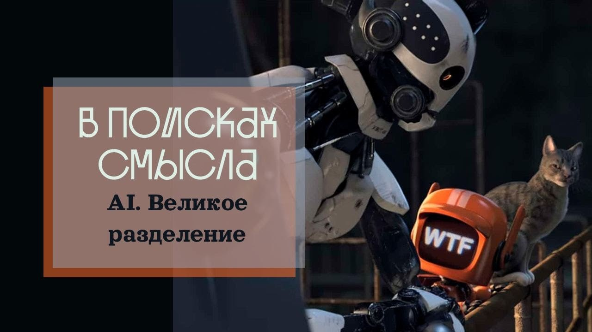

# AI. Великое Разделение

29 апреля 2023 [Аудиоверсия](https://paradoks-pinkera-pilotnyy-vypusk.simplecast.com/episodes/vr) 27:55

Продолжаем разговор о влиянии нейросетей на нашу жизнь сегодня и завтра.
Как и почему технологии AI создают кризис легитимности в рамках либеральной демократии?
Chat GTP поднимает планку требований творческим способностям человека.
Нейросеть ставит каждого перед выбором: либо погрузиться в сладостную дремоту в искусно созданном AI мире комфорта и грез, или становиться творцом своей жизни, выбирая духовную и эмоциональную дисциплину, труд познания, становясь человеком-творцом, человеком-созидателем, человеком способным выстраивать искренние эмоциональные связи с другими людьми.

**П.Щелин:**
Масштаб боли от этой техногенной революции будет в разы больше от техногенной революции, созданной паровым двигателем.

**Е.Голуб:**
Пришло время, когда человек будет вынужден становиться человеком, а не быть разновидностью высокоорганизованного животного.

**Е.Голуб:**
Здравствуйте, друзья!
Сегодня очередной выпуск подкаста Евгения Голуба и Павла Щелина «В поисках смысла».
Мы решили продолжить тему предыдущего выпуска, связанного с нейросетями и с их влиянием на нашу жизнь, тем влиянием, которое мы чувствуем уже сегодня и которое многократно сможем почувствовать во много раз больше в ближайшем будущем.

**П.Щелин:**
Да, не отпускает нас эта тема.
По итогам предыдущего выпуска почувствовали, что сильно недоговорили и решили продолжить.

**Е.Голуб:**
А начнем мы с политики, с конька политического философа Павла.

**П.Щелин:**
Я просто вкратце эту тему поднял в прошлый раз, но она, на мой взгляд, достаточно важная, чтобы акцентировать ее снова.
Дело в том, что в перспективе чат GTP убивает символическое обоснование модели либеральной демократии.
Оставим вопрос, что в реальности она не особо-то и работала, и на самом деле механизмы функционирования демократические, они работают по скорее теневому и непрямому принципу, но на уровне образов именно то, что я расскажу вам в дальнейшем, и составляло главный аспект, если угодно, демократического достоинства.

В чем суть либеральной демократии?

Суть в том, что свободные люди, обладающие независимой экономической ценностью, определенной экономической самодостаточностью, на самом деле, просто говоря, обладающие собственностью, очень важный момент, являются достаточным, независимым агентом, чье мнение должно быть услышано.
И без голосов этих агентов решение становится не полностью.
Другими словами, в самой модели либеральной демократии заложена связка между агентностью, то есть способностью принимать решения за свою собственную жизнь, и вашим политическим весом.
А как мы уже начали на прошлом выпуске, вот именно эту агентность для абсолютного большинства населения чат-GTP и разрушает.
В экономическом смысле и даже, возможно, в социальном смысле.

**Е.Голуб:**
Расскажи поподробнее, как именно он разрешается с твоей точки зрения.

**П.Щелин:**
Ну смотри, потому что, во-первых, экономический вызов.
То есть если роботы могут заменить человека в области производства технологического или машинного, эту проблематику фантасты обсуждали.
Но теперь мы, по сути, видим роботов, которые могут заменить человека в сфере услуг.
Не полностью, но в огромной части сферы услуг.
Тогда возникает вопрос.
Если человек становится не активным участником экономической деятельности в массе своей, то есть он находится на иждивении других, так или иначе, если он не обладает собственной собственностью, то есть не заложенной в кредит, а именно той собственностью, которую он обладает как носитель ее.
В рамках либеральной модели какой даже теоретический вес имеет его голос?

**Е.Голуб:**
Ты не слишком ли сгущаешь краски?
Какая-то часть людей по мере технического прогресса, развития теряет работу.
Машинисток сейчас ты уже не найдёшь.
Есть для этого принтер и компьютер.
Но ничего, небо на землю не упало.
Но сейчас какая-то часть людей переориентируется.
Почему вдруг прямо такие драматические изменения?

**П.Щелин:**
Не обязательно, что изменения наступят прямо сразу, но они наступят.
Наступят они потому, что это то, что называется кризисом легитимности.
Потому что в рамках либеральной модели заложено вот это ощущение самодостаточного свободного собственника, если ты помнишь, идет от греческого полиса, проходит через всю традицию американской демократии и доходит до наших дней, как вот этот образ, как некий идеал.
Чат GTP, он значительно сокращает количество возможностей для того, чтобы быть таким свободным самодостаточным собственником.

**Е.Голуб:**
Тогда я попробую так это для себя связать.
Ты говоришь о том, что масштаб влияния нейросетей на базу избирательную, на количество независимых и экономически самодостаточных людей будет несопоставим с тем, что мы видели до сих пор.
Потому что огромное количество тех работ, которые ассоциировались только с человеческим интеллектом, не подразумевалось, что они могут быть автоматизированы.
Эта работа не связана с трудом на конвейере.
Эта работа, которая всегда ассоциировалась с умственными усилиями, она может быть легко заменена или со временем заменена нейросетями.

**П.Щелин:**
И тут можно посмотреть с другой точки зрения, с другого угла.
В каком-то смысле демократия всегда является некоторым способом компромисса между элитами и населением.
И можно сказать, что степень успешности демократической модели пропорциональна тому, насколько элита в этом населении нуждается в услугах этого населения.
Я могу сказать прямо по-рыночному.
Так вот, чат-GTP значительно, качественно сокращает потребность элит в населении.

**Е.Голуб:**
Нас, видимо, очередной раз обвинят в теории заговора, о которой мы обязательно поговорим попозже.
Можно так понять, что есть некоторые элиты, есть все остальные.
И вот эти элиты манипулируют остальными для своих корыстных целей.
И мы сейчас как будто бы говорим о том, что с новым инструментом заинтересованность в манипуляции у них изменится каким-то образом.

**П.Щелин:**
Это даже не теория заговора, это просто здравый смысл.
В любом обществе всегда есть некая элита.
Это неизбежный момент.
И у них главным интересом является интересы своей собственной малой группы, иначе бы элитами они бы не стали.
Это никакая не теория заговора.
Теория заговора — это если бы я рассказывал, что у них есть какие-то репланы.

В данном случае чат GTP для них может быть той же самой новостью, которая для всех остальных, просто технология всегда подобна джину из бутылки.
Раз ее выпустив наружу, ты не загонишь ее назад, и она начнет сама влиять на происходящие процессы.
В этом плане есть великолепная книга Нейла Постмана, называется «Технополи», и он там подробно обсуждает базовый тезис, что технология не нейтральна.
Это огромное заблуждение, то, что мы склонны думать, что технология сама по себе обладает некой нейтральностью по отношению к ценностям.

И вот он там показывает на примере индустриальной революции, на отказы от технологий, условно говоря, типа арт, искусства.
То есть, когда искусство распространялось не только на картины, но на все.
Искусство делать карету, искусство делать стол, искусство делать доспех.
Это все называлось искусством.

Описывает вот переход от вот этого к production, к industry.
И вот показывает, что вот этот переход, он не был нейтральным.
Он повлек фундаментальным изменением ко всему.
От культуры до семейных моделей, до отношений между элитами и обществом.
Но это опять-таки очень зависит от этого.
То, что каждая революция в военном или экономическом деле влияет на методы взаимоотношения элиты с обществом.
Условно говоря, если элите необходимо для ведения боевых действий послушное, но достаточно образованное население, способное выполнять приказы, оно будет создавать ту школьную систему, в которой мы все с вами учились.

А тут, соответственно, качественно меняется запрос.
И под это изменение запроса нужны будут другие социальные модели, нужны будут достаточно другие политические модели.
То есть это даже не теория заговора, это простое наблюдение.
Теория заговора, повторюсь, будет позже, не в этом выпуске, а это просто наблюдение, которое мы должны осознавать, что технологические изменения подобного масштаба неизбежно приведут к фундаментальным изменениям в социально-политических отношениях.

**Е.Голуб:**
Поговорим теперь тогда немного о этих технологических изменениях.

Недавно вышел ролик в YouTube от известного медиа Wired относительно того, как 20 профессий люди тестировали нейросеть, GPT, относительно того, насколько этот искусственный интеллект, назовем это так, способен заменить их.
От повара и программиста до врача и, по-моему, пожарного, там 20 профессий.
Ну и там возникло такое достаточно парадоксальное впечатление.
Большинство говорило, что ну нет, ещё не может, никак без этого не обойтись, это всё ещё слишком слабо.
Но уже сейчас очевидно, что, во-первых, и люди были шокированы, удивлены.
И, во-вторых, самой технологии ещё без году недели.
И если уже сейчас мы задаёмся этим вопросом, то очевидно, что в ближайший год-два вопросы эти исчезнут.
И, соответственно, огромное количество творческих профессий будут вынуждены задавать вопросы, будут подвергнуты сомнению их ценность.
Вот как ты думаешь, действительно ли искусственный интеллект, нейросеть сможет полностью заменить творчество человека?

**П.Щелин:**
Вот здесь как раз есть некая тонкость.
Полностью, на мой взгляд, по крайней мере, в силу моего нынешнего понимания, он заменить человека не может.
Но он сможет заменить большинство, как мы уже говорили, псевдотворческих деятельностей.
Потому что, как мы уже обсуждали в предыдущем выпуске, именно комбинаторика, по сути, является сегодня основным методом творчества.
А ChatGTP является своеобразным краш-тестом для всей этой модели, для всей человеческой природы.
Потому что именно эта технология нейросети, огромного объема информации, делает ценным в творчестве только то, что, собственно, является творческим.
Или можно сказать, что делает ценное в человеке только, собственно, человеческое.
Как люди религиозные, я прямо скажу то, что это божественное.
То есть вот это подобие Бога.
То есть человек ценен, и он является партнером для нейросети только в той мере, в какой он является подобием Бога.
И тогда это резко просто поднимает планку требований к человеку.
В каком-то смысле это такой искусственный кнут и обстоятельство непреодолимой силы, которое, можно сказать, заставляет человека преображаться духовно.
В противном случае конкурировать с нейросетью он не сможет.

**Е.Голуб:**
Другими словами, инструментарий, который человек изобрёл или подготовил для себя, достиг такого уровня, когда возникает вопрос, нужен ли этому инструменту хозяин или человек, если он не является человеком в полном смысле этого слова.
С этой точки зрения, конечно, звучит замечательно.
Что тут скажешь?
Звучит здорово.
Наконец-то!
Аллилуйя!
Пришло время, когда человек будет вынужден становиться наконец-то человеком, а не быть разновидностью высокоорганизованного животного.
Но допускаешь ли ты, что все-таки может быть и другой вариант развития событий?
Я видел уже десятки приложений в Apple Store, десятки, которые предлагают все виды искусства и написать вместе с искусственным интеллектом, или он запишет текст, нарисовать картину, написать картину в любом стиле, речь создать и так далее, и так далее.
Мне кажется, что не нужно недооценивать и негативную сторону.

**П.Щелин:**
Я совсем ее не недооцениваю.
Я как раз думаю то, что масштаб боли от этой техногенной революции будет в разы больше от техногенной революции, созданной паровым двигателем.

**Е.Голуб:**
То есть человек станет перед выбором, да?
То есть каждый человек, личность, будет находиться перед выбором, в какую сторону пойти.
Либо идти в сторону комфорта и деградации наверное, и сейчас во многом выбор такой стоит.

**П.Щелин:**
Очень важно подчеркнуть, мы говорили в прошлый раз, это будет самый комфортный комфорт, это будет самая приятная деградация, потому что это будет бесконечное удовлетворение вашей нарциссической потребности.
В той мере, в какой никакая технология до этого не могла удовлетворить вот эту нарциссическую дыру в сердце человека.

**Е.Голуб:**
Объясни, пожалуйста, каким образом это будет происходить?

**П.Щелин:**
Ну, потому что чат GTP совместно с робототехникой может создать вам идеального партнера.
Даже элементарный момент, который только и будет заниматься тем, что удовлетворять вашу нарциссическую потребность, не требуя ничего взамен.

**Е.Голуб:**
Да, это важный момент.

**П.Щелин:**
Это как один из примеров.

**Е.Голуб:**
Мы говорили в прошлый раз, что написание чувственных смс-ок совершенно не истощает нейросеть, в отличие от любого молодого человека.
Точно так же, как удовлетворение прихотей капризного нарцисса, в общем-то, никаким образом не будет энергетически опустошать системы, продукты, искусственных партнёров, находящихся под управлением нейросети.
В этом смысле, да.
Так что, мы разделимся на эллоев и марлоков?
Или как это будет?

**П.Щелин:**
Ну, ты знаешь, я вот по ходу нашей беседы другое мне пришло скорее на люденов и остальных.
Если ты помнишь, у Стругацких было «Волны гасят ветер» произведение.
И там тоже, условно говоря, предсказано великое разделение человечества.

Судя по всему, чат GPT является одной из ключевой точек по вот этому некому великому разделению.
На людей, которые будут творцами, будут обладать необходимым уровнем психологической, эмоциональной, духовной дисциплины, без которого настоящее творчество невозможно.

И на остальных.

Я боюсь, что вот эта технология в данном ее виде, если она никаким образом не будет ограничена, а я сомневаюсь, потому что технологию ограничить пока что в истории нам ни разу не удалось, то да, мы будем двигаться в этом направлении, в эту сторону.

**Е.Голуб:**
Но можно ли сказать, что, скажем так, предыдущая история человечества, она предуготовила вот этот соблазн?
Фактически эмоции стали товаром уже достаточно давно.
Они вплетены в любой продукт.
И сейчас вот этот соблазн будет полностью удовлетворен или полностью можно будет приблизиться к идеальному миру своей уникальности через нейросеть.

**П.Щелин:**
О да, абсолютно.
Тут много разных вариантов.
Можно соединить нейросеть с метой.
Представь виртуальный мир, созданный нейросетью под каждого отдельного человека.

**Е.Голуб:**
То есть соединяем несколько технологий, включаем туда психологию раздражённую или растравленную нашим капиталистическим способом производства и экономики, которая воспитывает максимальный индивидуализм и максимальную жадность до внимания и успеха.
И вот тебе мирок, в котором ты можешь счастливо пробыть, сколько там биологической жизни у тебя есть.

**П.Щелин:**
Возвращаясь к первой теме, с какой стати у тебя должен быть голос по влиянию на события в реальном мире с точки зрения людей, владеющих этими технологиями?
Никакого.

**Е.Голуб:**
Зачем ты вообще нужен?
Что ты производишь, кроме тепла и отходов жизнедеятельности?
Для меня это вопрос, который непонятный.
Мне кажется, что в этом направлении развития человечества там одни тупики.

**П.Щелин:**
Ну смотри, опять не тупики.
Это скорее, для меня это не обязательно тупик, это скорее именно радикализация.
То есть просто вопрос ставится ребром.
Я тебе могу сразу сказать, какие сообщества абсолютно нормально переживут эту революцию и не заметят.
Какие-нибудь староверы в Сибири, амиши в Пенсильвании, менониты в Португалии, сообщество кооперативное Мандрагон в Испании и так далее и тому подобное.
То есть везде, где простроены глубинные настоящие социальные связи, где люди включены как люди, где они объединены неким духом, они эту революцию переживут вполне спокойно.
То есть те люди, которые сохраняют, повторюсь, себя человечество.
А вот массовое капиталистическое население городов, да, вот им будет плохо.

**Е.Голуб:**
Они просто не заметят, я так понимаю.

**П.Щелин:**
Они в эту игру играть не будут.
И более того, только такие люди для этой системы и будут ценными.

**Е.Голуб:**
Я хотел сказать об этом, да.
Они не повреждены всем тем, чем повреждены мы там с тобой, да.
Поскольку они имеют дело непосредственно с природой, с миром, с другим человеком.
И поэтому в них вот это человеческое развито максимально.

**П.Щелин:**
Говоря научно, в них развита компетенция построения настоящих эмоциональных связей.
Они умеют это делать.
И в них развита компетентность по, если угодно, мышлению.
То есть это действительно лишь биологическая разница.
Я думаю, если проводить нейротесты, мы увидим, что сами закономерности в работе их нейросетей в голове, условно говоря, качественно отличаются от той работы нейросети, которую обладают среднестатистические потребители интернета.
И вот как раз если вторую нейросеть GPT заменить может с легкостью, то я подозреваю, есть какие-то парадоксы в первом способе мышления, которые пока нейросети заменить крайне сложно.
Потому что пока что у нейросети одно принципиальное ограничение, она занимается комбинаторикой.
Нейросеть не создает принципиально новое.
Она создает предельно качественные компиляции.
Они очень качественные, но они компиляции.
Их можно именно разглядеть как компиляции.
Проблема в том, что большая часть из нас тоже занята компиляциями.
Повторюсь, в этом основной вызов.
То есть насколько вы способны творить новое, насколько мы с тобой способны творить новое, настолько мы и будем ценные в этом мире, наступающем нейросетей.

**Е.Голуб:**
Да, и здесь стоит отметить еще такой момент, что основной способ взаимодействия с искусственным интеллектом сейчас — это диалог, это речевая модель.
Ты задаешь вопрос, ты вступаешь в беседу.
И это значит, что качество разговора между людьми должно повышаться, иначе не будет смысла в этом общении.
То есть ты можешь с большей продуктивностью разговаривать с искусственным интеллектом.
Мы можем надеяться, вот мы затрагивали эту тему в прошлый раз, что исподволь вот это изменение приведёт хотя бы часть человечества к новому, более высокому уровню развития мышления и речевой культуры, навыков ведения разговора, аргументированного разговора и так далее.
Потому что тут не сбулшитишь, там вот эти все манипуляции и передёргивания с нейросетью не работают.
Она будет терпеливо и неэмоционально возвращать собеседника к сути вопроса.

**П.Щелин:**
Опять два варианта.
Либо она будет просто этого собеседника удовлетворять.
Беседа же бывает двух ипостасей.
Беседа бывает как исключительный способ интеллектуального самовыдовлетворения вашего эго.
То есть, когда вам просто нужно в беседе с собеседником услышать, насколько вы правы, насколько вы замечательны, и вместе убедиться в том, насколько неправы остальные.
И вот такого рода беседы, да, нейросеть заменяет очень просто.
Поэтому большая часть политических комментаторов на современном телевидении работы нейросетям лишится очень просто.
Будут простые цифровые аватары, которые будут выдавать правильные тезисы и неотличимы от всех остальных блогеров.
Это к вопросу о том, какие профессии можно заменить.
Вот 90%

**Е.Голуб:**
Там среди этих 20 была ведущая.
Так как по сути, по содержанию речи заменителя в нейросети искать было нечего, она обратила внимание, ну посмотрите, у неё же неестественно двигаются губы, мы видим, что очевидно, что не совпадают звуки и артикуляция, но это ещё типа это не работает.
Так что самое очевидное, что вопрос двух-трёх итераций апдейта системы.
Здесь сказать просто нечего.
Ну я сразу говорю, что на мой взгляд политических не только обозревателей, но и политиков, по большому счету, можно будет заменять GPT.

**П.Щелин:**
Демократических политиков.
То есть именно тех политиков, которые являются менеджерами.
Отдельная тема того, что политика не должна была быть менеджерством.
То есть политика и управление — это все-таки разные вещи.
Проблема в том, что в мире позднего капитализма эти вещи практически слились воедино, потому что политики обсуждают все угодное, кроме стратегически важных, сакральных вопросов, сложных вопросов и так далее.

**Е.Голуб:**
Ценностных.
И это вопросов выбора, вопросов тогда, когда нужно определить свою позицию и сказать там, кто ты, какой ты.
Они будут повторять какой-то набор общепринятых формулировок, но ничего не скажут о себе для того, чтобы их не уличили.

**П.Щелин:**
И именно политика такого типа нейросеть заменяет в разы лучше.
А вот политика настоящего, политика, которая либо играет во власти, либо занимается проблемами власти, либо политика, которая является производным от некой миссии, вот это нейросети будет заменить опять-таки крайне сложно, потому что такие люди опять-таки делают что-то новое и способны на то, что нейросеть, наверное, не до конца способна в полном объеме.
На ответственность личную за принятое решение.
Вот это очень важный момент, с чего нейросеть не может.

**Е.Голуб:**
И от чего всячески уклоняется сегодня, я говорю ответственно, как человек, который провел внутри корпорации не один десяток лет.
Профессиональный менеджер профессионально уклоняется от того, чтобы взять на себя ответственность за что-либо и артикулировать ясно какой-то не общепринятый тезис, сделать какой-то выбор.
И, видимо, нейросеть не оставит таким людям шанса.
То, что не может сделать нейросеть, она не может сказать, это хорошо, это плохо, это добро – это зло.
Я выбираю это и несу ответственность за такой поступок.

**П.Щелин:**
Вот это нейросеть как раз сделать не может.
Все остальное нейросеть сделать может прекрасно, в разы лучше.
Причем вот здесь чисто капиталистически, чисто рыночно.
Я гарантирую, что с точки зрения чисто рыночной капитализации нейросети действительно в нескольких итерациях будут показывать результаты в разы лучше, чем огромное большинство современных наемных менеджеров.
Только нейросети не надо платить денег и не нужны бонусы и опционы в вашей корпорации.

**Е.Голуб:**
Хотелось бы напоследок в заключении вот этого нашего выпуска сказать, что на мой взгляд очень мало кто сегодня осознаёт масштаб изменений, которые стоят перед нами, связанные с появлением настолько хорошо построенного интерфейса к нейросети.
То есть нейросеть — это изобретение не этого года, но выход нейросети к потребителю, к широким массам.
Только сейчас в сфере программирования появляются восхищенные возгласы о том, что, посмотрите, 11 центов, 3 часа.
У меня есть код, который бы потребовал двух недель и 5000 долларов.
А это будет внедряться, внедряться и внедряться.
И скоро приложений на основе искусственного интеллекта будет не десятки, а тысячи.
Скоро это все будет внутри игр, внутри любых наших бытовых помощников.

**П.Щелин:**
Да, это абсолютно.
Ты провел пример программистов, потому что это очень важный пример именно программирование воспринималось большинством людей как некая удобная гавань.
То есть буквально последние вот пять лет среди моих друзей и знакомых, извините за личные примеры, человек 10-15 сменило профессию.
Ушел в программисты и стал быстро получать огромные деньги.

Но проблема в том, что тот тип работ, которыми они занимаются, как раз нейросеть заменит.
В большем случае заменит очень быстро.
То есть даже это не становится удобной гаванью.

Зона академической деятельности.
Нейросеть заменит большую часть академиков.
Вот это я тоже абсолютно уверен.
Просто потому то, что большую часть академиков сегодня академической науки не занимается производством нового.

**Е.Голуб:**
То есть вся неэффективность, вся интеллектуальная чепуха, вся эта имитация, она должна будет неизбежно сметена, потому что будет простой, трезвый, неэмоциональный инструмент, который жёстко эффективнее будет.

**П.Щелин:**
Давай даже так, сметена в каком смысле?
Объем текста не изменится.
Ну, просто человек его писать не будет.
То есть она будет сметена именно на человеческом уровне.

Но, опять-таки, мне очень нравится пример, что, условно говоря, за последние 60 лет написана большая часть научных работ в гуманитарном знании, чем за весь предыдущий период истории человечества.
Но любой человек, который хоть немного занимался этими вопросами, он понимает, что ценности всех этих работ, они обратные.
Работы такого рода заменят нейросеть.
Вообще, без вопросов.

Потому что, условно говоря, простите, если кого оскорблю, но стандартную работу по gender studies нейросеть вам запишет вот так вот.
Просто сводными данными на основе уже миллиона работ, которые вы написали, подставя переменные.
Это вообще не проблема.

А это считается вершиной.
То есть общество ценило эти работы настолько, что человек вкладывал 25 лет успешного труда, огромных денежных инвестиций, чтобы получить эту компетенцию.
А теперь это будет делать машина за бесплатно.
Вот просто пример.

Это мы только копаем, показываем, вскрываем малюсенькие некоторые аспекты вот этих перемен, которые только нам в голову приходят через наш опыт.
Я подозреваю, что в вашем роде деятельности, уважаемые слушатели, вы легко придумываете свой вариант нейросетичного вызова, краш-теста для вашей деятельности, для юриспруденции, для маркетологов, для любого customer-facing job, что называется, то есть для любого общения с клиентами и так далее и тому подобное.

**Е.Голуб:**
Ну да, то есть можно представить себе, что вот появление смартфонов с камерами и с удобными интерфейсами для взаимодействия, со временем привело к просто радикальному изменению повседневной жизни.
Изменения, которые нас ждут, связанные с GPT, очевидно, будут гораздо более драматическими.
Они коснутся всех областей и непосредственно связаны с темой нашего разговора с поисками смысла.
Вполне возможно, что не обретя вот этот самый смысл своей жизни или не понимая смысл происходящего, человек скукожится до уровня личинки в какой-то скорлупе, которая им приготовит этот искусственный интеллект, и он там потихонечку, да.

**П.Щелин:**
Очень комфортной скорлупе, очень важно подчеркнуть.
Эта скорлупа может быть предельно комфортная.

**Е.Голуб:**
И истлеет там, и в конце концов вот такого рода личинка и останется.
А те, кто выберут другой путь, вылупятся во что-то большее.
Но этот выбор будет безжалостным, беспощадным, и от него будет не уйти, и пропетлять уже не удастся, как петляют сегодня множество людей в псевдо-творческой, псевдо-интеллектуальной деятельности.

**П.Щелин:**
Это приведет к социальным потрясениям.
Это уже начнет приводить к социальным потрясениям в этом году такими темпами.
Мы видим волну увольнений в Фейсбуке, мы видим волну увольнения в Гугле, мы увидим еще гораздо больше волну увольнения в тех областях, которые считались защищенными.
Социальные потрясения неизбежно приведут к политическим потрясениям, полноценным.
Потому что придется входить в новый мир, придется создавать новые системы политических отношений для регуляции новых социальных отношений.
И это, повторюсь, все будет происходить очень быстро.

**Е.Голуб:**
На наших глазах произойдет.

**П.Щелин:**
В этом смысле можно сказать, наверное, что чат GPT является одним из всадников апокалипсиса.

**Е.Голуб:**
Ух ты.

**П.Щелин:**
Ну смотри, если мы рассматриваем апокалипсис просто как мета-символическую модель любого качественного эпохального перемены из одного этапа, условно говоря, в некий другой этап, то всадники в этой метафоре являются просто теми факторами, которые обстоятельствами непреодолимой силы, которые делают старый образ жизни невозможным и заставляют переходить в новый образ жизни.
Обычно в истории такими вещами как раз и являются болезнь, война, технология, революция.

**Е.Голуб:**
Попробуем завершить всё-таки на несколько более позитивной ноте, потому что всё-таки есть надежда, что эта технология будет принуждать, стимулировать человека быть более человеком, чем предыдущие технологии, которые, казалось, его превращают в какой-то придаток.

**П.Щелин:**
Она будет одновременно делать обе вещи.
Это к вопросу о свободе воли и выбора.
То есть она одновременно будет делать максимально комфортный выбор в пользу вещи, потому что именно..
Я тебе скидывал книгу Несмелого «Абсолютное счастье как достижение точки абсолютного комфорта».
Ничто лучше не продвигнет в сторону вот этого материалистического понимания счастья, чем чат GPT.
Но именно же он одновременно делает предельно ценным то, что раньше удавалось симулировать или заглушать спамом в цивилизации позднего капитализма.
То есть в этом, наверное, вообще истинная суть вызова, то, что оба этих процесса происходят одновременно, и вопрос, в какую сторону двигаться лично вам, решаете лично вы.
И ответственность на вас, ваш выбор.

**Е.Голуб:**
И свалить ни на кого не удастся.

**П.Щелин:**
Да, свалить ни на кого не удастся, поэтому к позитивной программе срочно начинаем все коллективно инвестировать в человеческое в человеке, в наши духовные способности, в наши духовные практики, в нашу способность различать добро и зло, хорошо или плохо, в нашу способность нести ответственность за этот выбор, в нашу способность думать, в нашу способность говорить.
То есть именно беседа становится ключевым навыком в мире чата GPT.
А этот навык мы практически потеряли, потому что мы разговарить друг с другом особо-то не любим.
Все смс-ками и голосовыми сообщениями обмениваемся, вместо того, чтобы встретиться лицом к лицу с человеком и провести с ним вот это глубинное погружение, создать среду, в которой может родиться что-то новое.
А именно это становится самым ценным.
Соответственно, ищите людей подобных вокруг себя, создавайте людей подобных вокруг себя.
Объединяйтесь по этому признаку.

**Е.Голуб:**
И как один из признаков этого будущего комьюнити, мне бы хотелось видеть наших слушателей в сообществе тех, с кем можно общаться свободно, открыто и продуктивно.
Где целью будет совместный поиск истины, а не удовлетворение каких-то нарциссических потребностей.

**П.Щелин:**
Не нарративная война, не нарративное погружение, а поиск истины.
Здесь будущее есть.

**Е.Голуб:**
Аминь.

**П.Щелин:**
До новых встреч, уважаемые слушатели.
