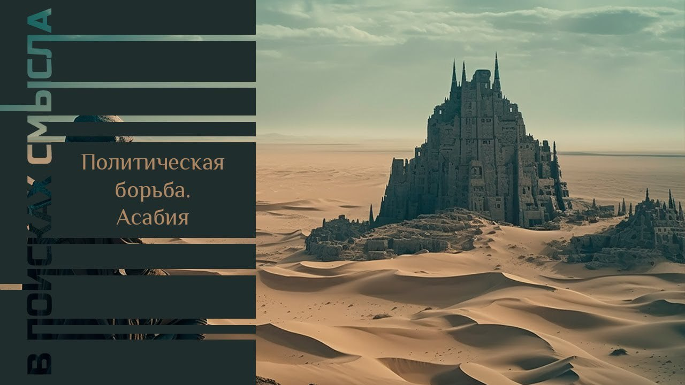

# Политическая борьба. Асабия

08 октября 2023 [Аудиоверсия](https://paradoks-pinkera-pilotnyy-vypusk.simplecast.com/episodes/asabiya) 31:43

Почему одни группы носителей политической идентичности приобретают власть, а другие теряют?
Что роднит Дом Харконенов, дом Ланнистеров, российских большевиков и украинских националистов?
Поговорим о понятии асабия, сформулированном великим арабским историком и философом XIV века - Ибн Халдуном, которого считают отцом социологии и исторической науки.

**Е.Голуб:**
Здравствуйте, друзья!
В эфире четвёртый выпуск второго сезона подкаста «В поисках смысла» у микрофона Евгений Голуб.

**П.Щелин:**
И Павел Щелин.

**Е.Голуб:**
Сегодня мы продолжим разговор о политической идентичности.
Речь пойдёт о некоторых загадках и тайнах.
И мы от сравнительно недавнего прошлого обратимся несколько вглубь веков.
В какие века мы сейчас погрузимся?

**П.Щелин:**
Мы уходим в средневековье, причем в средневековье арабского мира, причем, если быть точнее, от Северной Африки до Египта.
Суть в том, что сегодня мы будем говорить о некоторых открытиях и наблюдениях, сделанных одним из величайших политических теоретиков Ибн Хальдуном.
Это такой вот арабский исследователь.
Мало известен в западной культуре относительно, в то время как на арабском Востоке считается основным теоретиком вообще того, чтобы мы называли политологией.

Но нам он будет тоже интересно и очень полезен, потому что в силу крайне интересной биографии человек.
Он же, он сначала пытался практикой заниматься.
Полжизни вот этой политической борьбы, советниками, а под конец именно написал мощный основательный трактат, который называется «Введение Мукадима», то есть это вообще введение в такую науку, то есть он себя историком считал, в каком-то смысле.

И, соответственно, в этом трактате сделано несколько ключевых наблюдений о природе политических идентичностей, о природе власти и о том, что в ней есть сущностное, а то, что наносное, я бы сказал.
Для нас интереснее момент в том, что Хальдун позволяет нам вычленить, с одной стороны, то, что является именно такой тайной загадкой той самой реальной политической идентичности.
Почему возникает желание эту загадку, каким-то образом создавать из нее иллюзию искусственную?
Почему это работает и почему это не работает?

**Е.Голуб:**
Это о каких веках идет речь?

**П.Щелин:**
14-15 века.

**Е.Голуб:**
Неужели он использует терминологию политическая идентичность?

**П.Щелин:**
Нет, но он говорит о других вещах.
Он использует очень оригинальную терминологию, но ты поймешь по ходу нашей беседы, что какое это имеет к нему отношение.

**Е.Голуб:**
Хорошо, здорово.
Странно, что я не слышал это имя никогда до встречи с тобой.

**П.Щелин:**
Поверь, не я его открыл, конечно.
Он используется, по крайней мере, в русскоязычной среде есть несколько авторов, которые пытаются его немножко популяризировать.
Но да, не самое популярное имя, это правда.
Тем не менее, будет нам полезен.

**Е.Голуб:**
Давай погружаться в идеи Ибн Хальдуна.

**П.Щелин:**
Он тоже начинает с определённой самоочевидности.
Феномен, который занимал мышление Хальдуна, это то, почему одни приобретают власть, а другие власть теряют.
Он прожил достаточно длительную жизнь, и он наблюдал некий определенный цикл, специфический для того региона в каком-то смысле, но в то же время базовый для всей политической жизни.
То, что, условно говоря, из пустыни или извне приходит некая группа, которая захватывает какое-то поселение, какую-то территорию, власть, можно так сказать, власть-племя, новое приходит, захватывает эту самую власть, а потом через несколько поколений этот цикл повторяется.
Эта группа власть теряет, и новая группа приходит на ее смену.

Можем сказать, в каком-то смысле Хальдуна интересовала проблема политического цикла.
Он задавался вопросом, что же является той силой, той загадкой, той энергией, которая позволяет этому процессу осуществляться.
Другими словами, что обеспечивает захват политической власти по Хальдуну.
Вот этот вопрос его интересовал и как практика, и как теоретика.
Так вот, ответ Хальдуна был очень интересен.

Его основное и самое, это то, чем он известен больше всего, наблюдение, это арабское слово «асабият» или «асабия», которое на английском традиционно переводится как «group feeling», а по-русски, наверное, это лучше всего перевести как некое чувство сплоченности.
Или, можно сказать, внутренней спайки, чувство внутренней солидарности.
Понимаешь, да, уже, почему это будет тесно связано с проблемой идентичности?

**Е.Голуб:**
Групповая идентичность просто звучит в этом.

**П.Щелин:**
Да, но дальше будет очень много нюансов.

По Хольдуну это именно такое свойство групповой идентичности, очень важно.
Он не говорит об идентичности, он говорит о том, то, чем она ценна.
А именно вот этой способностью, в силу чувства внутренней сплоченности, быть эффективней, сильнее, жестче, более мобилизованней, чем ваши политические конкуренты.
И именно благодаря этому свойству, доверию по-хорошему, внутри группы, готовности жертвовать собой друг за друга внутри этой самой группы, вы и захватываете политическую власть.

По Хольдуну, то есть дальше вступает идея о том, что он очень много размышлял на тему географии, природа очень сильно влияет на это самое чувство.
По Хальдуну жители городов и поселений принципиально в силу своих естественных причин этим асабиятом обладают очень на маленьком уровне.
Городская жизнь, цивилизованная жизнь расхолаживает, развращает.
Там люди незакаленные, жертвовать собой не готовы, лишения терпеть не готовы, голод терпеть не готовы.
И так далее.

Очень много таких критериев в размышлении о том, что влияет на, условно говоря, уровень вот этой самой асабии.
И вот по нему, городская жизнь, цивилизованная жизнь, она условно эту потенцию очень сильно понижает, в то время как вот жизнь в пустыне закаляет, делает из людей борцов, и, соответственно, вот эти накаченные люди с высоким потенциалом асабията, когда они сталкиваются с городскими жителями, те, условно говоря, проигрывают в этой политической борьбе.
То есть вот у него такой контекст размышлений.

**Е.Голуб:**
Похоже на вот это известное высказывание о том, что там в третьем поколении расслабляется сообщество и теряет власть.

**П.Щелин:**
Вот это как раз из Хальдуна.
У него по циклу каждая династия, то есть династия — это скорее правящее племя, вот в его контексте, то, что он имел в виду, проходит четыре цикла.
Это очень важный момент, и именно связано с асабиятом.

Очень важно нам с тобой понять, что по Хальдуну вот это чувство, оно эффективно рождается только внутри кровно-родственных связей или чего-то, что эти кровно-родственные связи имитирует, но в таком на практическом уровне, то есть это похоже на римский принцип клиентелы.
То есть отношение патрона к клиенту.
Расширенное племя.
Кровно-родственные расширенные связи, включая зависимые отношения, которые находятся в зависимости, которая, тем не менее, является достаточно сильной, чтобы побудить к действию.
Почему Хальдун об этом думает?

У него, опять-таки, размышления очень практические.
У него идея состоит в том, что те, кто не обладают такими связями, редко чувствуют, то есть, можем сказать, атомизированные индивиды, немножко переводя его на современный язык, не обладают чувством любви и привязанности к своим собратьям, к тем, кто их окружает.
И в случае, если опасность находится в воздухе, например, накануне битвы или в условиях кризиса, прежде всего, накануне битвы, они, скорее всего, сбегут.
Будут спасать свои шкуры, потому что они знают, что рассчитывать кроме самих на себя им не на кого.
Поскольку они не могут опереться на расширенные связи, то единственная их ценность является их сама жизнь.
И, соответственно, они не будут ею рисковать, они сбегут.
А тем самым асабият разрушается.

Потому что только в коллективном действии, в коллективном асабияте ты можешь реально бороться за власть и преодолевать кризис.
Вот это такая идея состоит Хальдуна.
И это очень интересная штука.
Как называет он такую вот эту группу с сильным асабиятом?

Это очень интересно.
Потому что это понятие, оно арабское, но мы можем найти интересные аналоги в массовой культуре вплоть до современной и начиная с самых древностей.
Он называет это байтом.
Байт, бейт по-русски это дом.
То есть, скажем так, элитная группа, спаянная крепким вот этим чувством асабии и обладающая памятью о, соответственно, своих предшественниках и прочих, это дом.

И мы сразу вспоминаем знаменитый «Дом Харконенов» в «Дюне» или «Дом Атрейдесов».
Заметь, вот это, когда я читал, у меня прям почему-то сразу все вспыхнуло.
И это очень интересно выражает вот этот феномен даже этого фильма «Дюна» современный, вот эта эстетика.
Или «Игра престолов» с ее тоже, заметь, «Домами», «Дом Ланнистеров», «Дом Старков».
В каком-то смысле, мне кажется, они попадают в подсознательную вот эту на уровне эстетики тоску людей о такой группе, которой они были бы частью.

**Е.Голуб:**
О такой общности, глубокой, большой семье, объединенной безусловной лояльностью.

**П.Щелин:**
И в этом есть эстетика.
Заметь, чувствуется на эстетичном уровне вот эта вся эстетика дома, то есть как бы эстетика линии, эстетика силы.
И заметь, во всех этих историях вот этот как раз элемент силы, элемент асабията очень чувствуется.
Очень как раз чувствуется, что дом распадается, когда внутри него пропадает спайка.

Здесь Хальдун как раз нам очень интересен, потому что, несмотря на то, что писал он очень давно, как мы видим, вообще ничего принципиально на этом уровне не изменилось.
Ты абсолютно эту спайку видишь.
То есть она проходит.
И эстетически мы ее видим.
Подсознательно, мне кажется, очень многие готовы были бы с удовольствием сегодня стать снова частью такого дома.
Условно говоря, вместе скандировать там Атрейдесы, Атрейдесы или прочее.
То есть это завораживает.

Сегодня мы живем в обществе, для которого это ушло в большей части в средства культуры.
Для простого человека это находится вот в средствах там мифа, культуры, образа, сказки.
Но власть до сих пор так и функционирует.

Хальдун очень находится, безо всяких иллюзий.
Он считает, что власть любая реально существует только по родоплеменному признаку.
Здесь он, в принципе, ничем не отличается от, допустим, римского подхода, который мы с тобой, ну, не в рамках подкастов, но на YouTube тоже обсуждали, что реально патрицианские роды — это роды, которые объединены кровнородственными связями и живут на земле.
Являются владельцами собственности, условно говоря, того или иного политического сообщества.
Но параллели проводятся однозначно.
Условно говоря, тоже род, который обладает памятью, политическими амбициями, внутренними спайками на основе кровно-родственных отношений либо клиентских отношений.

**Е.Голуб:**
Ну, клиентские отношения — это тоже своего рода родственные отношения.
Фактически они напоминают очень близко.
Патрон как патро, как отец, как старший.
Клиент, как младший родственник, как зависимый член семьи.
И фактически это просто большая семья.

Интересно, сразу набегает много мыслей в голову о том, что на сегодняшний день в силу нашей атомизации вот те, кто способен создавать такие дома, они получают всю нерастраченную энергию человека.
Сразу жизнь человека обретает смысл, он обретает систему координат, преданность клану, роду, дому.
Думая об этом сейчас, я думаю, здорово, это дало бы мне ощущение силы, это дало бы мне ощущение защищённости, чего сегодня так людям не хватает, уверенности.
Да, те, кто способны такое гарантировать, предоставить или создать хотя бы ощущение, могут дойти далеко в деле получения власти.

**П.Щелин:**
Так что это к вопросу о том, что в истории реально ничего не меняется, потому что человеческая природа не меняется.
Но Хальдун идет дальше.

Он очень критичный, опять-таки, потому что он за жизнь насмотрелся столько всего всякого, что у него каких-то иллюзий не было вообще.
И он прямо говорит об отношениях, если угодно, формы и содержания.
Потому что он видел очень много домов, которые очень родовитые, престижные и прочее, которые были уничтожены, провалились полностью и так далее.
И поэтому он радикальным образом всегда подчеркивает то, что первично именно содержание, а не форма.
Дословная цитата.

> Но вот эти родословные...

Он называет это "тедегри", то есть родословные.

> ...полезны только в той мере, в которой они приводят в жизнь чувство сплоченности, которое является следствием кровно-родственных связей.
> И в конечном итоге, которое ведет к взаимной помощи и привязанности.

**Е.Голуб:**
То есть это не должна быть имитация, это должна быть реальная живая энергия, связь, поддержка.

**П.Щелин:**
Да.
Это принципиальный вопрос, потому что это главный вопрос, который, на мой взгляд, где Хальдун становится реально актуальным для всего нашего современного понятия, в том числе и понятия национальной идентичности.
Сейчас мы к нему перейдём.
Хальдун об этом не писал, это уже будет мое размышление, но сначала нужно зафиксировать, что по Хальдуну вот эта вся эстетика дома, идея дома, идея группы — это все вторичное от ее способности к действию.

Если ваша группа не обладает способностью к действию, он делал акцент на действии как на борьбе за власть, ну, тем не менее, но мы можем представить в целом, в широком смысле действия.
Действия как взаимопомощь и взаимная привязанность, то есть готовность к совместному вот этому коллективному действию.
Вот в той мере, в какой вы к этому не способны, все остальное вообще не важно.
Телега и лошадь.
Очень важный момент.
То, что для Хальдульна первично именно это.

А дальнейшее — это именно раскрытие того, как это может быть оформлено, представлено во внешнем образе.
И это очень важно, потому что здесь, например, Хальдун спорит с другим современным философом Аверойсом.
Был такой, может, слышал.
Он более известен немножко.
И тот, например, писал о том, что престиж принадлежит к людям, которые являются древними поселенцами в этом самом городе.
То есть, по сути, патрициям.
Аверойс говорит, что престиж принадлежит патрициям.
И, соответственно, от этого выстраивает, условно говоря, как должно быть организовано управление.

Хальдум гораздо более четко говорит о том, что важно не это само по себе, а именно дееспособность.
Он так иронично шутит, что если человек принадлежит группе, которая просто долго живет в этом городе, ему нисколько не поможет, если эта группа не такова, что ее боятся остальные и слушаются ее приказов.
Назовём это так.
То есть природа власти.

И здесь он, по сути говоря, спорит с вот этой проблемой аристократии истинной и аристократии ложной.
Да, любая власть всегда будет организована по родовому принципу.
Но это не значит, что любой род реально может обладать властью.
Или хуже того, род, который властью обладал, эту власть тоже может потерять.
Просто проблема в том, что это всё очень сложно отслеживать, наблюдать и замечать.

**Е.Голуб:**
Выражаясь математически, это необходимо, но этого недостаточно.
Наличие таких родовых связей, названия домов.
Необходимо обладать потенцией некоторой.

**П.Щелин:**
Да, асабия.
Первична ваша способность к действию.
Ну, то есть действие может быть разное.
В контексте борьбы за власть, он говорит, это то, чтобы внушать в других страх.
Он очень цинично относится к человеческой природе, в каком-то смысле ближе к гобсианскому.
То, что человек человеку, то есть его нужно принуждать.
У него в этом смысле идет гобсианская идея.

Но с точки зрения практической очень понятно.
Если ваш дом не может заставить другие слушаться, то он не политический дом.
Это значит, он слабый дом.
У него вот такая идея.

**Е.Голуб:**
То есть амбициозный, харизматичный и властолюбивый лидер должен создавать вокруг себя отношения, близкие к отношениям рода, даже если это не его прямые родственники.
Но такого рода отношения, даже будучи имитированными в какой-то степени, они создают у людей ощущение этой спайки.

Но без такого харизматичного, властолюбивого лидера или группы лидеров, ну, скорее всего, подчинённых, в отношении какой-то подчинённости лидер должен быть один.
Такой род, он не будет устойчивый или жизнеспособный.

**П.Щелин:**
Да, и по Хальдуну это, кстати, неизбежно.
По Хальдуну любой род обречен на четыре этапа цикла.

Первое поколение власть захватывает, и оно этой спайкой обладает.
Здесь он берет контекст именно из берберов.
Он говорит, вот племя, оно пришло из пустыни.
Им не надо это объяснять.
Это очень важный момент.
Он говорит, им вообще вот эти все вещи объяснять не надо.
Они этим живут.
Они как бы этим дышат.
Им ничего не надо объяснять.

Второе поколение, им нужно объяснять.
Но у них перед глазами живой пример.
Они это все считывают от отца.
Но уже сами этим по дефолту не обладают.
Но относительно успешно могут это имитировать.

Третье поколение уже копируют с копии.
И оно уже, по сути говоря, почти полностью лишается этого асабията.

И к четвертому полностью вырождается, потому что там остается только память и миф, а теряется живое чувство, живая способность.
Вот у него была очень такая жесткая...

**Е.Голуб:**
Живой опыт вот этого выживания плечом к плечу, локоть к локтю.

**П.Щелин:**
Да, и остается только имитация.
По Хальдуну это неизбежный процесс, а потом приходит следующее племя из пустыни, и, соответственно, это все стирает.

**Е.Голуб:**
Сносит потомка в предыдущем.

**П.Щелин:**
Да.
И в той или иной мере этот цикл, в принципе, справедлив.

**Е.Голуб:**
Ну хорошо, а если перенести это рассуждение на современную почву, что у нас получится?

**П.Щелин:**
Элитные группы.
Это смена элитных групп.
Условно говоря, у тебя приходит элитная группа, которая власть реально получает в борьбе.
И она сильная, крепкая, и она вот жесткая.

Я тебе скажу, идеальный пример цикла Хальдуна — это Советский Союз.
Он даже хронологически ложится идеально в Советский Союз.
Вот у тебя приходят большевики первые, да, и ты видишь вот этот асабият.
Вне зависимости от того, как ты к ним относишься, но вот это чувство спайки, насколько вот эта вся их готовность, это все безумные фанатики.
Но безумные фанатики обладают прекрасным чувством спайки по Хальдуну.

**Е.Голуб:**
Да.
Партия превыше всего.
Старые партийцы, верность партии.
Партия была таким домом.

**П.Щелин:**
Да.
А второе поколение это сталинское.
Вот этот период с 30-го по 40-й, ты видишь, это уже скорее имитация того что было.
Во-первых, еще многие живы из первого поколения.
Во-вторых, это относительно сильно и неудивительно в этот момент происходит, в том числе в культуре, обращение к высоким идеалам.
Вот этот балет, высокий стиль, вот это все.
Это как раз по Хальдуну всегда является прерогативой второго поколения.

Третье поколение — это брежневская эпоха.
На первое место выходит уже комфорт.
Третье поколение по Хальдуну хочет комфорта.
Вот они хотят комфорта, машин, дач.
Ну, по-современному, мы сказали, происходит номенклатуризация, если тебе угодно.
Но вот это обрастание вот этими чешскими сервантами и прочее и так далее.
Вот оно идеально ложится по Хальдуну.
Они власть сами-то не получали в той борьбе, в какой получало первое поколение.
Она им свалилась.

Ну и, соответственно, финальный этап — это 80-е.
Вот это «Американ бой, уеду с тобой» — это уже моральная деградация и вырождение.
По Хальдуну то, что происходит, неизбежно.
Группа Воровайки и прочее, прочее, прочее.

На современном примере Советский Союз — это идеальный опыт, если угодно, такого цикла Хальдуна.
Здесь еще есть одно интересное наблюдение, которое мне очень важно из Хальдуна было вычленить.
Он говорит о другом еще.
Почему жители пустыни обладают как бы лучшими, вот этой потенцией или пассионарностью, можно еще вот это такое приводить, чем жители городов?

Потому что ими правит другой закон, а точнее им не правит организованный закон.
Критерии их закона — это выживаемость.
То, что способствует выживанию хорошо, то, что способствует вымиранию плохо.

В то время как любой житель города, он находится под ярмом закона.
Хальдун очень четко подчеркнул очень интересную вещь, что любой закон, он в каком-то смысле содержит в себе элементы рабства и оскотинивания человека.
С одной стороны, он подавляет волю, по Хальдуну в том числе.
Здесь мы вспоминаем Ницше.
По сути говоря, он подавляет вот этот элемент сильного сверхчеловека через свое законодательство, то есть в массах.

**Е.Голуб:**
Ну, то есть внутренняя мотивация заменяется внешней.

**П.Щелин:**
Абсолютно.
И более того, самых сильных закон реально сильно может подрезать.
Альфа самцов, на самом деле, закон очень сильно может подрезать в культуре, если они не принадлежат к мощному роду.
Очень важный момент по Хальдуну.
И, в принципе, оно так и происходит.

А с другой стороны, этот самый закон в этих самых массах создает рессентимент, современными словами.
Потому что люди интуитивно чувствуют, что они вынуждены постоянно подчиняться и не могут до конца реализовать свой потенциал.
Но по Хальдуну это неизбежно.
Хотите цивилизованной жизни в городе, у вас это будет.
Без этого не вариант.
Кроме единственной альтернативы, которую он так косвенно совсем описывает, не ударяясь в подробности.
Знаешь, какая альтернатива единственная современными словами?

А это самая живая вера Ортега-и-Гассета, которую мы с тобой обсуждали.
Религиозное чувство в человеке, которое сильное.
Не имитация религиозного чувства, а настоящая живая вера.
Тот религиозный закон, который в человеке настолько силён, что он регулирует его поведение.
И не в силу того, что это норма, не в силу того, что это традиция, потому что человек в это настолько верит, что он через это саморегулируется.

**Е.Голуб:**
Но как эта живая вера может возникнуть в разлагающемся обществе всякого рода имитаций?

**П.Щелин:**
Правильно.
И дальше начинается период имитации.

Но тем не менее это важно отметить, потому что если нам будут задавать вопрос, где выход, но выход на самом деле косвенно там же, где в наших с тобой постоянных размышлениях.
Только в живой вере.
Условно говоря, в такой вере, которая самодостаточна для человека для того, чтобы быть мотивом для действия.
Вот такая вера.

Не вера как культурный феномен, а вера, которая определяет вашу структуру мотивации, только благодаря которой вы делаете.
Только такое общество может в теории, не факт, что еще получится, но в теории только так общество сможет пройти между вот этими двумя в каком-то смысле очень грустными ловушками.
В пустыне нам вряд ли жить хочется, и цивилизация, мы любим культуру, и нам нравится.
Очень важная тоже другая проблема, то, что вот эти пассионарные люди, они культуры не создают, по Хальдуну.
Это тоже очень важный момент.

Вот эти все суперкрутые жители пустыни, свободные люди, культуру-то они не создают.
Культуру создают вот эти горожане.
Это тоже большая взаимосвязь.
Горожане власть плохо брать умеют и воюют сильно хуже, но хоть они создают культуру, ремесла, науки и так далее.
Это вот постоянный, условно говоря, обмен, если тебе угодно.
По Хальдуну это все находится в таком состоянии постоянного трейд-оффа.
Вы не можете иметь все и сразу.

Но вот единственный путь к тому, чтобы иметь все и сразу, на мой взгляд, это как раз, условно говоря, цивилизация, созданная из людей с горящей живой верой.
Вот в теории.
Такой, по крайней мере, из прочтения Хальдуна рождается потенциальный вывод.

**Е.Голуб:**
Это интуитивно понятно, когда речь идет о том, что из нужды и необходимости выживать, сплочённое сообщество в поисках лучшей жизни завоёвывает оазис цивилизации с разнеженными жителями.
Очевидно, что они присваивают себе плоды культуры, которые могут развивать уже потомки завоевателей.

Но я всё-таки не могу понять, чего вдруг у них должна образоваться живая вера, если продолжать этот цикл?

**П.Щелин:**
Это акт провидения.
Он мусульманин, он там пишет о сподвижниках пророка.
В них она горела, условно говоря.
Он пишет, что им объяснять ничего было не надо тоже.
Она в них просто горела, этот религиозный закон.
У него какая проблема, его тезис?

Любой закон, по сути говоря, оскотинивает и кастрирует человека, но вот он говорит, есть кейс - сподвижники пророка, в которых такого мы не наблюдали.
Наоборот, они были настолько крутыми, что закон их только вдохновлял и вел вперед.
И он говорит, что только тот закон, который рождается, по сути, из глубокого внутреннего религиозного чувства, может избежать проблемы оскотинивания.
Вот просто его наблюдение.
Что имеет прямое отношение к нашему, повторюсь, выпуску "Рабство и свобода".
Это вот как раз в ту же самую категорию.
На самом деле, имеет самое прямое отношение.

**Е.Голуб:**
Условно говоря, если мы хотим вылечить сообщество, обречённое на разложение в силу вот этих естественных законов, открытых или описанных Хальдуном, то мы должны были бы, по идее, привить ему искреннюю веру каким-то образом, рассуждая технически или технологически.

**П.Щелин:**
Это единственный теоретический возможный сценарий, назовём это так.

**Е.Голуб:**
Искренняя вера поддерживала бы тот огонь единения, миссионерства, прозелитизма, который бы вот эту, как ты говорил, сплочённость...

**П.Щелин:**
Асабият.

**Е.Голуб:**
Асабию удерживал.
И в этом смысле ислам с его поддержанием этого огня веры получается наиболее что ли, последовательная религия?

**П.Щелин:**
Ну, стратегически они очень сильно, да, они до сих пор очень сильно стараются этим заниматься, но тоже, они тоже ударяются в имитацию.
Хальдун уже пишет там через семь веков после пророка, и он тоже видит, что тоже все скатывается в имитацию.
Здесь просто наступает вот эта проблема имитации.

Возникается в том то, что любое организованное сообщество стремится в себе эту асабию имитировать.
Не имея возможности ее получить от природы, оно начинает пытаться играть в имитацию.
И вот это дальше наступает неизбежная проблема.
И здесь мы переходим уже к размышлению по мотивам Хальдуна о том, чем тогда может являться модерн, и что такое национальное государство, имитация чего?

Тогда получается, что в терминах Хальдуна модерн — это, по сути, взятие механизма вот этого дома родства и перевод его в полную виртуальность воображаемого сообщества, которым пишет Бенедикт Андерсон, национального государства.
По задумке, условно говоря, чувства, которые должен ты испытывать при фразе «я украинец», примерно те же, что ты говоришь: я Дом Атрейдесов, или Харконенов, или Старков, и неважно кого.

**Е.Голуб:**
Ну да, это, конечно, первое, что приходит в голову.
Фактически, если задать вопрос человеку, увлечённому своей национальной идентичностью, что, собственно, я и делал, о том, что такое нация, первое, что отвечает такой человек, это большая семья.
Мы члены одной большой семьи.

Все, кто со мной разделяет это чувство, мои братья, мои сёстры.
Получается, что, наверное, неосознанно или осмыслив это по-другому позже, вот эти национальные государства и создают эти некие новые национальные дома.

**П.Щелин:**
Они пытаются.
Вот здесь наступают две принципиальные проблемы.

Первое.
По Хальнуну дом проистекает из вот того, что мы с тобой обсуждали в первом выпуске, из реальности данной в ощущениях.
То есть кровно-родственные связи, которые реальны.
Борьба, которая реальна.
Необходимость к действию, которая реальна.
А нация — это метафора на эту тему.
Это виртуальность.
Это то, чего нету в ощущениях.
И в этом создает проблемы.
Это необходима виртуальность.
И это, соответственно, необходима иллюзия.

Здесь отдельно нужно будет говорить про государство Томаса Гоббса в одном из наших выпусков, который имеет к этому прямое отношение.
Но, тем не менее, вот эта проблема.
То есть это изначально является симулякром.

**Е.Голуб:**
Но ведь вот эти все дома, о которых мы говорили, они же тоже имитировали семью.
На самом деле большой дом не является семьей в таком смысле слова.

**П.Щелин:**
Правильно.
Они являются расширенной семьей.
Все равно там есть реальность, данная в ощущениях.
Ты этого патрона прийти и пощупать можешь часто.
Там есть феномен аудиенции.
А главное, есть феномен более важный.
Недаром я с этого заострил внимание в начале нашего разговора.
Есть проблема действия.
То есть эти дома реально действуют.
А как нация действует?

**Е.Голуб:**
Через политическую элиту, через тех, кто берутся представлять ее.

**П.Щелин:**
Да, и вот начинается вот эта вся история с представительством, которое тоже является необходимой шизофренической манипуляцией, потому что в реальности действуют вот эти кровно-родственные группы внутри нации, но не сама нация.
Нация действовать не может.

**Е.Голуб:**
То есть внутри дома нация есть несколько домов, которые представляют собой какие-то группировки, элиты, и уже внутри этих домов, дома ведут свою борьбу в поле нации.
Присваивая себе то одна, то другая, право эту нацию представлять и призывая остальных сплотиться вокруг их группировки, чувствуя себя членами вот этой выдуманной семьи.

**П.Щелин:**
Тут заложено нерешаемое противоречие в этой модели именно в хальдунских терминах, потому что у тебя получается два принципиальных контура, которые вообще-то друг с другом никаким образом не сочетаются.
Эти дома, они-то по сути транснациональны.
В современной реальности они-то вообще между собой очень по-другому взаимодействуют.

**Е.Голуб:**
То есть есть симулякор дома нация, и есть реальный дом транснациональной группировки, и они лихо манипулируют вот этими симулякрами для того, чтобы добиться своих целей.

**П.Щелин:**
Хуже того, они вынуждены это делать.
На самом деле, тут большая проблема.
Я ввожу элемент того, что они вынуждены это делать, потому что, а как по-другому управлять?
Здесь вот эта проблема управления массовым обществом.
Как ты им управлять по-другому будешь?

По сути говоря, единственный способ, который мы имеем на сегодня для управления массовым обществом, это имитация чувства асабии, имитация чувства дома в виртуальности государства нации, государственного пространства какого-то исключительно виртуального.
В принципе, в силу того, что технологии манипуляции освоены очень хорошо, все было бы ничего.
Но иногда наступает моменты кризиса, и вот именно в эти моменты кризиса эти имитации сталкиваются с этой фундаментальной проблемой, когда вам нужно вот этих людей отправить куда-то, чаще всего воевать и умирать.
И вот тогда, условно говоря, наступает краш-тест, насколько успешно вы их отманипулировали, насколько успешно они верят в эту иллюзию, насколько успешно они готовы за эту иллюзию умирать.

**Е.Голуб:**
Или закрывать глаза на то, что под крики о патриотическом, скажем так, долге, вот эти реальные группы продолжают между собой делить реальные ресурсы.

**П.Щелин:**
Типа того.
В теории модель большого дома могла бы работать.
Но, повторюсь, у нее есть четко измеримый предел, по которому мы можем это отслеживать.
А это коллективное действие.

Этот дом может существовать только в том масштабе, в каком вот эта коллективность способна на осмысленное коллективное действие, объединенное чувством асабията.

**Е.Голуб:**
Я еще бы знаешь что, ввел бы сюда измерение временем.
Потому что не только насколько способна, но и как долго.

**П.Щелин:**
Да.
Тоже важно.

**Е.Голуб:**
Потому что прочность будет измеряться способностью вынести испытания в долгосрочной перспективе.
Не просто там эмоционально отреагировать, а продолжать сохранять деятельную сплочённость сколько-нибудь долгий промежуток времени.

**П.Щелин:**
Очень важный момент, почему эта принципиальная разница между деятельной и недеятельной.
Потому что сейчас в эпоху виртуальности мы можем эти сплочённости просто генерировать постоянно.
Я не знаю, флажок на аватарку себе повесил, вот тебе симулякр сплочённости.
Но это не действие.
Это имитация действия.
И большая часть современных сообществ идентичностей — они-то симулякры.

Хальдун нас учит главному через вот эту жёсткую тайну политической идентичности.
Цена вашей политической идентичности — это ваша способность на её основе сражаться, умирать, внушать страх и вести борьбу.

**Е.Голуб:**
Другими словами, если сейчас какие-нибудь люди объявляют себя анархистами, претендующими на какое-то значение в политической палитре, и на самом деле они не способны ни на что, ни на даже какую-нибудь яркую акцию, то это значит, что это на самом деле эмуляция.

**П.Щелин:**
Это виртуальный дом, а не настоящий дом.

**Е.Голуб:**
Сколько бы членов их телеграм-группы не было.

**П.Щелин:**
Да.
Хальдун очень жесток.
Он говорит, ваше мнение вы можете оставить в одно место.
Вот в реальности важно то, насколько вы действовать способны.

**Е.Голуб:**
Неважно, сколько у вас подписчиков, важно, сколько человек могут выйти на улицу, если вас посадят в тюрьму за ваши убеждения.

**П.Щелин:**
Более того, и на что эти тысячи будут способны?

То есть очень важный момент.
Они готовы тоже выйти и просимулировать, или они готовы выйти и махаться?

По Хальдуну вот это все важно.
Вот эти категории важны.
Но давай не только разрушительно.
Тут очень важный момент.

Насколько они готовы в случае, допустим, природной катастрофы прийти к вам на помощь?
Насколько они готовы, я не знаю, если у вас там сгорел дом, отстроить вам этот самый дом, насколько они готовы вас финансово поддержать, если еще что-то?

То есть тут не только речь идет, конечно, о силе, но всегда речь идет о действии.
И здесь мы можем сделать вот этот общий такой промежуточный вывод нашего четвертого выпуска, то, что только та политическая идентичность имеет ценность, которая приводит к действию, которая способна действовать.

**Е.Голуб:**
Ну или я бы так сказал по-другому.
Реальность политической идентичности определяется способностью людей, которые себя отождествляют с этой идентичностью, каким-либо действием, желательно конструктивным.
Если такой способности нет, то это косплей.

**П.Щелин:**
Это косплей дома.
Условно говоря, ты не Дом Атрейдесов, а ты нарядился в костюм Дома Атрейдесов и выходите на Комик-Коне.
Вот это вот это.

**Е.Голуб:**
Да, да, да, да.
Вот такой вот образ родился.
Ну и сегодня как раз обилие такого рода симулякров.
Нужно иметь возможность не обольщаться и не поддаваться иллюзиям, а оценивать ту или иную силу, которая называется политической, по способности к действиям.

**П.Щелин:**
В конце, по рекомендации подписчиков, нас просят им задавать вопросы.

Я бы рекомендовал им задуматься и задать самим себе вопрос, а частью какого дома настоящего вы являетесь, или являетесь ли вы вообще?
Потому что вполне возможно, что вы не являетесь никаким, и тогда вы являетесь несчастным атомизированным индивидом, который от этого, в том числе, возможно, и страдает.

И каких частью виртуальных домов либо вы себя причисляете, либо вас к ним причисляют и почему?
То есть вот об этом бы я вам предложил задуматься все, уважаемые слушатели.

**Е.Голуб:**
И не страдаете ли вы от того, что вы не являетесь частью какого-либо дома?

Ну что ж, здорово.
Я предлагаю на этом попрощаться с Ибн Хальдуном.
Я думаю, в комментариях или в материалах к этому выпуску мы оставим ссылки на его труды.

**П.Щелин:**
Возможно, мы ближе к концу сезона снова к нему вернемся.

**Е.Голуб:**
Ну что ж, здорово.
Спасибо всем, кто нас дослушал до конца.
Будем рады узнать ваш ответ на вопрос Павла.

Приглашаем присоединяться к нашему сообществу в Телеграм.
И до новых встреч.

**П.Щелин:**
Да, до новых встреч, уважаемые слушатели.
Всех вам благ.
