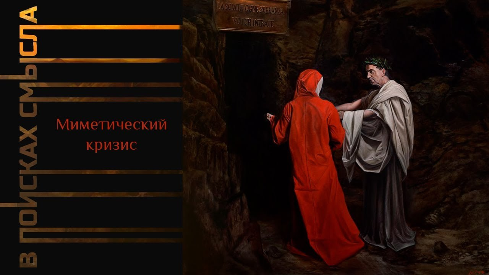

# Миметический кризис

23 октября 2023 [Аудиоверсия](https://paradoks-pinkera-pilotnyy-vypusk.simplecast.com/episodes/mimetic) 30:17

Кризис эпохи идеологий, устроенных как подражание религии.
Имитация веры, как основание современной политической модели.
Необратимость саморазрушения сообществ без цели и смысла.

**Е.Голуб:**
Здравствуйте, дорогие друзья!
В эфире второй сезон и очередной выпуск подкаста Павла Щелина и Евгения Голуба «В поисках смысла».

**П.Щелин:**
Приветствую всех, уважаемые слушатели!
Приветствую тебя, Евгений!

**Е.Голуб:**
Сегодня мы решили сделать шаг назад и вернуться к одному из наших прошлых выпусков и поговорить о асабияте.

Друзья, авторы увлеклись при записи этого выпуска и исказили название термина, придуманного Ибн Хальдуном.
Правильно, асабиЯ.
Асабият — это оговорка.
Приносим вам свои извинения.

Возможно, у вас, дорогие слушатели, так же, как у меня, возник вопрос.
Что является той движущей силой, которая порождает вот это движение вперёд, вот этот асабият?
Что в основе?

Потому как, если подходить к этому извне, похоже, что вот эти условные племена, которые нападают и разоряют и захватывают богатство ослабевших поколений, движимы только лишь желанием получить эти материальные блага, улучшить свои условия жизни.
В этом простом объяснении слышится какая-то неправда, Павел.

**П.Щелин:**
Ну, я-то с этим полностью согласен.
Это не главное открытие Хальдуна, то, что он связал географию с асабиятом.
Его само главное открытие — это явление асабията.

Если мы будем отталкиваться от этой проблематики, тогда я попробую позадавать сам тебе несколько вопросов.
И сначала мне интересно услышать твое интуитивное мнение.
Что является природой этого явления?

**Е.Голуб:**
Я думаю, что это сообщество начинает ощущать себя вправе обладать властью.
Это внутреннее ощущение, что мы, наше качество нашего общества, наша правда, наша вера — самая истинная, наша убеждённость.
И поэтому мы должны решать, и мы должны направлять этот мир в том направлении, таким образом, жизни менять условия, которые для нас являются естественными и очевидными.

**П.Щелин:**
Прекрасный ответ, точно в кассу.
Просто мы можем сейчас начать разбирать, что это из себя представляет.
На мой взгляд, это, прямо я скажу, то, что является природой асабията, является следствием человека, а именно разности человеческого сосуществования.

Я тебе напоминаю то, что общество состоит из бесконечно потенциально фрагментированных индивидов.
То есть мы все очень разные.
Пол, возраст, таланты, способности и так далее и тому подобное.

Вот эта разность, она является, с одной стороны, природой саморазрушения любого сообщества, но, с другой же стороны, именно она является природой асабията, природой силы, природой способности к коллективному действию.
Одной из природ, сразу скажу.
Их может быть несколько.

Потому что образуется уникальное состояние.
Вот эта разность потенциалов может реализовывать себя, первый путь, по Рене Жерару.
Мы довольно много с тобой говорили про Рене Жерара, но напоминаю уважаемым слушателям, что этому французскому философу принадлежит открытие понятия миметического кризиса.
Что такое миметический кризис?

Миметический кризис — это когда мы вместе чего-то хотим.
Когда мы определили нечто как некое ценное, и мы начинаем наши таланты, наши способности направлять на достижение, реализацию этого самого желания.
Ну, предположим, мы определили, что красный феррари — это круто, и его финансовый эквивалент — это нечто круто в обществе.
Далее люди начинают самосовершенствоваться в различных талантах, например, талант зарабатывания денег, чтобы обладать этим самым феррари.

Либо мы решили, что должность профессора в университете является некой ценностью, и множество, там, сотни тысяч студентов стремятся конкурировать друг с другом в процессе борьбы за то, чтобы стать этим самым профессором.
В процессе этого действия, это миметическое соревнование.
То есть они имитируют некоторые качества, и лучшие из этих качеств как бы в этой борьбе достигают этой точки.
В итоге у тебя есть некая форма движения.
Это и есть миметическое соревнование.
В чем достигается миметический кризис?

В том, что количество феррари и профессоров ограничено, и, соответственно, у тебя в рамках этого процесса возникает бесконечная конкуренция, бесконечное напряжение, которое рано или поздно может разрушить любое сообщество.
Тут интересный момент, который часто люди забывают, что словом «компетенция», то есть способность быть профессионалом в каком или ином деле, происходит от латинского «компетера» — конкуренция, соревнования.
И это, на самом деле, очень большая мудрость и трагичность определенная.

Получается то, что в стремлении реализовать не худшие наши качества, а лучшие наши качества, мы создаем семена разрушения.
Потому что любая конкуренция предполагает проигравших.
Любые проигравшие предполагают некий конфликт в обществе.
Любой конфликт в обществе в конечном итоге приводит к стазису, к состоянию внутреннего распада и гражданской войны.

А теперь есть еще, соответственно, альтернативный вариант.
В истории возможны уникальные ситуации, когда вот эти разные потенциалы вступают не сколько в миметическое соревнование, сколько в резонанс между собой.
Вот этим резонансом эти различные таланты направлены к какой-то внешней цели, к какому-то внешнему смыслу и создают ту энергию, которую Хальдун называет асабиятом.

То есть когда вот эта внутренняя разность, внутреннее стремление к некому совершенству, к некому желанию реализуется вовне через общую цель и общую задачу.
И вот это и является то чувство права, на мой взгляд, которое ты упомянул в самом начале своего разговора.

**Е.Голуб:**
Понятно, что когда цель приводит к увеличению конкуренции, стремлению добиться обладания ограниченным ресурсом или статусом, то происходит то, о чём ты говоришь.
А что нужно, чтобы возник этот резонанс?
Ведь он, получается, направлен на что-то внешнее по отношению к сообществу.

**П.Щелин:**
Так в этом вся и суть.
Конкуренция внутри сообщества, а резонанс, когда ты направляешь это вовне.

Поэтому война — это мать мира, в каком-то смысле.
Или, как говорил Аристотель, мы воюем, чтобы жить в мире.
Чтобы жить в мире внутри нас, чтобы миметический кризис внутри нас не разрушался через стазис, через гражданскую войну, мы переносим его вовне, в некую цель вовне.

**Е.Голуб:**
Ты хочешь сказать, что если у сообщества нет внешнего оппонента, скажем, врага, агрессивной среды за пределами этого сообщества, то энергия поиска смысла обращается внутрь сообщества и уходит обязательно в конкуренцию.

**П.Щелин:**
Уточню, просто чтобы было понятно.
Враг — это просто исторически чаще всего то, что применяется, но враг на самом деле вторичен.
Хотя бы внешняя цель.

**Е.Голуб:**
Покорение космоса - может быть?

**П.Щелин:**
Покорение космоса однозначно может быть такой внешней целью, да.
Построение царства Божия на Земле вполне может быть внешней целью, условно говоря.

Суть в том, что это нечто внешнее по отношению к вам как к коллективности.
Помнишь, я тебе говорил, только через определение себя, как через внешнюю систему координат, система может преодолеть процессы саморазрушения.
Потому что в противном случае у вас вот этот процесс миметического кризиса, который самоподражание, стремление, реализация желания логически приводит вас к катастрофе.
Просто потому то, что внутри вашего сообщества энергия ограничена.

**Е.Голуб:**
Есть же классическое размышление о том, что именно конкуренция, соревнования, обладающих лучшими качествами членов общества приходит к тому, что лучшие члены сообщества получают больше ресурсов, больше власти, и тем самым как будто бы должны и улучшать качество сообщества в целом.
Ты говоришь, что это не так.

**П.Щелин:**
Ну вот это вранье.
Это просто ошибочное мнение.
Так не происходит.

**Е.Голуб:**
Но это принципиальная, получается, позиция.
То есть не может быть улучшения качества сообщества, только благодаря внутренней конкуренции за статус и ресурсы?

**П.Щелин:**
Абсолютно нет.
Потому что у вас будет всегда внутреннее напряжение, которое приведет вас так или иначе к форме катастрофы.
Слишком много будет проигравших в этой борьбе.

**Е.Голуб:**
Ну, если этот проигрыш воспринимается как справедливый или выигрыш как справедливый, то...

**П.Щелин:**
Он не может так восприниматься, если нет ответа на вопрос «Зачем?».
Ответ на вопрос «Зачем?» уже предполагает внешнюю цель.

**Е.Голуб:**
То есть должна быть некоторая внешняя по отношению к сообществу система координат, заданная извне.

**П.Щелин:**
Мы сами можем её задать, но она находится извне.
То есть мы её можем сформировать даже внутри сообщества, но система логически внешняя.

**Е.Голуб:**
Хорошо, вернёмся к нашим, так сказать, баранам.
Вот сегодняшнее общество обладает некоторой системой координат, в которой оно измеряет успешность или неуспешность людей.

**П.Щелин:**
Сегодняшнее общество обречено на саморазрушение.

**Е.Голуб:**
Не спорю.
Я пытаюсь определить, где место этому утверждению в рамках построенной твоей системы.

Как будто бы ясно, что умный, талантливый, трудолюбивый, работоспособный — вперёд.
Трудись, завоёвывай статус, получай больше власти, преобразовывай сообщество к лучшему, и будет тебе слава и почёт.
Что не так в этом?

**П.Щелин:**
Зачем мне, умному, талантливому, обладающему властью, это делать?

**Е.Голуб:**
Поиск смысла — это как раз и поиск той внешней системы координат, которая может придать смысл всем действиям.
Потому что если этой внешней системы нет, то получается борьба ради борьбы, выигрыш ради выигрыша, эгоистический и направленный только на выигрыш одного или там группы, какого-то сообщества, что рождает конкурентную борьбу, неразборчивость в средствах и смысл получается в самой борьбе.
Я дерусь, потому что дерусь.

**П.Щелин:**
Это фрактальный принцип, он работает на всех уровнях, от человека до семьи, до коллектива, до страны и общества.

**Е.Голуб:**
Почему не может быть построение лучшего будущего?

**П.Щелин:**
Может.
Нет, это рабочая схема.
Не все внешние цели равнозначны, но с этой точки зрения это, да, это рабочий механизм.

**Е.Голуб:**
А почему сейчас не работает?

Мы хотим построить более справедливое общество.
Открываем передовицы, условно говоря.
И ради чего сегодня ломаются копья?
Сохранение матушки земли, окружающей среды для будущих поколений.

**П.Щелин:**
Не хотим.

**Е.Голуб:**
То есть на самом деле не хотим.
Притворяемся.

**П.Щелин:**
Да.
Это мы просто сейчас уйдем в отдельную проблематику, потому что...
Я не хочу просто все карты открывать, но на самом деле это ты сразу бьёшь в ключевое противоречие современности.

Ключевое противоречие современности, начавшееся 400 лет назад, это было, условно говоря, можно сказать, позднее сформулировано словами Ортега-и-Гассета, разница между живой верой и мёртвой верой.

**Е.Голуб:**
То есть мы говорим о том, что этот асабият рождается только исключительно тогда, когда члены сообщества искренне верят, искренне привержены своим ценностям и заявлениям.
Его нельзя, этот асабият, эмулировать и притвориться.
Есть что-то в энергии этой, которое чётко определяет, это настоящее или это притворство.
И если это притворство, то оно выдыхается очень быстро и не работает.

**П.Щелин:**
Вкратце — да.
Но это ключевое противоречие, потому что последние 400 лет мы живём в принципиальной политической модели, в основании которой лежит имитация веры, а не вера.
И в этом суть современного исторического кризиса.

Потому что власть имеющие, ну и просто понимающие люди, прекрасно понимают необходимость этого асабията для хоть чего-нибудь, уж прости меня, чтобы хоть что-то было.
Они прекрасно понимают, что любое общество хоть как-то может функционировать, только если что-то есть на месте вот этого.
Система веры, ценностей, смысла и так далее.

**Е.Голуб:**
То есть мы с тобой говорим о том, что вопрос о смысле на самом деле — это ключевой, центральный, самый важный вопрос не только для жизни человека, для его осмысленной жизни, но и для жизни сообщества.
То есть не имея чёткого ответа на этот вопрос, мы обрекаем сообщество к вырождению и распаду.

**П.Щелин:**
Если сообщество не знает, зачем мы здесь сегодня собрались вместе, то оно обречено на распад.
И проявляется это в падении качества управленческой элиты, в том, что люди рожать перестают.

То есть, как это сформулировано было Льюисом:

> Куда ты не пойдешь, везде одно и то же.
> Бесплодные ложа, ложные учения, люди, думающие, что они что-то стараются достичь.

То есть, это запускается один и тот же механизм процесса саморазрушения.

**Е.Голуб:**
Что получается?
Сегодня основной движущей силой является для многих возможность улучшить качество своей жизни, да?
Молодой человек из провинции одержим желанием жить богато, получить статус.
И это фактически единственный такой большой смысл, который движет личностью.

**П.Щелин:**
Это модель общества потребления, которая придумана как одна из самых мощных попыток создать вот эту иллюзорную систему координат.

**Е.Голуб:**
И дальше мы получаем то, что мы получаем, а именно разочарование к 40 годам, даже успешных людей к 50.
И вот это то, что потом пытаются как-то решить толпы психоаналитиков и рассказывать о том, что вам нужно хобби, вам нужны какие-то увлечения, вам нужны какие-то дела ради других.
То есть это все дешевые заменители смысла с большой буквы «С», которого сегодняшнее сообщество, общество, предложить просто не может.
Его нет.

**П.Щелин:**
Не может.
Потому что если оно это предложит, то ему придется, повторюсь, менять...

То есть об этом мы, наверное, будем говорить, возможно, во всех последующих выпусках.
Я просто не знаю, стоит ли все карты, я повторюсь, раскрыть.
Но пойми правильно, это мы все время будем возвращаться к произведению Гоббса «Левиафан».

Мы живем в Левиафане.
Тут надо очень хорошо понимать, что это такое.
И почему та проблема, которую ты описал, она настолько фундаментальна.
Это главная мина.
И она проявляется в войнах сейчас современных.
Почему они такие, как такие?
Она проявляется в беспорядках.
Почему они такие и так далее и тому подобное.

Левиафан возникает когда? Жень?
Когда пишется эта книга?

**Е.Голуб:**
Я не помню, когда она пишется.

**П.Щелин:**
17 век.
После чего?

После эпохи религиозных войн.

**Е.Голуб:**
Ага, это как раз по итогам вот этого всего безобразия, да?
С 30-летней войны и всего остального.

**П.Щелин:**
Да.
Там сто лет католики и протестанты резали друг друга.

**Е.Голуб:**
То есть они, получается, выхолостили декларации о своей вере, то есть они фактически своим образом жизни и приверженностью, как будто бы смыслам, показали их несостоятельность.

**П.Щелин:**
Нет, хуже.
Произошло сложнее.
Они все двигались живой верой.
В том-то и дело.

**Е.Голуб:**
Ну вот я хотел сказать, тут же противоречие.

**П.Щелин:**
Нет, это не противоречие.
Живая вера может в столкновении с другой живой верой, происходит настоящая война.
Мира никто вам не обещал.

Не это важно.
Важно, какой вывод делает условный Гоббс.
И потом все его последователи.
Они говорят, глядя на все это.

Да не нужна нам ваша живая вера.
Мы не знаем, что со всеми фанатиками делать.
Давайте вынесем этот вопрос за скобки.
Потому что иначе мы переубиваем друг друга.

**Е.Голуб:**
Многовато асабията.

**П.Щелин:**
Именно!

Мы не знаем, что с ним делать.
Не получается у нас.
И давайте вынесем его за скобки.
А на его место поставим иллюзию.
И назовем эту иллюзию Левиафаном.
Вот она.
И Левиафан — это иллюзия на месте живого асабията.

**Е.Голуб:**
Слушай, но в Левиафане смысл весь - безопасность.
Какой еще смысл в Левиафане?

**П.Щелин:**
Так это смысл энтропийный, в том-то и дело!

Ты понимаешь, что смысл безопасности — это принципиально смысл, не направленный вовне.
То есть таким образом в Левиафане ты на логическом уровне все свои противоречия в нем капсулируешь, и поэтому это Левиафан, постоянно раздираемый внутренними противоречиями, который вынужден постоянно создавать все более и более сложные системы иллюзий и обмана, чтобы эти противоречия хоть как-то канализировать.

**Е.Голуб:**
Хорошо, получается так.
Асабият — это приверженность, искренняя, некоторой системе ценностей.

**П.Щелин:**
Уточню, коллективная.

**Е.Голуб:**
До готовности умирать.
И на каком-то этапе возникает реакция на вот эту вот готовность двигаться вперёд, умирать за свои ценности.

Как некоторая защитная реакция, опять-таки, у кого?
У не обладающих асабиятом?

**П.Щелин:**
Ну, часть асабията, часть элитных группировок.

**Е.Голуб:**
Они говорят, так, стоп-стоп-стоп, что-то цена слишком высокая, давайте-ка мы тут закапсулируемся и внутри нашей капсулки построим безопасное сообщество.
И подменим нашу искреннюю веру какими-то более, скажем так, рациональными рассуждениями.

**П.Щелин:**
А дальше наступает фундаментальная проблема, Жень.

Проблема в том, что этот эксперимент продлился всего 150 лет, а потом уже приходит французская революция и сносит всю эту идею того, что можно жить без асабията, просто под ноль.
Но вернуться к настоящему асабияту они не могут, к живой вере, и начинается эпоха идеологий.
Что такое идеология?

Идеология — это искусственный асабият.
Это асабият как технология.
Это мертвая вера, которая выдает себя за живую веру.

**Е.Голуб:**
Ну подожди, то есть просветители прекраснейшие наши, да, которые сначала замутили республику в Штатах, а потом те же самые ребята сделали французскую революцию, да?
Их, скажем так, протест, он был на самом деле, может быть, против Гоббса, против квази-установки вот этой, на безопасность.
В них не было содержания жизни.

**П.Щелин:**
Ну это, понимаешь, это не протест в прямом смысле.
Но они же остались гоббсианцами.
Просто они поняли, что чтобы Левиафан функционировал, ему нужна постоянная имитация вот этой штуки.

**Е.Голуб:**
Я следую за твоей мыслью, но я не уверен, что я с ней согласен.
Вот это вот «фрателите» и «эгалите» и что-то там ещё, оно же, в общем-то, звучало именно, как...

**П.Щелин:**
... «живая вера».

И какое-то время...
И самый главный момент, Жень, начинается соревнование.
Потому что оказалось, почему наполеоновские революционные солдаты были способны так успешно воевать.
Во многом потому, что был проведена технология массового призыва и технология вот этой новой идеологии.
И потом началась гонка вооружений идеологий, как технологий.

Потому что знаменитая речь Фихте к германской нации рождается после военного поражения.
И, по сути, он говорит о том, что нам нужна такая же социальная технология, если мы хотим выигрывать войны.

**Е.Голуб:**
Хорошо, тогда я сейчас повторю то, что ты говоришь, как я это слышу.

После 30-летней войны гоббсианство попыталось сохранить стабильность в сообществе, исключив или заговорив, каким-то образом убрав то, что мы называем сейчас асабиятом, из значимой части общественной жизни.
То есть это, как ты говоришь, за скобки задвинули.
Это привело, пока еще непонятно почему...

**П.Щелин:**
Фундаментальный принцип Вестфальского договора.
Кто правит, того и вера.
Это означает, что вам безразлично, чья вера.
То есть вам, в принципе, вопрос веры становится безразличен.

**Е.Голуб:**
Хорошо, это ключевой пункт.
То есть раз мы говорим, что кто правит, та и вера, то, в принципе, все равно как верить, да?

**П.Щелин:**
Это же именно это и означает.

**Е.Голуб:**
Мы признаем, и такой вариант хороший, и такой хороший.
Давайте договоримся, вы там верьте.
Мы вас не трогаем, и вы нас не трогайте.
А это означает отказ от готовности умирать.
Дело не доведено до конца.

**П.Щелин:**
За веру.

**Е.Голуб:**
За веру, да.

**П.Щелин:**
За торговую дорогу, за порт, за наследие можно повоевать.
Ну, условно говоря, вы мне должны по наследству что-то.
Хорошо, давайте решим.
Силовое обеспечение юридического спора.
И войны начала 18 века, они же такие.

**Е.Голуб:**
Я пока не могу прочертить отсюда дорожку к революции.
Почему вдруг такое решение привело к революции?

Где та пустота, которая должна была...

**П.Щелин:**
Так жажда смысла-то никуда не девается.
Пресловутое великое паскалевское суждение.

Если у вас дыра в сердце на месте Бога, вы будете пытаться ее чем-то заполнить.
Общество не может.
В том то и парадокс, что коллективная личность не может существовать в условиях отсутствия смысла.

**Е.Голуб:**
В то же время церковь никуда не пропала, в той же Франции.
То есть, в общем-то, католическая церковь.

**П.Щелин:**
Да, но на элитном уровне, в условиях такого нового мировоззрения, она постепенно теряла авторитет.

**Е.Голуб:**
Это следствие получается.
Раз мы говорим, кто правит, та и вера.
Церковь и её утверждение католическое, достаточно бескомпромиссное, становится игрой.

Либо мы возглавляем крестовый поход и вырезаем всех протестантов, потому что они еретики, либо мы говорим, окей, пусть живут, как живут, и это значит автоматически, что мы ставим под вопрос вот эти все бескомпромиссные утверждения, а это значит, что мы движемся дальше, дальше, дальше, пока обедня для нас — это декоративный элемент повседневности.

**П.Щелин:**
А противоречия в обществе никуда не девались.
У вас разница потенциалов стазиса вот этого...
У вас как богатые и бедные были, так и остались.
Как у вас, условно говоря, противоречия на семейном уровне, социальном уровне, этническом уровне, региональном уровне.
Они как были, так они никуда и не девались.
Процессы энтропии обществу присущи всегда.
Абсолютно.
Их вообще невозможно полностью никогда убрать.

**Е.Голуб:**
То есть миссия исчезла, вот это вот ощущение себя сообществом, которое живет единственно правильным путём, будучи приверженцами католической веры, это стало размываться, растворяться.
И к моменту французской революции достигло такого состояния, когда нужно было что-то, чем-то заменить.
Какой-то должен быть великий смысл, который пришёл на смену девальвирующим, если можно так сказать, на уровне верхушки, ценностям христианства и католической церкви.
Ну и дальше пошло-поехало, да?

**П.Щелин:**
И важно понимать, в этот момент рождается идея, давайте это сымитируем.
Давайте создадим искусственную.
Идеология, повторюсь, это искусственная религия.

Она выполняет все функции религии ради того, чтобы вот эта способность к трансцендентному коллективному действию сохранялась.
И дальше, повторюсь, начинается военное соревнование этой социальной технологии.
Кто лучше идеологию придумает, кто свое общество лучше мобилизует.
Сочетается это с рождением массового человека.

**Е.Голуб:**
Массовый человек родился параллельно с научно-технической революцией или промышленной революцией первой.
С образованием огромных масс в городах, первым достижением в медицине, увеличением населения.
И тогда пошло-поехало, пришло к национализму, национальным государством, которые тоже квази.

**П.Щелин:**
Так национализм точно такая же социальная технология.
То есть, по сути, как философы объясним.

Для тех, кто читал знаменитый диалог Платона о пещере, в чем состоит вся суть этого проекта?

То, что сидите, продолжайте в этой пещере, а мы будем совершенствовать технологии теней.
Мы такие тени создадим, что они будут подобны виртуальной реальности, что полный иммёршн, полное погружение у вас в них будет.
И 300 лет мы развивали, мы совершенствовались, разные, скажем так, страны, разные культуры по-разному совершенствовались, как нам лучше тень делать.

Но каждый из них подсознательно на элитном уровне больше всего боялся, а что же произойдет, если они выйдут из этой самой пещеры к настоящему смыслу?
Потому что тогда мы вернемся в тот первоначальный гоббсианский страх.
Что нам делать с людьми, которые горят живой верой?

Мы же их контролировать не сможем.
И вот если ты будешь смотреть все речи современных политиков, в глубине там именно это сидит.

**Е.Голуб:**
То есть это какое-то самоубийственное направление, да?
Или попытки соблюдать баланс там, где его соблюдать в принципе невозможно.
То есть между стремлением к комфорту и безопасности, и приверженностью к идеалам не может быть компромисса без ущерба для носителя.

**П.Щелин:**
Не может.
В том-то и проблема, что не может.
И понятно, логическое это желание.
Их желание вот это вынести за скобки, создать иллюзию, создать имитацию.
Они бы предпочли, чтобы этого вообще не было, но технически они понимают, что если этого не будет, то управлять обществом вообще невозможно.
Если у вас в обществе отсутствует коллективная личность, пресловутая идентичность, то вы им никак управлять не можете.

А если она у вас сильная, живая, то она развивается по Хальдуну.
Она либо умирает, либо развивается.
Как пламя.
Асабият же — это пламя в сердце коллективной личности.

И оно может либо затухать, либо разгораться.
Но это очень всегда живое, подвижное, ему надо подбрасывать поленья.
Оно всегда требует усиленной работы.
Причем ты должен, особенно если ты еще, по сути, являешься частью, языком этого пламени.

А здесь страх против этого пламени.
Он говорит, нет, вот это нам не надо.
А пламя будет стоять где-то далеко и просто тени отражать.

**Е.Голуб:**
Совершенно естественно для человека стремиться к выживанию, к комфорту, к какому-то уровню безопасности.
А ты говоришь, ну это всё, конечно, понятно, но если, ребята, у вас нет большого смысла, то ваше стремление к комфорту и безопасности приведёт вас к вырождению и смерти.

**П.Щелин:**
Нравится, не нравится, вам придётся искать смысл.
Да, я именно это, к сожалению, говорю.

**Е.Голуб:**
Почему к сожалению?
Я пытаюсь расшифровать твои слова так, чтобы они мне были понятны.

Или мы говорим о том, что давайте-ка вот эти ребята будут заниматься смыслом.
Мы отдаем им свою субъектность, отдаем свою политическую идентичность.
У них есть какая-то там вера.
Они дают нам возможность жить, как мы хотим.
Нас это устраивает.
Мы готовы жить более-менее высокоразвитыми животными, удовлетворять свои потребности разного рода.
Ну и окей.

**П.Щелин:**
Ну так не окей же, в том-то и дело.
Понимаешь, здесь наступают проблемы в демократии.

Что в демократии вы говорите, что не окей.
Вы же ни много ни мало источники власти все.
Вы же все еще считаете, что именно вам все должны.
Вы налоги как бы платите, и поэтому государство вам должно.

**Е.Голуб:**
Ага, то есть демократия, которую, я надеюсь, все хорошо понимают, что сегодняшняя демократия в той форме, в которой она появилась в 18 веке в конце, в 19-м, она не имеет ничего общего, кроме названия с того, что, собственно, было в Греции.
И это некоторая новая форма легитимизации власти, которая просто присвоила себе это название и больше ничего.
И в самой этой форме содержится вот эта порочность.
Опираясь на легитимизацию масс, у которых нет большого смысла, а смыслы в основном маленькие, то эти маленькие смыслы, они в конечном итоге, если я рассуждаю правильно, приводят к кризисам.

**П.Щелин:**
Они создают необходимость эти массы обманывать.
То есть массы возмущаются, что их обманывают, но при этом массы, ты абсолютно прав, большого смысла не хотят.

Но тогда единственный смысл, который вам дадут, это обманный смысл.
Потому что без смысла, вообще хоть какого-то, существовать вы не можете как коллективная идентичность, повторюсь.

**Е.Голуб:**
Хорошо, но тогда неизбежно то, о чем мы говорили в частных беседах и в наших выпусках, это неизбежность расслоения общества на ту часть его, которым смыслы не нужны, которые добровольно согласны жить в виртуальной реальности и стимулировать свои нервные окончания тем или иным способом.

И маленькая прослойка, которая для себя эти смыслы видит в чём-то, потому что должен быть какой-то драйв управлять всеми остальными зачем-то.
Какие-то внешние смыслы существуют, и это то, скажем так, что не является плодом фантазии писателей, а то неизбежное следствие сегодняшнего порядка вещей.

**П.Щелин:**
Это неизбежный следующий этап, который, собственно, мировые элиты примерно этого и желают.

**Е.Голуб:**
То есть затратно стало вот эти эмулировать смыслы, да и не получается, в общем-то, надолго.
Легче покончить с этим кардинально.

**П.Щелин:**
Сейчас их желание создать идеальную эмуляцию, которая вот какая-то будет вот, ну, прям вот виртуальность, это же идеальная симуляция, соответственно, вот эта вся гностическая идеология, которую мы с тобой обсуждаем.
Но я то иду дальше.
Я утверждаю, что и вот эта попытка обречена, потому что внутри вас, внутри верхнего слоя, точно такой же кризис наступит, потому что вы сами ни во что верить не умеете уже.

Единственный на самом деле способ выйти из этого кризиса — это резонанс, то, что мы начинали.
Когда у тебя есть резонансы между низом и верхом в попытке достижения единой цели.

**Е.Голуб:**
Знаешь, что интересно?
У Пелевина его произведение по поводу баночных капиталистов и так далее, это перекликается с нашим с тобой разговором о том, что даже будучи помещены в некоторые фантастические банки, которые позволяют жить вечно, тяга по смыслу или отсутствие смысла все равно приводит то, что остается от личности, к самым разным ужасным страданиям и кризисам.

**П.Щелин:**
Тут очень интересный парадокс, но поэтому церковь-то не про одиночку, если уж возвращаться к этому.
Она про коллективность.
То есть есть некие формы смысла, которые реализуются только через коллективность.
И вот в этом проблема.

Потому что это, с одной стороны, требует определенного смирения снизу, то есть признания о том, что будет определенная иерархичность.
А с другой стороны, смирение сверху.
Это признание того, что без вот этих неприятных нам людишек наша жизнь тоже будет бессмысленная.

**Е.Голуб:**
Ну хорошо, а если посмотреть сейчас на ту модель общества, которую предлагала или предлагает до сих пор христианская церковь, что мы здесь увидим?
То, что есть некий внешний смысл большой, есть система координат и заповедей, и способ каким-то образом отнестись к поведению того или иного человека, о том, как правильно жить.
Есть иерархия.
И есть смысл.
То есть получается, что, по идее, следуя, скажем, учению, что ли, христианской церкви, сообщество могло бы быть устойчивым.

**П.Щелин:**
Есть модель общества, описанная апостолом Павлом в послании к римлянам, и оно живое.
А Левиафан — это попытка то же самое, но механическая, искусственная.
То есть, по сути, это прямой перефраз этого текста идёт.

**Е.Голуб:**
У меня, конечно, большой соблазн, но, видимо, не сейчас.
Я хочу понять, ну окей, если это сообщество в конечном итоге свернуло с пути, отказалось от этой живой веры и всего того, что предлагала церковь, то, значит, и здесь есть какое-то серьезное искушение, которое органически заложено.

**П.Щелин:**
Органическое искушение у нас — это же проблема динамической системы.
То, что это не то, что ты сделал один раз, в одном поколении, пресловутая проблема Хальдуна, и оно так будет ехать бесконечно.
Это живое творчество, живое усилие, живая осознанность каждого поколения и каждого участника сообщества.
Это очень сложно.

**Е.Голуб:**
То есть если святых, условно говоря, не хватает, то расплата за это всё равно последует через какое-то количество времени, да?
Если святости в обществе недостаточно, то неизбежно природа возьмёт своё.

**П.Щелин:**
Потому что, условно говоря, может ли религия стать идеологией?
Может, когда она перестаёт быть живой, становится ритуалом без содержания.

**Е.Голуб:**
Очень интересно.
И, конечно же, как всегда, есть о чём подумать.
Я думаю, что на этом мы завершим наш сегодняшний разговор.

**П.Щелин:**
Давай сейчас завершим.
Я сразу скажу, это только начало, потому что это, наверное, приглашение нашим слушателям немножко задуматься, потому что на самом деле там всё гораздо интереснее с этим смыслом.
Ну, потому что он не один, их три.

**Е.Голуб:**
Ну хорошо, будем считать, что это ты как бы тизер такой запустил сейчас.
И поговорим об этом дальше.

Спасибо всем, кто нас слушает, кто дослушал до финала этого выпуска.
Мы рады продолжать общение с вами.
Пожалуйста, присоединяйтесь к нам в группу Telegram.
Пишите, протестуйте, не соглашайтесь.

**П.Щелин:**
Главное — думайте.

**Е.Голуб:**
Размышляйте.

**П.Щелин:**
До новых встреч.

**Е.Голуб:**
Всего доброго.
Спасибо, Павел.

До новых встреч.
