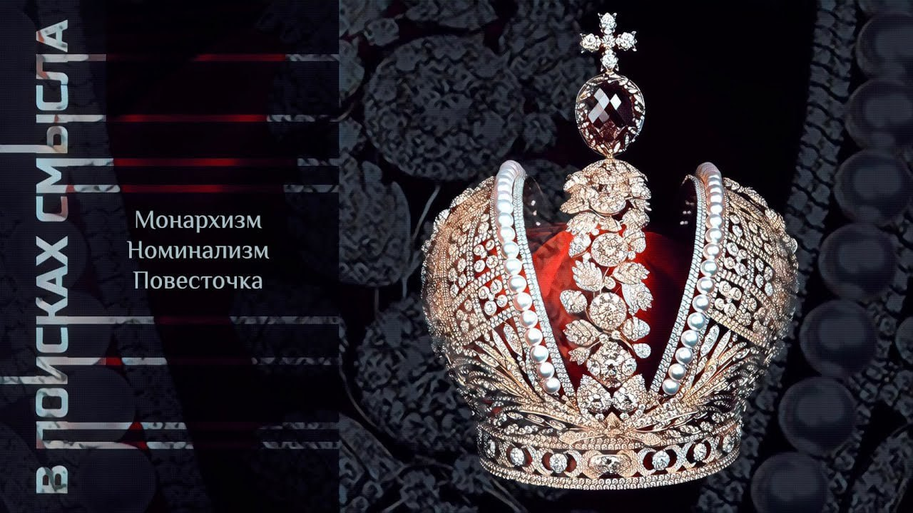

# Монархизм. Номинализм. Повесточка

02 декабря 2023 [Аудиоверсия](https://paradoks-pinkera-pilotnyy-vypusk.simplecast.com/episodes/monarchs-and-agenda) 30:33

Продолжаем отвечать на вопросы слушателей.
Действительно ли Павел Щелин – монархист и как он обосновывает свои взгляды на монархию?
Какое отношение спор об универсалиях имеет к современной «повесточке»?

**Е.Голуб:**
Здравствуйте, друзья!
В эфире очередной выпуск подкаста «В поисках смысла» у микрофона Евгений Голуб и Павел Щелин.

**П.Щелин:**
Здравствуйте!

**Е.Голуб:**
Сегодня мы продолжим отвечать на вопросы наших слушателей.
Я предлагаю обсудить два совершенно не связанных между собой вопроса, которые, тем не менее, вызывают большой интерес.

Первый вопрос затрагивает мировоззрение Павла, которое мне кажется странным, я не готов разделить с ним эти взгляды.
Поэтому мне тем более любопытно, тем более интересно узнать.
Много раз ты проговаривался о том, что считаешь монархию лучшим способом устроить отношения в обществе, лучшей организацией власти.

**П.Щелин:**
Ну, не в обществе целиком.

**Е.Голуб:**
Объясни, почему.
Потому что звучит, ну, очень, очень неожиданно, чтобы не сказать странно.

**П.Щелин:**
Не знаю, Жень, на самом деле то, что традиционалист является монархистом по политическим убеждениям, это как раз вполне логично.
Было бы странно, если бы я был при этом анархистом.
Если уж на то пошло.

Но да, на самом деле это же большая древняя философская традиция от Аристотеля до Платона, то, что монархия — это один из, как минимум, если не самый лучший способ организации власти.
И для меня есть на это несколько причин, как для философа.

Первое, для меня это, кажется, наиболее честная политическая система.
Ну, то есть она, условно говоря, есть то, за что себя выдает.
Она не претендует на то, что она является, как в случае демократии, правлением народа, когда является правлением дема или правлением людей.
Она является правлением, так сказать, монарха.
Основанием этого правления является божественное право.
У тебя есть необходимый теологический элемент.
Поэтому, повторюсь, мне она кажется гораздо более честная с точки зрения своего вот даже внешней репрезентации.
При этом же у монархии есть несколько таких больших философских плюсов.
В частности, это проблема с ответственностью.
Тебя понятно, что есть монарх, за что он отвечает, почему он за это отвечает и так далее.

Во-вторых, у тебя ироничным образом есть шанс, единственный, по-моему, в политических системах, что у власти окажется человек, который не опьянен этой самой властью.
Я не говорю, что это всегда происходит, но, по крайней мере, есть на это шанс, потому что она ему дается просто от рождения.
Ему не надо было проходить весь политический отбор именно с точки зрения навыков борьбы за власть.
В этом есть тоже определенное, скажем так, даже гуманистическое, на мой взгляд, начало.
Монарх может себе позволить гораздо большее, что не может себе позволить условный президент.
Ему не надо переизбираться через 2-3 года.
То есть, соответственно, вектор абсолютно другой.

Соответственно, именно по этой же причине монарх может позволить себе заниматься стратегиями.
Ну, то есть, он может себе подумать, там, на десятилетия, на то, что будет там при его детях.
Президент или временщик себе так позволить думать не может.
Он думает на горизонте, там, двух лет, в лучшем случае.
Извечена, например, проблема американского кокуса, что, ну, по сути, ну тебя вот избрали, а через два года ты уже думаешь только о том, как переизбираться снова.

**Е.Голуб:**
Хорошо.
А почему не аристократия?
Почему монархия?

**П.Щелин:**
А кто будет управлять аристократами?
То есть мы возвращаемся вот в этот треугольник.
Аристократия, монарх и народ, условно говоря.
И традиционная спайка — это монарх в союзе с народом против аристократов, потому что интересы аристократов по определению направлены против общего блага, а к своему личному частному.

**Е.Голуб:**
Получается, что в твоем видении аристократия — это что-то вроде олигархии?

**П.Щелин:**
Конечно, аристократия — это и есть олигархия.
Смотри, я очень сильно поддерживаю аристократию как социальный институт.
Я считаю, что это очень важный на самом деле элемент общества.
Но при этом, если ей принадлежит полнота политической власти, она не может не эволюционировать в сторону олигархии.

**Е.Голуб:**
То есть преследовать сугубо свои экономические интересы?

**П.Щелин:**
Экономические, интересы своей властной группировки, полуполитические и так далее.
Это заложено в ее природу.

Наверное, можно себе представить это на очень маленьком уровне, то есть на уровне города.
Город себе такое может позволить один.
У нас есть примеры так называемых городских республик, которые на самом деле, конечно, не республика, а де-факто они управлялись именно олигархами, вот этими аристократическими.

**Е.Голуб:**
Ну, это вся ренессансная вся эта история, да?
Итальянские города.

**П.Щелин:**
Торговые республики Ганзы, города-государства, по сути, тоже были по большей части торговыми республиками.
В каком-то смысле Новгород, если брать пример более близкий.
И там всегда повторяется один и тот же паттерн.

То, что эти городские партии, они хорошо делают деньги.
Но при этом, допустим, они очень редко могут преследовать интересы общего блага.
И именно, кстати, поэтому чаще всего они реализуют инструмент тирана.

Это временно приглашенный внешний политик, который стоит над группировками, который обладает всей полнотой военной, прежде всего, власти, и который спасает город.
Но потом его сразу надо изгнать, потому что иначе он, условно говоря, всю полноту власти заберет себе.
Но тут возникает вопрос, если вы, как политическое устройство, не способны решать проблему безопасности в критические моменты, то, простите, грош вам цена.

**Е.Голуб:**
Ну хорошо, допустим.
А почему не избирать правителя условно, демократическим путем, пожизненно?
Вот избрали, он сумел как-то обосновать свою претензию на власть, и пусть правит.
Почему это должна быть наследственная монархия?

**П.Щелин:**
На самом деле можно, уж если по большому счету.
Монархии дальше бывают разные, да?

Прямо скажу, я являюсь сторонником...
Мне нравится земская модель монархии, где монарх действительно избирается Земским собором, но не в каждом поколении, а, допустим, в случае прерыва династии или в случае какой-то радикальной, что-то внеочередного.
В целом среднестатистически элементарно наследников воспитывают, то есть их готовят.
То есть тут вопрос подготовки и компетенции.
При базовом сценарии нормальный монарх себе подготовит нормального преемника из какого-то своего отпрыска или не отпрыска.
При этом я могу себе позволить ситуацию, когда этот монарх, в случае, если на детях природа отдохнула, в согласии с Земским собором, может позволить себе, так сказать, найти преемника из, скажем так, дальнего родственника, а не напрямую своего ребенка.
Но это, скорее, опять-таки исключение из правил.
Но это ты уже уходишь немножко в такие частности, где огромное количество дебатов внутри, условно говоря, всего монархического мировоззрения, каким способом лучше это наиболее устроить.

**Е.Голуб:**
Ладно.
Монархия самодержавная или конституционная?

**П.Щелин:**
Здесь, прямо отвечу, зависит от культуры очень сильно.
Наилучшая формула для культуры русской, в широком смысле этого слова, то есть для культуры Руси, на мой взгляд, была высказана Солоневичем в формуле «сила власти царю, сила мнения народу».
То есть монархия ограничена, но ограничена не законом, а традицией и обычаем прежде всего.

**Е.Голуб:**
Тогда поясни, почему традиция и обычай лучше будут работать, чем закон?
И прописанные правила.

**П.Щелин:**
Ну, потому что нет у меня доверия к прописанным правилам и закону, особенно на этой территории.
Ну, нет культуры.

Есть территории, где есть культура римского права, и отношения строятся через закон.
А есть территории, где правит обычай, и все строится через отношения между людьми.
Разные культурные паттерны.

Ну, условно говоря, если ты меня спросил культуру для, там, не знаю, Франции и Германии, то там конституционная монархия лучше, мне кажется.
Там через закон.
Зависит очень сильно от идентичности пресловутой, которую мы с тобой весь подкаст обсуждаем, от тех привычных способов организации взаимоотношений между людьми в обществе.

**Е.Голуб:**
То есть если доверия к закону нет, то тогда есть доверие к обычаю и к тому, что у нас так принято.

**П.Щелин:**
Как бы хотел, по закону или по справедливости?
Вот если у тебя в обществе доминирует вот это, то смысл тебе играть в закон, оно все равно работать не будет.
А мнение работать будет.
То есть, условно говоря, "Царь ненастоящий!".

Если царь делает что-то, что идет вот в противовесе всему, он теряет легитимность, и у него начинаются большие проблемы.
Переформулируя твой вопрос, ограниченное или неограниченное, мой ответ всегда чем-то ограничено.
Вопрос чем?

**Е.Голуб:**
Мы знаем об этом из истории, что действительно неограниченной власти не было ни у кого из монархов.
Им всегда приходилось считаться.

**П.Щелин:**
Это абсолютная утопия, то, что они могли творить, что хотели.
Напротив, они очень сильно ограничены всегда были в своих реальных действиях, поступках, обычаях.
Чаще всего приходилось убеждать.
Это постоянное сложное искусство управления.
Наверное, значит, никогда не говорю никогда.
Можно найти пример в истории, где де-факто человек вел себя, как будто у него неограниченная власть, но заканчивалось для него это очень плохо, чаще всего.

**Е.Голуб:**
Согласись, что эта конструкция такая, она иррациональная, в общем-то, да?

**П.Щелин:**
Да, она очень теологическая, давай так скажем, историософская.
Просто я бы не сказал, что это иррационально, но она не рациональна с точки зрения, например, тех же просвещенцев, она не рациональна с точки зрения, допустим, вот этого модерна картезианского, да, с этой точки зрения она совсем не рациональна.

**Е.Голуб:**
Она перпендикулярна идее модерна полностью.
То есть это вообще домодерновая структура.

Следующий же вопрос в продолжении этой темы.
Ну, хорошо.
Мы будем говорить об этом как о некоторой идее, как сферической монархии в вакууме, или ты видишь, что вообще говоря, такая форма власти может образоваться, мы можем вернуться к ней?

**П.Щелин:**
Это вопрос формы и содержания, да, опять слово и дело.
Я считаю то, что...
Вот, например, возьмем ситуацию в России, уж извини, да, прямой вопрос.
Какую власть, какой режим ты не строий, а все равно царь получается.

**Е.Голуб:**
Это правда.

**П.Щелин:**
Ну так в что мы тогда играем вот в эти слова?
Что мы врём себе каждый день, условно говоря.
Что мы, вы, ну, называйте, как хотите, не знаю, в зависимости откуда слушатели.

Я предлагаю перестать врать.
Если у вас, как не собирай, получается автомат Калашникова, или какую политическую систему не создавая, получается на выходе царь, то стоит это, как бы, наверное, и оформить как царство.

**Е.Голуб:**
Не хочу здесь комментировать.
Для меня это очень спорная конструкция.

**П.Щелин:**
Я понимаю, это звучит очень радикально, но давай так, я отвечу на мое мнение, мой прогноз.
Да, здесь попробую поиграть в прогнозиста.

Я думаю, что эпоха возрождения монархии, она в широком смысле нас ожидает, на полном серьезе.
Не только на территории Восточной Европы, но и на территории Европы Западной.
Я это говорил в одном из таких более публицистических эфиров, но у нас сегодня с тобой подкаст в том числе немножко такой...
Ответы на вопросы, могу себе позволить.

Я ожидаю то, что в Европе фундаментально рано или поздно стоять перед двумя выборами, либо она становится частью халифата, либо в ней происходит возрождение Габсбургов и Бурбонов.
Как две такие основные династии.

**Е.Голуб:**
В халифат верится больше.

**П.Щелин:**
Ну, тут уж как пойдет.

**Е.Голуб:**
Смотри, ну просто уже почва-то она другая.
А как из нее монархия-то вырастет?

**П.Щелин:**
А вот здесь, чтобы понять, как из нее вырастет монархия, мне кажется, очень важно понять, чем монархия была, а не тем, что нам нарисовали просветители.
На мой взгляд, именно монархия в наибольшей степени соответствует системе развитого местного самоуправления.
Идеальный лозунг, но это больше к восточной Европе, который я бы поднимал на щит, если бы был политконсультантом, звучал бы как самодержавие и самоуправление.
Широкая система развитого местного самоуправления, над которой стоит вот этот объединяющий центральный столп идентичности, который позволяет самоуправление приводить в точку камертона и направлять на общее дело.

**Е.Голуб:**
Как школьное описание феодальной системы.
Без феодов, но что-то вроде.

**П.Щелин:**
И не обязательно самоуправление должно быть феодальным.
Как раз я говорю больше не о феодальном самоуправлении, а, допустим, город, муниципалитет и прочее.
На самом деле мы же с чем сталкиваемся?

То, что у нас фундаментальная проблема национального государства, что оно все пытается унифицировать.
Оно все пытается привести к единому знаменателю.
Оно разнообразие терпеть не может.
А монархия разнообразие очень хорошо терпеть может.
И при этом же она собой позволяет решать проблему паралича воли.

То есть другая проблема с другой стороны, то, что когда у тебя все слишком разнообразно, действовать не получается, делать ничего не получается.
Ну да, то есть центробежные силы все тащат в самые разные точки, в самые разные стороны, вообще сделать у вас ничего не получается.
Монархия, по крайней мере, из того, что было придумано в политфилософии, это, на мой взгляд, наилучший способ попытки соединить лучшее из двух вот этих подходов.

С одной стороны, тебе нет необходимости всех приводить под одну гребенку, достаточно, условно говоря, присяги.
Ты присягаешь не какой-то абстракции в виде государства, ты присягаешь конкретному человеку.
Это очень важный момент, между прочим.
Понятно, кому ты служишь.

Ты не служишь идее национального государства.
Ты не служишь воображаемому сообществу, отношения у тебя личные.
То есть это возврат личности в политику.

А с другой стороны, вот именно в силу того, что это личные отношения, вот эта личность может при необходимости сказать, что вот принято стратегическое решение, если эта личность...
И эта личность обладает достаточным капиталом доверия, чтобы принимать некие решения, важные для общего блага.

Да, согласен, звучит немножко как теоретическая конструкция, но конкретная форма реализации этих принципов зависит от конкретных культурных, исторических условий на том или ином пространстве.
Но это, мне кажется, было бы гораздо более честно и адекватно после модерна.
Это не вернуть все взад, а это именно осознать длинный цикл и посмотреть, как оно будет дальше.
На самом деле, эта система, мне кажется, гораздо более лучше соответствует вызовам грядущей эпохи.

**Е.Голуб:**
Как быть с легитимизацией?
Сегодня мы говорим, что инструмент выборов и демократия.

**П.Щелин:**
Ну, без Бога не получится.

**Е.Голуб:**
Ну, так вот, к чему я и веду.
Где современное общество, близкое нам?

**П.Щелин:**
Ты, как бы, прав.
Тут проблема в том, что без Бога и церкви не получится вообще ничего у современного общества.
И кризис будет длиться.

**Е.Голуб:**
Слушай, тогда я тебе хочу сказать, что тогда халифат.
Но потому что дехристианизация зашла уже так далеко, всё, что мы называем искренней верой, авторитет церкви, все ценности, всё уже так деконструировано и разбито, настолько оболгано, обгажено, затоптано в грязь, что, мне кажется, если говорить о монархии, тогда, видимо, это будет халиф.

**П.Щелин:**
Если не хотите себе православного царя или христианского монарха, то будет у вас халиф.
Да, это вот такое моё мнение.

**Е.Голуб:**
Ладно, тогда пару шажочков.

Мы с тобой, я тут к тебе присоединяюсь, приписали себя к традиционалистам.
Но в то же время, трезво глядя вокруг, я могу сказать, что, по моим ощущениям, лучшее, что может быть сейчас, это маленькая катакомбная христианская церковь, которая сохранит этот огонь, который, может быть, потом разожжётся.
Говорить о том, что общество вдруг повернётся лицом к традиции христианской и каким-то чудесным образом пропитается вновь всем тем, чем оно было пропитано 200-300 лет назад, выглядит маловероятно.

Конечно, после событий последних лет трудно говорить о том, что нечто маловероятно, но всё-таки я не могу себе пока этого представить.
Если ты можешь представить, помоги мне и нашим слушателям представить.

**П.Щелин:**
Я могу это именно что представить.
Я не гарантирую, что так будет, и я не уверен, что так будет.
Но общее представление у меня есть.
Просто оно как бы большинству-то все равно не понравится.

**Е.Голуб:**
Так мы не для того, чтобы кому-то нравиться.
Давай.

**П.Щелин:**
Но идея заключается в том же, Жень, то, что если люди, вот как я сейчас после нескольких лет размышлений, особенно последний год, включая вместе с тобой, для себя сделал вывод, что история работает по принципу обучения.
И если люди не хотят учиться по-хорошему, то она их учит кровью, большой кровью.
Соответственно, ты, мне кажется, в своем рассуждении все равно делаешь ставку то, что как-то пропетляем, то, что катастрофы не будет.
А на мой взгляд, катастрофа неизбежна.

И я вот это часто в своих дискуссиях рассуждаю уже на самом деле о мире после катастрофы.
И вот насчет твоей идеи катакомба, в каком контексте я поддерживаю то, что на время катастрофы, в случае если...
То есть я могу надеяться на оптимизм, что обучение будет происходить быстрее, чем хотелось бы, но, скажем так, если обучение будет длиться очень долго, то да, в это время надо это как-то хранить, чтобы к тому моменту, когда хоть немножко, скажем так, выводы и причинно-следственные связи между действиями и последствиями были восстановлены, было на что опереться.

**Е.Голуб:**
Ты прогнозируешь возможность какой-то глобальной катастрофы.

**П.Щелин:**
Не не глобальной, понимаешь?
Не обязательно глобальной.
Ну, глобальной точно по последствиям, по мировоззрению.

Катастрофы модерна.
Катастрофы либерального взгляда на мир.
Пока люди не поймут, что не получается жить по-либеральному, да, они будут цепляться за эту возможность.
Они будут надеяться вернуть все назад.
И мы это очень отчетливо видим.

**Е.Голуб:**
Ну, соблазн очень большой.
Либеральная модель, либеральный взгляд, он же так апеллирует к нашим тайным желаниям не нести ответственность за свои поступки.

**П.Щелин:**
Ты абсолютно прав, но вот кровь.
Соблазн преодолевается кровью.
Кроме того, в истории никто не гарантирует выживание.
Те, кто не смогут научиться, вымрут как коллективности.
Очень важный момент.
Люди могут остаться, а как коллективности их больше не будет.

**Е.Голуб:**
А что такое люди как коллективности?

**П.Щелин:**
Ну, это мы же с тобой что обсуждали.
Ну, то есть, условно говоря, представь себе ситуацию.
Пример из Древнего Мира, чтобы никого не обидеть.

У тебя есть территория с одним царством, его завоевывает другое царство, убивает царя и всю местную элиту, разрушает все статуи местных богов в храме, ставит туда статуи своих богов, ставит нового царя.
Люди остаются подданные, только теперь они подданные другого царя и часть другой коллективности.

**Е.Голуб:**
Ну, другой коллективной идентичности, групповой идентичности.
То есть уничтожается групповая идентичность, что, в принципе, может не означать, что уничтожаются все люди как таковые, но идентичность в этом смысле уходит, остается воспоминание.

**П.Щелин:**
И по справедливости история учит нас, что с большей частью культур и коллективностей в истории случилось именно это.

**Е.Голуб:**
Итак, подведем итог.

Павел Щелин, повторюсь, говорит нам, что есть много уже кричащих признаков того, что либеральная модель сознания человечества себя или попытки устроить дела общества по либеральной модели терпят крах.
Вероятно, как говорит Павел, не я, что этот крах воплотится в виде большой катастрофы, которая будет настолько ужасной или настолько разрушительной скорее, что раз и навсегда, очень надолго у людей не возникнет вопроса, почему так нельзя.
То есть будет такой урок, что уже будет понятно.
Ну, пробовали, получили, надо по-другому.

И вот в этом мире после катастрофы вернутся те формы управления или организации общественной, которые сейчас кажутся совершенно невероятными, невозможными.
Но они могут вернуться на каком-то другом уровне или в другом варианте, в другой сборке.
И уже дальше развитие пойдет по какому-то другому пути.

Хотя мы тут с тобой опять, я точнее, выступаю, как прогрессист развития.
История, как рассказ, рассказываться будет по-другому.
Сюжет будет изменен и переосмыслен.

**П.Щелин:**
Хороший саммари, так сказать.

**Е.Голуб:**
С этим вопросом постарались разобраться.
Я уверен, что будет достаточно много комментариев, потому что, естественно, мы не затронули все детали, все аспекты потенциального нового устройства мира.

**П.Щелин:**
Видны основные какие-то направления, но в любом направлении есть так называемые вот эти точки выбора, точки бифуркации, если говорить по-умному, которые находятся в тумане.
То, куда что повернется, зависит от очень многих, включая свободных выборов людей и коллективностей, которые предсказать не всегда возможно.

Поэтому тут как бы то, что в лучшем случае можно констатировать, повторюсь, это только основные направления тектонические.
То есть обстоятельства непреодолимой силы, такие вектора истории.
Но при этом мы живем в мире, который...
Ну, это историю творят люди.
И люди могут выбирать разные вещи.
Они могут выбирать совсем не то, что тебе казалось бы, что они выберут.
То есть всегда нужно сохранять способность удивляться.
Вот это важный момент, когда ты делаешь прогноз.

**Е.Голуб:**
Я уже достаточно много удивлялся в своей жизни.
Надеюсь, что удивляться будут уже какие-нибудь следующие поколения, что мне уже хватит.
Но перейдем к следующему удивлению.

То, что мы часто называем повесточкой, и вокруг которой много крутится разговоров наших, уже вроде как проговорено, переговорено, но все-таки.
Почему именно эта тема, вот эта трансгендерность, ориентация на сексуальные предпочтения и выборы людей, почему именно эта тема стала мейнстримом либеральной мысли?
Почему именно вокруг этой свободы?

Мы с тобой из очень разных поколений.
Вот в мою отформатированную там много лет назад голову это никак не влезает.
Это выглядит настолько дико и настолько глупо, вот прямо скажу, просто глупо, что мне хочется еще и еще раз спросить, ну что за ерунда?

**П.Щелин:**
Смотри, рассуждать можно из дальнего далека и чуть поближнего.
Я начну с очень далеко, но чтобы подтвердить базовый тезис.
Базовый тезис звучит в этом.

Именно вот эта проблематика повесточки является естественным, логическим пределом определенного мировоззрения.
То есть понимаешь, как это...
Идеи имеют последствия, и вот как бы камень, начавшись катиться с определенной горы, он условно будет катиться, катиться, катиться, пока не достигнет вот этого некого своего предела.
Очень часто это используют как "slippery slope argument", и это считается плохим аргументом философии.

Правда заключается в том, что, к сожалению, он не всегда является плохим.
Да, он часто используется для эпатажа, но на самом деле сам его принцип с точки зрения раскрытия идеи во времени вообще-то правдив.
Просто идее, чтобы раскрыться во времени, требуется определенный, уж простите, временной горизонт.
Но предсказать конечную точку этой идеи можно, в том числе через пресловутое доведение до абсурда.
И очень часто оказывается, что slippery slope — это просто обратный пример доведения до абсурда.

Но проблема в том, что если вы упорно идете по той или иной дороге некоторой идеи, вы дойдете до того, что вначале вам говорят как некий абсурд.
То есть происходит именно это.
Теперь о какой идее речь идет?

Речь идет о старом добром номинализме.
Помнишь, что такое номинализм?

**Е.Голуб:**
Ну, номинализм — от слова "но имя".

**П.Щелин:**
Имя.
Очень хорошо имеет отношение к нашей идентичности.
Это средневековый спор об универсалиях.
Там было три позиции.
Идеализм, реализм и номинализм.

**Е.Голуб:**
Ну, идеализм мы понимаем, это Платон.
Номинализм — это Аристотель.

**П.Щелин:**
Нет, Аристотель — это реализм.
Он говорит о том, что идея в вещи.
Если Платон говорит «идея прежде вещи», Аристотель говорит «идея в вещи».
Идея и вещь существуют в неразрывном единстве.
Это философия Фомы Аквинского.

**Е.Голуб:**
А номинализм — это что, идея в имени или что?

**П.Щелин:**
Вещь прежде идеи.
Могу объяснить, что значит это по-простому.

Номинализм утверждает, что кошки есть, а кошкости нет.
Есть только отдельные кошки, то есть отдельные частные кейсы.
Нет ничего общего само по себе.
Любая общность — это условность.

**Е.Голуб:**
Номинализм, он противоположен идеализму, да?
То есть это полностью противоположная логика.
Тогда еще раз вернемся к реализму.

**П.Щелин:**
Он и реализму противостоит, потому что реализм говорит, что идеи есть.
Просто он говорит о том, что идеи, они присутствуют, то есть они присутствуют как неразрывное единство.
То есть они настаивают на единстве между идеей и вещью.

**Е.Голуб:**
То есть кошкость есть, а идеальной кошки нет.

**П.Щелин:**
И кошкость неотъемлемо присутствует в кошке.
Убери кошкость, кошки не будет.
Вот что говорит реализм.
Это абсолютно другая философия.
То есть это то, что они называют формальная причина, если тебе угодно.
Если нет кошкости, то и кошки нет.
Вот что они будут утверждать.
Но и кошкости не существует без кошек.

**Е.Голуб:**
Тогда давай еще раз.
Я думаю, это интересно.

Итак, идеализм.
Есть идея кошки, которая воплощается в разных конкретных кошках.

**П.Щелин:**
И она реализует себя в некой там...
Но главное — это идея, примат идеи.

**Е.Голуб:**
Реализм говорит, что идеальной кошки нет, нет идеи кошки как таковой.

**П.Щелин:**
Реализм говорит, что нет, идея кошки тоже есть, но идеальной кошки нет.
Но идея тоже есть.
Но она присутствует в конкретных кошках.

**Е.Голуб:**
Хорошо.
Номинализм говорит о том, что...

**П.Щелин:**
Идеи кошки нет.
Есть только кошки.
Отдельные кошки.
А никакой идеи кошкости как таковой нет, не существует.
Любая видовая характеристика является условностью.

**Е.Голуб:**
То есть, условно говоря, если я прицепил к себе хвост кошачий, да, и стал мяукать, то, в принципе, почему не считать меня кошкой?
Нет же идеи кошкости, в принципе.

**П.Щелин:**
Если вы договоритесь об этом, то да.

**Е.Голуб:**
А ну тогда, соответственно, логично доходим до того, до чего дошли.

**П.Щелин:**
С одним конкретным еще дополнением.
Почему это приобретает такой характер, как оно приобрело?

Здесь мы делаем большой перескок в конкретику 60-х годов.
Проблема левого коммунистического движения, которое тоже является номиналистическим.
Но они все являются номиналистами.
С этой точки зрения триада, все гностики, по сути говоря, номиналисты.
Номинализм — это неотъемлемая часть гностицизма.
Смысл в чем?

У тебя 60-е годы, и передовое левое движение в Европе находится в небольшой панике.
То, что вот что-то рабочие не собираются устраивать светлое будущее.
То есть мы же боремся за права угнетенных, да?
Мы боремся за тех, кого угнетают, и надо понять, а почему же угнетенные-то, наши любимые, не встают против своих угнетателей.
И они приходят к выводу, это потому, что они индукционированы системой угнетения настолько, что они даже не могут осознать, насколько они, так сказать, угнетенные.

**Е.Голуб:**
Свою угнетенность не могут осознать, они считают, что это нормальный порядок вещей.

**П.Щелин:**
И поэтому надо обратиться к другим угнетенным.
То есть освобождать рабочий класс, это теперь не прикольно, надо освобождать всех маргиналов.
Надо посмотреть на саму природу.
Настоящее угнетение, соответственно, становится вот угнетение расовое, угнетение половое.

Переводя на наш язык, они вынужденно делают шаг, который является в их системе логичным.
Не какое-то частное угнетение экономическое, а они приходят к тому, что любая коллективная идентичность, с философской точки зрения, любая видовая характеристика является угнетением, против которого стоит бороться.

**Е.Голуб:**
Любая групповая идентичность — это есть попытка навязать идею кошкости конкретному существу, не спрашивая его по этому поводу согласия.
А он должен согласиться и осознать себя кошкой.
Чего это ему приходит и рассказывает, что я кошка?
Кто вы такие?

**П.Щелин:**
И, соответственно, дальше такое.
Кто тебе сказал, что ты условно украинец?
Или что ты условно русский?
Или что ты условно мужчина?
Вот то же самое.
Кто тебе это сказал?
Это же видовая характеристика.

Она твоя уникальная, вот это ядро какое-то, вот этот атомизированный индивид, то есть вот этот индивид — это неделимая, то есть какая-то твоя уникальная неделимая самость-часть, она может свободно выбрать, кем ей быть.
То есть как бы все остальное — это угнетение.
Ну вот к этому приводит левая мысль.
То есть это последовательное развитие идеи номинализма во времени, которое доходит до предела, конечно, вот на трансдвижении.
Трансдвижение именно как политическое движение — это попытка человека самым, наверное, радикальным образом переопределить самого себя, переопределить свою видовую характеристику.

**Е.Голуб:**
Ты думаешь, что это уже предел или еще можно дальше?

**П.Щелин:**
Дальше трансгуманизм, конечно.
Дальше уже нужно в трансгуманизм и в полноценную генную инженерию, когда ты можешь быть уже даже не просто там...
Ты действительно можешь быть 59-м гендером, причем на каком-то уровне воплощения в материи.
Но это вот уже вопрос виртуальной реальности и вопрос трансгуманизма, по сути.
Ну, как мне кажется.

Ну и, возможно, генная инженерия.
Такая вот мечта действительно создавать искусственно.
Хочешь быть кошкой, ну вот мы тебе вколем гены, у тебя будут когаточки, хвостик, ушки и прочее, прочее, прочее.
Химера.
Это образ из мифологии - химеры.
Химеризация реальности.
Химера же это что?
Это вот понатыканные части каких-то идентичностей, собранных в произвольном порядке.
Вот это и есть вектор тебе, если угодно.
Не женщина и не мужчина, а что-то между.
Не коза, не змея, не лев, не петух, а вот что-то вот собрано из всего вот этого.

**Е.Голуб:**
Правильно ли я понимаю, что все те, кто не могут принять это явление, я имею в виду трансгендерность и то, что мы с тобой обсуждаем сейчас, как крайнее проявление номинализма, они неосознанно стоят либо на позиции идеализма, либо на позиции реализма.
То есть они не могут это так сказать, как ты.

**П.Щелин:**
Они сами этого не знают.
Хуже того, у них нет философской базы, чтобы на эту тему выступать.

Потому что вся картезианская наука стоит на номинализме.
Ну, она говорит о том, что нет общих целей, то есть нет целевых причин, нет формальных причин.
Есть только атомы и правила пересборки этих атомов.
У нас вся наука построена на номинализме.

И есть противоречие.
То, что люди интуитивно понимают, что философски эта концепция полностью пустая, но базы для того, чтобы ей противостоять, нет.
Вот это очень большое внутреннее противоречие, от которого такие, как ты, условно, страдают немножко.

**Е.Голуб:**
Да, естественно, страдают.
Мы же не задумывались, такие как я, о таких истоках всех этих явлений.

**П.Щелин:**
Понимаешь, и хуже того.
У тебя-то еще довольно просто, потому что ты человек верующий.
А вот тебе представь себе агностика нормального.
Он на каком основании это утверждать будет-то?

Потому что любая идея, она сразу тебя выводит за границу привычного всего контура обсуждения.
Если ты утверждаешь, что идея существует не только как произвол человеческой воли, произвол некого договора, а присутствует как некая объективная данность, то у тебя сразу возникает весь тот комплекс проблем, над которым билась и античная философия, и средневековая философия, и так далее, и тому подобное.
В конечном итоге тебе придется отвечать на вопрос о Боге.

А люди не хотят, как ты правильно заметил, отвечать на этот вопрос.
Последовательно.
Они начинают отмахиваться.
Ну, это я уже личный опыт, могу им тебе просто поделиться.
Ты можешь припереть человека, аргументами к определенной точке, пользы от этого будет мало, он начнет, будет злиться и уйдет, в общем, от себя.
Это вот к вопросу об обучаемости, то, что человеку требуется пройти очень большое духовное преображение, чтобы принять логические последствия собственной философии.

Кстати, наоборот, работает точно так же.
Очень многие номиналисты не хотят доводить номинализм до его логического предела.
Образ химеры им вообще-то не очень нравится, уж если по-честному.
Я огромное знаю количество людей, которые в целом разделяют скорее номиналистическое мировоззрение про частности, да, и говорят то, что нет, ну вот это я выбирать могу, то есть вот эти видовые характеристики я выбирать могу, а нет, ну а вот здесь уже перебор.
Хотя с точки зрения философии перебора никакого нет.

**Е.Голуб:**
Слушай, ну спасибо тебе, давай остановимся, потому что у меня уже перебор, и мне тут же захотелось после нашего разговора почитать немножко больше и разобраться для себя, потому что это очень интересно.

**П.Щелин:**
Очень рекомендую.
Если у вас есть ресурс на один философский спор, разберитесь в споре между идеалистами, номиналистами и реалистами.
Это ключевой спор западной философии.
Один из, мягко говоря.
Но, на мой взгляд, для западной философии однозначно ключевой.
И это один из корней модерна, причем таких, без которого его бы не было.
Поэтому, если хотите разобраться и потратить время, да, потратьте его на этот спор.

**Е.Голуб:**
Спасибо, Павел.
Выпуск получился неожиданным, для меня очень интересным.
Посмотрим, что скажут наши слушатели.
Видимо, еще один выпуск мы посвятим тоже ответам на вопросы.
Это уже будет заключительный выпуск.
Подведем итог нашего второго сезона.

Спасибо всем, кто дослушал нас до конца.
Спасибо, Павел.
До скорых встреч.

**П.Щелин:**
До скорых встреч.
Спасибо, Жень.
