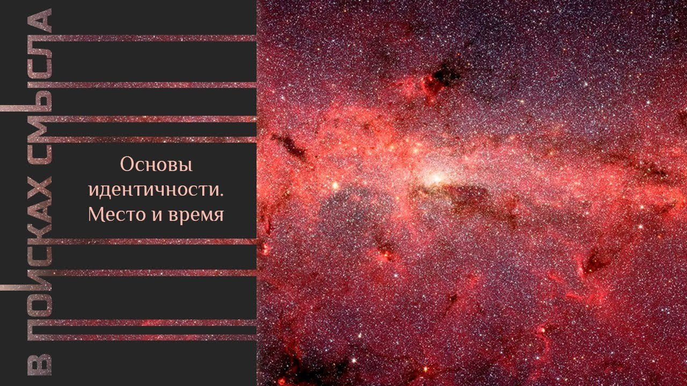

# Основы идентичности. Место и время

26 сентября 2023 [Аудиоверсия](https://paradoks-pinkera-pilotnyy-vypusk.simplecast.com/episodes/placeandtime) 29:52

Говорим о фундаменте любой личной идентичности - осознанной или неосознаваемой  интерпретации места своего рождения и своего времени.
О том, как возникают разные системы символов и знаков, определяющие групповую идентичность.

