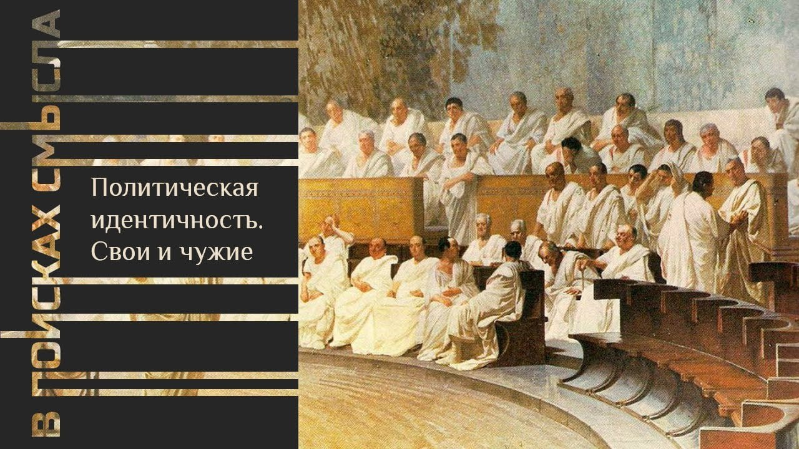

# Политическая идентичность. Свои и чужие

01 октября 2023 [Аудиоверсия](https://paradoks-pinkera-pilotnyy-vypusk.simplecast.com/episodes/political-identity) 34:30

Друзья и враги, свои и чужие – говорим об образовании политической идентичности, опираясь на труды классика политической мысли, Карла Шмидта.
Как и почему неизбежным следствием определения своей идентичности по месту и времени, становится обретение или отказ от политической идентичности? 
Стазис и Полемос, война за сакральные основы своей идентичности, предельная цена политической идентичности – готовность умереть за свои убеждения. 
Радикальное расширение поля политической идентичности с приходом «массового человека».



**Е.Голуб:**
Здравствуйте, друзья!
В эфире третий выпуск второго сезона подкаста «В поисках смысла» у микрофона Евгений Голуб и Павел Щелин.

**П.Щелин:**
Здравствуйте!

**Е.Голуб:**
Сегодня мы продолжим разговор об идентичности.
Если в прошлый раз мы затрагивали некоторые основополагающие факторы, те условия существования жизни человека, которые обуславливают необходимость и неизбежность его групповой идентичности, то сегодня мы продолжим тему и поговорим о политической идентичности.

**П.Щелин:**
Именно так.
Соответственно, у меня к тебе будет такой первый наводящий вопрос.
По-твоему, что является, собственно, отличительным свойством политической идентичности от всех остальных?

**Е.Голуб:**
Ну вот ты спросил.
Ну, в общем, политическая идентичность — это о мировоззрении, о некоторой картине мира.
То есть она является чем-то скажем так, условным.
Она не сообразуется с реальными, вещественными, природными штуками, такими как время, пространство.

**П.Щелин:**
Ну смотри, я рискну с тобой поспорить всё-таки немножко, потому что то, что мы с тобой описывали как раз в предыдущей нашей встрече, оно как раз было про данности, которые скорее отвечают на такую проблематику, как мировоззрение, про категоризацию мы.
Мы производили взаимосвязь между феноменом пространства, феноменом времени и тем, как мы позиционируем себя в этих самых феноменах, причем позиционируем на коллективном уровне.
Но, заметь, тогда политики толком не было.

Я обещал еще на прошлой встрече нашей, соответственно, ввести категорию политическую в эту историю.
И прямо скажу, буду здесь опираться не сколько на свои наблюдения, но на мысли некоторых выдающихся политических теологов, главным из которых, конечно, является Карл Шмидт.
Немецкий политический теолог XX века, он, наверное, наиболее четко, смело и честно сформулировал именно базовые отличительные черты, собственно, политического мировоззрения и политической идентичности.
Но все-таки попытаемся сначала оттолкнуться от некой данности.

Первая такая данность заключается в том, что есть не только мы, но есть и другие.
То есть, когда мы определяем себя как некое мы, одновременно с этим возникают некоторые другие.

**Е.Голуб:**
Мы и не мы, другие.

**П.Щелин:**
Да.
Тогда возникает вопрос, как можно строить отношения с этим самым не мы.
Какие у нас в принципе есть опции?

**Е.Голуб:**
Либо враждебные, либо кооперативные.

**П.Щелин:**
Правильно.
Либо враждебные, либо кооперативные.
Про кооперативные поговорим подальше.
Это очень интересный момент, как они возникают и какие пределы этой самой кооперации.
Но оттолкнемся от того, что ты сначала заметил - враждебные.

Так вот, Шмидт, собственно, и говорит о том, что специфически политическим является различение, к которому можно свести политические действия и мотивы.
А это различение друга и врага.
Он пишет потом, подобно тому, как в морали, собственно, вопрос о морали, это вопрос о добре и зле.
То есть, когда мы говорим о моральных вопросах, мы говорим о проблеме добра и зла.
То же самое, когда мы говорим о политике, соответственно, мы говорим о друге и враге.

Таким образом, можно сделать такой вывод, что политическая идентичность — это форма коллективной идентичности, которая в свою основу кладет различение на друга и врага.
Даже не просто на друга и врага.
Друга я бы уточнил как мы, то есть мы, друзья, и наши враги.
Вот, собственно, все политическое, сведенное к такой очень простой, чеканной в каком-то смысле и масштабной по своей красоте форме.

**Е.Голуб:**
Подожди минутку.
То есть ты сводишь всю политику к тому, что одна группа, объединённая пониманием то, что это свои, противодействует, противостоит всем остальным, которые являются чужими.
И всё.

**П.Щелин:**
Да.

**Е.Голуб:**
То есть то, что касается внутри этой группы, например, какие-то то, что мы называем внутренняя политика, здесь мы выводим за скобки.
Как это сюда отнести?

**П.Щелин:**
Внутренняя политика в таком контексте подразумевает подделение на тоже группы друзья и враги.
Здесь в чем состоит разница?

Политическая идентичность — это не единственная идентичность, которой живет человек.
Это надо понимать.
И вот это как раз инструментальная мудрость шмидтовского определения, если мы его не абсолютизируем.

Если, конечно, мы абсолютизируем, как это часто делают современные гностики, и это следствие марксистского проекта, о котором мы будем говорить в дальнейших выпусках нашего подкаста, которые, по сути, делают всю жизнь человека, все идентичности человека политическими идентичностями.
У тебя пол становится политической идентичностью, у тебя там, не знаю, команда, за которую ты болеешь, становится политической идентичностью и так далее и тому подобное.
А идентичностей много, на самом деле, как мы с тобой знаем.

Но среди них есть и специфически политическая идентичность.
И вот в той мере, в которой эта политическая идентичность работает, это про определение друга и врага.

**Е.Голуб:**
То есть, другими словами, ты вводишь такое понятие, или ты, или Шмидт, я не берусь сказать, о том, что политика — это всегда про своих и чужих, и всегда про то, как с ними взаимодействовать.
И прежде всего, это всегда про то, кто такие свои, наверное.
Потому что для того, чтобы бороться с чужими, нужно определить, кто свои.

**П.Щелин:**
А вот здесь как раз и наступает интересный момент, потому что здесь как раз можно со Шмидтом спорить.
По Шмидту как раз враг скорее первичен, если мы будем это обсуждать, ну, на полном серьезе.
По Шмидту скорее мы определяем себя через нашего врага.

Если мы будем читать весь полный текст Шмидта, то именно враг является в каком-то смысле первичной его данностью.
Сначала мы столкнулись с нечто враждебным, чужим, чужеродным, и через это мы определили сами себя.
Но как мы с тобой обсуждали на нашем предыдущем выпуске, я скорее с этим определением не согласен.
На мой взгляд, первичный именно мы.

Мы сначала объединяемся вокруг некого символа, мы сначала определяемся вокруг некого феномена, сакральности, мы сначала позиционируемся во времени и пространстве, а уже потом, как следствие, возникает в политическом измерении деление на друга и врага.
Это уже идёт следствием.
Для меня политическая идентичность в этом смысле всегда по определению является вторичной идентичностью по отношению к мировоззренческой идентичности.

**Е.Голуб:**
Ну да, просто в прошлый раз мы говорили, что место и время порождают картину мира.
И если эта картина мира у нас общая, то мы в той или иной степени близости свои.
И те, кто с нами эту картину мира, это понимание времени не разделяет, то это как минимум другие.
Далее идут чужие, а еще дальше идут враги.

**П.Щелин:**
Да, они становятся врагами, если наши отношения по какой-то из причин становятся политическими отношениями.
В той мере, в которой как только они становятся нашими врагами, это возникает вопрос о политике.
Но это не всегда является необходимостью.

Это, повторюсь, частный случай, хотя действительно очень распространенный и привлекающий очень большое внимание в силу того, что это происходит, наверное, самым интенсивным образом и с привлечением наибольшего количества ресурсов.
Это вот такое следствие.

Если позволишь, я зачитаю еще одну цитату Шмидта, которая поможет нам прояснить некоторые моменты.
Она действительно очень красивая, и она позволяет.

> Смысл различения друга и врага состоит в том, чтобы обозначить высшую степень интенсивности соединения или разделения, ассоциации или диссоциации.
> Это различение может существовать теоретически и практически, вне зависимости от того, используются ли одновременно все эти моральные, эстетические, экономические или иные различения.
>
> Пусть политический враг не будет морально зол, пусть не будет он эстетически безобразен, не должен он непременно оказаться хозяйственным конкурентом, а может быть даже даже обнаружится, что с ним выгодно вести дела.
> Он есть именно иной, чужой.
>
> А для существа его довольны и того, что он в особенно интенсивном смысле есть нечто иное и чуждое.
> Так что в экстремальном случае возможны конфликты с ним, которые не могут быть разрешены ни предпринятым заранее установлением всеобщих норм, ни приговором непричастного и потому беспристрастного третьего.

То есть это именно отдельная категория, которая является частным случаем полноты, если тебе угодно, человеческой жизни, полноты идентичностных картин мира.
И вот, да, соответственно, одной из них по такой категории является политика.

**Е.Голуб:**
Мне всё-таки кажется, что твоё определение о политике, оно отличается от, по крайней мере, общеупотребимого или от употребимого в повседневной жизни.

**П.Щелин:**
Смотри, нет, еще раз.
И это немножко тоже разные вещи.
Политика-то это другое немножко, действительно.
Но политическая идентичность оказывается именно эта.
То есть мы все-таки опираемся на данность.

**Е.Голуб:**
Мы рождаем новую категорию политической идентичности.

**П.Щелин:**
Не мы рождаем, мы ее просто рассказываем скорее слушателям.
Но это правда, потому что в политике уже возникают другие вещи, хотя все они на самом деле, на мой взгляд, тесно увязаны как раз именно с проблематикой «свой-чужой».

На мой взгляд, действительно, политика — это про «свой-чужой», но более конкретный случай — это именно борьба за власть в контексте существования своих и чужих.
Это мы боремся за власть, если совсем упрощать, что такое политика.
И в этой борьбе есть чужие.

**Е.Голуб:**
Но если мы не боремся, а просто осознаем, что вот это свои, а это чужие, если мы с ними вообще никак не взаимодействуем, может быть такое или нет?

**П.Щелин:**
Может, но смотря где.
Смотри, во-первых, если мы рассматриваем внутри того или иного сообщества, и мы не боремся за политическую власть, то мы просто выводим себя из политики.

Мы можем вывести себя из политики, но тогда мы делегируем часть своей субъектности тому, кто эту власть распределяет.
Это своеобразного рода обмен.
Вполне допустимо, на мой взгляд, вполне логично, осмысленно, когда то или иное сообщество не участвует в политической жизни, осознанно принимая риски того, что в каком-то смысле его судьба может быть решена, соответственно, другими участниками политической жизни, которые принимают на себя всю вот эту изнанку, которой является вот эта форма борьбы и форма конфликта.

**Е.Голуб:**
Ну, под политической жизнью, похоже, ты подразумеваешь политическую борьбу, потому что другой формы жизни здесь не просматривается.

**П.Щелин:**
В политике — да.
Это борьба за то, кто принимает решения в той или иной мере.
Политика существует там, где есть борьба за право принятия решения.

**Е.Голуб:**
Ну, за власть.

**П.Щелин:**
За власть.
Власть — это способность принимать решения.

**Е.Голуб:**
Способны-то многие, но далеко не каждое решение принимается всеми остальными как необходимое к исполнению.
Поэтому всё-таки власть.

**П.Щелин:**
Давай поговорим об этом немножко, потому что, мне кажется, здесь ты немножко путаешь.

**Е.Голуб:**
Ну подожди, но я тоже способен принимать решения.
И что?

**П.Щелин:**
Смотри, и в той мере, в которой ты способен принимать решения, ты обладаешь властью.
Вот твоя зона власти, твое поле власти.

**Е.Голуб:**
Я могу принять решение, но кто-то должен его исполнять.
Если я принял решение, а никто его не исполняет, то...

**П.Щелин:**
Ну, тогда это не решение.
То есть я имею в виду, конечно, что если ты принимаешь решение, то ты имеешь возможность его привести в жизнь.
В противном случае ты можешь только говорить о том, что ты какие-то решения принимаешь все-таки.

**Е.Голуб:**
Я как зануда так сформулирую.
Мы говорим о способности принимать решения, обязательные к исполнению другими людьми.
И от масштаба этих решений зависит масштаб власти.

**П.Щелин:**
Да, ну или, можно сказать, обеспечивать его исполнение в той или иной форме.
И, соответственно, масштаб власти зависит именно от этого.

Можно тут уже как раз сразу вспомнить огромное количество различных политических, философских наблюдений о том, как человеку властвовать над самим собой.
Собственно говоря, как принимать решение и заставлять самого себя это решение производить, как заставлять его самого выполнять.
Точно так же есть поле власти внутри семейных отношений, внутри любой коллективности.

Но высшей формой, то есть на уровне все-таки политического сообщества, где начинается политика, это право принимать решение на уровне всего политического сообщества, которое все сообщество должно тем или иным образом исполнить.
То есть это вот высшая форма политической власти.
Соответственно, то, что приходит на наше воображение, когда мы говорим о политической власти — это именно борьба за право принимать решения для сообщества целиком.
Ну, то есть, условно говоря, когда король дает приказ «собираемся, пошли на войну», то есть, условно говоря, вот кто пошел на войну, вот этот приказ исполнять, вот его зона.

И, условно говоря, борьба за королевский престол — это борьба за право, условно, определять такие решения.
И в этой борьбе, соответственно, возникают политические партии, именно не в смысле современном, а в смысле функциональном.
То есть, политическая партия — это группа людей, борющихся за власть.
Или борющаяся за то, чтобы обладать возможностью принимать решения и навязывать их исполнение.
Примерно такае понятная функциональная вещь.
И в рамках этой зоны существуют политические идентичности.

**Е.Голуб:**
Хорошо.
Если вернуться к политической идентичности и поговорить больше об этом, то как происходит это отождествление с той или иной группой, свои и чужие?

**П.Щелин:**
Прекрасный вопрос.
Зависит, мне кажется, от уровней.

Здесь нужно сделать небольшое, конечно, отступление и посмотреть на тот уровень, в котором мы находимся.
Потому что неприятным политическим...
То есть, опять-таки, Шмидт был выдающимся человеком, но, конечно, никто из нас не является откровением в полной мере этого слова.
Так вот, политическая борьба, на мой взгляд, вот в рамках этого всего идентичностного подхода, может вестись в двух принципиальных полях, если тебе это угодно.

Поле первое — внутри нас, и поле второе — с чужими.
Вот это принципиально разная вещь.
Греки очень хорошо это определяли через, соответственно, с одной стороны стазис, как внутригражданскую политическую войну, хаос, и полемос — войну с чужими, с варварами.
И, соответственно, вот у тебя две разных принципиальных ситуации.

Если говорить о борьбе внутри нас, то это связано с определённой иерархичностью бытия.
Как бы мы ни крутили, какое бы мы сообщество ни создавали, но как только мы проходим некоторый уровень, ну, допустим, давай опять оттолкнёмся от базовых данностей, от племени.
Наше любимое воображаемое племя.
Из чего состоит племя?

**Е.Голуб:**
Из родов.

**П.Щелин:**
Правильно, из родов.

С одной стороны, есть некое общее поле «мы», то есть все «мы» племя, и у нас, условно говоря, есть один общий тотемный бог.
Но в то же время внутри этого племени мы подразделены на роды.
То есть моя категория «меня», она иерархична.
Я одновременно и часть племени, и часть определенного рода.
И, допустим, наши рода ведут политическую борьбу.

И тогда мое отождествление, кто является для меня мы, а кто является для меня они, в рамках этой внутри нас политической борьбы, очень простое.
Я часть этого рода, соответственно, этот род — это я.
Моя политическая идентичность отождествляется с политической идентичностью этого рода, и мы ведем борьбу.
Но в чем отличие?

До тех пор, пока на самом деле борьба идет внутри нас, возможны позитивные опции и, я бы сказал, позитивные сценарии.
Одним из позитивных сценариев является то, что мы можем эту войну вести по определенным правилам.
Условно говоря, мы можем в нашей внутри племенной политической борьбе не вырезать всех до основания.
Мы можем какие-то пытаться устраивать договоренности.
Почему мы можем это делать?

А можем мы это делать именно потому, что у нас есть какая-то общая система координат и общее мировоззрение.
Вот это более общий уровень мы на уровне племени.
У нас есть хоть какая-то система знаков, смыслов, понятий, истории, которая позволяет нам хотя бы теоретическую возможность проводить эту борьбу некоторым иным способом, без достижения предельной радикальности.
И здесь, опять-таки, я бы со Шмидтом спорил, потому что по Шмидту настоящая политическая борьба она всегда предельна.

**Е.Голуб:**
До уничтожения?

**П.Щелин:**
Ну, она до права введения чрезвычайного положения.
У него это такая формулировка.

Суверен по Шмидту это тот, кто определяет чрезвычайное положение.
Он был юристом, поэтому у него очень сильная, скажем так, вот эта проблематика, кто имеет право остановить закон.
Вот у него очень принципиально важный вопрос.

Есть закон, он вроде как бы действует, но по Шмидту именно реальная власть, когда ты можешь останавливать закон.
Юридическое мышление, повторюсь, у человека было.
Поэтому вот это все сильно связано.

Для меня здесь важнее именно то, что этой радикальной предельности в борьбе внутри нас нет, именно потому что радикальная предельность, она достижимая и возникает только, когда мы говорим о смысле сакральном, о смысле первичном и, если угодно, о категории истины.
Вот там наступает радикальная предельность.
А внутри нас такой необходимости нет.
В каком-то смысле все такие проблемы внутри нас, они идут именно до той поры, пока мы рассуждаем о каких-то материальных вещах, если тебе угодно.
Но мы боремся за власть, чтобы принять определенное решение, у кого золота будет больше.
Ну, если так упрощать.

Но при этом же абсолютно, почему внутриполитическая борьба может быть абсолютно предельно кровавой, почему вот образ древнегреческого корабля, чего боялись древние греки на своем корабле в океане хаоса из предыдущего выпуска, это когда в нашей внутриполитической борьбе мы начинаем разрушать общий сакральный смысл, или начинаем формулировать иной сакральный смысл, или предлагаем настолько радикальную интерпретацию, что вот это общее поле нас, оно разрушается.

Условно говоря, можно сказать, что проблема любого стазиса не в том, что он существует.
Как раз стазис, на мой взгляд, это естественная состояние общества.
Проблема в том, что стадис может в любой момент превратиться в полемос, разрушая ваше вот это общее основание, если вы это допустите.
Вот так я это сформулирую.

**Е.Голуб:**
Ну, есть над чем подумать.

**П.Щелин:**
Понимаешь?
Это я монологично немножко начал.

**Е.Голуб:**
Ну, давай продолжим.
Я хочу услышать продолжение.
Окей, хорошо.

**П.Щелин:**
А продолжение заключается в том, что есть второе поле.
А вот второе поле, оно чистый полемос.
Это с чужими.

И вот там вообще никакого мира быть не может.
Потому что сообщества могут определять, не могут договариваться о истине.
Вот это принципиально важный момент.
Разные мировоззрения, разные мы.

Мы можем обсуждать что угодно, но мы не можем обсуждать сакральные основания собственного бытия с чужими.
И у нас даже общей системы координат с ними нет.

**Е.Голуб:**
Послушай, я же моментально это всё вывожу в какие-то понятные мне ближайшие аналогии.

**П.Щелин:**
Конечно.

**Е.Голуб:**
И тут напрашивается, конечно же, тема нашей войны трагической, которая сейчас происходит.
И что же получается?

Что вот по прошествии некоторого количества лет, по прошествии лет сознательной индоктринации одно и другого сообщества в определённых сакральных смыслах, эта степень чуждости, реальная или воображаемая, дошла до такой степени, когда уже только война являлась ответом на преодоление вот этой политической необходимости разделиться.
Речь идёт о том, что война возникает, этот полемос возникает, когда нет возможности, когда возникает эта чуждость, когда сакральные смыслы отличаются принципиально и несовместимы друг с другом.

**П.Щелин:**
И при этом есть политический конфликт.
Исходя из базовой проблематики, до тех пор, это все возвращается к вот этой нашей очень болезненной теме, которая связана с тем, что мир невозможен.
Единственная цена мира без войн — это единая глобальная тотальная диктатура с единой идентичностью в глобальном смысле.
Или остановленная история в таком вот метафорическом ключе.
А до тех пор политическая конфликтность неизбежна.

И, соответственно, да, то, о чем ты говоришь.
Условно говоря, цена за выход из общего смыслового поля, сакрального, это то, что война между вами может происходить только по категории полемоса, только по категории политической борьбы предельной.
И тут проблема просто в том, насколько вы это осознаёте.

**Е.Голуб:**
Тогда получается, что война между носителями условно набора ценностей российского общества и набора, который близок к украинской идентичности, как она сформулирована в последнее время, она была неизбежна.

**П.Щелин:**
Да, в тот момент, когда, условно говоря, возникла логическая конструкция, что украинской идентичности, ее интегральной частью является принципиальный выход из некоего общего сакрального смыслового поля, частью которого и основным носителем которого считает себя Россия, то вот эта военная конфликтность была имплицитно в этом заложена.

Я не уверен, что те люди, которые проводили эту политику или стремились к этому, понимали, намеренно закладывали такую интенцию, но это объективная реальность.
Потому что, повторюсь, в чем возникает проблема, политические-то конфликты остаются, реальные политические противоречия никто не снимал, более того, мир более большой.
Тут же накладывается еще то, что есть политическое различение на друг и враг на глобальном уровне, по крайней мере, оно должно быть, то есть как бы тогда получается, если ты, условно говоря, базовая идентичностная конструкция.
Если ты не часть нас, еще хуже, если ты бывший мы, который решил перейти на категорию врага, то что с тобой делать?

Это базовые идентичностные проблемы, они нерешаемы.
И здесь решением является только война.
И что война покажет?

В истории это чаще всего и было.
То есть война проверяет, если тебе угодно, валидность ваших идентичностных заявлений.

**Е.Голуб:**
Ну, а сам факт войны не подтверждает валидность этих заявлений?

**П.Щелин:**
Он подтверждает, с одной стороны, валидность заявлений, но тут есть тонкости.
Понимаешь, одно дело о чем-то говорить, другое дело быть готовым за что-то умирать и вопрос, насколько долго и так далее.
В истории же множество огромных примеров.
Большинство политических идентичностей в истории исчезли.

Еще раз.
То, что вы заявляете политическую идентичность и готовы за нее умереть, не гарантирует вам выживания.
Это тоже базовое противоречие.
То есть это всегда определенный риск.

Вопрос о том, что вы, вкладывая вот в эту политическую идентичность такой особый смысл, вот здесь Шмидт прав, в пределе должны быть готовы за нее умирать.
В тот момент, когда вы начинаете в политике именно играть в политику, определяя себя через друга-врага по отношению к чему-то, вы должны очень хорошо понимать контекст, с кем вам придется за это воевать.

**Е.Голуб:**
Ну, или скорее то, что определяя себя как политическую идентичность, вы должны быть готовы умирать за нее в любом случае.

**П.Щелин:**
Да.

**Е.Голуб:**
То есть это игра с очень высокими ставками.

**П.Щелин:**
Да.
И здесь, конечно, наступает огромное количество в современной реальности проблем, потому что в игру играют одни, а умирают другие.
Это очень частая проблема, которая, скажем так, сейчас достигает особого пика и накала.
Хотя в пределе, на самом деле, это все-таки общее правило работает.

Политика — такое особое свойство, то, что на высших уровнях, в том числе на уровнях элитных, элита не является чем-то подсудным на самом деле, но там убивают.
Вот если мы будем смотреть на все-таки большую часть основной истории, одним из достоинств элиты то, что действительно по обычным правовым нормам очень редко вам удастся кого-то засудить.
Можно, но в этом контексте ваша политическая элита, скажем так, использует правовые нормы просто для прикрытия этой борьбы.
Понятно, что судят его не за то, что он совершил, а за то, что он проиграл в элитной борьбе.
Это просто своего рода форма наказания.
Но чаще всего в истории просто убивание.

Перевороты, заговоры, яды, элитные чистки, вот это все такое мероприятие.
Это действительно, если вы будете смотреть на историю, прямой фон, на котором происходит любая внутриэлитная борьба.
А это именно свойство политического, потому что это радикальное действительно разделение на друга и врага.

Лучше, на мой взгляд, конечно более, скажем так, полезно для сообщества, когда вы умудряетесь свою политическую борьбу удерживать в рамках некого общего понимания мы и ваш стазис использовать для, если угодно, ну, некого такого политического ристалища, вот такой формы турнира, форма ристалища, где, конечно, есть цена потери, там финансовая, там, может быть, репутационная и прочее, но в конечном итоге это приводит к постоянному внутриэлитному обновлению внутри вас.
Таким образом, вы как бы, по идее, должны генерировать внутри себя лучшую политическую элиту.
Хотя внутри себя вот этот риск предельной смертности, конечно, всегда существует.

Но на международном уровне просто вот что происходит, это вот уровень международный действует, к сожалению, по правилу такому гораздо более жесткому.
В тот момент, когда вы, выводите свою политическую идентичность из-под чужой политической идентичности или радикальным образом формулируете свою новую политическую идентичность, в этот момент вы оказываетесь в поле отношений друг-враг, в которых правила игры радикально другие.
То есть очень важный момент.

Нельзя ожидать то, что вы можете свободно заявить о своей политической идентичности, радикально ее сменить, и вам за это ничего не будет.
Вот этого нельзя делать.
Ну, это просто наивность.

**Е.Голуб:**
Постоянно обращаюсь сейчас к истории.
Что можно сказать?

Национальные идентичности, которые являются политическими на самом деле, они не носят никакой другой характер.
То есть в них нет ни природной, ни естественной, основания под этим нет.
Это есть политическая идентичность, которая конфликтна, предельно конфликтна, как показывает история, начиная с XIX, тем более XX век.

Дальше.
Политическая идентичность, идеологическое.
Нацизм, то, что называлось большевизм, что еще?
Фашизм, если говорить о политической идентичности.
Это ведь политические идентичности.
И они именно конфликтные и обреченные на конфликт.

**П.Щелин:**
Они обречены на конфликт, более того, тут именно мы вступаем в эту проблематику, которая тоже повторяющаяся тема нашей современности, чем она отличается.
Это проблема радикального расширения политической идентичности на все общество.

Помнишь, в самом начале я же сказал, на самом деле у вас нет обязательного долга всем играть в политическую идентичность.
То есть политическая идентичность — это не вся полнота жизни, совсем не вся полнота жизни.
Проблема в том и возникает, что в истории с приходом массового человека, так или иначе, или с подготовкой к приходу массового человека, политические идентичности, на мой взгляд, себе отгрызли и отжали радикально большее пространство, чем им принадлежит.

А при этом правила игры вы изменить не можете.
Вот это правило предельности политической идентичности, её экстремизма в плане друг-враг, вы никуда её убрать не можете.
То есть вы осознанно или неосознанно вот эту предельность расширили на всё сообщество.

**Е.Голуб:**
То есть раньше политическая идентичность конструировалась по признаку общего языка, каких-то традиций, мы говорим о национальной идентичности, приверженности идеологии, мы говорим о идеологической идентичности, политической.

**П.Щелин:**
Уточни, когда раньше, потому что я немножко забыл, я думал, это до модерна.
До модерна она конструировалась на принципе личных обязанностей.

**Е.Голуб:**
Нет-нет, я сейчас имею в виду историю последних 200 лет.
Сейчас в это поле вошли идентичности, ставшие политическими, которые до сих пор не были такими, да?

То есть идентичности сексуальных предпочтений, идентичности каких-то конструированных идентичностей, извините, и они становятся политическими и начинают вести себя как всякие политические идентичности, то есть агрессивно очерчивая круг свой-чужой и, соответственно, предельно агрессивно выгрызая право принимать решения.

**П.Щелин:**
Смотри, тут же в чем еще хитрый фокус, то, что ты, в принципе-то, любую идентичность можешь сделать политической.
Ты можешь на категории марок сделать себе политическую идентичность, если ты объявишь, что позиционный клуб филателлистов — это враги, их надо уничтожить.
Или вы боретесь за одну власть.

В принципе, вот политическая идентичность, вот чем мне нравится именно шмидтовское определение, оно довольно инструментально.
Она как раз очень такое, если на тебя угодно, технологичный вопрос.
В принципе, можно сделать любую идентичность политической идентичностью.

**Е.Голуб:**
Ну, хорошо.
Каким образом?
Давай договорим до конца.

Чтобы сделать любую идентичность политической, нужно...

**П.Щелин:**
Нужно сделать так, что та группа, которая по одну сторону этой идентичностью как бы властью обладает или на самом деле властью обладает, то есть имеет право определять решение и определять нечто для всего сообщества, а по другую сторону не обладает.

**Е.Голуб:**
Еще раз.
Я группа филателистов.
Все вокруг не филателисты.
Меня это начинает беспокоить.

**П.Щелин:**
Но я буду определять, как им жить.

**Е.Голуб:**
Я хочу определять, как им жить.
Начнем с этого, да?

И ради этого я буду бороться за власть, за право принимать решения.

**П.Щелин:**
На основании того, что ты филателист.
И в качестве легитимизации твоего права на власть ты будешь использовать категорию филателизма.

**Е.Голуб:**
Как признака некой отличной группы, которая имеет право определять жизнь других.

**П.Щелин:**
Да.

**Е.Голуб:**
Хорошо.

**П.Щелин:**
И в рамках этой борьбы, и, соответственно, как только ты оказываешься в этом процессе, у тебя автоматически возникает деление на друга и врага.
Те, кто с тобой в этой борьбе, и те, кто против тебя в этой борьбе.

**Е.Голуб:**
А как быть с временными союзниками?

**П.Щелин:**
Ну, временные союзники на то и временные.
То есть это именно такое тонкое понимание, что мир невозможен, возможно перемирие.

Лучший пример настоящего политика, это, конечно, из современных и известных политических деятелей, это президент Турции Рэджеп Эрдаган.
Благодаря ему возникла великолепная цитата, которая отражает суть политической борьбы.

> Нет той спины, в которую не воткнул бы свой кинжал друг Эрдаган.

**Е.Голуб:**
Когда приходит нужное время.

**П.Щелин:**
Да.
Политическая идентичность — это вообще очень грустная картина.
И как раз, на мой взгляд, одна из проблем массового общества, прямо скажу, то, что она эту политическую идентичность радикально расширяет на людей, на сообщества, на категории, которые вообще к ней, на мой взгляд, отношения-то иметь и не должны.
Вот если уж моё мнение тебе интересно.

**Е.Голуб:**
Так, немножко о грусти.
Это грустно было всегда или стало грустно в последнее время?

**П.Щелин:**
Особенно грустно стало, как начали со времен Великой Французской революции проводить эксперименты по национальному государству, на мой взгляд.
Потому что именно тогда возникает вот эта идея, то, что народ является источником власти на таком масштабном уровне.
Так это, конечно, началось еще в 16 веке с Боденом.
Философ такой, французский.

По сути именно после 18-го, 19-го и 20-х веков — это то, что возникает массовое общество, возникает массовый человек, это совмещается с идеей демократии, и у тебя возникает то, что в политику вовлечены все.

**Е.Голуб:**
В политику как в борьбу за власть?

**П.Щелин:**
Да, очень тонкий момент - имплицитно вовлечены все.
Реально нет, но по степени накала и по степени той предельной ответственности, которая возлагается на человека, все.
То есть власти-то у тебя, может быть, и нет никакой, как у части народа, а отвечать как народ ты будешь вот в этой предельной борьбе.

**Е.Голуб:**
Отвечать за ценности той группы, которая добилась власти.

**П.Щелин:**
Да.

**Е.Голуб:**
То есть если ты не принадлежишь к этой группе, то ты отвечаешь по праву побежденного, да?
А если принадлежишь, как по праву заявившего о своей принадлежности и готового за эти ценности умирать.

**П.Щелин:**
А тебе даже заявлять не надо, тебя даже спрашивать никто не будет.
Паспорт вручен, и все.
Понимаешь?

**Е.Голуб:**
Паспорт — это вопрос гражданства.

**П.Щелин:**
А гражданство — это политическая идентичность.
Любое гражданство — это политическая идентичность.
В современной категории право гражданства очень тесным образом связано с политической идентичностью, потому что чем гражданин отличается от не гражданина?

Он имеет право голоса.
Граждане являются источниками власти в рамках современных политических систем.

**Е.Голуб:**
То есть независимо от того, за кого ты голосовал и каких политических предпочтений ты придерживаешься, просто по факту принадлежности к гражданству...

**П.Щелин:**
Для внешнего.

То есть внутри вас, потому что у тебя есть гражданство.
Гражданство делает тебя включенным во внутри-нас политическую борьбу.
И тем самым, вне зависимости от итогов этой внутри-нас политической борьбы, для внешнего наблюдателя ты являешься ее столь же полноправным участником, как, я не знаю, президент.
Вне зависимости от твоего решения.
По формальным критериям.
Формальной же разницы нет никакой.

**Е.Голуб:**
Трудно с этим согласиться, но так же сложно, как возразить.
Потому что как-то мне неохота отвечать за всю политическую идентичность своего гражданства.

**П.Щелин:**
Мне тоже.
Мы можем это возразить на тему того, что оно так реально не работает, но проблема в том, что оно так по дизайну сейчас сделано, и оно функционирует.
Просто мы можем возражать на тему того, что это лицемерная ложная система, которая создает проблемы, но тем не менее, как объективные наблюдатели, мы должны ее фиксировать и описывать в том виде, как она есть в настоящий момент.

**Е.Голуб:**
Ну хорошо, то есть чем мы сможем завершить?

Граждане, если вы думаете, что у вас нет политической идентичности, то вы глубоко ошибаетесь, у вас она есть.
Тогда, а может быть несколько политических идентичностей?
Мне кажется, что может быть.

**П.Щелин:**
Вот в том-то и проблема.
То, что очень хочется, чтобы было, но на самом деле нет.

**Е.Голуб:**
Поясни.

**П.Щелин:**
Это как бы следствие вот этой идеи гражданина мира.
То есть попытка, знаешь, вывести всю политическую борьбу за скобки.
Что, дескать, все вот эти граничные развлечения не важны.
Есть только одно глобальное общечеловеческое «мы».
Это прямое следствие вот этого, скажем так, мечты.

Но, как мы с тобой уже проговаривали неоднократно, никакого глобального общечеловеческого "мы" не существует.
Мы по-прежнему именно существуем в принципиально разных историях, пространствах и мировоззрениях.
Поскольку этого нет, соответственно, остается вот это деление.
То есть ты, условно говоря, вопрос, чьих будешь, и в тесной связи с вот этим политическим.

На чьих выборах ты имел право голосовать?

Давай так сформулируем.
В современных реалиях это так.

**Е.Голуб:**
Хорошо, довольно сильно все, что ты говоришь, не вяжется с расхожими представлениями о том, что такое политическая идентичность.
Об этом, я думаю, стоит подумать, задаться вопросами и задать их, может быть, в офлайн.
Но мне бы хотелось в продолжении или завершении разговора задать другой вопрос.

Ну вот хорошо, допустим, мы с политической идентичностью худо-бедно разобрались, по крайней мере, в том, как ее представлял Шмидт и то, как ты ее сейчас развернул.
А какие еще идентичности мы будем разбирать в дальнейшем?

**П.Щелин:**
Ну, во-первых, все-таки мы продолжим, скажем так, разбирать политическую идентичность на нашей следующей встрече, потому что там есть интересные особенности, которые мы не затронули.
Объясню, какую.

Сразу скажу, мы будем говорить о том, что открыл Ибн Хальдун.
Это вот этот известный арабский политический теоретик, и он очень хорошо показал, как политическая идентичность реально работает изнутри, именно изнутри процесса.
На тот случай, чтобы понимать вот не то, как оно себя представляет, а то именно технически, как происходит работа, и нам будет лучше понятно заодно, чем изначально являлось в каком-то смысле национальное государство, помимо прочего.
И почему оно было обречено и будет обречено на провал.

То есть подход Хальдуна нам позволяет лучше разобраться в тех иллюзиях, мне кажется, в которых у тебя до сих пор есть определенное чувство напряжения.

**Е.Голуб:**
Точно.
Напряжение есть, но Ибн Хальдун — это какие времена-то?

**П.Щелин:**
Это XIV век.

**Е.Голуб:**
А Карл Шмидт, если я понимаю, это XX.

**П.Щелин:**
Двадцатый.
А разницы никакой.

Понимаешь, в той мере, в которой исследователь описывает реальность, реальность не сильно меняется.
Это я уже где-то в нашем с тобой чате советовал некоторым вопрошающим, что прежде чем изучать любую политическую философию, прочтите Экклезиаста.

```
Что было, то и будет.
И нет ничего нового под солнцем.
```

**Е.Голуб:**
Всё суета cует и всяческая суета.

**П.Щелин:**
Всё суета.

Поэтому, на самом деле, вот в той мере, как кому-то удавалось открыть какое-то свойство данности, политической, социальной, мировоззренческой, человеческой, природной, оно неважно, в каком веке написано, оно работать будет и будет продолжать.
Это, наверное, одно из самых утешительных и выдающихся открытий.

**Е.Голуб:**
Я просто к тому, что, может быть, логичнее было начать с Хальдуна, а потом перейти к Шмидту.

**П.Щелин:**
Хальдун — более частный случай.
Все-таки Шмидт говорит о политической идентичности как таковой.
Я бы так сформулировал.

А Хальдун, он говорит немножко как бы изнутри.
Пока мы на политическую идентичность немножко посмотрели извне, а вот с Хальдуном мы на нее посмотрим изнутри.

**Е.Голуб:**
Хорошо, тогда, я думаю, на этом мы можем сегодня завершить.
Поблагодарим Павла и Карла Шмидта.
Останемся с вопросами по поводу политической идентичности.
Ну и будем готовы разобраться с тем, о чем нам расскажет Павел и Ибн Хальдун.

**П.Щелин:**
Да, именно так.

**Е.Голуб:**
Спасибо, друзья.
До следующей встречи.
