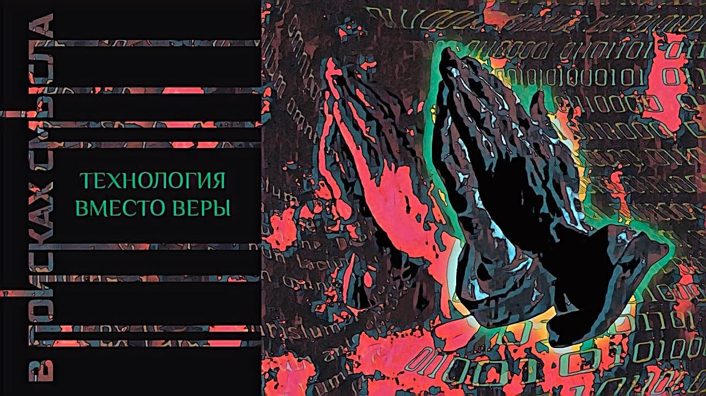

# Технология вместо веры

28 октября 2023 [Аудиоверсия](https://paradoks-pinkera-pilotnyy-vypusk.simplecast.com/episodes/technology-instead-of-faith) 24:57

История появления симулякров веры.
Вестфальский мир закрепил положения Аугсбургского компромисса, положив начало постепенного превращения веры в технологию, а Великая Французская революция продемонстрировала возможности конструирования смыслов - государственной идеологии - в мобилизации общества.

