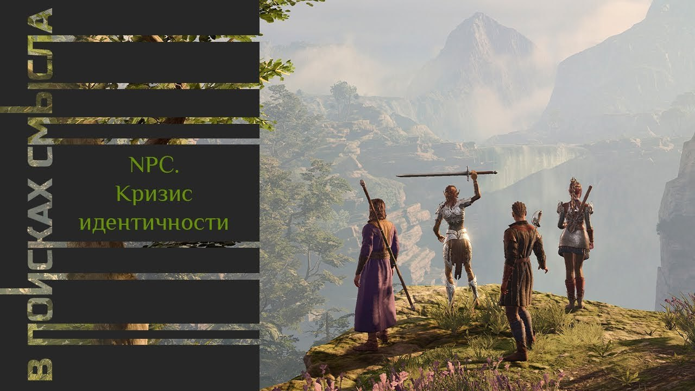

# NPC.Кризис идентичности

14 октября 2023 [Аудиоверсия](https://paradoks-pinkera-pilotnyy-vypusk.simplecast.com/episodes/the-crisis-of-identity) 30:50

Почему многие из нас стали ощущать себя, NPC - (non-player character) – неигровыми персонажами в чужой компьютерной игре?
Когда произвошел перенос практик идентичности из "реальности" в "виртуальность".
Трагедия человеческой личности, низведенной в  производное от технологии.

На пустоту и бессмысленность жизни пеняли еще «лишние люди» в литературе XIX, но с тех пор многое изменилось.
Говорим о «виртуальности» современности и «реальности» мира прошлого, о тираническом начале любой укорененности, и об общинности, как необходимом условии сохранения традиции.
Приходим к выводу о неизбежном саморазрушении личности, как итоге ее освобождения от «тирании» традиции.

**Е.Голуб:**
Здравствуйте, дорогие друзья!
В эфире пятый выпуск подкаста «В поисках смысла».
Во втором сезоне мы говорим об идентичности.
У микрофона Евгений Голуб и Павел Щелин.

**П.Щелин:**
Здравствуйте, уважаемые слушатели!

**Е.Голуб:**
Сегодня речь пойдёт о кризисе идентичности.
Павел, почему мы можем говорить о том, что в понятии идентичности наступил некоторый кризис?

**П.Щелин:**
Ну, ты прям сразу с места в карьер.
Сначала, я думаю, нужно дать контекст.

Контекст заключается в том, что в рамках нашего подкаста мы подходим примерно к середине сезона.
И в первых сезонах мы заложили некоторую такую, я бы сказал, теоретическую базу, прослушав которую, я думаю, уважаемые слушатели могут сформировать более полное понимание всей проблематики идентичности, в том числе связанной с ее неизбежностью.
И поэтому логично сейчас, в момент Рубикона, понимая, обладая теоретической базой, все-таки посмотреть на то, что происходит сейчас.
И перейти таким, как через Рубикон, через серединку, к вопросу о том, как мы дошли до жизни такой.
Но чтобы перейти к вопросу о том, как мы дошли до жизни такой, надо посмотреть, что, собственно, с этой жизнью не так.

И, на мой взгляд, конечно, я отталкиваюсь в основном от опыта стран в широком смысле христианских, я прямо скажу.
То есть это США, Западная Европа, Восточная Европа, Украина, Россия.
Ключевая проблематика заключается в том, что один автор YouTube-канала, назвал очень четкой, на мой взгляд, метафорой пустота и искусственность современной жизни.

Чувство невидимости, бессмысленности и одиночества, которое овладело, ну, в основном, молодыми людьми, людьми моего возраста.
То есть в основном это поколение миллениалов и поколение джинзи.
И то чувство потерянности, то чувство сомнения, то чувство перекати поля, которое доминирует в современном обществе среди вот этих самых поколений.

**Е.Голуб:**
Не преувеличиваешь ли ты?
Со времён Тургенева ощущение пустоты, бессмысленности жизни хорошо описано.
Почему именно сейчас наступил какой-то особенный кризис в этом среди молодых людей?

**П.Щелин:**
Вопрос великолепный, и для этого нужно опять делать некоторые наблюдения.
Опять мы говорим про вектора, с одной стороны, а с другой стороны мы говорим про, я бы сказал, масштабы проблемы.
Действительно, можно сказать, что проблема бессмысленности жизни все время присутствует в человеческом дискурсе.
Уж простите за это слово.
Правильно, пример Тургенева, который это произвел.
Но никогда проблема осязаемой бессмысленности и осязаемой пустоты своего бытия не была столь распространена.
Здесь очень интересные параллели.

Условно говоря, современный винтик в офисном механизме или просто человек, занятый на работе, которую он сам по себе считает бессмысленной, которую он ненавидит, который пребывает в состоянии пустоты, в каком-то смысле он похож на то, что в средневековье называлось common man, то есть просто обычный простолюдинный человек.
Какая здесь интересная метафора, тоже повторюсь из вот этого видео, так называется The Life of Modern NPC, то есть Жизнь современных NPC.
Он проводит там какую метафору?

Ну вот мы все играем в компьютерные игры, и в компьютерных играх мы играем как некие протагонисты, играем как некоторые герои.
Вокруг нас разворачивается интересная череда событий, и вокруг нас есть вот эти NPC, которые запрограммированы на выполнение неких простых функций, в их жизни нет драйва, нет жизни, нет приключений.
Они существуют для, вот так сказать, фона для геройского похода.
Он подмечает то, что в любом обществе, по сути дела, действительно большая часть людей всегда будут в том или ином виде NPC.
То есть это люди, которые не будут героями.
И он там приводит очень интересный пример, то, что как выглядит общество, в котором все являются героями.

Посмотрите на Ирландию, где люди воевали столетиями, маленькими княжествами, так и не смогли объединиться.
В итоге были колонизированы британцы и подвергнуты геноциду.
Вот пример того, когда каждый из людей считает себя героем.

Очевидно то, что для некого уровня общественной жизни, стабильности, большая часть людей так или иначе не будет выполнять вот эту функцию героического превозмогания, героического приключения.
С этой точки зрения современный выпотрошенный духовно человек-NPC и то, что вот в английской традиции называется common man, то есть обычный человек, а человек общинный, простой человек.
Они, с одной стороны, функционально похожи, но тем самым именно поэтому так важна разница между ними.

Потому что если мир для одного является бессмысленным и трагичным, то для другого мир таким не являлся, несмотря на то, что реального ужаса вокруг него было на порядок больше.
И вот эту разницу, мне кажется, в этом выпуске я бы и хотел бы с тобой зафиксировать.
Потому что сформулировав эту разницу, мы сможем обозначить ее как ключевую проблему для наших дальнейших выпусков и смотреть, как мы дошли до жизни такой.

**Е.Голуб:**
У меня есть возражение к твоим тезисам.

Я пытаюсь понять, я чувствую эту разницу между современниками и героями тех же произведений Тургенева.
Если бессмысленность происходящего тогда ощущали, может быть, некоторые представители относительно состоятельного слоя людей, в то время как для большинства common man эти проблемы были вообще непонятны, их жизнь была полна смыслом выживания, какой-то повседневности, рутины, быта, уклада.
Что сейчас отличает нас от той ситуации?

Больше стало людей с ощущением этой пустоты, больше стало рефлексии на эту тему?
В чём ключевое отличие?

**П.Щелин:**
Нет, ключевое отличие не совсем в этом.
Ну, как бы в этом, что их стало больше, но причина в том, что их стало больше, на мой взгляд, это условно обратная сторона сделки с индустриальным обществом.
Современный мир, он искусственный.
Даже самый последний человек вот этого крестьянина не видел себя как неодушевлённую вещь.
Это очень важная разница.

**Е.Голуб:**
Даже если этот человек был крепостной, его могли продать и обменять.
Ты считаешь, что он был менее вещью, чем сейчас является вещью наш современник, воткнутый в матрицу повседневной жизни?

**П.Щелин:**
Да.
По крайней мере, на уровне восприятия его самим себя и обществом.
То есть он не сомневался, что у него есть душа, он не сомневался в трансцендентной картине мира.
Тут вторая наступает принципиальная разница.
Его мир был реален.
В то время как мир нашего современного NPC, он виртуален во всех этих отношениях.
Здесь нужно сделать небольшое отступление и показать все-таки на образе, в чем разница.

Тот самый, условно говоря, крестьянин, он просыпается, он идет в поле.
Там звуки, там запахи, скот, растения.

**Е.Голуб:**
То есть он взаимодействует с реальностью каким-то образом?

**П.Щелин:**
Он взаимодействует с реальностью постоянно.
Он растет в некой общине.
Там тоже реальные люди, которые его знают, которых он знает, которых он понимает высказанные контекстные правила, невысказанные контекстные правила.
Очень плотная сетка взаимоотношений.
Он окружен семьей, друзьями, так или иначе, если они есть.
Причем это все не разбросано на расстояние тысячи километров.
То есть это все в зоне его ходьбы.

Более того, те люди, с которыми он живет, так или иначе, в этой конкретной локальности, они все так или иначе обладают общим мировоззрением.
У него есть вот этот общий язык, на котором он всегда может общаться, будучи уверенным в том, что он будет понят.
И здесь мы возвращаемся к тому, что мы обсуждали с тобой во втором выпуске нашего подкаста о том, что базовая функция идентичности — это время и место.

Так вот, вот этот человек обладал контекстом времени и контекстом места, который был достаточен для цельного восприятия мира и цельного восприятия реальности.
Мир в результате реален, и отношения в нём реальные.
И тебе надо было встраиваться в реальные отношения.
Возможно, в каком-то смысле не слишком много встраиваться.
Тебе нужно было постоянно себя соотносить с этими социальными отношениями, социальными ожиданиями в этой своей локальной общине.
Но тем не менее это все происходило в том мире, реальность которого ты не мог отрицать.

**Е.Голуб:**
Мировоззрение, кругозор крестьянина в середине XIX века, оно очень ограничено своими деревнями, ближайшими несколькими деревнями и знаниями о том, что где-то есть город, откуда приезжают баре.
Его круг общения всю жизнь может быть замкнут сотней людей в округе.

Тем не менее, ты считаешь, что он более реальный и более живой, чем мировоззрение нашего современника, вооружённого, по крайней мере, возможностью доступа к миру, к знаниям всей цивилизации, путешествующего, заглядывающего через браузер на другую сторону планеты.

**П.Щелин:**
Наверное, надо прояснить, что я вкладываю в понятие реальности здесь, и в чём разница.
Мировоззрение такого массового человека прошлого точно не было более образованным с точки зрения набора каких-то фактов, данных о некоторых физических процессах или географии или еще о чем-то.
Здесь ты абсолютно прав.
Но здесь важен контекст.

В том поле деятельности, которое для него имело значение, то есть то, что его реально окружало, оно было на порядок более реальным.
То есть в том, что влияло на его жизнь.
Условно говоря, на твою жизнь мало влияет то, что ты можешь посмотреть через интернет, ну не знаю, на картинки Улуру в Австралии.
Ну не влияет на твою жизнь.
Это развлечение, это может тебя простимулировать, это может дать тебе любопытство.

С точки зрения практики и опыта твоей повседневной жизни, это никаким образом не делает ее более полной.
Это именно виртуальность.
Ты вынужденно помещаешься в виртуальность, потому что именно в виртуальности оказывается всё интересное, всё контекстное и всё постоянно требующее больше и больше твоего внимания.

**Е.Голуб:**
Описание быта и жизни.
Давай привяжемся к тем же крестьянам, будь то, не знаю, Германия, или Россия, или Франция.
Это жизнь, так как её описывают современники, это жизнь такого какого-то муравья высокоуровневого.
Он копошится всё время в кучке своего быта, достаточно тяжело живёт, исполняет одну и ту же рутину из года в год, пока не помрёт.
Его жизнь запрограммирована, может поколениями мало чем отличаться.
Она не выглядит такой, которой хочется прикоснуться.

**П.Щелин:**
Она не героичная жизнь.
Она не та жизнь, которую ты пишешь в песнях абсолютно.
Но даже в этой жизни у него праздники, у него вечеринки, у него сельские ярмарки происходят.
Я просто до сих пор эти осколки традиций видел.

Это великолепный способ разрядки, в разы более крутой, чем 99% развлечений, реально доступных современным людям.
Очень важно, реально доступных современным людям.
Особенно молодому поколению, атомизированному, для которого выйти на публику — это уже определенное, скажем так, социальное противостояние.

В этой сложной тяжелой жизни, которая предсказуема и пронизана связями, тем не менее, вот опять же, мы обсуждаем проблему идентичности.
Мы же не говорим сейчас, какая лучше, которая хуже.
Мы просто фиксируем разницу.
Та жизнь не делала его бессмысленностью и внутренней пустотой.
Мы можем говорить то, что это было просто потому, что он не был достаточно образован.
Давай вынесем этот вопрос за скобки.
Но как факт тот механизм жизни со всеми своими издержками обеспечивал вот некую форму морально-психологической устойчивости такого человека на довольно длительном горизонте времени.

В то время как наша индустриальная цивилизация, построенная на отношении ко всему как к финансовому активу, то есть по умному коммодити, она буквально за столетия довела себя до точки невозврата кризиса и внутреннего каннибализма.
Поэтому везде есть свои издержки.

**Е.Голуб:**
То есть мы говорим о том, что цена очень высокая.
Нам пришлось за все эти свистульки и бирюльки заплатить очень высокую цену.

Если тот человек, скажем так, в середине XIX века был очень ограничен в возможностях комфорта, комфортной жизни, но тем не менее он в этой жизни был хорошенько укоренён.
Она у него была в руках, в буквальном смысле.

**П.Щелин:**
Она была в руках, вообще в органах чувств.
То есть он смотрел своими глазами.
Он слышал своими ушами.
В буквальном смысле, он работал своими руками.
Он не делегировал вот эти свои способности вовне.

**Е.Голуб:**
Пусть вот этот вот, скажем так, спектр ощущений у него был ограничен, доступ к различным ощущениям у него был ограничен радиусом 10 миль, но зато внутри этого 10 миль всё было его.
Он был частью этого мира.
Он был частью этого мира, не был отделим от этого мира.
Поэтому его идентичность, как ты говоришь, идентичность места и времени была очень крепкой, очень живой, очень естественной.

**П.Щелин:**
Ну и она была более важная, чем все остальные.
Когда очень часто этнографы приезжали в те или иные места и спрашивали, а кем вы являетесь?
Им отвечали, ну тутейшие, то есть тот, кто здесь живет.

**Е.Голуб:**
Тутошние мы.

**П.Щелин:**
А кто сегодня о себе может так сказать?
Никто.
И ты прав абсолютно, что это именно трейд-офф.
То есть это произошел обмен.
И цена этого обмена за рост технических возможностей...

Сегодня мы живем в эпоху технологий.
Индустриальная цивилизация — это цивилизация технологий.
В то время как до предыдущего периода это была не сколько технология, сколько искусство, арт.
Искусство столярничества, искусство делать подводы для лошадей, искусство сеять.
Это все равно скорее было арт, то, что называется.

**Е.Голуб:**
Ну, скорее крафт, я бы так сказал.

**П.Щелин:**
Arts and craft, то есть в зависимости от сложности.
А в чём разница?

Разность в том, что там субъектен человек.
Во всех этих терминах, где у тебя есть арт-энд-крафт, у тебя реально субъектность принадлежит человеку.
Человек владеет инструментом и использует инструмент на своё благо.
В то время как в цивилизации техно, технология владеет человеком, и человек становится производным от технологии.

**Е.Голуб:**
Наверное, стоит сказать, что всё это в некоторой степени мы сейчас переувеличиваем, потому что это некоторая гиперболизация.
Конечно, тот же французский крестьянин ещё в XVIII веке, об его субъектности говорить можно условно.
Его мирок был маленький, и его вместе с этим мирком могли уничтожить, походя какие-нибудь дворяне.

Но внутри этого маленького мирка он всё-таки был субъектен.
Сейчас ты говоришь о том, что современный человек потерял эту субъектность, растворённую технологиями.
То есть он как бы разбавился, что ли.
То тот был маленький, концентрированный, а этот разбавленный до состояния полной прозрачности.

**П.Щелин:**
Прекрасная метафора, абсолютно.
Параллельно с этим тот был частью чего-то реального, реальной семьи, реальной комьюнити, реальной общины и все это.
А современный один, атомизированный.

То есть, простите слово, которое будем повторять, все вот эти социальные ткани оказались разорванными на элементы, малюсенькие атомизированные элементы.
И предпосылка была, что разорвав эти самые элементы, мы дадим им свободу.
И воспользовавшись этой свободой, они обретут радость, счастье и прочее, прочее, прочее.

Но нужно понимать, что всегда есть трейд-офф.
Любая идентичность и любая укоренённость, она действительно имеет в себе тираническое начало.

**Е.Голуб:**
Получается, что вот это ограничение, эта связанность человека со своим местом и со своим временем может восприниматься как тирания от которой нужно избавиться.

**П.Щелин:**
Она может так восприниматься, потому что по правде в ней действительно есть этот элемент.
В ту самую точку, когда ты вводишь некую проблематику соответствия чему-то, на самом деле любой этический закон тираничен.
Если ты сказал, условно говоря, врать плохо, в этот момент ты устанавливаешь тиранию по отношению ко лжи.

**Е.Голуб:**
То есть мы фактически от темы идентичности переходим к теме свободы.
Что свобода — это штука не так проста, как кажется.
Получив свободу, мы можем очень много потерять, не понимая этого.

Если говорить об этических ограничениях, мы возвращаемся к той теме, которая мне очень близка, о которой мне хочется говорить, потому что свобода человека, освобождение человека очень часто приводит его к свободе быть животным.
Мы свободны настолько, что мы теряем свои человеческие свойства, которые оказываются связаны с очень серьёзными ограничениями.

**П.Щелин:**
Я тебе больше скажу, это свобода быть рабом.
Это даже не свобода быть животным.
Это свобода быть рабом.
Звучит как оксюморон, но именно это-то на самом деле действительно поднято-то было на знамена.

Очень сложно это понять, но правдивы оба термина.
Это действительно свободный выбор.
Но выбор ограниченный в сторону того, что, скорее всего, ты выберешь рабство.

**Е.Голуб:**
Мы здесь сейчас говорим о рабстве какого рода?
О рабстве, неподчинения внешним ограничениям, да?

**П.Щелин:**
Современный человек гораздо менее в развитом обществе, гораздо менее свободен в своей повседневной жизни, даже с практической.
Условно говоря, чтобы пристроить что-то к своему дому, тебе нужно получить 15 бюрократических разрешений.
В куче места тебе нужно, я не знаю, хочешь перекрасить дом, получите разрешение из муниципалитета, прочего-прочего.

На самом деле очень много реальной свободы у человека уже нет, той, которую он обладал в том числе в 19 веке.
За ним контролирующих органов на порядок больше.
Условно говоря, раньше контролирующие органы были социальной тканью.
Ты просто понимал, что что-то принято, что-то не принято.
Так делается, так не делается.
За это может прилететь, но это не было выражено вот в этой бюрократической логике.
А теперь это все стало выражено в безличной бюрократической логике.

**Е.Голуб:**
Ты знаешь, мне кажется, мы подняли очень большой пласт проблематики, для осмысления которого одной и даже нескольких бесед не хватает.
Я сейчас попробую осмыслить эту проблематику.

Мы говорили об идентичности, о реальности жизни, об укоренённости человека в реальности.
И пришли к тому, что эта укоренённость одновременно могла рассматриваться как рабство.
Как отсутствие субъекта.

**П.Щелин:**
Особенно персонажами типа Базарова.

**Е.Голуб:**
Да, да.

**П.Щелин:**
Особенно разночинцами, интеллигентами, теми людьми, которые по природе находятся в промежутке, в серых зонах вот этих социальных тканей.
Вроде не то, не то.
Где-то вот посередине, на мосту.

**Е.Голуб:**
Слушай, ну здесь парадокс.
На что мы скажем с тобой, что мы крепостное право с тобой как бы воспеваем?

**П.Щелин:**
Нет, конечно.
Крепостное право — это частный случай, и он частный несущественный признак.
А сущностный признак — это именно общинный укоренённый уклад, так или иначе.

**Е.Голуб:**
Но мы знаем, что после того, как было отменено крепостное право, после того, как общины стали разваливаться...

**П.Щелин:**
Общины стали разваливать.
Община спокойно могла существовать без крепостного права, прилагались титанические усилия, чтобы общину развалить.

**Е.Голуб:**
Просто помню, смотрел статистику увеличения преступности, пьянства, разного рода социального неблагополучия, оно просто в разы вырастало после 1861 года.

**П.Щелин:**
А это тоже связанный процесс, потому что у человека основание перекладывается извне вовнутрь, а подготовки-то нет.
Создавать образованных, именно не с точки зрения набора фактов, а с точки зрения этических духовных принципов, людей никто не собирался.

**Е.Голуб:**
То есть неповзрослевший и неспособный себя сдерживать человек, будучи освобождённым, начинает уходить в животное состояние, начинает расшатывать эту свою кристаллическую решётку, которая давала ему собственно, вот эту реальность.
И потихонечку уходит из твёрдого чего-то в воздушное.

**П.Щелин:**
И становится именно тем, каким он нужен для тех механизмов управления, которые создаются как раз в момент середины XIX — начала XX века.
Это процесс обоюдоострый.

**Е.Голуб:**
Не склонен здесь видеть замысел.
Я думаю, что это какие-то вещи естественные.

**П.Щелин:**
Нет, это не замысел.
Я здесь скорее вижу реакцию, но в итоге получается взаимодополняющая система.

Потому что современная система управления, она рассчитана на атомизированных людей.
Общинные люди для этой системы — это угроза.
Условно говоря, и вообще люди с мировоззрением для этой системы как раз и есть угроза.

**Е.Голуб:**
Потому что община — это альтернативная власть, альтернативное влияние.
Она создаёт сопротивление.

**П.Щелин:**
Любая этика становится альтернативной властью.

**Е.Голуб:**
Почему этика и община ты связываешь?
Может быть, этика вне общины?

**П.Щелин:**
Может, может.
Но исторически чаще всего человек это всё усваивал не через философское размышление о природе мира, а через наблюдение за тем, как живут люди вокруг него.

**Е.Голуб:**
То есть, другими словами, вот это общинное существование — это такая предпосылка для сохранения этических норм через традицию.
Когда мы разрушаем общинность, мы разрушаем ту среду, в которой может традиция существовать через естественную передачу от человека к человеку.
Вот так я твою логику выстраиваю.

**П.Щелин:**
Абсолютно.
И тут возникает как бы два пути.

С одной стороны, конечно, можно сказать, что есть еще лучший вариант, когда каждый осознанно выберет снова все вот эти этические установления, этические правила, то есть проведет эту работу.
А можно понять то, что, скорее всего, произойдет не совсем это, а произойдет то, что человек, не будучи подготовленным, выберет рабство, да.

**Е.Голуб:**
Но это рабство, есть подчинение некоторым другим нормам.

**П.Щелин:**
То есть это подчинение страху.

**Е.Голуб:**
Подожди, ну а что, тут вообще нет страха?
Ты отошел от нормы, тебе дали сразу понять, что ты не наш, и до свидания.

**П.Щелин:**
Ты абсолютно прав.
Но тут имеется, просто надо читать Гоббса, который это все придумывает, наша альтернатива.

А у Гоббса два элемента — страх и желание доминировать и подчиняться.
У него других элементов управления людьми нет вообще.
Он все остальное выносит за скобки.
Вообще все.

**Е.Голуб:**
То есть для него этика — это тоже проявление доминирования.

**П.Щелин:**
И заметь, вот здесь этот момент, просто сейчас вот такая интересная точка, как она проброса больше в следующие выпуски, где мы покажем, как мы дошли до жизни такой.
Но вот как раз вот это гоббсовское, что этики нет, он прямо пишет о том, что объективной этики нет, а есть только навязанная воля суверена, прямым образом коррелирует со всей современной левой традицией, которая оказывает полную относительность всей этической нормы.
И, по сути говоря, на новом языке это называют по-марсистски то, что этика — это просто доминирование правящего класса.

**Е.Голуб:**
Да, религия — опиум для народа, средство эксплуатации правящего класса, классом, которым нужно подчинять.
Иначе не рассматривается.

**П.Щелин:**
Этика — это то, что мы назначим.

**Е.Голуб:**
Этика как нечто, существующее вне классового сознания, не воспринимается.
Классики марксизма и ленинизма нас призывали на любые этические заявления смотреть только с позиции классовой борьбы и никак иначе.

**П.Щелин:**
На первом этапе.
На втором этапе, до которого мы дойдем, вообще этика не рассматривается уже никак.
Сам разговор об этике становится неприличным.

**Е.Голуб:**
Слушай, ну без этики человеческое общество вообще не может существовать.

**П.Щелин:**
Но мы это понимаем, они нет.
Чтобы понять, почему они это не понимают, надо послушать наши следующие с тобой выпуски.

**Е.Голуб:**
Ну, может быть, у них просто другая этика.
Может быть, у них этика просто для какого-то круга людей, она существует все равно.

**П.Щелин:**
О, нет, у них есть этика, только, понимаешь, они тебе ее в открытую не скажут.
Их этика формулируется одним таким принципом, который любят люди, которые любят одного рогатого черта.
Называется do what you will.
Это тоже этика.
Своего рода.
Это даёт систему координат добро-зло, хорошо-плохо.
Просто весьма специфическую.

**Е.Голуб:**
А ну-ка давай чуть-чуть поподробнее, что ты имеешь в виду?

**П.Щелин:**
Моя воля — это и есть моя этика.
То есть делай, что хочешь.
Навязывай свою волю.

**Е.Голуб:**
Я есть мера всех вещей, я есть центр мира, и я определяю, как мне относиться к тому или иному явлению, считать его хорошим или плохим.
И не должен ни с кем её ни соотносить, ни калибровать относительно ничего.

**П.Щелин:**
Ну, если ты спрашиваешь про внутреннее понимание, оно такое в глубине, в самой глубине.
Но это мы сразу скакнули в самое ядро.
Там важно пройти слои, потому что внешне это все может прикрываться разговорами о благе всего общества и мире.

**Е.Голуб:**
Но ведь именно то, что я хотел сказать, ведь всё это разрушение общины тиранической, тиранического уклада, которое подняли на знамя люди с прекрасными лицами XIX века, все эти разночинцы и Базаровы, и следующие поколения народной воли и так далее, они же говорили об общем благе, они же клали свои жизни ради служения народу.
И что же получается, что они сознательно или несознательно закладывали основы для сегодняшнего царства лицемерия, лжи и бездушия?

**П.Щелин:**
Именно так.

**Е.Голуб:**
Человек без внешнего ограничения, без чего-то, община ли или что-то там ещё, ограничивающего его порывы, он начинает растворяться.

**П.Щелин:**
Причина — следственная связь.
Здесь дело не сколько в ограничении порыва, без нечто чего-то, дающего ему реальный живой контекст, наполняющий его жизнь вот этим социальным смыслом, в широком смысле этого слова, скатывается в воронку саморазрушения на индивидуальном и на коллективном уровне.
Вот что я говорю.

Кстати, пример Базарова.
Идеальный пример саморазрушения.
Уж раз ты его вспоминаешь.
Это чистый пример суицидального поведения.

**Е.Голуб:**
Этот герой Ивана Тургенева, он постоянно говорит о необходимости трудиться.
У него ключевая претензия к своим собратьям, дворянам, что они не трудятся, и что нужно трудиться, нужно приносить пользу, нужно делать что-то для блага.
Кстати, там был такой очень интересный момент, на который я, конечно же, не обращал внимания никогда.
В конце уже романа Базаров, встречаясь с крестьянами, всё пытается у них выведать, что они думают.

Он говорит, ну вы же, типа, вы же наше будущее, вы же те люди, которые должны дать некоторый новый язык, новые понимания.
Ну что вы там об устройстве мира думаете?
Расскажите мне.

На что крестьянин включает дурачка и начинает говорить, что чем строже барин, тем лучше, нам-то самым крестьянам завсегда, нас пороть нужно и так далее.
Базаров, так сказать, пожимает плечами и уходит, а крестьянин встречает другого крестьянина и говорит, тот его спрашивает, о чём ты говорил-то с барином?
Он так говорит, барин, лишь бы языком почесать, о чём с ним можно разговаривать, он всё равно ничего не понимает.

Вот это вот потрясающий момент.
Я помню меня просто совершеннейшим образом удивил.
Это два мира, которые не понимают друг друга.
Из этих двух миров один старается освободить другой.
Хочет принести ему некоторые блага, совершенно не понимая его устройства и уклада его жизни.

**П.Щелин:**
Абсолютно.
И главное то, что проблема в другом, психологически, мне кажется, он не тот мир хочет освобождать, он себя освободить хочет.
Это гиперкомпенсация его личной внутренней расщепленности и расколотости, которую он проецирует во внешнюю деятельность.
И когда у него это заканчивается, в конечном итоге начинается суицидальное поведение.

Вот теперь, условно говоря, в рамках этой метафоры, современными обществами оказались, почему большинство людей чувствуют себя NPC.
Потому что духовно они такие же базаровы, только еще с меньшей трудоспособностью и с меньшими какими-то талантами, чем этот литературный персонаж.

**Е.Голуб:**
Интересно, что NPC, если взять любую ролевую игру, это чаще всего некоторый крестьянин тот же, или кузнец.
Это образ человека, который ходит по кругу, по кольцу.
Фактически мы все хотим представлять себя вот этими протагонистами, соавторами сюжета, которые двигаются, что-то достигают, совершают подвиги на фоне всех этих NPC.
Хотя по факту это всего лишь иллюзия.

**П.Щелин:**
Ключевая для нас разница, вот о которой мы будем говорить, это всё-таки радикальный переход к современной драме идентичности, которая, на мой взгляд, является в том, что реальные идентичности в силу развития технологического прогресса были перенесены в виртуальное пространство и плоды этого переноса.
И впоследствии начались работы уже с виртуальными идентичностями, потому что с реальными работать разучились.

**Е.Голуб:**
Напоследок, что плохого в переносе в виртуальное?

**П.Щелин:**
То, что она подобна мёртвой вере Ортега-и-Гассета, не даёт вам достаточного основания и достаточного твёрдого камня, к которому вы можете прислониться для того, чтобы выносить трагичность человеческого бытия.

**Е.Голуб:**
Ну подожди, я могу представить себе некоторую компьютерную игру, которая происходит в режиме реального времени, где я играю в крестьянина с утра до вечера.
И у меня есть хорошенько рассчитанные алгоритмами те же самые задачи выращивать пшеницу, что-то там молоть, строить дома и так далее.
Вот я этим занимаюсь.
И это меня очень увлекает.
Я могу даже представить себе, что в зависимости от результата своей игры я получаю какие-то плюшки, на которые я могу купить себе реальный хлеб.
И что?

**П.Щелин:**
При этом твое физическое тело, скорее всего, находится в довольно уродливом здании, окружено очень искусственной средой.
Статистически у тебя нет реального человеческого контакта, нет, простите, сексуальных отношений.
Это просто статистика показывает падение сексуальных отношений, условно говоря.
Вот он трейд-офф.
Очень большой, да.

И при этом жизнь твоего физического тела может в любой момент быть, скажем так, полностью...
Вот пример ковида очень хорошо показал.
В нее может произойти вторжение без абсолютно твоей зоны контроля.

**Е.Голуб:**
Никак, получается, виртуальность не заменит мир?

**П.Щелин:**
Не может.
Она может использоваться как развлечение, если вы понимаете, что это развлечение.
Но это не более того.
Это не то, на чем вы можете строить свое мировоззрение.

По крайней мере, если вы не готовы полностью уйти в виртуальность, но это как раз мы до этого дойдем.
Там уже начинаются мысли о трансгуманизме и прочих перелестях современной философии.

**Е.Голуб:**
Знаешь, сегодняшний разговор, мне кажется, это некоторое нащупывание, некоторое движение на ощупь темы.
Мне кажется, мы только немного коснулись того, о чем стоит говорить и о чем стоит думать.
Будем считать, что мы вместе с нашими слушателями скорее обозначили только контуры.

**П.Щелин:**
Абсолютно точно.

**Е.Голуб:**
Тех проблем, к которым нам нужно возвращаться для того, чтобы их очистить от неясности и попытаться сформулировать, может быть, более чётко, более коротко, о чем идет речь.

**П.Щелин:**
Согласен, проблему нужно поставить.
Я предлагаю обсуждать в дальнейшем.
Очевидны несколько факторов наблюдений.

Первый фактор наблюдения — то, что именно на рубеже XIX-XX веков и в дальнейшем развитии XX века происходит радикальный перенос практик идентичности из реального пространства в пространство виртуальное на фоне развития индустриального общества.
Эти два процесса тесно взаимосвязаны.

И это обладает разным вектором последствий применительно к той широкой проблематике, которую мы обсуждаем, проблематике идентичности.
Часть из этих последствий кто-то может рассматривать как позитивные, но очевидно то, что за любое позитивное последствие приходится платить скрытую цену, которую обсуждать в широком публичном дискурсе не особо-то и принято.
И в итоге, через несколько движений и итераций, мы оказываемся в современном существовании, когда чем более развитое общество, тем более оно сжираемо своей внутренней пустотой, находится на пути к саморазрушению.

Наша задача в следующих выпусках — проследить эти пути, проследить эти процессы, выделить их осевые точки, ну и подумать, что можно этому противопоставить, в том числе и на уровне своей частной жизни.
Вот такую задачу я бы поставил.

**Е.Голуб:**
Ну, эта задача уже звучит как поиск конструктивных решений.
Я думаю, это очень полезно, то, что мы делаем.
Пусть, возможно, наши мысли не звучат так стройно, как бы хотелось, я думаю, что в конце концов мы доберёмся до нужной стройности.

Спасибо, Павел.
Спасибо всем, кто нас дослушал до конца.
Ну и ждём вас в нашем телеграм-канале для того, чтобы продолжить дискуссию об идентичности, свободе и смысле.

**П.Щелин:**
Прекрасный призыв.
До новых встреч.

**Е.Голуб:**
До новых встреч.
