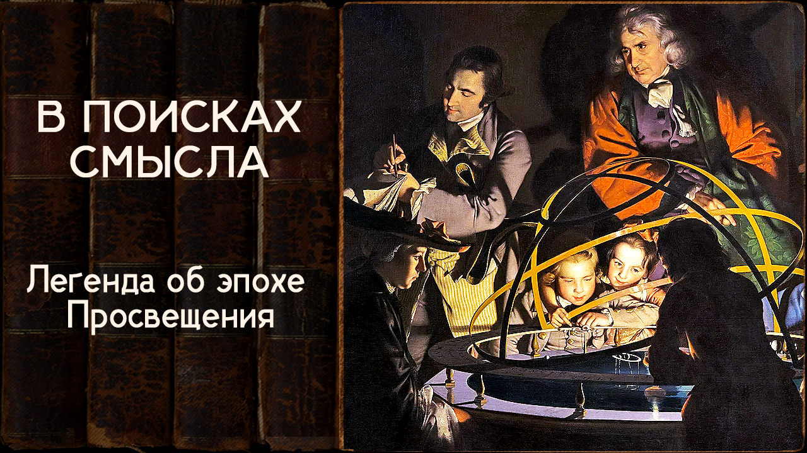

# Легенда об эпохе Просвещения

05 июля 2024 [Аудиоверсия](https://paradoks-pinkera-pilotnyy-vypusk.simplecast.com/episodes/enlightenment) 39:13

Мифоцентричность человеческого сознания.
Нарративы и убеждения эпохи Просвещения.
Рождение «общественного мнения» в салонных обществах «хорошего тона».
Расцвет культа Разума и чувственных наслаждений.

**Е.Голуб:**
Здравствуйте!
В эфире очередной выпуск подкаста «В поисках смысла».
У микрофона Евгений Голуб.

**П.Щелин:**
И Павел Щелин.
Здравствуйте!

**Е.Голуб:**
Сегодня мы продолжим говорить о том, как развивалась мысль западной цивилизации.
Наш сегодняшний пункт осмысления, размышления — это эпоха Просвещения.
Рифма получилась.
Поразмышляем о просвещении.

**П.Щелин:**
Почему мы с тобой это делаем?
Потому что, как показано на примере предыдущих наших выпусков, они все вращаются вокруг примерно одной и той же темы, о том, что очень многие понятия, образы, которыми мы привычно оперируем в нашем языке и дискурсе, на самом деле являются либо черной, либо белой легендой.
За ними скрываются какие-то аспекты, которые, мягко говоря, не способствуют их ни то чтобы оригинальному значению, либо как минимум крайне творчески переосмыслены.

И вот сейчас мы, наконец-то, дошли, мне кажется, хронологически до того момента, пройдя очень длинный путь, до той точки, где как раз и происходит рождение большинства этих самых мистификаций и легенд эпохи Просвещения.
И в рамках этого выпуска мне с тобой хотелось бы поговорить именно о том, каким образом, из какой среды, или цитирую одну из моих любимых строчек мировой поэзии, из какого сора вырастает вот эта атмосфера мистификации, зачем, почему, кто.
Такого рода вещи.

**Е.Голуб:**
А прежде чем мы перейдём, собственно, к самому содержанию, мне хотелось бы вот о чём с тобой поговорить.
Каждый раз, готовясь к нашей встрече, конечно же, перелистываю, читаю или перечитываю что-то из тех мыслителей, из тех произведений авторов, которые мы собираемся обсуждать.
И вот какие мысли мне пришли в голову.

То, что ты называешь легендами, чёрными или белыми, фактически это некоторые нарративы, которые созданы и утверждены в нашей культуре или приняты нами часто некритично во время школьного образования.
И когда начинаешь работать, собственно, с источниками, понимаешь, что эти нарративы созданы таким черри-пикингом, выбиранием чего-то из реальности для того, чтобы подогнать под этот самый нарратив, под эту самую историю.
А содержание творчества мыслителей обычно гораздо богаче, пространнее и больше, чем любой из нарративов.
И у меня вот тебе вопрос.

Скажи, пожалуйста, а мы с тобой сейчас не занимаемся ли тем же самым?
Не создаём ли мы просто ещё один из нарративов, который предлагаем нашим слушателям?

**П.Щелин:**
На мой взгляд, создаём.
И на мой взгляд, это неизбежное обстоятельство в рамках, если угодно, человеческой жизни.
Почему?

Потому что, на мой взгляд, сознание, оно не просто текстоцентрично.
Оно точно не рационально, во-первых.
Это отдельный, в контексте просвещения, очень фундаментальный миф, с которым мы разберёмся.
С моей точки зрения, сознание, оно, во-первых, не просто нерационально, но даже не текстоцентрично, оно мифоцентрично.
Мы неизбежно живём в мифе с большой буквы.

Миф, как нечто большее, на самом деле, чем реальность.
Перефразируя знаменитую фразу Льюиса, где он говорит о том, что борьба с ложными чувствами не в бесчувственности, а в чувствах истинных, можно сказать, что борьба с ложными мифами не в разрушении мифов, а в создании истинных мифов.
Я знаю, фраза «истинный миф» звучит как парадокс, я уже вижу выражение твоего лица, и я отдаю себе отчет на столько, насколько огромен риск самой такой постановки вопроса, и даже определенная наглость с моей стороны рисковать заниматься этим делом.
Но, на мой взгляд, другого выхода нет.

Лучшее, что мы можем сделать — максимально внутренне честно подойти к этому вопросу, нету намерения врать, и предложить нашим слушателям как альтернативный миф.
А дальше их мифы соединятся с этим мифом, и может произойти что-то интересное.

Возможно, они воспримут нас как создателя очередной легенды и в рамках своего контрответа создадут свою.
Но мне кажется, одно из фундаментальных заблуждений эпохи Просвещения — то, что можно не заниматься тем, что называется история с большой буквы и мифом с большой буквы.
И то, что есть какой-то простой набор фактов, который сам по себе свидетельствует адекватной объективной картине мира.

А между тем это невозможно по одной простой причине, то что любой факт действительно находится в зависимости от наблюдателя.
То есть от того, кто наблюдает, как наблюдает, с какой этикой наблюдает, и происходят различные выводы из, казалось бы, одних и тех же фактов.
Это, наверное, самая глубокая фундаментальная проблема, когда мы говорим о гуманитарном знании, но она проблема неизбежная.

**Е.Голуб:**
Ну и для того, чтобы уже не застревать на этом экспромте, а перейти к Просвещению, я хотел бы добавить, а ты, пожалуйста, поправь меня.
Я думаю, что наш с тобой разговор, то, что сейчас называется подкастом, будет иметь смысл для слушающих только в том случае, если побудит вас, дорогие друзья, поспорить с нами, познакомиться с источником, подвергнуть критике, сомневаться.

**П.Щелин:**
Посмотреть на него своими глазами.

**Е.Голуб:**
Своими глазами.
Не соглашайтесь, спорьте, но главное — не застревайте в пределах какого-то задубевшего в сознании нарратива, не считайте, что если прозвучавшие здесь во время наших бесед неожиданные для вас логические или, может быть, наоборот, алогичные какие-то суждения, что они неправильны только потому, что не совпадают с состоявшейся историей, которая у вас есть в голове.

**П.Щелин:**
Ты знаешь, да, я с тобой согласен, тут вообще фундаментальный тезис, и думаю, может, мы к нему в следующем подкасте на выпусках вернемся, может быть, в финале.

Когда мы говорим о мифе, ты вот абсолютно по сути что-то говоришь, и в чем я с тобой полностью согласен, то, что, на мой взгляд, как минимум, то, что необходимо в этой, скажем так, сфере — это выбрать снова, если тебе угодно.
То есть возможно, что наш с тобой подкаст вызовет у вас отторжение.
Вот вообще вся эта история, тот миф, который мы рисуем, и он лишь побудит вас, наоборот, укрепиться в собственных убеждениях относительно того мифа, который вы считаете наиболее адекватным миру, реальности и так далее.

Но это уже будет ваш осознанный выбор в пользу того или иного мифа.
Вот, наверное, о чем еще важно говорить.
То, что вот в одном из интересных фантастических произведений Гиперионе есть очень интересная цитата, которая, ну, такой принцип главного протагониста, то, что он предлагал людям.
Вот он звучал так: «Выберю снова».

И вот когда мы говорим о мифе, я абсолютно спокойно отношусь, что если по прослушиванию нашего цикла, вы просто снова осознанно выберете свою, условно говоря, платоновскую пещеру.
Свой миф, свою тень, потому что для вас он будет сверхреальностью.
И это тоже будет огромным благом.
Вот что я хотел бы донести.

**Е.Голуб:**
И завершим это уже затянувшееся вступление, перейдём к просвещенцам.
Почему я говорю с тобой об этом?

Потому что я заново встретился с Жан-Жаком Руссо, о котором у меня было уже своё устоявшееся впечатление.
Знаешь, есть какие-то биографические факты, которые очень сильно затемняют или затеняют суть мысли человека.
Казалось бы, очевидно, что всегда нужно разделять биографию человека, его личные какие-то качества, с его мыслями, произведениями, текстами.
Но это бывает сложно сделать.

Вот у меня такая проблема и с Мариной Цветаевой.
Никак я не могу отодвинуть ситуацию, когда она сдала детей в детский дом во время голода, и что погиб там у неё мальчик, по-моему.
Один из детей просто умер от голода.
Она таким образом оправдалась, что так было надо, так было лучше.
С тех пор я, как прочитал об этом, не могу стихи Цветаевы воспринимать.
Хотя поэзия-то у него великолепная.

Так же и с Жан-Жаком.
Его история про пятерых детей, которых отдал воспитательный дом и запретил строго-настрого воспитателям, что бы он ни делал, письменно дал распоряжение, и когда он будет приходить, не давать ему возможности с ребёнком встречаться.
И вот это тоже оказывает влияние на то, что потом этот товарищ со своими воспоминаниями нам всем завещал.

**П.Щелин:**
Это очень сильно влияет, потому что это же считается певцом этого гуманизма, такого прям восторженного отношения к человеку, то, что очень, конечно, создаёт как бы когнитивный диссонанс, мягко говоря.
Да, я тебя очень хорошо понимаю.

**Е.Голуб:**
Так вот нам всё-таки нужно, я всех призываю, дистанцироваться до какой-то степени хотя бы от этого и встретиться с этим человеком, какой он есть.
Мы будем говорить о Жан-Жаке Руссо сегодня.
Ещё о ком?

**П.Щелин:**
Мы упомянем Руссо, он будет, наверное, главным персонажем, мы упомянем Вольтера, но главное, мы упомянем сам, если угодно, уж прости пафос, дух Просвещения, ту среду, из которого они, если угодно, возникают.
Ну, допустим, мы приведем пару цитат из Монтескье, пару цитат из Дидро, ну, разные примеры могут быть.

Напомню точку, в которой мы с тобой оказались, если угодно, перед вот этой самой эпохой Просвещения.

Во-первых, у нас уже есть архетип реформы, то есть отсылаем к предыдущим подкастам.
И у нас есть архетип определённого разочарования от религиозной жизни с точки зрения, скажем так, её радикальных практик, последствий 30-летней войны.

При этом параллельно начинает распространяться культ разума.
Возрастают возможности по физической власти человека над природой.
В итоге, как промежуточный этап, накануне XVIII века возникает так называемое оязыченное христианство или деизм.
Это вот сочетание неоплатонизма, с одной стороны, и языческий миф о Прометее, корни которого тоже очень популярны в культуре Возрождения, как мы с тобой говорили, Марсилия Тычина, «человек рожден властвовать над миром».
Вот здесь то же самое.

Акцент делается на человек, преобразующем мир подобно Прометею, и тем самым выполняющим Божий замысел.
То есть возникает такое, если тебе угодно, промежуточное состояние умов.
И в этот же самый момент происходит, наверное, главнейшее социальное изменение.
Рождается то, что вот сегодня мы бы назвали тусовочкой.
Или раньше бы ты назвал интеллигенция, или еще что-то.

То есть тогда это называлось культура вежливого общества или салонное общество.
Прежде всего, оно рождается среди французской культуры, английской культуры и шотландской культуры.
Разумеется, элита была и раньше, и в ней всегда были определенные системы этикета.
Но именно в XVIII веке создается вот эта принципиальная новая среда хорошего тона, которая становится очень важной политической силой.
Потому что раньше мысль о том, что в результате вот этого, прости меня, словоблудия в салоне рождается политический запрос, для средневековой мысли было бы невозможно, странно.
И даже больше того, опять-таки, они думали то, что они копируют Древнюю Грецию, да?
Но тут есть очень тонкий нюанс.

В Древней Греции мы можем представить, что дебаты по общественным делам могут вестись в самых разных условиях.
Друзья на симпозиуме, те, кто встретился на Агоре, в Эклесии, но решается дело в конечном итоге только в компетентном органе.
От того, что вы поговорили на Агоре, автоматически не рождается императив, чтобы политический там орган, условно Ареопаг, принял какое-то политическое решение.

А в Просвещении, вот эта салонная культура, возникает идея о том, что мы пообсудили, если тебе угодно, что-то в салоне, власть должна начать это выполнять.
Вот это наша очень на самом деле близкая современности идея.
Вот она рождается тогда в эпоху Просвещения.

**Е.Голуб:**
Даже сейчас звучит как-то странно.
Слушай, а чего вдруг?

**П.Щелин:**
Идея в том, что вот есть общественное мнение, и когда общественное мнение сформировано, это мнение по сути уже становится императивом.
Вот это рождается в Просвещении.

**Е.Голуб:**
То есть в приличном обществе принято считать вот так.
И ты, власть, пожалуйста, учитывай это общественное мнение.

**П.Щелин:**
Не просто учитывай, а иди и делай.
То есть если приличное общество что-то посчитало, то власть уже, по идее, должна этому приличному обществу начать соответствовать.

На самом деле происходит очень интересный и важный элемент.
Происходит разрыв между формированием той или иной политической идеи и ответственностью за принятие той или иной политической идеи.
Это очень интересный момент.

**Е.Голуб:**
То есть одни начинают задавать тон, а другие должны следовать и ещё отвечать за последствия.

**П.Щелин:**
Да.
То есть идея в том, что в Греции люди, обсуждающие решения за пределами органа, и люди, принимающие решения, — это одни и те же люди, которые в конечном итоге понесут политическую ответственность за свои решения, включая и жизнью.
А в XVIII веке начинает формироваться идея о том, что это разные люди.
Общество имеет мнение, оно требует, чтобы к мнению прислушивались, но оно само не является властью, несущей ответственность за свое мнение.

Понимаешь, какая хитрая рождается идея в 18 веке?
И как она для нас сегодня является естественной.

**Е.Голуб:**
Получается, что еще во времена возрожденческих итальянских городов-государств ещё было не так, потому что пошумели, решили, и потом пошли воевать, и тоже отвечают либо деньгами, либо в изгнание могут уйти, и так далее.
Раз вы там пошумели, приняли какое-то решение, взяли сторону либо папы, либо императора, тогда уже, извините, будут последствия.
А ты говоришь о том, что в XVIII веке возникла прослойка людей, хорошо образованных из аристократических семей и, наверное, уже третье сословие потихонечку.

**П.Щелин:**
Upper-middle-class третьего сословия, часть религиозных, часть церкви, там разные аббаты принимали активное участие, ну и часть дворянства, да.

**Е.Голуб:**
Интересно, как это было естественно, вот естественно проследить этот источник.
Ну, сначала собирались, что, как всегда, там пообедать, поужинать, помузицировать.
И что ж, послушать умного человека, гостя, который приехал, да?

**П.Щелин:**
Смотришь в самый корень, культ разума.
Мы тут упражняемся в разуме, и мы как бы пришли разумно к разумному тут решению.
Это разумное мнение.
Поскольку у нас теперь источник основания любого политического действия не вера, а некий рациональный к нему подход.

**Е.Голуб:**
То есть умные люди пришли к такому-то выводу.
В силу своей репутации, образованных, утончённых, просвещённых людей, то все остальные должны, в общем-то, следовать.
Иначе как так, да?

**П.Щелин:**
И смотри, насколько это естественно входит вообще в плоть.
Вот эта модель уже у нас сохраняется до наших самых дней.
Иногда в комических формах.
Дискуссии в Твиттере или в сегодняшнем X, или вообще в социальных сетях.
Это же то же самое продолжение вот этого салонного принципа, просто выплюснутого на массовое общество.

**Е.Голуб:**
Надо подумать еще об этом.
Конечно, это все очень хорошо видно по истории Российской империи, допустим, XIX века.
Это мощно очень проявилось.
Но откуда это же пришло?
Это, скорее всего, действительно из Франции это и пришло.

**П.Щелин:**
Ну, из Франции нет.
Спасибо Петру Великому, что принес это все, так сказать, добро.

**Е.Голуб:**
Да.
В лучших домах Парижа и Лондона принято считать, что ваша, так сказать...
Уже давно не воспринимают всерьёз это и это, а все уже думают так-то и так-то.
Так что уже, батенька, вы отстали, да?

**П.Щелин:**
Так что же вы, батенька, отстали?
Да, сейчас то же самое, условно говоря, "в цивилизованных странах принято".

**Е.Голуб:**
Да, а тогда это что было?
Тогда это было...

**П.Щелин:**
Ну, в салоне мадам М, в салоне мадам Ж, вы же знаете.
Вообще вот эта фундаментальная фраза: ну вы же понимаете, ну вы же знаете, ну вам же известно.
То есть это вот такие риторические рождаются формы.
Но что нам важно самое главное в этот момент, повторюсь, потому что там скажут, ну вы что, тут за тоталитарную цензуру?

Нет.
Мы в этом плане выступаем как сермяжные люди, мы скорее за то, чтобы за базар отвечали, переводя на грубый язык.
Рождается культура, где базар и ответственность за базар разделены.
То, что можно заниматься словоблудием политическим, то есть, повторюсь, они не просто упражняются в разуме, рождается культура, в которой, условно говоря, тебе критикуют такой-то социальный устой, критикуют церковь, критикуют институт организации крестьянской жизни, организации промышленности.
Вообще король должен взаимодействовать с подданными.
То есть критикуется это всё, да?
То есть это всё рождается как мнение.

**Е.Голуб:**
И я думаю, даже и какие-то есть предложения, как должно быть, но при этом никакого реального усилия, чтобы заняться изменениями, нет.
Есть ожидание, что вот эти идеи будут услышаны и воплощены, а мы одобрим.
Или не одобрим.

**П.Щелин:**
Мы одобрим или не одобрим.
Причем, заметь, то есть ты можешь сказать, ну, это было при монархии, а при парламенте оно меняется.
Да нифига не меняется при парламенте.
Ты можешь создать парламентскую систему.
В Британии была парламентская система.
А принцип-то остается такой же.
Парламент несет ответственность, а ты вот сидишь на горе общественного одобрения и неодобрения, и выносишь свои разумные суждения.

**Е.Голуб:**
Ну да, потом же еще пресса выносит это все из салонов.
То есть это салонная культура, умноженная на масштаб и влияние прессы, которая начинает распространять эти салонные мнения как мнение правильное хорошего общества, образованных людей.

**П.Щелин:**
Почему это важно?
Потому что на тот момент у тебя...
Представь, что происходит в голове этой самой элиты.

Мы же все пытаемся понять, как у них берется наглость мифы формировать и свое мнение считать истиной в последней инстанцией.
Так именно в этой салонной культуре и возникает этот пресловутый культ нарциссизма.
Возникает культ добродетели, очень парадокс в XVIII веке, но вся эта добродетель служит исключительно лишь удовлетворению самолюбования этой элиты.
Например, что пишет Монтескье?

> Благородная гордость, проистекающая из этого внутреннего удовлетворения, которое приносит добродетель, из чувства, приличествующего великим людям.
> Великая душа не может не выделяться.
> Такой человек чувствует достоинство своего существования.
> 
> Да, чувственное наслаждение — вот что я называю лестным свидетельством о себе после добродетельного поступка.

**Е.Голуб:**
Какой провал после стоиков, да?
Что бы на это сказал Марк Аврелий?

**П.Щелин:**
Дидро о том же самом.

> Блаженство, доставляемое добродетелью, неприходяще
> Столь чистое удовольствие, которое от него исходит, — суть наслаждения чувств.

То есть даже добро служит исключительно для твоего, условно говоря, наслаждения.

**Е.Голуб:**
И это разумно.
Почему нужно быть добродетельным?

Потому что это разумный способ получить наивысшее удовлетворение, а не само по себе.
То есть для стоиков достоинство — это само по себе благо, да?

**П.Щелин:**
Для христианина это только всё вторично, оно не про наслаждение, уж про что угодно, но не про наслаждение.
А здесь они начинают воспринимать это наслаждение, мало того, как вот эта связь добродетель-наслаждение, так они еще искренне в этот момент чувствуют себя как приказчики божественной воли.

Тот же Монтескье пишет.

> Нет ничего ближе к божественному промыслу, чем это всеобщее благоволение и эта великая способность любить, охватывающая всех людей.
> И ничто так не приближается к животному инстинкту, как те ограничения, которые сердце ставит себе, когда на него действует только собственный интерес или то, что его окружает.

То есть вот это, понимаешь, все пропитано вот этим духом, откровенно говоря, самолюбования, нарциссизма.
Которые при этом считают себя воплощением этического, просто вершины в обществе.
Эта мысль, это мир людей возникает, сначала очень маленький мир, буквально там на сотни человек, на тысячи человек там в Париже условно.
Но которые на словах выступают как благодетели человечества, хотя на деле просто компенсируют собственное самолюбование.

**Е.Голуб:**
Как же я хорош!
Как же я добродетелен!
Как же прекрасно быть добродетелем!
Посмотрите на меня!
Это же просто удовольствие!
Чудесно!
Это лучше, чем секс!

Хорошо, ладно, продолжайте.

**П.Щелин:**
Ну так и отсюда возникает вот наши любимые, собственно, просвещенцы.
То есть Вольтер и Руссо, на которых мы сделаем с тобой сегодня акцент.
Помнишь, самое такое ключевое произведение Вольтера — это «Кандид».
Краткое summary.

«Кандид» начинается практически там, где и книга «Бытия» — в саду, где протагонист находится в саду со своей возлюбленной.
Но счастье заканчивается, отец застает любовников и изгоняет их.
Они начинают странствовать по миру, посещают многие знаковые события своей эпохи, Семилетнюю войну, взятие Азова, землетрясение в Лиссабоне, и везде оплакивают печальное состояние современного им человечества.
Источник печали — это христианство, поскольку для Кандида Вольтера, чье представление о христианстве только через призму религиозных войн во Франции, это была исключительно борьба условно отроконечников и тупоконечников.
Поэтому христианство — это зло.

**Е.Голуб:**
Насколько я помню, Вольтер — автор фразы «раздави гадину», но, в принципе, он был ярым противником атеизма, насколько я помню.

**П.Щелин:**
Правильно.
Он противник атеизма, но при этом христианство — это зло.
У него это нормально словосочеталось.
Потому что что он говорит?

Он говорит о том, вот в противовес вот этому догматическому, неправильному христианству нужно христианство, построенное на чувственной, добродетельной...
Наслаждении от этически правильного поступка.

Он хочет своё христианство, понимаешь?
Не то, которое есть, а он хочет своё.
Он деист.

**Е.Голуб:**
Первый харизмат.
Харизматическое христианство для просвещенной публики.

**П.Щелин:**
Да, но при этом заметь, где заканчивается Кандид после всех своих впечатлений.
Во-первых, он, конечно, встречает своего благородного дикаря в Южной Америке, там находит утопию, благородная невинная жизнь.
Но заканчивается вообще-то он в Стамбуле, на встрече с мусульманским дервишем, который объясняет Кандиду, что Богу глубоко равнодушно до страданий людей, и что он непреодолимо отделен от них.
Деизм.
И поэтому единственное, что может сделать человек, финальная строчка произведения - возделывать свой сад.

То есть преобразовывать мир вокруг него к максимальному счастью безо всякой оглядки на оковы традиций.
Создается полностью новый миф.
Который вся вот эта салонная публика начинает воспроизводить как:

> Ну разве вы не читали Кандида?
> Вы что, до сих пор ходите на мессы по воскресеньям?
> Вы что, совсем шо ли?
> Вы серьезно в это верите?

Ну вот я вот воспроизвожу, как это работает.

И под это дело начинают рождаться, условно говоря, новые мифы, включая, например, переписывание других мифов.
Другой автор уже, Руссо, например, он переписывает «Золотой век».
То есть у него теперь естественное состояние — это вот пресловутый счастливый дикарь.
И от цивилизации правила жизни в обществе лишь мешают выражению этой естественности настоящего «я».

А самое главное — это прямое переписывание, например, Августина.
То есть, если ты помнишь, в «Исповеди Августина» есть классический момент, это стало ключевым образом всей западной традиции, где он размышляет о том, как он украл грушу, будучи маленьким.
И вот у него очень глубокая рефлексия.
В конечном итоге он признается, что совершил это преступление из-за радости и возбуждения от процесса.
Он хотел украсть эти самые яблоки.
И только через покаяние он возвращается к Богу.

А Руссо делает прямо, условно говоря, наоборот.
Он крадет спаржу у матери, чтобы отдать знакомому, и уважает, что само желание его было хорошим, и что, будь общество организовано лучше, этого бы не случилось.
Другими словами, он отрицает личную ответственность за грех.
Меня таким сделало общество.
В этом виновато общество.
Именно Руссо тогда это придумывает.

Пресловутое «не мы такие, жизнь такая» — это вот оттуда.

**Е.Голуб:**
То есть я по природе хороший и добрый, а всё, что во мне есть плохого, это не от меня.
Это общество, законы и ограничения таким образом меня исковеркали.

**П.Щелин:**
Вот смотри, цитата из Чарльза Тейлора, великолепный историк, очень всем рекомендую, кто не читал.

> Универсальное сочувствие, которому нужны были только правильные условия, чтобы расцвести в добродетель.
> Источник любви здесь больше не рассматривается как находящийся в бесстрастном разуме, в нашей собственной удивительной способности действовать в соответствии с универсальными принципами _(твои любимые стоики)_.
> Он лежит глубоко в нашей эмоциональной структуре, но оно подавлено, искажено, прикрыто ложными и денатурирующими условиями, сложившимися в истории.
>
> Наша задача — найти условия, которые смогут его освободить.

Вот что эти просвещенцы придумывали.

**Е.Голуб:**
Ну, в общем, это прямо противоположно христианскому нарративу о повреждённой природе человека, о склонности к греху и необходимости прилагать постоянные усилия, чтобы удерживать себя в человеческом достоинстве.
А тут всё на 180 градусов по-другому.

**П.Щелин:**
Да, здесь всё по-другому, и главное, опять-таки, создаётся фундаментальный принцип, который, повторюсь, уже станет основой для дальнейшего хода вот этой западной мысли.
Откуда берётся миф о Возрождении в этом контексте?

Ну, потому что они все оплакивают.
Монтескье, Вольтер, Дидро, Руссо.
Уход, например, полиамурных отношений, свободной любви, то есть, в общем, вот этой естественности, которая, по их мнению, была в язычестве.
А тьма христианства пришла и разрушила вот это естественное полурайское состояние.

И, соответственно, тогда понятно, почему они просвещенцы, почему Возрождение — это именно возрождение, то есть откат к какому-то фундаментальному состоянию.
То есть понятно, почему начинается переписывание всей истории.
Простой пример.
Если тебе надо объявить христианство тьмой, то тогда в зависимости от этой исходной точки начинается конструирование нового мифа.

**Е.Голуб:**
Я думаю, что ты немножко сгущаешь краски.
Вряд ли они в то время могли объявлять христианство тьмой.
Они скорее атаковали церковь.

Насколько я помню, повторюсь, что церковь, это вот всё церковь.
Она, вот эти вот все священники, клирики, это все мракобесы исказили, все испортили.
Время вернуться к истокам, и к истокам еще дохристианским.

**П.Щелин:**
И вот здесь происходит вот это парадоксальное смешение разума и эмоций.
То есть это одновременно.
Мы типа разумные, а вы мракобесы, но при этом внутри все строится на чувстве.
То есть это вот поразительное сочетание, противоречивое, оно, тем не менее, прекрасно вкладывается.

И под это они создают свои тексты, надо понимать.
Здесь создается целый комплекс священного текста, пресловутая энциклопедия Дидро и Аламбера.
Это, вообще-то, крайне амбициозный проект, который его создатели воспринимали как антиевангелие.
Это был новый, в буквальном смысле, стандарт благой вести.

Вот, значит, новая красная книжка или сборник сочинений.
Вот.
Это была Википедия своего времени.
Это упрощенные знания обо всем на свете.
Глубокое понимание оно не дает, но оно позволяло ее читателям чувствовать себя очень образованными, очень просвещенными гораздо лучше, чем вот этот мракобесный тупой крестьянин или еще хуже косный священник из нашей приходской церкви.

Вот представь себе сельский дворянин, к нему приезжает вот этот Талмуд из этой энциклопедии, он ее так почитал, просветился, пошел в воскресенье на мессу, а там у него обычный у него священник, он на него смотрит сверху вниз и начинает вибрировать в другом контексте.
Вот так оно постепенно перезапускается.

**Е.Голуб:**
Ты читал-то вообще?
Ты-то вообще знаешь?
Ты знаешь это?
А вот это?
А вот то-то?
А вот то-то давно уже всем известно, а наука доказала.

Такая поверхностная образованность, которая сейчас, по факту, это стандарт.

**П.Щелин:**
Разумеется.
И почему опять возникает идея еще очень важная?

Потому что, разумеется, на этом пути институты монархии, которые их окружают, они понимают, что на стратегическом уровне они являются, конечно, проблематичными, вот эти скязки церковь - монарх - империя.
Это, конечно, все зло, это не то.
Нужно, чтобы вот мы, просветители...
То есть реальность тьма и печаль, в которую мы привносим свет, а настоящий свет наступит по цитате Дидро, когда последний король будет удавлен кишками последнего попа.
Это вообще из Дидро.

**Е.Голуб:**
Надо же, вот это ты мне рассказал.
Я был уверен, что это Хрущев.
Ага...

**П.Щелин:**
Нет, это из Дидро.

И тогда возникает вопрос, что вам нужно, чтобы наступил вот этот образ счастья, который вы тут рисуете?

Власть нужна.

И постепенно просвещенцы начинают вырабатывать модель современной борьбы за власть.
Сначала они, условно говоря, борются за умы, ну а потом наступит эпоха уже превращения идей, овладевших массами, в материальную силу.

Причем, заметь, первым объектом их, если угодно, трактатов и памфлетов будет, конечно, образованное меньшинство.
Сначала они пытались даже, условно, монархов перевербовать.
Причем там это все приводилось бы к тому, что вот ты монарх, да, и вот поэтому ты монарх...

**Е.Голуб:**
Слушай, что умные люди говорят.

**П.Щелин:**
Да, во-первых, слушай, что говорят умные люди.

Или польстить можно.
Вот у тебя какая-то возможность спустить, приблизить вот это царство света, по сути.
Вот что они предлагают.
Вот она, подноготная этого абсолютизма XVIII века.

То есть как бы вот ты монарх, у тебя абсолютная типа власть.
Давай, слушай нас и спускай вот то, что мы тебе говорим.
Воплощай в жизнь.
Закрывай монастыри.

Но это, конечно, парадокс, потому что монархи выступали, как и тоже очень своеобразным образом, и во Франции, и в Австрии, и в России.
Они сами выращивали собственных могильщиков.
Они сами их очень часто спонсировали, привлекали ко двору, любили, то есть и так далее, и прочее, прочее, прочее.

**Е.Голуб:**
Это было такое, модные обезьянки в то время.
Они воспринимали их как развлечение.

**П.Щелин:**
Не просто модные обезьянки.
Им еще очень нравилось то, что оно повышало чувство собственного достоинства монарха.
И вот эти церковники, ну что, вот эти мракобесы с капустой в бороде или с вот этой выбритой тонзуркой.

А вот вокруг меня такие красивые образованные люди.
Посмотрите на меня.

**Е.Голуб:**
Пошутить могут к месту, манерами обладать хорошими, цитатку какую-то подать, что-то подсказать.
Она же по-светски симпатично звучит, да?

**П.Щелин:**
А получилось что?
Что просвещенцы готовы были ради свободы от, в кавычках, оков церкви, петь дифирамбы государству и монарху некоторое количество времени, чтобы потом разрушить все предыдущие инструменты социальной солидарности, которые стоят на вере и на вот этой этической старой системе, и провести свою революцию.

**Е.Голуб:**
Давай только мы не будем их демонизировать.
Я уверен, что каждый из них исходил из самых лучших побуждений.
Люди действительно верили, что...

**П.Щелин:**
Люди искренне хотели утопию построить.
Искренне.

**Е.Голуб:**
Им хотелось улучшить мир.
Зачастую совершенно бескорыстно.
Бескорыстно в смысле материальном.
Или почти бескорыстно.

**П.Щелин:**
Бескорыстно, не бескорыстно.
Вот я зачем это всё рассказывал про политический элемент.
Потому что вот мы с тобой говорили, первые у нас три выпуска были: республика, демократия и империя.
Вот мы с тобой всё обсуждали: как же это все запуталось?

Так вот здесь путаница и происходит.
Тебе нужно создать образ другой республики, другой демократии.
Вот оно начинает формироваться в этом же контексте и постоянно очернять империю.
То есть, условно говоря, чтобы сам монарх чувствовал в себе стыд за то, что он такой имперско-монархический, а не просвещенный республиканец, как надо было бы быть.

**Е.Голуб:**
Это все умножается на то, что общий уровень образования не очень высокий.
Что трактовки и понимания поверхностные, с источниками мало кто знаком, а все ознакомятся, как вот сейчас в YouTube-пересказе просвещенцев.
То есть все вот эти...
Некому поставить под сомнение, предложить другие варианты.
Знания нет.

**П.Щелин:**
Хитрее.

На самом-то деле есть кому.
Просто просвещенцы, не будучи дураками, никогда с ними не спорили.
Они не вступали в дебаты со схоластами.
Они их просто игнорировали.

Они не вступали в дебаты с образованными, условно говоря, церковниками.
Не вступали вообще.
Они их просто игнорировали.

**Е.Голуб:**
Ну, потому что они шли к тем, кто вот недавно появившийся хомо новус, буржуа.
Те люди, которые стали обладать ресурсами, стремились к аристократии приблизиться, ну и покупая энциклопедию Дидро, они прям чувствовали, что они как причастились к высокому знанию.
Они, может, и не открывали никогда.

**П.Щелин:**
Новое Евангелие, в буквальном смысле ощущалось как новое Евангелие.

**Е.Голуб:**
Да, и вот эти простые нарративы, которые им давали люди из хорошего общества, воспринимались некритично, без всякого осознания сложности контекста.

**П.Щелин:**
А оно ж тем более, если вы будете читать то же самое Дидро, оно как Википедия.
На поверхности очень логично все.
Очень красиво и логично.
Вот если не обладать базой, то очень, ну как это, или как любая современная методичка.
Все очень легко и красиво.
И вроде бы даже на первый взгляд непротиворечиво.

Если нет вот этой глубокой образовательной базы, то очень легко просто не продвинуться дальше, а эмоциональное наслаждение ты уже почувствовал.
Ты уже чувствуешь себя лучше, чем окружающие.
И на этом фоне происходит вот это постепенное движение мысли.

Классически, вот это я знаю, всех отсылаем к очень старому, несколько лет назад, по-моему, уже сделанному видео Андрея Олеговича Баумейстера про инквизицию.
Собственно, черная легенда инквизиции.

Берется какой-то феномен из истории, который реально сложный.
Инквизиция не самый простой феномен, в нем надо разбираться.
А тебе говорят, ну вот тебе создается образ, памфлетики, картиночки, там плюс-минус добавили, подрихтовали и все.

**Е.Голуб:**
И живёт до сих пор.
Я буквально пару недель назад услышал основной аргумент против церкви — это то, что инквизиция это повешенные, сожжённые, замученные злобными попами.
Кто там будет разбираться, какой процент был смертных приговоров, за что и почему, и сколько было оправданий, и в какую эпоху, в каких странах и так далее.

**П.Щелин:**
Вообще инквизиция была, ну, реально ее плод, просто, уважаемые слушатели, она вообще защитила гораздо больше людей от жалоб соседей, которые всех подозревали в том, что они ведьмы.
Как раз инквизиция говорила, что нет, не ведьма.
То есть то, что тебе твоя теща не нравится, еще не повод считать ее ведьмой, условно говоря.
Вот большая часть ее реального труда.

А на фоне тех наказаний, которые в принципе были приняты в тот момент в мире, была предельно гуманная процедура.
То есть это очень важный момент.

**Е.Голуб:**
Но в этом сейчас никому разбираться уже не интересно.
Есть образ, он приклеился.
Костры, красивые женщины, сжигаемые этими самыми фанатичными...

**П.Щелин:**
Старыми монахами-извращенцами такими.

**Е.Голуб:**
А кто будет разбираться, кто такие салемские ведьмы, да?
В какой вообще стране они возникли?
А что это не католики, а протестанты?
И где вообще было больше всего казней и мучений на религиозных мотивах?
Это очень интересный момент.

Ну, будет вам интересно, слушатели, разберетесь.
Но смысл в том, что вот эти образы, потом украденные или заимствованные в том числе советской пропагандой или образованием, либерализмом.

**П.Щелин:**
Либерализмом, ну это все.
Это же продукт то же самый.
Марксисты же искренне себя считали наследниками Просвещения.
То есть прямая взаимосвязь.

**Е.Голуб:**
Можем ли мы сказать, что большинство этих штампованных нарративов созданы в то время?

**П.Щелин:**
На самом деле, да.
Ну, допустим, образ злобного вот этого третьего сословия, которое мучается под гнётом толстого попа и ещё более толстого царя, там, монарха.

**Е.Голуб:**
Злобного нет.
Почему злобного третьего сословия?

**П.Щелин:**
Ну, по-разному.
Это уже по-разному.
Сначала незлобного, потом злобного.
Потом уже к революции начинают рисовать вот эти правильные карикатуры, если угодно.
То есть это все начинает распространяться.

Но ты абсолютно прав, что большая часть таких архетипических стереотипов именно о традиции как таковой создана именно в ту эпоху, либо создана чуть позднее в других странах людьми, которые были воспитаны на этих образах тоже.
То есть, условно говоря, русский дворянин приехал во Францию, проникся, прочувствовал, потом приехал к себе домой и начал на свою окружающую реальность это проецировать.
Вот то же самое.

Ну или там, не знаю, какой-нибудь австрийский дворянин, шведский дворянин, ну так далее и тому подобное.

**Е.Голуб:**
В общем, весь набор представлений современного либерала о традиции - корнями в XVIII веке.

**П.Щелин:**
Да.
Именно тогда происходит самое фундаментальное переписывание этих мифов.
Ну, переписывание старого мифа и создание нового мифа.
И главное, создан механизм.
Повторюсь, я, наверное, так много, ну, в каком-то смысле, много сегодня на это время потратили, чтобы понять технологию.

**Е.Голуб:**
Ну, ты знаешь, я не думаю, что она была сознательно создана.
Она возникла некоторым образом, скажем так, органично.

Мы сначала воздействуем на умы и на сердца, призываем к чувству, апеллируем к уму, приводим аргументы.
Вообще говоря, спекулируем на своём знании, поощряя эго людей, не потративших время какое-то значительное на образование в большинстве своём, и просто впитывающие уже переваренное или пережёванное определённым образом и вложенное в их, так сказать, рты для того, чтобы они только заглотили.
Они глотают и чувствуют себя достаточно сытыми и довольными собой.

**П.Щелин:**
Да, мы ведём себя так, как будто мы...
Первое, мы создаём норму, и главное, мы ведём себя как носители этой нормы, даже если там нас, условно, полпроцента от этого даже образованного общества, но мы себя (эти полпроцента) ведём, что норма — это мы, а вы все нам не соответствуете.
Честно говоря, общество от такой наглости балдеет и начинает, ну вроде да, ну чё, ну как бы вот.

**Е.Голуб:**
Приличные люди, чистенькие, аккуратно одеты, пахнут, наверное, более-менее хорошо.
Общаются на нескольких языках.

**П.Щелин:**
Наверное, что-то знают.
Это поразительно, насколько это оказывается просто.
Ну, то есть просвещенцы в этом плане гениальны.
Это же очень, оказалось, простая вещь.

**Е.Голуб:**
Ну и в конце концов авторитет правильного общества затмевает собой очень быстро авторитет церкви, авторитет религии.

Ну что вы?
Ну, батенька, ну давайте уже не будем.
Ну мы же с вами образованные люди.
Что это вы вот это вот?
Ну несерьёзно.

**П.Щелин:**
Хватит придуриваться.
Или молодые дети говорят своим родителям, фу, папа.
Как не стыдно.
Фу, папа, не позорь меня.

**Е.Голуб:**
Да, да, да.
Ты ретроград.
Что так уже вообще?

И в принципе, да, с тех пор мало что изменилось.

Теперь, как ты уже говорил, в цивилизованных странах уже давно принято по-другому.
Но как же ж?

Да, слушай, вот этот авторитет некоторого центра знания, образованности, он переместился.
Если раньше, наверное, что это было?
Монастыри, не знаю, там за 200 лет.

**П.Щелин:**
Да, монастыри.

**Е.Голуб:**
Учёный, схоласт, университеты потом, да?

**П.Щелин:**
Даже университеты, да.
А здесь это становится вот этот салон.
Потому что салон — это не университет.
Это очень важный момент.
Это не университет.

**Е.Голуб:**
Ну да, в университете дебаты какие-то есть, есть некоторая школа мышления, с тобой могут поспорить.
А тут вот есть же приличный человек, и с ним как-то даже и спорить не принято.

Послушай, что говорит умный человек, проявляей тактичность, принимай это всё.
И вообще у нас тут так принято.

В университете такого же нет, у нас так принято.
В университете, наоборот, вызов.

**П.Щелин:**
Тут отдельная проблема в том, что, заметь, салон начинает пожирать университет со временем.
Но вот в изначальном значении университет, конечно, это совсем не про то.

Да, очень важный момент, что вот этот центр переходит в определённое пространство, которое нечётко обозначено, очень важно, оно очень флюидное на самом деле, и при этом, вот это с чего мы начинали, не несущее никакой ответственности перед обществом.
Ну, представь, ну, с точки зрения человека, не обладающего, действительно строгим этическим духовным кодексом, ну, идеальная же сделка.
Тебя должны все слушать, тебя должны все любить, но ты вообще никакой ответственности не несёшь за произнесённые тобой слова.

Так, дайте два, пожалуйста.
Где записаться, что называется, понимаешь?

**Е.Голуб:**
Да.

Надо уметь войти в образ, соответствовать этому образу, из которого можно вещать и собирать только плюшки и не нести никаких рисков.
Да?
Здорово.
Хорошо.

Закончим на этом?
Или добавишь еще что-нибудь?

**П.Щелин:**
Я думаю, шикарно закончили на этом.
Но это вот такой ключевой Рубикон нашей, если угодно, истории по формированию этих самых мифов, которые создают ту атмосферу, которая, как мы видим, воспроизводит себя до сих пор.

**Е.Голуб:**
Ну что ж, на этом пока завершим.
Спасибо, что были с нами.
Присоединяйтесь к нам, к нашим группам в Telegram.
Ну и до новых встреч.

**П.Щелин:**
До новых встреч.
