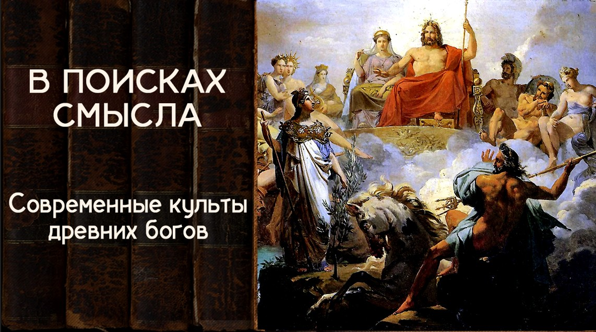

# Современные культы древних богов. Финал сезона

26 июля 2024 [Аудиоверсия](https://paradoks-pinkera-pilotnyy-vypusk.simplecast.com/episodes/final3) 37:47

Авторы подводят итог третьего сезона размышлений о современных мировозренческих мифах, говорят о древних культах в новой обертке, обсуждают противоядие от иллюзий и то, зачем его стоит принимать.

**Е.Голуб:**
Здравствуйте, дорогие друзья!
В эфире финальный выпуск третьего сезона подкаста «В поисках смысла».
У микрофона Евгений Голуб.

**П.Щелин:**
И Павел Щелин.
Здравствуйте!

**Е.Голуб:**
Сегодня мы завершаем работу над подкастом некоторым осмыслением того, что получилось, подведением итогов промежуточных.
И хотели бы поделиться с вами, дорогие слушатели, замыслом вот этого третьего сезона.
И, возможно, даже лучше прояснить этот замысел для самих себя.

Для этого я предлагаю, Павел, сделать шаг на пару лет назад, когда мы начинали эту работу над подкастом, мы задавались вопросом, как же так вышло, что мы оказались там, где мы оказались?
Мне хотелось бы время от времени возвращаться к этому вопросу.
С учётом нашего предыдущего разговора представим себе, что замечательные люди, о которых мы говорили в этом сезоне, которых мы вспоминали, наши дорогие просвещенцы, вот кто-то из них, может быть, один, а может быть, два, обрели бессмертие.
Как мы говорили с тобой, Вольтер Маклауд.
И вот он дожил до наших лет, до наших дней, оглядывается по сторонам.
Как ты думаешь, какая была бы у него реакция?

**П.Щелин:**
Я думаю, у него была бы очень большая радость.
Конкретно у Вольтера.
Ты просто выбрал такого персонажа.
Он примерно чего хотел, мне кажется, то бы он и увидел.
Плоды своих желаний вокруг себя.

И в этом является фундаментальная довольно позиция, что мы наблюдаем сейчас в развитии Просвещения, в таком так называемом постмодерне или постпостмодерне, уж как тут изгаляется, как хочет.
Это не случайность, это не мутация на теле Просвещения.
Но это есть его логичный, закономерный результат, и ни к чему иному оно прийти не могло.

Причем, кстати, сами постмодернисты XX века, например, тот же Деренда, прямо воспринимали себя как продолжателей просвещенческого проекта.
Я тебе скажу, кто бы относительно удивился, может быть, люди типа Юма.
Люди типа Локка, люди типа Франклина, то есть вот такое британское просвещение, вот они бы могли немножко удивиться и уйти в отрицание, что, дескать, мы хотели не это.

Но вот французы, Вольтер, Дидро, Руссо, они бы, я думаю, радовались тому, что происходит.
В этом плане они оказываются честнее.

**Е.Голуб:**
То есть ты думаешь, что вот так, как мы сейчас живем, вот в этом отрицании реальности и попытки конструировать мир из собственной головы, то это именно то, что было в намерениях вот этих самых просвещенцев?

**П.Щелин:**
Их главное намерение было освободиться от тирании, если тебе угодно, трансцендентных категорий.

**Е.Голуб:**
Это я ещё могу понять, как ребёнок хочет освободиться из-под власти родителей.
То есть ограничивают его, не дают ему покупать всё, там сладости не покупает ему, заставляет ложиться спать в 9 часов вечера, уроки учить и так далее.
Вот мы сейчас отменим это всё трансцендентное и заживём.

**П.Щелин:**
И будем сами для себя это определять.
И вот тот мир, в котором мы живем, это и есть мир, в котором каждому человеку дается иллюзия свободы выбора, самоопределения для себя этих самых трансцендентных категорий.
Поэтому я и говорю, это то, что они хотели.
Если говорить про Вольтеров и прочих товарищей.

**Е.Голуб:**
Тогда мы что, делим просвещенцев на категории?

**П.Щелин:**
Мы должны их делить.
Разумеется, их и всегда делят аналитически.
Различают, условно говоря, британское просвещение и французское просвещение.
Они действительно отличаются.

Но в сути своей, кстати, это одно и то же, потому что вся разница - только что французы разуму как бы шляпу снимают, омаж делают, но на самом деле они поклоняются, конечно, напрямую воле.
А вот британцы условные, они свободу от категории подменяют разумом.
То есть они являют собой воплощение гордого разума.

Но в итоге на длинной дистанции, как понятно любому теологическому анализу, гордость остаётся, а вот разум уходит.
И вот то, что мы видим сейчас, это и есть то же самое продолжение этого процесса.

**Е.Голуб:**
Ты же знаешь, что в наших с тобой разговорах я воплощаю нашу аудиторию.
Это звучит немного странно, но допустим, жили люди, образованные в XVIII веке.
Смотрели по сторонам, видели нищету, видели необразованность, видели довольно ограниченное понимание христианского мировоззрения, какой-то культ.

**П.Щелин:**
Но даже это уже нет.
На самом деле уже где-то говорил про христианство.
Каждый из этих моментов по сути своей тоже является мифологичным.
Насколько говорить про нищету?

Ну, например, как хорошо французский христианин, то есть его уровень жизни в XVIII веке, ему потребовалось там очень долго.

**Е.Голуб:**
50 лет, по-моему, да.

**П.Щелин:**
Да.
Если говорить о необразовании, ну так просвещенцы ни одного дебата со схоластами не выиграли.
Они вообще с ними не дебатировали.
Они проявляли свои, так сказать, таланты на общении, ну, действительно, с ограниченно образованными сельскими священниками, но на университетских кафедрах они не дебатировали.

Понимаешь, даже вот эти вещи, они тоже не проходят проверку фактами.
Я тебе скажу, что реально произошло.

Реально происходил бунт.
Надо понять, что Просвещение является категорийным бунтом.
В разных его вариациях, корень один.
Разница вот того, что, мне кажется, ты вкладываешь вот в этого, скажем так, рационального Дункана Маклауда, ну потому что мы начинали с Пинкера, а Пинкер — продолжение традиции британского просвещения.
Вот французское просвещение, оно на английском языке оказалось менее представлено, а вот британское в Америке и Англии развивалось.

И вот по сути они сказали, что разум самодостаточен, что одним разумом можно описать реальность, мы можем поставить разум на пьедестал и подвергнуть все правильной категоризации, и на основе вот этого рационального индивида мы создадим новый порядок, в котором действительно все будет гораздо лучше.
И прогресс будет, и люди счастливые будут, и все-все-все прочее, с это связаное.

Проблема-то в том, что это не соответствует ни человеческой природе, ни условиям реальности.
Человек не только рационален.
Человек вообще не рациональное животное.
Все самые важные вопросы для человека — это не вопросы рационального выбора.

Любовь, смерть — это не вопрос рационального выбора и так далее и тому подобное.
И вот эта ошибка Просвещения привела к тому, что старый трансцендентный порядок они разрушили, нового основания-то у них не было, и поэтому на место пустоты вернулась воля и вернулись старые боги.

**Е.Голуб:**
Ну подожди, сейчас мы к старым богам ещё перейдём, но у меня вот такой вопрос возник.
Мы знаем, что уровня благосостояния и развития цивилизации развитой Римской империи Европа смогла достичь через тысячу лет.

**П.Щелин:**
Потребления.

**Е.Голуб:**
Потребления, комфорта бытового, даже образованности элиты.
Вопрос.

Почему такой поворот не произошёл в то время?
Почему именно в это время в европейских странах произошёл вот этот взрыв Просвещения, культ разума?
Он не возник в такой степени, не превалировал?

**П.Щелин:**
Ну, как мы обсуждали, он возник же после века религиозных войн.
Мы для этого и проходили в других подкастах нашу историю.
Возник страх перед божественным.

Потому что Европа увидела то, что люди, преследуя божественные идеалы, у этого есть сторона оплаты в виде религиозной войны.
И они испугались.

**Е.Голуб:**
Но подожди, тогда ещё делаем пару шагов назад.
То есть получается, что римляне, которые содержали алтарь неведомому богу, и которые принимали многобожие как совершенно нормальный порядок вещей и требовали только признавать божественную власть императора там?

**П.Щелин:**
Не, ну это фундаментальный вопрос.

**Е.Голуб:**
Да.
Я сейчас говорю о том, что римляне таким образом были защищены от вот таких проблем, которые возникли в Европе.

**П.Щелин:**
Ну как защищены?
Они были защищены до тех пор, пока не появлялась группа, которая отказывалась поклоняться императору как богу, и тогда против этой группы применялись самые страшные репрессии.

**Е.Голуб:**
Это тоже история, почему именно тогда возникла эта группа, почему не раньше.
У меня вопрос.

Я не считаю наших предков глупее нас, а во многом я считаю, что они были мудрее, но тем не менее они смогли как-то удерживаться от того, чтобы поставить разум на пьедестал, изобрести такую квазирелигию.
То есть квазирелигии разума не возникло.
Почему именно в наших географиях это произошло?

**П.Щелин:**
Потому что христианство возвысило человека, оно вернуло человеку достоинство, которого большая часть человечества была лишена.
Но в том числе, если мы будем брать опыт римской истории, не граждане достоинства лишены.
Женщина — не человек, рабы — не люди.

**Е.Голуб:**
Вот, я думаю, в этом дело.
Это ключевой момент.
То есть получается, что плоды христианства в том, что касалось признания за любым человеком достоинства, как подобия Божьего, через несколько итераций привело к тому, что этот человек возгордился.

**П.Щелин:**
Да.
То, что мы можем сохранить это достоинство без Бога.
Вот, собственно, давайте сохраним достоинство человека, антропоцентризм и гуманизм, но уберем Бога за скобки.
Такой просвещенческий проект.
А без Бога оно не работает.

**Е.Голуб:**
Ты знаешь, я очень не хотел бы, чтобы мы с тобой скатились в изобретение очень такой простой схемы.

**П.Щелин:**
Так нет, это не про изобретение велосипеда, но схема-то действительно простая.
Это, прости меня, знаменитое Достоевского «Если Бога нет, то все позволено».

Если Бога нет, зачем мне любить ближнего?
Если Бога нет, зачем мне ограничивать свою волю?
Это и есть протест Ницше, помнишь, знаменитый?

**Е.Голуб:**
Подожди, я хочу задать тебе такой вопрос.

Ну вот мы знаем образованную римскую аристократию.
С достоинством там было все достаточно нормально, да?

**П.Щелин:**
С достоинством для своих.
Их никаким образом не смущало все происходящее вокруг.

**Е.Голуб:**
Но они не скатывались в такое откровенное скотство, которое мы видим сейчас, или скатывались?

**П.Щелин:**
Ну, во-первых, скатывались.
То есть, смотря что ты понимаешь под скотством.

**Е.Голуб:**
Ну, под скотством я подразумеваю ТикТок, где с миллионами просмотров, где люди пожирают еду, там, заталкивают себе огромные объемы еды, а все остальные смотрят.

**П.Щелин:**
А, не, это пожалуйста
Есть же понятие римской оргии.
Слушай, ну, римские оргии, они дадут фору всем современным вечеринкам.
Если вы думаете, что современность изобрела блуд, вы глубоко ошибаетесь.
На римских оргиях эта же самая интеллектуальная элита отрывалась как можно.

У нас до сих пор есть же греческие амфоры, где вот эти все сексуальные игрища изображены.
Поэтому там все с этим было весьма...

**Е.Голуб:**
То есть мы просто идеализируем...
Да, хорошо, мы.
Я говорю, я идеализирую этот уровень мышления или восприятия жизни аристократов, потому что до нас дошли только примеры или памятники в основном высокого уровня.

**П.Щелин:**
Ну, условно, ты берешь Сенеку, Цицерона, Марка Аврелия, ты их читаешь, ты думаешь, что вся римская знать была такая.

**Е.Голуб:**
Но там были идеалы, вот эти идеалы римского гражданина, идеал древнего...

**П.Щелин:**
Был, идеал был.
Римский гражданин, вот лучше всего это видно на примере Марка Катона.
Давайте возьмем вот самый такой эпический пример.

Это действительно идеал, это идеал огромной такой, знаешь, протестантской этики, по сути говоря, жесточайшая самодисциплина и прочее, все во благо Рима и прочее, прочее, прочее.
Но при этом этот человек абсолютно не смущался выкидывать старых рабов, потому что они ненужные инструменты.
И это идеал римского гражданина.
Это все прекрасно сосуществовало.

То есть картинка более сложная.
Это сосуществует.
Его богом был Рим.
Он молился Риму, идее Рима.
Он занимался самодисциплиной.
Но уже Катон видел, что по мере того, как Рим погружался в роскошь, вот эти все идеалы уходили, а на первый план выходило то, что было в тени.
Он жаловался то, что римляне стали есть роскошную пищу, что женщины стали одеваться в дорогие шелка, что мальчик стоит дороже, чем кусок плодотворной земли.
Это все мы знаем по рассказам Катона, по хроникам Рима.
И это все уже было тогда, а дальше просто начало развиваться.

Но при этом, все-таки, понимаешь, они не обладали таким технологическим уровнем, надо отдать должное, чтобы уж совсем оторваться от реальности.
Они воевали постоянно, они знали цену совсем уж безумия чистого.
Поэтому хоть какая-то связь с реальностью сохранялась, ну, это как бы структурно примерно то же самое.

**Е.Голуб:**
Про технологии это тоже отдельный разговор.
Я люблю напоминать о том, что паровая машина, которая произвела такую революцию в XIX веке, паровой двигатель, в Риме существовал как игрушка.
Основы вот этого всего механизма находят как игровые.
Они не стали двигаться дальше.

**П.Щелин:**
Простой ответ.
Все-таки образование у них в этом контексте философское было посильнее, чем у просвещенцев.
То есть если брать классических греческих философов, они все-таки хоть какую-то связь с реальностью оставляют.

**Е.Голуб:**
Другими словами, греки и римляне начала эры, попав в наше время, они бы не поняли, куда наследники пришли.
Что это вообще такое?

**П.Щелин:**
Да нет, они бы очень многое поняли.
Кстати, ничего не изменилось, честно говоря.
Вот как раз мы очень близки сейчас к эпохе Рима I века.
Абсолютно.
Мы находимся практически в ту же эпоху.

Безжалостность.
Политика по отношению к абортам идентична, по сути говоря, тому, что было в Древнем Риме.
Там же есть, допустим, знаменитое письмо Диагнета, где один римляне описывает другому, пишет письмо.

Условно, какие странные люди эти христиане.
Вроде выглядят как мы, вроде там, условно говоря, ничем не отличаются поведением от римского гражданина, но вот какая интересная деталь.
Они не выбрасывают на улицу рожденных детей.
Это очень странно для римского гражданина.
Нежеланных детей.

То есть в этом контексте нет, римляне как раз бы очень...
Уровень потребления, римские оргии и современные вечеринки в ночных клубах, вот примерно там вообще чувствовали бы себя как дома, включая и гомосказуализм, и трансвеститов, и прочее, прочее, прочее.

Единственное, в чем отличие Рима, все-таки надо понимать, римляне четко разделяли брак как дело общественное, и сексуальное удовольствие как дело частное.
Вот это, наверное, единственное фундаментальное различие между римлянином и, условно говоря, современным таким либералом.
То, что римлянам все-таки в голову не пришло на мужике жениться.
Зачем?

Удовлетворяться — да.
А вот брак — это все-таки для общества.
Это для наследства, это для семейных властных игр, это вот для вот этого.
Вот это, наверное, единственная такая, знаешь, суперфундаментальная разница, которую заметим на первый взгляд.

**Е.Голуб:**
Хорошо, я вернусь к своему вопросу, может быть, ещё до конца не сформулированному.
Ничто же не возникает на пустом месте, да?

И мы с тобой говорили о том, как попытка вернуться к идеалам христианской святости в XI веке обернулась тем, чем она обернулась.
Мы говорили об этом в другом выпуске подкаста.
То есть осознание отсутствия идеала, или там размывание идеала, оно было.
Но ошибка, как я понимаю, с твоих слов, была в том, чтобы умственным способом, то есть каким-то усилием собственным прийти к этому идеалу.

**П.Щелин:**
Но если говорить метафорично, вынести Бога за скобки и чисто усилиями разума с ноги открыть двери в рай.

**Е.Голуб:**
Это уже позже, это в XVIII веке.
В XII, я думаю, ещё такого не было, но тем не менее.

Я пытаюсь понять.
Знаешь, любимая моя пословица, пересказывая разговор родителей, обсуждающих, что случилось с их ребёнком, что мы сделали не так, где повернули не туда.
Потому что от этого, наверное, в попытке исправить ситуацию в дальнейшем для каких-то других примеров.

**П.Щелин:**
Фундаментальный отрыв произошёл, мне кажется, постепенно, когда среди интеллектуальной элиты Запада начало расти чувство богооставленности.
Отсутствие живого присутствия Бога в их жизни — это, соответственно, чувство вот этой богооставленности, которое погрузило в невроз, в депрессию, неспособность жить в этих условиях.
Знаешь, невроз по поводу ожидания.

Вот это фундаментально же, во время Вознесения Господь говорит апостолам, что вам не дано знать времена и сроки.
Ну, вот условно говоря, вот эта жизнь как бы в предбаннике, в преддверии рая, как это воспринималось огромной частью интеллектуальной, скажем так, интеллигенции того периода.
Они, можем сказать, не преодолели этого искушения, если тебе угодно.
И вот из этого семени выросло очень многое.

**Е.Голуб:**
Можно ли сказать, что они не поверили Богу?
То есть они хотели чего-то более...

**П.Щелин:**
Фундаментально они хотели ускорить время, потому что вот этот поезд все не приходит на перрон.
Мы сидим на этом перроне, мы сидим, а выход-то другой предполагается.
Выход предполагается в том, что присутствие-то здесь и сейчас.
То, что рай-то не когда-то через какое-то столетие, а рай-то это то, во что ты должен входить здесь и сейчас, изменениями внутри себя.

Вот это для интеллигенции оказалось, ну, сложным путем.
Она не выдержала, мягко говоря.

**Е.Голуб:**
Я пытаюсь суммировать и, конечно же, огрубляю и упрощаю.
То есть в какой-то исторический период после напряжённых, искренних и довольно болезненных попыток найти в этом духовном напряжении присутствие Бога, то есть фактически его принудить каким-то образом себя проявить, начался постепенный разворот в сторону того, чтобы это принуждение направить на природу, на окружающую среду, на человека.

**П.Щелин:**
В широком смысле это слово — на технологию.
Ну это то, что мы и называли секулярная революция.
То есть что такое секулярная?

Секулярная — это промежуток между первым и вторым пришествием Христа.
То есть время.
Это вот время — секулус.
То есть изначально означало то, что это время между первым пришествием Христа и вторым пришествием Христа.

И идея секулярности в том, что первое уже случилось, когда наступит второе, мы не знаем, давайте концентрироваться на вот этом промежутке, потому что живем-то мы в нем, условно говоря, давайте его облагораживать, давайте поместим наше душевное напряжение сюда.
Потому что это хотя бы мы контролировать можем.

**Е.Голуб:**
Ну и ответ на вопрос, зачем мы живём в таком случае, тоже становится странным.
Оправдываем свою жизнь через деторождение, через улучшение жизни будущих поколений.
Ну и любой честный человек, задавая эти вопросы до конца, придёт к тому, что во всём этом смысла нет для его конкретной жизни.
Для его конкретной истории это неубедительно, что ли, мягко говоря.

**П.Щелин:**
Мы пошли же дальше, вот уже в Просвещении мы стали от этого как бы прятаться вот за разными другими идолами.
Типа вот идол разума, сам такой большой - идол разума.
Вот, дескать, разум у нас.

**Е.Голуб:**
А какие еще идолы ты бы мог называть сегодня?

**П.Щелин:**
У нас вернулся, например, один из самых древних, это идол мать природы.
То есть идол Геи.
Это у нас целая религия есть.
Зеленый трансгуманизм.

У нас вернулся Молох по полной программе.
Это финикийский бог, которому в жертву приносили первенцев ради получения материального благополучия.
У нас по полной программе присутствует.

Вернулась Астарта.
Это женская богиня, ну, скажем так, храмовой проституции, но по сути богиня феминизма.
Вот она тоже по полной программе вернулась.

Вернулись мелкие божки национальные.
Люди молятся на государство или на нацию, как на Бога.
Но это такие вот, наверное, самые главные сегодня.

И это очень забавно, потому что как раз мы и видим, имеющий очи да видит, что природа человека теологична.
Проблема рационального просвещения в том, что даже если бы это было хорошо, проблема в том, что оно не работает.
Самые важные для человека вопросы находятся за пределами разума.
И если вы не молитесь истинным богам, вы просто начинаете молиться ложным.

**Е.Голуб:**
То есть ты говоришь о том, и я склонен тебя поддержать в этом, потому что это и в моём опыте есть, что когда человек отказывается от Бога, от трацедентного, то пустота, которая остаётся, всё равно заполняется и заполняется чем-то довольно примитивным.

**П.Щелин:**
Я бы даже не сказал, что примитивным, но она все равно заполняется чем-то псевдобожественным.
Но вот как раз идея в том, что можно отказаться от Бога и заменить это разумом - невозможно.

Можно заменить это идолом разума, но тогда взаимодействие с этим все равно будет по законам теологии и по законам мифа.
И, собственно, наш подкаст в каком-то смысле свидетельствовал об этом.
То, что вы считали рациональной историей, то, что вы считали самоочевидными, ну просто фактами.
Знаешь, вот такая красивая картинка прогресса, самоочевидные термины по строгой научности.

Но вот мы показываем, что это в своей природе такой же миф.
Аргумент в том, что у человека нет свободы не молиться.
Вся разница лишь в том, чему именно вы молитесь.
И отказываясь от одной молитвы, вы все равно подменяете ее чем-то другим.

Ну, например, можно еще молиться самому себе.
То есть такой, знаешь, идол нарциссизма.
Это тоже весьма популярно.
Взаимодействие с этим не рационально, а теологично.
Оптика, при которой вы можете эти процессы наблюдать, видеть, теологическое гораздо более применимо, чем как бы псевдорациональный там political science или еще что-нибудь, или economics.
То есть вот этот homo economicus из Economics, его не существует.

**Е.Голуб:**
Получается, что наверняка я сейчас скажу какую-то известную штуку и, может быть, банальность, что разумное начало и теологическое, духовное, то есть то, что требует дух.
То, что нужно духу нашему, невозможно заменить плодами разума, разумных усилий.

**П.Щелин:**
Нет.

**Е.Голуб:**
И когда мы декларируем, что это возможно, то по факту мы тут же создаём себе какого-то маленького божка, какой-то идолочек, начинаем молиться.
Иногда этот идол совсем простенький.
Мы смеялись над предками, язычниками, которые из деревьев делали каких-то божков и приносили этому жертву.
Но фактически сейчас мы делаем то же самое.
У нас виртуальные божки, у нас маленькие, смешные.

**П.Щелин:**
Вот у нас еще возвращается бог искусственного интеллекта.
Вот, например, обрати внимание, как дискуссия вокруг искусственного интеллекта уже идет исключительно в теологических терминах.

**Е.Голуб:**
Поясни.

**П.Щелин:**
Ну, среди фанатиков искусственного интеллекта.
Они прямо рассуждают о том, что наконец-то мы создадим себе, по сути, справедливое божество, которое нас рассудит.

**Е.Голуб:**
Которое решит наши проблемы, заменит глупых и непроизводительных.

**П.Щелин:**
Которому мы сможем доверять, которое будет нас не любить, любить оно не способно, но оно будет таким нейтральным и справедливым.
И, в общем, вот всё так.

**Е.Голуб:**
Но ведь, по сути, искусственный интеллект — это предел поклонения Богу разуму, правда ведь?

**П.Щелин:**
Это идеальный образ Голема.
Опять вот миф о Големе, он никуда не ушёл.
Эта идея искусственного человека, гомункула, Голема.
По сути, искусственный интеллект продолжает эту мифическую опять-таки традицию, а не рациональную традицию.
Рационально объяснить всю дискуссию вокруг искусственного интеллекта невозможно, а теологически объясняется очень хорошо.

**Е.Голуб:**
А попробуй ещё немного сказать, потому что ты говоришь о том, что искусственный интеллект — это Голем.
Я думаю, что отличает его от человека?
Почему человек не доверяет самому себе?
Почему ему нужно какое-то сверхсущество с отсутствующими эмоциями, которое именно в этом усечённом варианте, да, такой какой-то вот выжимка из человека, да, какой-то концентрат человека без эмоций.
И вот это именно то, на что полагается надежда.
Почему это так?

**П.Щелин:**
Ну, на мой взгляд, потому что это идеальный сосуд для такого антибога, уж если на то пошло.

**Е.Голуб:**
Да, это антипод Бога.
Ты верно сказал.
Я сейчас подумал, что это действительно суть.

Что искусственный интеллект — это полная противоположность того образа божества, того образа Бога, который есть в монотеистических религиях, ну, в христианстве.
Кто-то, кто всё рассчитывает, но не исходит из чувств.
Трудно предполагать, что искусственный интеллект будет проявлять великодушие, милосердие.
Невозможно.
Ты получишь то, что ты заслужил, строго по своей мере.
Тогда как Бог христиан, он судит совершенно иначе.

**П.Щелин:**
И он сложный, он непредсказуемый.
Для грешного человека он парадоксальный.
С ним взаимодействовать сложно.

А искусственный интеллект понятен.
И главное, мы его создадим.
Нам не нужен прыжок веры для того, чтобы молиться искусственному интеллекту, потому что мы точно знаем, когда он появился, откуда, кем он сделан.
Ну, то есть это и есть идеальное воплощение этого мифа о бунте.
Мы сами создали в буквальном смысле себе Бога.
Фейербах радуется в этот момент.

**Е.Голуб:**
То есть, может быть, и антихрист не нужен, да?
У нас будет искусственный интеллект и, в общем-то, пожалуйста.

**П.Щелин:**
Ну, на мой взгляд, это скорее одно другое дополняет.
Сосуд же нужен.
То есть, дух же не может в материи присутствовать напрямую, да?

А через искусственный интеллект может и присутствовать в материи.
Но это отдельный длинный разговор.
Это уже такая гипотетическая, скажем так, затравка, может быть, для обсуждения в чате.
Зачем был третий сезон, собственно, ты же спросил.

Мне хотелось точно по ходу показать неизбежность мифа, неизбежность эпика, неизбежность теологичности в любой человеческой истории, в любом человеческом опыте, который вы не возьмете.
Вы думаете, что вы оперируете рациональными понятиями типа демократия, империя, республика, а мы показываем, что вы оперируете мифами.
У вас нет опции оперировать не мифом.
Вот это вот был такой пример.

Ну и далее мы проводили другие дебаты, другие дискуссии на эту тему.
И сейчас мы, собственно, подводим слушателя вот в этот момент, когда я призываю всех наших, кто слушает, задумываться над тем, в каком мифе вы живете, какому богу вы молитесь и почему.

**Е.Голуб:**
Знаешь, что мне пришло в голову?
Мы с тобой просвещенцы 2.0, только с позитивным вкусом.

Они, значит, освобождали людей от мрака религиозного, а мы говорим о том, нет, отлично, всё, а теперь следующий этап.
Теперь мы должны возвать к тому, чтобы вы освободились от мрака и помрачения вашего существа разумом и пришли к чему-то другому, к новому пониманию.
Что ты скажешь?

**П.Щелин:**
Да это как раз и разница.
Мы не говорим, что у нас какое-то новое понимание.
Как раз я-то думаю, что понимание, как сказал один очень мудрый человек в беседе со мной, вперед ко святым отцам, то есть к вечному пониманию.

Я все-таки стараюсь оперировать наш дискурс не вот в этой временной шкале, прогресс-регресс, прошлое, настоящее, будущее, а введением в него категорию вечности.
Потому что только через оптику вечности становится понятно происходящее и в прошлом, и в настоящем, и в будущем.
То есть, заметь, очень интересно, что просвещение, по сути, убрало вечность, то, что всегда.

**Е.Голуб:**
То есть, вперёд к вечности.

**П.Щелин:**
Ну да, можно как-то так.

**Е.Голуб:**
Ну хорошо.

**П.Щелин:**
Вперёд к вечности, назад к вечности, без разницы в этом и парадокс.

**Е.Голуб:**
Ну, хотелось бы, да.
Вечность, она, в общем-то, и потому и вечность, что всё равно куда двигаться, вперёд или назад, наверное.

Переходим к заключительной части разговора, которая одновременно является и итогом, и призывом, и манифестом того, зачем мы тратим с тобой время, наше и наших слушателей, на эти разговоры и рассуждения.
Если задать вопрос - зачем, для чего, чего мы хотим добиться, как бы ты это сформулировал?

**П.Щелин:**
Чтобы люди задумались о самых важных вещах в их жизни, которые они воспринимают по привычке как самые очевидные.

**Е.Голуб:**
Зачем им думать об этом?

**П.Щелин:**
Зачем им об этом думать?
Потому что, вот здесь возвращается мой антропологический, потому что в этом и есть призвание человека.
Призвание человека есть быть между миром смыслов нематериальных и окружающих материальных феноменов.
И именно человек выступает как посредник между этими двумя мирами.

Мы уже упомянули в середине разговора, что христианство вернуло человеку огромное достоинство.
И, по сути говоря, я критикую Просвещение именно потому, что оно ограничивает достоинство человека.
Говоря о том, что оно возвышает человека, оно на самом деле ограничивает его.
Оно погружает его исключительно в мир вот этих материй, желаний, воли и прочее.

Оно полностью отсекает человека от вот этой жажды по вечному, по смыслу.
Соответственно, в том числе своей работой, для тех, кто хочет, я вот как бы стараюсь, как, знаешь, указатель, как это можно пойти в ту сторону.

**Е.Голуб:**
А я попробую немножко по-другому сказать.
Я скажу так, что уже достаточно у нас историй и опыта, у нас, я имею в виду, у людей, у цивилизации, чтобы понять, что в этом пути нет смысла.
Не несёт ничего, кроме очень быстро надоедающих, приходящих удовольствий.
И оставляет нас в пустоте, в ничтожестве.

**П.Щелин:**
Либо в молитве ложным богам.
Еще вот важный момент.

Когда этот человек оказывается в пустоте, то он сразу начинает изобретать себе ложного бога.
Ведь заметьте, вот этот культ матери природы, он же распространен именно среди, в принципе, очень богатых людей изначально.
Они же от скуки начали этим заниматься в качестве протеста или прочего-прочего.
Душа чего-то просила, вот что нашли, то и заполнили.

И какой культ из этих больших, не возьми, современных, оно все почему-то зарождается именно в той среде, которая, в принципе, материально свои потребности удовлетворена.
И опять-таки, даже в целом, если смотреть на сегодняшний мир, материальные потребности в нем в целом удовлетворены.
По крайней мере, в тех вот развитых сообществах, в которых, все вот эти новые культы-то и зародились.

**Е.Голуб:**
В общем, жить стало лучше, но жить стало не веселее.

**П.Щелин:**
Совсем не веселее, да.
Наоборот, стало грустнее, одиночество выросло.
Ну, возвращаемся к самому первому выпуску «Парадокс Пинкера» и прочее, прочее, прочее.

**Е.Голуб:**
Ты знаешь, я же прагматично пытаюсь тебя развернуть в сторону прагматики.
То есть зачем человеку подвергать сомнению своё мировоззрение?
Зачем?
Вот он как-то худо-бедно живёт.

**П.Щелин:**
Чтобы спать спокойней.
Ну в том-то и дело, живёт он худо-бедно, мучается, страдает от одиночества, есть некое гнетущее чувство, что что-то идёт не так, что чего-то не хватает и прочее, прочее, прочее.
Ходит к психологу, депрессию лечит.

**Е.Голуб:**
Другими словами, мы с тобой подаём надежду.

**П.Щелин:**
Передаём.
Ну, подаём — это громко сказано, мы передаём.

**Е.Голуб:**
Передаём, что есть и другой путь.
И если в тех формах, которые сегодня, вот это вечное существует, вам ещё не понятно, это просто потому, что вы погружены в свой миф.
Как только вы сможете его подвергнуть сомнению, отказаться или просто отойти с него в сторонку, вы увидите другие пути.

**П.Щелин:**
Я скажу просто.
Как только вы сможете начать рассуждать о своём мифе как о мифе.
Увидьте его как то, что он есть.
Увидьте свой миф как миф.
И тогда вы поймете, что, может быть, именно как миф, он хреновый миф.
Что какая-нибудь сказка детская, которую вы читаете, это гораздо более приятный миф для жизни.

Он гораздо более отзывается вам как истинный миф, чем то, что вы живете.
То, что вы выбираете свой миф, лишь потому что вы научены тому, что это как бы, ну, саморазумеющаяся рациональная картина.

А я призываю вас посмотреть на него именно как на миф.
На языке мифа.
И уже вот тогда сделать выбор.
Посмотреть на него и честно задать себе вопрос.
А вы уверены, что это хороший миф?
А вы уверены, что этот миф вам реально так уж нравится?

Провести его до логического конца и посмотреть, куда...
Направо пойдешь, голову потеряешь, налево пойдешь, коня потеряешь.

**Е.Голуб:**
Хорошо.
А я еще раз попробую.

Мы говорим о том, что вместо того, чтобы потреблять эрзац, стоит обратиться к тому, что в вас живёт и в вас откликается.
Возможно, эффект, который вы получите, даст вам такое качество жизни, такое ощущение себя, наполненность смыслом, которое вы и представить себе не сможете.

Будьте смелее, совершайте прыжок веры.
Пока что отпрыгивайте от того, что мы называем мифом, для того, чтобы дать себе шанс, себе и своим близким, наверное, всё-таки больше себе самому, прожить жизнь по-другому.

**П.Щелин:**
По крайней мере, прожить ее гораздо честнее.
Ну, простой вот нам пример.

Хотите служить Гее — служите.
Ну, так хоть понимайте, что вы заняты именно служением Гее, а не объективной, там, я не знаю, борьбе за зеленое будущее человечества.
К честности мы призываем, по сути, к внутренней честности.

**Е.Голуб:**
Можем ли мы так сказать, что мы хотим с тобой уменьшить количество лжи в этом мире?

**П.Щелин:**
Есть такое дело, да.

**Е.Голуб:**
То есть мы лжеборцы.

**П.Щелин:**
Ну, есть маленькое такое, да.
Это, наверное, вот это можно сказать.

**Е.Голуб:**
Тогда на этом будем потихоньку завершать.
У нас было много очень вопросов и продолжаются вопросы к каждому выпуску.
Спасибо тебе, что находишь время отвечать на эти вопросы.
Ещё больше вопросов появляется дальше.
И, к сожалению, здесь не удастся.
Мы слишком ограничены временем, чтобы дать ответ на все вопросы.

Что бы ты пожелал или посоветовал тем, кого заинтересовали наши подкасты, твои рассказы, твое рассуждение, твоя логика?
Что делать?

**П.Щелин:**
Ну, что делать?
Вперед, назад, к вечности.
Читайте.
Мы не одиноки.

Наверное, это еще очень важный момент, и вот это уже сделаю такой пролог.
К основной части нашей профессиональной работы, давай уж честно, ну, по крайней мере, моей и косвенно будущей твоей.
Важная компонента вот этого мифа, который побуждает к нас внутренней нечестности, это, ну давай прямо скажем, огромное нелюбопытство и огромная необразованность в вопросах истории.

Отсюда у нас рождается ощущение какого-то одиночества, что те проблемы, которые мы испытываем, вот их никогда не было.
И интеллектуальные проблемы, и исторические проблемы.
Что нам не на кого опереться.

Мы же говорим о том, что если знать, где искать, то огромный столп, просто столпы, гиганты, в буквальном смысле титаны, которые уже проходили те муки, которыми вы мучаетесь.
Ну, простой пример.
Это я здесь уже посыплю немножко голову своей традицией пеплом.

У нас в православии принято гордиться святыми отцами.
Ну, принято.
Мы все время говорим святоотеческая традиция, святоотеческое предание, прочее, прочее, прочее.
Но кто этих святых отцов читает?

А между тем, их читать надо.
Понимаете?
Вот простой пример.
Если вы относитесь к православной традиции, обратитесь к святым отцам.

**Е.Голуб:**
Не пугайтесь слова «святые отцы».

**П.Щелин:**
Да, не пугайтесь.
И не превращайте их в идола.
Они живые.
Обратитесь к их работам как к живому собеседнику.
И вы внезапно для себя обретете очень большую опору в вашем мире.

То же самое относится к разным другим традициям.
Обопритесь на то, что было до вас.

Мы часто говорим, вот там, не знаю, даже философию, но кто читает Платона, кто читает Аристотеля?
То есть мы говорим очень многие вещи, вjn знаешь, как это, вот снимаем шляпу, отдаем омаж, как бы думаем, ну да, где-то слышал, но слышать мало.
Пропускать через себя необходимо, читать необходимо.

И вот когда вы, скажем так, определились, условно говоря, частью какого мифа вы являетесь, погрузитесь в традицию этого мифа.
Погрузитесь в традицию, условно, извините, этой традиции, в их тексты, в их столпы, и вы увидите, что они гораздо ближе к вам, чем весь тот информационный белый шум, который вы погребляете 99% своего времени в информационной среде.

Мысль в том, что то, что мы воспринимаем как классику той или иной традиции, то, что мы воспринимаем как нечто, то, перед чем мы снимаем шляпу и киваем, воспринять как живой источник.
Раз вы встаете на путь этого самого источника, мифа, традиции, пить из него активно.
Считаете себя, я не знаю, католиком, читайте Фому Аквинского.
Считаете себя православным, читайте святых отцов.
Даже считайте себя рационалистом, но хоть почитайте вы того же самого Аристотеля с Платоном и прочие-прочие-прочие вещи.

Помните о том, что вы не одиноки.
Проблема началась не с вас, мир начался не с вас, история началась не с вас.
Те муки, которые вы испытываете, те трагедии, которые вы испытываете, они такие же, как были 5000 лет назад.

**Е.Голуб:**
Я хотел добавить, что, мне кажется, школьное образование и вот этот квазирелигиозный культ того, что всё известно, всё понятно, вот в школе нам всё рассказали, играют здесь злую шутку с нами.
Мы на самом деле не знакомы с источниками.
Мы не читаем классиков, не то что в оригинале, а даже в переводах не читаем.

Нам кажется это очень сложным, скучным, непонятным.
И здесь, когда ты даже Плутарха открываешь, для тебя разворачивается целый мир.
Когда ты открываешь Платона, когда открываешь Цицерона, всё то, что звучало какими-то там заумными, сверхзаумными, недоступными именами и ссылками, оказывается, что это те переживания, которые нам доступны, которые нам могут помочь.
Мы находим в этих людях своих сомысленников, мы находим там поддержку.

**П.Щелин:**
Абсолютно.
То есть мы действительно стоим на плечах гигантов, просто мы выбираем закрывать глаза на это.
Это очень комичная картина, если об этом задуматься.

Ты упомянул про образование.
Да, как человек, который профессионально провел достаточное время в университетах, могу сказать, к сожалению, в каком-то смысле наши университеты последние 60-70 лет в России и на Западе создают еще более необразованных людей, чем обычный горожанин или крестьянин, уж извини меня, мещанин 19-го или 18-х веков.

Мы создаем образованщину, человека, который как бы что-то где-то типа знает, но в действительности основ собственного мышления не понимает.
Я понимаю, откуда это берется.
Это, знаешь, издержки гиперспециализации.

Вот я разбираюсь в том, как работает этот насос или этот двигатель, а все остальное мне не нужно.
Но не насосом единым жив человек.
Как раз все самые важные вопросы, они находятся в глубине традиций.

А традицию сейчас вы можете познать только собственными усилиями.
Но в этом и радость огромная, потому что там вы найдете такое богатство, такое, скажем так, времяпрепровождение, которое вы не найдете более нигде.

**Е.Голуб:**
Итак, будем завершать.
Попытались показать, что как только человек отказывается от трансцендентного, от веры, он фактически отказывается в пользу более простых и примитивных концепций, которые претендуют на истину и то, что мы называли бы наукой.
Хотя на самом деле это всего лишь культ и квазирелигия, построенная на упрощении, замалчивании, замене, подмене.
Ну и, по сути дела, очень много лукавства в этом.
Осознать и понять это может быть полезно для вас, если вы захотите жить полной жизнью, достойной человека.

**П.Щелин:**
Прекрасный финал для третьего сезона.
И ждём вас в четвёртом.
Сразу скажу, четвёртый будет.

**Е.Голуб:**
Мы пару слов скажем о том, что будет в четвёртом или сохраним?

**П.Щелин:**
Четвёртый сезон, его задача будет засвидетельствовать, продемонстрировать вам прикладное значение исторического мышления для современного человека.
Мы это сделаем в виде омажа нашего, уже упомянутому тобой Плутарху, просто на другом историческом материале, на материале XVII века.

**Е.Голуб:**
То есть мы покажем то, как стоит встречаться и встретиться со своими предками, с героями, с людьми, жившими 300 лет назад.
И как эта встреча, близкое знакомство поможет понять и себя.

**П.Щелин:**
Меньше удивляться новостям, понять себя, понять происходящие события, меньше тревожиться.

**Е.Голуб:**
В буквальном смысле.
То есть это не какое-то насилие над вашим мышлением.
Вы действительно увидите отблески, а может быть просто отражение сегодняшних трагедий в опыте и истории наших предков.

Ну что ж, на этом, наверное, уже окончательное все.

**П.Щелин:**
Окончательное все.
Спасибо всем, кто были с нами во время этого сезона.
И до новых встреч.

**Е.Голуб:**
До новых встреч.
