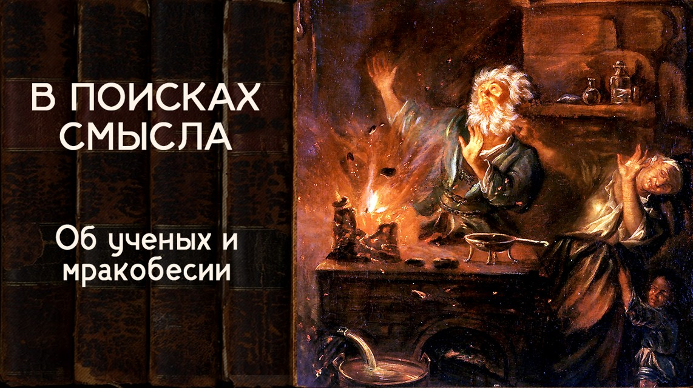

# Об ученых и мракобесии

17 июля 2024 [Аудиоверсия](https://paradoks-pinkera-pilotnyy-vypusk.simplecast.com/episodes/obscurantism) 37:46

Насколько наши школьные представления о мучениках и героях науки соответствуют фактам их биографии?
От Огюста Конта до Роберта Сапольски - научный позитивизм, как квази-религиозное учение.

**Е.Голуб:**
Здравствуйте, друзья!
Мы продолжаем выпуски третьего сезона подкаста «В поисках смысла».
У микрофона, как всегда, Евгений Голуб.
Ну и, конечно же...

**П.Щелин:**
.. Павел Щелин. Всё тот же.

**Е.Голуб:**
Сегодняшний наш выпуск мы решили назвать «О мракобесии и о науке».
Почему именно об этом поговорим сегодня?

Попробуем разобраться с этими сложившимися образами, картинами.
Вот есть у нас замечательные учёные, такие сдержанные, немножко отстранённые, которые действительно что-то понимают про этот мир.
Есть масса необразованных, подверженных влиянию, суетливых, а зачастую откровенно невежественных людей, которые продолжают почему-то следовать каким-то традиционным взглядам и убеждениям, что есть не что больше, как мифы и мракобесие.
Кого мы вспомним?
Мы вспоминали Сапольского, Докинса.

**П.Щелин:**
Кого не возьми, это было основное мейнстримное, скажем так, если тебе угодно, направление.
Так называемые новые атеисты очень были популярны в 90-е, 2000-е.
Но вообще миф-то гораздо раньше сформирован, о чём мы сегодня будем говорить.

В целом идея образа науки против образа религии, она у нас, по сути, вот как началась массовая секуляризация, образ очень чётко сформирован именно тогда.
Даже условно, если ты вспомнишь Базаров из "отцов и детей", в каком-то смысле это тоже про образ науки.

**Е.Голуб:**
Мне кажется, самый прекрасный, известный со школьных времён, я, правда, не знаю, ещё сейчас изучают "отцов и детей" в школе или нет.
Наверное, уже не во всех.
Но вот этот образ циничного, прагматичного человека, который режет лягушек, и вот эти ваши эмоции и сюсюканье, его вообще никак не интересуют.
Такие разговоры о чём-то нематериальном — блажь.

**П.Щелин:**
Но это образ.
Почему нам этот образ важен?

Потому что он на самом деле является очень фундаментальным и поразительно, насколько он антиисторичен в своих основаниях.
С чего мы можем начать нашу беседу?

Если мы возьмем любого так называемого героя науки, который поднимается на щит.
Это имеет прямое отношение к предыдущей теме Просвещения, которую мы обсуждали.
И начнем рассматривать реальные события, то мы обнаружим, что его история, его биография, его убеждения, ну вообще, если честно, в эту картинку не укладываются.
Какие?

Ну самый-самый избитый пример, конечно, это Джордано Бруно.
Раз мы работаем с мифом, хотя бы короткое упоминание здесь нужно дать.
Кто Джордано Бруно в массовом восприятии?
Мученик науки.
Человек, пострадавший за научные убеждения.

**Е.Голуб:**
Я недавно, кстати, слушал лекцию профессора Зубова.
Был поражён тем, что он воспроизвёл этот миф практически дословно, как он звучал во времена моих школьных лет.
Давно очень.
Поразительно.
Уже, казалось бы, всё про Джордано Бруно хорошо известно.

**П.Щелин:**
Но если совсем вкратце, то те процессы относительно Джордана Бруна были не потому, что он занимался наукой, а потому, что он занимался чернокнижничеством.
В буквальном смысле этого слова.
Человек вызывал демонов.
У него это было как бы действительно основное занятие.
Процесс шел много лет.
Много раз его просили, ну хватит, ну пожалуйста, ну не надо.
Если бы к сегодняшним политическим оппонентам применили столько убеждений, сколько было применено к Джордано Бруно, если бы им давали столько шансов, сколько дают Джордано Бруно, вы бы очень сильно удивились.
Сегодня все гораздо более жестко.

Если говорить вкратце, то это был прежде всего алхимик-чернокнижник, в буквальном смысле этого слова, который попутно, да, занимался рядом научных исследований, как бы сегодня сказали, но даже для него они не были самым основным занятием с точки зрения восприятия.
Ну и, соответственно, на этой почве он вошел в конфликт с католической церковью, которая всеми силами пыталась отговорить его от этого занятия.
И только после очень долгого процесса, очень долгого убеждения, в котором он сказал «нет, этим занимался и заниматься буду», ну, была применена санкция, которая применялось относительно к этим вопросам.
Вы можете спорить и говорить о том, что даже если он чернокнижник и алхимик, не надо было его сжигать, и этот аргумент можно отдельно рассматривать, но вы не можете говорить о том, что он пострадал за науку.
Ну вот просто это невозможно сделать.

**Е.Голуб:**
Да, я, кстати, совершенно случайно как-то узнал, что и с Коперником, оказывается, там всё не так просто было.
Основной аргумент, который я услышал, что меня поразило, что почему не хотели признавать его модель гелиоцентричную, хотя, опять-таки, это не было что-то совершенно новое в мышлении людей, абсолютно, но в то время увлечение астрологией было просто всеобщим.

Так вот, астрологи того времени и те, кто интересовался темой, они указывали, что нет, не получается, если применять эту модель, она не совпадает с результатами наблюдений.
И он не мог из этой ситуации выйти, потому что, во-первых, у него орбиты были, по-моему, круговые, идеальной формы круга.
И для того, чтобы как-то попадать в результаты наблюдений, нужно было бы ещё и усложнять, чтобы внутри этих орбит планеты каким-то образом вращались.

То есть дискуссия была исключительно аргументированная.
А в наших школьных нарративах было, что ну вот, пришёл Коперник и взорвал птолемеевскую модель, а все костные консерваторы его просто пинали ногами.

**П.Щелин:**
Да, это абсолютно не так, более того, Коперник был далеко не первый, кто утверждал, что Земля вращается вокруг Солнца.
Во всех средневековых университетов прекрасно читали тех же греческих авторов, у которых это указывалось.
И вообще-то основной аргумент, ну один из основных аргументов сейчас, я могу сказать, по отношению к вот этому средневековому восприятию, почему они предпочитали птолемеевскую модель, это был как раз (церковь, вот вы удивитесь), это был антропоцентризм.

Вопрос, откуда мы берем точку отчета координат.
Поскольку мы считаем себя детьми божьими, мы считаем, что мы и есть эта точка отчета координат.
И поэтому относительно нас, на самом-то деле, это очень даже современно с точки зрения, ну, вот этой всей теории относительности, от какой точки отсчета считать будете.
И поэтому, когда говорят о том, что вы не знали о том, что на самом деле вращение происходит по-другому, ну, может быть, они не знали, разумеется, не так хорошо, как знаем мы сейчас, но просто акцент был на другом, это было не так важно.

То есть это было философский, если угодно, выбор, а не в кавычках научный выбор.
И это просто еще раз один из примеров.

Другой, ну совсем знаменитый пример, кто является у нас символом науки с большой буквы Ньютон.
Ньютон, величайший из, как бы там, я не знаю, ученых, создатель ньютоновской физики, законы, которые мы изучаем в школе и так далее.
И это правда, он действительно все это сделал.

Только проблема в том, что в библиотеке Ньютона и в количестве написанных его сочинений, если мне не изменяет память, 80% тоже посвящены астрологии, алхимии, мистике и прочим-прочим-прочим вещам, чем он себя считал в первую очередь.
А вот эти научные изыскания для него были глубоко вторичны.
И вот какого символа вы не копнете...

Фрэнсис Бэйкон, упомянутый нами с тобой, мы говорили о том, что создатель мотто: знание — это сила.
Но если мы читаем его «Новую Атлантиду», то это чистый мистический трактат, который пропитан очень определенным духом именно эзотерики.
Сначала эзотерика, а потом он занимался этим.

То есть вот этот миф научный, как науки в отрыве от символической картины, в отрыве от мифологичной картины мира, он просто не подтверждается ни одним из реальных фактов, ни одним из реальных фактов биографии тех людей, которые поднимаются на щит науки.
Вот этот фундаментальный момент.
И здесь я просто призываю вас, уважаемые слушатели, самим изучить эти вопросы.
Потому что вы поразитесь, насколько это на виду, на поверхности.
И после того, как вы это увидите, у вас будет, конечно, очень странное ощущение.
Так, а почему я об этом никогда не слышал?
Это же буквально на виду.
Это же не скрытая какая-то инфа.
Это не тайна.

**Е.Голуб:**
Действительные факты обрезаются, кастрируются или запихиваются в некий нарратив, который призван обслуживать идеологическую картину, идеологизированную картину мира.
И как только нам удаётся, если нам удаётся, если мы заинтересованы, сделать шаг назад и рассмотреть историю какого-либо явления в деталях, то никак она не помещается в зашоренную картинку мира.
Никак.

Потому что, насколько я понимаю, все герои нашего сегодняшнего выпуска, они стремились к целостной картине, к целостному пониманию бытия.
А вот такое фрагментарное, научное для них не было свойственно, и оно не казалось правильным вообще так подходить.

**П.Щелин:**
Если быть точнее, у них это происходило.
Они бы очень сильно расстроились, если бы они поняли, что они создали.
Для них научный метод, можно спорить, насколько искренний, но я, кстати, думаю, они были довольно искренни, был, конечно, инструментом познания целостности.
Но получилось, что в процессе они эту целостность выкинули.
Ну, в частности, Декарт, в частности, потеряли.
Но в любом случае они не были учеными в современном представлении этого слова.
Они гораздо ближе по образу к доктору Фаусту.
Все.
Если реально брать вот образ, мировосприятие, они гораздо вот ближе к нему, к такому алхимику, у которого цельное представление, и он еще умеет заниматься вот этими опытами.

**Е.Голуб:**
Не случайно это произведение так и нашло такой отклик.
Ведь мы с тобой тоже говорили, что ведь многие явления, мы находим их в разные исторические периоды, но в каких-то периодах это становится трендом, создавая фурор, или художественные произведения, образы находят отклик, а в каких-то они идут на периферии.
И с Фаустом, я так понимаю, получилось точно так же.

**П.Щелин:**
Ну Фауст уловил дух вот всей 400-летней эпохи, конечно.
Это главный образ.
И я тебе больше скажу и даже немножко докажу на примере другого человека XIX века, насколько этот образ правдив.
И до сих пор все так называемые певцы науки, особенно певцы науки как политического проекта, реально оказываются Фаустами, а не вот неким отстраненным объективным научным знанием.
То есть и в XIX веке, и в веке XX.
Но это мы сейчас перейдем к этому.

Тем не менее, это очень принципиальный и важный момент.
Давайте просто зафиксируем первую точку.
На самом деле миф науки — это точно такой же миф в том современном виде, как он создан.
И любое приближение к реальным, скажем так, основателям этого мифа показывает то, что они сначала мистики, а уже потом ученые.
Это принципиальный факт, которого из истории не выкинуть.
И выбор идет не между, как бы мы сказали сегодня, мракобесием и чистым знанием.
А между, уж если вам это угодно, язык, одним мракобесием и другим мракобесием, одним мифом и другим мифом, нету этой опции, условно говоря, чистого знания.
А есть миф чистого знания, и поэтому тогда надо рассмотреть его в категориях мифа, ради чего он возникает и когда он становится прям массовым и полезным.
А это, конечно, XIX век.

Это XIX век и знаменитый Огюст Конт с его теорией позитивизма, в буквальном смысле так называющийся.
Если говорить совсем вкратце, в чем была суть теории позитивизма, он говорил, что было три состояния.
Он называл закон трех состояний.
Было теологическое состояние, потом стало метафизическое состояние, абстракции, и, наконец, наступает третье — научное состояние или позитивное состояние.
И основной аргумент в том, что мы познали физику, уже забавно звучит из современности, но вот человек считал, что мы уже познали физику, а теперь мы можем познать социальную физику.

**Е.Голуб:**
Мы с тобой разбирали в одном из наших выпусков.
Тоже не случайно, что он появился в XIX веке.
Но вот у меня такая мысль возникла.

Вернусь к названию нашего подкаста и к тому, почему вокруг него возникает много дискуссий.
Люди приходят в нашу группу в Телеграм, и там уже год с хвостиком ведут дискуссии, потому что кажется человеку присуща потребность в целостности картине мира, в целостной картинке.
Он не может воспринимать мир как набор каких-то фрагментов.
Это тяжело, это уже какое-то нездоровое психическое состояние.

И поэтому, если в XIX веке, так сказать, прогрессивное человечество, выросшее из салонной культуры, потихонечку откладывает и отстраняет Бога, то на его место должно появиться что-то другое.
И вот это что-то другое, наверное, оно в конечном итоге заняло место Бога уже в XX веке, но в XIX оно потихонечку росло как концепция.

**П.Щелин:**
А это вот я как раз почему приведу несколько цитат из того же Конта.
Это нам так кажется.
Это первый взгляд.
Вот что о себе писал сам Конт.

> Я — человек, которое высшее существо доверило задачей установления истинной религии.

Вот этот человек, который говорит про научный позитивизм, блин, который говорит о том, что вот мы познали физику, сейчас установим социальную физику, в тех же своих трактатах пишет о том, что его задача — установить истинную религию.
Позитивизм — это не антирелигиозное, это религиозное движение.
Культ науки — это именно культ науки, религиозный, понимаешь?

Вот она.
Уже здесь заложенная подмена.

**Е.Голуб:**
А сейчас что можно сказать?
Ведь сейчас этот культ науки немножко по-другому выглядит.

**П.Щелин:**
Так то же самое.
Но он меняется, но это тот же самый культ.
И воспринимают его как религиозный культ.
Но он меняется.

Сейчас, например, это есть версия зелёного религиозного культа или сочетания неомарксизма и так далее.
Но тут важен момент для нас другой подчеркнуть.
То, что вот это религиозное начало в человеке неустранимо.
И выкинув, условно говоря, христианство, вы не становитесь нерелигиозными.
Вы становитесь такими же религиозными.
Просто вы поклоняетесь другим богам.

**Е.Голуб:**
Да, и знаешь...
Хотя бы поверхностно коснувшись системы взглядов наших предков тысячу лет назад, две тысячи лет назад, оказывается, что сегодняшний культ гораздо примитивнее намного, чем религиозные чувства, выраженные в культах, если хочешь, греков, римлян, кельтов, кого угодно.
Больше трансцендентного, больше чувства, больше недоговоренности и гораздо скромнее место человека.

**П.Щелин:**
Оно становится на самом деле, если говорить философски, гораздо более эзотеричным.
То есть христианство открытое.

А здесь у тебя на поверхности одно, красиво, а внутри совсем другое.
Опять-таки, повторюсь, Конт, создатель у нас якобы вот науки, да?
Что он ещё пишет?

> Единственная неизменяемая троица, которая направляет нас и которая заслуживает нашего поклонения, состоит из великого существа, великого фетиша и великой природы.

**Е.Голуб:**
Троица опять-таки.

**П.Щелин:**
Это научное мышление.
Я могу тебе буквально сейчас зачитать очень поразительный момент.
Это был бывший ассистент генерального секретаря ООН, не случайный человек, называется доктор Роберт Мюллер.
Он написал повестку на будущее.
Наши абсолютные приоритеты и задачи для 21 века.
Так вот, какие это задачи?

Первая задача — превратить эту планету в рай.
Это религиозная категория.
В первом же предложении.

Достигнуть гармонии всечеловеческой в семье между небом и землёй, быть ultimate cosmic success of the universe and God.

**Е.Голуб:**
Так тут и Бог есть?

**П.Щелин:**
О чём и речь.
То есть религия никуда не ушла.
То есть пресловутое, вот как это в этом контексте, «мракобесие», в кавычках, как видите, все ваши духовные лидеры, все ваши авторитеты, они не менее эзотерики, они не менее мистики, они не менее язычники, чем, условно говоря, попы с капустой в бороде.
Вот о чём идёт речь.

**Е.Голуб:**
Допустим, мы говорим о том, что культы и тяга к трансцендентному находят выход себе в самых разных вещах, даже если те, кто культы проецирует, до конца не понимают, о чём идёт речь.
Но так какое же отношение правильное?
Или как ты видишь?
Давай я задам вопрос твоему личному взгляду.
Как ты видишь отношение веры, религии и научного знания?

**П.Щелин:**
Вижу это в паламистской традиции.
В рамках паламистской традиции есть академия и есть лавра.
Одно другому не противоречит, но одно выше другого.

Если ты помнишь, как мы обсуждали во время Григория Паламы, научное познание само по себе не сделает человека духовней, чище, не ответит на эту пустоту, на вот эту жажду смысла, которая царит в его сердце.
Поскольку нам дана способность к познанию мира, ей надо пользоваться с огромным даром, с огромной ответственностью, как части, условно говоря, божественного замысла в рамках человеческой природы.
Но понимать, что дух первичней, этика первичней по отношению к способности доминировать посредством ума над реальностью.
И уж точно не делать из своего собственного ума культ.

То есть можете заниматься наукой, но тогда хотя бы будьте честны, чем вы занимаетесь.
Если вы занимаетесь наукой, ну, занимайтесь познанием мира, но не делайте культ из науки, потому что тогда вы попадаете сразу в религиозную основу.
И более того, я тебе могу сказать, с философской точки зрения любое занятие наукой предполагает собой религиозную реальность.
Ну, например, такие понятия, как познаваемость мира — это не научное понятие, это философско-религиозное понятие, если на то пошло.

**Е.Голуб:**
А почему ты говоришь «философско-религиозное»?
Подожди, перебиваю, потому что цепануло.
Почему не просто философское?

**П.Щелин:**
Потому что любая философия по-настоящему упирается в религию.
Теология — это вершина философии.

Все великие философы в конечном итоге приходят к той или иной религиозной формулировке, религиозной парадигме, даже Платон, даже как Аристотель.
Они это не могут назвать, допустим, Иисусом Христом, но они говорят «форма всех форм», «первоначало первоначал».
Ну то есть они это описывают вот в другом языке, но тем не менее это религиозное понятие — это не чистое понятие.

Почему я говорю о науке?
Ну, например, вот я держу в руке чашку, да?
Вот что позволяет мне...
То есть мы знаем, например, с точки зрения микроскопов науки, что она состоит из множества атомов, и формально видеть границу между чашкой и воздухом крайне сложно.
Что позволяет мне видеть в чашке чашку?

Вот это пресловутая чашкость, пресловутая моя способность к наблюдению за феноменом, пресловутая моя способность видеть целостность за разрозненными феноменами.
Это всё в строгом смысле то, чем наука пользуется каждый день.
Это основание науки.
Но их природа философская, их природа за пределами науки.

**Е.Голуб:**
Но это у нас сейчас Кант касается.
Ты кантианец сейчас или что?

**П.Щелин:**
Нет, это вообще не кантианец.
Это базовое, скорее, платонизм, даже если уж на то пришло.

**Е.Голуб:**
Ну хорошо, ладно, не будем углубляться, тем более, что здесь требуется больше знания.

**П.Щелин:**
Ну да, это просто, опять-таки, мазок в сторону того, что люди, которые занимаются наукой, проверьте вообще, почему вы занимаетесь наукой.
Это что, это не Платон, это Аристотель, господи.

Есть великолепная книжка, всем рекомендую, называется «Метафизика Аристотеля как основание науки».
В чате будет ссылочка, так что приходите, что называется, в чат за ссылочкой.
Но можете прочитать и ознакомиться именно как раз с вопросами о том, что фундаментальные принципы так называемого научного познания, они находятся за пределами науки.

**Е.Голуб:**
Хорошо, ну уходим в дискуссию.
Давай я тебя немножко в другое русло направлю.

Знаешь, есть набор простых ответов на сложные вопросы, и до поры до времени они, в общем, довольно устраивают многих, как и меня.
В своё время давно уже я услышал простое объяснение, которое долгое время мне вполне казалось адекватным.

Так вот, оно звучало так, что, ну, послушайте, наука никогда не отвечает на вопрос о причине, зачем.
То есть если вопрос «зачем?», ну, хорошо, вот там закон всемирного тяготения звучит так.
Почему он такой и зачем он нужен?
Это вопросы не к науке.
А вот, мол, философия и теология, и религия как таковая, они и дают ответ на вопрос «зачем?», «для чего?», «с какой целью?».
Что ты думаешь по этому поводу?

**П.Щелин:**
Я думаю по этому поводу, что это глубокое заблуждение, это ошибка, опять-таки, схоластика, то же самое.
В общем, вплоть до 400 лет до нас люди занимались наукой, и они как раз видели её, как сочетание четырёх причинностей, включая телеологическую причинность, то есть причинность ответа на вопрос «зачем?».
Идея о том, что наука не отвечает о целевой причине, это как раз идея модерна.
И, на мой взгляд, она глубоко ошибочна.

**Е.Голуб:**
Давай остановимся здесь поподробнее.
Почему ты считаешь, что наука отвечает на вопрос «зачем» и «почему так?» Почему именно так?

**П.Щелин:**
Смотри, вопрос «зачем» — это пресловутое «к чему нечто стремится».
Телос.
Что такое телос?

Телос — это, условно говоря, точка назначения.
То, к чему вещь, условно говоря, стремится.

Назначение стула, чтобы на нём сидели.
Например, чтобы он был удобным стулом.
И мы оцениваем качество стула относительно того, насколько он воплощает в себе эту самую цель.
И точно так же обстоит с любым феноменом.
С человеком, с семьёй, с обществом, с государством, с атомами и так далее, со Вселенной.

Это неприятно для человека, потому что в этой картине сразу входит Бог.
Но просто как условно-исторический факт, вплоть до 400 лет назад наука не боялась смотреть на реальность именно под таким углом.

**Е.Голуб:**
Эта научная реальность включала в себя Бога как часть этой реальности.
Поэтому она и не боялась.

А сейчас, если ты задашь вопрос такого рода «А почему и зачем?», мои любимые квантовые физики, сфера моего удивления, скажет, ну, так и есть, мы это наблюдаем.
Почему именно такое и зачем оно такое нужно?
С какой целью существует явление квантовой спутанности и прочее, но это вообще вопрос некорректный, не стоит его так задавать.

**П.Щелин:**
Я считаю, что это вопрос более чем корректный, просто, условно говоря, преонтология, та, которая есть сейчас, она не позволяет людям самим себе его задавать.
Между тем, это и есть самый интересный вопрос.

**Е.Голуб:**
Да, конечно.
Смысл?

**П.Щелин:**
В чём смысл всего этого?
Потому что в противном случае, получается, вы занимаетесь либо бессмысленной деятельностью, и тогда это очень неприятно, я думаю, это саморазрушительно.
Я думаю, что смысл-то учёные в себе предполагают.
Я искренне думаю, я много встречал, что на самом-то деле многие учёные, которые как раз вот занимаются такой вот, особенно терфизикой или вот такой квантовой механикой, они в глубине души думают, что они выполняют на самом деле одно из божественных предназначений для человека, а именно познание мира.

То есть они не просто ерундой занимаются, а они искренне в душе думают, глубоко, то, что их деятельность имеет высший смысл, в частности, вот высший смысл познания, идеал познания, то есть такого с высокой точки зрения.
Но это не большинство, особенно это не публичное большинство.
А на практике получается, что если нет вот этого высокого смысла, нет целостной картины, то за наукой, как и предрекал Бэкон, останется только одна задача — власть.

Мы занимаемся наукой, чтобы получить власть, но тогда власть и выступает целью.
Вот тебе и ответ на этот вопрос.
В чём тогда цель науки?
Цель науки создавать власть.

**Е.Голуб:**
Получать власть, да.

**П.Щелин:**
Получать власть, да.

**Е.Голуб:**
Будь то это власть сначала над природой, а затем с помощью природы или физического какого-то явления над человеком.

**П.Щелин:**
Над человеком, конечно.
Понимаешь, это неизбежно, оно не бывает по-другому.
И опять, если ты не служишь, условно говоря, Богу, то ты всё равно будешь кому-то служить.

Либо себе самому, либо своим страстям, либо какому-нибудь язычественному культу, как делают, например, сейчас культ геи очень популярен, на самом деле, вот в рамках этой всей экологической повестки.
Ну, тем не менее, это неизбежно, потому что человек религиозен, сознание религиозно.
Ты знаешь, вот, наверное, это вот, когда мы говорим о философии сознания, мы упрёмся в тот момент, что наше сознание религиозно.
Поэтому это неустранимо из нашего опыта.

**Е.Голуб:**
Слушай, ну тебе учёные прибегут и расскажут.
Слушайте, ну как бы это характеристика нашего сознания.
Так как нам необходимо было выживать, всё время искали объяснение причины, причинность.

Веточка дрожит, потому что там, может быть, спряталась пантера.
Мой товарищ выпил из грязного ручья, у него заболел живот.
Значит, из грязного ручья пить нельзя.
И вот эта причинность объясняется, скажем так, наработанным таким алгоритмом мышления.
А это, может быть, вообще, скажем, не имеет отношения к реальной...
Реальность вообще непричинна.
Чего это вы тут причинность ей приписывать?

Вспоминаю Канта.
Недавно же ему 300 лет исполнилось, по-моему.
Был повод почитать, послушать о Канте.
И там, конечно, много возникает неожиданных вопросов.
Благодаря его формулировкам, понятым даже на моём там уровне обывательском.

Может быть, объяснить всё проще.
Причина — это то, что зашито в ваше мышление.
И попытка найти причину в чём-то за пределами материального мира — это ошибка, аберрация такая.
И более ничего.

Так же, как ваши все сложные так называемые комплексы чувствительные и переживательные, есть колебания уровня гормонов, нейромедиаторов в вашей крови, то и причинность есть не более, чем свойство вашего сознания.
Расслабьтесь, не ищите причин.

**П.Щелин:**
Нет, это ошибка, на мой взгляд.
На самом деле, опять-таки, Аристотель здесь выступает гораздо сильнее и целостнее, потому что он может сказать тебе, допустим, то, что есть материальная причина.

Условно говоря, в примере с ручьём.
Материальная причина того, что вы заболели, когда выпили воду плохую, то, что там бактерии.
Это материальная причина.
Её можно изучать как материальную причину.
Нет в этом никакого противоречия.

**Е.Голуб:**
Я пытаюсь тебе привести аргументы, скажем так, с противной стороны, которая к тебе приходит и говорит, ну, в общем, да, это материальная причина, причинность есть в материальном мире, её отрицать сложно.
Ну так кто сказал, что она, в общем-то, распространяется на большее, чем вот простые жизненные навыки?

Вот приходит Сапольски и говорит: Что? Свобода воли? Не смешите меня, мы все детерминированы.
И попробуй поспорь, он тебе там поулыбнётся, покажет тебе анализы.

**П.Щелин:**
Они сами себя опровергают.
Господи, ты видел это последнее видео Докинза, где он говорит о том, я, конечно, не христианин, и я вообще выше всего этого, но, блин, что-то как-то жалко, что у нас церкви пустые стоят.

И вот, понимаешь, их жизнь опровергает, сами себя опровергают, потому что, ну, во-первых...
Он как бы, понимаете, я за культурное христианство.
То есть, чтобы мы играли в эту имитацию, потому что от этой имитации, очевидно, много пользы такой культурной.
Но я, разумеется, по-серьезному в это верить.
Не-не-не, это выше меня.
Ну, в буквальном смысле человек видео записал.

То есть, он признает, что все, что он сделал, направлено на саморазрушение мира вокруг него.
Весь его вот этот научный атеизм, вся вот эта мидиал-сапойска, она вся мортальна.
Она способна только разрушить.
И все они существуют исключительно как паразиты.
Вот поэтому в чем их дело и задача.
И вот теперь очень забавно видеть, когда они видят плоды своих поступков.

А второе, можно спросить у Сапольского очень простую вещь, в ответ на все эти вопросы.
Если все обстоит действительно так, как вы говорите, тогда что же вы этим занимаетесь-то?
Если всё бессмысленно, если свободы воли нет, чего же вы тогда воздух-то теребите?
Вы своим жизненным опытом свидетельствуете о том, что вы не исповедуете то, что вы проповедуете.

**Е.Голуб:**
Ну да, слушай, мы с тобой забрели в дебри, надо оттуда выбираться, потому что разговоры о Сапольском, о Докинзе и о науке — это разговор требует отдельного времени, может быть, больше экспертизы, по крайней мере, с моей стороны.
Но так или иначе, давай попробуем вернуться, с чего начали.
Наука как миф.

В моём понимании образ вот этой науки, причём это какой-то такой образ, невольно тоже какой-то, либо чёрный ящик, либо какая-то дымящаяся там даль таинственная, в которой находятся предельные знания.
И вот стоит только проникнуть в эту науку, и мы наконец-то разберёмся, как мир устроен и, может быть, даже зачем.
Что этот образ, он, естественно, возникает только в обществе, откуда удаляется теоцентричность.

**П.Щелин:**
И здесь даже мы вроде не сказали ничего удивительного.
Большая часть людей с этим согласится.
Здесь как раз удивительного ничего нет.

Что важно заметить, что в этом процессе на самом деле теоцентричность не исчезает.
Она подменяется.
То, что на смену Богу приходят новые идолы.
Но не возникает вот этого, нейтральности.
Не возникает объективности, о которой говорят.
И проверить это очень просто.

Берёте любого теоретика науки, любого теоретика позитивиза, особенно науки как социального движения, любой современный текст, и вы увидите, что он как был теологичным, так он и остался теологичным.
Просто идолы в нём теперь другие.

**Е.Голуб:**
Да, и при внимательном рассмотрении можно убедиться, что любая концепция, научное объяснение мира, оно неизбежно срезает углы, так сказать.
Вот это мы оставляем за скобками, тут мы не присматриваемся, нам нужна целостная или псевдоцелостная картина, основанная на научном знании.
Поэтому мы идём на такие же приёмы и ухищрения, на которые идёт любая секта.

**П.Щелин:**
Условно точно так же есть непроверяемые аксиомы, которые просто не ставятся под сомнение.
Только если в религии вам говорится, что аксиомы условно дал Бог, то здесь они просто есть.

Это аксиома.
Мир познаваем.
Это аксиома.
Почему?
Почему вы вообще взяли, что, например, мир познаваем?
Ну, это знаменитая вилка Юма, да?
Это даже мемы на эту тему есть и так далее.
Так что в любом утверждении...
Или знаменитая теорема Гёделя о неполноте.

В любой системе координат должна быть точка отсчёта, внешняя по отношению к этой системе, которая, по сути, принимается за аксиому.

**Е.Голуб:**
Ну, знаешь, я буквально сегодня совершенно случайно, не в связи с нашим разговором, слушал известного популяризатора науки, математика Саватеева, кажется, так его фамилия произносится.
И он там просит не связывать теорему Гёделя о неполноте с верой в Бога, с концепцией религиозной, потому что он говорит, что, ребята, это очень большой труд, очень сложный.
Оттуда берётся одна только такая цитата, которая звучит понятно и красиво, и применяется всеми для того, чтобы обосновать в том числе религиозный подход к жизни.

Но тот же самый Саватеев, он как раз является человеком верующим и говорит, что в математике повсюду торчат, как он говорит, «уши Бога».
Очень интересный такой человек.
Поищите его записи, популярные лекции.
Конечно же, это потрясающе, как он умеет рассказать о математике, о знании и о том, насколько эта гармония не может быть объяснена случайностью.
То есть просто никак не может быть объяснена случайностью.

Возникает этот парадокс, потому что, с одной стороны, развитие математики, физики говорит нам о том, что вероятность случайного возникновения жизни, мира как такового, практически исчезающая мала.
Мы это знаем, но откладываем в сторону.

Вот, кстати, одно из интересных явлений, что многие добытые наукой знания, которые не помещаются в такую устоявшуюся картинку, они просто откладываются в сторонку, они вытесняются.
То есть хорошо известны, посчитанные математиками, вероятности возникновения устойчивых случайных мутаций, то, что Дарвин ещё не знал.
Вот есть такой доктор Берлинский, говорит об этом ясно, чётко.

Я всё жду, когда появятся такие же ясные, чёткие аргументы против.
Они уходят в туман.
Может быть, мне просто не повезло.
Тем не менее, возникает ощущение, что эта наукоцентричная картина мира, она всё же во многом мало чем отличается от некого его учения культа, от некоторого культа.
Просто этот культ сейчас — это культ нашего времени.
Он удобен, потому что он даёт надежду.

**П.Щелин:**
И он ничего не требует от человека до поры до времени.
Очень важный момент.

**Е.Голуб:**
Ну, кстати, да.
Просто верь в науку, и будет тебе хорошо.
Плати налоги, а учёные во всём разберутся.
Расскажут тебе, как работает та или иная штука.
А что там тебе какие-то личные напряжения делают?
Нет, ну что ты, наоборот.
Ты прекрасен такой, какой ты есть.

Пользуйся и подумай, что тебе ещё нужно.
Вот мы как раз притащим это всё из научного знания и тебе устроим, чтобы все твои пожелания удовлетворялись.

**П.Щелин:**
Просто поддерживаю полностью, подписываюсь под каждым словом.

**Е.Голуб:**
Ну, не знаю, мне кажется, что мы, конечно, очень по поверхности здесь прошлись, и, возможно, нас справедливо, скажем так, в комментариях к нашему подкасту будут упрекать в этой поверхносности, но слишком уж тема большая и сложная.  Может быть, ей стоит посвятить отдельное, вообще говоря, время.

**П.Щелин:**
Может.
Главное то, что, опять-таки, это еще один пример, все-таки цель сезона, которая подходит к концу, была именно показать совсем неочевидные вещи в тех самоочевидностях, которыми мы постоянно пользуемся.

**Е.Голуб:**
Да, и тут, ты знаешь, меня опять начинает заполнять моё большущее желание каким-то образом передать нашим слушателям, тем, кому действительно хотелось бы своё понимание мира как-то улучшить и смысл почувствовать, понять или устремиться хотя бы к нему.

Первое, что нужно сделать, это поставить под сомнение всё, что вы знаете до сих пор, всё, что вы думаете, что вы знаете.
Вот это очевидное или самоочевидное.

Так случилось, что наше с вами образование построено на системе упрощений, толкований каких-то историй.
Которые зачастую корнями вообще 100-летней, 150-летней давности ещё находятся.
Самый лучший пример, который сейчас мне известен, это наше знание истории Римской империи или Древнего Рима от республики к империи.

У нас до сих пор в школьном образовании царят гипотезы Гиббона, его знания, что это за сроки, или Момзена.
То есть это XIX век, простите.
С тех пор вообще изменилось почти всё, но это знание не вошло ещё в практику современного образования, эти новые истории не сформированы.
И мы продолжаем думать, что мы что-то знаем о Древней Риме, хотя мы повторяем уже ненаучное знание, которое пришло к нам из того периода, когда больше не было доступно.

И также во всём, практически во всём, вот куда ни ни кинь, наше обыденное представление оказывается сформировано из устаревших концепций или намеренно обрезанных историй.
И здесь, если ты хочешь, или вы хотите, начать движение в сторону какого-то познания, нужно прежде всего сказать себе: ну, знаешь, наверное, я глубоко невежественный человек, и стоит присмотреться к различным версиям тех или иных концепций или вещей, которые меня интересуют.

**П.Щелин:**
И от себя добавлю всё-таки, я здесь немножко даже выступлю, тебе пропонирую, потому что твоя позиция немножко звучит как такой, знаешь, чистый скептицизм.
А для меня здесь важно, что во всем этом пути все-таки искать вот это зерно вечности, как бы я это сформулировал.

Все-таки нам нужны вещи, которые...
Опять-таки, потому что сколько бы вы картин не создавали, сколько бы вы их не перепроверяли, мы все равно будем жить в мифе.
Я живу в мифе, ты живешь в мифе, все живут в мифе.
Это плата за сознание в каком-то смысле этого слова.

Но, то, что мифы есть, не значит, что все мифы равнозначны, что все мифы равным образом укорены в вечности, все мифы равным образом укорены в реальности.
Но для этого всего нужно многие вещи переосмыслить.
То есть я действительно допускаю то, что по мере продвижения по пути познания, если угодно, то вы, наоборот, ещё больше убедитесь в том, что вы считаете истинным.
И это будет прекрасно.
Но главное то, что это будет на порядок более осознанно.

Я думаю, что одна из, конечно, характерных черт текущей эпохи, которую мне, как традиционалисту, может быть, неприятно признавать, но придется, связана с тем, что повысилась требованность к осознанности, к вещам, которые раньше не были осознанными.
Пример из другой области условно демографический.

Никогда раньше демография не была вопросом осознанности, а теперь стала.
А теперь, я бы сказал, смыслоцентричность.
Большей части людей в каком-то смысле было проще, они просто получали картину мира от предков, спокойно ее переносили вперед.
Не надо думать, что они были идиотами.
С точки зрения, например, психологического здоровья, они были на порядок более психологически здоровы, чем мы современные, если уж смотреть на многие вещи.
И в каком-то смысле в базовых вещах и картина мира, уступая нашей в частностях, была более адекватна в целом.

Но.
Сегодня такой опции нет на самом деле.
Сегодняшняя опция поднимает для нас планку ответственности и заставляет нас снова выбирать.
Для того, чтобы снова выбирать, первым этапом, конечно, нужно разобраться.

**Е.Голуб:**
Другими словами, что если наши предки имели роскошь такую, у них была такая роскошь, принять полностью целостную картину, полученную как откровение или как результат тысячелетних исследований человеческого духа, то есть они получали в готовом виде, вот, бери, пользуйся, то сейчас, после истории последних 400 лет...

**П.Щелин:**
Её слишком разбили, слишком фрагментировали.
Её сначала вам придётся пересобрать, да.

**Е.Голуб:**
Да, то есть тебе придётся пересобрать её заново самому.
Как ты говоришь - выбери снова.
Но выбери уже в большой степени как осознанно, сделай свой выбор осознанным, а свободно прими её не как результат авторитета человека или института, который тебе её передаёт, а как некоторый свой выбор.
Могу ли я так сказать, или это будет слишком смело?

**П.Щелин:**
Вот это я полностью с тобой согласен.
Мне кажется, это хороший такой финал.
Не только для этого выпуска, но и для вот этой основной части нашего сезона.

**Е.Голуб:**
Ну хорошо, надеюсь, что мы с тобой сегодня, пробираясь между тяжёлыми и сложными темами, каким-то образом вырулили на такой более-менее понятный вывод, то есть вывод, который следует из наших с тобой рассуждений.
Ну и, скажем, я думаю, что на этом наш с тобой дружеский разговор, к которому мы приглашаем присоединиться наших слушателей, я думаю, что на сегодня мы его завершим.

**П.Щелин:**
Согласен.
Ещё раз спасибо тебе.
Я получил от сегодняшней беседы, если честно, огромное удовольствие.
Спасибо тебе.

**Е.Голуб:**
Спасибо вам, дорогие слушатели, и до встречи.
