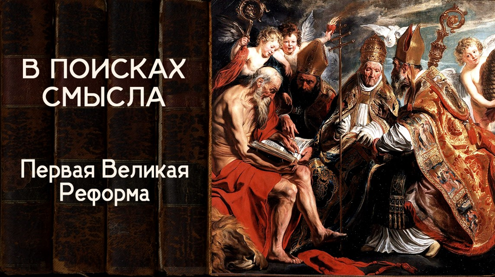

# Первая Великая Реформа

31 мая 2024 [Аудиоверсия](https://paradoks-pinkera-pilotnyy-vypusk.simplecast.com/episodes/reforma) 31:24

То, что сейчас называют «Западной цивилизацией», неотделимо от понятия «реформа».
Авторы рассматривают историю реформ, приведших к формированию «западноевропейского» образа мысли и  послуживших прологом к тому, что позже назовут эпохой Возрождения.

**Е.Голуб:**
Здравствуйте, друзья!
В эфире пятый выпуск третьего сезона подкаста «В поисках смысла».
У микрофона Евгений Голуб...

**П.Щелин:**
...и Павел Шелин.
Здравствуйте!

**Е.Голуб:**
Павел, мы на предыдущих наших встречах разбирали некоторые ключевые понятия, которые формируют во многом картину мира современного человека, и выяснили, что изначальное содержание этих понятий очень отличается от того, как мы сейчас их используем.
Рано или поздно мы должны были подойти к той точке, с которой происходит, чтобы не сказать подмена, а просто наполнение этих понятий иным смыслом.

Как ты видишь эту точку?
Можно ли сказать, что это именно точка?
Скорее всего, это какой-то процесс, период.
Что ему предшествовало и что его определило?

**П.Щелин:**
Ну, что называется, вопрос на миллион.
Потому что, разумеется, ты прав, это не точка в чистом виде этого слова.
Это длительный процесс, который можно обозначить на самом деле длиной ни много ни мало 800 лет.
И мне кажется, этот процесс крайне мистифицирован для большинства наших с тобой слушателей.
И поэтому в дальнейших 5-6 выпусках, я пока ещё не знаю, сколько у нас это займёт, мы с тобой попытаемся разобраться как раз с вот этой большой не подменой, но мистификацией.

Общая суть этого процесса, его корневой стержень — это, конечно, так называемое Возрождение с её так называемым антропоцентризмом, приводящее вот то, что мы называем, к эпохе современности, к модерну.
Но чтобы понять, откуда берётся Возрождение, нам придётся отступать ещё дальше.
То есть если Возрождение, условно говоря, начинается с XIV века, чтобы понять корни Возрождения, нам придётся отступить вообще ещё дальше на несколько столетий и проследить хотя бы вот эти основные линии, основные источники, потоки, протоки, которые, условно говоря, наполняют вот это желание, из которого рождается вот этот большой мегафеномен, из которого рождается вот это современное наше уже понимание и непонимание.
Когда мы используем слова, не понимая их значения.

И первым таким упражнением большим в этом вопросе, я бы, конечно, выбрал понятие реформы, потому что понятие реформы является одним из ключевых понятий, мне кажется, всего в широком смысле западного цивилизационного дискурса, который в том или ином виде в XX веке и в XIX веке продоминировал над всем миром, и наследие которого теперь несут в каком-то смысле опять-таки все культуры, все страны и все народы.
Поэтому в этом есть определённое, скажем так, рациональное зерно с моей стороны.

**Е.Голуб:**
Причём замечу, что слово «реформа», по крайней мере, в моём восприятии, это несёт, окружено чем-то позитивным, какая-то коннотация позитивная.
Реформа — это нечто хорошее.
Что-то отжило своё или просто перестало работать как нужно.
И мы это нечто реформируем, придаём ему новую форму, и эта форма лучше, чем предыдущая.

**П.Щелин:**
Именно-именно так.
Ты полностью прав в этом своем описании.
Проблема в том, что мы мало знаем, откуда вот это понятие, вот эта самоочевидность, которую ты выразил, проистекает.
Потому что она возникла не случайно.

Для человека традиции такое представление о реформе на самом деле является контринтуитивным.
Если ты помнишь, оно стоит вообще на...
Традиция часто вообще стоит на противоположном течении, что от Золотого века к Серебряному и далее к Железному.
Откуда берется сама идея, что из точки А в точку Б можно произвести радикальное улучшение?

Она не самоочевидная.
Она рождается в очень интересном контексте западной истории, и ему предшествует очень длительный путь.
Собственно, можно сказать, что с реформы то Запад и рождается.
И первые великие реформаторы Запада, это был далеко не Мартин Лютер.

Итак, я позволю себе небольшой исторический экскурс.
Дело в том, что рождение Запада, мы знаем точную дату, когда родился современный Запад в современном его понимании.
Это 25 декабря 800 года.

Коронация Карла Великого, императором, очень важный момент, папой Львом Третьим.
На самом деле это ключевой момент вообще нашей истории, потому что с этого момента общая христианская история распадается на две непримиримые части.
Этому моменту предшествовал длительный сложный период, в котором, прямо скажем, все были хороши.
И византийские императоры были хороши, и папы были хороши.
В чем была основная историческая драма?

То, что на протяжении двух веков, с 537 по 752 год, папы, по сути говоря, назначались исключительно с согласия императора Византии.
Они были частью, условно говоря, вот этого общего пространства.
В восьмом веке наступает кризис.

Византия погружается в иконоборчество, папы восстают против этакового иконоборчества, то есть стоят на чистоте доктрины.
В ответ начинается политическая борьба, в которой императоры Византии посылают к папам наемных убийц.
Папы, мягко говоря, сопротивляются разными доступными политическими методами.
И в 741 году папа Захарий становится папой без согласия императора.

**Е.Голуб:**
Вот в моей картине, тот нарратив, который, мне кажется, убедительным, или, по крайней мере, меня убедил, то ещё предыстория звучит так, что после вторжения арабов, после арабских завоеваний, после победоносного шествия ислама, то это иконоборчество возникло как некоторая реакция на то, что, может быть, что-то с нашей верой не то, может быть, вот это поклонение образам, которое в том числе возмущало ислам, мусульман.

Может быть, действительно это зашло слишком далеко?
Мне кажется, что это тоже была попытка некоторой реформы - иконоборчество.
Можно ли так сказать?

**П.Щелин:**
Я бы сказал, у нас для иконоборчества есть более точное слово.
Это была ересь.

Вот конкретно к той истории, которую я сейчас вывожу в фокус, вот это имеет гораздо меньшее отношение.
Только в том контексте то, что исламские завоевания Византию, конечно, ослабили.
Это главные последствия.

Но для вот этого раскола на Запад и Восток гораздо большую роль сыграли не мусульмане, а лангобарды, германцы.
Ключевая проблема Италии были не арабы.
Это были германские племена, которые спускались, соответственно, в Италию и создавали большие политические проблемы.

**Е.Голуб:**
Ну, это после того, как Византия на время отвоевала Италию, выбила оттуда готов.
И готы, которые были более-менее лояльны к римским порядкам, они были побеждены, а потом пришли лангобарды, которые там ни с кем не церемонились, насколько я понимаю.

**П.Щелин:**
Да, но опять, потом - это через два века.
Надо понимать, что вот эта прерывистость римской истории — это тоже западный возрожденческий нарратив.
С точки зрения Византии никакой прерывистости не было.

Условно говоря, на относительно короткий исторический период, ну там менее века, германцы завоевали Италию, а потом тот же Рим ее назад и отвоевал.
Так что с точки зрения Византии прерывистости не было никакой.

А вот с 751 года начинается подготовка к созданию этого фундаментального раскола.
В чем была политическая проблема?

И вот я хочу подчеркнуть, что здесь история очень интересная, потому что началось все не с богословского различия, а с политической необходимости.
Лангобарды захватили Равенну, имперская столица в Италии.
И, откровенно говоря, на этом фоне, на фоне ослабшей Византии от арабов, на фоне напряженности в отношениях в силу иконоборчества, ересей, взаимных оскорблений, которыми к тому времени император с папами успели обменяться, папе римскому нужна была новая крыша, политическая крыша, вот по-простому.
И он нашел эту новую политическую крышу в виде герцога франков Пипина Короткого.

Здесь возникло уникальное историческое окно возможностей.
Дело в том, что Пипину в тот момент тоже требовалась помощь папы.
Кем был Пипин?

Он был герцогом на тот момент, и он планировал заговор по захвату власти.
Но для этого ему надо было освободиться от клятвы, которую он до этого дал королю франков.
Это были суровые германские племена, военная аристократия, поэтому к клятвам относились весьма серьезно.
Надо было как-то снять с себя эту клятву.

В этой связи он пишет письмо Захарию, спрашивая, правильно ли это, что управлять государством должен человек, не имеющий силы, или им должен управлять тот, кто в реальности обладает рычагами власти.
Важно, что Захарий ему отвечает по сути ключевую вещь, из которой рождается римская идея, что источник всякой власти, в том числе и королевской, лежит на самом народе, но право народа подлежит утверждению папы.

**Е.Голуб:**
Вот это акторитус, да?
Вот это тут у нас возникает опять.

**П.Щелин:**
Но суть в том, что папа.
То есть как бы власть от народа, но какого именно народа и как, это решает папа.

Захарий не успевает, а вот уже следующий, папа Штефан Третий, Пипина в Париже коронует.
Мало того, что он его коронует, он тогда и утверждает вот этот фундаментальный принцип папского супремоси.
То, что кто легитимный король, а кто нелегитимный король, решает папа.

**Е.Голуб:**
Ну и получается, что тут все нашли друг друга, да?

**П.Щелин:**
Так дальше история развивается.
Из этой великолепной поездки папа приходит ни много ни мало с одной из величайших подделок в истории, так называемом Константиновом даре.
Это как бы мифический документ, который уже сильно несколько веков назван подделкой исторической.

Тем не менее, согласно якобы этому документу, еще Константин Великий, римский император, передал папе римскому Сильвестру I всю западную римскую империю в управление.
Параллельно с этим, собственно, в обмен на такие большие услуги со стороны папы, вот этот Пипин приходит в Италию, по сути, устраивает разгром лангобардов и создает так называемый Пипинов дар.
То есть это очень большая территория, которая создаёт Папскую область.
Заметь, пока богословского различия у нас с тобой ещё нет.
Это важный момент.

**Е.Голуб:**
Нет, просто есть Папа Римский, который стал одним из владетелей части Франкской империи, да?

**П.Щелин:**
Но очень важно, впервые назначил королём.

**Е.Голуб:**
Да, он назначил королём.
В ответ как бы получается, что Пипин передал ему на кормление достаточно большую часть своей империи.
Он оставался формальным императором, как я понимаю.
Но поправь меня, потому что здесь много исторических нюансов.

**П.Щелин:**
Нет, вот смотри, вот это еще полбеды.
Это был первый шаг.
Второй шаг, и я говорю, главный, это 25 декабря 800 года.

По сути, повторяется та же самая история.
Франкская крыша нужна.
То есть папа продолжает углублять связи с франками, потому что это военная и политическая крыша.
Но в этот момент Папа делает совсем радикальный шаг.

Это папа Лев Третий, и он 25 декабря 800 года коронует уже следующего ребёнка Пипина, Карла, в будущем Великого, императором.
И вот это и есть ключевой раскол.
Потому что права короновать Карла императором у папы не было.

**Е.Голуб:**
Сейчас, секундочку.
То есть до этого Пипин Первый, этот Короткий, он был король франков, и взамен получает папа римский часть Италии в своё владение, которое продлилось ещё сколько-то долго, расширяясь, сужаясь.
Но, тем не менее, это была папская вотчина, извините за тавтологию.

А вот следующий шаг — это повышение степени, повышение градуса.

**П.Щелин:**
Дело в том, что с точки зрения христианства империя может быть только одна.
Там был более тонкий план.

Вообще, папа изначально надеялся Карла поженить на византийской принцессе Ирине и тем самым перезапустить проект.
Но не выгорело.
И в итоге он империю расколол.
Более того, самовольно.
То есть если бы он в теории созвал собор других, условно говоря, патриархов, и эти бы патриархи соборно провозгласили бы Карла императором, то тогда можно было бы сказать, что императорский трон переехал.
Он же переезжает?
Он может переезжать.

То есть в теории можно было предположить, что трон переедет из Константинополя обратно в Рим.
Но папа этого не сделал.
Папа сказал, я тут главный, и самовольно, именно самовольно, а не самовластно, расколол империю на две части, по сути, создав альтернативную империю.
Почему для нас это важно?

Потому что на самом деле в этот момент Запад и рождается.

**Е.Голуб:**
Разница между самовольно и самовластно.
Ты так подчеркнул и пошел дальше.

**П.Щелин:**
Самовластно — это свобода со знаком плюс, как я это сейчас использую, а самовольно — это свобода со знаком минус.
То есть по собственному желанию, назовем это так.

**Е.Голуб:**
Хорошо.
Продолжай, пожалуйста.

**П.Щелин:**
В этот момент единство христианского мира было раздёрнуто.
Причём таким глубоким образом, которое практически уже не восстановить.

**Е.Голуб:**
То есть уже было обречено, да?
Потому что вмешалась политическая власть, претензия на политическую власть, и уже там либо должно было быть столкновение этих двух империй с победой одной из них.

**П.Щелин:**
Так оно до сих пор и продолжается.
По сути говоря, вся дальнейшая история — это и есть спор за то, кто тут правильный император.

Но с точки зрения Запада здесь возникла вот эта червоточинка, которая, собственно, до сих пор и создает на самом деле глубокую подсознательную неуверенность.
Потому что получается, что Запад всегда должен быть анти чем-то.
Я дойду, это имеет прямое отношение к реформам.

Потому что именно в этот момент, став вот этим императором, по-русски по беспределу, у двора Карла Великого, у богословов при дворе Карла Великого появляется необходимость обосновать, а чем мы, собственно, отличаемся.
И начинают строить свое богословие по принципу «лишь бы не как у греков».

То есть, понимаешь, анти.
То есть Запад, как анти что-то.
Запад, как анти Восток.
В современном это вот, условно говоря, дискурс ориентализма, который развивает Эдвард Саид, он прямые корни вообще имеет вот именно там.
Потому что вот это отношение Запада к не-Западу, как к чему-то вот такому анти или недо...

**Е.Голуб:**
Вторичному.

**П.Щелин:**
Да, вторичному.
Оно отсюда берется, чтобы им самим заказать собственное-то на самом деле воровство, по большому счёту.

**Е.Голуб:**
То есть мы-то от Папы Римского, который преемник апостола Петра, да?

**П.Щелин:**
Да хуже того.
Нет, мы внутри себя знаем, что мы этот титул стырили.
Но чтобы самим себе в этом не признаваться, мы будем делать вид, что это мы оригинальные, а вы, наоборот, не оригинальные.

**Е.Голуб:**
Ну послушай, тогда весь исторический дискурс из этого идёт, да?
То есть идёт же, что вот империя германской нации, вообще вот эта священная римская империя германской нации — это же претензия на наследование именно Рима, да?

Там Византия, хотя византийцы себя византийцами никогда не называли, они всегда были римляне.
А вот в западной части они стали византийцами потом, не римлянами.
Они уже не римляне, да?

**П.Щелин:**
Да, они византийцы.

**Е.Голуб:**
Кстати, послушай, это интересно.
Получается, что если взять исторические дискурсы, которые доминируют, то там получается, что Римская империя умерла в 476 году, если я не ошибаюсь, а потом возродилась.
И на смешении, так сказать, разных народов и племён.

И это вот это правильная Римская империя.

**П.Щелин:**
Да.

**Е.Голуб:**
А там была Византия, это что-то другое.

**П.Щелин:**
Это неправильная Римская империя.

**Е.Голуб:**
Это какая-то уже повреждённая схизматами.

**П.Щелин:**
Да, вот оно, понимаешь?!
А для этого что необходимо?

И на этом фоне, вот именно при дворе Карла, начинается так называемаемая первая протореформа.
Принцип корректио, принцип политики императора франков, предполагавший восстановление фрагментированного западного европейского мира до прежнего идеализированного состояния.

Карл Великий заявил, что он новый Иосия из Четвертой книги Царств и несет ответственность за моральное здоровье и спасение своих подданных.
Начинается реформа церкви, реформа образования, моральные реформы, которые получают общий термин «каролинское возрождение».
Впервые мы слышим это слово.

Получается тот парадокс, как только мы признаем слово «возрождение», мы становимся на западный дискурс.
Потому что он настаивает на прерывистости, то, что вот был Рим, он прервался, и мы возрождаем этот Рим.

А условный Восток говорит о продолжительности, что не было никакой прерывистости.
Это все одна история, которая продолжается.

И реформа в этот момент возникает как механизм преодоления этого разрыва.
Сшивание.

Более того, именно это вот малоизвестный факт, знаешь, основное догматическое различие между православными и католиками — это филиоква.
Но вот мало кто знает, что реально филиоква появляется впервые именно при дворе Карла Великого.
И почему появляется?

Чтобы опять быть, блин, не как греки, потому что надо же хоть чем-то от них отличаться.
И первые два века римские папы противостоят им, они им говорят, политика — это хорошо, но, ребят, ну в богословие не лезть, это реальный перебор.
То есть это был очень интересный период римской истории, когда инициатива по вот этой в дальнейшем догматической проблематике шла от двора, по сути говоря, императора в кавычках, а папы ему сопротивлялись.

**Е.Голуб:**
Да, интересно.
В основном я слышал что-то другие версии об этом.
Такой подход ты мне озвучиваешь, для меня это ново.

**П.Щелин:**
Это была первая предпосылка.
Дальше наступает сложный период.
Я все-таки сегодня завершу эту тему про реформаторов.
Это вот как бы уже начинается наработка этой модели.
То есть обстоятельства ее начинают создавать.

Проходит еще два века.
Эти два века были для римской истории крайне сложные.
Это вот знаменитый период, когда и Трупный Синод был, и вот этот, так называемый, период порнократии в Риме.
В общем, действительно сложный период римской истории.
Он продолжается до 962 года.
Примерно.
Это коронация Отона Великого, опять-таки германца, уже римским императором.
Почему это важно?

Дело в том, что германские епископы очень сильно отличались от других епископов, условно говоря, христианского мира.
Германские епископы того периода, X века, это прежде всего земные лорды, подданные вот этого императора и зависящие от него в своих церковных вотчинах.
Они воины, очень важный момент, как и феодальный лорд.
Если ты помнишь рыцарские романы, там постоянно какой-нибудь епископ прямо во главе, со своей булавой несётся.

**Е.Голуб:**
Что всегда очень удивляет, что в Англии, что в других странах, это владение епископа, и он со своим войском.
Подождите.
Епископ, войско, как?

**П.Щелин:**
Он был таким же феодалом.
Более того, возникает проблема, просто доходит к критическому масштабу, так называемой симонии.
Это, собственно, торговля этими вотчинами, торговля церковными должностями.
Возникает проблема частной церкви, или по-немецки айгенкирха.
Это когда церковь, аббатство и монастырь, построенные на личной земле феодала, по сути, принадлежали этому феодалу.
Он имел над ними имущественные права, в особенности распределять приходы, то есть назначать церковнослужителей без согласования епископа.
То есть обстановка крайне сложная.

На этом фоне папство вообще находится в очень тяжелом положении.
В 1014 году именно по требованию императора римского, следующего, Генриха II, папа Бенедикт VIII произносит впервые мессу с измененным символом веры.
Прямая плата за поддержку римской, опять же, вот этой германской военной машины, германской военной силы.
В общем, обстановка крайне тяжелая.
Что делать?
Откуда браться?
Вот условно говоря, опять, надо понять мироощущение.
Опять-таки, с точки зрения действительно духовных лиц вот этой области, назовем это так, Запада, вообще обстановка крайне сложная.

Что-то с христианством происходит явно не то.
А где находится единственно правильное христианство с их точки зрения в тот момент?
Ну, не на Востоке же, конечно, с этими...
Ну, серьезно, кому мы будем?

А оно находится в нашей системе монастырей, в аббатстве Клюни.

**Е.Голуб:**
Клюнийская реформа.

**П.Щелин:**
Клюнийская реформа, правильно.
Так вот, что делать?
Надо перенести этот опыт на весь остальной христианский мир.

**Е.Голуб:**
Подожди, ну аббатство Клюни, ну что в нём было плохого?
Это были достаточно строгие...

**П.Щелин:**
Не было ничего плохого.
А я же не говорю, что плохого.
Я тебе объясняю, как оно работает, как рождается мысль.

**Е.Голуб:**
То есть они нашли на своей территории нечто, которое более всего подходило под идеалы христианской жизни.
Добрые намерения.

**П.Щелин:**
Добрые намерения.
Более того, под эти добрые намерения они перечитывают Августина.
Вот отсюда рождается фундаментальная роль Августина в его западном, условно говоря, понимании.

**Е.Голуб:**
То есть они перечитывают Августина, который, собственно, жил сколько там лет назад, 500-600 лет назад.

**П.Щелин:**
Причём перечитывают его особым образом.
Августин — это наш отец церкви тоже, но прочитать его можно по-разному.
Как оно прочитывается, оказывается, вот в этих условиях.

Надо отдать должное, что Августину прямо свойственен определенный трагизм, то, что он говорит о том, что бытие трагично, трагизм — основа жизни, в том числе и жизни христианина.
Даже если иногда христианину удается достичь мира, то этот момент лишь предвестник будущей надежды.
Более того, именно Августин очень хорошо проводит линию между градом Божьим, обществом избранных, цивитатас деи, главная черта которого — любовь к Богу и отделенность от мира, и града земного, цивитатас терена, в котором господствует страсти.
Но!

Здесь есть ключевая метафора.
Что должен делать этот град Божий, условно говоря, по отношению к граду земному?
Запад даёт ответ.

Он должен вступить с ним в противостояние и перенаправить подобно рулю корабля.
Если Восток настаивает на теозисе, на обожении, то эти говорят как раз о реформе, перенаправлении, вот подобно рулю корабля.
То есть град Божий должен взять на себя полномочия и реформировать град земной подобно рулю корабля.

**Е.Голуб:**
Знаешь, я тебе сейчас добавлю ещё что-то, потому что я недавно переслушивал лекции по Августину, и там была критика этого перевода «цивитос».
То есть «цивитос» — это не град, это сообщество скорее, это некоторое общество, это сообщество граждан.

И здесь, получается, это тем более ложится в то, о чём ты говоришь.
То есть это сообщество людей Божьих должно реформировать или быть источником реформ сообщества земного.

**П.Щелин:**
Правильно.
И именно в этот момент рождается то современное, новое понимание папства.
Оно нам четко выражено в конкретной книге кардинала Гумберта «Три книги против симонии», то есть «Три книги против продажи церковных должностей».
В этой книге папство начинает восприниматься как посредник между двумя городами.
Именно папство и является вот этим приводным ремнем, вот этим рулевым, который осуществляет все это предназначение.

**Е.Голуб:**
То есть через посредство пап идет это улучшение.

**П.Щелин:**
И отсюда рождается то западное христианство, которое мы знаем.
Потому что до тех пор и западные священники - было белое духовенство, черное духовенство.
Целебат рождается только вот в этот момент.
Причем надо понимать, что в год реформы вот этого правила, все до этого законные браки церковнослужителей были вообще отменены.
Ну, можешь себе представить картину, да?

То есть, как бы, всех жен выгнали, всех мужчин оставили вот в новой группе.
То есть, это было очень сложно.

**Е.Голуб:**
Да, все дети стали непонятно кем, бастардами.

**П.Щелин:**
Все дети стали бастардами.
Это большое, казалось, травмирование.

И главное требование меняется, что меняется понимание священника.
Теперь священник должен стать человеком полностью ничем не похожим на общину, предельно образованным, которому должны предъявлять качественно повышенные требования.
Требования, которые мы предъявляем к монаху.

И также меняется понимания монашества.
Если ранее монах — это условно тот, кто занимается обожением и самосовершенствованием, восточный путь монашества.
То именно тогда рождается новое понимание монаха, которое, по сути, такой космодесантник папского престола, который решает конкретно политическую задачу.
То есть у нас есть задача, допустим, поднять образование.

**Е.Голуб:**
Он преобразователь, да?
То есть он, так сказать, агент реформ.

**П.Щелин:**
Агент именно.
Причем конкретный.
Нам нужно поднять образование, создаем беденектинцев.

Нужно, я не знаю, потом разобраться с протестантами, создаем иезуитов.
Нужно то, создаем этих.
Меняется качественно логика восприятия монаха.
И это тоже появляется в этот момент, и это и есть тоже реформа.

**Е.Голуб:**
Это то, что принципиально отличает монашество западное, получается, от монашества восточного.

**П.Щелин:**
И это и есть реформа.
В этот же момент, опять-таки, что происходит?

Опять-таки, да, прочитывается Августин, рождается в строгом смысле секулярное время.
Что такое секулярное время по Августину?

Это промежуток между полностью падшим миром, миром ожидающим Христа, миром профанным.
И миром, преображённым во втором пришествии Христа, так называемым миром парусии.

Почему этот промежуток оказался важным?
Для Августина он, кстати, не так был важным.
Это вот и есть то самое секулярное время.
А в контексте папской реформы вот этого XI-XIII века, именно это время становится самым важным.
Потому что Христос уже пришел, повлиять на Второе пришествие мы не можем, а провести апгрейд вот этого секулярного промежутка, мы провести обязаны.

У нас проблемы в этом промежутке.
Условно, проблемы продажи церковных должностей у нас в этом промежутке.
Проблемы падения уровня образования священников в этом промежутке.
И в этот момент и рождается идея, что вот этот промежуток мы можем постоянно улучшать.
И отсюда рождается то, что как раз полностью современный язык, который используют люди, которые, казалось бы, к вере не имеют никакого отношения, например, теоретики демократизации, теоретики модернизации, так называемые...

**Е.Голуб:**
Идея прогресса, ты хочешь сказать, тогда родилась?

**П.Щелин:**
По сути, да.
Вот пример из Ансельма Хавельсберга, германского хрониста.
Он описывает свой период жизни, как волны инноваций, расходящиеся из Рима.
Состояние каких-либо процессов в исторический период оценивалось как хорошее, лучшее, с надеждой на самое лучшее.
Бона, миллиора, оптима.

Вот чем тебе не индекс демократии?

**Е.Голуб:**
Абсолютно нет.
Это абсолютная идея прогрессивного прогресса и улучшения.

**П.Щелин:**
Ну вот так оно и есть.
И вот это рождается ключ к реформе.
Пока мы на этом остановимся, но это станет одним из ключей к тому Возрождению, о котором мы с тобой будем говорить в следующем выпуске.

**Е.Голуб:**
То есть идея нашего обсуждения или твоя идея заключается в том, что вот этот источник будущей идеи прогресса, улучшения и необходимости и, главное, возможности работы над улучшением жизни сейчас, а не ожидание второго пришествия и в этом ожидании какого-то хождения по временному кругу повторяющемуся.
Вот это ты находишь источник в реформах.

**П.Щелин:**
Папская реформа XI-XIII века.
Предпосылки, которые были ещё раньше, со времён Карла, которому надо было отделить себя.
Они же тоже думали как Возрождение.
Они же тоже занимались Возрождением.

**Е.Голуб:**
Идея Рима, идея благополучного, мощного государства, носителя лучшей жизни, комфортной, процветания.
То есть это никуда не делось.
Всегда был идеал, идеализированное представление об этом.

**П.Щелин:**
Именно не всегда.
Мы сегодня как раз показали, откуда берётся необходимость в таком идеале.
Мы сегодня и показываем, как рождается этот образ мышления.

**Е.Голуб:**
Ну подожди, подожди.
Ну почему не всегда?
Ну они же все хотели в Рим, они все стремились к Риму.
Или ты хочешь сказать, что до этого времени, до IX века, до 800 года...

**П.Щелин:**
До IX века-то не особо-то и стремились, если честно.

**Е.Голуб:**
То есть пока Папа Римский не создал себе образ того, кто вправе благословлять, легитимизировать власть, ты хочешь сказать, что вот эта легенда о Риме, она не была так сильна.

**П.Щелин:**
А потому что разрыва-то не было, Рим продолжился.
Там, да, на короткий момент получилось, что германцы завоевали Рим, но потом вернулись римляне же.
Условно и вернулись, и Велизарий Рим отбил.
С чего бы там воспринимать это как разрыв?

**Е.Голуб:**
Да, и, кстати, эта тема с Велизарием, она в обычном нарративе очень стирается.
Ну, там пришли чуть-чуть временно, и потом опять ушли в свою Византию.
А Рим — это уже что-то другое.
Очень интересно.

Так ты говоришь, что образ Рима как града, так сказать, вот этого на холме, прекрасного.
Да, он возрождается в контексте необходимости создать образ Папы Римского как носителя вот этой ценности римской, в то время как Византия — это что-то другое.
И дальше, так как Папа Римский себе эти полномочия присвоил и этот образ создал и утвердил, он уже...
Следующий вариант.

А кто же, собственно, и должен быть тем источником, вдохновителем, инициатором реформ в правильном направлении? Да вот же, это, конечно же, Святой Престол.

**П.Щелин:**
Правильно.
И более того, рождается сама идея, что вот этот промежуток подвержен апгрейду.
Вот как бы мы по-русски сказали, что его вот можно улучшать.
Вот эта идея рождается.
То есть, по сути, происходит уже смена с органического на неорганическое мышление, хотя не явно выражено.
Предпосылки-то уже есть.

**Е.Голуб:**
То есть гораздо раньше ещё и реформации, и XVI века, и самого Возрождения, идея вот такой возможности взгляда на мир.
Она происходящая, она развилась, укоренилась через те процессы, про которые ты рассказывал.
Через те необходимости и потребности, которые были вызваны отчасти или во многом политическими...

**П.Щелин:**
Чтобы быть более точным, я скажу, начали создаваться предпосылки, потому что те люди, которые это осуществляли, они были глубоко искренни.
Я, если честно, не сомневаюсь в искренности их намерений.
Я могу себе представить на месте вот этого, так называемого, одного из великих пап, которые видят, что у меня тут должность торгуют, эти читать не умеют, вообще ничего не происходит, надо же как-то это исправить.
По-человечески даже понять можно, но создаётся уже определённый образ мышления.

**Е.Голуб:**
Да, а изменять можно посредством власти и силы императоров, то есть вот этого второго источника воздействия.
Мы, по-моему, упоминали, а если нет, то когда-нибудь упомянем вот эти два источника власти.

По-моему, кстати, это как раз тоже римская же идея, за которую схватились или которую развивали Папа Римский, что есть власть как уполномочивающая и есть власть как, собственно, меняющая что-то.
И вот Папа Римский уполномочил императора производить изменения.

**П.Щелин:**
А вообще дальше начинается конфликт, на самом деле.
А кто будет эти изменения проводить?
Собственно, кто тут главный по производству изменений?

Но для нас, со стороны, важнее не кто там главный, а важнее, что рождается сам принцип изменения.
Повторюсь, вот на примере монашества это видно лучше всего.
Это очень хорошо понятно, что создание ордена под конкретную задачу для монашества первого тысячелетия — это вообще немыслимо.

**Е.Голуб:**
Ну, конечно же, это не об этом было вообще.

**П.Щелин:**
Да, а тут у вас конкретно.
Так, малый уровень образования, плохой, повторюсь, создаем бенедиктинцев.
Вот, по сути, в чем дело.

То есть начинается, конечно, все всегда как духовный порыв.
Мы не будем спорить со святостью непосредственно Бернарда Клервоского, или его первых сподвижников, но очень быстро это становится функциональным, условно говоря, отделом, министерством, министерством по образованию.
Вот чем это становится в очень быстрый промежуток.

Позднее, например, повторюсь, у нас проблемы с протестантской революцией - создаем иезуитов.
У нас проблемы с еретиками - создаем доминиканцев.
И так далее и тому подобное.

Но суть в том, что мы их создаем под конкретные задачи.
Я поэтому и говорю, это орден, нам нужно завоевывать Восток - создаем тевтонов или создаем госпитальеров.
Понимаешь, вот рождается новый принципиально тип мышления.

**Е.Голуб:**
Именно мышление.
То есть эти категории, эти взгляды становятся возможными.
То есть до этого они не могли появиться.
Не было почвы для них.

Ну что ж, здорово, мы подобрались потихонечку к Возрождению, о котором много говорят и много пишут.
А вот то, о чём сегодня ты говорил, и мы рассуждали с тобой вместе, говорят намного меньше в смысле важности для последующих веков.

**П.Щелин:**
А между тем, это главная предпосылка к Возрождению, потому что именно из этого родится то Возрождение, которое мы знаем.

**Е.Голуб:**
Ну, об этом мы поговорим в следующий раз.
А сейчас спасибо всем, кто нас дослушал до конца, и будем рады ответить на все ваши вопросы.

Ну хорошо, на ваши вопросы.
Может, не на все.
В нашем чате подписывайтесь, присоединяйтесь, и до новых встреч.

**П.Щелин:**
До новых встреч, уважаемые слушатели.
