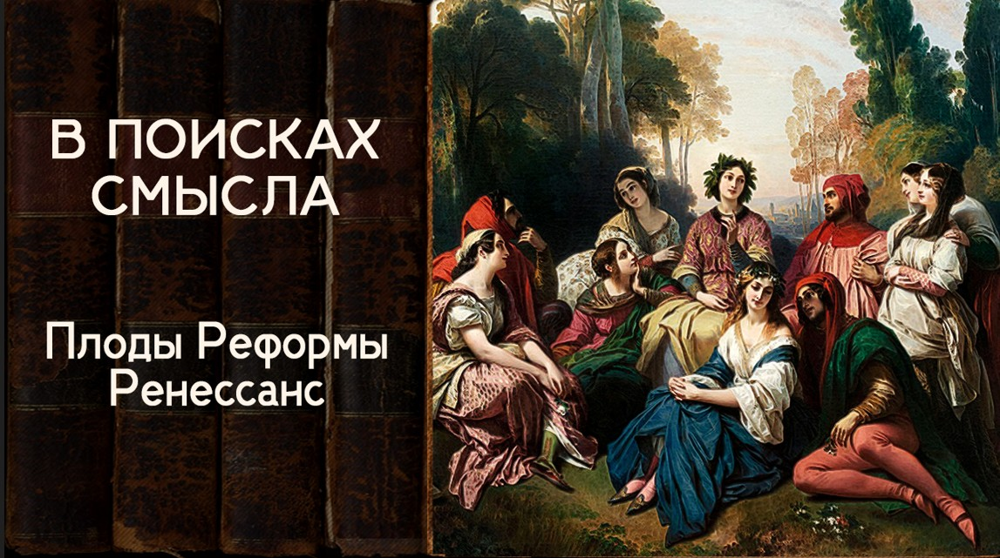

# Плоды Реформы. Ренессанс

07 июня 2024 [Аудиоверсия](https://paradoks-pinkera-pilotnyy-vypusk.simplecast.com/episodes/renaissance) 27:35

Как разочарование в результатах великих папских реформ отразилось в творчестве Петрарки и Боккаччо.
Гуманизм, как реакция на отчаяние от недостижимости на практике идеалов, заданных реформой.

**Е.Голуб:**
Здравствуйте, друзья!
В эфире очередной, уже шестой выпуск третьего сезона подкаста «В поисках смысла».
У микрофона Евгений Голуб...

**П.Щелин:**
... и Павел Щелин.
Здравствуйте!

**Е.Голуб:**
Сегодня мы поговорим о Возрождении.
Вернее...

**П.Щелин:**
... начнём говорить.

**Е.Голуб:**
Ну и героями сегодняшнего нашего размышления будут Петрарка и Бокаччо.
Почему именно они, Павел?

**П.Щелин:**
Ну, потому что для меня два этих автора выражают, если не само Возрождение, то ту среду, те условия определённого духовного состояния, благодаря которому Возрождение становится возможным.
И поскольку в предыдущем выпуске мы с тобой обсуждали архетип возникновения реформы в западной традиции, то очень интересно на примере этих двух людей посмотреть на плоды этой реформы, которые приходят в среду так называемой гуманитарной интеллигенции, как бы мы сказали современным языком, а говоря таким более классическим языком, гуманитарную элиту, вот в каком состоянии они оказываются после, ну так, трех-четырех столетий улучшательства и приближения Града Небесного, так сказать, посредством великой папской реформы к Граду Земному.
Вот поэтому на примере этих двух людей мы можем посмотреть на некоторые плоды.

**Е.Голуб:**
Давай вернёмся к датам.
Какими сроками ограничена реформа, которую ты упоминаешь?

**П.Щелин:**
Ну, великие папские реформы, конечно, сопряжены с именами Григория VII, Лев IX и Иннокентий III.
Пиком ее становится, конечно, собор 1215 года, католический собор 1215 года, который, по сути, суммирует и создает вот такую конечную форму, так называемого, опять-таки, папского реформаторства.
Занял этот период примерно с 1073, соответственно до 1215 непосредственно действия.

Петрарка это уже XIV век.
То есть это через 200 лет после того, как семена реформы оказались посеяны.
И вот поэтому тут так интересно смотреть на развитие, на продолжение.

**Е.Голуб:**
То есть и Петрарка, и Бокаччо, современник Петрарки, как раз представители того времени, которое, по твоему мнению, и отразили последствия вот этой великой реформы в том, как эта реформа отразилась на мировоззрении, как сейчас говорят, опинион-мейкеров.

**П.Щелин:**
Да, и в этом контексте я приведу, прежде чем продвинемся непосредственно к Петерарке и Банкаччо, конкретно два имени, которые нас очень интересуют из времен этой реформы.
Два имени.

Первое — это Петр Дамиани, это большой католический теолог.
И он вот как раз, мне кажется, сформулировал ключевую точку, на котором...
Тут маленький, ну если тем угодно, изъян-неизъян, но то маленькое свойство этой реформы, благодаря которой получится Петрарка.
Я тебе этого не говорил, для тебя сейчас эта цитата будет сюрпризом.
Мне будет очень интересно, как ты потом прореагируешь в контексте, соответственно, того, что ты прочитал.

Так вот, что писал Пётр Доминиани, то, что он в момент аскетических практик испытал момент, в котором он физически ощущал на себе сияние божественного света, но душа его стремилась к большему, и он не был уверен, что этого было бы достаточно.
Позднее он использовал следующую метафору.
Это метафора птицы в полёте, но крылья этой птицы неисправимо подрезаны.
Другими словами, дефекты человеческой природы настолько велики, что они препятствуют настоящему контакту с божественным.
В итоге он ощущал себя не птицей, а летающей рыбой.
Она может выпрыгнуть из воды, но полететь не может.
Может на секунду прикоснуться к свету, чтобы потом упасть снова.

**Е.Голуб:**
Подтверждение других твоих слов о том, что идеалы недостижимы.

**П.Щелин:**
Да, и вспомнить, что именно в этот момент рождается готика.
Готика как стиль.
Вот этот стиль поднятия вверх, недостижимости.
Не небо спускается на землю, как в традиционной православной архитектуре, а человек как бы летит наверх, но этот верх настолько далек, что он устремлен вверх, но недостижимо устремлен.

**Е.Голуб:**
Ну, почему готика это недостижимо устремлен?
Ну, просто устремлен.

**П.Щелин:**
Но вот мне вот, как бы, честно скажу, здесь, может быть, уже личное включается, но когда я много готических соборов посмотрел, и потом много разных православных соборов посмотрел, вот в готике я чувствую вот это именно ощущение какого-то, ну, космической недостижимости.
Вектор другой.
Я чувствую в готике вектор то, что как раз ты должен прыгать наверх, а в православной архитектуре небо, спускающееся на землю.

**Е.Голуб:**
Ну, это очень интересно.
Это очень интересно, потому что я вспоминаю свои впечатления и склонен с тобой согласиться.

Если в традиционном восточном храме, православном храме, во время службы есть ощущение именно такого соединения, то в готическом устремление — это всё-таки главное чувство, то есть устремлённость.
Видимо, и сами формы тоже это отражают, там же всё-таки больше углов.

**П.Щелин:**
Ну да, узко, угло и вверх.

**Е.Голуб:**
Интересно, ну давай продолжаем.

**П.Щелин:**
А вторая цитата, она из трактата вот этого великого, одного из великих пап Иннокентия Третьего, который трактат был своего рода интеллектуальным бестселлером XIII века, то есть 1200-е годы.
И назывался это он «Презрение к миру. Ужас человеческого бытия».

**Е.Голуб:**
Да ты что?
Ну, то есть то же самое, что у Петрарки.

**П.Щелин:**
Ну вот сейчас цитату дам, и мы переходим к Петрарке.
Второе семя.
То есть что писал этот Иннокентий?

> Человек был создан из пыли, глины, праха и еще более мерзкой жижи, грязного семени.
> Человек зачат в плотском желании, в жаре чувственной похоти, в грязной вони распутства.
> Он рождён трудиться, бояться, на страдания и смерть.
> Его злобные поступки оскорбляют Бога, оскорбляют ближнего, оскорбляют его самого.
> Он оскверняет своё доброе имя, отравляет свою личность, насилует совесть через постыдные поступки.
> Его тщеславие побуждает его не замечать самых важных, самых необходимых, самых полезных вещей.
>
> Соответственно, он предопределён стать горючим вечного адского пламени, пищей для ненасытных червей.
> Его судьба - быть вечно воняющей массой.

**Е.Голуб:**
Прекрасно.
Ну тогда, конечно, становится понятным, то, что мы называем Ренессансом или Возрождением, некоторый отскок — это просто необходимая психологическая реакция на такого рода заявление.
Ну невозможно жить, чувствуя себя такой субстанцией мерзейшей.
Хочется увидеть в себе и что-то хорошее, и порадоваться.

**П.Щелин:**
Вот давай эту психологическую реакцию на примере двух этих товарищей, Петрарки и Бокаччо, и начнём разбирать.
Потому что собственно, теперь, мне кажется, пришло время.

**Е.Голуб:**
Ну давай, с кого начнём?
С Петрарки?

**П.Щелин:**
Давай с Петрарки.
То есть ты вот недавно читал его, и ты даже сказал, что ты поменял мнение, поэтому я с удовольствием дам тебе слово.

**Е.Голуб:**
Да, действительно, ведь для меня Петрарка, наверное, как для очень многих, ассоциируется с его лирикой, с образом Лауры, со всей этой историей романтической любви, причём такой очень воздушной, безответной, недостижимой.
Если говорить коротко и грубо, то это воспевание некоторого окситоцинного шторма, который знаком каждому, наверное, кто был влюблён и терял образ реального человека и относился только к воздушному образу своего идеала.
Если как раз в случае Петрарки с реальным человеком встретиться не довелось, то это, конечно, может быть очень травматично для психики.

Так вот, мне не было это интересно.
И когда накануне нашего разговора мы столкнулись с тобой с необходимостью погрузиться чуть глубже, я перечитал его текст.
И прежде всего очень советую то, что сборник, которая называется «Моя тайна», о презрении к миру, опять-таки, о своём и чужом невежестве.
Тексты глубокие, тексты, вызывающие уважение к автору.
Со многими вещами просто невозможно не согласиться.
Кроме того, как оказалось, Петрарка потом не то чтобы раскаивался, но радовался, что его оставила эта влюблённость и прямо говорит о том, что я очень благодарен Богу, что Он позволил мне избавиться от этого.
Это всё отвлекает от чего-то более глубокого.

**П.Щелин:**
Давай уточним, от чего именно.
Потому что вот в этой книге он очень хорошо описывает вот это своё духовное состояние.
Мы грубые слова для него употребляем, публично мы не будем.
Да, но вы, думаю, поймёте.

**Е.Голуб:**
Чувственная увлечённость.

**П.Щелин:**
Не просто чувственная увлечённость, а назовём так, особая форма тоски.
То есть вот я бы это так сформулировал.

**Е.Голуб:**
Особая форма страданий.

**П.Щелин:**
Особая форма страданий.
И как он это страдание описывает?

> Порой так сильно, что горько жалею, зачем я не родился бесчувственным, и предпочел бы быть неподвижным камнем, нежели игралищем многочисленных влечений моего тела.
> Ты, Господь, нагромоздил бесчисленные беды и лишения, так что человеку почти приходится жалеть, что он родился человеком.
> 
> Притом все прочие мои страсти сказываются хоть частыми, но краткими скороприходящими вспышками, и эта же чума по временам схватывает меня так упорно, что без отдыха истязает меня целые дни и ночи.
> Тогда для меня нет света, нет жизни.
> То время подобно кромешной ночи и жесточайшей смерти, и что можно назвать верхом злополучия, я так убиваюсь своей душевной борьбой и муками с каким-то стеснённым сладострастием, что лишь неохотно отрываюсь от них.

**Е.Голуб:**
Так, и что в этом отрывке для тебя значимо?

**П.Щелин:**
Вот в этом отрывке для меня как раз значен пессимизм.
Вот это ощущение недостижимости, вот это ощущение, если тебе угодно, невроза, вот это ощущение богооставленности, которое на самом деле в этом отрывке уже присутствует.

Главная разница, вот сразу карты открою, в чём, мне кажется, очень сильно проявляется на примере Петрарки, и потом договорим о Боккаччо.
Иногда меня просят объяснить разницу между католическим путём и православным путём.
Её можно объяснить очень по-разному, очень по-глубокому.
Но вот то, во что католицизм не вырождается, а приходит накануне Реформации, и, мне кажется, это его ключевая драма, то, что он берёт половину из одного очень важного принципа, который будет сформулирован только в XX веке Силуаном Афонским.

Если ты помнишь, старец Силуан утверждал следующее.

> Помни только об Аде и не отчаивайся.

И на мой взгляд, в силу вот этой реформы, в силу тех больших очень надежд по трансформации вот этого града земного в град небесный посредством Великой Папской Администрации, было забыто вот этот кусочек про не отчаиваться.
Поэтому про ад они очень хорошо всё вспомнили, а вот с "не отчаиваться" они забыли.
И в итоге родилось две принципиальные реакции гиперкомпенсации на вот это состояние, потому что жить в отчаянии невыносимо.
Потому что жить вот в этом постоянном неврозе, причем, повторюсь, понятно, что для какого-нибудь крестьянина это как раз ощущалось гораздо меньше, потому что он связан с землей, он работает, он там взаимодействует, у него нет времени на вот это глубочайшее погружение.

А вот для гуманитарной интеллигенции, которая вот эта, это как раз-то значение имеет.
Это у них духовные запросы такого характера растут.
И они оказываются принципиально неудовлетворены в рамках того подхода, что им даётся.
В этом оказался парадокс.
То есть чем больше они погружались по пути реформы, тем, по сути, больше они отчаивались.

**Е.Голуб:**
Так ты хочешь сказать, что идея гуманизма — это компенсация?
То, о чём начинает говорить Петрарка, его же считают предвестником гуманизма.

Ты знаешь, мне кажется, что, конечно, как для любого человека, говорить о Петрарке как о чем-то неподвижном не стоит.
Один Петрарка в 30 лет, а другой в 50.
Скорее, это то, что из Петрарки сделали потомки, что они выдернули, что они повыдёргивали оттуда, как потом из Боккаччо.
Фактически, что они ему приписали, потому что сам по себе человек был очень непростой судьбы и двойственных таких взглядов.
Что, в общем-то, вот в этой книге или в произведении небольшом здорово он сам о себе и написал.
Ведь там же фактически он беседует с Августином.

**П.Щелин:**
Заметь, опять не случайно именно с Августином.

**Е.Голуб:**
Не случайно, но ведь мы знаем, что вот это знаменитое его восхождение на гору с томиком Августина, где читать на горе Августина — это всё его...
Я могу сделать предположение сейчас по ходу, поправь меня, если ошибаюсь.
Видимо, это и было воплощение некоторого христианского идеала недостижимого.
То есть Августин говорит с ним как с человеком, с Франциском или Франческо, как вот этот вот идеал, который ему ставит некоторые вещи в упрёк, и довольно серьёзно.

**П.Щелин:**
Да, как воплощение опять земного и небесных градов.
По сути, опять эти два града соединяются на этой горе.

Для нас опять-таки важно психологическое разрешение.
Топ-2 пути психологических разрешений, которые из этого тупика, в котором оказывается Петрарка, они как раз и олицетворяют во многом два пути, по которым в дальнейшем идет западная цивилизация.

Первый путь — это путь гуманизма, так называемого, путь вот этого Возрождения, о котором мы будем в дальнейшем говорить, но сейчас надо показать корни этого процесса.
А второй путь — это Реформации, путь Мартина Лютера, который тоже решает вопрос о богооставленности радикальнейшим способом.
Точно так же.
Волюнтаристки он его решает, через волю.

На самом деле это две стороны одной и той же медали.
И Возрождение и Реформация — это не два противоречащих друг другу потока.
Корень у них един.
Корень у них — вот это разочарование в реформе секулярного времени.

**Е.Голуб:**
Подожди, подожди.
Всё-таки реформация ассоциируется с тем временем, когда возрождение уже заканчивается.
То есть ты хочешь сказать, что реформация вырастает из возрождения или отчасти коренится?

Потому что остаётся же и традиция, всё-таки католическая традиция остаётся, она не исчезает.

**П.Щелин:**
Начинается перебор.
Каким образом удовлетворить вот эту потребность, эту жажду, это желание, надежды, которая не удовлетворяется?
Один путь - давайте попробуем через гуманизм и вот через опять метафору возрождения.

Опять-таки очень важный момент.
Реального возрождения не было, не было никакой прерывистости, у нас была единая история.

**Е.Голуб:**
Это схема, конечно.
Мы же с тобой уже разобрались, что это просто схема, которая была придумана в XIX веке.

**П.Щелин:**
Но почему возникла необходимость схемы, и современники ощущали себя, условно говоря, жители итальянских городов, они ощущали потребность именно в ощущении чего-то нового, они ощущали тупик старого пути, в том, который они сами себя загнали.

**Е.Голуб:**
Ну, они хотели стряхнуть себя, вот эти все в лохмотья, грязь, они хотели почувствовать себя чистыми, в красоте и в величии своих умственных, научных достижений.

**П.Щелин:**
Говоря очень по-простому, раз у нас не получается по-настоящему достичь Бога, то давайте попробуем максимально красиво изобразить человека.

**Е.Голуб:**
Ты знаешь, мы же должны всегда делать оговорки, что это всё упрощение, упрощение и упрощение.
Только для того, чтобы можно было, вообще говоря, из этого сложного клубка какие-то основные нити выдернуть или вынуть и поразмышлять на эту тему.
Конечно же, потому что тот же Петрарко и Боккаччо, они оставались в лоне христианской традиции, они из неё не выходили.
Если бы им сказали, что они предвестники всего, что наступит потом, я думаю, они бы удивились, особенно на склоне лет.

**П.Щелин:**
Конечно, они бы крайне удивились, как мы потом увидим, если бы, условно, знаменитому Дунсу Скотту сказали, к чему его, или Оккаму сказали, к чему они приведут.
Они бы вообще бы офигели.
Но это другая, скажем так, уже часть.
Мы немножко забегаем вперед.
Сейчас вернемся к этой точке.
Про Петрарку.

Петрарка, его путь, вот это восхождение, и то, как раз ты вот правильно заметил, тот выход, который находит и он для себя, а он выход по-простому, очень человеческий, понятен.
Это для нас важно именно тем, что это, если тебе угодно, образ, символ того пути, по которому идет одна часть вот этой большой духовной потребности западной мысли.

В этом плане Боккаччо интересен нам по-другому.
Боккаччо нам как раз показывает, если тебе угодно, не то чтобы другую крайность, но вот как ты справедливо описывал знаменитый Декамерон, ты цитировал.
В общем, всем рекомендую прочитать цитаты Декамерон.
Это тоже, на мой взгляд, попытка гиперкомпенсации.

Причем очень понятная нам попытка гиперкомпенсации, для меня это своего рода попытка заняться юмором и троллингом посреди апокалипсиса.
То есть это такая вот собачка знаменитая с мема, знаешь, this is fine.
Вот в каком-то смысле Боккаччо — это и есть первая такая собака в горящем доме.

**Е.Голуб:**
Ну да, исследуя эту тему, благодаря нашему выпуску, сталкиваешься с интереснейшими толкованиями.
Простое толкование — это троллинг, нашими словами, аскетизма.
То есть берём аскетическую традицию и сносим её под корень своими издевательскими насмешками.

Ну а с другой стороны, к каждой из новелл, почти к каждой из новелл, особенно первым новеллам, которые в основном все и на них останавливаются, вряд ли кто-то читает до конца, то к каждый из этих новелл можно подойти и с другой стороны.
Что с первой этой знаменитой новеллы о шарлатане и преступнике, который решил представиться святым.
Что о знаменитой истории про то, как иудей решил обратиться в христианство и обратился только после того, как увидел безобразие римской курии.
Это же всё можно истолковать и в позитивном смысле тоже.

Поэтому здесь такой простой поверхностный взгляд, видимо, это будет излишним упрощением.
Что ты думаешь?

**П.Щелин:**
Я с тобой согласен.
Пример про обращенного еврея — это как раз пример парадоксального мышления, который в Боккаччо нам тоже очень часто, мы его упускаем, а он нам ценен.
Но историческое, скажем так, наследие в том, что вот эта парадоксальность, она оказывается скорее незамеченная, а вот на фоне вот этого, опять-таки, довольно депрессивного состояния, в котором оказывается западная культура...
Давай еще справедливо сказать, на фоне чумы.

А теперь представь, как воспринималась вот та великая чума вот этой самой гуманитарной интеллигенцией на фоне вот этой амбиции папской реформы.
Получается, мы предприняли идеальную попытку, причем искренне хорошо предприняли, это же надо понимать, опять-таки.
Эта реформа дала, в частности, Фому Аквинского.
Ну, это высочайшее достижение западной теологии.
Ничего лучше, в принципе, после Фомы Аквинского западная теология придумать не породила.

И несмотря на это, наши усилия...
Для современного человека это бред искать, условно говоря, в чуме символическое значение, но мы говорим о людях, для которых это как раз был бы самый естественный путь.
Мы дали лучшее, а получили чуму.
Вот этот элемент мы, кажется, очень часто теряем в предвестнике Возрождения.

**Е.Голуб:**
Ну а с другой стороны, мне кажется, что ты, может быть, как раз здесь и несколько упрощаешь.
Я думаю, в то время люди уже достаточно были развиты, чтобы не связывать так примитивно.
Потому что было уже очевидно, что от чумы погибают и праведники, и невинные дети, и всё остальное.
И теология в этот момент была достаточно уже развита, чтобы не делать простую причину следствия.

**П.Щелин:**
Она не была простой причинно-следственной связью.
Я не настаиваю на том, что это была простая причинно-следственная связь.

**Е.Голуб:**
То есть в целом настроение.
Мы тут вкладывали усилия, а все идет прахом.
Это не помогает, это не решает.
Вот наступил там ад и Пакистан, там, как сейчас выражаются, и выхода нет, и можно только запереться где-то в деревне и травить байки.

**П.Щелин:**
Вот о чем речь, ты прав.
И тут неважно, понимаешь, даже с точки зрения философии, условно, да, люди большая часть уже начинала понимать, что материальные причины чумы, там, они условно разные.

**Е.Голуб:**
Ну да, сочетание планет, тогда там пытались где-то в этом что-то найти.

**П.Щелин:**
Основное - важно вот именно ощущение.
И мне кажется, нам это очень хорошо понятно, потому что, давайте не будем уж лукавить, мы находимся немножко в близком к этому положении.
Мы, условно, тут, понимаете ли, строили...

**Е.Голуб:**
Да, хорошо, кстати, да.
Мы строили-строили, вот вроде как гуманисты и прогрессисты, и всё такое, и тут на тебе.

**П.Щелин:**
Пинкер, понимаете, пишет нам, собирает данные, как у нас жизнь улучшается из поколения в поколение.
То есть как бы у нас вообще все хорошо.
А сейчас оно все разрушается на наших глазах.

**Е.Голуб:**
Да, стремительно.

**П.Щелин:**
И на самом деле мы очень близки по мироощущению.

**Е.Голуб:**
Слушай, здорово, отличная аналогия, действительно.
В общем-то, интересно, что и к Декамерону обратились, если посмотреть на уровень исследований, во время карантина.
То есть многие, вот, значит, давайте, мы сейчас в карантине, давайте вспомним о Декамероне, о Боккаччо, и тоже посмотрим, как они размышляли об этом 700 лет назад.

**П.Щелин:**
И опять, нам важно именно состояние, потому что идея реализует себя через во многом состояние.

**Е.Голуб:**
Что ты называешь состоянием?

**П.Щелин:**
Ну, состояние — это вот это общее zeitgeist.
Не люблю этот термин, он очень сильно упрощен, опошлен, он редко точен, но вот в этом контексте он будет точным.
Вот это задает вот пресловутое невыразимое ощущение, которое, так сказать, пропитывает все другие действия.

Потому что, опять-таки, мы можем найти рациональное объяснение под каждое происходящее событие, только это неважно.
Мы действуем и ощущаем происходящее не через рациональное объяснение этих событий.
И, соответственно, наши потребности, они тоже находятся не в зоне рациональности.
То есть вот сейчас у нас потребность, условно говоря, в новой надежде, как очередной раз.
Точно так же, как у них тогда была потребность в новой надежде.
И они найдут эту новую надежду, повторюсь, по двум принципиальным путям.

Первый путь — это будет путь гуманизма, по сути говоря, антропоцентризма.
Мы наиболее лучшим способом попытались, не получилось.
Так, давайте сфокусируемся на том, что можем, условно говоря.
Вот путь гуманизма.
На самом деле уже тогда мы видим в гуманизме, хотя они об этом, я думаю, сами не подозревали, подсознательное желание вынести всю эту божественную штуку за скобки.
Что-то не получается у нас с этим.
Давайте вынесем ее за скобки.
Вот человек - красивый.
Давайте попробуем заняться красивым человеком.

**Е.Голуб:**
Ну это же и приятнее как бы, да?

Перестать чувствовать себя вот этой вот сущностью гадкой и мерзкой.
Но как-то так повеселее, поэтому ставили Давида перед входом.
Вот, любуемся идеальным человеком, идеальной формой физической.
Вот как раз нам и античные, так сказать, авторы тут пригождаются, и античная скульптура.
Вот мы выкопали в Риме очередную статую прекрасную, Лаокоона, и потащили, значит, в Ватикан.
Ну, это же действительно всё...
Конечно, попозже всё было, но это действительно всё звенья, наверное, одной цепочки.

**П.Щелин:**
А второе желание у нас будет максимально радикально все упростить.
Желание видеть мир в огне, ни много ни мало.
Ну я возвращаюсь к теме протестантизма.
И что предлагает протестантизм?

Протестантизм предлагает радикальное упрощение.
Протестантизм предлагает каждому начать свою уникальную вечную историю с самого себя.
Вот есть ты, есть твой индивидуальный завет, все остальное неважно.

**Е.Голуб:**
Дай протестантизму еще появится, сто лет-то еще с хвостиком, да?
Хотя, наверное...

Ведь все вот эти гуситы, я только хотел сказать, гуситы и все остальные ереси, они же как раз предвестники.
Это такие вот зарницы, скажем так, этого дела.
До, собственно, Мартина Лютера, до легенды о прибитых тезисах, до 1517 года ещё осталось достаточно далеко, но часто из нашего фокуса внимания уходят все эти многочисленные восстания, которые предшествовали Лютеру.
И ты говоришь о том, что это как раз всё на почве возрожденческих идей.

**П.Щелин:**
Ну, на почве разочарования в предыдущем пути.
Но при этом, давай сразу зафиксируем, и это я буду фиксировать, наверное, в конце каждого из вот этих четырех-пяти выпусков, что это разворачивание одного и того же принципа.

По сути говоря, деятели Возрождения и в дальнейшем деятели Реформации хотели провести свою реформу.
По сути говоря, каждый из них проводил свою реформу.
Базовая установка на реформу никогда не уходила.
Просто происходил следующий цикл.

Каждый раз разочаровались в одном методе, давайте попробуем по-другому.
И вот этот бесконечный повторяющийся круг, он запустился.

**Е.Голуб:**
Давай тогда действительно сделаем пару шагов вперёд.
То есть ты утверждаешь, что возможность реформы и вообще идея, что можно что-то реформировать, возникла в период вот этих знаменитых папских реформ.
Значит ли это, что до этого такой идеи, такой мысли не возникало?

**П.Щелин:**
В современном понимании этого слова нет.

**Е.Голуб:**
То есть впервые это 11-12 века и позже.
Что сделало возможным и приемлемым мысль о том, что великую духовную традицию и вообще восприятие можно менять и менять к лучшему, пытаться.
Так я тебя понимаю или нет?

**П.Щелин:**
Да, да, да, к лучшему, очень важно, к лучшему, только к лучшему, конечно.

**Е.Голуб:**
К лучшему.
То есть мы своими усилиями, своим разумом, своим пониманием способны изменить вот эту традицию в лучшую сторону, да?

И как результат, сейчас эту мысль пытаюсь проговорить, вот этой реформы как один из побочных эффектов возникло понимание недостижимости идеала.
Возник уклон, крен в то, что идеал этот аскетический настолько прекрасен и настолько недостижим, что возникло отчаяние и как компенсация, с твоей точки зрения, повторяю, это точка зрения твоя.
Я пока не готов к ней полностью присоединиться, хотя звучит очень интересно.
Как реакция возникла идея Ренессанса, которая в конечном итоге вынесла нас к протестантизму.

**П.Щелин:**
Который потом вынесет...
Называется «Слушайте дальнейшие выпуски».

И повторяться эта история, повторяется вплоть до наших дней.
По ровно одному и тому же сюжету этой пьесы.
Реформа, разочарование в реформе, гиперкомпенсация, новая реформа.

**Е.Голуб:**
О, здорово.
Звучит уже как некоторая спираль или некоторая трёхходовка.

Первая точка.
Не устраивает.
Реформируем.
Создаём идеал недостижимый.
Разочаровываемся и начинаем новый цикл.

Три таких круга.
И ты утверждаешь, что мы с тех пор движемся по вот этим шагам?

**П.Щелин:**
В той мере, в которой мы принадлежим западной традиции, да.

**Е.Голуб:**
Часто не осознавая того, что с нами происходит, и поэтому не понимая, какой будет следующий ход и следующий шаг.

**П.Щелин:**
Абсолютно.
И более того, не понимая религиозное измерение всего этого процесса.

**Е.Голуб:**
Религиозное или культовое, я бы так сказал, потому что для меня религия — это всё-таки связь с Богом.

**П.Щелин:**
Давай так, трансцендентно-сакральный или крипто-трансцендентный.
Суть в том, что, условно говоря, современные активисты под радужным флагом занимаются ровно тем же самым.
Сами не понимая, что, по сути говоря, они духовные наследники великих пап.

**Е.Голуб:**
Это прекрасное заявление, и компенсация уже недалеко.

**П.Щелин:**
Мы уже вошли в цикл компенсации.
Оно уже сейчас.

**Е.Голуб:**
Ну, в общем-то, да.
Судя по лозунгам некоторых сторон, вовлеченных в конфликт, это да, очень похоже.
Но мы с тобой сегодня подняли пласт.

**П.Щелин:**
И мы продолжим его поднимать, потому что в этот момент, я думаю, наш уважаемый слушатель скажет, а как же наука?

И вот о науке мы поговорим в следующем выпуске.
Потому что наука точно такой же такт этой пьесы.

**Е.Голуб:**
Великолепно.
У нас появились такты.
Замечательно.

Тогда что ж, до следующей встречи, дорогие друзья, и всего вам доброго.
