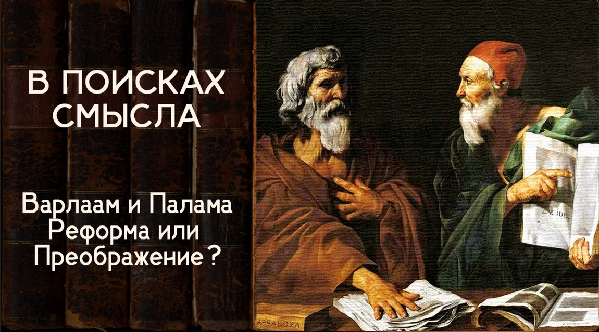

# Варлаам и Палама. Реформа или Преображение

14 июня 2024 [Аудиоверсия](https://paradoks-pinkera-pilotnyy-vypusk.simplecast.com/episodes/varlaam) 36:24

Полемика Варлаама Калабрийского и Св. Григория Паламы на века определила сущностное расхождение между теми, кто выступал и выступает за возможность рационального переустройства мира, ради блага всего человечества, и теми, кто считает необходимым, прежде всего преображение человека.
Современные политические дебаты, как продолжение средневековых богословских споров.
Неизбежная теоцентричность будущего.

**Е.Голуб:**
Здравствуйте, дорогие друзья!
Сегодня у нас состоится седьмая беседа, седьмой выпуск подкаста «В поисках смысла» у микрофона Евгений Голуб и...

**П.Щелин:**
...Павел Щелин. Всё тот же.

**Е.Голуб:**
Мы сегодня делаем в наших рассуждениях небольшой шаг назад.
Если в прошлый раз мы говорили о Петрарке и о Боккаччо, то сегодня мы обратимся к очень важной теме, теме сложной, затрагивающей учителя греческого, Варлаама Калабрийского.
Точно был учителем греческого Петрарки.
В некоторых источниках пишут, что он был учителем греческого и Боккаччо, о котором мы говорили тоже.
Не нашёл подтверждения, кроме как в одном источнике, но суть не в этом.

Суть в том, что даже при поверхностном подходе к этой теме, к теме взглядов Варлаама, человека, который был на пересечении двух культур, итальянской и греческой, вообще он был грек, живший в Италии, великолепно образованный человек. И дискуссия с ним, другого величайшего святого православной церкви Григория Паламы, вероятно, и определяет те принципиальные расхождения в мировоззрении, во взгляде на познаваемость Бога и на подходе, собственно, к реальности как таковой, наверное, поправляй меня скорее, которые отличают два мировоззрения.
Восточное, в кавычках берём, и западное.

**П.Щелин:**
Ещё раз здравствуйте.
Евгений стартанул прямо с места в карьер.
Я сначала сделаю небольшое напоминание, зачем мы говорим о каком-то Варлааме, даже в контексте какого-то Петрарки.
Напоминаю содержание предыдущих частей.

В предыдущей части мы попытались широкими мазками описать то особое состояние, в котором западная гуманитарная интеллигенция оказалась по итогам Великой Реформы, Великой Папской Реформы.
Именно в этот контекст происходят встречи с этой дискуссией между двумя выдающимися мыслителями Григорием Паламой и Варлаамом.
И смысл этой дискуссии крайне актуален для человека сегодняшнего.
Потому что сразу мы прямо скажем, что это вопрос о науке, о знании, о пределе науки, о том, способна ли наука достигнуть счастья, о том, по сути говоря, можно ли реформой построить идеальное общество, построить идеальный мир.

Это всё заложено в этой самой великой дискуссии, в этом самом великом разговоре.
И не понимая особенностей этого разговора, мы не поймём, условно говоря, от чего выборов Варлаама отказалось в будущем Возрождение.
И почему, взяв в качестве основы, по сути говоря, Варлаама, ну, в данном случае не Варлаама даже как личность, а Варлаама как символ, Возрождение пойдёт по тому пути, по какому оно пойдёт.

**Е.Голуб:**
Много исторического контекста.
Это же и захват Византии накануне крестоносцами, и недавнее освобождение Византии, и знакомство византийских, или греческих даже, имперских богословов и интеллигенции с трудами Фомы Аквинского и такой временный ренессанс после освобождения Константинополя и возрождения Византии.
Там просто какой-то невероятный бульон кипящий контекста, который и сделал или делает этот спор.
Казалось бы, ну что нам до споров богословов XV века?
Но когда вдумываешься, вчитываешься в полемику, понимаешь, что вряд ли есть что-то более актуальное.

**П.Щелин:**
Ну и поскольку я-то прочитал его немножко раньше тебя, а ты прочитал его буквально в последние два дня, я хотел бы начать, наверное, с твоего впечатления.
То есть что тебя поразило?
И почему ты уже сам сказал то, что нет ничего более актуального?

У меня есть свой ответ на этот вопрос.
Почему для тебя это оказалось актуальным?

**Е.Голуб:**
Конечно же, от Варлаама Калабрийского мало что осталось, что можно было почитать.
По крайней мере, я не нашел его трудов, а только ссылки на его взгляды и нам лучше известные полемические труды Григория Паламы.
И вот когда начинаешь читать Паламу, то поражаешься двум вещам.

Первое в позитивном плане — это то, насколько всё-таки монашеский опыт и традиция позволяла глубоко проникнуть в природу человека, в природу психики человека, как мы сказали сейчас.
До каких мельчайших нюансов движения души или психики.
Давайте говорить так сейчас, современными выражениями, которые знакомы любому занимавшемуся или, по крайней мере, погружённому в какую-то рефлексию, в анализ.
Вот насколько это всё хорошо в деталях описывает Палама.
Это из позитивного восприятия.

Из того, что, скажем так, озадачивает, это яростное отрицание Паламой эллинской мудрости.
Вот этот известный диалог Афины и Иерусалим.
Для Паламы, он в полемике своей обрушивается на эллинов всевозможным образом, считая, что тратить время на эллинскую мудрствование — это впустую тратить время.
Нужно забыть об этом, как о чем-то совершенно ненужном и никчемном.
Рациональное постижение Бога для него — это что-то совершенно ненужное и ошибочное.

И вот эти два таких ярких эмоциональных посыла, скажем так, в одном случае это не посыл, скорее, а рассуждение, а во втором, да, императива.
Это то, что производит очень сильное впечатление.
Что ты скажешь?
Расскажи, пожалуйста.

**П.Щелин:**
Я скажу, что здесь всё-таки для меня важно уточнить, потому что вот сейчас неподготовленный читатель подумает, что Варлаам — это некий мракобес, который ничего в своей жизни не прочитал, эллинской мудрости не знал.

**Е.Голуб:**
Варлам или Григорий — кто мракобес?

**П.Щелин:**
Прости, Григорий.

Соответственно, между тем, это глубочайше образованный человек, и всю эллинскую мудрость он знал, условно говоря, лучше всех своих собеседников.
Поэтому я все-таки сделаю уточнение, ограждение твоей мысли, против чего именно очень конкретного выступает Палама.

Мне кажется, и это как раз почему это самый актуальный вопрос, он говорит, что если вы хотите достигнуть, условно говоря, райского состояния, то есть если вы условно хотите провести реформу, которая проведёт вас, то есть рацио, логос, вот это всё, которая доведёт вас до рая, то это дело бесплодное.
Вот в этом контексте, с этой точки зрения, ради этой цели эллинская мудрость является бессмысленной.

**Е.Голуб:**
Но для него другие цели, они вообще незначимы, давай так скажем.

**П.Щелин:**
Для него они, конечно, незначимы, но мы же с тобой занимаемся немножко переводом для наших слушателей.
Поэтому все-таки уточним, в каком контексте для него эллинская мудрость действительно не имеет этого значения.

И поэтому как раз он вступает в порт с Варлаамом, для которого эллинская мудрость, ну, в общем, мудрость, логос, можно сказать, рацио, как бы мы сегодня сказали, это наоборот, это самый надёжный, самый логичный, самый естественный способ постижения.
Ты очень хорошо упомянул, что именно Варлаам оказался очень в большом контакте, восхищении, с работами того же Фомы Акадвинского.
И у него как раз произошло восхищение от вот этого наилучшего образца, я бы сказал, той самой реформы, о которой мы говорили.

Поэтому спор между Григорием и Паламой — это спор о реформе на самом деле.
Можно ли реформой вот этот град Божий спустить на град земной?
И вот против этого Палама выступает самым радикальным образом.
Он прямо говорит о том, что никакие реформаторские усилия принципиально ничего не изменят, если не изменится сам человек.
Вот как пишет об этом Палама.

> Добро не в самой по себе природе этого знания, а в человеческих намерениях, вместе с которыми и знание склоняется в любую сторону.

То есть Палама задолго до всего того, что потом напишут в XX веке, правильно говорит, что ключевой вопрос — это вопрос о субъекте, а не вопрос о технологии.
В то время как Варлаам, по сути, не понимает этого.

**Е.Голуб:**
Тогда давай ещё раз вопрос о субъекте.
Давай мы его сейчас постараемся как-то озвучить.
Что такое вопрос о субъекте?
Потому что ты упомянул, а как это вот связать с нашей дискуссией?

**П.Щелин:**
Ну смотри, рациональное знание, теория рационального знания говорит о том, что вот у тебя есть, условно говоря, рациональные выводы науки, то есть, допустим, методички.

**Е.Голуб:**
Ну, силлогизмы вот эти правильно построенные там.

**П.Щелин:**
По-русски можно сказать методички, менеджерские подходы.
И если их правильно применить, то есть криптопозитивизм-то на самом деле, который будет в 19 веке, вот у нас есть правильные законы организации общества.
И вот мы сейчас эти правильные законы организации, то же самое реформа, правильные законы спустим на общество, и это общество преобразится.

А Палама говорит, что пока не преобразится человек, причем человек внутренний, то есть духовный, ничего не получится.
И это и есть субъект.
То есть в основе состояние человека.
Это квантовая физика против физики Ньютона.
Основа — это состояние человека, делающего то или иное решение, принимающего тот или иной нравственный выбор.
То, к чему лежит сердце этого человека.
Вот что основа.

**Е.Голуб:**
Мне трудно здесь тебе что-то возражать.
Я только послушаю, потому что моё знакомство весьма поверхностное.
Что, мне кажется, особенно важно упомянуть, что тот же Варлаам Калабрийский — это не был человек, который как-то был настроен враждебно к православию или к греческой традиции.
Наоборот, он приложил огромные усилия для того, чтобы примирить Западную и Восточную церковь в раскол.

Он, собственно, сам и ездил к Папе Римскому по поручению императора с тем, чтобы попросить помощь у Рима.
И вот эта вся тема с филиоквой им осмысливалась как раз рационально, и рационально он пришёл к выводу, что, слушайте, ну это невозможно доказать, познать невозможно.
Давайте оставим это каждому на его усмотрение, а мы откажемся от этого высказывания, ну и в главном соединимся и примиримся.

Но тут нашла коса на камень, я не знаю, что больше политики или богословия, но в целом что Варлаам, что Григорий — это были выдающиеся, может быть, наиболее выдающиеся люди своего времени.
Просто невероятное сочетание образования, харизмы и так далее.
И схлестнулись они очень серьёзно.
Очень серьезно.
То есть это именно, мне кажется, это такое, искры летели.

**П.Щелин:**
Ну, конечно.
Это был вопрос о смысле всего.
То есть, я повторюсь, для нас этот спор важен именно в контексте всех подготовительных предыдущих выпусков, в которых мы вели.

Потому что это спор не просто о разнице между католичеством и православием, или там спор двух империй.
На самом деле это фундаментальный спор о методе преображения.
Напомню то, что главный императив христианский, ну то есть вообще христианства, это императив преображения, метаморфозы.

Но вот сошелся подход, условно говоря, Григория, который за метаморфозу, и подход западный, который за реформу.
И вот этот бой — это бой между реформой и метаморфозой.
И это имеет прямое отношение к нашим сегодняшним вопросам.

**Е.Голуб:**
Давай я хочу проверить, что правильно тебя понимаю.

То есть ты говоришь о том, что, если так постараться упростить и кристаллизировать, что подход Григория, упростим Григория как символ, заключался в том, чтобы изменить мир, нужно менять качество человека.
Он должен меняться.
И в этом случае улучшается мир.

Подход, назовём Варлаама, хотя опять-таки это символ.
Это то, что мы можем разумными усилиями, опираясь на логику, ну и в какой-то степени меняясь сами, но в общем главное — использовать разум и устроить мир согласно некоторым разумным договорённостям.
Тут нам как раз и римская традиция законотворчества, законопослушания идёт на помощь.

Вот эти два взгляда, можно ли так их упрощённо озвучить?

**П.Щелин:**
Можно.
Сразу с огромной оговоркой, что мы очень упрощаем, но можно.

**Е.Голуб:**
И дальше вот эти расхождения, которые мы будем рассматривать, я напомню, что, собственно, начинали мы наш подкаст в целом какое-то время назад, с самого начала, для того, чтобы постараться найти вот эти точки расхождения, точки, с которых пошло то, что мы смело скажем, потери смысла.

**П.Щелин:**
Ну, то есть первым шагом мы обнаружили, что слова означают немножко совсем не то, что они означали в историческом контексте.
Мы постепенно выходим на ту точку, с которой вот это, я бы сказал, радикальная антиисторичность начинает доминировать в мировоззрении и вот этим длинным путем.
И вот мы к ней подходим.

Ключевая точка — это так называемая эпоха Возрождения и потом эпоха Просвещения.
Две точки, которым нам надо рассмотреть.
Но понять их нам будет невозможно без вот этой длинной предыстории тех принципиальных выборов, которые делает та или иная традиция.

Вот западная традиция, по сути говоря, делает вот в этом споре между Верлаамом и Григорием Паламой, она делает выбор, следуя опять-таки логике великих реформ и социального изменения.
Она делает выбор осознанный, намеренный в сторону реформирования мира и пространства.
И плоды этого мы увидим, как опять этот принцип просто реплицируется, воспроизводит себя из поколения в поколение, из века в век.
Люди уже забыли, откуда растут корни этого принципа, но они продолжают идти по этому кругу.

И здесь принципиально понять вот эту первичную установку, первичный выбор.
И вот первичный выбор, он как раз восточная традиция.
Это для меня разница между выбором, который в основу кладет все-таки субъекта.

**Е.Голуб:**
И его качество, да?
Его состояние.
И?

**П.Щелин:**
И традиция, которая кладет в основу, ну, по-хорошему, разум как логику, и институты.
То есть рациональную объективность, назовем это так, логичность, то есть рацио, закон, инструкцию, методику, знания.
Вот в чем принципиальная разница.

Для меня что интересно, что нам потребовалось, по сути говоря, 600 лет экспериментов, чтобы убедиться, что никакое знание без изменения человека ни к чему хорошему не приводит.

**Е.Голуб:**
Хорошо, давай я попробую немножко пооппонировать тебе или, по крайней мере, порассуждать, как если бы мне нужна была проверенная точка зрения.

Но ещё римляне, в общем-то, мы же говорим сейчас о таком законно-римском подходе вроде бы как к реальности.
По крайне мере, здесь очень много попыток устроить жизнь, основываясь на внешнем законе.
Они очень большое внимание уделяли качествам человека, его добродетелям, те же стоики и всё остальное.
Ты считаешь, что это недостаточно в данном случае, чтобы говорить, что и там есть традиция субъектности?

**П.Щелин:**
Да.
Я считаю то, что эта традиция субъектности всегда при прочих равнах проигрывает.
Ну то есть не на ней делается акцент.
Если, условно говоря, выбирать делать ставку на институт или делать ставку на человека, западная традиция всегда выберет ставку на институт.
Всегда.

**Е.Голуб:**
Ну а разве институт не призван поменять человека?
Та же реформа папская разве не собиралась?
Не было изначальной цели поменять именно...

**П.Щелин:**
И это то неприятное открытие, которое дарит нам Палама, ну, возможно, неприятное открытие для гордого человека, которое дарит нам Палама, то, что никакой институт человека не изменит.
На основе опыта монашеской жизни он приходит к этому открытию, которое очень сильно ограничивает на самом деле нашу наивную гордость по самооценке.

И даже если знаешь, поделюсь это своим опытом преподавания.
Я тебе могу сказать, как преподаватель, ты тоже человека ничему научить не сможешь, пока он сам не захочет, пока в нем внутри что-то не произойдет.
И ни один внешний институт этого не сделает.
Это тайна сердца человека.
Это тайна его субъектности.
Это тайна его свободы.
Это тайна его благости, если угодно.

В противном случае получается, как пресловутая критика Григорием эллинской мудрости.
Он говорит прямо.

> Хоть изучи естественную философию, это дама до самого конца.
> Без чистоты ты будешь с ней меньшим, а то и с большим успехом, глупцом, чем мудрецом.
> Наоборот, даже без философии, очистившись и избавив душу от дурных нравов и учений, ты обретёшь и победившую мир Божью премудрость и всесилие.
> Навеки приобщишься к единому премудрому Богу.

То есть, можно сказать, вот мы сейчас публикуем, вот прямое какое-то отношение, цитата простая.
Не меняя человеческоuj духа, на самом деле, не взрастая в добродетели по свободному выбору, мы сейчас публикуем больше научных статей в год, чем было опубликовано за предыдущие столетия.
И что?
Мы как-то улучшились в познании мира?
Мы как-то лучше, что ли, стали что-то понимать, как устроено общество?
Я как человек немножко профессионально этим занят, могу сказать, мы только ещё более глупцы стали.

**Е.Голуб:**
Ну, в чём-то улучшились.
То есть мы можем, продолжая там полемику Григория, который говорит, ну, он что приводил?
Он говорит, что нам даст знание о том, как движутся звёзды или планеты?

Но мы же лучше теперь понимаем, как они движутся.
Мы знаем, но, видимо, есть разное знание.
То есть мы говорим с тобой, есть разные знания.

**П.Щелин:**
Он пишет о разных знаниях, он же говорит о том, что есть способность разной мысли, то есть одно дело сущность ума, другое его энергия.
То, что есть способность мысли, которая сокровище разумной способности души.
Это не биологическое сердце, а вот некое святая святых он называет.
То есть вот это в душе человека.

А есть, условно говоря, вот ваша способность алгеброй заниматься.
Это разные, скажем так, вещи.

Отвечая на твой вопрос, ну да, знания планет нам какие-то, ну нам это что?
Нам это много дало, и мы с тобой как раз подведём уже в следующем выпуске, когда мы будем говорить о Фрэнсисе Бейконе и Декарте и прочем, что оно нам даст.
Вот всё, что ты перечислишь, Григорий прямо предупредил, что оно даст.

Оно нам даст власть, но оно нас лучше не сделает.
И более счастливыми оно нас не сделает.

**Е.Голуб:**
Он надмивает, как он говорит.
Он говорит о том, что это знание, оно приводит к гордости только, да, и к возношению.

Хорошо, то есть мы сужаем или сводим к тому, что, наверное, самое важное.
Мы хотим жить в другом качестве, и это другое качество нам не даётся одними усилиями ума.

**П.Щелин:**
Вообще не дается усилиями ума.
То есть ум глубоко вторичен.

По сути говоря, именно для этого ум вторичен.
И здесь мы входим вот в этот момент, что как раз для человека метафизика важнее физики, условно говоря.
Этика важнее эстетики.
Ну, если я вот переводя на современный язык.

То есть вот все эти вопросы, они нерациональные.
Можно сколько угодно рассуждать с разных позиций.
Условно говоря, знание само по себе является ценностью.
Оно действительно является ценностью само по себе.

Но для человека нет.
Для человека гораздо большей ценностью является вот то состояние, в котором он проживает свою жизнь.
Переводя уж, поскольку мы говорим о богословии, проживает ли он жизнь в любви?
Окружен ли он любовью?
Любит ли он людей вокруг него и любят ли его люди?
Находится ли он в одиночестве или он находится в отчаянии?
Находится ли он в мире или находится он не в мире?
Все эти вещи к знанию...
Понимаешь, в чем проблема?

Они...
Вот о чем, по сути говоря, говорит Варлам?
И вот в чем стоит западная реформа.
Что вот эта штука является хорошей надстройкой над знанием.
Построй фундамент знания, и вот эта надстройка появится.
Ньютоновский подход будущий, на самом деле.
То есть вот у нас фундамент, закладываем, оно должно пойти раз, два, три, четыре по ступенькам.
Вот инструкция.

Провели такую реформу, такую реформу, такую реформу.
Провели демократизацию, мир, дружба, жвачка, благосостояние, капитализм, счастье.

**Е.Голуб:**
Ну а сейчас можно, знаешь, извини, я тебя перебью, потому что потеряю мысль.
Ведь сейчас, как мы действуем, многие люди испытывают недовольство собой.
И поэтому весь YouTube и книжные полки заполнены предложениями по самосовершенствованию.

Развейте вот эту привычку, а потом вот эту, а напишите список дел до обеда, а вот это вот ещё что-то сделаете.
Вот это улучшение, эта потребность или, скажем так, отклик на внутреннюю неудовлетворённость собой и своей жизнью, пытается найти ответ на эту потребность в рациональных действиях.
И в чём-то, да, в чём-то человек становится более дисциплинированным, но у меня есть такое подозрение, что качественно ничего не меняется.

**П.Щелин:**
Качественно ничего не меняется, как раз в этом-то и разница.
Потому что ты главное слово сказал, Григорий говорит, что это именно качественно разные состояния.

А по сути Варлаам утверждает, что это количественные.
В этом подход.
То, что знание, то есть накопление информации, количество, рано или поздно переходит в качество.

А Палама доказывает на основе монашеского опыта и мудрости, которая накоплена, то, что нету этого перехода.
Количество никогда не перейдет в качество.
Качество, оно само по себе.
То есть это вот квантовый скачок.
Он либо происходит, либо не происходит.
Это не связанные на самом деле.

**Е.Голуб:**
Наши рационально настроенные слушатели, потому что в основном мир-то наш всё-таки впитал западные подходы ко всему, скажут, ну подождите, хорошо, что делать-то?
Поверили Щелину и Паламе, что надо меняться в лучшую сторону.
Хорошо.

Куда бежать, что делать?
Вот это качество, за счёт чего оно изменяется?
Если вы говорите, что привычки не помогают, но это же Григорий знал, что делать.
Что мы посоветуем?
Иисусову молитву?

**П.Щелин:**
Ну, во-первых, да.

Посоветуем прикладной исихазм.
Исихазм, во-первых, для мирян не запрещен.
Это, если говорить о практических решениях.

Первым шагом надо осознать то, что вытекает из этого разговора - собственную немощь в этих вопросах.
То есть это как раз первый шаг.
Пожелать изменения себя, то есть пожелать этой метаварфозы.

Ты говоришь это как наши рациональные слушатели, но по моему опыту люди вообще-то меняться не хотят совершенно.
Люди могут быть сколько угодно недовольными, но ничего менять в себе они точно не захотят.
Точнее, они захотят менять это на рациональной основе, но менять это тем единственным способом, к которому призывает Палама - через смирение перед Богом, люди менять совершенно не хотят.
Ты мне дай конкретную инструкцию с конкретным KPI, и чтобы мне гарантированно пришла отдача.

**Е.Голуб:**
Даже в религии такой подход, да, дайте мне, пожалуйста, инструкцию, куда кому записочку отнести, сколько раз поклониться, какому святому, и, пожалуйста, результат.
Вот, так сказать, я даю, чтобы ты дал, как римляне, как греки говорили.
Я даю, чтобы ты дал.
Вот этот подход.
Не, ну, понимаешь, тут тупик, мы с тобой сразу уходим, точнее, но это, конечно, не тупик, но...

**П.Щелин:**
Не тупик совсем.

**Е.Голуб:**
Это не тупик, но...
Понимаешь, мы же, получается, с тобой ведём сейчас фактически что?
Проповедуем, скажем так, возврат или интерес к религиозному мировоззрению, к религиозной жизни.

**П.Щелин:**
Ну, во-первых, да.
Слушай, я вообще не стесняюсь говорить о том, что будущее либо его не будет, либо оно будет теологичным.
Теоцентричным, я бы даже так добавил.

И тут можно много приводить цитат, начиная, моя любимая цитата из Бердяева, она про частный случай, но, тем не менее, она, по-моему, ложится очень хорошо.
Что он говорил о том, что когда вы приняли декларацию прав человека без декларации прав Бога, вы опрекли себя на саморазрушение.
Вот тут примерно по такому же принципу-то и происходит.

**Е.Голуб:**
Ты знаешь, сейчас, мне кажется, там те люди, которые нас слушают, эти там десятки, сотни варлаамов, в такую же позицию становятся, как Варлаам, приехавший на Афон и поговоривший с исихастами.
Он ужаснулся и сказал, что вы такое несете?
Пупосвяты какие-то.
Что это такое вообще?
Какой нетварный цвет?

**П.Щелин:**
Я могу сказать на это нашим уважаемым варлаамам, что тех, кто не сможет измениться, поверьте, ИИ-шка заменит очень хорошо.

**Е.Голуб:**
ИИ-шка — это искусственный интеллект?

**П.Щелин:**
Искусственный интеллект.
Поверьте, в поле логики, в поле, если угодно, рациональности и прочих этих силлогизмов, ИИ-шка вас перешегаляет очень быстро.
А вот поле настоящего духовного творчества, пока что ему недоступное, оно принципиально не решается в рамках логики, условно говоря, Варлаама, в логике модерна, позднее в логике Бекона, но мы к этому ещё дойдём.

**Е.Голуб:**
Ну, ты знаешь, здесь можно сделать шаг в сторону и сказать, что некоторые батюшки уже проповеди-то свои поручают искусственному интеллекту сверстать.

**П.Щелин:**
Это говорит нам только про батюшек, про конкретного батюшку.
Нам не говорит про силлогизм.
Но ты главную мысль сказал, я ее зафиксирую.

На самом деле, вот сейчас, где-то на середине нашего третьего сезона, мы формулируем один из основных тезисов, в котором, я надеюсь, что к концу сезона я смогу убедить хотя бы небольшую часть нашей аудитории, что да, сейчас начинается эпоха возвращения в те самые вопросы, которые произвели вот эту схизму, произвели раскол на духовном уровне в районе эпохи Возрождения, назовем это так.
На самом деле раньше, но вот в эти самые вопросы, которые мы с тобой обсуждаем.

И опций не вернуться в эти вопросы у нас нет, потому что у нас есть сейчас эксперименталь.
То есть если угодно, все последующие, даже любители научного подхода, могут рассматривать последующие 600 лет, как эксперимент по проверке, кто был прав.
Варлаам или Палама?

**Е.Голуб:**
Яростно с тобой сейчас буду спорить, потому что и Варлаам, и Григорий были людьми верующими.
А для них вопрос существования Бога вообще не возникал.

Вопрос познания Бога.
Вот вокруг чего они спорили.
Сегодня у нас большая часть аудиторий — это люди в лучшем случае агностики.
В лучшем случае.

**П.Щелин:**
Понимаешь, да, они, конечно, агностики, но опять-таки тоже мой здесь опыт с тобой спорит.
То, что за каждым агностиком стоит религиозное мировоззрение.
Я правда, я в своей жизни очень мало встречал нерелигиозных людей.
Я глубоко убеждён, что по-настоящему не религиозный человек обитает в Кащенко.

**Е.Голуб:**
Ну, здесь я зафиксирую наше с тобой расхождение, потому что я различаю суеверие и религиозность.
То есть суеверные люди в большинстве своём — да.
Мифологическое сознание — да.
Но религиозность для меня — это некоторое более высокое.

**П.Щелин:**
Понял.
Ну нет, тогда даже спорить не надо.
С такой формулировкой я полностью согласен.
Здесь даже спора нет.
Я говорю в широком подходе.

Тем не менее, возвращаясь к нашему вопросу, к актуальности этого самого спора.
Но смотри, мы сейчас в рамках спора выходим снова на эту мысль.
Люди могут отрицать существование Бога, люди могут быть нерелигиозными, но де-факто, чем они заняты, когда занимаются, я не знаю, борьбой за экологию, борьбой за права (вставьте группировку), они занимаются построением рая на земле.
Для меня это тот же самый принцип реализованный.

Если мы возвращаемся к Варламу, то есть в чем тоже разница спора, он, по сути, утверждал то, что умом можно проникнуть в эти самые эмпиреи, условно говоря, пробиться к Богу, да, и как бы, ну, вообще постучаться с ноги в рай, ни много ни мало.
Я это примерно так воспринимаю.
И дальше для меня этот принцип, то есть, ногой ума, назовём это так, ногой знания, ногой рациональности, ногой такого методического самосовершенствования, ногой института, ногой реформы.
Так для меня дальнейшее событие, ну, ты убери верховную вот эту конструкцию, непосредственно убери имя Бога, но принцип остаётся.
Для меня важен сам принцип.

А Палама чему научил, ну, в том числе меня, то, что сколько ни стучи, а с ноги не получится.
С ноги рай не построишь.

**Е.Голуб:**
Ну, в общем, мы возвращаемся к теме «Спасись сам или вокруг тебя спасутся тысячи».
Ничего лучше, наверное, никто не придумал, как способ изменить мир к лучшему.
Но удивительно, что вот этот спор, а может быть, неудивительно как раз, что он приходится как раз перед Возрождением как таковым.

**П.Щелин:**
Да.
Вот это, собственно, почему мы обсуждаем его в этот момент.
Потому что Возрождение будет воспроизводить этот спор.

**Е.Голуб:**
Ну, конечно же, мы не скажем, что Варлаам — это тот человек, который определил мировоззрение и мышление всей цивилизации.
Это, видимо, просто как иллюстрация, как показательный пример, символ.

**П.Щелин:**
Символ, да, символ.
Так получилось.
Но опять мы здесь упрёмся в то, что нам нужно будет вводить такие категории для меня важные, как дух времени, что он именно означает, каким образом эти вещи работают.
Поэтому очень сложно это описывать, опять-таки, в современной рациональной логике.
Но тем не менее, вот этот спор, он крайне символичен.
То есть в нем, как вот в капле, отразился весь океан.

И я вот, наверное, в конце этого подкаста, вот этого конкретного, хочу зачитать очень интересную для меня цитату Ивана Васильевича Киреевского, который формулирует этот самый спор, опять-таки, с точки зрения нашей богословской разницы.
Он говорит так.

> Не потому лишь, что христиане на Западе поддались беззаконно влиянию классического мира, но только римская церковь в уклонении своём от восточной отличается именно тем же торжеством рационализма над преданием, внешней разумности над внутренним духовным разумом.
> Так, вследствие этого внешнего силлогизма, выведенного из понятия о божественном равенстве Отца и Сына, изменён догмат о Троице в противность духовному смыслу и преданию.
> Так, вследствие другого силлогизма, Папа стал главой церкви вместо Иисуса Христа, поэтому мирским властителем, наконец, непогрешаемым.
> Бытие Божие во всем христианстве доказывалось силлогизмом.
> Вся совокупность веры опиралась на силлогистическую схоластику.
> 
> Одним словом, все особенности католицизма развивались в силу того же формального процесса разума, как что и самый протестантизм, который католики упрекают в рациональности, произошел прямо из рациональности католицизма.
> В этом последнем торжестве формального разума над верой и преданием проницательный ум мог уже наперёд видеть в зародыше всю теперешнюю судьбу Европы, как следствие вотче начатого начала.

Вот что я хотел донести на самом деле.
Наверное, не так удачно, как Иван Васильевич, но вот, по сути, чем ценен для меня этот спор.
Мы сейчас с тобой рассматриваем тот зародыш, из которого, если бы было бы желание, можно было бы увидеть все в дальнейшем раскрывающиеся шесть веков.
То, чем мы будем заниматься в дальнейших выпусках.

**Е.Голуб:**
Ну и кажется, что вот это же ещё у нас до протестантизма в классическом понимании, до Лютера.
Кажется, что Лютер совершенно был неизбежен.
Если мы становимся на дорожку такого рода рассуждений и отказываемся от мистического интуитивного понимания, доверия опыту церкви, а строим всё на силлогизмах, ну, приходим к протестантизму.
Неизбежно.
Ну, а дальше, в принципе, двигаемся, куда мы увидим, куда мы двигаемся.

**П.Щелин:**
Куда?
В деизм?
А дальше мы движемся в картезианство.
Ну, дальше мы движемся в модерн, сразу, целиком.

Наша задача восстановить единую историю.
Мы этим, опять-таки, сезоном, с тобой пытаемся показать способ восстановления прерывистости.
Нет прерывистости.
Все вытекает одно из другого.
Одно следует за другим.

**Е.Голуб:**
Ну, и в какой-то степени неизбежно, да?
Или в какой-то степени получается, что тот или иной контекст влияет на, может быть, даже изначально схожие данные.

Взять ту же Восточную и Западную Римские империи.
Это же, в общем-то, одни и те же традиции.
Это Римская империя.

Но в одном случае она пошла по одном пути, а в другом случае по другому.
Вот эта разница в мышлении, в мировосприятии, которая нам кажется чем-то абстрактным, исторически древним и не имеющим к нам отношения, на самом деле жива и влияет на нашу жизнь каждый день.

**П.Щелин:**
Все современные политические дебаты вырастают из богословских споров Высокого Средневековья.

**Е.Голуб:**
Ну, только по качеству, наверное, они отличаются.

**П.Щелин:**
Они отличаются по качеству, да.
Тут падает качество дискуссии.
И здесь вот фундаментальное мое убеждение, потому что природа-то человека не меняется.
Человек, каким был, таким и остался.
Это и позволяет нам вести хоть какую-то серьезную беседу.

Но вот еще пример, почему эти споры важны, почему я опять-таки...
К чему я главный вывод призываю всех слушателей?
Я уже, наверное, раз пять в нашем чате публиковал этот триад Григория Поломы.
Все-таки призываю вас взять и прочитать.
Хотя бы те, кто в нашем долгом, постоянном чате присутствует, вы разберитесь для себя и поймите, насколько эти вопросы актуальны.
И не отвечать и не давать ответа на них не получится.

В этом плане меня очень умиляют, например, современные споры американских консерваторов, которые думают, что вот, условно говоря, все то, против чего они сейчас выступают, ну, условно говоря, левый вот этот подход, это какая-то аберрация, и достаточно просто немножко подпилить напильником и быстренько вернуться во святые 50-е, и все пойдет хорошо, все будет замечательно.
То есть вот слепота к тому, не понимая, что то, против чего они борются, на самом деле плоть от плоти их.
И не сделав фундаментальный шаг назад мысли, не разобравшись с основаниями, даже эти праведники, когда основания порушены, ничего не сотворят.

**Е.Голуб:**
Ну, тоже грустный вывод тогда из силлогизма получается, что если мы с тобой до этого или там пока еще аккуратно выводим последовательность и неизбежность преображений общества в зависимости от взглядов или фундаментальных, скажем так, установок, то получается, что вот это самое безумие, которое нас с тобой подстегнуло к этому подкасту, оно неизбежно должно было появиться, и, соответственно, оно неизбежно должно во что-то другое выродиться.
И все попытки условных традиционалистов, к которым мы с тобой как-то себя причислили, сдержать это, они обречены просто потому, что это уже такая разворачивающаяся спираль, неизбежно ведущая к своему какому-то концу или там к чему-то.

**П.Щелин:**
Смотри, да, я с тобой согласен.
Просто добавлю оптимизма.
Удержать не сможем, а свидетельствовать можем.
Вот чем мы, собственно, и занимаемся.

Наша задача не удержать, это невозможно.
Раскрытие идеи происходит.
И действительно, встав на определенность, сделав пару шагов, оно будет раскрываться.
Происходит раскрытие, соответственно.
Просто удержать катящийся шар не получится.

Но можно хотя бы описать то, что происходит.
Можно честно назвать вещи своими именами.
Можно свидетельствовать о другом взгляде.
Вот это делать можно, чем мы и занимаемся.

**Е.Голуб:**
Ну и получается, что, в общем-то, уже даже сейчас, пройдя половину пути, скажем так, мы можем, может быть, можем, но, наверное, не будем видеть, не будем рассказывать, но уже видно, в общем-то, к чему неизбежно должна привести вот эта спираль, кончик которой уже виднеется, по сути дела.
Он не может не закончиться так, как уже видно, и, очевидно, он должен закончиться.

**П.Щелин:**
Говоря совсем по-простому, раз ступив на путь Варлаама, опять как символ, и ничего не говоря о Варлааме, как человеке, то есть, возможно, мы же не знаем, какое духовное происходило в жизни человека.
Но раз цивилизация вступила на его путь, трансгуманизм стал неизбежным.

**Е.Голуб:**
Ну, со всеми его, так сказать, последствиями.

**П.Щелин:**
И, соответственно, наоборот.
Не нравится трансгуманизм, возвращаться придётся настолько глубоко в свои мысли, по-простому.

**Е.Голуб:**
Да, трансгуманизм, по сути дела, это предел мысли условного Варлаама.
Мы улучшаем жизнь до тех пор, пока она улучшается, не замечая, что уже на каком-то этапе уже нет мы, и уже нет людей, а уже есть нечто другое.
Собственно, всё, человек закончился.
Мозги в банке в лучшем случае.

**П.Щелин:**
Финальная отмена должна быть отмена человека.

**Е.Голуб:**
Да.
То есть это заканчивается уничтожением.
Ну и, в общем-то, с точки зрения исторической перспективы, достаточно быстро, что там 500-600 лет, может, 700, фигня.
На фоне 40-50 тысяч.

Ну что ж, останемся с надеждой на другой путь.

**П.Щелин:**
Сохраняем эсхатологический, главное, наш оптимизм.

**Е.Голуб:**
Эсхатологический оптимизм — это прекрасно.
Мы с тобой эсхатологические оптимисты.
Что, в следующий раз продолжим исследовать вот эту спираль?

**П.Щелин:**
Продолжим исследовать, продолжим двигаться.

**Е.Голуб:**
Она здесь уже раскрутилась, уже пошла, пошла, пошла, и дальше мы посмотрим.

**П.Щелин:**
Семена посеяны, смотрим дальше, какие деревца из этого взрастают.

**Е.Голуб:**
Да, но мне больше нравится...
Дерево, что-то симпатичное.
Мне нравится такая скрученная спираль.
Знаешь, когда она вот так вот сжалась, а дальше пошла разворачиваться, выстреливать своим металлическим концом, пока в ней есть энергия, заложенная теми, кто её сворачивал из самых лучших побуждений.

Ну что ж, на этом пока всё.

**П.Щелин:**
Да, на этом пока всё.
До следующего выпуска.

**Е.Голуб:**
До следующего выпуска.
Всего доброго, друзья.
