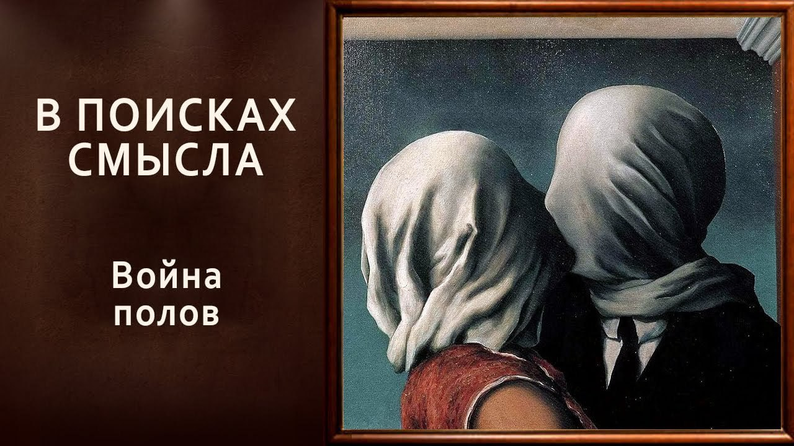

# Война полов

31 января 2025 [Аудиоверсия](https://paradoks-pinkera-pilotnyy-vypusk.simplecast.com/episodes/the-battle-of-the-sexes) 35:00

Растущее отчуждение между мужчинами и женщинами, проявляется в разных аспектах — от социальных ролей до политических взглядов.
Чем вызван раскол между молодыми мужчинами и женщинами в современном обществе и как борьба за равенство привела к новому типу угнетения и возвращению "токсичной маскулинности".
Исторические предпосылки этого разделения, включая влияние феминизма и изменения в экономической структуре общества.

**Е.Голуб:**
Здравствуйте, друзья!
В эфире очередной выпуск подкаста Павла Щелина и Евгения Голуба «В поисках смысла».

Сегодня мы решили начать или подойти к очень сложной теме.
Прямо скажем, тема опасная, и только наша необыкновенная решимость и смелость позволяет нам взяться за неё с отчаянием и...

Что можно сказать, Павел?

**П.Щелин:**
Ну, во-первых, здравствуйте, уважаемые слушатели.

Во-вторых, когда ты говорил про нашу неотъемлемую смелость, мне почему-то вспомнился старый довольно мем про слабоумие и отвагу.

**Е.Голуб:**
Да, да, да, да, да.
То есть мы примерно в такое выходим дело.
Видите, я даже, будучи, так сказать, на взводе перед этой темой, спутал слова и последовательность нашего представления.
Ну, бог с ним.

Итак, поводом для этого разговора послужило письмо из рассылки, которое мне пришло недавно.
А именно заголовок статьи Economist о том, что в Штатах, конечно же, или там в так называемом западном мире растет пропасть, непонимание между молодыми мужчинами и женщинами.
Даже если вы не читали эту статью, можно легко зайти в Facebook на страничку Economist и почитать комментарии к этой статье.
Ну и, собственно, там уже вся эта пропасть, она явлена во всей красоте.

**П.Щелин:**
Отражу суть происходящих событий, благо происходят они давно.
Это уже социологи фиксируют на протяжении последних примерно двух-трех лет, анализируя и британскую, и американскую, и европейскую действительность.
И что-то мне подсказывает, что если глубоко копать, скажем так, в украинской или российской действительности, вектор будет тот же.

Если говорить кратко, в чем суть процессов?

Женщины массово, с политической точки зрения, выступают за условно леволиберальные партии.
Экология, зеленая повестка, гендерное разнообразие, ну и в целом вот то, что мы считаем, условно говоря, либеральной нормой.

А между тем, молодые мужчины, особенно именно молодые мужчины, здесь вот возраст играет ключевую роль, идут в сторону политических взглядов, которые называются в зависимости от желаний авторов того или иного социологического опроса или интерпретации, от популистко-правых до фашистских.

И вот этот раскол, он становится уже значимым политическим фактором.
Вот если вкратце, о чём происходит содержание статей.

**Е.Голуб:**
Да, это то, на что обращают внимание авторы статьи в Economist, конечно же.
И то, что ты сказал, это, видимо, сейчас уже становится одной из тем обсуждаемых.
Но я думаю, что если мы присмотримся и прислушаемся к тому, что нас окружает в нашем опыте, то мы уже сейчас увидим, или услышим, или почувствуем то, что раньше невозможно было представить.

Я помню, во времена моей юности и молодости было всё-таки некоторое среди поколения какое-то было содружество.
Да, вот это наши мальчики, это наши девочки.
То есть мы вместе.
Мы можем различаться, конечно, есть различия, но мы вместе, мы одно поколение, мы один класс, мы одна команда, что-то ещё.

Сейчас всё чаще и чаще есть различия.
Это мужчины с их патриархатом.
А это женщины, освободившиеся совершенно недавно и, наконец-то, так сказать, ставшие на правильный путь.

Это доходит до вражды и до какого-то, ну вот прямо такой антипатии, которая сквозит.
В первом же комментарии к любой теме сразу появляется какая-нибудь барышня, которая заявляет о том, что мужчинам слова не давали, а они там известные угнетатели, консерваторы, и только и стремятся, вот если комментарию, да, как сделать из женщины свою пожизненную служанку.
Вот и всё, что вам нужно.
Поэтому молчите и не отсвечивайте.

Я понимаю, что для политиков важнее всего вот эти взгляды, потому что, на мой взгляд, изменение в взглядах — это производное от чего-то большего, от чего-то более фундаментального, от того, что выросло и проявилось.
Конечно же, для них нужно понимать, кого и как обрабатывать в зависимости от своих целей.
Но мне кажется, что это общее отчуждение мужчин от женщин, атомизация, о которой мы говорили, она заходит в этой сфере уже достаточно далеко.

**П.Щелин:**
Давай буду реконструировать.
Первый корень зла — тот же самый наш любимый номинализм, либерализм и прочее.
То есть взгляд на человека, как на индивида.
То есть это вот однозначный фактор.
То есть это первый шаг.

Причем, чтобы ты понимал, эта проблема настолько глубокая, что корень ее содержится в документах, которые сейчас даже самые типа консервативные страны под сомнение не ставят.
Пресловутая декларация ООН о правах человека.
Заметь, человека отдельного, в вакууме, самого по себе, отрезанного от всех остальных своих коллективных сущностей и свойств.

Между тем, большая часть человеческой истории была посвящена групповому выживанию, включая выживанию семейному.
Институтом была семья.
Заметь, декларация - не декларация прав семьи, а декларация прав человека.
Очень важная большая разница.
То есть в первом этапе ты обособляешь индивида.

**Е.Голуб:**
Да, разрываешь эту связь.

**П.Щелин:**
Да, на первом этапе ты разрываешь связь.

**Е.Голуб:**
То есть это как если бы мы говорили о правах атома в молекуле воды.
Да.

**П.Щелин:**
И то же самое декларация прав ребенка в эту же сторону, ну, тоже отдельно.
Заметьте, у всех деклараций права отдельные, да?
То есть очень важный, очень важный, уникальный момент.

Второе.
На этом фоне происходит следующее.
Буквально за несколько поколений, где-то быстрее, где-то меньше, в зависимости от скорости старта, вложенных ресурсов, происходит политизация гендерного вопроса.
То есть что я имею в виду?

То, что политика переходит туда, где она вообще-то приходить была не должна.
Вопросы семьи и вопросы пола становятся политическими вопросами.
А вспомни, что такое политика по сути своей.

**Е.Голуб:**
Ну, это полития, это общество, это взаимоотношения внутри сообщества всегда.

**П.Щелин:**
Ну, вообще, ты рассматриваешь это в греческой традиции, а все-таки в прикладном - это борьба за власть.
То есть у тебя теперь получается то, что вместо сотрудничества у тебя идёт борьба за власть.
И все вопросы интерпретируются в этом контексте.

**Е.Голуб:**
Очень интересно, я не думал об этом.
Окей, то есть мы отошли или там разорвали, не мы, неважно, были разорваны связи общего, которые мыслились как совместное делание ради совместного, скажем так, развития, процветания, выживания, в конце концов, воспитания детей.

**П.Щелин:**
Причём воспитание детей не ради детей самих, а ради тоже благо целого, благо семьи.

**Е.Голуб:**
Благо семьи.
Вот это тоже очень важный комментарий, потому что к этому тоже надо будет как-нибудь прийти.
Дети не сами по себе дети, а они часть семьи.

Что сейчас я сказал и подумал, что это уже звучит как крамола в сегодняшней ситуации.
А вообще-то, кажется, это же безобидные слова, совершенно не вызывавшие бы какого-то вопроса ещё каких-нибудь 40 лет назад.

**П.Щелин:**
Просто уточню, что это было всю человеческую историю.
Это была норма вплоть до последних 50 лет.

**Е.Голуб:**
Разорвали целое, разорвали молекулы на компоненты.
Каждому объяснили, что вообще говоря, дружище, ты будь внимательнее к правам-то своим.
Не нарушает ли какой-нибудь тут патриарх, матриарх или, не дай бог, родитель 1 и 2 твои драгоценные права?
Ну и сразу поставили их в жёсткую оппозицию.

**П.Щелин:**
Да.
То есть возникло что?

Представьте себе структуру в несколько этажей.
Условно говоря, большую часть человеческой истории основным этажом был этаж семейный или этаж минимальной коллективности.
Либо семья, либо клан, либо группа, либо все.
Что происходит?

Но этот этаж на самом деле действительно является средним.
Потому что каждый из этих этажей действительно состоит из вот этих атомарных вещей.
Логически, аналитически они существуют.
Но ты существуешь как индивид?
Ты действительно существуешь.

**Е.Голуб:**
Но мне этаж не нравится в сравнении.
Тут скорее какая-то амальгама какая-то, какой-то сплав, какое-то соединение общее.
Потому что этаж — это когда один над другим опирается, а они же сами по себе фактически не существуют.

**П.Щелин:**
Я говорю с точки зрения общества в целом.
Это структура фрактальной иерархии.
Эти структуры создают другие структуры, на них возникает друг друга.
Но суть в том, что с точки зрения общества в первооснове лежал не индивид, а в первооснове лежала семья.

**Е.Голуб:**
Всегда.

**П.Щелин:**
Теперь у тебя этот уровень разорван, и он оторван на более нижний уровень.
То есть у тебя теперь первичный уровень является атомарный индивид.
И этот этаж, мы это обсуждали с тобой в предыдущих выпусках, вообще все коллективные идентичности такого порядка объявлены злом.
То есть это всё является способом угнетения индивида.
Ну вот этого отдельного индивида.
И надо перепроверять, насколько выгодно у тебя заключён контракт с тем или иным... вот этими отношениями.

**Е.Голуб:**
То есть то, что раньше служило для выживания и благополучия, вот эти взаимозависимости, это же всегда была взаимная зависимость, было объявлено угнетением и подвержена, так сказать, осмеянию и потеснению.

**П.Щелин:**
И сделана очень хитрая подмена.
В итоге вот этот средний уровень условно фрактала убрали и оставили индивида наедине с конечной точкой вот этого фрактала, то бишь государством, то бишь сувереном.

**Е.Голуб:**
То есть лишили его вообще какой-то опоры и защиты, и какой-то поддержки, да?
То есть индивид в своей атомарности гораздо менее защищён.

**П.Щелин:**
Ещё тоньше.
Именно он гораздо менее защищён, и именно поэтому этот индивид должен подчинить ресурсы государства на своё благо, чтобы защитить его от всех других угнетающих его идентичностей.

**Е.Голуб:**
Так, скажи ещё раз.
Я что-то не понял.
По-моему, индивид там никого ничего подчинить не может.
Он только и делает, что и подчиняется.

**П.Щелин:**
А вот ты не поймёшь эти статьи в «Экономист», если...
Сейчас давай буду объяснять.
Это важно.

**Е.Голуб:**
Это концепция такая, да?

**П.Щелин:**
Это не концепция.
Это трюк.
Ты семье доверять не можешь?

**Е.Голуб:**
Угу.
Там угнетатели, патриархи и прочие всякие злыдни.

**П.Щелин:**
Кто тебя от них защитит?

**Е.Голуб:**
Ну, внешняя сила какая-то.
Апеллировать нужно к государству, да?
Обществу.

**П.Щелин:**
Апеллировать нужно государству.
Кто тебя от насильника защитит?

Не брат, не муж, а государство.

Кто тебе ещё чего-то сделает?

Государство.
У тебя средний уровень связей превращён в угрозу, и у тебя остались индивиды наедине с самым высоким уровнем, с государством.

**Е.Голуб:**
Но подожди, подожди.
А как же вот эти вот все объединения по признаку того же гендера, я не знаю, ещё чего-нибудь там цвета кожи и так далее?
Это не работают?
Это новые псевдосемьи и племена?

**П.Щелин:**
Так не работают же в том-то и дело.
Но заметь, очень важный момент, они все неорганичные, и поэтому для своего...

**Е.Голуб:**
Поддержания, да?
Да, им нужна внешняя подпитка.

**П.Щелин:**
Им требуется тоже государство.
Они требуют, чтобы государство, условно говоря, дало им квоты, льготы, обеспечило защиту их прав.
Опять-таки, логика идет через государство.

**Е.Голуб:**
Что меня смущает в твоих словах?
То есть я вижу логику, мне кажется, очень всё логично и объяснимо.
Я не согласен внутренне с твоим посылом, что вот как это сделано.
То есть опять какие-то теории заговора и какие-то заговорщики сидели и сделали.
Мне кажется...

**П.Щелин:**
Да нет, теории заговора здесь нет.
Это раскрытие идеи.

**Е.Голуб:**
Да-да-да.
То есть это не сделано, это органичное раскрытие идеи, которое с чего началось?

**П.Щелин:**
С индивидуализма.
Ну, изначально с номинализма, а потом, ну, вот на нынешнем этапе с декларации прав человека.
Фундаментальный шаг — это либерализм и его декларация прав человека.
То, что первичным элементом общества является человек.
Отдельный человек.

**Е.Голуб:**
Ну, ты понимаешь, мы ступаем с тобой вот на эту зыбкую почву.
Хорошо.
А как можно сказать иначе?

**П.Щелин:**
Семья.

**Е.Голуб:**
А как же вот эти домашние насилия, как же вот эти мужья-тираны или женщины-тираны?
Что же это самое?

Мы не даём никакой возможности отрегулировать вот эти патологические ситуации.
То есть мы закрываем двери, окна и не смотрим, что там происходит внутри, а там же а-та-та.

**П.Щелин:**
Ну вот смотри, вот сейчас ты, наверное, воспроизводишь логику, в том числе нормальное благое желание, как чаще всего с ошибками происходят.
Они происходят из благих намерений, да.
Пытаешься защитить от человека, от семьи, а потом оказывается, что единственное его состояние — это конфликт всех со всеми и борьба за единственную дубинку, которая может защитить тебя от всех остальных.
То есть теперь есть только ты и вот эта большая государственная дубинка, которую ты надеешься получить контроль над, чтобы защитить тебя от всех остальных.

**Е.Голуб:**
Давай я попробую тоже упростить со своей стороны.
То есть вместо того, чтобы способствовать оздоровлению или что?
Воспроизводству здоровых отношений в семье, сохраняя семью как некую целостность.

**П.Щелин:**
Преображать.
Допустим, у тебя действительно был отец-алкоголик, который плохо отразился на будущем твоей семьи.
Но на тебе это прекратится.
Ты его грех преобразишь и воспитаешь, я не знаю, там детей, которые составят славу вашего города.
То есть на тебе, у тебя вот лично путь героя, и ты через себя преображаешь пороки прошлого в некое там, не светлое будущее, но в что-то хорошее.

**Е.Голуб:**
Ну то есть герой, который останавливает зло.
То есть на нем.
Зло останавливается на нем.
То есть оно не пройдет дальше.

**П.Щелин:**
Хотя и в отношении тебя можно сказать, что идеальный баланс справедливости не сойдется.
Условно говоря, то, что тебя в детстве, допустим, били по жопе, а ты не бьешь в будущем.
То есть ты отца по жопе уже больше не побьешь.
Условно говоря, идеальный баланс не восстановится.
А человеку подменили идею равенства.
То есть идея в том, что нужно восстановить баланс.
Кто этот баланс может восстановить?

Только внешняя сила.
Тебе.
Но это играет в очень понятные человеческие сложности прощать.
То есть традиционалистский подход требует очень много прощения и любви внутри этих структур.
А это неконтролируемо.
А юридическую норму я могу контролировать.

**Е.Голуб:**
Идея государства как общего блага, оно изначально родилось как необходимость союза семей, родов, кланов, объединённых общей территории обеспечить лучшую жизнь для себя.
А теперь получается, что то, что наросло на этой почве, то, во что оно, так сказать, выродилось в какой-то аппарат, совершенно непонятно как возникающий, вот это отчуждённое от своих составных черт, от своих изначальных родовых клеток, нечто.
Становится в оппозицию по отношению к своему элементу.
А настолько отчуждается, что, в принципе, вообще и не должно никак, не хочет и не может, и не должно зависеть в этой логике от этого атома.
Как оно может от него зависеть, если оно призвано его защищать?

**П.Щелин:**
А ещё на это начинают накладываться совсем...
Как только мы вошли в этот лес, оказывается, что в нём живут очень злые партизаны.
Про некоторых я тебе объясню.
Тоже благие намерения, а потом злой партизан.
Другой благой тип намерений заключался в том, что на фоне мировых войн, по сути говоря, действительно сложилось очень большое ощущение, что мужской тип доминирования через агрессию, мужчины доминируют через агрессию.
Физическая сила.
Это правда.
Всю историю так было.
Он слишком плохой.
Вот он только зло приносит, он только войны приходит.
Давайте как-нибудь помягче.
И вот очень интересный момент.
Декларация прав человека и установка на вечный мир выведения войн за скобки тесно коллерируют с ростом феминизма и распадом вот этих традиционных семейных структур.

Ну, потому что если ты убираешь то, скажем так, значение насилия, и ты, вот мы с тобой были, с тобой подкасты на эту тему, скрываешь его, делаешь его скрытым, делаешь его исключительно манипулятивным, то оказывается, что это женский тип доминирования, это женский тип насилия.
Он строится через манипуляцию, он строится через обман, он строится через некую мягкость.
Уж простите, дорогие дамы, но это правда.

Есть такой шикарный фильм, знаешь, в фэнтези очень много женщин-воительниц разных, но это полный бред.
Есть несколько таких исторических фильмов, где это показано, что женщина в тяжелом доспехе и мужик в тяжелом доспехе...
В общем, не работает это, прямо скажем.
То есть вообще это сказки.

Поэтому мы меняем условия.
То есть мы убираем тоже вот это естественную подноготную семейных отношений.
То, что вот эта взаимодополняемость, где, условно говоря, мужское начало отвечает за внешнее, за насилие, за взаимодействие с внешним миром, а женщина отвечает за внутреннюю структуру и наполнение вот это всего устойчивостью и теплом, мы это все убираем.
Это вот первый был такой важный лес.
А как мы это делаем?

А мы это делаем через апелляцию к тому, что ты именно правильно говорил, к правде.
Мы говорим и начинаем очень долго рассказывать мужчинам, что они все тираны, угнетатели, злые, насильники, агрессивные, военные и прочее, прочее, прочее.
И по плану мужчины должны были условно...
Дело в том, что эта манипуляция будет длиться вечно.
Это я возвращаю тебя к статье.
Что происходит?

И тут вот внезапно палочка-то перегнулась.
Потому что после того, как на протяжении 50 лет выстраивалась система на Западе, где мужчина выиграть не может, что бы он ни делал, он все равно будет угнетателем и тираном.
Он успешный?

Он успешный, потому что он за счет угнетения.

**Е.Голуб:**
Потому что он в мужском мире, ему, конечно же, намного легче живется.
Это всем ясно и очевидно, не требует доказательств.

**П.Щелин:**
Он не успешный?
То есть, несмотря на свои привилегии, ты еще и не успешный?

Ты вообще ужасный.
То есть, единственный способ для, условно говоря, обычного мужчины быть успешным, это был найти в себе какую-то идентичность, назовем это так.
То есть это был единственный способ выскочить из этой игры, но и то вот эта вся иерархия угнетения.
Что произошло на фоне перегнутия палки на этом поколении?
Вот заметь, на предыдущем поколении эта манипуляция еще работала, в каком-то смысле достигла своего пика.
А это поколение, по сути, сказало, окей, вы называете нас угнетателями, тиранами, животными, грубыми, прочими.
Окей, мы будем такими.
Вы нас таких боитесь?

Мы будем ими.
Этот образ в англоязычной среде называется «manosphere».
Это образ вот этого «enduritate», воплощения вот этого подсознательного процесса.
Если вкратце он говорит, вы называете нас животными и угнетателями, окей, мы все ваши страхи реализуем.
Мы не призваны это делать.
Это я описываю подсознательный процесс.
Мы вообще-то не должны быть угнетателями.
Но раз у нас единственный выбор — либо быть вот этим всё время виноватым, либо угнетателем, окей...

**Е.Голуб:**
... нам комфортнее быть угнетателем.
И там, в конце концов, это естественнее, и мы, в конце концов, сколько можно чувствовать себя в состоянии...

**П.Щелин:**
Мы вернём физическое насилие в нашу среду.
То есть, и все следствия.
Вы убрали физическое насилие, мы вернём физическое насилие.

**Е.Голуб:**
Ну, так сразу крик «государство, государство, токсическая маскулинность».

**П.Щелин:**
А у тебя возникает выбор то, что внезапно с государства тоже, убрав токсическую маскулинность, оно же ее убрала из армии, оно ее забрала из полиции.
И внезапно отказывается, что против реальной токсичной маскулинности оно бессильно.
Недавние мигрантские погромы в Англии это очень хорошо показали.

То, что когда выходит толпа мужчин, готовых ломать лица, полиция разбегается.
Потому что она тоже была не для этого уже воспитана последние 30 лет.
Она тоже себе гендерные квоты вводила и рассказывала про diversity.
И на самом деле все очень плохо, потому что это сейчас ты просто коснулся основного политического конфликта.
И вот восстание мужчин, которое грядет в этом контексте, оно будет страшным.
То есть, условно говоря, по метафоре, призван мужчина быть рыцарем, а придет викинг.

**Е.Голуб:**
Ну, разбойник.

**П.Щелин:**
Да.
Но если заставить мужчину выбирать, как заставил его феминизм, быть разбойником или быть чмом, он лучше разбойник.
Через поколение природа берет свое.

**Е.Голуб:**
Здоровее для него будет, да.
Естественнее для него.
Иначе это просто такой конфликт напряжения, который никак не реализуется без возвращения себе самоуважения.
А как, если любая попытка встать на ноги и расправить плечи сразу вызывает как минимум подозрение?

Обычно это сразу же попытка опустить себя обратно куда-нибудь.

**П.Щелин:**
Объективно, мужчина сегодня по правилам тем игры, которые формировались, вообще действительно выиграть-то никак не может.
Он все равно будет вот именно психологически, эмоционально всегда виноватым.

**Е.Голуб:**
А если он еще и белый мужчина, это...

**П.Щелин:**
Кто самое, вот с точки зрения реального политического угнетения, к сожалению, в западных обществах, это молодой, белый, не гей мужчина.
Ну, он реально.
Это просто воплощение мирового зла.

**Е.Голуб:**
Просто по факту своего рождения, своей сущности.

**П.Щелин:**
И казалось то, что они с этим просто молча согласятся.
А вот эти все опросы показали, что внутри зреет, что, знаете что, я не согласен.
И если единственный способ из этого вырваться, сжечь все вокруг, я сожгу.

**Е.Голуб:**
Я не вижу того, что ты видишь в Штатах.
Мне это не видно.
То, что мне видно, и то, что меня сначала удивляло, а потом стало раздражать, — это фильмы.
Как не откроешь какой-то фильм, то там главная героиня — женщина, которая ведёт себя агрессивно.
А последнее время — это кинофильмы или сериалы, в которых женщина выполняет роль защитника слабого мужчины.
Причём это женщина модельной внешности с тонкими ручками и ножками, которая берёт тяжёлый автомат, бронежилет, прыгает там и скачет, что выглядит совершенно нелепо.
И это сплошь и рядом.

Открываешь книжную полку, все книги в последнее время, все премии — это женские.
Вот ты посмотри, обрати внимание.
Мужчины перестали писать книги?
Что произошло?

Все престижные литературные премии, которые я знаю, по крайней мере, за последние года 3-5, они присуждаются женщинам.
Безусловно, прекрасно, что талантливые женщины-писательницы — это здорово, но как-то статистически это выглядит немножко странно.

**П.Щелин:**
Ну смотри, первое, это очень важный момент.
Ну второе, это вот как раз то, что мы подтверждением говорили, то есть правила игры сделаны таким образом, что победить невозможно.
Причем те, кто, если ты будешь общаться с людьми, они скажут, да, они так и сделаны, и это хорошо, потому что вы тысячелетиями пользовались другими правилами, а теперь мы вас поугнетаем.
Но вот здесь очень важная подмена.

Если мы действительно принимаем эту логику, то, что реально, то, с чем мы начинали, то, что реальное сотрудничество невозможно, то если мы принимаем эту посылку, что реальное гармоничное сотрудничество невозможно, а единственный способ организации общественных жизней — это вот через угнетение вот такого...
То есть вопрос, условно, женщина мужчину угнетает или мужчина женщину угнетает, то успешность плана по, условно, вот этой женской революции базируется исключительно на том, что вы каким-то образом убедите мужчин физически не сопротивляться угнетению над ними.
А сделать это можно только через рассказ про восстановление равенства возможностей.
Это же всегда продавалось как восстановление равенства возможностей.

И какое-то время действительно казалось, что речь идет исключительно о том, что мы выравниваем правила игры, создаем общие правила игры для всех, а дальше каждый в меру своих заслуг на этих правилах игры победит.
И это очень отзывалось в том числе и в нормальном мужском характере соревновательства.

**Е.Голуб:**
Да, справедливость, да, почему fair game.

**П.Щелин:**
А вот теперь новое поколение, до него дошло, что это нифига не fair game.
То, что это замена одного угнетения на другое угнетение.

**Е.Голуб:**
Подожди, ты пропускаешь какие-то элементы, которые для тебя очевидны, для меня не очевидны, давай поэтому сделаем пару шагов назад.
Двигаемся следующим образом.
Такое заявление.
Женщины нуждаются в некотором гандикапе, в некоторой поддержке для того, чтобы они могли получить равные возможности.
Мы же за равные возможности.
Конечно.

**П.Щелин:**
Это первая подмена.

**Е.Голуб:**
Вот где тут подмена?

**П.Щелин:**
Если наша цель — fair game, то тогда гандикапы или отсутствие гандикапов — это часть fair game.
Я не буду жаловаться на Олимпийских играх, то, что я не рожден как Усейн Болт с его генетическими данными, поэтому не могу выиграть стометровку.
То есть гандикапы и отсутствие гандикапов — это часть нашей природы.
И, кстати, возвращаемся к номинализму, то, что мы с тобой обсуждали.
А номинализм, как философия, отрицает гандикапы и идентичности как пресловутую нормальную часть бытия.

**Е.Голуб:**
Я не уверен, что это ясно звучит.
То есть давай я попробую перефразировать.
Мы такие, какие мы есть.
Если мы пытаемся искусственным путем дать атлету слабому преимущество, выровняться с атлетом сильным, мы просто лишаем смысла всю эту игру.

**П.Щелин:**
Что мы можем сделать?
Fair game — это доступ к игре.
То есть проблемой можно было сказать аргумент, что, условно говоря, у тебя у значительной части населения не было доступа к игре.
И продавалось это, условно говоря, именно как допущение доступа к игре для женщин.

**Е.Голуб:**
Да, но видишь ли, в чем дело?

Всё свелось к несправедливости, которая соотносится с биологическим проявлением.
Потому что женщина только может родить и воспитать ребёнка, выкормить его.
Ребёнок до какого-то возраста нуждается в матери и никуда от этого не деться по биологическим причинам.

А это воспринимается как несправедливость.
Более того, подспудно мужчина обвиняется в том, что он злоупотребляет вот этим природным таким явлением.

**П.Щелин:**
Понимаю.
Но смотри, два момента.

Первый, просто зафиксируй то, что все-таки, если у тебя есть логика фэр-гейма настоящего, то все, что ты можешь гарантировать — доступ к соревнованию, а не выравнивание возможностей по соревнованию.
Поэтому как только ты начинаешь говорить о том, что нам нужно раздавать гандикапы, это уже подмена изначального тезиса.
Просто подмена.
С него начинается подмена.
А потом дойдёт до того, что гантикап должен быть такого масштаба, чтобы гарантировать определённый результат, нами желаемый.
Это раз.

**Е.Голуб:**
Но ты понимаешь, вот отсюда и пошло, что мужчины должны рожать, и это правильно.
К этому всё и ведётся, что нет мужчин и женщин.
Да, вот это получается неизбежная логика следствия вот этой погони за правами.

**П.Щелин:**
Тут происходит ещё один очень интересный компонент, что в борьбе за права женщин реальным злом объявлена женственность.

**Е.Голуб:**
Да.
Потому что это признак, понимаешь ли, какой-то субмиссивности, какой-то подчинённости.
То есть согласие быть подчинённой, эти хаусвайфы, традвайфы, как они там называются.
Традиционные жёны — это просто худшее зло, чем самые отвратительные токсичные мускулины.
Потому что они демонстрируют эту модель поведения.

**П.Щелин:**
Для женщины требуется отказаться от её на самом деле...
В идеале вот этой современного общества, в борьбе за права и защиту от тирании семейного насилия, от женщин реально ожидается отказ от её женской природы.
Точно так же, как и от мужчины.
Отказ от его мужской природы в пользу вот этого непонятно андрогинного среднего.

**Е.Голуб:**
Оно громко отрицается.
Ничего этого нет.
Это всё социально обусловлено.
Да, вы морочите нам голову.
Все эти женские и мужские роли придуманы для того, чтобы держать иерархию эксплуатации в узде.
Поэтому идеальный член общества — это бесполое существо.
Совершенно физически малоотличимые мужчины от женщин, и наоборот, которые размножается через пробирку.
Вот всё.

**П.Щелин:**
Ну вот тебе надо объяснять, почему идеалом, скажем так, этого мировоззрения и его логичным и естественным продвижением, то есть написали Декларацию прав человека, не удивляйтесь, что идеальным гражданином будет трансгендер.

**Е.Голуб:**
Да, так и есть.
Бесполое, неспособное размножаться существо, полностью зависимое от внешней поддержки.

**П.Щелин:**
Медикаментозной, государственной, финансовой, экономической и прочее, прочее, прочее.

**Е.Голуб:**
Ну, то есть добровольное рабство, добровольный абсолютный отказ от своей автономии.
То есть в борьбе за свободу, как мы с тобой начинали, полное рабство.

**П.Щелин:**
В обмен на свободу от биологического и идентичностного ограничения.
Да, именно так.

**Е.Голуб:**
Я не хочу признать ограничения, которые существуют физически объективно, и поэтому я во имя вот этой как бы свободы отдаю полностью свою жизнь во власть безликому государству и там чему-то внешнему.

**П.Щелин:**
Очень важно, безликому.
Это, кстати, очень важно, безликому.
Оно мне будет и мамой, и папой.
Вот это Nanny State.
Государственная нянечка такая, которая решит все мои вопросы.
И у меня претензии будут к нему.

**Е.Голуб:**
И ни за что не отвечает, на самом деле.
Претензии-то будут, но реально, что я могу с ним сделать?
Ну, пожаловаться.

**П.Щелин:**
И реально я к ответу привлечь не могу.
Ну, просто смотри.

На чем вся эта структура базируется, все-таки очень важный момент.
Ключевой у нее вот есть пунктик, на котором реально все ломается.
Она базируется на согласии мужиков на всю эту историю.
Мужики на это согласились массово.
На Западе только под лозунгом «фэр-гейм».
Сейчас до них доходит, что гейм совсем не фэйр.
И вот паника, которая сейчас идет в журнале «Экономист», в других статьях, она связана с осознанием того цунами, который грядет.

**Е.Голуб:**
Подожди, а в чем выигрыш женщин в этом смысле?
Я вот не особенно понимаю.
Даже поэтапно.

**П.Щелин:**
А нет, женщины последовательно становились клиентским классом.
Государство, давай нашу римскую метафору, клиент-патрон-клиент.
То есть государство было их патроном, а женщины становились клиентским классом, который получал от этого патрона очень много хлеба и зрелищ.

**Е.Голуб:**
Ну да.
Вот эти гандикапы, о которых мы говорили, всякие преимущества, не всегда связанные с реальными способностями, а иногда связанные только с тем, что среди двух одинаковых кандидатов один был правильного биологического пола.

**П.Щелин:**
Гендер.
Но это ты берешь совсем крайний случай, но и в целом логика то, что психологически определенный комфорт, типа girl power, то есть сила, постоянно вот этот разговор, женщина сюда, женщина сюда.
The future is female.
Это тоже форма клиентского класса.
Расширенная формулировка зрелища.
То есть женщины могут это...
Ну, комфортно.

**Е.Голуб:**
Слушай, ну мне кажется, это закончится очень плохо.
То есть в логическом своем конце, да, если так доводить рассуждение до предела, чем это может закончиться?

**П.Щелин:**
Закончится это тем, что они реализуют свои страхи.

**Е.Голуб:**
Да.
Я это и хотел сказать, что это неизбежно и кажется логическим продолжением, потому что так как ты отказываешься от возможности строить гармоничные, партнёрские, взаимозависимые, в хорошем смысле этого слова, взаимная нормальная зависимость отношения.

**П.Щелин:**
Разные.
Очень важный момент.
Только это зависимость разное.
То, что где каждый занимается своим делом, по сути говоря, в общем целом, и первичность целого, и реализация только через целое.

**Е.Голуб:**
То ты получишь угнетение и эксплуатацию, в конечном итоге.
Агрессию, угнетение и эксплуатацию.

**П.Щелин:**
Ну смотри, это вот такая метафора, я тебе сразу скажу.
Знаешь, какое является основным таким хоррором, феминизма и вот условно женщин, которые приняли, скажем так, эту идеологию?

Рассказ «Служанки».
Сериал вот недавно вышел на эту тему.
Получат они именно это.
Это самосбывающееся пророчество.
Доведя мужиков до состояния, когда единственный способ для них выиграть в этой игре — это насилие, причем неконтролируемое, не научив их при этом, что такое настоящее мужественность, что такое настоящее рыцарственность, что такое настоящее семейное отношение, они получат именно то ужасное тоталитарное будущее, которого они так боялись.

**Е.Голуб:**
Ну, потому что просто сообщество и государство не станет силой, способной противостоять вот этому внешнему насилию и агрессии.
То есть исчезнет это.

**П.Щелин:**
Разумеется.
Оно, во-первых, исчезнет, а во-вторых, что более важно, само государство вынуждено будет в конце согласиться с мужчинами, если они выжить захотят.
Потому что в конечном итоге все вернется к вот этим фундаментальным вещам.
Понимаешь, все вот эти игры, они же уже были в Древнем Риме.
Снова минутка рекламы, что называется, собственного курса.

Сейчас я тебе зачитаю одну цитату из моего любимого Катона.
И вот там есть великолепная цитата про Рим.
То есть когда Рим победил своих врагов на пике благополучия, в нем начали очень интересно происходить процессы.
И вот один из этих процессов — то, что,

> Возможно, Рим выжил благодаря своей способности приспосабливаться к изменениям и патриотическому духу, который формировался в доме, школе, храме, армии, ассамблее и сенате.
> Преданность государству знаменовала зенит республики, а беспрендентная политическая коррупция знаменовала ее падение.
> Рим оставался великим, пока у него были враги, понуждавшие его к единству, мудрости и героизму.
> Победив всех своих врагов, республика на мгновение расцвела, а затем начала умирать.
> Обычно власть женщины усиливается вместе с богатством общества, поскольку когда желудок полон, голод оставляет поле любви похоти.
> Проституция процветала, гомосексуализм стимулировался контактами с Грецией и Азией, многие богатые мужчины платили талант за любовника мужчину.
> Катон жаловался, что красивый мальчик стоит дороже, чем ферма.
> С того момента, как женщины стали вам равными, жаловался Катон, они станут вашими хозяевами.
> Женщины добились свободного управления своим приданным, разводились со своими мужьями или иногда отравляли их и сомневались в целесообразности рождения детей в эпоху перенаселенных городов и империалистических войн.

**Е.Голуб:**
Как прекрасно.
Как будто бы я вчера этот разговор услышал за столом.
Ну хорошо, это мы упомянули вскользь о курсе Павла «Чтение Плутарха», но об этом вы сможете узнать из других источников.

**П.Щелин:**
Но просто суть в том, что процессы повторяемые.
А потом начинается эпоха гражданских войн, потом начинается эпоха насилия, когда ты уже не можешь рассказывать про права женщины, тебе просто надо думать, где банку тушенки найти и кто лучше стреляет.

**Е.Голуб:**
Обычно это связано с варварами, которые приходят из темных лесов, у которых нет таких проблем.
И с мужеством все в порядке, и с агрессией.

**П.Щелин:**
Нет.
На самом деле, чаще всего изнутри.
Гражданские войны тоже начинаются.
Или гражданская война начинается.
А элементарно.
У тебя все равно в обществе всегда есть куча людей, которые готовы всегда, знаешь, как в другом меме.
А шо так можно было?
Вот когда сломается...

Пока все держится на иллюзии, что так мы приличные люди, и мы так не поступаем.
После того, как произойдет момент «А шо так можно было?», вот это все накопленные гроздья гнева взорвутся.
Причем это будет страшный, на самом деле, процесс.

**Е.Голуб:**
Ну хорошо, давай постараемся все-таки завершить на какой-то, ну хотя бы не такой ноте кликушеской, да?

**П.Щелин:**
Нет, это не кликушеская, это прогностическая.
А основной вывод простой.

Не стоит наступать на эти грабли.
Государственную политику вряд ли наши уважаемые слушатели где-то могут изменить, но хотя бы порядок в своих головах смогут, думаю, начать возвести.

**Е.Голуб:**
Нет, ты знаешь, я просто думаю, что сам захотел позитива, сам не найду, потому что вот настолько это уже въелось в умы прекрасных, умных, замечательных женщин, что чтобы мужчины не говорили по поводу вот этого всего, агрессивности или патриархии, все, что они хотят вернуть власть, не дадим, не простим.
Там уже с агрессией, по-моему, уже все наоборот.

**П.Щелин:**
Ну смотри, тогда прогноз на это сценарий мы дали.
Я все-таки закончу тем же, с чем и начал разбираться.
Первой причиной является разрыв целого на части, искусственной, и видение частей вместо целого.

То есть путь к восстановлению, к здоровому, может быть только там.
То есть надо снова научиться видеть целое вместо его частей.
Которое больше, чем сумма его частей и ценности этого целого.

**Е.Голуб:**
Ну тогда нужно перевернуть вообще всё, понимаешь?
Это нужно перевернуть доску вот просто полностью, да?
Совершенно.
Иначе выхода из этого нет.
То есть всё остальное полумеры и иллюзии.

**П.Щелин:**
Мыслимо ли это?
Технически ли это возможно?
Да.
Сложно?
Вероятно.
Крайне сложно, практически невероятно.
И моё мнение, что это будет, к сожалению, по сценарию...
Можно ли сделать это по хорошему?
Vожно, но никто ж по-хорошему не сделает.

**Е.Голуб:**
Я в завершение хочу сказать ещё.
Как не хочется к этому приходить, но почему-то всё выпиёт, нужен коллапс, нужен очистительный какой-то капец, назовём это так.
Так, чтобы всё встряхнуло настолько здорово, чтобы всё так и стало на свои места.

**П.Щелин:**
Вот практический пример, чтобы в условиях коллапса физическое выживание стало негарантированной безопасностью.
И вспомнилось, почему ценность широкой мужской спины, за которой спрятаться можно, исторически была очень большой ценностью.

**Е.Голуб:**
Да, и те, кто останется способным эту широкую спину предоставить...

**П.Щелин:**
Огромное количество мужчин тоже уже с широкими спинами быть не хотят, в том-то и дело.
Они тоже никого защищать не хотят.
Они тоже теперь подкупились на все это доминирование.
Это для всех коллапс.
Давайте так, а то нас сейчас запишут исключительно в гендеры.
Нет, у нас сейчас дефицит широких спин капитальный.
И вот это, кстати, вопрос, что делать.

Для начала, готовясь к будущему, можно посмотреть в зеркало и начать взращивать в себе добродетели и широкие спины.
Пригодится.

**Е.Голуб:**
Ну хорошо.
Итак, за широкие спины.
И добродетели.

На этом мы сегодня закончим.
Спасибо вам, дорогие слушатели.
Ну и до новых встреч.

**П.Щелин:**
До новых встреч.
Спасибо, Жень.
