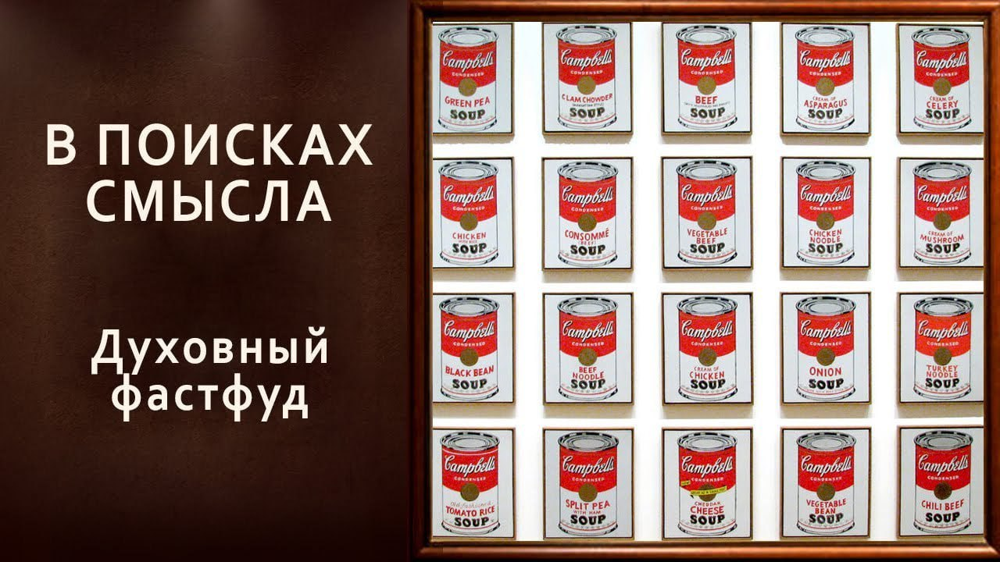

# Духовный фастфуд.

11 апреля 2025 [Аудиоверсия](https://paradoks-pinkera-pilotnyy-vypusk.simplecast.com/episodes/dukhovny-fast-food) 34:03

Подкаст "В поисках смысла" впервые выходит в формате триолога: к авторам присоединяется Ирина Шевченко,
психотерапевт и религиовед, предложившая обсудить спорные аспекты разграничения психотерапии и религиозных практик, затронутые в выпуске "Исповедь на кушетке".

**Е.Голуб:**
Здравствуйте, друзья!
В эфире очередной выпуск подкаста «В поисках смысла».
Но сегодня со мной не только Павел, сегодня со мной ещё и Ирина.

Это экспериментальный выпуск, когда мы решили включить в наш разговор одну из наших самых активных слушательниц и попробовать вместе порассуждать на тему, которая вызвала у неё довольно острую реакцию или желание высказаться.
Передаю слово Павлу.

Что Павел думает по этому поводу?

**П.Щелин:**
Я думаю, что не нужно тянуть кота за хвост и передать слово Ирине, потому что у нас экспериментальный выпуск.
Очень интересно посмотреть, как оно выйдет.
Интересно посмотреть, какая будет реакция.
Поэтому давайте с места в карьер.

**И.Шевченко:**
Меня зовут Ирина Шевченко.
Я психотерапевт с определенным академическим опытом в религоведении.

Я хотела бы прокомментировать выпуск «На кушетке», в котором прозвучала идея, что очень часто люди ходят в психотерапию для того, чтобы достичь просветления, а это невозможно.
И, собственно говоря, у меня это вызвало такую реакцию, потому что, во-первых, это моя сфера деятельности, во-вторых, действительно вопрос поднят непраздный.
И я хотела бы разобраться и дать свой профессиональный взгляд на эту проблему.
И, может быть, даже прояснить определённые моменты, чтобы не было путаницы.

**П.Щелин:**
Можно я тогда сразу задам вопрос?
Есть ли такая проблема?
Видите ли вы её?
И как вы к ней, в принципе, относитесь?
Есть ли у нас согласие по базовому, так сказать, вопросу?

В целом то, что мы обсуждаем, существует.

**Е.Голуб:**
Давайте сформулируем эту проблему как некоторый тезис, которому мы будем давать либо комментарии, обоснования или на обоснование антитезиса.
Ирин, как бы ты сформулировала вот этот тезис, как ты услышала его у Павла?
Ещё раз повтори, пожалуйста.

**И.Шевченко:**
Психотерапия является эффективным путём духовного роста.

**Е.Голуб:**
Павел, ты такое говорил?

**П.Щелин:**
Я говорил о том, что есть такое мнение, и я как раз с этим мнением не соглашался.
То есть моё мнение, оно им не является, но то, что в массовом восприятии сложилось, по сути, вот такое ассоциативное замещение.
Вместо духовного пути можно ходить к психотерапевту.

**Е.Голуб:**
То есть они приравнивали, скажем так.
Мы говорим, вот есть разные способы привести себя в порядок, просветлеть.
Вот один способ — это пойдём к психотерапевту, другой способ — пойдём в храм.

Или: вы ходите в храм, вы ходите в церковь, но вам не хватало психотерапевта.
Теперь есть психотерапевты, и они прекрасным образом это всё замещают.

Вот такой, скажем так, тезис, который витает в воздухе, и мы хотим по его поводу порассуждать.
Так?

**И.Шевченко:**
Да, я абсолютно согласна — такой тезис есть и я с ним тоже, как и Павел, не согласна. 
Но такое мнение существует, оно очень распространено.
Вот я хотела бы немножко расставить точки над «ё» в этом вопросе.

**Е.Голуб:**
То есть мы будем втроём глумиться над теми, кто думает о том, что это возможно.
То есть у нас не будет спора, у нас будет разрывание шаблона по поводу психотерапии.
Ну, тоже хорошо, я думаю, поспорим, будем спорить в том, как сильно мы будем разрывать этот шаблон.

**И.Шевченко:**
Я хочу в первую очередь разделить два понятия.
Понятие духовного роста и личностного роста.
Это две совершенно разные вещи.

Духовный рост.
Вообще, что это такое?
Вот в моём понимании, и я надеюсь, не только в моём, я не сама до этого дошла, но духовный рост – это исключительно религиозный опыт.
Это философская и мистическая идея о том, что человек за одну или несколько своих жизней может развиться из материального состояния в духовное и даже в божественное.
Вот что такое духовный рост.

В любой сильной религиозной традиции — возьмите христианство, возьмите иудаизм, возьмите ислам, возьмите буддизм, даосизм и так далее — есть мистические школы, это и каббала, и исихазм там и так далее, и суфизм в исламе.
И, собственно говоря, именно эти школы занимаются духовным ростом.
Духовный рост – это религиозный опыт, продвижение из нашего материального мира в более духовное существо.
Вот что такое духовный рост.

**Е.Голуб:**
Так, минуточку.
Здесь нужно остановиться, потому что я вообще всегда с большой осторожностью говорю о том, как, например, я понимаю, что такое стремление или опыт трансцендентного преодоления вот этого, скажем так, земного что ли.
Я вообще такой придираюсь всегда к словам, потому что очень легко здесь наговорить такого, что обесценит последующую дискуссию.
Поэтому я бы хотел, чтобы всё-таки Павел как-то отреагировал на твои слова, потому что для меня вообще духовный рост — это оксюморон.
Это что-то, что мы взяли из модерна или постмодерна, это набор слов, и употребляем к практике.

**П.Щелин:**
Я бы здесь просто пошёл по максимально общему пути и пока ещё внимательно слушаю.
Мне интересно, как Ирина разделит это с личностным ростом, потому что как раз, на мой взгляд, в современном языке эти два понятия слились практически до неотличимости, и нам будет довольно сложно для начала убедить, скажем так, аудиторию, что они действительно разные.

Со своей стороны, для меня, то что называется духовным ростом или духовным преображением, это именно скорее про преображение, про растяжение души, про приобщение к миру невидимому.
Это всё с этим связано, но существующему не как некая фантазия, а как конкретная реальность, которая ещё более важна, чем все материальные феномены, которые нас окружают.
Об этом можно говорить отдельно.

**Е.Голуб:**
Духовный рост.
Вообще существует такое понятие?
Или это попытка втиснуть духовный опыт.

**П.Щелин:**
Ну, мне кажется, слово «духовный рост» — это эвфемизм понятия преображения.
То есть это изменение человека в другое этическое состояние.

**И.Шевченко:**
Это не то что эвфемизм, это просто более такой общий, потому что преображение это, скажем, в христианской традиции.
У буддистов это будет по-другому называться и так далее.
Но моя идея в том, что духовный рост это абсолютно религиозная традиция и он возможен исключительно в рамках определённой религиозной традиции и определённой мистической школы внутри этой религиозной традиции.
А не то, что мы с вами, знаете, с дуба рухнули и просветлели неожиданно.
Это профанация.
Вне контекста определённой религиозной традиции и мистической школы в рамках этой традиции выражение «духовный рост» не имеет никакого смысла.

**Е.Голуб:**
Я думаю, с этим можно согласиться, Павел.

**П.Щелин:**
Я соглашусь и послушаю, что будет дальше.

**И.Шевченко:**
Дальше у нас есть ещё одно определение.
Личностный рост.

Чем вообще занимается психология, психотерапия, если мы не берём, ну даже если берём там и психиатрию, и психотерапию, ну давайте про психологию.
Психология занимается адаптацией человека в социуме.
Никакого отношения к движению к Богу это не имеет.

Психология занимается тем, чтобы мы были максимально социализированы и адаптированы для жизни в обществе.
Вот это личностный рост.
Вообще личность в психологии — это понятие, именно это социализированный человек, приспособленный к жизни в обществе.
Вот что такое личность.

Если мы берём отдельного человека на необитаемом острове, где он совершенно один, и он не взаимодействует с себе подобными, ни о какой личности говорить невозможно.
И мы видели лучший пример, он уже набивший оскомину, но тем не менее лучший пример этого — это вот эти несчастные детишки Маугли, которые не были социализированы, и ни о какой личности мы говорить не можем.

Ну, можно говорить о зоопсихологии, у всех наших домашних животных невероятные личности, о которых мы все в курсе, но это немножко другое.
Личность — это вообще процесс, ну, грубо говоря, социальное понятие, и психология занимается адаптацией человека в социуме.

Духовная традиция занимается продвижением человека к Богу.
Психология занимается адаптацией человека в социуме.
Это разные вещи.

**П.Щелин:**
Так, ну у меня сразу возникает вопрос.
Когда вы говорите мне про адаптацию человека в социуме, у меня сразу на ум приходит наш любимый Гоббс с его персоной, она же просопон, она же маска.

Правильно вас понимаю, то, что психологи внутри себя признают, что все, чем они занимаются, это работа с масками, и на большее они не претендуют.

**И.Шевченко:**
Хороший вопрос, Павел.
На самом деле по-разному.
Есть разные школы, есть разные концепции.
Психология, наверное, это одна из наук, может быть, наименее устоявшаяся, хотя тем не менее использует научные методы.

Всегда ли она проходит критерий Поппера?

Нет, не всегда, но иногда проходит.
Но она очень динамична, есть очень разные истории.

Скажем так, если я сформулирую своё мнение, психология занимается тем, чтобы человек осознал свои маски и умел правильно ими пользоваться, если уж на то пошло.
Зная себя, тем не менее, свою истинную ипостась, отдавая себе в этом отчёт и, грубо говоря, позволю себе такое сленговое выражение, это некая манипуляция этими масками для того, чтобы максимально адаптироваться в социуме.
Вот чем, собственно говоря, психология занимается.

**Е.Голуб:**
Я хотел бы, как всегда, отразить своё понимание, чтобы убедиться, что моё понимание адекватно тому, что говорит Ирина.
Мы говорим о ключевом отличии — духовность и духовный путь это путь преображения и мы его отличаем от работы с психологом, который есть путь адаптации.
То есть это использование некоторых технологий — их много, для того, чтобы человек эффективнее или нетравматично для себя и остальных взаимодействовал с другими людьми в обществе.

**И.Шевченко:**
Абсолютно.

**П.Щелин:**
Да, мне тоже подходит.
Но у меня здесь возникает как раз главный вопрос, Ирина его упомянула.

А вот та самая ипостась, тот самый субъект, потому что вот часть с масками, про адаптацию, про нетравматичность для себя и социума я понимаю.
А вот проблема субъекта в этой картине мне не понятна.

Потому что я не чувствую философской онтологической базы в рамках такой методологии для работы именно с субъектом.
Как эта онтология или философия с масками работает, я понимаю, это технологично, это инструментализировано.
Но вот как раз вопрос предельности субъекта, его бытия — это уже феномен религиозный для меня, а не феномен психологический.

**Е.Голуб:**
Так, Павел, давай мы это переведём на язык чуть-чуть попроще.
В чём проблема субъекта?

**П.Щелин:**
В том, что субъект — это не инструмент.
Субъект — это предельное бытие.
Оно просто есть.
Ну, бытие — это вот то, что просто есть, то, что есть вне зависимости от маски.

Тот же самый дозайн Хайдегера, ну, собственно, искренность, оно же смирение, оно же соединение меня и моего имени и прочее, прочее, прочее.
Вот это самое чистое бытие, то есть к которому человек на самом деле стремится.
Почему для меня это важно?

Потому что, в том числе, на основе моего опыта, ну, я не скрываю то, что у меня был опыт терапии, я вот очень быстро понял то, что вся проблематика работы с масками...
Ну, научился ты управляться со своими масками, ну, научился ты нетравматично взаимодействовать, скажем так, с окружающими.
Экзистенциальной дыры внутри тебя это не снимает.

Но вот здесь у меня как раз и возникает вопрос, то что, когда я помню, я приходил в психологию, у меня внутри как раз была надежда, ощущение, что она и с вот этой внутренней дырой поработает, а она не может с ней поработать.
И мне кажется, что здесь не хватает честности и откровенности, психологического дискурса, взаимодействия в широком восприятии с людьми, что она не объясняет то, что вот с этой дырой она работать не может.

**Е.Голуб:**

Итак, что говорит Павел?
Отлично, спасибо психологии что она помогает нам надевать правильные маски в нужное время.
Но вопрос: а кто, собственно, их надевает?
Вот это лицо которое надевает получается не затронуто этим предметом психологии?

Я правильно понял, Павел? Предельный вопрос субъекта — это вопрос того, кто надевает маски, у которого есть проблема смысловая или содержания.

**П.Щелин:**
Проблема бытия и цели, я бы сказал.
Потому что маски — это инструментально всё.
Они очень технологические, они очень инструментальны по своему определению.
Но если есть только маски, то у меня встает вопрос, а зачем мне вообще эти маски носить? Зачем?

То есть вы говорите — травматично для меня и окружающих.
Ну, вот Ницше бы нам сказал: — Да преодолей ты эту травматичность.

**Е.Голуб:**
Забей.

**И.Шевченко:**
А тут приходит психолог и учит вас как это делать, потому что просто забить у вас не получится — я вам вот точно говорю.
Как и просто решить интегральное уравнение в третьем классе у вас тоже не получится.
Нет, на самом деле вы правы и честный ответ в том, что психология не отвечает на проклятые вопросы бытия.
Я с людьми с такими ожиданиями не сталкивалась, но, наверное, такие есть.
Я не знаю, откуда берётся это ожидание, но оно, к сожалению или к счастью, совершенно неоправданно.
Это не туда надо за этим ходить. 

Поэтому, например, я в своей практике, а у меня есть не очень хорошее слово «смежники», но тем не менее, это представители разных религиозных конфессий,
и очень часто я своих клиентов-пациентов отправляю к ним как раз с этой дырой и с проклятыми вопросами бытия, потому что я этим не занимаюсь, у меня нет таких полномочий.
Я не дерзну закрывать кому-то эту дыру и отвечать на подобные роды вопросы — мне бы самой себе на них ответить. 

Поэтому психология этими вопросами не занимается.
Это практическая история, как и медицина, как физика, химия, как любая наука она вещь прикладная.
Химия не отвечает на вопросы добра и зла, и медицина не отвечает на них.
Поэтому вот тут нужно, господа, обращаюсь к слушателям: — За духовным ростом, за закрытием дыры, за ответами на проклятые вопросы в психологию, в психотерапию не ходим.

**Е.Голуб:**
У меня есть вопрос.
Вообще в этой среде есть чёткое разделение между психологами и психотерапевтами?
Психотерапевты очень расстраиваются, когда их называют психологами, и тем более расстраиваются когда их путают с психиатрами.
Давайте хотя бы определимся с понятиями психотерапевт, психиатр, психолог.

**И.Шевченко:**
Психиатр это врач который занимается расстройствами организма, то есть занимается биологическими расстройствами организма, он лечит болезнь.
Психолог занимается тем, что помогает тебе максимально адаптироваться в этом социуме.
Психиатр может быть психотерапевтом, и психолог может быть психотерапевтом.
Психотерапевт это человек, который может применять определённые терапевтические приёмы для достижения какой-то цели.
Например, человек, который занимается гипнозом, гипнолог — он психотерапевт, потому что он берёт метод и на этом методе работает.
То есть и тот и другой, например, психиатр не может просто так назваться психотерапевтом, он должен пройти соответствующий тренинг — же самое и психолог.
То есть есть две специальности, а и тому и другому нужно ещё дополнительно тренинги пройти, чтобы применять определённые методы.
И если мы берём психотерапевта — психиатр может как применять гипноз, так и выписывать таблетки.

**П.Щелин:**
Таблеточки, да.
Вот я услышал, главная разница, она про таблеточки.

**И.Шевченко:**
А психолог просто будет в гипноз вас вводить, и что-то по определенным методам с вами делать, но таблеточки он вам выписывать не может. 

Но метод сам по себе у них будет один и тот же — гипноз, гипнотерапия, суггестивная терапия — это я как пример рассказываю.
Вот, собственно говоря, в чем разница.
Основную разницу, которую вам нужно запомнить, это доктор или это психолог?
Доктор таблеточки выписывает, психолог нет.
Если вы человек здоровый и вам таблеточки не нужны, то вы можете на психотерапию пойти как к одному, так и к другому.
Просто какая разница?
Методом владеет и тот, и тот.

**Е.Голуб:**
Я бы так сказал, что все мои знакомые психотерапевты, особенно которые учились по 10 лет где-нибудь в Вене, они бы сейчас сказали: так что получается,
как это — Ира только что нас смешала с этими девочками, которые прошли полугодовые курсы, да?
И сказала: ну, психотерапевт типа такой психолог на стероидах, чему-то там учился, и поэтому он как бы лучше работает с масками, да?
Это, как бы сказали бы они, Ирина, это харам вообще.

**И.Шевченко:**
Смотрите, просто есть разные состояния, например, психиатрические состояния, депрессия это психиатрическое состояние.
Но депрессия требует как медикаментозной, так и психологической, психотерапевтической поддержки.
Можно себе представить ситуацию, что человек с депрессией за таблетками ходит к психиатру, а за психотерапией к психологу?
Можно.
Просто, как правило, для людей это достаточно тяжело, знаете, как бы свою телефонную книжку всё время увеличивать.
И если твой психиатр ещё и психотерапевт, что называется, два в одном, то он сначала выводит тебя в физиологически нормальное состояние, а потом вы проходите психотерапию.
Это просто разные вещи.
Не все психиатрические заболевания требуют психотерапии, точно так же, как и не все экзистенциальные житейские трудности требуют таблеток.

**П.Щелин:**
А вот здесь у меня возникает фундаментальный вопрос.
Уже раз вы подняли священную корову депрессии — такая очень понятная, личная.
Смотрите, есть слово депрессия, и есть грех уныния.
Первая реакция сказать, что это одно и то же на разных языках, но их, именно философская и онтологическая база совершенно разная.
Поэтому здесь у меня и возникает вопрос: насколько я понимаю разницу?
Терапевт, психолог может научить вас с этой депрессией жить в социуме таким образом, чтобы вам было, насколько это возможно, комфортно при взаимодействии с другими масками, с другими людьми, с вашим исполнением социальных функций.
Но в строгом смысле, в кавычках, вылечить от депрессии он не может, по той простой причине что не может.
А вот работа с грехом уныния, если мы понимаем уныние как грех, допустим, и его природу, то… 
Мы записываем во время поста, поэтому я недавно как раз читал святых отцов про грех уныния довольно много.

Там совсем другая причинность у него, мягко говоря, чем вам про это расскажет психотерапия.
И вот это как раз гораздо больше про субъекта, про какие-то глубинные струны его страстей, души, субъектности и прочего.
А депрессия это про функциональность. Согласились бы вы с таким описанием?
Или бы начали спорить?

**И.Шевченко:**
Сложно мне сказать, потому что когда психотерапевт занимается психотерапией депрессии, это не только про умение манипулирования масками,
это ещё и, безусловно, всегда затрагивается вопрос отношений «я-я», «я-мир», «я-люди», «я-окружающие» и так далее.
То есть это не так прямо вот в лоб.
Другой вопрос, что я не очень хорошо знаю, что такое грех уныния.
По-человечески знаю, наверное, что это такое, но формально.
Теоретически это на слуху, и безусловно, я понимаю что такое грех уныния.
Это когда ты пытаешься, а у тебя не получается и ты опускаешь руки.

**П.Щелин:**
Я хотел бы подчеркнуть и показать разницу.
То есть мне все равно кажется, что мы ее нащупываем и смотрим с разных сторон и я вам благодарен, что вы помогли, возможно,
более понятным слушателям языком описать эту разницу между относительно инструментальным подходом и подходом более глубинным и сущностным.
С депрессией просто очень хорошо. Можно понимать депрессию как функциональную проблему и с определённым даже не отчаянием, а тоже смирением.
Ну, вот я всё время буду в этой депрессии, но я могу научиться сделать так, чтобы она не мешала мне по утрам вставать и идти на работу.

**И.Шевченко:**
Нет, не можете, Павел, к сожалению.
Депрессия имеет биологический субстрат, это определённое нарушение, которое можно увидеть глазами, условно говоря, а не какая-то умозрительная история.
Это определённые поломки функционирования медиаторов у вас в мозгу, их слишком быстрый вывод и так далее.
Это биологический субстрат депрессии, это как панкреатит, то есть это нарушение работы органа.

**П.Щелин:**
Окей, то есть вы имеете в виду биологическую депрессию, понял.

**И.Шевченко:**
А если депрессия это диагноз, то это биологическая история и она имеет биологический субстрат, поэтому она и лечится таблетками.
Дыру в душе и то, что тебя волнуют проклятые вопросы бытия никакими таблетками вы не вылечите — там нет биологического субстрата, у вас биологически ничего не сломалось.

**Е.Голуб:**
Хорошо.
Итак, мы отделили, как мне кажется, достаточно ясно вопросы духовного развития и вопросы личностного.
Мы сказали о том, что психолог работает с личностью как элементом из которого состоит общество.
И теперь перейдём к нашим тренингам личностного роста.
Ирина, что это такое?
Откуда оно взялось?

**И.Шевченко:**
Откуда это взялось?
Это такой феномен, который, я так подозреваю, в основном появился, зародился, расцвёл со всей этой историей нью-эйджа 50-60 годов 20 века.
Есть две категории участников этого забега: есть явные аферисты, которые просто, я прошу прощения за это выражение, окучивают лохов.
Ну, дураки платят — ну и слава богу.
А есть невежды которые искренне верят в свой метод, но, так сказать, они просто глубоко заблуждаются.
Разницы между ними для потребителя нет никакой, это такой фастфуд — и личностный, и духовный фастфуд.
Когда вам за три дня тренинга обещают раскрыть глаза на то, что у людей жизни не хватает, раскрыть глаза, пройти путь, который вы за 30 лет не прошли, а сейчас за три дня пройдёте.
Вы знаете, сами по себе эти тренинги, они, как вам сказать… 

Я специально интересовалась, походила просто как антрополог.
Разные, очень разные есть, начиная от полной какой-то чернухи, заканчивая какими-то вещами.
Возьмём даже ту же випассану, на которую все ездят.
Ведь випассана – это абсолютно рабочий инструмент в той традиции в которой она создана.
И если ты в рамках той школы идёшь по этому пути, то, конечно, это прекрасный инструмент.
Но если мы, светские западные люди залетели, помолчали и улетели, то что мы, собственно говоря, от этого ждём?
Результат может быть — либо у тебя психоз разовьётся, либо с тобой ничего не случится, либо действительно ты что-то такое позитивное о себе узнаешь.
Но это риски, да?

**Е.Голуб:**
То есть торкнет, а куда, непонятно, да?

**И.Шевченко:**
Да.
Это, безусловно, расширяет репертуар опыта.
Или я, например, говорю: Жень, Паш, пошли на гвоздях постоим.
Вы мне говорите: Ира, зачем?
Я говорю: слушайте, просто прикольно, попробуйте вообще как это чувствуется.
Мы с вами идем, встаем на гвозди, 15 минут орем дурниной, потом, значит, пошли пропустили по стаканчику, обсудили, поржали и разошлись по домам.
Но это же инструмент в практике йогов, и довольно сильный инструмент.
Но где мы и где йоги, где мы и где духовный рост в рамках мистической школы индуизма?
Вот в чём проблема этих тренингов.
Почему это профанация?
Потому что часто инструменты, действительно взятые из существующих традиций, и в тех традициях они эффективны, мощны, работающие;
но для нас, людей, совершенно не готовых к этому и как это нас торкнет, в какую сторону, мы не знаем.

Если к этому относиться как к развлекухе, ну пошли на гвоздях постоим, да?
Ок, ничего с нами не случится, ну поржём потом, скажем: вот дурные, и всё.
Но если мы ждём от этого какого-то великого откровения, и кто-то пытается убедить нас, что отдав наши денежки, зарыв наши золотые на поле дураков, мы сейчас непременно просветлеем, то это, конечно, грустно.

**Е.Голуб:**
Я хотел бы здесь сделать такую аналогию.
Вопрос у меня будет к Павлу, но и к Ирине тоже, но всё-таки.
Скажем, сейчас идёт Великий пост.
Некоторые мои знакомые говорят: — Я тоже на посту, — причём они говорят или постую, или я там выдерживаю пост.
При том, что в моём понимании, если ты не находишься в традиции и не соблюдаешь практику в течение года, если ты не используешь это как часть своего пути,
то это такой же имеет эффект, как стояние на гвоздях или випассана.
То есть ты можешь потом что-нибудь почувствовать, особенно радость от курочки жареной, тогда ты можешь перепутать свою гастрономическую радость с радостью приобщения к высокой истине, но не более того.
Павел, как ты считаешь?

**П.Щелин:**
Мне кажется, это фундаментальная проблема.
Она, в принципе, относится к нашему базовому философскому вопросу отношения формы и содержания.
То, что ты описал, по сути, это форма без содержания.
Это очень грустное и очень, тем не менее, распространенное наше состояние сегодня.

На самом деле, наверное, меньше, чем, как ни парадоксально, в странах состоявшейся традиции, условно в России до революции.
В данном контексте это когда у тебя пост происходит ради поста, либо ради кайфа, либо ради расширения опытного репертуара, а не ради конечной цели.
Потому что цель поста — это подготовить себя к пиру со Христом, цель поста — это Христос.
Если вы не поститесь ради Христа, а поститесь ради поста или экстремальных ощущений, то это пустой пост.

Опыт он вам даст, может что-то вам будет интересно.
Но вот этого духовного, ради чего, в принципе, церковь нас к нему побуждает — вы не получите совсем, к сожалению.

**Е.Голуб:**
Хорошо.
Мне понравилась аналогия Ирины, достаточно понятная, с разного рода продуктами.
У нас есть голод, видимо смысловой голод.
Христиане бы сказали: — Мы чувствуем свою неполноту без общения с Богом, без причастности, без стремления, без диалога с Богом и вот эту пустоту мы пытаемся заполнять. 

И здесь есть большое количество желающих на этом заработать: — Вам некомфортно, вы хотите смысла, их есть у меня.
Пожалуйста, практика такая, практика сякая, — и что, по аналогии, может быть фастфудом.
Причём этот фастфуд может быть шаурмой, так сказать, дяди Вани или Армена, а может быть Макдональдсом с франшизой типа LifeSpring, а может быть сетевым рестораном — куда типа лучше.
Но по сути это пустые калории, нездоровое питание.
А если мы хотим действительного оздоровления или удовлетворить свой голод — грубая аналогия, но это практика осознанного выбора и продуктов, и приготовления в определённой динамике. 

И это вообще-то труд, даже в том, что если правильно питаться, то это уже труд и напряжение.
Что говорить о удовлетворении или стремлении к осмысленной жизни?
Тут, конечно же, труда должно быть намного больше.
И, на мой взгляд, измерить качество всех этих школ личностного роста можно в том числе по тому, каких внутренних усилий она требует, да?

**П.Щелин:**
Давай так, это подобие, но правильная форма которого всё равно, парадоксальным образом, даёт то, что Ирина описывала вначале как немножко про инструменты.
То есть всё равно сама практика самоограничения настолько самоценная, именно психологически и личностная, что даже вот такое подобие поста, да, ради расширения вашего репертуарного опыта, на самом деле многое вам даст инструментально.

Условно, любая практика самоограничения очень резко высвобождает огромный творческий потенциал человека.
Господи, да ходить в спортзал работает ровно по такому же принципу.
То есть это такой садомазохизм своего рода, который, тем не менее, через вот эту практику дисциплины и воли усиливает вашу творческую способность.
Но того духовного, того экзистенциального оно дает ноль просто. 

И если вы себя обманываете, вас ждет очень много неприятных сюрпризов в дальнейшем.

**И.Шевченко:**
Павел, я согласна, это именно есть личностный рост, потому что воля как раз относится к личности.
То есть ты прокачиваешь свои волевые качества — это здорово само по себе, это замечательно. 

И я совершенно не против, и слава Богу; но просто не нужно путать это с духовным ростом — это совсем другое.

**Е.Голуб:**
Мне кажется, что мы как-то пропустили тему личностного роста.
Мы хорошо поговорили о том, что есть имитация, но в то же время сейчас мы сказали: ну подождите, есть же и личностный рост, он есть.
Что тогда растёт?

**И.Шевченко:**
Ну смотрите, притом что в психологии существует несколько концепций личности, всё же есть некая базовая история.
Личность – это социальная функция в первую очередь; это целеполагание и мотивация, эмоции и чувства, воля, характер, темперамент, способности, интеллект. компетенции, задатки.
Вот эти вещи действительно можно измерить и увидеть изменения — либо рост, либо деградацию в этом вопросе.
Вот здесь это можно и этим как раз психология занимается.
Когда говорится о личностном росте, это изменение вот в этих сферах, которые приводят к лучшей твоей адаптации — ты и функционируешь лучше, и чувствуешь себя при этом лучше, безусловно, потому что у тебя есть обратная связь.
Вот, собственно говоря, что такое личностный рост.

**Е.Голуб:**
Это совершенно определённо.

То есть получается, что мы принимаем концепцию, согласно которой личность в её характеристиках можно измерить по некоторым параметрам или оценить по каким-то параметрам.

**П.Щелин:**
Понимаю, что в психологии это называется подличностью.

**И.Шевченко:**
Но мы должны работать с этим понятийным аппаратом. 
сли мы говорим о понятийном аппарате, то же самое как я отнесла духовный рост чисто к религиозной сфере.

**П.Щелин:**
Но вот проблема в том, что понятие «личность» употребляется в очень разных дисциплинах, мягко говоря.

**Е.Голуб:**
Идём в контекст психологии и психотерапии.
Раньше мы говорили про маски, но это не значит, что это что-то совершенно плохое, нет.
Социальная адаптация —  что в этом плохого?
Это даёт возможность человеку каким-то образом двигаться по пути своей жизни, взаимодействовать с другими людьми.
Вот здесь мне хотелось бы, чтобы мы не ввели наших слушателей в заблуждение, что мы сразу говорим о личностном росте и о тренингах как о чём-то, как имитации.
Но в то же время мы должны сказать, что мы говорим, как я правильно понимаю Ирину, что, собственно, этот пресловутый рост возможен, его не нужно путать с духовным изменением, но он возможен.
А вот теперь на развилочке мы стоим, что есть имитация или профанация этого роста и изменения, а есть развитие этих качеств, этих параметров, которые происходят каким-то другим образом.

**И.Шевченко:**
Совершенно верно.
Опять же, в психологии, психотерапии эти изменения происходят небыстро.
Это не три дня и не неделя, порой даже не месяц.
Есть разные мнения по поводу того, может ли психотерапия длиться годами, но смотря о чём идёт речь.
Когда-то может, когда-то не может.
Но этот процесс, опять же, не с неба взят, это не какие-то надёрганные куски из разных традиций.
Психология использует абсолютно научные методы, приёмы и так далее.
Поэтому это, знаете, как разница между бабушкой-травницей в деревне и институтом онкологии Блохина.
Поэтому про тренинги личностного роста есть вопросы: кто их ведёт, как их ведёт, откуда они это взяли.
Можно вспомнить историю апостола Павла, когда он собирал подати, ехал верхом, услышал глас с неба — упал, ослеп, а потом прозрел и, так сказать, просветился.
Ну что, мы теперь будем делать тренинг личностного роста по паданию с коня, что ли?
Сколько раз мы должны фигануться с лошади, чтобы достичь подобного, так сказать, это глупо, согласитесь.
А очень часто эти тренинги личностного роста именно такие.
Берётся какой-то реальный метод, который действительно, как я уже говорила, очень эффективный в определённой традиции, но он вырван из контекста.
Знаете, как это? Сейчас вы просветлеете без СМС-регистрации за три дня, ну, как-то это...
В нашей жизни, если вы посмотрите, даже в наших простых жизнях, ничего не бывает за три секунды.
Мышцы не растут за три секунды. Учимся мы не три дня, в зал ходим не три дня, худеем, толстеем, лечимся, заболеваем и так далее.
Это всё длительные процессы. 

Я хотела бы напомнить историю из Вавилонского Талмуда, когда четыре мудреца зашли в пардес, в рай, и увидели Бога.
Один сразу умер — зашёл и умер.
Двое зашли и сошли с ума, и только Раби Акива, четвертый, зашёл с миром и вышел с миром.
Контакт с такими силами великими...
Мудрецы, как вы понимаете, не из Лос-Анджелеса приехали на недельку, это люди которые были в традиции.
Этот путь при неправильном его прохождении, да даже при правильном, он не такой простой.
Будьте очень аккуратны с выбором учителей, проводников и так далее. Потому что трое из четверых достигнув этого духовного просветления закончили плохо.

**Е.Голуб:**
Ну, мне кажется, добавить к этому нечего.
Спасибо большое, Ирина.

**П.Щелин:**
Огромное спасибо Ирине за то, что выделила своё время.
К вам, уважаемые слушатели, обращение быть даже более активным в обсуждениях и комментариях, чем обычно.
Это новый для нас формат и жанр и интересно посмотреть на реакцию в целом.
Во многом в зависимости от нее подумаем, использовать-не использовать такие форматы в будущем. 

Мне понравилась наша беседа и мне кажется она добавила дополнительный угол к той проблематике, которая во многом внезапно оказалась крайне актуальной в текущий момент.
Я думаю, у нас получилась хорошая беседа.

**Е.Голуб:**
Спасибо, Ирина.
Было очень интересно.
Присоединяюсь к просьбе Павла отреагировать и дать нам знать, насколько этот формат разговора комфортен и принят нашими слушателями.
Стоит ли нам продолжать приглашать гостей? Или мы оставим этот эксперимент как наше личное удовольствие от общения с Ириной?

**И.Шевченко:**
Павел Евгеньевич, спасибо огромное.
Спасибо за доверие, спасибо, что позвали — мне ужасно приятно.
Дорогие слушатели, я надеюсь, это было интересно и полезно.
И ещё раз не устану говорить  — ходите по адресу и берегите себя.
Это не такие простые и однозначные вещи.
Спасибо огромное.

**Е.Голуб:**
До новых встреч.
