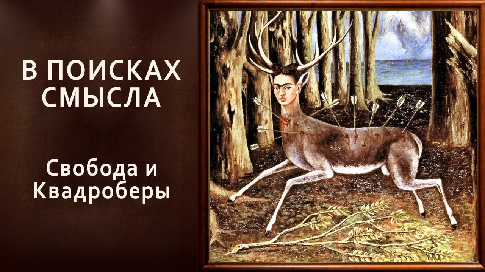

# Свобода и Квадроберы

24 января 2025 [Аудиоверсия](https://paradoks-pinkera-pilotnyy-vypusk.simplecast.com/episodes/freedom-and-quadrobers) 28:58

Природа свободы и её интерпретация в современном обществе.Как индивидуализм и культ самовыражения превращают свободу в иллюзию.
Квадроберы, как современное воплощение философских идей Жан-Жака Руссо.

