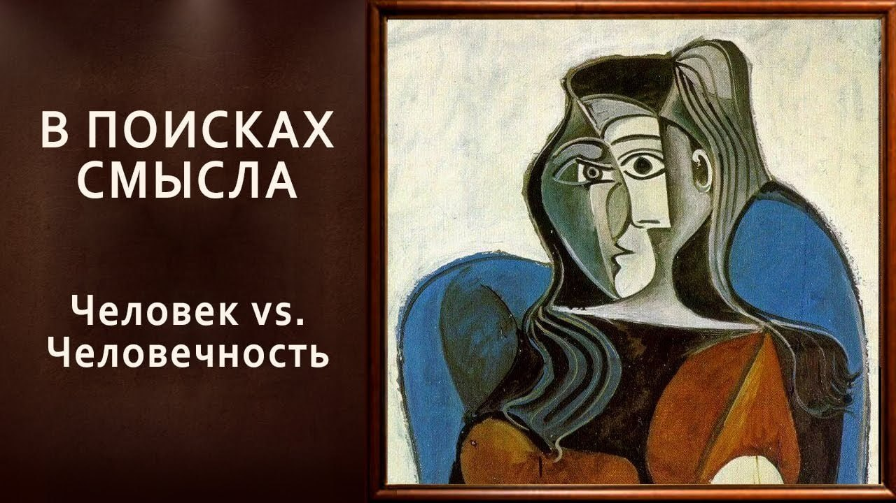

# Человек vs. Человечность

07 февраля 2025 [Аудиоверсия](https://paradoks-pinkera-pilotnyy-vypusk.simplecast.com/episodes/human-vs-humanity) 22:56

Фундаментальный конфликт между универсальной человечностью и индивидуальными различиями людей.
Парадокс: попытки преодолеть дискриминацию через акцент на индивидуальных правах приводят к новым формам разделения и конфликтов. 

**Е.Голуб:**
Здравствуйте, дорогие друзья!
В эфире очередной выпуск подкаста «В поисках смысла».
У микрофона Евгений Голуб...

**П.Щелин:**
... и Павел Щелин.

**Е.Голуб:**
Сегодня мы начнём разговор с продолжения.
На самом деле мы начали говорить до записи, и настолько мне понравился ход наших мыслей, что я решил, что мы будем продолжать этот разговор уже вместе с вами, дорогие слушатели.
О чём идёт речь?

Как вы, наверное, знаете, и если ничего не поменялось, мы записали и уже оформили два выпуска, посвящённых взаимоотношениям или особенностям взаимоотношений мужчин и женщин на этом этапе развития нашей цивилизации или культуры.
В этих отношениях много вызывает удивление или недоумение.
Но вот мы пошли дальше и стали говорить о том, как же так выходит, что, начиная защищать права какой-либо группы и возглавив борьбу за гендерные равенства, за гендерные права, за расовые равенства, мы в итоге приходим к чему-то прямо противоположному.
И тут Павел сказал очень интересную вещь.

**П.Щелин:**
Собственно, что я сказал, звучит она примерно так.

Человечность универсальна, а человек нет.
Почему эта фраза у меня вообще возникла в голове?

Потому что в позапрошлом выпуске мы постулировали то, что первопричиной, скажем так, всех вот этих странностей, происходящих в современном обществе, является условная постановка индивида в центр всех политических, социальных, юридических систем, что воплощено в различных декларациях прав человека, во всех правовых нормах, в которых ключевым субъектом является, собственно, сам человек.
И это базируется, на мой взгляд, на вот той философской ошибке, которую, собственно, я только что сформулировал.

**Е.Голуб:**
То есть ты воспринимаешь этот тезис как ошибочный?
То есть ты так же сказал, что непонятно твое отношение?
То есть это ложный тезис?

**П.Щелин:**
Тезис в том, что я сказал истинный, а вот как раз те, которые писали декларацию прав человека, так не думали.
Поэтому вот у них получилось, как получилось.
Они-то как раз думали, что универсален человек.
Вот, мне кажется, фундаментальное у нас различие.

Давай коротко объясню, что я имею в виду.
Под человечностью я имею в виду нашу с тобой общечеловеческую природу.
Вот ту самую, как кошкость, как собачность, вот человечность.
Вот она, вот общая природа, которая, ну, с точки зрения теологии, образа подобия Божий, с точки зрения Аристотеля, ты можешь назвать это формальной причиной, он тоже формальная причина человека, человеческая душа, так или иначе.
То есть вот это вот это нечто, что действительно является общим между всеми нами людьми.
И вот эта человечность, она действительно является универсальной.
В этом смысле мы действительно все люди.

Но проблема в том, что каждое воплощение этой формы уникальное.
Вот это уникальное воплощение поставлено как некий, повторюсь, универсальный критерий.

Запутал я тебя немного?
Или...

**Е.Голуб:**
Звучит не до конца ясно.
Когда мы говорим о человечности как универсальном принципе, свойстве...

**П.Щелин:**
Форме.

**Е.Голуб:**
Форме.

**П.Щелин:**
Причинности, да, такое.

**Е.Голуб:**
Причинности.
Здесь спорить не о чем.
Вот вторая часть не совсем мне понятна.

**П.Щелин:**
Вот эта человечность каждый раз реализуется в конкретном человеке, который человек конкретен.
У него конкретный пол, язык, цвет кожи и ещё куча разных признаков, которые очень конкретны и не универсальны.

**Е.Голуб:**
Но это, тем не менее, никак не влияет на то, что человек в его индивидуальном проявлении, в полноте своей несёт человечность.

**П.Щелин:**
Правильно.
Но вот эта человечность, она описывает самую важную сторону нашей души, нашего существования.
Но одновременно с точки зрения нашего современного мировоззрения, с нашего социального существования, самые неважные.
Что я имею в виду?

Человечность отвечает за такие вещи, как возможность спасения души, возможность к познанию мира, способность к творчеству, способность к рациональному мышлению.
Она вот за эти вещи отвечает.

Но она не отвечает за то, что, например, мы с равным успехом можем кирпичи носить, или убивать друг друга равным образом.
Более того, человечность даже за рождение не отвечает.
Она даже здесь уже проявляется очень уникальным образом.
Вот о чём речь.
То есть это очень высокий уровень.

**Е.Голуб:**
То есть свойства человеков или способность одного человека рожать другого, зачинать, оно не имеет отношения к человечности как таковой.

**П.Щелин:**
Это уже более частный случай.
Это уже уровень более низкий.
Дальше можно сказать, что человечность в этом контексте делится на мужчинность, женщинность.
Вот эти уже критерии.
Но это уже под человечностью.

**Е.Голуб:**
И когда мы говорим о необходимости уважения и равноправия, мы имеем в виду равноправие в этой человечности.
А то, что ты пытаешься сказать, если я правильно понимаю тебя, это то, что современная культура, назовём это так, чтобы не заниматься опять теорией заговора, торжествующий нарратив упор делает на более низкий уровень дифференциации.

**П.Щелин:**
Где никакой общности на самом деле нет.
Её объективно нет.

**Е.Голуб:**
То есть общий знаменатель в данном случае не замечается или выносится за скобки.
И дальше начинается апеллирование к вот этой разности.
И эта разность становится поводом уже не…
Так как она не может объединять, она как раз и становится поводом и причиной для конфликта и напряжения.

**П.Щелин:**
Да, для политической борьбы.
А политическая борьба — это всегда война.

**Е.Голуб:**
То есть если мы ставим во главу угла человечность, которую нужно ещё всё-таки как-то описать, думаю, что того потенциала, о котором ты упомянул, вот эта человечность, её всё-таки нужно как-то сформулировать иначе.

**П.Щелин:**
Но на мой взгляд, правда, суть человечности — это образ и подобие Божие, что на светском языке будет звучать как, не знаю, совесть и способность к творчеству и к разуму.
Сознание, творчество, разум, совесть.

**Е.Голуб:**
Ну, тебе покажут искусственный интеллект, скажут, смотри, вот тут есть имитация сознания.

**П.Щелин:**
С совестью проблемы будут.

**Е.Голуб:**
Я хочу сказать о другом.
Казалось бы, для того, чтобы добиться декларируемых целей, создания универсальных правил и преодоления какой-либо дискриминации, необходимо подняться на уровень выше и уже базируясь или определившись, или согласившись что такое человечность, остальные признаки снять.
То есть если мы говорим о том, что нас расстраивает проявление расизма, предвзятости, основываясь на каких-то признаках второго уровня, когда мы их снимаем, то тогда не возникают проблемы.

Мы перестаём говорить о цвете кожи, о гендере, о поле, о чём угодно.
Мы говорим, вот перед нами человек.
И это значит, что у этого человека есть свои права.
Тут, мне кажется, я попадаю в ту же ловушку, что и наша культура, нет?

**П.Щелин:**
Попадаешь, потому что как раз очень хорошо, что ты продемонстрировал, как эта мысль начинает ходить по кругу, и вырваться она не может.
Потому что у конкретного человека вот эти все вторичные признаки, которые ты назвал, они для него носят характер, который нестираемый.
В том-то и дело.
Их нельзя стереть.
Вот эти различия будут всегда.
И пытаться их стереть — это значит бороться против природы.
Вот в чём получается ловушка.

Но вместо того, чтобы признать, что настоящее равенство, вот эта зона человечности, она возможна только перед лицом вечности, только в контакте с вечным, только в контакте с трансцендентным.
Условно, она вот про это, а не про исторически социально-культурные имманентные состояния нашего бытия, то есть не про социологию, не про экономику, не про политику.
Вместо этого мы пытаемся выявить квадратуру круга.

**Е.Голуб:**
С точки зрения там трансцендентного, да, я всё понимаю, но я когда выхожу устраиваться на работу, я хочу, чтобы никто не смотрел на то, какого у меня цвета кожа, какого я пола, подхожу ли я по квоте и какого я возраста, извините, а чтобы меня оценивали, исходя из моей способности делать работу.
При чём здесь трансцендентное?

**П.Щелин:**
Ну, потому что ты вот этого хочешь, но это желание, оно не самое очевидное и оно на самом деле не очень реальное.
Потому что в реальности всегда будет система координат, которая будет одним давать привилегии, а другим не давать привилегии.
Это неизбежное состояние, потому что мы разные.
Вот и все.

**Е.Голуб:**
Так, ты оправдываешь такое разное отношение?

**П.Щелин:**
Я его не оправдываю.
У тебя очень интересная постановка вопроса, смотри, тоже мысль пошла.
Оправдание.

Вот помнишь, оправдание, это значит, я просто говорю, что оно так есть.
Ну вот мы с тобой обсуждали на камере то, что есть объективные различия, да?
На одну и ту же работу, условно говоря, в зависимости от той или иной половозрастной принадлежности, реально, по-разному оно проявляется.
Особенно, когда дело доходит, в частности, до силовых структур.
Вот мы с тобой обсуждали до камеров. (???)
Поэтому хочешь, не хочешь, а сколько бы, условно говоря, дама не хотела, чтобы к ней было равное отношение в армии, оно там не может быть по определению, потому что такова его природа.
Понимаешь?

**Е.Голуб:**
Ну, допустим.
Видишь, сейчас мы с тобой начнем блуждать в частностях, но все же таки, когда мы говорим не об очень специфических работах, связанных с требованием к физической форме или способности нести нагрузку, а когда мы говорим о обычном офисном делании.

**П.Щелин:**
Ну вот это обычное офисное делание, оно тоже необычное, оно тоже возникает в конкретно исторических условиях, в конкретных обществах.
Например, если ты меня спросишь, являются ли при приеме на работу не только экономические факторы, играющими роль, да, они всю историю являются.
Например, сообщество может выбрать пожертвовать определенной долей материального благополучия, чтобы сохранить свою определенную гомогенность.

Условно говоря, труд бесправного раба дешевле по экономическим причинам, чем труд свободного гражданина.
Но мы выбираем платить больше свободному гражданину, чтобы сохранить ту политическую систему, которую мы считаем добродетельной.

**Е.Голуб:**
Вот как интересно.
Я не думал об этом с этой точки зрения.

**П.Щелин:**
А так, допустим, бесправный раб, которому можно платить миску риса, гораздо лучше с экономического, профитного зрения сделает эту работу.

**Е.Голуб:**
Ну то есть могут быть иные основания для того, что сейчас принято называть дискриминацией.
То есть вот это вот равенство, оно возведённое в абсолют как добродетель, на самом деле сомнительное.
Ты это хочешь сказать?

**П.Щелин:**
Не просто оно сомнительное, оно невозможно.
На практике оно никогда не происходит.
Борясь против одной системы дискриминации, неизбежно создаётся другая система дискриминации, потому что человек движим, например, вот как это в Евангелии, «не хлебом единым жив человек».
То есть даже при работе с экономическими вопросами у тебя другие факторы неизбежно вмешиваются в принятие решений.

**Е.Голуб:**
Но я тебя сведу опять на землю.
Вот банальный практический случай.
Женщина 25-30 лет устраивается на работу.
И всем интересно узнать, не обременённым всех разного рода запретами, а есть ли у неё дети, собирается ли она рожать.
И дальше могут под разными предлогами, узнав, что, в общем, этот статус у неё ещё не определён, значит, существуют риски потерять этого человека в декретном отпуске и так далее, её заворачивают.
Как кандидат она чувствует себя дискриминированной.

**П.Щелин:**
Ну смотри, это её дискриминация не по отношению к работодателю, на самом деле, а по отношению к своей собственной природе.
Потому что по своей природе эти вопросы имеют более чем разумное основание.
Это то равенство, которое невозможно.

И с точки зрения общества вопрос о том женщине в период с 20 до 30, что более ценно для социальной структуры в целом, чтобы она проработала эти 10 лет помощником юриста, или чтобы она стала матерью двух-трех детей, понимаешь?
Опять, не экономические факторы.

**Е.Голуб:**
Да, но речь не о том, что общество говорит: дорогая, вот тебе денежка, будем за тебя платить, а ты, пожалуйста, рожай.
Оно говорит, нет-нет, мы тебя на работу не возьмём, а ты, пожалуйста, как-то решай свои задачи личной жизни, неизвестно как.
Обеспечивай себя.

**П.Щелин:**
А вот это уже структура, ты опять описываешь все те неизбежные тупики, которые возникают, как только ты встал на индивида из вакуума, как первую структуру анализа.
Вопрос, где семья вообще здесь в этой картине мира, которую ты описал?

**Е.Голуб:**
Ой, Павел, набросятся на тебя и разоруют на части.
Настолько мы уже, привыкли, я сам привык.
Вот я сейчас с тобой разговариваю, думаю, ну как-то это вообще ересь такая же, да?
Дикость!
Ну как же свободную, так сказать, независимую женщину принуждать к семье, если ей нравится развиваться в профессиональном смысле?
Что это за домострой?

**П.Щелин:**
Понимаешь, если ей реально нравится.
И она действительно готова принести эту глобальную жертву, то есть пожертвовать своей семьей ради своей профессиональной самореализации.
Такие примеры в истории, кстати, были довольно часто, в том числе в традиционном обществе, просто чаще всего эти женщины в монастырь уходили.

Например, знаменитая Хельденгарда Бингенская, одна из крупнейших ученых своего времени, автор вот этих религиозных научных трактатов, по-моему, X или IX век в Западной Европе.
Но будьте честны со своим выбором.
Вот и всё.

**Е.Голуб:**
Подожди, подожди.
Ты сейчас опять уводишь в сторону.
Я превращаюсь сейчас в женщину 25-30 лет, мысленно.
Вот я закончила университет, получила образование, но не сложилось у меня.

**П.Щелин:**
Зачем вы это сделали?

**Е.Голуб:**
Мне хочется самореализации, мне хочется в этом мире себя как-то проявить, что я что-то значу, что у меня только детей и рожать, и от кого?
Мужиков сейчас, извините, ответственных нет и так далее.
Но здесь, если я начинаю рассуждать так, то я могу, став на то, мы получаем явление в комплексе.
То есть из-за того, что разрушена семья, разрушены отношения в этих базовых основаниях общества, вот этот освобождённый радикал женский, выходя, так сказать, на вот этот свежий ветер жизни, получает все вот эти проблемы как следствие.

**П.Щелин:**
Ну, как это, сам справился, да.
Реально.

**Е.Голуб:**
Ты понимаешь, просто это то, о чём я говорил, что начиная, скажем так, создавать условия для решения одной проблемы, мы создаём комплекс проблем и вступаем уже в борьбу с ними.

**П.Щелин:**
Ну вот это, понимаешь, это всё иллюстрация вот десятого псалма, "когда разрушены основания, что сотворит праведник".
Или по-простому поздно пить боржоми, когда почки отвалились.
Или ошибка в первом принципе порождает логарифмический рост ошибок в дальнейшем.
Вот это всё из этой области.

**Е.Голуб:**
Так что если я, например, родилась женщиной, так что у меня, по словам Павла, только два пути.
Либо семья и дети, либо монастырь, или что?

**П.Щелин:**
Ну, монастырь в кавычках в данный момент.
Вы можете выбрать форму своей карьерной самореализации служения, но вы должны честно отдавать себе отчёт, что это не буфет, в котором можно всё.

Ну, может быть, если вы очень богатый, вам можно все.
Тут есть, знаешь, фактор то, что...
Это, кстати, интересный социологический феномен, называется luxury beliefs.

Ну, например, если вы зарабатываете 3 миллиона долларов, вы настолько крутой специалист, и вы можете заставить на себя работать, условно, еще 20 женщин и мужиков, которые там будут детей воспитывать вашими гувернантками и прочим-прочим-прочим, то, возможно, вам удастся и рыбку съесть, и выполнить две вещи.
Но в базовом сценарии, да, это взаимоисключающие выборы.
Вы просто должны честно себе сказать, какой выбор вы делаете.

Служение и самореализация через профессию, причем вам же, скорее всего, захотится это что-то, чтобы это было на таком большом, высоком уровне, а это путь, он и в нормальных условиях для меньшинства всегда, в том числе для мужиков и прочего, либо через семейную реализацию.
Но то, что можно все и сразу, как это, знаешь, максимум, чтобы у нас все было, и чтобы нам за это ничего не было, вот это не работает.
Но ни у кого не работает.

**Е.Голуб:**
Но мы начали с того, что, с одной стороны, как мы говорили, общество подозревает женщину в том, что она хочет и то, и другое, и поэтому отказывает ей в возможности профессиональной самореализации.
А с другой стороны мы говорим о том, что, в общем-то, то же самое общество пытается лицемерно сделать вид, что это вообще, говоря, неправильно и нездорово, и давайте-ка мы...

**П.Щелин:**
Давай, конечно, прямо скажем, что мы не обвиняем никаких, не то, что не обвиняем, вообще это не наша цель кого-то конкретного, это все следствие общей нездоровой системы.
Разумеется, позиция общества, которая тоже, она, по сути, говорит о том, что нормальная семья должна обладать доходом двух работающих людей, и у нас вся экономическая, социальная, городская, инфраструктурная политика рассчитана на это, но при этом, пожалуйста, еще рождайте, конечно же, это же шизофрения полная.

То есть с каких это пор базовой, скажем так, моделью семьи стало два работающих взрослых человека?
Это относительно же недавний феномен, если так задуматься.

**Е.Голуб:**
Ну, я знаю, что в Штатах еще до 60-х годов, в общем-то, работающая женщина — это какое-то горе в семье, да?

**П.Щелин:**
Ну, не то, что горе в семье.
Это как раз именно было такое исключение.
То есть это было исключение.
То есть если она какая-то действительно там суперталантливая, то она действительно могла там добиться, пробиться и прочее.

Но в целом, да, оно было тупо не нужно.
Понимаешь, вот же одна хитрая обманка-то в чем?
Обманка в том, что мужчинам платили достаточно, чтобы семью содержать.
А теперь после выхода женщин на работу массово, в итоге платить стали меньше всем.

**Е.Голуб:**
Почему?

**П.Щелин:**
Ну, потому что у тебя рынок труда увеличился в два раза.

**Е.Голуб:**
Слушай, не приходило мне в голову, интересные повороты нашего разговора, но то, что мы начали этот сезон и пытаемся всё это время разговаривать о том привычном лукавстве, которое мы не замечаем, которое нас окружает.
И вот сейчас мы, получается, пришли к тому, что весь разговор о борьбе за права, какие бы они ни были, неминуемо приходит к...
Если начинать логично рассуждать, то мы приходим к тому, что весь этот разговор бессмысленный, потому что сам в себя упирается и сам себя отрицает.

**П.Щелин:**
Он бессмысленен, пока мы не начинаем говорить о наших самых фундаментальных основаниях и о наших самых фундаментальных целях.
Условно говоря, ключевой вопрос — какая ваша цель?

Лицемерно, например, пытаться поднять рождаемость, сохраняя базовым институтом общества вот этого радикального, атомизированного индивида, а капитализм и рост ВВП как главный приоритет.

**Е.Голуб:**
Да, абсурд, абсурд, да.

**П.Щелин:**
Это абсурд, конечно, да, полный.

**Е.Голуб:**
Ты знаешь, вот мне кажется, в заключение мы приходим с тобой к вот этому важному выводу.
Речь не идет о том, что воспевается потребительство и потребление необходимо для устойчивого развития капитализма.
Нет, оно вполне может сосуществовать с семьей и многочадием.
Дело именно в атомизации.
Именно атомизация и концентрация на самом себе, на своём эго, приводит к тому, что рожать детей незачем.

**П.Щелин:**
Да, абсолютно.
И повторюсь, это очень лицемерно.
Если для вас главное, условно, это деньги, как показатель общественного, скажем так, развития, то бессмысленно пытаться объяснить людям, что есть что-то другое важное помимо них.

**Е.Голуб:**
Возникает ещё одна тема, к которой мы с тобой приходим по кругу, что это какая-то суицидальная, в общем-то, тенденция.
С одной стороны, мы начинаем ахать, что как же так, общество стареет, и кто же будет содержать всех этих стареющих граждан?
А с другой стороны, все построено на то, чтобы лишить человека стимула.

**П.Щелин:**
Максимизировать прибыль из каждого человека в каждый момент времени.
Вот оно что построено.

А семья — это принципиально не про каждый момент времени, это про жизнь.
Понятно, что она по своей природе этому противоречит.
И понятно, что когда у тебя в почву влит яд, условно, вот этого радикального индивидуализма, как стартового инструмента анализа, то вырастают только разные поломанные формы на этом.
И винить их в этом сложно.
То есть люди пытаются адаптироваться, то есть, условно, деревья пытаются адаптироваться к этой поломанной, зараженной ядом радиации почве, как могут.
Ну, в итоге, можете посмотреть, как выглядит радиоактивный лес.

**Е.Голуб:**
Слушай, ну так пока выходит, что куда ни кинь, всюду какая-то ерунда.
То есть во всех проявлениях современной цивилизации и культуры видна её извращённая основа.

**П.Щелин:**
Смотри, вот я сегодня проводил занятие, пришли в конце к выводу в вопросах и ответах ровно об этом же.
То есть чем же наша эпоха действительно отличается от предыдущих?

Вот единственный вывод, к которому мы пришли, то, что её единственное фундаментальное отличие именно в том, что более лживой эпохи не было.
Вот эпохи, в которой ложь во всём, эпоха, в которой ложь возведена в добродетель до такой степени, и она настолько обволакивающая, что куда ни кинь пробиться к основаниям практически невозможно, вот такой эпохи не было.
Вот в этом плане мы действительно достигли выдающегося результата нашей цивилизации.

**Е.Голуб:**
Ну это ровно то, о чём мы говорили с тобой в нашем первом выпуске, и это именно то, о чём мне хотелось говорить с тобой, хотя я не ожидал таких интересных поворотов.
То есть я не видел в борьбе за равноправие той порции лжи, которая мне видна, например, в других проявлениях современной жизни.
А так получается, что порассуждав с тобой немного, убеждаешься, что и это лукавство.

**П.Щелин:**
Конечно, оно лукавство, потому что в основе лежит ложь, потому что нигде нет вот этого фундаментального объекта, голого человека, его нигде нет.
Самое простое, ты всегда рождаешься в конкретной семье, в конкретной стране, с конкретными способностями, с конкретным полом, с конкретным языком и прочее, прочее, прочее.
Это все не случайно.
В опыте это от тебя неотделимо.

А у нас вся цивилизация построена на том, что рождается вот атом.
Понятно, что у тебя ничего не вырастет нормальное, если у тебя это базовая посылка.
То есть этого просто нету.
Нету этого атомарного индивида.
Его не существует.

**Е.Голуб:**
То есть ты знаешь, я к чему пришел, что вот в голове крутится слово diversity, многообразие.
А ведь на самом деле не о многообразии идет речь.
О стирании многообразия, о приведении всех вот этих кривеньких и косеньких проявлений человечности в какое-то одно стёртое, безликое, какую-то куколку серенькую.
И это всё под флагом многообразия.
Нет-нет, наоборот.
Слушай, это интересно, такой парадокс.

**П.Щелин:**
То есть идеал — это такое вот бесполое, говорящее везде на одном языке, безверное, верящее все одинаково в одно и то же, причем такое невысокого порядка, вот что-нибудь типа за деньги, да, про бабло вот такое.
Ну вот да, вот оно такое.
Ну такой трансгендер, не случайный символ.

**Е.Голуб:**
Да, ну что ж, я думаю, что на сегодня, может быть, и хватит нам рассуждений.
Честно скажу, что неожиданный поворот принял наш разговор.
И, может быть, именно поэтому он получился немного таким рваным.

Надеюсь, что нашим слушателям будет интересно следить за развитием наших мыслей.
И вы сможете, дорогие слушатели, предложить нам, может быть, более точные, ёмкие, красивые формулировки того, о чём, в частности, я пытался рассуждать во время нашей сегодняшней встречи.

Спасибо, Павел.

**П.Щелин:**
Тебе спасибо, Женя.
Думаю, мы будем продолжать.
О чем дальше хочется поговорить.
Все-таки что с этим делать?

Потому что первая реакция, она тоже, скорее всего, будет неверной.
Я пытался об этом говорить в предыдущем выпуске, но есть еще очень много чего об этом сказать.

**Е.Голуб:**
Самое интересное, обличителей-то много.
А делать-то что?

**П.Щелин:**
Ну, вот давай попробуем порассуждать сначала, как оно, дать небольшой прогноз, как оно будет, почему оно будет, а потом на этом дне дантовского ада попробуем поискать выход.
Вот примерно так.
