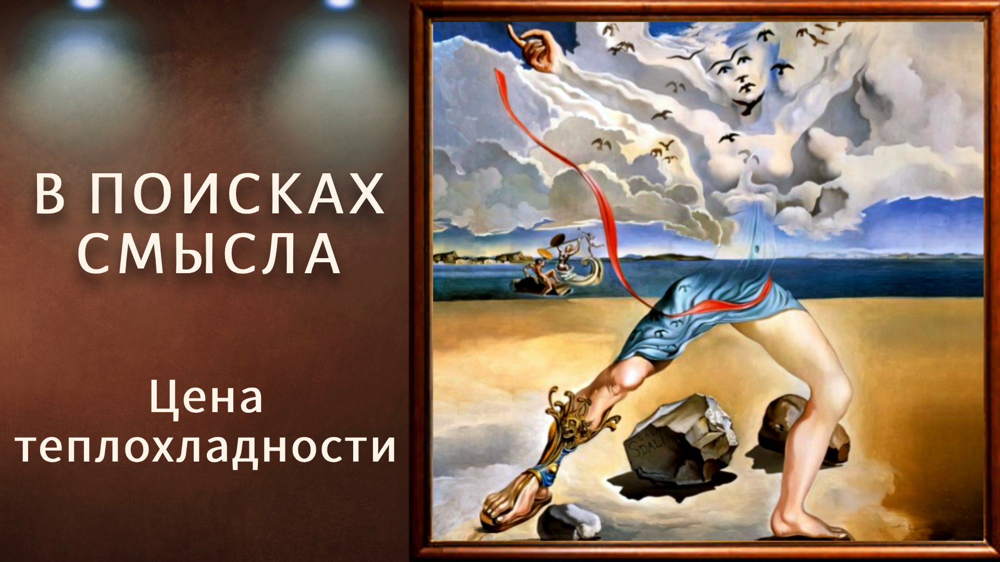

# Цена теплохладности.

08 мая 2025 [Аудиоверсия](https://paradoks-pinkera-pilotnyy-vypusk.simplecast.com/episodes/lukewarm) 31:49

Размышляем о природе "неукоренённости" убеждений современного человека, феномене постмодернистской толерантности и цене, которую общество платит за отказ от подлинной убеждённости.
Почему искренность воспринимается как угроза?
Можно ли быть верующим "несерьёзно"?
И что мы теряем, пряча истину ради иллюзии комфорта?



**Е.Голуб:**
Здравствуйте, дорогие друзья!
В эфире очередной выпуск четвёртого сезона подкаста «В поисках смысла» у микрофона Евгений Голуб.

**П.Щелин:**
И Павел Щелин, по-прежнему.

**Е.Голуб:**
Сегодня у нас будут размышления на тему одной из особенностей, характеристики нашего времени, которая недавно пришла мне в голову во время обсуждения особенностей постмодернистского взгляда на вещи.
Как вот эта парадигма постмодернизма, или я даже не знаю.
У постмодернизма же, Павел, нет никакой парадигмы?

**П.Щелин:**
Его парадигма в отсутствии парадигмы.

**Е.Голуб:**
Одно из свойств, как мне кажется, я хочу здесь тебя попросить поразмышлять вместе со мной, это укоренившаяся неукоренённость мировоззренческая.
Сейчас человек, придерживающийся последовательно каких-либо взглядов, или же просто искренне верующий человек, это редкость.
И вообще, мне кажется, что сейчас намного сложнее человеку для себя принять такую возможность преданности в вере, последовательности в вере, стойкости в вере.
Всё как будто не всерьёз.
Что ты думаешь?

**П.Щелин:**
Первое, приходит в голову переинтерпретировать твоё наблюдение в то, что в строгом смысле действительно мы живём в очень интересную эпоху.
Сейчас чуть-чуть меньше, но на самом деле примерно так же.
Когда любой человек с серьёзными убеждениями интуитивно воспринимается как угроза для некого удобного порядка жизни.
И здесь даже неважно, какие убеждения.

Условно говоря, убеждённый мусульманин так же опасен, как убеждённый христианин.
Убеждённый христианин так же опасен, как убеждённый либерал.
Убеждённый либерал так же опасен, как убеждённый социалист и так далее и тому подобное.

В принципе, проблема, что человек с убеждениями, который искренне верит своему богу или служит своему богу или идолу, воспринимается окружающим миром, как минимум с опаской.
Вот это, я бы сказал, наверное, то наблюдение, которое ты преподносишь.

**Е.Голуб:**
Ты совершенно прав.
Можно посмотреть и под этим углом, если так удобней.
Современный мир, декларирующий высокие гуманистические ценности, поставил во голову угла терпимость и толерантность.
Тем самым любое искреннее убеждение, последовательная позиция, несет этому спокойствию угрозу.

**П.Щелин:**
Ну да, но и здесь получается парадокс в том, что провозгласив толерантность как некую самоценность, этот мир является предельно нетолерантен к любой искренности.

**Е.Голуб:**
Что ж мы поставим во голову угла?
Как это определить?

**П.Щелин:**
Верьте во что угодно, только не всерьез.
Вы можете как угодно развлекаться, вы можете как угодно заполнять вот эту некую пустоту в своей душе.
Не знаю, хотите, ходите там эльфами, бегайте по лесу, хотите в джедаев рядитесь, хотите в церковь на Пасху ходите.
Неважно абсолютно.
Главное то, чтобы это не всерьез.
Главное то, что вы не претендовали на реальные главные божества нашего культа, о которых мы вам никогда не скажем, но вокруг которых конструируется вся основная наша власть.

**Е.Голуб:**
Понимаешь, я пытаюсь сказать, что это не какой-то заговор, да?

**П.Щелин:**
Это вообще никакой не заговор, нет.

**Е.Голуб:**
Это какое-то изменение свойства человеческого, какое-то изменение его природы.

**П.Щелин:**
Я не готов согласиться с тем, что это изменение природы, изменение природы — это слишком фундаментальное понятие.
Но это некое изменение мировоззрения, и мне кажется, мы много раз говорили, одна из глубинных причин такого состояния заключается в том, что искренность действительно радикальна.
Помнишь, как в Евангелии пишется

```
Ибо кто не собирает со мной, тот расточает со мной.
И я пришел, не мир принес я, а меч.
Я пришел разделить отца и сына, жену и невестку, мужа с супругой
```

и так далее и тому подобное.
То есть любая искренность, любая живая вера, она с одной стороны является источником объединения и созидания, но с другой стороны именно поэтому она является источником разделения.
Это всегда обоюдоострый меч.
И на пути этого обоюдоострого меча возникают предельные вопросы, возникают предельные выборы, и в предельных выборах есть предельная цена.
Эта цена исторически очень велика.
И вот одно из, мне кажется, скрытых желаний, которое стоит за постмодернизмом, это избежать, как бы избежать необходимости отвечать на эти вопросы, вывести их за скобки.

Но обратным эффектом такого становится, что тебе необходимо поддерживать вот эту иллюзию.
В коммунистической литературе это состояние называется мещанством.
То есть все должны быть мещанами.

Или то, что вот уже забыл какой автор, но он писал об этом как об "амор лоце", то есть любовь к месту, любовь к имманентному.
То есть ты должен, тогда необходимо тебе любую трансцендентность вынести за скобки, то есть любое божественное, любое священное, любое самое важное вынести за скобки, потому что иначе оно сразу начнет каким-то образом организовывать пространство вокруг себя, организовывать людей вокруг себя, а это будет нарушать то самое статус-кво.

**Е.Голуб:**
Ну давай я попробую побыть адвокатом дьявола или адвокатом либерала.

Послушайте, — скажет либерал, — Павел, но вы же понимаете, что если допустить, пропустить или потворствовать какому-то фанатичному учению, которое, как вот сейчас видится ислам, стремится распространиться как можно шире, то это неминуемо ведет к конфликтам.
Что же получается?

Что с одной стороны, у человека есть присущие ему потребности в больших смыслах или в большом смысле, наверное, даже так.
Этот поиск ведет, должен вести, по идее, к принятию или присоединению или появлению какого-то убеждения, основанного на чем-либо, на вере, на учении.
И тут же это ставит человека в оппозицию к тем, кто такое учение или веру не разделяет.
Большей или меньшей степени это оппозиция.
Или, как ты сказал, эта идея начинает организовывать вокруг себя пространство и людей.

Но, если это общество нацелено на такое принятие, то получается, что любой, кто убежден, становится ему враждебен.
А если этого сопротивления в обществе нет, то тогда возникают конфликты и деструктивные какие-то мотивы.
И как из этой дихотомии выходить?

Либо всех равномерно сделать сторонниками одного учения или одной веры, что мы наблюдаем с XVI века, попытку.
И эта попытка, как я понимаю, отчасти и вызвана пониманием государей того, что царство разделённоео в себе, падёт.
Вот они это единство пытались поддерживать с помощью насилия.

**П.Щелин:**
На мой взгляд, вот то, что ты описываешь, это почему-то хочется сказать по-английски inescapable tragedy of human condition, то есть неизбежная трагичность человеческого бытия.
Вот этот конфликт вокруг вопроса об истине — это фундаментальный человеческий конфликт.
Любые попытки сделать вид, что этого конфликта нет, не могут достигнуть цели искоренения этого конфликта.
Максимум, они могут ввести общество в состоянии вот этой бесконечной анестезии, бесконечной теплохладности, но внутри него будут господствовать процессы саморазрушения, которые мы с тобой, собственно, обсуждаем из раза в раз.
При этом абсолютно честно здесь нужно, мне кажется, отказаться от вот этой логики благостеньки, сказать о том, что возможно дебатирование вопроса об истине бесконфликтное.
Нет, невозможно.

**Е.Голуб:**
То есть ты считаешь, что невозможно бесконфликтно?

**П.Щелин:**
В пределе нет.
Ну, можно поместить человека в специальное пространство академического дебата, и это как бы конфликт, который идет по очень жестким правилам, война идет за аудиторию, но в целом исторически конечно нет.
Движение большого исторического субъекта — это движение вокруг некой идеи, вокруг некого понимания предельных вопросов, вокруг некой этической системы, и оно, разумеется, взаимоисключающее от другой этической системы.
Внутри одной целостности у тебя не могут быть принципиально разные ответы на вопросы, что такое хорошо, что такое плохо.

**Е.Голуб:**
Я понимаю, что ты говоришь, но во мне все протестует.
Что мы сразу представляем себе конкистадоров, да?

**П.Щелин:**
Да, конкистадоры.

**Е.Голуб:**
Миллионы погибших, разрушенные культуры, уничтоженные языки.

**П.Щелин:**
Те культуры, куда пришли конкистадоры, занимались истреблением других окружающих культур в своем, скажем так, религиозном культе.
Ацтеки, майя, человеческие жертвоприношения, инки, все как надо.
Это естественный исторический процесс.

У тебя нет ни одного примера в истории, где возможно полное вот это бесконфликтностное и благостненькое состояние, ибо кто не собирает тот разрушает.
Если ты не играешь в эту игру, то в эту игру играют другие субъекты.
Трагедия в том, что даже отказавшись от вот этой предельной борьбы, другие-то от нее не откажутся.
То есть ты просто становишься объектом на пути других игр.

**Е.Голуб:**
Все протестует во мне, ну потому что я искренне убежден, что вот этот джихад, вот эта борьба, она должна быть направлена внутрь.
И слова о том, что спасись сам, и вокруг тебя спасутся тысячи, или там смирись сам, покажи пример собой, мне кажется, бесконфликтный.

**П.Щелин:**
Ты здесь просто не делаешь достаточный шаг.

Нет, во-первых, это не бесконфликтный способ.
Человек, который начинает смиряться сам, вокруг него начинают сразу происходить очень большие события, и очень часто, ну это я видел во многих приходах, все равно начинаются конфликты.
Происходит разделение, может быть, на семейном уровне, но его жизнь меняется очень сильно.
Там конфликт происходит.

**Е.Голуб:**
Ну это не насильственное навязывание какого-либо взгляда.
Это некоторое следствие изменения поведения или образа жизни, конкретного человека, который может вступать в противоречие с другими.

**П.Щелин:**
И вот это первый шаг.
У тебя возникает противоречие.
Если ты будешь общаться с родственниками, знаешь, это классическая шутка, когда в семье появляются верующие, начинают страдать все его окружающие, да?
Но с их точки зрения это совсем не бесконфликтное, мягко говоря, состояние.

**Е.Голуб:**
Но это издержки неофитства.

**П.Щелин:**
Без издержек неофитства в пределе есть, ну очень часто и семья распадается и прочее.
Ну потому что нельзя молиться, когда члены семьи в конечном итоге в пределе молятся разным богам, то там либо один в конечном итоге отказывается от своей веры, либо пути начинают расходиться.
То есть это всегда динамические процессы, всегда динамическое равновесие.
Но дальше ты можешь смотреть.

У тебя, предположим, возникает культура, которая, допустим, возьмешь культуру, как она зарождалась в Римской империи.
Вроде бы люди занимаются исключительно изменением самих себя.
Выполняют все государственные обязательства лучше, чем римляне, собственно так.
Если ты будешь читать тексты того периода, то христиане говорят, мы вообще-то лучшие римляне, чем вы все римляне.
В армии служим, налоги платим, все делаем, как надо.
Никаких претензий к нам, как к гражданам вы выдвинуть не можете.

Вся единственная разница, что мы не молимся тому богу-императору, мы не приносим ему жертвы, которые приносите вы.
И вот у тебя вот уже здесь возникает радикальный конфликт.
Ты сам прекрасно знаешь, чем эта история заканчивается.

**Е.Голуб:**
Да я понимаю, конечно, что для римлян это был, скажем так, не очень значимый жест лояльности государству и императору.

**П.Щелин:**
Так и любая целостность построена на такой лояльности.
В конечном итоге в любой целостности есть иерархия самого важного, которой эта целостность должна приносить жертву.
И если ты отказываешься в рамках этой целостности приносить жертву самому важному, ты вступаешь в конфликт с этой целостностью, даже если ты там с мечом не бегаешь.

**Е.Голуб:**
Нет, но конфликты конфликту рознь, понимаешь?
Мне глубоко отвратителен любой фанатизм, а ты говоришь о том, что это неизбежные издержки следования некоторой идее, некоторому идеалу.

**П.Щелин:**
Ну потому что любая идея, претендующая на истину, она является универсальной по своей природе.

**Е.Голуб:**
Подожди, она не является универсальной, она претендует на универсальность.

**П.Щелин:**
Уявляется универсальной по своей природе в том смысле то, что она не говорит о том, что это как бы правдиво только для нас, а для вас оно неправдиво.
Это как раз релятивизм.
Любая идея подобного характера претендует, что она истинна, точка.

**Е.Голуб:**
Ведь есть вот такие идеи типа национализма, да, которые не претендуют на универсальность.
Она действует как универсальная или определяющая для строго определенного количества людей.

**П.Щелин:**
Просто давай подчеркнем, она не претендует на всемирность в этом смысле, но она очень претендует на свою универсальность в рамках этой целостности.

**Е.Голуб:**
Да, в рамках этой целостности.
Итак, что же нам делать?

Ты часто об этом говоришь, и у меня, как у многих, кто тебя слушает, это тоже вызывает внутреннее возмущение, о том, что конфликты и войны неизбежны, в том числе потому, что истина одна.
Если ты всерьёз стремишься к истине, ты не можешь останавливаться.
Но с другой стороны, вот я то, что думаю вслух, как получается.
Ведь христианская истина, она же, на мой взгляд, совершенно не подразумевает насильственное навязывание.
И все случаи, когда это происходило, это было в интересах государств, в интересах других, так сказать, сущностей, не имеющих отношения ко Христу, я бы так сказал.

**П.Щелин:**
Можно построить аргумент, что она не предразумевает агрессивного навязывания, но она является агрессивной.
Христианство — это очень агрессивная религия.
Самим фактом самого бытия, своего свидетельства, акт мученичества за веру — это очень агрессивный акт.
Он очень сильно нарушает статус-кво.
Появление святого, условно говоря, посреди сборища людей, которые не святые, очень сильно агрессивный по отношению к этим людям акт.

**Е.Голуб:**
Подожди, ну давай со словами разберёмся.
Ну всё-таки это скорее не агрессивный, а деструктивный.
Ну агрессия всегда направлена на другого с навязыванием.
А святой человек, он просто своим образом жизни вызывает у других дискомфорт и их раздражает.
Разве это можно агрессией назвать?

**П.Щелин:**
Это можно назвать агрессией, потому что агрессия, на мой взгляд, это понятие очень опошленное, особенно после Второй мировой войны и современным психологическим дискурсом.
Поэтому у нас его понимание очень такое, знаешь, демонизированное, что ли.
Одновременно демонизированное, одновременно опошленное.
Но в строгом смысле любое вторжение, намеренное, в некое пространство, является агрессивным актом.

**Е.Голуб:**
Ты становишься на позиции вот этих woke-людей, которые видят агрессию в том, что ты не используешь нужное местоимение.
И тебя нужно канселить и так далее.

**П.Щелин:**
Нет, вот здесь в чём разница?

Моя позиция в том, что агрессия — это естественное состояние.
В отличие от woke-людей, которые хотят всех защитить от агрессии, я считаю то, что мы обречены на свидетельство.
Я считаю, что самый агрессивный акт — это, собственно, свидетельство о чём-либо по-настоящему.
И поскольку мы обречены на свидетельство о том, во что мы верим своей собственной жизнью, мы как бы постоянно агрессируем друг против друга.

Просто вопрос в том, что дальше ты можешь поднять, что вот агрессия ради агрессии — это уже ошибка.
Да, это ошибка.
Но попытка представить возможность вот этого, знаешь, такого мягкого, пухленького, розовенького бытия, оно не работает.
Помнишь сцену из Апокалипсиса, да?

То, что Христос, когда он является Саану, у него изо рта исходит меч.
Почему?
Потому что слово — это меч.
Акт говорения — это акт войны.
Есть прямая связь между актом говорения и актом войны.
Когда ты говоришь, ты свидетельствуешь о том, о чём ты говоришь.
И это акт агрессивный.
Нравится это или нет.
Да, это не классическое наше понимание.
В этом смысле, в этой части даже вот эти страшные woke делают правильное наблюдение, но дальше они делают из него неправильный вывод.

То есть они ставят нереализуемую задачу — давайте создадим идеальное безопасное пространство.
Но идеальное безопасное пространство возможно только на кладбище.

**Е.Голуб:**
Они на самом деле проявляют гораздо больше прямой агрессии в попытке создать безопасное пространство.

**П.Щелин:**
Ну, конечно.
Потому что их идол вот этот безопасности, они начинают его агрессивно, о нём свидетельствовать и агрессивно продлевать.
Повторюсь, нету способа...
Вот мне сейчас нравится, что мы с тобой хорошо ходим по кругу, потому что ты очень классно сейчас занимаешься стил-мен, то есть усиливание позиции вот как раз той нашей любимой модерновой логики.
Давайте вынесем все предельные вопросы за скобки.

**Е.Голуб:**
Ну, потому что я становлюсь на позицию моего любимого обывателя, который говорит, ребята, ну как бы в этот квартал, пусть мусульмане там живут, а здесь пусть христиане.
А вот тут мы все торгуем, и всем хорошо, и детки бегают счастливые, и никто никого не убивает и не грабит.
Ну зачем вот это вот всё, говорит, мой любимый обыватель, и что ты ему скажешь?
Что через 3-4 поколения твои внуки будут вешаться от безысходности или что?

**П.Щелин:**
Не, ну два варианта.
Либо они будут вешаться от безысходности, либо они станут либо в данном контексте там либо христианами, либо мусульманами вот в твоём воображаемом квартале.

Это всегда некое равновесие, динамическое, и на мой взгляд это равновесие, ну вот, некого духа, да, то есть, условно говоря, насколько живая вера то, во что ты веришь.
Ну, условно говоря, если в этом конкретном городе мусульмане верят в Аллаха, искренне, а христиане занимаются имитацией, на длинной дистанции побеждают мусульмане.
Если наоборот, на длинной дистанции побеждают христиане.
Даже если ты уберёшь из этого вопрос прямого насилия, конфликтность никуда не денется.

**Е.Голуб:**
Ну, давай заменим слово конфликтность противоречием.
Противоречие может вести к насилию и конфликту, а может быть снято каким-либо способом, пусть на время.

**П.Щелин:**
Оно не может быть решено на уровне противоречия, и может быть снято исключительно нечто, что выпрыгивает за эту мерность.
Ну, допустим, на уровне этого города, мы выходим за пространственное измерение этого города в пространство страны, где есть государь с армией, который любую конфликтность остановит появлением отряда солдат.

**Е.Голуб:**
Ты говоришь о том, что в долгой перспективе это неминуемо будет иметь свою цену.

**П.Щелин:**
Конечно.

**Е.Голуб:**
То есть в этом поколении может казаться, что все отлично, но по мере того, как ситуация будет развиваться, что та сторона, которая выберет скажем так, вот эту терпимость или миролюбивость или способность примиряться, вот я подыскиваю слова с разными версиями трактовки истины, та, которая допустит другую истину или не единственность истины.

**П.Щелин:**
Рано или поздно будет поглощена этой самой истиной.

**Е.Голуб:**
Ну, как-то грустно, ты понимаешь?
Видишь, я все-таки по понятным причинам, у меня вот укорененность такого желания соблюсти какой-то баланс, дать слово всем, возможность и любопытство к другому.
А ты, получается, такой как танк.

**П.Щелин:**
Нет, я очень любопытен к другому.
Я исхожу из того, что есть противоречия, которые неснимаемы.
И в каком-то смысле, ты знаешь, достойный враг в данном контексте гораздо более уважителен и гораздо большего заслуживает уважения, чем вот теплохладное некое состояние.
Я вот поднимая тему, снова и снова процитирую тебе своего любимого Данте, именно вторую его песню «Ада».
Там пространство перед адом, и там вот такое болото и очень грустное место.
Это еще не ад, это такой предбанник перед адом.
Там вот такое состояние.

```
Дав руку мне, чтоб я не знал сомнений,
И обернув ко мне спокойный лик,
Он ввел меня в таинственные сени.

Там вздохи, плач и исступленный крик
Во тьме беззвездной были так велики,
Что поначалу я в слезах поник.

Обрывки всех наречий, ропот дикий,
Слова, в которых боль, и гнев, и страх,
Плесканье рук, и жалобы, и всклики

Сливались в гул, без времени, в веках,
Кружащийся во мгле неозаренной,
Как бурным вихрем возмущенный прах.

И я, с главою, ужасом стесненной:
"Чей это крик? - едва спросить посмел. -
Какой толпы, страданьем побежденной?"

И вождь в ответ: "То горестный удел
Тех жалких душ, что прожили, не зная
Ни славы, ни позора смертных дел.

И с ними ангелов дурная стая,
Что, не восстав, была и не верна
Всевышнему, средину соблюдая.

Их свергло небо, не терпя пятна;
И пропасть Ада их не принимает,
Иначе возгордилась бы вина".

И я: "Учитель, что их так терзает
И понуждает к жалобам таким?"
А он: "Ответ недолгий подобает.

И смертный час для них недостижим,
И эта жизнь настолько нестерпима,
Что все другое было б легче им.

Их память на земле невоскресима;
От них и суд, и милость отошли.
Они не стоят слов: взгляни - и мимо!"

И я, взглянув, увидел стяг вдали,
Бежавший кругом, словно злая сила
Гнала его в крутящейся пыли;

А вслед за ним столь длинная спешила
Чреда людей, что, верилось с трудом,
Ужели смерть столь многих истребила.
```

**Е.Голуб:**
Ну, да.
Будь ты или холоден, или горяч, но ты не холоден и не горяч.

**П.Щелин:**
А вот ровно об этом речь.
Будь ты холоден или горяч, но ты был не холоден и не горяч.

Тот самый грех теплохладности.
А дальше, если мы идем от этого греха теплохладности, то рано или поздно мы должны быть готовы отстаивать свои убеждения.
Отстаивать в пределе своим свидетельством, жизнью, словом, но иногда в истории, в историческом процессе, и мечом.
Если идут как бы разрушить то, во что ты веришь искренне, твой долг — защитить это.

**Е.Голуб:**
Ну, одно дело защищать, во что ты веришь искренне, другое дело навязывать с тем же самым мечом.
И тут у меня лично все-таки возникают серьезные вопросы.

**П.Щелин:**
Дальше, ну, представь у тебя, как получается.
Пространство-то не пустое.
Чтобы одно расширялось, другому надо умаляться, да?

И рано или поздно одно расширяющееся начинает приходить к ареалу другого.
То есть, границы-то не статичны.
Границ в истории нет.
У нас одни фронтиры.
Границы — это то, что ты можешь удержать.
Не получается установить вот эту остановку движения.

Ты можешь сказать, что было бы хорошо, если бы мы договорились ограничиться в методе, да, хотя бы.
Давайте признаем неизбежность агрессивного конфликта и ограничим его, допустим, в каком-нибудь методе.
Но тут возникает ряд фундаментальных проблем.

Во-первых, такая система не нейтральная.
Она усиливает позиции одних и ослабляет позиции других.
Ну, это, например, классический аргумент феминизма.
Давайте выведем вопрос насилия за скобки, и тогда мужчины не обладают стратегическим преимуществом перед женщинами.
Вопрос, зачем мужчинам идти на такую жертву?

То есть, на нее можно пойти, но ради нечто того, что выходит за рамки этой борьбы как таковой, некой сверхэтики.
Возникающая дальнейшая проблема, которая здесь связана с тем, что у нас нет единой этической системы на уровне человечества.
У нас разные этические системы, как раз у каждой из которых свое представление об истине.

**Е.Голуб:**
И когда они сталкиваются, происходит...

**П.Щелин:**
Конфликт.
Конфликт может быть разным.
Это может быть холодная война, может быть горячая война, это может быть вообще формально не война, это может быть миссионерство.
Но миссионерство это тоже форма агрессии.
Посылка миссионера в другую страну — это форма агрессии.

**Е.Голуб:**
Ты говоришь так, что любая экспансия — это агрессия.

**П.Щелин:**
Да.
Вербальная, невербальная.
Ну, это действительно так.
Просто я здесь не начинаю заламывать руки и кричать, как это ужасно.
Я просто считаю, что это следствие бытия.

**Е.Голуб:**
Я попробую примирить свое внутреннее сопротивление с твоими тезисами.

Я думаю, мало кто будет возражать, что если некая концепция претендует на универсальность и достаточно убедительна для своих последователей, то ради истины последователь должен стремиться ее распространять.
Условно быть тем свидетелем Яговы, который звонит в звоночек и тебе, так сказать, хочет благую весть рассказать.

**П.Щелин:**
Во-первых, скорее всего, стремиться его распространять.
Ну, допустим, есть религии с разной степенью миссионерства, например.
Там есть более миссионерские религии, менее миссионерские религии и веры.

Трагизм в том, что даже если ты не стремишься к ее распространению, ты самим фактом принадлежности к ней распространяешь ее.
Ты распространяешь ее собой.
Если, допустим, просто живешь как христианин среди язычников, ты распространяешь христианство.

**Е.Голуб:**
Ну, как-то тут, понимаешь, я же буквоед.
Мне с понятиями трудно.
Я не очень понимаю, как то, что я являюсь христианином в мире язычников, каким-то образом распространяю, если никто вокруг меня не стал христианином.

**П.Щелин:**
Ты своей жизнью свидетельствуешь об этом.
Ты ведёшь себя так, как они не ведут.
Ты ведёшь, вот как тебя учит твоя этическая система.

Ну, например, опять возьмём римский контекст, как римляне пишут, удивляясь.
Христиане очень похожи на нас всех остальных.
Одно странное у них, что детей они не выкидывают на улице.

Ты в этот момент как бы делаешь эту ставку, да, ты делаешь это свидетельство, ты отличаешься.
Различие рождает интерес.
Ты своей жизнью показываешь добродетельность или порочность той этической системы, той истины, в которую ты веришь.

И здесь, я здесь в чём с тобой согласен.
На мой взгляд, это самая мощная форма миссионерства, свидетельства вот такой своим образом жизни.
Вот это и есть то самое спасти себя, вокруг тебя спасутся тысячи.
Но нельзя закрыть на это глаза, что это не есть миссионерство.
Даже если ты не ходишь ко всем по домам и не стучишь, если ты вот живёшь как община и, допустим, ну классическая пример.

Вот вы живёте как община.
Формально в другие общины не проповедуете, да?
Но у вас вот внутри этой общины определённая этическая система и плоды этой этической системы.
Определённый образ отношений внутри вас.
Дальше наступает некое бедствие на город, да?
И внезапно все идолы рушатся.
То есть все те основания, все те убеждения, все те системы ценностей, которые считались крепкими или достаточными, оказываются недостаточными.
И люди начинают носиться по городу как прах, носимый ветром.
И внезапно они видят вот эту общину как...

Там как-то всё по-другому.
Люди не носятся носимые ветрами, что-то как-то они переживают это сильно по-другому, и они приходят к этой общине.
Это же тоже форма миссионерства.

**Е.Голуб:**
Но между миссионерством и агрессией, между прозелитизмом и агрессией для меня есть серьёзная разница.
А ты их всё-таки уравниваешь.

**П.Щелин:**
А я иду в предел.
Я говорю, что в пределе разницы нет.

**Е.Голуб:**
Я тогда ещё раз попробую сказать, что есть разные формы экспансии.
Есть экспансия агрессивная через агрессию и насилие.
Есть экспансия через убеждение и пример.
И для тебя и то, и другое являются агрессией.
Я здесь с тобой, ты понимаешь, при всём моём уважении всё-таки останусь несогласен.

**П.Щелин:**
Ну, нормально, это здорово.

**Е.Голуб:**
Но давай всё-таки в завершение попытаемся ответить на предельный вопрос.
Вот эта теплохладность, вера не всерьёз, это цена за иллюзию безопасности?

**П.Щелин:**
Цена за ложный мир и иллюзию безопасности, да.

**Е.Голуб:**
То есть если мы хотим встретиться с реальностью, это вот одна из тем нашего подкаста, нам нужно быть сильными, нам нужно принять убеждение, и встреча с реальностью не подразумевает притворство.

**П.Щелин:**
Комфорта.
Уж прости, это избитая фраза, но я скажу её.
Это про выход из зоны комфорта.

**Е.Голуб:**
Ой, ненавижу это выражение.
Господи, зачем ты об этом сказал?
Пример того, как, в общем-то, достаточно удачное выражение затирается до того, что становится отвратителем.
Но давай я попробую по-другому сказать.

У нас большая дискуссия в нашей группе по поводу темы встречи с реальностью.
Что такое реальность?
Как быть?
Как жить?

Тут недавно мне пришло в голову, что это очень сильно совпадает, критерий человека, встретившегося с реальностью, совпадает с тем, как у Маслоу, того же Маслова, определялся человек, который самоактуализируется.
И вот если читать эти признаки, то это как раз принятие мира таким, какой он есть, это принятие себя такой, какой ты есть, принятие смерти и старости, и болезней, и всех естественных проявлений человека.
Когда человек не отворачивается от всего этого и зажимает нос, принимает это как часть реальности.

И я думаю, что последовательная приверженность к каким-либо убеждениям, я думаю, без этого встречи тоже быть не может.
Потому что ты, когда встречаешься с миром, всё равно тебе нужно на что-то опираться.
Ты не можешь с ним встретиться без платформы.
Дальше начинается рассуждение современное, что каждый выбирает эту площадку сам и...

**П.Щелин:**
Ну не совсем сам.
Ты не номинализм, ты как бы не из вакуума рождается, тут много чего происходит.
Там вот как раз есть идея наследия, идея семьи.
То есть это всё не само по себе происходит, это всё происходит в неком контексте, но в пределе финальный выбор человек, конечно, делает сам внутри своего сердца.

**Е.Голуб:**
И современное общество, видимо, это тот самый предел, когда, принеся в жертву комфорту, целостность и последовательность убеждений, человек погрузился в гораздо больший дискомфорт.
Не физический, а внутренний.
Ну потому что мы же знаем, что вот эти все мегатонны антидепрессантов и прочих стимуляторов, или нахождение в лимбе постоянного просмотра или прослушивания, чего бы это ни было, это попытка заглушить боль, да, и отчаяние в последние часы жизни, которые мы там знаем, у людей, проживших жизнь пустую, это тоже высокая цена.

**П.Щелин:**
Так в том-то и дело, понимаешь, это вот самое страшное здесь наблюдение, то, что вот почему я зачитал тут цитату из Данте, то, что нет опции, на самом деле опции не выбирать нет.
Даже выбирая не выбирать, ты делаешь выбор.
И это тоже предельный выбор, который имеет свои предельные последствия.

Для меня это и есть вот эта наша плата за свободу, за душу, за свободу, за волю, за способность к мышлению.
Это за все вот это и есть плата.
Потому что мы не твари бессловесные и не камни, мягко говоря.

**Е.Голуб:**
Ну, оплата за стремление к комфорту, вот то, что мы наблюдаем вокруг, да?

**П.Щелин:**
Да.
Оплата за стремление к комфорту это вот это саморазрушение и вот это бытие, которое, ну, я в своей жизни это ощущал очень прям остро.
И я знаю, что многие из наших слушателей, был период, когда тоже это ощущали.
Вот это то, что в первом псалме называется «бытие праха, носимого ветром».
Вот это состояние праха, носимого ветром, это плата за тепло-хладность.

**Е.Голуб:**
Ну и тем не менее, очень много людей выбирает иллюзию комфорта сегодня, рассчитываясь чем-то очень дорогим.

**П.Щелин:**
Смотри, нет, там интереснее.
Мы рассчитываем на то, что ветер никогда не подует.
Конец же истории по Фукуяме.

**Е.Голуб:**
Хорошее сравнение.

**П.Щелин:**
И каждый раз, когда внезапно дует ветер, мы испытываем очень искреннюю, очень острую боль и дикую обиду на ветер, как он посмел дуть.

**Е.Голуб:**
Да.
А уцепиться нам-то не за что.

**П.Щелин:**
Ну, если выбрал тепло-хладность, да, уцепиться не за что.

**Е.Голуб:**
Ну, хорошо.
Получился у нас разговор довольно неровный, и прямо скажем, ты оставил меня в большом недоумении и в желании эти мысли попытаться оформить как-то более ясно.
Я меньше всего хотел, чтобы тебя после этого подкаста обвиняли в призыве к фундаментализму любому.
Мол, любой фундаменталист для Щелина лучше, чем любой, так сказать, спокойный и уравновешенный гражданин.
Вот он разжигатель, так сказать, конфликтов.

**П.Щелин:**
Что я имею в виду под лучшее?
Я нахожу любого фундаменталиста честнее любого спокойного гражданина, который делает вид, что он нейтрален, потому что в глубине своей, конечно, он не нейтрален.
Я просто правду всегда обману предпочитаю.
Я в этом плане очень люблю цитировать мою любимую, знаешь, про зону либеральной терпимости.

> Никакой свободы врагам свободы.

Я, конечно, за свободу для всех, но никакой свободы врагам свободы.
И оно у всех так, условно говоря.
Никакой свободы не тепло-хладным.
Внутри-то там сидит вот это убеждение, то, с чего мы начали, что предельный радикализм к любому радикализму происходит.

Просто в этом плане условно любой, в кавычках, фундаменталист честнее.
Он четко говорит, где его истина и как он за нее стоит.
А здесь вот как бы мы делаем вид, что у нас ее как бы нет, но на самом деле она есть.
Просто мы не будем отдавать ей должное.
Понимаешь, я вот это не люблю.

**Е.Голуб:**
Хорошо.
Давай тогда на этом пока завершим.
Я призываю всячески наших слушателей присоединяться к нашему каналу, к нашему чату и помочь нам...
Хорошо, не нам, мне.
Вот эти мысли как-то пережить или оформить четче.

Потому что я по окончанию нашего разговора не ощущаю в полноте вот то, что мы смогли куда-то прийти.
Это скорее позиция Павла, которую я пытался как-то агрессивно атаковать.
Но Павел крепко держал оборону, ускользал.
И мне не удалось, конечно же, не его переубедить, не себя подвинуть на ту позицию, которую занимает Павел.

Ну, не хочется мне чрезмерной агрессии.
Я удерживаю свои убеждения внутри себя.
А если для кого-то мой стиль жизни или мои убеждения являются актом агрессии, ну, как бы его проблема.

Тогда на этом завершим.
Еще раз пожалуйста, приходите, думайте с нами, думайте лучше нас, помогайте нам.
До новых встреч.

Спасибо большое всем тем, кто дослушал нас до конца.

**П.Щелин:**
Всем спасибо, до встречи.
