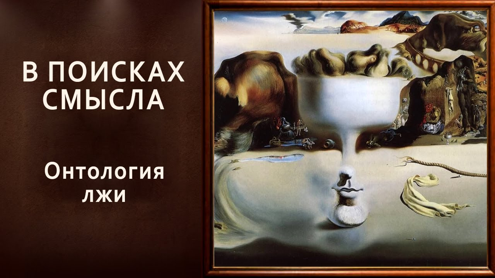

# Онтология лжи

17 января 2025 [Аудиоверсия](https://paradoks-pinkera-pilotnyy-vypusk.simplecast.com/episodes/the-ontology-of-lies) 34:13

Обсуждаем феномены  лжи и лукавства распространённых в современном обществе.
Привычное лицемерие в медиасреде и публичных дискуссиях.
Погоня за "вайбом" - когда эмоциональное воздействие становится важнее содержания сообщения.

**Е.Голуб:**
Здравствуйте, дорогие друзья!
Мы начинаем четвёртый сезон подкаста «В поисках смысла».
Подкаст, как всегда, ведут Павел Щелин ...

**П.Щелин:**
... и Евгений Голуб.

**Е.Голуб:**
Мы записываем этот выпуск совершенно не так, как планировали.
И весь сезон мы будем записывать не о том, о чём говорили, потому что в разговорах, в подготовке записи четвёртого сезона выяснилось, что у нас есть общая боль.
И об этой боли мы будем говорить, потому что проговоренная боль становится меньше.

Ну и, возможно, мы найдём рецепт, как иметь дело, как выходить из этой ситуации боли.
Конкретно речь пойдёт о лжи, которую мы в одном из выпусков прошлого сезона немного затронули.

Павел?

**П.Щелин:**
Ну да, Жень, ты прям с места раскрыл все карты.
Хотя мне казалось бы, более важно именно сначала погрузиться, как мы дошли до жизни такой.

Потому что это уже является определённым итогом некоторых размышлений.
А вот предпосылкой для них стало, как не было бы мне как философу прискорбно, определённое чувство.
Чувство — вот это очень сложно описать словами.
Я подберу некоторое сейчас семантическое поле.

Это чувство тошноты, чувство определённой брезгливости, желание отгородиться от того, что в широком смысле можно назвать публичной медиасредой, но еще в более широком смысле, наверное, придется подвинуть до уровня вообще публичных коммуникативных практик как таковых.
Вот это чувство у меня росло по нарастающей на протяжении последних вот именно двух-трех месяцев, уж простите за полумем.

Я очень долго никак не мог понять, что именно меня таким образом раздражает, и даже в каком-то смысле, давайте раскроем небольшую личную тайну, привело к определённому падению временному работоспособности.
Но потом, обсудив с Евгением, я понял, что не я один подобное испытываю.
И вот дальше начались мои размышления о, собственно, в чём первопричина этих процессов.

**Е.Голуб:**
Мы говорили перед началом записи, делились своими чувствами, эмоциями.
Я определил свои ощущения, свои чувства как некоторое брезгливое недоумение.
Отчасти вот это недоумение нашло выход в нашем экспромт YouTube-ролике по поводу соломенных чучел.

И если сжать всё о том, о чём мы говорим, его можно выразить таким образом.
Ну, друзья, ну сколько можно?

Ну самим разве не отвратительно вот это выдёргивать из контекста мысли, создавать врагов, унижать их в отсутствии возможности им возразить?
За что это?
Это же недостойное просто поведение, недостойно человека.

Ну и сейчас, откровенно говоря, я стараюсь вообще не заходить в публичные широкие дискуссии, потому что, во-первых, там идёт борьба, бьются соломенные чучела друг с другом.
Но когда мы открываем какие-то большие медиа, то там тоже лукавство на лукавство, передёргивание на передёргивание, ложь на лжи.
Но это уже просто перешло в какую-то меру.
Меру того, что можно терпеть и воспринимать.

**П.Щелин:**
Здесь у меня в том числе возникает некоторое даже недоумение, наверное, у нас темпераментная разница, даже некое раздражение.
Ну, зачем же быть таким, как бы хочется сказать грубым словом, деревом?

Но более фундаментальная же проблема разрушается сама ценность обмена мнениями в языках.
Мы вот сейчас в дальнейшем поговорим основные, скажем так, направления, по которым это происходит.
Но вот эта проблема того, что на большом и малом уровне, начиная от СМИ типа "New York Times", CNN, BBC, заканчивая, простите меня, обычными YouTube-блогерами в русскоязычном или украиноязычном медиапространстве, повторяется некий один и тот же паттерн, который саму коммуникацию делает абсолютно бессмысленной.

А это приводит очень часто к невозможности разговоров, надо дать должное, и внутри близких отношений.
То есть тоже вам приходится сталкиваться с очень многими вещами, с которыми бы хотелось бы не сталкиваться.
А вот чувство твоего недоумения у меня вызывает больше, когда вот ты вроде видишь умный человек, где-то читал его книги, там следил, но потом он выходит и начинает повторять какие-то такие банальные вещи, причем не в хорошем смысле банальные вещи, а такие банальные, неистинные клише, неистинные вещи, то что пропадает желание смотреть дальше.

**Е.Голуб:**
То есть это, очевидно, не соответствует интеллектуальному уровню этого человека или людей.
Очевидно, им приходится подстраиваться под какую-либо повестку, под нарратив.
И это выглядит настолько неискренне, настолько тягостно за этим наблюдать, что становится просто нехорошо.
Это не испанский стыд, это какое-то чувство досады.

Как мы пришли к такой жизни, когда человек не может позволить себе быть искренним?
Сейчас много говорят о новой искренности, но это, по-моему очередная ложь.
Какая новая искренность?
О чём речь?

И при том, наверняка, многим из нас хорошо знакомо это чувство, когда мы, будучи по каким-то обстоятельствам вынуждены не договаривать что-то, лукавить, когда мы от этого освобождаемся, какое-то облегчение, когда тебе не нужно подстраиваться под общепринятую ложь, скажем так, игру, лукавство.
А сейчас, кажется, весь мир понадевал маски, повыбирал роли, и вот это всё лицедейство дурного пошиба, такого низкого пошиба, оно воспринимается как вынужденная какая-то практика.

Зачем?
Кому это нужно?
Вот в чём вопрос.

**П.Щелин:**
И вот, собственно, ответить на эти вопросы мы с тобой решили в рамках нашего сезона.
У всех своя форма взаимодействия, скажем так, с кризисами.
Наша с тобой — это форма мышления на публику в приятной обстановке.

Оказалось, что, мне кажется, за этим стоит вот эта очень интересная проблема, собственно, лжи, место лжи в системе вообще нашего мировосприятия, проблема коммуникации лжи, разные природы лжи, о разных очень важных вещах.
В общем, мы немножко буквально в предподготовке к нашему сезону копнули и обнаружили просто огромное невысказанное поле, которому мы, собственно, и хотим посвятить этот сезон, уважаемые друзья.

**Е.Голуб:**
А копнули мы тему лжи, когда говорили о корпоративном мире, с которым я лично хорошо знаком.
И для корпоративного мира вот это, я бы назвал это лукавство многоуровневое, оно природное совершенно, воспринимается как необходимое.

То есть мы вышли перекурить, пообщаться за пределами офиса, мы оценили ситуацию, как она есть.
Посмеялись, пожали плечами, вернулись и исполняем то, что требует роли.
И эти два плана существуют уже давно и очень-очень прочно.

Но сейчас, кажется, вот такое многоплановое существование пронизало все уровни нашей жизни.
От разговоров в семье, когда ты не можешь выразить свои настоящие мысли и позиции, потому что ты рискуешь потерять отношения с близкими, до разговоров публичных, когда это может быть просто опасно для твоей жизни.
Просто выразить сомнение в каком-то нарративе, в каком-то общепринятом подходе, задать вопрос.
И даже задать вопрос, может быть, подвергнуть сомнению вот это вот лукавство, это может быть опасно.

Как в этой обстановке сохранять себя, как в этой обстановке продолжать быть собой — вот вопрос.

**П.Щелин:**
Более важно здесь у меня всё-таки отношение к фундаментальной проблематике речи.
Всё-таки речь предполагает, что мы взаимодействуем через публичное...

Ну, это вообще-то в каком-то смысле то, что сделало нас людьми, давайте так прямо скажем.
Даже если вы не относитесь к теологической перспективе, функция языка — она вопрос, который исследуется антропологами, этнографами.
То есть это очень фундаментальный момент.

И вот распадение функций языка — это, на самом деле, пресловутое, скажем так, одно из основных, я бы сказал, сущностных процессов, которые скрыто, тихо, но фундаментально происходят в развернувшихся процессах, которые нас окружают.
То есть я просто хотел бы здесь акцентировать, что проблема не просто про сохранение себя самого.
В конечном итоге, давай прямо скажем, себя собой мы сохранить можем.
То есть, условно говоря, взял книжку, запёрся дома, отрубил все новостные каналы и пытаешься взаимодействовать.
Ну, есть какие-то такие способы радикального толка.

Но вот проблема отсутствия публичной коммуникации, она же всё равно повышает масштабы энтропии как таковой.

**Е.Голуб:**
То есть мы заранее закладываем в наши слова, в нашу коммуникацию неверные параметры, скажем так, как если бы мы отправляли радиосообщение с большим количеством ложных символов.
И что?

Это понижает эффективность общения, это приведёт к ложной интерпретации, это ведёт к искажениям многократным.
Ты говоришь об этом сейчас, если я тебя правильно понимаю.

**П.Щелин:**
Я говорю об этом, скорее даже говорю о последствиях этого.

Последствия этого заключаются в том, что принимаются плохие решения.
Плохие решения приводят к ещё более плохим решениям.
И это было бы на самом деле полбеды.

Мне кажется, происходит гораздо более глубокая, если угодно, проблема, которая на самом деле возвращает нас к самому первому выпуску наших с тобой подкастов «Парадокс Пинкера».
Помнишь, основным его идеей было в том, что на фоне роста материального благополучия мы видим не менее взрывной рост комплекса психических заболеваний.
То есть комплексов психических заболеваний, депрессии, шизофрении, биполярные расстройства и прочее, прочее, прочее.

И вот мне почему-то пришла мысль, может быть, мы с тобой её как-то косвенно выйдем к концу эфира об этом, то, что это не случайно.
То, что ложь, в основе которой лежит антологическое расщепление реальностью, я уж, простите, умные слова произнесу, оно на длинной дистанции приводит к онтологическому расщеплению индивида.

**Е.Голуб:**
Ну то есть, когда ты говоришь, что сохранить себя можно радикально, но мы понимаем, что вообще говоря, эта ситуация несёт угрозу для психической стабильности человека, индивидуума в целом.
То есть это не проходит бесследно, необходимость шизофренического такого.

**П.Щелин:**
Ну как минимум, вам придётся тратить огромное количество ресурсов.
То есть это ситуация, когда...

Вот есть известное выражение отца Антония Пустынного, который говорил то, что в конце времён 100 безумных скажет разумному, что ты безумен, а не мы.
Вот эта ситуация.
Можно помыслить себя на месте этого не безумного человека, и она требует очень больших ресурсов, чтобы банально сохранить способность взаимодействовать с реальностью в таких условиях, в условиях общей расколотости.
До этого я немножко даже забегаю вперёд.

Просто, мне кажется, этот то, куда огромное количество ресурсов мы тратим уже сейчас.
Мне кажется, мы коллективно недооцениваем, ну, по крайней мере, я недооценивал, какое количество умственных ресурсов сегодня вынужден тратить человек банально для поддержания базового психического здоровья в современных условиях.
И во многом именно в условиях этой лжи.

**Е.Голуб:**
Из-за вот этого пространства лукавства и лжи, в которое мы сейчас все погружены.
Ну да, тут спорить не о чем.
Смотри, что получается.
Возвращаясь опять-таки к начальному нашему выпуску первому.

То есть мы не можем, да и глупо, отрицать гигантские успехи, если хочешь, научно-технического прогресса.
Но при этом платой за это стала вот эта вот необходимость поддерживать очень много планов коммуникации.
Как это можно связать?

Условно, жизнь человека 300 лет назад была намного сложнее.
Но мне кажется, уровень лукавства и повседневной лжи у него был всё-таки поменьше.
Как ты думаешь?

Или это заблуждение?

**П.Щелин:**
Нет, я в этом убеждён.
Но просто для того, чтобы раскрыть, что значит это моё убеждение, нам, собственно, потребуется часть сезона.

Я бы хотел с тобой, наверное, переформулировать, у нас же выпуск вводный, то, что, собственно, как это произошло, что на фоне вот этих неоспоримых процессов материалистического достижения, материалистического развития происходит вот это онтологическое наполнение, крушение определенное, наполнение онтологической вербальной реакции лжи.
Вот этому, собственно, и посвящен сезон, потому что это процесс частично ненамеренный.

То есть очень много чего послужило тому, чтобы мы прошли путь, условно говоря, от людей гораздо более простых, давай так сформулируем, с гораздо более, может быть, трудной жизнью, но цельных и целостностей к людям расколотым.
Это потребовалось.. очень длинный как бы путь.
Вот то, в чём мы оказались сегодня, это не возникло одномоментно.
И, собственно, вот здесь мы сейчас произнесём важную цитату, которую произнёс в своё время, раз уж мы вносим психологический язык, великий учёный Бехтерев, создатель Института мозга, то, что исследуя шизофреников,

> власть — это торможение.

Там же основная идея, он исследовал то, что там происходит всё на скорости, психические процессы.
Они происходят очень быстро, расщепление происходит очень быстро.
То есть в целом происходит перегрузка взаимодействия с миром.
И в этом условии способность тормозить психоз, тормозить припадок, тормозить всплеск.
Это и есть, по сути говоря, форма власти, форма контроля.

Иногда либо самовластие, либо внешней власти.
То, что мы делаем сейчас, надеюсь, в рамках этого сезона, это вот такой эксперимент по возвращению локуса вот этого контроля нашим уважаемым слушателям через наше совместное путешествие.
То есть самим себе и слушателям.

**Е.Голуб:**
Смысл этой цитаты в чём?
Что до тех пор, пока ты можешь сознательно тормозить свою реакцию, удерживать себя от спонтанной реакции, до тех пор ты можешь говорить о власти над самим собой или до тех пор какие-то внешние силы, которые могут тормозить что-либо, удерживать, могут заявлять о способности чем-то управлять.
Так корректно будет сказать?

**П.Щелин:**
Это корректно в философском ключе, хотя я имел в виду гораздо более простую мысль сейчас.
Я имел в виду сейчас очень простую мысль, что мы с тобой сейчас тормознём вот эту суть вопроса, обсуждаемой лжи, и рассмотрим его в другом темпе.
В более медленном, в спокойном, основательном, возвращая локус контроля.
То есть вот опять я же начал с чувства.
Вот это чувство тошноты, чувство брезгливости, чувство непонятности.
Почему оно меня взволновало?
Почему оно начало служить для меня поводом разобраться?

Я почувствовал его некое ускорение.
В том числе и в своём восприятии.
То есть очень многие вещи я стал пропускать, говорить побыстрее, реагировать побыстрее, срываться даже побыстрее.
То есть реакции стали быстрее.

Чтобы навести в этом порядок, стоит затормозить самому и разобраться в этом процессе медленно и основательно.
И проведя вот этот такой сеанс демистификации, ну, по крайней мере, можно уже получить некий контроль над происходящим.
То есть да, я исхожу из той позиции, что через понимание, через вот такое раскрытие сущностных глубинных процессов мы уж как минимум получаем контроль.
Что мы с этим контролем будем делать дальше?

Это свобода воли, нас, тебя, меня, уважаемых слушателей.

Но уж хотя бы получить этот локус контроля, мне кажется, крайне важная задача.
А это не сделать без такого спокойного, глубокого, многостороннего и сложного рассмотрения этих феноменов.

Буквально вот в вариантах подготовки вот, знаете, скидывал план, начал копать и обнаружил, насколько это многогранная проблема.
То есть насколько это непростая вещь.
Мы сейчас упомянем некоторые простые вещи, которые вроде бы на виду, но глубинные вот эти философские путешествия, оно тоже длится в столетия, потому что ложь, она как бы возникла-то не сегодня.

Но, тем не менее, сегодня она воспринимается сильно по-другому.
И ощутимо она нечто другое, чем то, что была всегда в каком-то смысле.
А в каком-то смысле то же самое.

И вот показать все эти нюансы различия, особенно в их историческом пути, это, мне кажется, то, что ровно мы с тобой должны сделать.

**Е.Голуб:**
Задача, конечно, очень амбициозная, скажем так, и масштабная.
Нам никто не помешает попробовать ей заняться, а уже нашим слушателям, во-первых, решать, что нам удалось, что нет, а во-вторых, помогать и дополнять наши мысли своими комментариями и своими размышлениями.

А что сегодня ты хотел бы затронуть?

**П.Щелин:**
Ну, давай сегодня просто затронем некоторые вот практические наблюдения, с чем мы сталкиваемся сегодня.
Самые простые, самые поверхностные, наверное, для уважаемых слушателей, чтобы понимать масштаб проблемы.
Я их назвал локусами.
Изначально я назвал, то есть места, да?

То есть, условно говоря, постулируя проблему некой невозможности разговора или постулируя проблему некоторой перегрузки этой ложью в личном пространстве, выделить некоторые основные ее места, где мы ее встречаем.

Ну, первое, я бы ее назвал место репутации.
Это самое простое.
Здесь как бы философская помощь нам в строгом смысле даже не необходима.
Это исключительно вопрос нашей самодисциплины.
Я имею в виду люди, которые осознанно врут.
То есть как бы в публичном пространстве, не стесняясь и воспринимая это исключительно как норму.

Это, казалось бы, первое, скажем так, место, и, казалось бы, оно легко преодолеваемо, хотя на самом деле сейчас уже понимаешь, что нет.

**Е.Голуб:**
Я же коллективный твой слушатель, поэтому мне не очень понятно.
Мы говорили о том, что лукавство и ложь заполонили вокруг всё информационное пространство, всю коммуникацию людей между собой, особенно на важные темы, на важные по жизни вопросы.
И дальше мы стали говорить о местах.

У меня как-то не сложилось.
Что это?
Места, где вводится ложь?
Или как это выглядит?

**П.Щелин:**
Как это выглядит?
Как она проявляется?
Проявляется она по-разному.

Как она выглядит.
Проявляется по-разному.

**Е.Голуб:**
То есть сказать по-другому, если проявляет на себя в людях, которые не сделали ложь своим основным отличительным коммуникативным свойством.

**П.Щелин:**
Да, очень важно.
Осознанно.

**Е.Голуб:**
Осознанно.
То есть такие люди появились как профессиональные лжецы.
И они профессионально лгут, лукавят, манипулируют.
И это почему-то стало и возможным, и допустимым в современном мире.

**П.Щелин:**
Да.
Есть гипотеза, почему это стало возможным и допустимым.
Давай сейчас её просто зафиксируем.
Более подробно рассмотрим в третьем, по-моему, выпуске у нас по плану.

Потому что они капитализируют то, что в своё время сформулировал Жан Бодрийяр, что СМИ продают нам не реальность, а головокружение от реальности.
То есть некое эмоциональное состояние.
То есть, опять-таки, мы предполагаем, что в коммуникации самое основное — это информация.
Мы с тобой обмениваемся неким смыслом, то есть условно неким локусом.

А прямая ложь в современных условиях, мы как-то оказались в ситуации, когда смысл вообще не важен, а важно то, что молодёжь называет вайбом.
Какой вайб передаёт то или иное твоё сообщение.

**Е.Голуб:**
Но здесь я с тобой поспорю.
Почему?

Потому что было бы неверно, на мой взгляд, говорить о том, что коммуникация прежде всего для обмена смыслами.
Наш опыт подсказывает, что очень много коммуникации прежде всего для обмена эмоциями.
И эта коммуникация не менее важна, и она была всегда.

Утешить, поддержать, почувствовать причастность, почувствовать общность.
Эта коммуникация эмоциональная, просто у неё есть своё место.
То, как бы я интерпретировал твои слова, что эмоциональная коммуникация стала доминировать и преобладать в том, что касается...
Что в поле коммуникации вообще.
И вот именно есть для этого, видимо, какая-то причина.

**П.Щелин:**
Да, у этого есть своя причина, о которой мы будем говорить в дальнейшем.
В этих условиях, когда вот этот тип коммуникации по сути стал доминирующим и вышел за отведённое ему, условно говоря, место пространства.

Давай прямо скажем, всё-таки публичная дискуссия была традиционно местом минимального присутствия.
То есть вообще публичное пространство было всё-таки больше не про это.
Традиционно.
Там газеты, речи.
То есть мы можем читать даже исследования по эволюции, знаешь, рационального и эмоционального языка в британской и американской печати.

**Е.Голуб:**
Да, было прекрасное исследование о том, какие слова и выражения стали доминировать, по-моему, с 90-х годов потихоньку, забив напрочь всё, что касается логики.

**П.Щелин:**
И вот это создало возможность, когда вот этих сообщений без смыслов, но с вайбом в чистом виде.

**Е.Голуб:**
Другими словами, мы подошли к такой точке, где преобладание, доминирование эмоциональной коммуникации сделало возможным людей, которые только эмоциональной коммуникацией занимаются.
То есть невозможно слушать их содержательную вещь всерьёз, и не стоит.
Их главное поле — это эмоции.
Они набирают эмоциональных каких-то сочетаний, они их транслируют, а мы с тобой, люди, ориентированные на логическую составляющую, находимся в недоумении, скажем так.

**П.Щелин:**
А почему я нахожусь в недоумении?

Спасибо, что ты это чётко сформировал, потому что если бы они прямо говорили, условно, что мы скоморохи, и мы развлекаем, мы утешаем, то было бы нормально.
Но они являются политиками, экспертами.

Кандидат в президенты, например, в США сейчас.
У нее вся компания, вот сейчас Камала Харрис, построена исключительно на вайбе.
Это осознанное политтехнологическое решение.
Там нет никакого рационального содержания.

Даже ее комментаторы с CNN любую политическую или экономическую меру, которую удается вытащить из Камалы, начинают критиковать, потому что что-то оно не так.
Но ее основная идея — joy, радость.
Она коммуницирует радость, она коммуницирует вайб радости.

Вот эта идея, то есть это на политическом уровне, а также это происходит на уровне людей, которые называют себя экспертами.
А слово экспертиза вообще предполагает именно логическую коммуникацию.
То есть, понимаешь, происходит разрыв.

То, чем люди являются, и тем, чем они занимаются.
И то, что они заявляют, они должны заниматься.

**Е.Голуб:**
Это же тоже признак инфантилизации, инфантильности, когда мы не хотим слушать ничего по сути, а мы хотим чувствовать.
Мы хотим что-то чувствовать.

И вот на это откликаются те, кто собирается управлять странами и народами.
То есть они говорят, да, вот именно так, вот так, вот это правильное чувство, вот радость, радость, только радость.
Это какое-то уже такое шаманство.

**П.Щелин:**
Радость, надежда, да-да-да, магическое мышление.

**Е.Голуб:**
Научно-технический прогресс, развитие, невероятное достижение научно-технической мысли привело к тому, что общество в целом, будучи, во-первых, неспособным понять 90% современной научной мысли, уходит исключительно в эмоцию и в, как ты называешься, в вайб.
Прекрасно, да?

**П.Щелин:**
Но при этом, вот говорю, у меня было бы меньше проблем моих личных, если они прямо бы заявляли то, чем они занимаются.
Я могу это понять от актёра.

Актёру надо раздавать, допустим, вайб там.
Я не могу понять это от эксперта.
То есть у меня вот здесь происходит фундаментальный конфликт.
Ну, это вот одна из причин моего личного раздражения.

**Е.Голуб:**
Ну видишь, мы с тобой от лжи пришли к эмоциям.
И скажут, ну хорошо, давай свяжем каким-то образом.
Эмоции — это же то, что человек на самом деле чувствует, ведь это доминирующий нарратив.

Правда — то, что ты чувствуешь.
Вот ты чувствуешь — это правда.

**П.Щелин:**
Ну вот смотри, вот как мы дошли до этого бредового, скажем так, утверждения, это и есть отдельный повод для глубокого рассмотрения.
Потому что, конечно, это просто, спросите меня, лживое утверждение.
То, что я чувствую, — это не правда.

То, что я чувствую, — это то, что я чувствую.
Не более того.

**Е.Голуб:**
Ну то есть под ложью нам придётся всё равно как-то...

**П.Щелин:**
Соотноситься с реальностью.

**Е.Голуб:**
Ну нет, под ложью нам нужно как-то определение какое-то определить.
Ложью сознательное искажение логических законов, искажение… 

**П.Щелин:**
Не только сознательное, в этом-то ещё полбеды.
Так если бы оно только сознательное было.

**Е.Голуб:**
Хорошо, тогда и сознательное, и неосознанное искажение правил или законов логического мышления в угоду эмоциональных посылок.
То есть отказ от того, что... когда ты Аристотель, от формальной логики на самом деле.

**П.Щелин:**
Ну это как минимум, да.
А в более глубоком значении, это в принципе, мне кажется, если уж говорить серьёзно, это отказ от соотнесения знака и того, что этот знак обозначает.

**Е.Голуб:**
Отлично.
Очень часто это намеренный отказ.
Он может быть не до конца осознанный, но намеренный для достижения цели.
Какой цели?

Произвести или выдать...

**П.Щелин:**
Воздействие.
Оказать некое воздействие.

**Е.Голуб:**
И получить эмоциональное воздействие.
Аудитория должна верить.
Она не должна думать.
Она должна верить.
Это такой эрзац.
Она должна переживать какой-то экстаз.

**П.Щелин:**
Ты знаешь, даже не верить.
Вот ты мне сказал, переживать мне нравится гораздо больше.
Она должна что-то испытывать.

Это даже веру не предлагают.
Вера слишком сложна для этого уж, если честно.

**Е.Голуб:**
Она должна вибрировать на нужной частоте.

**П.Щелин:**
Да!

Но это не вера.
К вере-то они как раз не апеллируют.
Очень интересно.

Потому что вера рано или поздно предполагает всё-таки хоть соотнесение, хоть какое-то включение.
Более точно ты сказал вибрацию.

То есть настройка на вот это некую вибрационную...
Вот говорю, слово вайб, оно оказывается очень точным.
Вот это вайбирование на одной, скажем так, частоте.

**Е.Голуб:**
Ну то есть мы с тобой оказались в мире медиумов, шаманов и этих самых...
Какое ещё слово придумать?

**П.Щелин:**
Которые выдают себя за экспертов.
Если бы они еще себя шаманами называли, проблем было бы гораздо меньше.
Нормальные шаманы честнее.

В этом плане какой-нибудь астролог, он хотя бы заявляет, что он астролог.
Ты хотя бы понимаешь, что от него ожидать.

**Е.Голуб:**
То есть мы идем в цирк, а он говорит, это Академия наук, и сейчас вы узнаете, как построен мир.

И все такие, вау, наконец-то, а вот это скучные какие-то глупые люди.
Нет, вот посмотри, что этот с красным носом рассказывает.
Вот же правда, истина.

**П.Щелин:**
Да.

**Е.Голуб:**
А будешь возражать, мы тебя затопчем.

Ну хорошо, предстоит большой разговор.
Ты упомяни коротко, наверное, вот эти две вещи перед тем, как мы завершим вводный выпуск.

**П.Щелин:**
Ну вторая, просто супер распространённая, это то, что меня лично начало уже просто выводить на какого-то безумного...
Но это связано с твоей эмоциональной, кстати, логикой.

Царство..
Мы сказали, выпуск на YouTube был «Царство соломенных чучел», а ещё мы в «Царстве индуктивных ошибок».
То, что индуктивная ошибка просто стала нормой мышления.
Можешь рассказать, что такое индуктивная ошибка?

У тебя это, думаю, получится даже лучше.

**Е.Голуб:**
Ну, в общем, есть, как принято считать, два способа выведения каких-то умозаключений.

Первый — это дедукция, построенная на жёстком следовании одного из другого.
Почитайте, пожалуйста.

Второй — это индукция.

Третий — это абдукция.

Вот любой учебник логики или там простые в Википедии статьи вам помогут.
Но, грубо говоря, индуктивное мышление — это как раз то, чем, между прочим, Шерлок Холм занимался.
Он как раз говорил про дедуктивный метод и занимался индуктивным мышлением.

Индуктивное мышление рассматривает вывод как вероятностный, а не как неизбежный.

То есть мы говорим, там любимый пример одного известного философа о том, что вот в руке Вани окровавленный нож, он бежит прочь из дома, а в доме лежит убитая Маша, значит, Ваня убил Машу.
Это обычно индуктивное.
Вероятность этого велика.

Хотя на самом деле то, чем занимаются в американских судах, это доказывает, что… А может быть и другие варианты.
А вот есть ещё.
А это невероятно.
А вероятность этого невелика.
И так далее, и тому подобное.

У нас же принято на основании самых мелких посылок индуктивных делать однозначные выводы, которые не подлежат сомнению.

**П.Щелин:**
То есть ты сейчас это объяснил с точки зрения совсем чёткой логичности, поэтому я сначала дал тебе слово.
А на практическом уровне, как я это себе понимаю, что я вкладываю в царство индуктивных ошибок, это максимизация и абсолютизация частного индивидуального опыта и натягивание его на целостность.

**Е.Голуб:**
Ну да, я никогда не был в Австралии, и значит, Австралия не существует.
Я её не видел.

**П.Щелин:**
Из-за этого решения мне стало плохо, поэтому это в целом плохое решение.
Ну, например, вот тоже.
Пример такого индуктивного.

А посмотрите вот тут, условно говоря, как образ.
Берется такая огромная камера.
Берётся какой-нибудь маленький, не знаю, камушек, на него направляется весь свет софитов вот этого камушка, и начинаются пляски с бубном вокруг вот этого самого камушка.
Вот это я называю...

**Е.Голуб:**
Да, что вся остальная планета состоит из вот этой материи.
Вот да, вот вы видите, ну это же очевидно, вы видите, там камень жёсткий, безводный.

**П.Щелин:**
И как вы можете этого не чувствовать?
Как вы можете вообще говорить о чём-то другом?
Почему вам это не важно?
Вот это всё.

И это происходит и на уровне общественном, то есть как бы на уровне СМИ, на уровне вот этой политики, на уровне риторики, но это просто каких-то достигло эпических масштабов просто в общениях между людьми.
То есть люди, в принципе, все, что выходит за границы частного опыта, воспринимают с большим трудом.

То есть они всегда, наверное, с определенным трудом воспринимали, но сегодня...
Может быть, это мое личное такое.

Но это очень усложняет дискуссию, потому что любая дискуссия, например, о длинном процессе, об историческом процессе, вообще любая дискуссия о цельности предполагает способность собеседника выйти за границы исключительно вот своего замкнутого индивидуального опыта.
Это делает очень сложной, скажем так, эту работу.

**Е.Голуб:**
Хорошо, ты хотел ещё одну тему затронуть?

**П.Щелин:**
И ещё последнее, это мы с тобой тоже...
Интересная важная вещь, вот то, что более скрытое, это то, что я тебе предложил называть «проблема не проговорённых посылок».

Ну это вот в целом всему то, что посвящены наши с тобой эфиры, особенно, например, предыдущий сезон.
Ну, например, что такое не проговорённая посылка?

Демократия — хорошо, империя — плохо, агрессия — плохо.
Условно говоря, мир у мир.
Вот такие "доксы".

То есть это то, что греки называли "доксы", такие общие места современности, да.
И вот у нас на самом деле в мышлении присутствует огромное количество вот этих самых разных дискурсивных "докс", причем они находятся в состоянии распада, то есть у каждой группы есть свой набор "докс", и если ты входишь в эту группу, то без выражения там пиетета, без книксена, без такого, знаешь, "ку" из "Кин-дза-дза" перед вот этими "доксами" вообще никакая дискуссия не идет.

И вот это третья, на мой взгляд, фундаментальная проблема — потеря возможности работать с не проговорёнными посылками.
Мы очень многие вещи отдали на откуп, но все же так думают, по сути.
Но это мешает, просто засоряет коммуникационный поток до невозможности, на мой взгляд.

**Е.Голуб:**
Да.
Это был недавно у меня такой интересный опыт.

Я встречался с одним очень крупным аналитическим философом, который уехал в Соединённые Штаты Америки, и затронули тему феминизма и повесточки.
Мы там в компании коллег выразили аккуратно скепсис по поводу повестки.
И он был искренне изумлён и говорил, что вы, люди, вы просто какие-то неадертальцы, какие-то дикари.
Так же все думают, это же правильный способ мышления.
Мы были страшно удивлены этому.

**П.Щелин:**
Да, это вот хороший частный пример, что является не проговорённой "доксой".

**Е.Голуб:**
Но это называется имплицитные посылки, да?
То есть их такое количество стало, да, не проговорённых, скрытых.

**П.Щелин:**
Причём это всегда такая загадочная игра.
Не до конца понятно, у кого какие они именно здесь и сейчас, в какой момент, и ещё их надо угадывать.

**Е.Голуб:**
Но мне кажется, мы с тобой подняли очень большой пласт всего.
И качество мышления, что, в общем-то, всегда, во все времена было вопросом.

Феномен времени, когда эмоции стали основной целью коммуникации.

И профессионалов, которые вышли вперёд и затмили собой любых людей, пытающихся оперировать в логическом поле.

И всё это мы назвали временем лжи, временем лукавства.
Давай мы с тобой попробуем потихоньку вот этот весь ком, вот этот клубок связанных вещей разобрать, так, чтобы всем остальным было понятно, потому что уже много всего.
И вернёмся к началу.

**П.Щелин:**
Это много всего.
И вот знаешь, очень важно, главное, вернёмся к началу.
Всё-таки чем я отличаюсь?

Мне кажется, тут как раз именно медленное, спокойное раскрытие этих проблем нам необходимо, плюс ещё на которые мы выйдем.
Мне очень важно показать отсутствие, знаешь, некого злого гения.
Точнее, показать, где, может быть, какой-то злой гений и присутствует, а где есть некие объективные проблемы, на которые были предложены мыслью, мышлением, социумом, не самые адекватные решения, которые довели нас до жизни такой.
Но это вот есть пример вот этого длинного путешествия, в которое я зову наших уважаемых слушателей.

**Е.Голуб:**
Мы говорим о том, что нет теории заговора какой-то тайной ложи, а есть объективная логика, что ли, да, неизбежная, которая шаг за шагом привела к этому.
Мы с тобой часто приходим к тому, что некоторые удручающие нас явления современности — это не заговор, а некоторое развитие внутренней логики событий, которые начались не сегодня, а сотни лет назад.
И это, мне кажется, наиболее интересно, потому что сбрасывает покров какого-то такого...
Ненужной таинственности, а приучает нас думать и размышлять логически.

**П.Щелин:**
В жизни есть места тайны, их очень много на самом деле, но не надо их везде натягивать, где можем их объяснить.

**Е.Голуб:**
Где можем попытаться понять их и разобрать, и, следуя логическим рассуждениям, прийти к выводу, что похоже на то, как это и на самом деле есть.
Хорошо.

Давай тогда на этом сейчас остановимся.
Получилось у нас просто поразмышлять с тобой.
Ну и опять-таки наши выпуски — это никогда не предложение стройной концепции, это всегда размышления вслух.

**П.Щелин:**
Да.
Прежде всего, интересное авторам.
Давайте уж честно признаем.
Это то, что нас с тобой волнует сегодня, то, что нас с тобой заинтересовало, и то, что мы увидели некую пустоту на данный момент.
То есть, нам интересно говорить о том, о чём мало кто говорит, назовём это так, традиционно.

**Е.Голуб:**
Да, ну и надо уточнить, что в эмоциях самих по себе и в чувствах, конечно же, нет ничего плохого.
И мы начали с того, что нас с тобой испытали некоторые чувства и эмоции, которые заставили нас обратиться к этой теме.

Но всему должно быть своё место и своя доля, что ли.
Когда это место начинает завоёвывать всё пространство, нужно ждать беды.
И похоже, что мы там как раз, в этой беде.

**П.Щелин:**
И вот что мы сделаем в дальнейших выпусках?
Ну вот, собственно, мы упомянули три некоторые основные проблемы.
Вот, собственно, мы о них поговорим.

Мы поговорим о том, как мы дошли до вот этого триумфа эмоционального человека.
Это очень важная тема.

Мы попытаемся разобрать некоторые вот эти не проговорённые "доксы".
Это будет серия выпусков «Ложь О», то, что ты предложил.
То есть это вот как раз некоторые не проговорённые "доксы", мы хотя бы попытаемся их подсветить.

Ну и, наконец, там третье, вот это фундаментальное такое онтологическое.
Как вот мы доходим до всего этого?

**Е.Голуб:**
Тогда приглашаем наших слушателей в путешествие вместе с нами, в размышления вместе с нами.
Пожалуйста, размышляйте, делитесь и с нами, и между собой вашими мыслями.
Будем рады любым вашим комментариям и поправкам.

Мы думаем вслух, это живой процесс, не все формулировки удачные, не все логические ходы последовательны.
Тем не менее, мы получаем удовольствие от процесса.

Павел, я получаю.

**П.Щелин:**
Я вот получаю удовольствие от процесса и не буду скрывать, поэтому в том числе мы этим и занимаемся.

**Е.Голуб:**
Да, поэтому и хотим, чтобы вам тоже было интересно.
До встречи!

**П.Щелин:**
До встречи!
