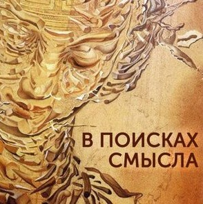

# Логика вины и логика причинности

21 марта 2025 [Аудиоверсия](https://paradoks-pinkera-pilotnyy-vypusk.simplecast.com/episodes/vinaiotvetsvennosti) 35:26

В новом выпуске подкаста Евгений Голуб и Павел Щелин  обсуждают две принципиально разные логики, которые часто смешиваются в современном обществе: логику причинности и логику вины.
Авторы раскрывают, как непонимание и подмена этих логик ведёт к заблуждениям и конфликтам, как в общественной жизни, так и в личных отношениях.

Через яркие примеры из повседневной жизни и международной политики ведущие иллюстрируют, как логика причинности фокусируется на объективных связях между событиями и последствиями, в то время как логика вины акцентирует внимание на морально-этической оценке и ответственности.
Евгений и Павел разбирают, почему смешение этих подходов приводит к хаосу и невозможности содержательного диалога.

Вы узнаете, почему важно различать эти две логики и какие риски возникают, когда моральное осуждение подменяет понимание объективной реальности.
Ведущие объясняют, почему современная культура часто требует абсолютной свободы действий для одних и титанического самоконтроля для других, и к каким последствиям это ведет.

Ведущие призывают слушателей осознанно различать логику причинности и логику вины, чтобы избегать конфликтов и строить конструктивные диалоги.

**Е.Голуб:**
Здравствуйте, друзья!
В эфире очередной выпуск подкаста «В поисках смысла».
У микрофона Евгений Голуб.

**П.Щелин:**
И Павел Щелин.
Здравствуйте!

**Е.Голуб:**
Сегодня тему нашего разговора предложил Павел.
И мы поговорим о двух разных логиках, которые постоянно смешиваются сегодня во время обсуждения каких-либо новостей или событий.
Это логика причинности и логика вины.

**П.Щелин:**
Она самая.

**Е.Голуб:**
Павел, расскажи, пожалуйста, поподробнее.

**П.Щелин:**
Если говорить поподробнее, то причина, по которой я выбрал эту тему в качестве нашего сегодняшнего выпуска, заключается именно в том, что неожиданно для себя я столкнулся с какой-то огромной и, на первый взгляд, для меня не самоочевидной и удивительной слепотой в разговорах с разными журналистами и журналистов между собой, и даже во время постоянных обсуждений в нашем чате.
Да и в личных беседах.

Слепотой к возможности ведения содержательной беседы о какой-либо проблеме.
Начав в ней копаться, я обнаружил то, что действительно на данный момент мы видим столкновение очень сильное двух принципиально разных логик восприятия реальности.
Одна из них — это условно логика причинности.
Что такое логика причинности?

Логика причинности предполагает, что мы говорим о том, как из одного события вытекает другое событие.
Если А, то Б, если Б, то С.
Семя было посеяно, семя дало всход, и выросло дерево.

А вторая логика, она заключается в логике, вот условной логике вины.
Что такое логика вины?
Это когда говорится не о причинах и следствиях, а говорится о страдании самом по себе, переживании самом по себе.
В морализаторском тезисе, который сам по себе должен менять причинно-следственную связь.
Акцент делается именно на этом.

Классический пример — это, не знаю, будем ли сегодня, не будем обсуждать.
Допустим, ребенок разбил коленку, ребенок плачет.
Ребенку больно.
Давайте говорить о том, как он плачет, как он больный, как несправедливо, что если ты ударил коленкой по твердой поверхности, тебе от этого больно.
Это вот логика вины.
Логика причинности говорит о том, что если ударить коленкой об угол, будет больно.
Примерно, если упрощать, две вот эти разные логики, как люди не могут оперировать между ними.

**Е.Голуб:**
Давай я попробую на другом примере это проиллюстрировать.
Представим, что некто, допустим, даже я, арендовал машину в каком-то городе, неизвестном, не в самой развитой стране мира.
И, припарковавшись возле магазина, оставил свой документ, портфель с документами или там какую-то сумку на переднем сидении с документами, деньгами и вышел в этот магазин.
А когда я вернулся, оказалось, что стекло разбито, портфель там исчез, я оказался, так сказать, потерпевшим, да?
Ну и так, что получается?

Давай посмотрим на это с точки зрения логики причинности.
Что произошло?

Так как я создал для воров, для людей в этой стране бедных, где уровень преступности высокий, некоторые искушения, я дал им приманку.
Вследствие этого мои вещи были украдены.
То есть если бы я ту же сумку положил в багажник, закрыл ее, никто не видел, этого не было.
Тут логика причинности, если я правильно понимаю.

А логика вины будет в том случае, если полицейские поймают воришку и определят, что он совершил правонарушение.
Он забрал чужое, совершил правонарушение, всё, он пойдёт как виноватый куда-то в тюрьму.

И если я правильно понимаю то, что ты хочешь сказать, то, что я понимаю причину произошедшего и делаю вывод о том, что в следующий раз я не оставлю приманку на переднем сидении и сохраню свои деньги, то я этим самым определяю причину события, которая находится в существовании такого соблазна.
Ну и контекст.
Конечно же, нужно понимать, что в этой стране бедные люди грабят машины.
Но это не означает, что я оправдываю ситуацию.
Человек виноват, он взял чужое, он нарушил некоторые нормы поведения, этики, морали, которые приняты или которые декларируются в этом обществе.
То есть я этим пониманием не оправдываю этого воришку, и его вина от этого не становится меньше.

**П.Щелин:**
Абсолютно да, это две логики параллельны.
То есть я, в принципе, когда я говорю о причинности, я не говорю о том, виноват воришка, не виноват воришка.
Это, в принципе, становится для меня не в фокусе, если тебе угодно, этого разговора.
Потому что это дальше условно вопрос для суда.
Разбираться, в чем он был виноват, не был бы он виноват.
Может быть, он вообще рос в тяжелой семье, а его на самом деле там мать была в заложниках, и там, я не знаю, у какого-нибудь наркобарона именно кража этого портфеля была его способом спасти там...
Ну вот это уже вопрос юридической логики, собственно, для судебного разбирательства.
Но когда я говорю о причинности, мне важно именно понимание предсказуемости действий и их последствий.

**Е.Голуб:**
Предсказуемость последствий каких-то действий.
То есть мы принимаем решение, оно несёт на себе какие-то последствия.
Являются ли эти последствия каким-то выбором кого бы то ни было в этической сфере, это уже другое дело.

Ну, любимый пример, который взрывает обычно мозг, это про девушку в короткой юбке, которая решается идти поздно ночью по кварталу со шпаной.
Тут любая попытка сказать, что вообще-то, может, не стоит так делать, она взрывает сразу в эфир тем, что "victim blaming", она имеет право надевать всё, что хочет, и ходить, где хочет.
И вы там, звери, должны держать себя в руках и так далее.
И здесь, мне кажется, как раз и происходит, обычно застилает разум, эмоция.

Люди теряют логику вины и логику причинности.
То есть если мы хотим найти виновных, то вот они, те, которые совершают какое-то насилие в отношении человека.
Но если мы хотим не повторять этих ситуаций, нам нужно понимать возможные последствия и риски от этих ситуаций.
То есть мы можем продолжать выкладывать свои ценности под стекло машины и требовать нашу свободу делать то, что мы хотим в своей машине, своими делами.

**П.Щелин:**
Почему я не люблю эту логику вины?

Прямо тебе скажу.
Потому что здесь происходит парадокс.
Это одновременное требование предельного самоволия с моей стороны.
То есть вот моя свобода, и она, пожалуйста, вообще ничем не ограничена, причем свобода именно в понимании самоволия, да, то есть экспансировать мою волю, да, то есть проявлять мою волю вовне.
Ну, в частности, вот хочу без одежды пройтись по городу, гуляю без одежды по городу, это вот моя свобода.
Или хочу "ролекс" под стеклом машины оставить, оставляю.

И при этом требование абсолютной святости и самоконтроля с другой стороны.
Со стороны всех других окружающих, условно говоря, меня людей.
То, что вот они будут проявлять просто титанические усилия по самовластью, то есть под контролем над своими страстями, чтобы не использовать мои слабости, причинности против меня самого.

Понимаешь, да?
То есть это полное противоречие.

**Е.Голуб:**
Но это фактически игнорирование контекстов, да?
То есть игнорирование каких-либо контекстов и рисков.

И вот здесь, мне кажется, чтобы мы с тобой тоже не впали в эту ересь смешения одного и другого.
То есть логика причинности пытается или, скажем так, оперирует в поле объективной реальности.
Объективно существует уровень преступности.
Объективно в этой стране, например, много людей находятся за чертой бедности и они совершают правонарушение.
Это объективная реальность.

Если мы оставляем этот портфель условно в какой-нибудь, не знаю, Праге, то видеонаблюдение или что-то ещё, то риски меньше.
А если мы оставляем там в какой-нибудь, не знаю, Мексике, то будут другие последствия.
То есть мы пытаемся объективно оценивать ситуацию.

А если мы становимся в логику вины, мы говорим, подождите, это преступление, это не морально, это аморально, это противозаконно.
Что это значит?
Что мы сразу...
Мы выстраиваем идеальный мир, что ли, Павел?
Как это сказать?

**П.Щелин:**
Да, мы на самом деле сразу начинаем апеллировать к двум вещам.
Мы начинаем апеллировать к вот этому высокому нравственному закону.
И очень важно, что мы занимаемся этим очень избирательно, только в отношении тех областей, которые нам не нравятся.
Мы же не готовы этот объективный нравственный и моральный закон применять равномерно и для себя, и для окружающих.
Так не работает.

А второе, на самом деле, мы апеллируем к вот этому некому сверх суверену, который должен обеспечить мне свободу от последствий моих действий.
Вот к чему мы, на самом деле, апеллируем.

**Е.Голуб:**
Смотри, мне бы не хотелось, чтобы мы впали в такую крайность, что вот надо действовать всегда из-за логики причинности, а логика вины нам не нужна.
Нет.

Мы говорим о том, что пространство, в котором оперирует логика вины, это пространство морали и этики, которые необходимы для того, чтобы общество человеческое как-то функционировало.
Плюс, определяя вину, мы как бы условно чувствуем контроль за ситуацией.
Мы как бы говорим, ага, понятно, что делать.
Там понятно, справедливость, наказание.
То есть это тоже такой рабочий инструмент.
Но вот когда мы начинаем подменять одно другим, мы можем впасть в хаос.

**П.Щелин:**
Первое, мы впадаем в хаос.
Второе, давай отметим, у нас есть тут определённые...
Для меня всё-таки важно зафиксировать это противоречие, потому что это особенность современного человека.
Мы готовы требовать логику, повторюсь, это ключевое понятие, мы готовы требовать логику вины и логику справедливости ко всем, кому угодно, кроме к себе самому.

**Е.Голуб:**
Почему?
Поясни.
Вот для меня не очевидно.

**П.Щелин:**
Потому что мы не хотим, чтобы нас судили по справедливости.
Нас.
Самих.
Нас.

**Е.Голуб:**
Но мы же ничего плохого не сделали.
Ну, пошла девушка себе пешочком.
За что ее винить?

Или там выложили мы, так сказать, пакет с деньгами под...
Ну что?
Мы просто...
Ну, надо было нам выйти.
Мы торопились.
Пакет оставили.
Ну, как бы...
Почему ты считаешь, что здесь есть некоторые двойные стандарты?

**П.Щелин:**
Ну, во-первых, в конкретно твоей истории ты максимально "steel man argument", но все равно двойной стандарт есть, потому что по справедливости, да, искушение чужих глаз — это тоже не очень хорошее дело.
Мягко говоря.
Это по справедливости, если.

В каком-то смысле я могу тебе поставить логическую конструкцию, где демонстрация определенных вещей неопределенному кругу лиц является агрессией против глаз этого неопределенного круга лиц.
По справедливости, если.

**Е.Голуб:**
Я тут как-то с тобой не соглашусь.
Мне кажется, что ты сейчас натягиваешь немножко, так сказать, свою, так сказать, сову на глобус.

Но нет, я с тобой тут не согласен.
Я считаю, что здесь скорее другое.
Скорее, когда человек отказывается от логики причинности, он получает иллюзию смысла всей ситуации, он выстраивает нарратив в какой-то системе, которая нормализует поведение определённым образом.
И этим самым он, как ты сказал только что, он апеллирует к какому-то высшему судье, который должен это рассудить по справедливости.

**П.Щелин:**
Ну да, причём справедливость, повторюсь, понимается исключительно в контексте права дискриминации сильного в пользу слабого.
Это очень конкретное понимание справедливости в такой логике.

**Е.Голуб:**
Ну хорошо, я-то за ней, я прилипну к своему примеру, да?
Ну какая дискриминация, да?
Ну вот украли у меня вещи, да?
Какая тут дискриминация?

Это что, сильный, что ли, воришка?
Чем его дискриминируют, да?

**П.Щелин:**
В этом контексте он выступает относительно сильно.
Он обладает условно ресурсом на этой улице пройти, взять кирпич и совершить это великое физическое действие.

Ты же в данный момент, не только ты, давай я сам такой же прямо скажем, но в этот момент мы выступаем как относительно слабые.
То есть мы говорим о том, что нас от вот этой агрессии воришки будет защищать государство.
То есть некто сверхсильный.

**Е.Голуб:**
То есть кто-то проявил свою волю, и эта воля столкнулась с нашей свободой.
То есть мы свободны размещать свои вещи где угодно, а у человека есть воля забрать это, потому что он считает себя вправе.

И в этом смысле ты говоришь, что как бы некоторая сила есть или некоторая воля.

**П.Щелин:**
Ну, воля.
Воля, мне даже, кстати, да, нравится "воля" здесь твое.
Но это классическое.
Мы сейчас как раз придем к нашему любимому ницшеанству.
Ну, не любимому, но вот к Ницше и уберменшу.
Но это у него же и была эта основная критика, то, что вот условно проблема морали, он до этого дошел, до полного отрицания морали, то, что получается, что это система, при которой слабые угнетают сильных через манипуляцию.

**Е.Голуб:**
Ну да, те, кто не способны свою волю, так сказать, выразить в действии, они ограничивают, дискриминируют тех, кто волю готовы претворять в действие, как бы то ни было.
А нет, а нельзя, а-та-та, а по рукам.

И в этом смысле, скажем так, те люди, которые готовы не считаться с этими ограничениями, они становятся сверхлюдьми.
Я правильно тебя понимаю?

**П.Щелин:**
Здесь просто в чем трюк.

Я-то согласен за этическое принуждение и за мораль и прочее, да, то есть почему это должно быть ограничение сильного слабым и почему должно быть действительно ограничение сильного сверхсильным.
Но просто в моей картине мира я понимаю источник этого ограничения за счет кого и характеристики этого самого сверхсильного.

А вот за счет чего вот это ограничение берется в либеральной логике этической, которая вот сегодня происходит, мне понять очень сложно, честно тебе скажу.
Потому что, ну, условно говоря, девушка, она же не к божественному нравственному моральному закону против вот этого, скажем так, неудержанного человека апеллирует, нет.
Она не может к этому апеллировать, нет этого в этой картине мира.

Ну, потому что элементарная же, в чем у тебя сразу возникает ловушка, то, что если ты включаешь вот этот, условно, этический божественный стандарт, то там сразу у тебя появляется, ну, прежде всего, на тебя самого очень большие ограничения, и сама проблема возникает.

То есть ломается первая посылка, то, что я могу делать все, что угодно, если там ABCD, да?
То есть если это там разные есть дополнительные критерии, но это очень важная посылка.
То есть я же говорю, я с чего и начал.

Именно сегодняшнее состояние этих логик, почему оно ушло в разрыв?
Именно потому то, что двойной стандарт.
То, что к нам, пожалуйста, логику вины, то есть защитите нас от логики вины, но мы к себе этический стандарт и мы к себе этический закон применять не готовы.
Чаще всего в массе своей.

В идеале ты абсолютно прав.
То есть место, где традиционно это должно решаться, это суд.
Вот как раз суд и разрешает, какое есть условно...
Причем в идеале хороший суд, он разделяет это по двум линиям закона.
То есть у тебя есть "ius", божественные законы, есть "lex" закон человеческий.
Ну или вот, как это, причем это известно со времен еще вот там Древней Греции или Хаммурапи, вот там есть условно, есть то, что боги восстановили, есть то, что постановило вот условно тебе...

**Е.Голуб:**
Правитель какой-то, да.

**П.Щелин:**
И вот суд, он разбирает каждый конкретный случай, чтобы понять, был ли здесь нарушен "lex", был ли здесь нарушен "ius", а при этом были ли причины извиняющие, или причины оправдывающие, или причины смягчающие, или отягчающие.
Вот это все, понимаешь, в идеале должен разбирать суд.

И тогда эти логики, они соединяются.
Но в нынешнем виде эти логики не соединяются, они существуют как бы параллельно.
Плюс еще очень важный момент нужно отдать.
Существуют области человеческого бытия, в которых "lex"-а в строгом смысле нет.
Это принципиальная позиция.

**Е.Голуб:**
Например?

**П.Щелин:**
Международная политика.

**Е.Голуб:**
Ну, то есть там, где нет сверх системы, в которую можно поместить эти события, и системы координат, которые бы определили точно.
Вот это хорошо, это плохо, это принято, это не принято.

**П.Щелин:**
Это же полбеды, где просто нет сверх суверена.

**Е.Голуб:**
Да, даже если есть такие системы координат, нет того, кто может поставить, судить, да, то есть, как говоришь, сверх суверена, который может сказать, а, вот я высший судья, это государство в угол, это, значит, на горох, а этому, значит, погладить по голове и выдать компенсацию.

**П.Щелин:**
Да, и ключевая попытка, что любые попытки это сделать, сталкиваются на то, что вот этот суверен, он вообще не соответствует ни по возможностям, ни по качеству воплощения.
То есть он не способен судить непредвзято, сам в грехах, как в шелках, ну, условно, если приводить эту модель, но никто ему не доверяет вот в этот статус сверх суверена, беспристрастного судьи в этой истории.

**Е.Голуб:**
Ну да, но просто потому, что этот объект или субъект, он находится в той же логике, что и остальные, поэтому, следуя собственным интересам, он не способен от них отказаться.
И это понимают все остальные, и все видят в его решениях скрытые стремления следовать своим интересам, и поэтому начинают объединяться в альянсы, чтобы противостоять и разрушить вот эту монополию.
Так называемого сверх суверенного.

Ну хорошо, но мне кажется, что мы сейчас идём на такое поле минное, опять-таки болотистое, как одновременно и болото и минное поле.
Там, где очень много уровней вот этой логики.

И вот международный уровень — это один, современный человеческий уровень — это другой.
Но мне хотелось бы вернуть тебя к той мысли, что на самом деле основы понимания справедливости и морали, они спорные.

Кто сказал, что это хорошо, это плохо?
Это что?
Это утилитарные какие-то должны быть решения.
Куда мы идем?
А почему это нельзя?
Мы видим, что это меняется со временем.

**П.Щелин:**
Ну смотри, но опять, это здесь мы просто видим это принципиальное как раз противоречие, которое просто накладывается друг на друга.
Повторюсь, у нас в обществе, в строгом смысле, у нас этика не носит объективный характер.

Давай прямо скажем, мы не живем в обществе с объективной этикой.
Ты сам сказал, оно меняется со временем, вот как бы, ну то есть мы отказались от объективного статуса "ius", да?
То есть, ну, что такое объективный статус?
Что что-то плохо, потому что оно всегда плохо, да?

**Е.Голуб:**
Ну да, ну есть набор заповедей, которые, говорю, вот это вот против этой заповеди.
Вопросы есть?
Вопросов нет.
Все, побиваем камнями, условно говоря.

**П.Щелин:**
А мы еще оказываемся в странной ситуации, когда у нас, повторюсь, контекстное.
Все настаивают на все контексты, все относительно.

Но при этом, поэтому мы оказываемся в этой современной дурацкой ловушке, о которой, ну опять, по сути, мы оказываемся в кошмаре ницшеанства, где одновременно объективной этики нет, а принуждение слабым сильных через манипуляцию есть.
Вот примерно вот та логика, вот тот либеральный мир, который нам предлагалось строить, ну и который сейчас разваливается в наших глазах, потому что логика причинности как раз этот мир ломает.
Потому что в отсутствие объективной этической картины это неизбежно приводит к логике свободы от ответственности за последствия своих действий.
Вот к чему это приводит.

**Е.Голуб:**
Можно ли вообще считать, что этическая система может быть объективной?
Ты говоришь: "В отсутствии объективной этической системы".

А как она может быть объективной?
Она может быть только иметь основанием своё принятые какие-то нормы, считая, что это, например, божественное откровение.
Да, все приняли, но назовёт ли это объективным человек из другой системы?

Я бы сказал, это не объективность, скорее имеющая некоторые основания, лежащие в трансцендентном, то есть за пределом этого общества, не являющихся предметом договора людей, а принятыми как данные за пределами этой системы.

**П.Щелин:**
Давай прямо: завет, заповеди.
Ну религия, конечно, да.

**Е.Голуб:**
Это воспринимается как нечто, так сказать, пришедшее за пределами некоторой системы, как некоторое проявление вот этого сверх суверена, который оставил, вот сверх суверен сказал, вот так, все.
Да?

Хорошо.

Но а логика причинности.
Мне кажется, что здесь можно сказать иначе, что если мы отказываемся разделять эти две логики, как вот это происходит в последнее время.
Мы говорим: что, какая причинность?
Вы там "виктимблеймингом" занимаетесь.
Какая там?
Вы что?
Почему?
Не-не-не.
Всё это неправильно.
Это вы обвиняете слабых в том, что они ведут себя как-то не так.
Сильные всегда должны быть виноваты.
Вот то, к чему ты ведёшь.

**П.Щелин:**
Ну, я веду, что в рамках этой либеральной картины происходит.
То есть, по сути, это индульгенция для любой слабости и свобода этой слабости от последствий своих действий.
Вот к чему это приводит.

**Е.Голуб:**
Но ведь это же лицемерная тема.
Ну, потому что мы-то знаем, что за занавесками, за этими всегда более ресурсные, скажем так, общества или люди всё равно всё делают так, как нужно им.

**П.Щелин:**
Конечно.
И у тебя возникает вот это как бы уровень лицемерия.
Я с тобой абсолютно согласен.
Отсюда оно и хуже.

То есть, повторюсь, вот этот разрыв, он возникает по одной простой причине.
Потому что этика вины, по-хорошему, да, то есть серьезная религиозная этика вины, она прежде всего, повторюсь, всегда обращена на тебя самого.
То есть это прежде всего правило для тебя самого.
Это очень важный момент.
А либеральная этика вины — это правило для всех других вокруг тебя.

**Е.Голуб:**
Знаешь, я думаю, ещё знаешь, в чём отличие?

Что если мы говорим про вот эту этику вины, которая опирается на общественные вот эти условия, то она может привести к тому, что если никто не увидел, то всё можно делать.
То есть если меня не поймали, ну и хорошо.
То есть то, что ты говоришь, снятие ответственности, оно не налагает таким образом.

А если ты находишься в системе вот этой этики, о которой мы с тобой так прозрачно намекаем, то тебя удерживает нечто за пределами вот этого общественного договора, поскольку оно находится за пределами, вообще говоря, вот этого имманентного мира.

Может быть, туда можно заглянуть, как ты считаешь?

**П.Щелин:**
Да, хорошая тоже версия.
Мне нравится, как ты успокаиваешь.
Мне интересно, что ты сейчас успокаиваешь, я больше обостряю.

Да, думаю, примерно как ты сказал, если на то пошло.
Другое дело, что, опять, мы находимся в этой ловушке, в которой очень много неприятных следствий.
Ну, то есть, во-первых, у нас, получается, одно из них — это марксистское следствие, я тебе прямо скажу.

Поскольку вот этот самый "ius" лишён реального объективного статуса, а тоже воспринимается, по сути говоря, как "lex", тут же вот в чём тот же вопрос.
То есть тебе нужно заполучить дубинку государства, чтобы своё понимание о справедливости натянуть на всех.
То есть это же принципиальный момент.

То действительно получается даже мораль инструментом вот этих, как они там говорят, классовых отношений, общества, ну, в общем, вся вот эта история.
И, по сути говоря, нам нужно взять эту дубинку и тогда принять такой закон, чтобы, да, условно, ходить голым по улице можно, а замечания за это или плевок в лицо получить за это нельзя.

**Е.Голуб:**
Да.
То есть получается, что и марксизм, и критическая теория, которая определяет, что любой набор правил этических есть выражение скрытой эксплуатации одной категории или класса другим.
То есть вот у вас есть мораль какая-то о том, что нельзя голыми ходить.
Это потому что патриархат угнетает женщин.
Хочет, чтобы они скрывали своё тело и вообще вели себя как послушные, так сказать, эти самые...

**П.Щелин:**
Конечно.
И понимание причинности, да, то есть у нас как бы плюс в чем, понимаешь, очень много причинностей происходит в природе.
Давай выведем здесь, ну, в твоем любимом примере, да, причинности, да, цепочка причинностей заключена в природе человека, да?
Что я имею в виду?
Известно, что в природе вид голого тела вызывает определенные реакции в другой голове и другие желания.
Давай так сформулируем.

**Е.Голуб:**
Я, честно говоря, не видел в природе кого-то одетого, поэтому они все ходят голые.
Я бы сказал, что если один, например, самка подаёт явные признаки готовности к соитию, какие-то физиологические, не будем останавливаться, то это приводит к тому, что вокруг неё начинают виться самцы.

**П.Щелин:**
То есть это природная причинность некая, да?
Чем может...
Человек действительно особое существо.
Человек может...
Это, кстати, одно из наших действительно сверхспособностей.
Человек может остановить свою природную причинность сверх природной причинностью.

Ну, допустим, животное от еды не будет отказываться, если оно там не болеет или что.
То есть хороший пример у тех, у кого есть кошки и собаки.

Они поститься не могут.
Вот если короткий пример.
Вот сознательно удерживаться от еды.
Человек может.

То есть он может отменить природную причинность через, опять-таки, сверх природную причинность.
И вот, по сути говоря, тебе говорится, что вот эти самцы могут через сверх природную причинность подавить свою вот эту самую природную причинность, которая физиологична.
Есть только один нюанс.

А зачем в этой системе они должны это делать?

Какая сверх природная мотивация для вот этого сверх природного подавления?
И вот здесь возникает то, о чем мы говорили раньше.
То есть места для вот этой сверх природной мотивации достойного и справедливого нет.
Ну, в системе ценностей, в системе взглядов, в системе мировоззрения, да?
А ожидания от нее последствий есть.

**Е.Голуб:**
Но здесь вместо того, что называешь сверх природным, может занять страх общественного какого-то там изоляции или так далее, что-то чего-то.
Тут тоже как бы не запутаться.
Мы же говорим о том, что люди действуют зачастую не из-за того, что они чувствуют себя какими-то виноватыми при нарушении определенных этических норм или поведенческих норм.
А потому что они боятся последствий осуждения, да?

**П.Щелин:**
Это вот взгляд "lex"-а.
Но я с ним, кстати, не согласен.
Нет, но есть такой взгляд, что действительно вот этот самый "lex", закон, стелла Хаммурапи — это единственная причина, которая удерживает человека от, скажем так, вот этого поведения.

**Е.Голуб:**
Я не говорю, что это единственное.
Я говорю о том, что довлеющее.
То есть мы не можем ожидать, что соображение стремления к моральности, к поведению, оно удержит этих вот собак.

**П.Щелин:**
Ты уж определись, если ты находишься на этой площадке, на этой зоне, то ни о какой морали говорить в строгом смысле мы здесь не можем.
У нас есть вот "lex" и закон.
Вот оно нас и удерживает.
Вот что прописано, то и удерживает.
Что за этими пределами это уже, простите, вообще роль не играет.

**Е.Голуб:**
Ты прав.
То есть если там, допустим, в законе не написано, что нельзя мусорное ведро надевать на голову.
Не написано же в законе, да?
Ну, как бы и все.

Нам в ответ могут сказать, ну хорошо, там написано, что любое причинение вреда окружающим может быть.
Не знаю, я боюсь, что мы с тобой вот сейчас вот в этом увязнем.
Я понимаю, что ты хочешь сказать, что так или иначе "ius" вот этот, да, он все равно витает.
Он все равно есть.

Но, может быть, ты знаешь то, что говорят, как говорят юристы, это разница между духом и буквой закона?
Вот ты говоришь про то, что "lex" — это скорее буква закона, а есть еще некий дух.

**П.Щелин:**
Более того, я считаю, что любая буква закона — это производная от некого этического духа, если на то пошло.
Но я это утверждаю в рамках моей картины ценностей, которая совсем не материалистическая.
А вот в рамках материалистической картины мира мне не особо понятны эти рассуждения, если честно.

**Е.Голуб:**
Ну да, откуда какой "ius", да?
То есть, а чего вдруг?
А кто решил?
А у вас один "ius", а у меня другой "ius".
И здесь мы начинаем барахтаться в законах и "lex"-ах, вот, и видим все эти увлекательные...

**П.Щелин:**
И более того, мы тогда должны признать очень неприятную и весь еще то, что я уже говорил, но я повторю, что есть зоны жизни, в которых "lex"-а нет.

**Е.Голуб:**
Например?

**П.Щелин:**
Политика, на самом деле.
В политике "lex"-а нет.
В отношениях власти "lex"-а нет.
Во всех смыслах этого слова.
Нравится нам это или не нравится.

**Е.Голуб:**
Нет его потому, что нет...

**П.Щелин:**
Что нет сверх суверена.

**Е.Голуб:**
Сверх суверена.
А в нашем обществе сейчас такую роль сверх суверена являет государство.

**П.Щелин:**
Государство.

Но даже государство на власть работает очень плохо.
Ну то есть законы власти очевидно другие, чем законы государства.
То есть отсюда возникает вот эта проблема двойного стандарта, что есть зона внутри государства, где вот этот "lex" то не работает.

Если очень хочется, то румынский конституционный суд может принять очень определенное решение.
Потому что это закон власти.
Там не про "lex".
Там совсем про другое.

**Е.Голуб:**
Ну ладно, тема большая, и тут хотелось бы, конечно, в ней как-то разобраться получше, но мы с тобой начали с того, что, по крайней мере, отличать одно от другого очень важно.

**П.Щелин:**
Да.
Давай зафиксируем две вещи.

Первое, очень важно это отличать.
И есть одна очень хорошая разница, что логика последствий, она гораздо более универсальна для современного человека (на самом деле это надо, кстати, здесь отметить), чем логика вины.
Что я имею в виду?
Тебе не нужно соглашаться с этической картиной твоего оппонента, чтобы говорить с ним в логике последствий.

**Е.Голуб:**
Я бы сказал иначе.
Тебе не нужно втягивать оппонента в свою картину этическую, потому что это бессмысленно.
А тебе нужно опираться на логику причинности.

То есть если ты хочешь решить задачу.
Потому что если взять многострадальную трагедию многострадального народа и украинского, и российского, то есть вот эта ситуация вся, которая, как мне кажется, является самой такой яркой и трагичной иллюстрацией смешения логики причинности и логики вины или логики этической.

**П.Щелин:**
А если вы говорите о логике вины, это второй вывод, вы все-таки убедитесь, что вы в одной логике вины находитесь хотя бы.

И какая природа за вашей логикой вины стоит?
На чем она основана?

То есть ее нельзя просто сказать, ну так же нельзя.
То есть нет, вы уж объясните, почему нельзя, за счет чего нельзя, как нельзя.
Вы убедитесь, что у вас хотя бы этика-то одна.

То есть вы убедитесь, что тот человек, с которым вы обсуждаете, он вообще согласен вот эту вашу мировоззренческую картину мира, внутри которых ваша логика вины имеет смысл, разделять.
Он вполне возможно ее вообще не разделяет.
И тогда это разговор слепого с глухим происходит.

В отличие от причинностей, с причинностями проще.
Они носят более объективный характер.

**Е.Голуб:**
Ну, в общем, когда мы начинаем замещать логику причинности логикой вины, мы рискуем на определенном уровне, например, на уровне именно взаимодействия разных систем вне сверх судьи, получить не тот результат, который мы хотим.
А еще может быть, что у нас есть такое ожидание, что этот судья существует, и мы к нему призовем, и он придет и, значит, все решит.

Ну как же, есть там международная норма, немеждународное право, ООН и все дела.
И вот так нельзя.
А кто сказал?
А вот опять проявляется, что у кого-то есть воля говорить, что нет, я чувствую или считаю иначе, и буду действовать, исходя из этого.
Вы мои аргументы, мою причинность игнорируете, ну, значит, будет так, как я считаю нужным.

**П.Щелин:**
Но это вот разница, то, что горе же, древние понимали очень хорошо, что горе даже не неправым, и горе не виноватым, а горе побежденным.
Вот это разница между логикой причины и логикой вины.

**Е.Голуб:**
Ну да, то есть ты можешь сколько угодно быть правым, но если ты побежден, то будет, как решит победитель.

**П.Щелин:**
И остановить от этого тебя может только сверх победитель, который накостыляет победителю, да, то есть опять вот эта цепочка.
Ну и даже это будет продолжение этой логики, но на другом витке.

**Е.Голуб:**
То, что меня очень задевает, да, то есть когда я пытаюсь, у меня было, несколько было таких случаев, когда публично мы там рассуждали.
С Андреем Олеговичем Баумейстером, который часто говорит о необходимости мыслить сложнее, и фактически он призывает разглядывать причины событий, апеллировать к объективному какому-то попытке судить о ситуации.

Ну и тут же нам прилетает за то, что мы там как так, вы там оправдываете агрессора.
Всё, то есть падает пелена, и никто ничего не слышит.

Точно так же у меня там с супругой возникают по этому поводу горячие споры, когда в том же самом примере про девушку.
Я говорю, ну а зачем она туда пошла?
Зачем она надела юбку короткую?

Ну как?
Она имеет право.
Свободный человек.
Вы должны держать себя в руках.

И это меня обезоруживает.
Я не знаю, что сказать.

**П.Щелин:**
Ну смотри, давай так.
Просто опять две разные логики.
Фраза «имеет право».
Давай ее разберем.

Что значит «имеет право»?
У нас есть две оптики, через которых мы можем раскрыть это словосочетание.

Первое — это имеет право на такое проявление себя в пространстве.
Ну то есть право как растяжение себя, своей воли во времени и пространстве.
Но вот в рамках этой логики точно такое же.
У нее абсолютно есть право.
Это и есть логика причинности.

А есть другое право у другого проявления воли, совершить другую.

**Е.Голуб:**
Пойти на поводу своих инстинктов или физиологических потребностей, видя в этом проявлении себя сигнал призыва к этому самому делу.

**П.Щелин:**
То есть это право как возможность.
То есть это и есть причинность.
Право как возможность, право как последствия и следствие действий.

А вторая логика имеет право как некий вот уже этический нормативный критерий, имеющий оттенок хорошо или плохо.
Очень важно, что имею право, как имею право совершить что-то хорошее.

**Е.Голуб:**
Оценочное суждение, да.

**П.Щелин:**
Но это логика, ее надо целиком.
Ее нельзя по принципу тут беру, тут не беру, а тут рыбу заворачиваю.
Понимаешь?

**Е.Голуб:**
Нет, не понимаю, расскажи еще по-другому.

**П.Щелин:**
Почему-то так сложилось, что практически любая этическая система второго порядка, которая про нормативное и должное, но мы не встречаем в ней одобрений той ситуации, которую ты описал.
Вот что я имею в виду.

То, что в данной логике она к праву всегда ответственность прилагает, причем именно этическую ответственность.
В примере этической ответственности не искушай в таком примере.
Очень важно.
Не надо искушать людей.
Искушать людей — это плохо тоже.
У тебя нет права искушать других людей.

В тех этических картинах, которые предполагают объективный характер за словосочетанием «вот это имею право».
А в первой картине мира, где право как проявление своей воли, причем это важно, в той картине мира ты вообще не входишь в категорию «благо», да?
В той логике тебе не нужно вводить понятие «благо».
То есть если во второй картине мира, понятие «благо» является ключевым.

**Е.Голуб:**
Ну, добра.
Добро и зло, там, что хорошо, что плохо, я бы так сказал, да, ключевое понятие.

**П.Щелин:**
Добро, зло, ну, благо в широком смысле, то есть цель всего поведения — некое увеличение какого-то блага или сохранение блага, или недопущение "не блага".
То в первой картине мира этого нет.
Оно не является необходимым.
Там чисто логика «можешь-не можешь».
Там логика возможностей, причинности, причинно-следственных связей.

**Е.Голуб:**
Ну то есть, условно говоря, если одна страна собирается и декларирует свою готовность вступить в некоторый альянс, который, по мнению оппонента, несёт угрозу его существованию, и у этого оппонента, как он считает, есть достаточно сил, чтобы предотвратить этот альянс, то логика причинности говорит, что вообще высокая вероятность, что вы подвергнетесь агрессии.
Это не отменяет того, что там оппонент совершает агрессию.
Это не отменяет того, что там какие-то нормы международного права нарушены.

Это логика причинности.
Мы понимаем что привело к этому.
Дальше мы можем перейти в другую этическую систему и говорить о том, что имел право, не имел право, обосновано, не обосновано, а цена, а жертва и так далее.

**П.Щелин:**
И да, если что, есть разные теории, причем со всеми разными интерпретациями.
Есть теория справедливой войны, есть доклады "Responsibility to Protect".
Очень все сложно.

Короткий ответ, там все сразу становится очень сложным.
Прямо тебе скажу.

**Е.Голуб:**
Но если мы находимся в логике причинности, то здесь как раз оно, мне кажется, становится всё не так сложно.
Ты говоришь о том, что так, я получаю сигнал о том, что там оппонент готов к решительным мерам.
Да, много раз говорит, я там не допущу, не допущу, не допущу.
И дальше возникает вопрос.

Ты достаточно объективно оцениваешь свою способность принять эту агрессию, противостоять ей или предотвратить каким-то способом?
Если да, то есть ты готов заплатить цену за такую последовательную политику или нет?

И это логика причинности.
А мы постоянно в этом случае утаскиваем себя в логику вины.
Ну как же?
Это же плохо будет.
Это же нельзя так делать.
И это как бы сбивает прицел и не даёт нам принимать правильные решения.
Как ты считаешь?

**П.Щелин:**
Да, я полностью вот здесь с тобой согласен.
Мне кажется, это хорошее подведение итогов.

**Е.Голуб:**
Ну хорошо, я думаю, что мы спровоцируем волну обсуждений.

**П.Щелин:**
Мы сейчас живем в эпоху, действительно, когда от столкновения различных этик, на самом деле, и различных логик становится часто практически непреодолимым препятствием при проведении беседы.
И как минимум стоят вот эти вещи в таких беседах, если вы чувствуете, что беседа заходит в тупик, проясняйте, вы вообще хотя бы в какой логике разговариваете и в какой логике разговаривает ваш оппонент.

Потому что если нет согласия, о какой логике вы говорите, то и беседы у вас не получатся.
Это просто будут беседы о разном.
Нет будет возможности услышать друг друга.
Только увеличение энтропии, хаоса, обид, крика и прочее.

**Е.Голуб:**
Да, поэтому давайте завершим тем, что мы призовем наших слушателей.
Пожалуйста, различайте логику причинности и логику вины.

Эти понятия не мы придумали с Павлом, это давно существующие концепты.
Раз человечество сумело их так вот сформулировать, значит, немало было, наверное, пролито слёз и крови, прежде чем эти формулировки когда-то были созданы.

Ну и не стоит наступать на грабли.
И кто-то этот путь прошёл.
И отличать одно от другого очень важно, чтобы не попасть в сложную ситуацию и даже в собственной семье, и особенно среди близких людей.
Ну и в конфликтных ситуациях.
Согласен?

**П.Щелин:**
Абсолютно полностью согласен и поддерживаю.

**Е.Голуб:**
Хорошо, тогда всем спасибо, кто дослушал до конца эти наши разговоры с Павлом.
Напоминаю, что мы не претендуем на истину в последней инстанции.
Это скорее просто беседа о том, что политического философа Павла Щелина, и меня, как его собеседника, волнует.

Поэтому, пожалуйста, оставляйте свои комментарии и не соглашайтесь с нами.
Проясняйте, может быть, вы сможете удачнее эти все формулировки сделать.

Будем рады.
До новых встреч.
