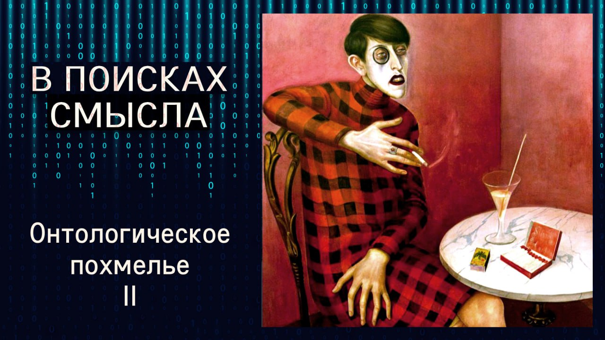

# Онтологическое похмелье

01 ноября 2025 г. [Аудиоверсия](https://paradoks-pinkera-pilotnyy-vypusk.simplecast.com/episodes/the-ontological-hangover) 18:24

После философской дискуссии с Сергеем Григоришиным,мы с Павлом пытаемся "протрезветь" и разобраться,  в чем же суть нашего несогласия с Сергеем.

Переводим с философского на человеческий: что значит "первичная данность частного бытия" и почему деревенская бабушка может быть ближе к полноте существования, чем философ.
Проясняем ключевое различие: экзистенциалисты считают, что сначала мы живём, потом ищем смысл, а православная традиция — что смысл существует до нас.
К концу наконец понимаем друг друга и готовы к новому раунду.

**Е.Голуб:**
Здравствуйте, друзья!
В эфире очередной выпуск подкаста «В поисках смысла».
У микрофона, как всегда, Евгений Голуб.

**П.Щелин:**
И Павел Щелин.

**Е.Голуб:**
Этот выпуск мы записываем вдогонку предыдущего.
Если вы услышите его в эфире, значит, наше обсуждение, которое не планировалось, прошло успешно.

В прошлый раз мы погрузились с Сергеем Григоришиным, кандидатом в философских наук, глубоким мыслителем, в размышления о сути человека и человечности.
Этот разговор оставил меня в некотором недоумении, недосказанности, поэтому я решил попросить Павла продолжить разговор отдельно с ним, а потом, может быть, мы вернёмся к нему с Сергеем.

Итак, если я правильно помню, тебе в позиции Сергея всё было ясно, ты смог её проговорить, и Сергей подтвердил, что ты её понял.
Не мог бы ты сейчас воспроизвести эту позицию, как ты её понял?

**П.Щелин:**
Ну, давай так.
Сергей выступал с позиции экзистенционализма в широком смысле этой традиции.
То есть он последовательно подчеркнул, что он не привязан к конкретной фамилии, а скорее привязан к общей традиции как таковой.
Назвал множество имен, из которых он черпает свое понимание.
И именно из этой позиции он пытался дать ответ на вот этот фундаментальный вопрос о сущности человека, человечности перед лицом, ну, в том числе и тех, технологических вызовов, которые мы с тобой обсуждаем на всем протяжении этого подкаста.

Базовый принцип экзистенционалистского подхода заключается в первичной данности частного бытия.
Вот если бы я пытался суммировать это одним предложением, то я бы тебе его ответил именно так.

**Е.Голуб:**
Что такое первичная данность?
Из этого всего понятно только слово «первичная», да и то не полностью.

**П.Щелин:**
Первичное, если угодно, в начале с онтологической точки зрения есть, то есть существует, данность.
Данность — это единство опыта, то есть это не только интеллектуальное, но это, можно сказать, вот то самое духовное, душевное, физиологическое, вот цельное, то есть некое цельное единство опыта, то есть данность.
В философии это называется, особенно в философии Гуссерля, который оперировал Сергей, частного, то есть вот твоего личного, моего личного бытия.

**Е.Голуб:**
А что значит «в начале»?

**П.Щелин:**
В начале познания, в начале взаимодействия с миром.
Вот это интересно.
С философской точки зрения получается то, что в строгом смысле в начале твоего опыта, то есть в каком-то смысле в начале твоего мира, в начале твоего рассказа, в начале твоей истории, то есть в начале как таковом.

**Е.Голуб:**
Ты начинаешься с себя.
Хорошо.
Когда и если в этом опыте появляется опыт взаимодействия с трансцендентным?
Он же может появиться, а может не появиться, так?

**П.Щелин:**
Правильно.
Сергей говорил, что вопрос онтологии — это вопрос выбора, по сути.

**Е.Голуб:**
Так, теперь медленно и по частям.

Что значит вопрос онтологии?
Как его задать?
«Вопрос» для меня — это предложение, за которым можно поставить вопросительный знак в конце.
Вот ты задай мне вопрос онтологии.

То есть это как мы воспринимаем бытие?
Это, в принципе, вот эта метафизическая картина мира?
Разъясни мне человеку без философского образования.

**П.Щелин:**
Но опять, Сергей, может быть, нас поправит, но как я понял его позицию, то что если существование — это еще безусловная данность, то вот моё существование, твоё существование, существование твоих алкоголических соседей, о которых мы говорили в предыдущем нашем выпуске, то вопрос о бытии и меня, и тебя, и твоих соседей — это вопрос, поставленный мной, тобой, каждому из них, вопрос о своем собственном бытии.
Пока вопрос не поставлен, есть только существование.
Существование есть, а бытия в онтологическом смысле нет.

**Е.Голуб:**
Тогда я буду мучать тебя, раз назвался философом, полезай в кузов.
Существование, ну вот экзистенция, собственно, exist.
Английское слово, наверняка, от латыни.
Понятно.

А что такое бытие в онтологическом смысле?
Что значит быть бытие?
Если я не задаю себе вопрос, где моё место в мире, то я не бытийствую.
Так что ли?

**П.Щелин:**
То ты в полной мире не бытийствуешь, да.
То есть если в строгом смысле ты так и не поставил вопрос о собственном бытии из позиции первичного опыта своего бытия, то ты так прожил свою жизнь немножко знаешь

> а если вы не живёте, то вам и не умирать.

Если вы существуете, то вам и не бытийствовать.
Вот примерно в таком вот виде.

**Е.Голуб:**
То есть вопрос о бытии подразумевает вопрос об отношениях между мной и окружающим миром.

**П.Щелин:**
И окружающим миром, причём в предельном ещё очень.
Вот ты упомянул транседентность, в том числе вопрос о предельности.
Радикально предельном смысле.
А бытие как таковом.
Все вопросы ты начинаешь задавать и ставить о них вопрос.
Очень важно в этой оптике, что в каком-то смысле невозможность универсального ответа на этот вопрос.
Каждый ответ всё равно будет контекстен твоему бытию.

**Е.Голуб:**
Итак, человек существует, но не бытийствует до тех пор, пока он не задался вопросом о своём месте и своём отношении с окружающим миром.
Назовём это так.
То есть бытием.
Такое бытие, как окружающий мир.

Если человек не задаёт этих вопросов, не входит в отношения осознанные с окружающим миром в таком смысле, о котором мы с тобой договорились, то он не бытийствует в онтологическом поле или как?

**П.Щелин:**
Как я понимаю с точки зрения экзистенциализма, я сам, честно говоря, удивился радикальности этой позиции.
Для меня такая честная, интересная, но радикальная позиция, что да, в полной мере он и небытийствует.
В полной мере к нему даже категория «есть» не до конца применима.

**Е.Голуб:**
Хорошо, но это не отвечает на вопрос, что такое человек и человечность, потому что это вообще, на мой взгляд, другой вопрос.

**П.Щелин:**
А вот с точки зрения экзистенциализма, ответ будет, что человек — это тот, кто ставит вопрос.
Вот поставил вопрос о человечности — молодец.
Поставил вопрос о своем бытии — начал бытийствовать.

**Е.Голуб:**
Ну хорошо, вот чат GPT может задать такой вопрос.
Я могу сказать, давай, промпт дам, скажу, а задай вопрос о своем бытийстве, задумайся, покажи мне, как ты размышляешь о своем бытийстве.
Он, бац, тебе выдаст текст или голосом скажет, очень приятным.

**П.Щелин:**
Это low-hanging fruit.
Если я усиливаю экзистенциалистский аргумент, я скажу, из самого себя.
Ты должен начать задавать этот вопрос из самого себя, а не из промпта.
Но вот вопрос, если чат GPT сам себе задаст промпт о собственном бытии...

**Е.Голуб:**
То с точки зрения экзистенциалистов он станет человеком?

**П.Щелин:**
Я склонен считать, что да, но вот это тот вопрос, который я бы задал Сергею, если у нас будет с ним беседа.

**Е.Голуб:**
Мы зададим, я хочу довести вопрос до конца.

Когда экзистенциалист говорит о том, что пока человек не закуклится и не задаст себе этот вопрос, помнишь, мы там говорили?
Закуклиться, раскуклиться.
То, значит, вначале он должен это сделать, закуклиться, а потом идти дальше.
В то время как наша позиция с тобой здесь, я с тобой солидарен, что ему нужно поднять голову вверх, стать антропусом, как мы знаем.
И в этом смысле он только тогда становится антропосом человеком.
Это как ты любишь говорить.
Антропос — это кто?

**П.Щелин:**
Человек, направленный вверх, стремящийся вверх, смотрящий вверх.
Ну вот это всё.

**Е.Голуб:**
Смотрящий вверх.
Homo sapiens — это вид, а антропос — это Homo sapiens, смотрящий вверх.

**П.Щелин:**
Очень интересно, что sapiens как бы нас зацикливает только на разуме, а антропос задаёт направление.
Очень важно, он сразу задаёт логику диалога.

**Е.Голуб:**
И с точки зрения экзистенциалиста смотреть вверх нужно только после того, когда ты себя посмотрел как следует каким-то образом.

**П.Щелин:**
С точки зрения экзистенциалиста вопрос о смотрении вверх может возникнуть только как следствие или результат твоего вопрошения из самого себя.
То есть сначала внутрь условно и только потом вовне.

**Е.Голуб:**
То есть ты сначала, для того чтобы задать вопрос вверх или посмотреть вверх, нужно осознать себя как субъекта, который может задать этот вопрос по мнению экзистенциалистов.
Спросим у Сергея.

**П.Щелин:**
Я понял так.
Имею основания надеяться, что это близко к пониманию.
Мой ответ в том, что я отрицаю саму такую логику.

Для меня это вообще происходит отношение, вот этот вверх и вниз выступает как подобие, точно так же, как существование и бытие тоже не решается через логическую последовательность.
Другими словами, даже если я не поставил вопрос о своем бытии, то я все равно бытийствую, а не просто существую.
Но не потому, что я такой прекрасный, а потому, что во мне существует вечность.
Именно благодаря духу энергии вечности во мне, даже до того, как я поставил этот вопрос, я уже в каком-то смысле ей сопричастен.
А вот когда я разворачиваюсь наверх, я уже тут, скажем так, связь, канал, поток усиливаю.

**Е.Голуб:**
Я могу сказать тебе просто, даже если я не строю отношения с вечностью, вечность со мной отношения строит.

**П.Щелин:**
Уже построила, да.

**Е.Голуб:**
То есть я могу их не знать, не чувствовать, отворачиваться, прятаться в бутылку или куда-то ещё.

**П.Щелин:**
Но их бытие уже реальное, оно есть, и оно в каком-то смысле предшествует вопросу о моём с ними бытии.
В псалмах об этом говорится, что «ещё в утробе матери моей ты знал меня».

**Е.Голуб:**
Теперь понятно.
Очень здорово, что мы об этом поговорили, я считаю.

Теперь давай тебя прояснять.
Смотри, я знаю, что для многих людей неочевидна даже формальная логика Аристотеля, не говоря уже о диалектике.
Поправь меня, если я ошибаюсь.
Диалектика соотносится с формальной логикой, как законы Ньютона, соотносятся к следующему уровню познания мира, к квантовой физике и так далее.

Если закон Аристотеля, формальной логики, главный — это, скажем, закон исключения третьего, то как раз законы диалектики или, скажем так, платонизм как таковой, он подразумевает то, что говорят о синергийности, слиянии, вот это «не слитно, не раздельно», вот то, что говорят о Троице, — это как раз платоновское мышление, не аристотелевское.
И в этой связи можно сказать, что экзистенциализм как раз есть взгляд аристотелевский, о чём Сергей говорил, о том, что я — это я, Бог трансцендент — это трансцендентное, и у нас между этими объектами строится отношение.
А ты говоришь с субъектами.

**П.Щелин:**
Там был тезис о том, что для него условно Бог является в каком-то смысле частным случаем бытия как такового, просто очень крутым, большим и максимальным.

**Е.Голуб:**
А не всем бытием.

**П.Щелин:**
Угу.

**Е.Голуб:**
Хорошо, а ты говоришь о том, что есть отношение подобия, ну не ты, а христианская или православная теология, есть отношение подобия, которое как раз находится в логике, если так можно сказать, в диалектике Платона.
Могу ли я так грубо выразиться?

**П.Щелин:**
Правильно сказать, что из классической философии платонизм ближе к этому подходу.

**Е.Голуб:**
Хорошо.
Итак, о чём же ты говоришь, чем определяется человечность тогда?
Мерой уподобления?

**П.Щелин:**
Мерой обожения, по сути, да.
Мера обожения и есть меры человечности.

**Е.Голуб:**
То есть, другими словами, Христос есть единственный человек в полной мере, а все остальные настолько люди, насколько они приближаются к этому идеалу.

**П.Щелин:**
Приближаются к воплощению этой личности.
Но тут уже, если мы вступаем на православную позицию, здесь тот парадокс, что только стремясь к обоживанию, воплощению Христа, я воплощаю самого себя.
То есть нет вот этого разрыва между моим аутентичным, прости Господи, бытием и моим божественным смирением.

С православной позиции только, собственно, через логику смирения и раскрывается искренность моего аутентичного бытия, именно в том числе даже в экзистенциальном смысле "дозайн".
Только вот условно для экзистенциалистов "дозайн" возможен в вакууме, условно, без этого контекста.
А в православной логике сама постановка вопроса имеет смысл только в контексте моего обоживания.
То есть без контекста Христа меня нет в буквальном смысле.
Даже вопросы о моем бытии поставить невозможно.

**Е.Голуб:**
Хорошо, давай я сейчас буду опять-таки, так как у нас курс философии или православная теология для чайников, я выдам такую концепцию.

Человек появляется на свет с двумя потенциями — потенцией собственной воли своей и волей Бога.
Воля человека может быть направлена либо в том же направлении, назовём, как воля Бога о нём, и тогда возникает эта синергия, и тогда он имеет шанс воплотиться в полную меру самого себя, потому что уникальность человека в том, что он подобен Богу.

А может эта воля идти поперёк или в обратную сторону.
Это свободная воля, это уникальная часть, чем мы обладаем.
И вот тогда, говорит экзистенциалист, что сначала идёт воля человека.

**П.Щелин:**
Тоже нормальное бытийствование.

**Е.Голуб:**
То есть может бытийство идти поперёк, его собственный выбор.

**П.Щелин:**
Но не вопреки собственного бытия.
Там вот это тоже парадоксально решается.
Худшее, что можно сделать, насколько я понимаю, в экзистенционалистской парадигме, не ставить вопрос о бытии.
То есть не бытийствовать.
Опыт бытийствования предшествует разговору о направлении этого бытийствования.

**Е.Голуб:**
А я вот вернусь к своему самому любимому образу деревенской бабушки, которая восприняла веру от своей матери, как смогла, и всю жизнь двигалась к воплощению себя через следование заповедям, проявление в жизни повседневной их человеческих качеств.
Она вопроса о бытийстве не ставила, но волю свою по мере сил старалась сопрягать с волей Божьей.
И что с точки зрения конституционалиста, я понимаю, что это такой пример условный, но она не существует, так как она не задала такой вопрос, она сразу подчинила себя поиску воли Божьей о ней.

**П.Щелин:**
С моей точки зрения, да, здесь будет разница.
Для меня опыт этой бабушки — это и есть опыт предельного бытийствования.
Гораздо ближе к опыту предельного бытийствования, чем Хайдеггер ставящий вопрос о предельном бытийствовании.

**Е.Голуб:**
То есть фактически предельное бытийствование с позиции православной — это предельный отказ от бытийствования с позиции экзистенциальной.
То есть мы не ставим вопрос, мы слушаем волю, мы смиряемся, мы как раз эту волю в себе умаляем для того, чтобы сочетать себя с волей Божьей.

**П.Щелин:**
Да.
Но парадокс в том, что в этом умолении она и реализуется максимально сильно.
Вот если брать православную логику, в кавычках логику, я бы ее формулировал вокруг ключевых понятий, как подобие, парадокс, однозначно.

**Е.Голуб:**
Хорошо, тогда давай еще раз, я немножко последнее сделаю усилие интеллектуальное, выскажусь, а ты оценишь мою правоту или неправоту.
Простыми словами.

Мы говорим о том, что человек появляется с потенцией раскрыться в своей полноте, сочетаясь с Богом в полноте.
И это сочетание уникальное.
Он уникальным образом воплощает замысел Бога о себе и в этом смысле обретает предельную полноту и предельную красоту себя как человека.

**П.Щелин:**
И здесь важно дополнить просто где разница, что замысел о человеке первичнее воплощению этого замысла.

**Е.Голуб:**
Да, но я это и пытался понять, что замысел — это некоторый ДНК, условно.
Не знаю, плохое сравнение, потому что оно, наверное, не так обречено воплотиться с неизбежностью, как ДНК, но есть замысел о человеке.

**П.Щелин:**
Тот самый Логос.

**Е.Голуб:**
А воплотиться он или нет зависит от того, сочетает ли человек свою волю с волей Божией или какой мере он воплотится.

**П.Щелин:**
В каком-то смысле именно потому, что замысел предшествует воплощению этого замысла, то и бытие этого человека, даже если он не поставил о нём вопрос и не в курсе его собственного, всё равно реально имеет ценность уже сейчас.

**Е.Голуб:**
А вот здесь надо прояснить, а в чём же его ценность, если она не воплощается?

**П.Щелин:**
Ценность не как цена, да?
Вот условно то, что, во-первых, даже в твоих соседах-алкоголиках сохраняется возможность для этого, для более полного раскрытия.

**Е.Голуб:**
Потому что замысел в них присутствует в любом случае, да?

**П.Щелин:**
А во-вторых, в какой-то мере, пока человек жив, какую-то долю искорки он полностью, человек из себя этого убрать не может, вплоть до смертного часа.
То есть в каком-то смысле Бог живёт в человеке, пока человек ещё живёт.

**Е.Голуб:**
Хорошо, выдыхаем.
То есть говорим о том, что в этом смысле жизнь человека обретает смысл только тогда, когда он сознательно, добровольно, отсекая свою волю, хочет соответствовать замыслу о себе.

**П.Щелин:**
Вот слово «отсекая» тоже не совсем точно.
Жизнь человека приобретает более полный смысл, больший смысл.

Повторюсь, смысл жизни предшествует жизни.
Если я бы проводил разницу, у экзистенциализма жизнь предшествует смыслу жизни, а в православной логике смысл жизни предшествует жизни.

**Е.Голуб:**
Хорошо, я думаю, на этом мы можем сейчас остановиться, потому что мы сейчас вышли опять на новый горизонт понимания, для которого нам может требоваться еще кто-нибудь.
А пока мы завершим этот выпуск между предыдущим Сергеем и, может быть, следующим Сергеем, чтобы поставить здесь точку об отношениях между экзистенциалистами и кем?

**П.Щелин:**
Ну, в данном случае, православной традицией, да.
Притом то, что нужно понимать, Сергей последовательно говорил, он сам часть теистической традиции, то есть Сергей не выступает с позиции атеизма.
В атеизме, по-моему, вопрос вообще непонятно, как этот можно поставить.

Мне кажется, под конец вот эту разницу мне будет интересно, если он поддержит, что, мне кажется, она действительно очень существенная, и она часто встречается в наших дискуссиях на самом деле.
То, что первичнее жизнь или смысл жизни.
И вот в той оптике, которую я отстаиваю, надеюсь, что это православная традиция, смысл жизни предшествует жизни, хотя он и раскрывается через жизнь.
А в экзистенциалистской оптике первичен именно факт жизни, а уже потом наполнение смыслом рождается из факта этого бытия.

Тебе так понятнее вот эта аналогия?

**Е.Голуб:**
Абсолютно.
Слава тебе, Господи, что мы проговорили сегодня, потому что от прошлого разговора осталось такое не очень приятное ощущение, что я как будто бы закрывался от того, что мне хочет сказать Сергей, а ты мне помог сейчас.
Я надеюсь понять Сергея.

**П.Щелин:**
Ну вот сейчас, проведя эту беседу, как бы ты для себя, скажем так, сформулировал основную эту разницу между двумя подходами?

**Е.Голуб:**
Но вот ты её прекрасно вырезала, я просто могу повторить твои слова.
Я считаю, что это предельно ясно.

Если смысл предшествует жизни, хотя нам это представить сложно, мы привыкли думать в этом смысле, нам понятнее экзистенциалисты.
То есть сначала человек рождается, обретает смысл.
А мы говорим, нет, смысл существует до рождения, а человек либо воплощает его в большей мере, либо в меньшей мере.

**П.Щелин:**
Нам теперь осталось будет объяснить, какое всё это отношение имеет к нашим искусственным интеллектам.
На самом деле самое прямое, но...

**Е.Голуб:**
Об этом мы поговорим в следующий раз.
Слушайте продолжение в следующих выпусках подкаста.

Всего вам доброго.

**П.Щелин:**
Всего доброго.
