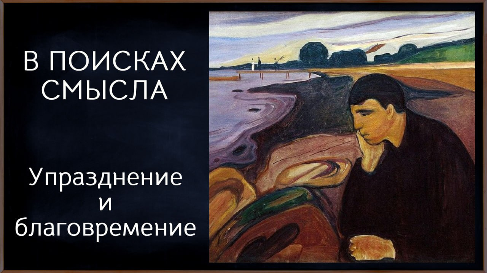

# Упразднение и благовремение.

06 апреля 2026 [Аудиоверсия](https://www.youtube.com/watch?v=B-nso_iZrBU) 24:12

Продолжая разговор о смыслах, Павел и Евгений задаются вопросом: если прокрастинация — это тупик, то почему лихорадочное действие ради действия — не выход?
 
Мы живём в мире нарастающей скорости: каждое поколение существует в более стремительном потоке информации, событий, обновлений.
Постоянный мониторинг новостей создаёт иллюзию контроля — кажется, что, следя за происходящим, мы на него влияем. На деле творческая энергия уходит в песок, и наступает выгорание.
 
Авторы предлагают неожиданный первый шаг — не ускорение, а торможение.
На церковнославянском это называется «упразднение»: способность остановить свою первую страстную реакцию, отпустить идола календаря и планов, принять,
что будущее не в нашей власти.
Здесь появляется забытое русское слово «благовременье» — доверие тому, что всё случится в своё, благое время. Категория не иррациональная, а сверхрациональная:
рационально объяснить плоды доверия можно, но рационально заставить себя довериться — нельзя.
 
Любопытно, что современная психология заново открывает черты, давно известные монашеской традиции: саморефлексию, удержание внимания,
способность видеть за потоком фактов длинную историю.
Молитва, аскетическая практика, даже простое чтение осмысленного текста вслух — всё это формы того самого торможения,
которое в эпоху информационной бомбардировки становится залогом сохранения здравомыслия и человечности.

**Е.Голуб:**
Здравствуйте, дорогие друзья. Ну что ж, очередной выпуск подкаста «В поисках смысла». У микрофона я, Евгений Голуб.

**П.Щелин:**
И я, Павел Щелин. Здравствуйте.

**Е.Голуб:**
Мы несколько предыдущих выпусков поднимали достаточно-таки непростые темы.
Мы перестали, насколько это возможно, забывать о смертности своей.
И, возможно, даже вот эта память смертная помогла нам встряхнуться в следующий вопрос.
А что дальше-то делать?

Мы попробуем сегодня порассуждать, исходя из такой точки рассуждения, что в некотором смысле активное делание может быть не менее губительным или не полезным, скажем, чем вот это вот безвольное прозябание от сериала к компьютерной игрушке и так далее.

**П.Щелин:**
Тут, на самом деле, целый цветок, если угодно, связанных феноменов, о которых мы попробуем поговорить.
Какая из них нам откроется, то, наверное, будет хорошо.

Начну с того, что особенность нашего такого современного бытия, да не только современного, а если мы посмотрим на историю на поколенческом неком графике, то последние 400 лет в особенности, она беспрецедентно ускоряется.
Каждое следующее поколение как будто живёт всё в более и более быстром мире.
В мире, в котором происходят постоянно апдейты, обновления, установки на какую-то перемену.
И каждый из нас в своей жизни, как следствие, тоже начинает постоянно воплощать этот принцип скорости.

Вторая ложная пара — безволие, о котором мы говорили, апатия и прокрастинация.
Она же неслучайно называется часто в литературе «выгорание».
Но выгорание предполагает, условно говоря, избыточное использование горючего материала.
То есть у тебя был некий горючий материал, и оно, соответственно, что-то куда-то выгорело.

В принципе, очень большой тоже такой классический современный императив постоянно что-то делать.
То есть очень многим людям возможность именно поставить паузу становится практически недостижимой.
При этом эта пауза необязательно про действие.
Эта пауза может быть про действие ума.

Например, наше потребление информации в современных условиях тоже полностью связано с этими феноменами скорости и выгорания.
Ну элементарно.
Мы получаем новости в течение часа.
Представьте просто элементарный момент.

Вы живёте даже в XIX веке в каком-нибудь губернаторском городе.
К вам пришла газета, о которой вам рассказали, что там случилось.
И то это уже очень быстрая информация, вам даже газета пришла.
В 18 веке вам могли новости дойти через месяц после того, как они случились.
Вы просто это получаете как информацию.
Ну, случилось и случилось, какая-то история состоялась.

А сегодня мы живем в эпоху, когда скорость получения информации рождает иллюзию контроля.
Нам кажется, что через свою информированность о событиях, через мою постоянную вовлеченность, если я условно мониторю боевые действия в режиме онлайн, я лично их контролирую.
На этом же построен, допустим, если я мониторю эпидемию, если там голодающие дети Африки, то есть вот эта вся история, то я, соответственно, могу влиять.
То есть я своим вниманием, соответственно, рождаю, так сказать, проецирую ту самую свою волю.

Это является, кстати, разводкой действительно правильного феномена, но в нынешнем мире вот это ускорение лишь приводит к тому, что я свои творческие силы, они уходят действительно в песок.
И потом у меня уже случается, собственно, выгорание.
Всё это подводка к тому, а что, соответственно, делать.

А делать мы можем то действие, которое, на самом деле, для нас очень непривычное.
То, что в церковнославянском называется «упразднение».
Или то, что в психологии мы можем назвать «торможение».
В общем, развить в себе первые тормозительные реакции, заметить в себе реакции ускорения.
И когда просто начать это практиковать в своей жизни, уже даёт гораздо большую точку опоры.
Я могу потом говорить, каким образом она его отдаёт, но есть какая-то реакция на то, что я говорю, в себе замечаешь, не замечаешь?

**Е.Голуб:**
Это, откровенно говоря, достаточно уже прожитые мной моменты, поэтому ты когда говорил, я так слушал - да, да, а что дальше будем говорить?
Конечно же, здесь очень много примешивается в психологии, когда мы понимаем, что наши нейрончики или что там у нас, даёт нам ощущение наслаждения дофамина.
И мы понимаем, что это наркотическая такая зависимость на самом деле.

С одной стороны, мы лелеем наши страхи или пытаемся от них избавиться, иллюзиями такими.
А с другой стороны, ну как вот собака лижет пилу, известный образ, и пьянеет от своей крови.
И вот мы пьянеем от ощущений вот этих эмоциональных.
И, к сожалению, в этом нетрезвом состоянии двигаемся всё дальше и дальше, пока язык, видимо, у нас не отвалится.

**П.Щелин:**
Правильно.
Упразднение здесь, оно противостоит это каким образом?
Оно на самом деле очень сложно.

Приведу пример из личной жизни.
Как ты знаешь, мы запустили англоязычный канал.
И у меня были определенные ожидания того, каким образом это будет происходить, с какой скоростью, с какой интенсивностью, куда оно пойдет, куда оно приведет.

Эти ожидания, мягко говоря, не оправдались тем образом, который я хотел.
И у меня первая реакция была реакция страстная.
То есть достаточно у меня появилось там раздражение, злость, гнев и так далее, и тому подобное.

Потом уже я, соответственно, задумался, откуда оно пришло.
А пришло оно из того, что я в своем, скажем так, опьянении, ты можешь сказать, подумал о том, что какая-то моя информация, какой-то мой профессиональный опыт дают мне реальную возможность контролировать будущее.
То есть я вот делаю некие определенные действия, и оно должно привести к такому результату.

Страх современного человека, он во многом строится на этом же самом механизме.
Мы искренне очень сложно воспринимаем, когда что-то идет не по плану.
Кофе я с утра не выпил, весь день пошел насмарку.

**Е.Голуб:**
Слушай, ну тут можно приводить примеры сотнями из повседневной жизни.
Особенно это выбивает людей тревожных.
Или склонных к какой-то депрессивной реакции, потому как несоответствие происходящего картине, представленной или плану воспринимается как угроза всему.

Мир неуправляем.
Как так? Это что значит?
Вообще с любой момент может случиться всё, что угодно, а мы же планируем, у нас же расписание, у нас же график, у нас же планы на отпуск.
Вот мы тоже ездили с женой в отпуск, я что-то себе запланировал, как это должно пойти, а пошло всё, мягко говоря, не так.
Я-то, честно сказать, уже давно живу, и, в общем, берём то, что получается.
Но раньше, я думаю, у меня было бы очень много расстройств, очень много эмоций.

**П.Щелин:**
Ты упомянул важное слово «тревожность», да?
Мы действительно живём очень тревожными, и эта тревожность рождается именно из восприятия неконтролируемого времени.
Как человек сам невротичного типа, я склонен воспринимать будущее как зону неопределённости, а неопределённость у меня всегда первая естественная реакция, рождает тревогу.

Так вот, вся практика торможения и упразднения направлена именно на то, чтобы помочь научиться встречаться со временем без страха.
И парадоксальным образом даже в моей жизни единственный способ, которым мне удаются маленькие шаги в эту сторону, — это именно через то самое упразднение.
Через принятие отсутствия контроля, или, правильнее сказать, через принятие некой иллюзорности контроля.

Конечно, это не значит, что я вот вообще там условно в календарь ничего не поставлю, но идола я из этого делать не буду.
Пытаюсь научиться не делать из своего представления о будущем идола, который, соответственно, должен случиться, а если он не случился, то все, катастрофа, пожар и так далее и тому подобное.
То есть признание того, что не я контролирую эту историю, но я доверяю тому, кто контролирует эту историю.

**Е.Голуб:**
Давай я немножко тоже над темой порассуждаю.
Получается, мы с тобой затронули тему небытия в прокрастинации, в тревоге, с одной стороны.
С другой стороны, мы сейчас переходим к другой крайности — идолу календаря.
Вот этот вот календарчик, всё написано, как же так, всё.
Значит, нужно планы соблюдать, а если не соблюдается, то эта тревога возрастает многократно.

У меня сегодня тоже такая интересная ситуация произошла.
Должна была быть встреча с человеком на довольно важную тему.
Человек не появился.
Я попытался испытать какой-то гнев.
Не было у меня, слава тебе, Господи.
Я подумал, если эта встреча была важна не только для меня, если человек не появился, не позвонил, не обозначил себя, то совершенно не обязательно значит, что он на меня забил, и я ему не важен.

Так и оказалось, что человек попал в аварию.
Ничего страшного, но вот новая машина, в стрессе.
Понятно, что… Забываем мы, не до встречи, мы забыли, мы в панике.
Это же всегда такая эмоциональная история.
Ну и что?
Я посидел, слава богу, в тишине, выпил чаю.
Ничуть об этом не жалею.

А раньше у меня начало кровь приливать.
Ну как же так?
Можно было позвонить.
Вот это благостное состояние принятия неожиданного, в общем, я его очень вам рекомендую.
Я не знаю, у тебя есть уже такое?

**П.Щелин:**
Божьей милостью, какие-то иногда случаются моменты, я пока ещё совсем не настолько двинулся по этому пути, но я точно понимаю его важность.
Ты знаешь, вот это есть такое русское слово, которое, мне кажется, требует вспоминания в XXI веке — благовременье.

**Е.Голуб:**
Воблаговременье, да, вот это в нашем приходе любили говорить такое.
Это произойдёт воблаговременье.
Когда?

Во благо времени.

**П.Щелин:**
Это на самом деле очень радикально меняет все отношение со временем.
Если ты включаешь в свое взаимодействие вот этот элемент доверия, то есть ты это можешь сделать только через упразднение и торможение, то тогда перемены перестают быть катастрофой.
А здесь вот это фундаментальная проблема.

Время – это действительно категория изменчивости.
Время – это мера движения, соответственно, мера – это категория изменчивости.
Движение полагает изменение точки А в точку Б, ну, физически, даже просто если смотрим на физическую характеристику.

Важно признать, что, конечно, в любой изменчивости действительно содержится потенциал катастрофы.
Потенциально из любой перемены можно придумать такое развитие ситуации, которое будет катастрофично.
Это вот то, что философская категория «потенциально».

Под тревожностью современного человека есть рациональное основание.
То есть любая перемена действительно может привести к твоей личной катастрофе.

**Е.Голуб:**
Ты говоришь о том, что в тревожности у человека есть рациональные основания.
Я говорю о том, что так как у этого человека ничего, кроме рационального основания, нет, то именно поэтому она у него может развиваться в любую катастрофу.
А если ты, как некоторые известные люди, в общем, творишь Иисусу молитву и доверяешь Богу каждый день, то у тебя нет оснований для катастрофизации любой неожиданности. Ну, значит….

**П.Щелин:**
Я-то считаю, что у тебя основания сохраняются, но они преодолеваются.
Преображаются сверхоснованием того самого доверия, о котором ты говоришь.

**Е.Голуб:**
Я вот здесь с тобой начну немножко спорить.
Катастрофа — это действительно что-то объективно существующее.

**П.Щелин:**
Я люблю доводить до предела.

**Е.Голуб:**
Я именно туда и хотел тебя направить.
Обычно здоровье, да?

Смерть Ивана Ильича — любимое мое произведение последних дней.
Споткнулся, упал, ударился, вроде как ничего страшного, а через время оказалось, что с почкой что-то произошло.
Если у тебя там на ноге выскочила какая-то маленькая бульбочка, то вполне может оказаться и онкологической бульбочкой, а может быть следствием чего-то другого, да?
Так что да, потенциал в этой неожиданности, катастрофе есть.
Но вот дальше я как-то это с тобой расхожусь. И что?

**П.Щелин:**
То есть я могу выбрать об этом тревожиться, а я могу выбрать довериться вот этому поэту неба и земли, благовременью.
И то, что даже если там эта бубочка такая, которая плохая, то это тоже в этом есть какой-то благовременный смысл.
И тогда это перестаёт быть катастрофой.

**Е.Голуб:**
Ну то есть всё-таки это снятие катастрофизации, да?
То есть ты говоришь, оно сохраняется, но основание другое.
Либо катастрофа есть, либо катастрофы нет.

**П.Щелин:**
Оно не то что снимается, но оно как бы переплавляется.
Онтологическое некое основание сохраняется, но оно преображается в нечто действительно совершенно другое.
Но это возможно только через доверие.

Мы до этого записывали на Кухню подкаст, где мы там говорили про то, что если бы выборы были рациональными, мы бы все в раю были.
Вот то же самое.
Рационально не переживать.
Но если бы это было рационально, все бы это делали.

Мне кажется, одна из наших ошибок, и вот по ходу подкаста мы это говорим, нам предлагают ложную дихотомию между рациональным и иррациональным.
Рациональное и нерациональное.

**Е.Голуб:**
Ну да, я скажу, что многие наши слушатели именно так и понимают это всё.

**П.Щелин:**
А я-то говорю о том, что есть категория сверхрационального.
Вот то, о чём мы говорим, оно не иррациональное, но его тоже нельзя свести к рациональному.
Оно сверхрациональное.

Вот, например, доверие — это сверхрациональная категория.
Я постфактум могу тебе описать очень много благих плодов доверия и сказать, что доверие это будет рациональным выбором в той или иной ситуации, но я никогда себя рационально доверять не заставлю.

**Е.Голуб:**
Да. И доверять, и верить.

**П.Щелин:**
И не переживать.
Тоже вот это не переживание, то есть упразднение и прочее, торможение.
В этом есть много рациональностей постфактум, но на самом деле я думаю, что сегодня, особенно если мы понимаем весь этот большой временной контекст, вот этот факт торможения, факт открытости временным событиям, какими они не были бы, является своего рода мини-подвигом вот этим сверхрациональным актом.

Но ирония в том, что только через него человек, мне кажется, и может получить вот эту точку, из которой только и будет, возможно, умное действие.
Не тревожное действие, не избыточное действие, а умное действие.

**Е.Голуб:**
Вот здесь каждое слово, мне кажется, важно, про действие тревожное и избыточное, потому что избыточное действие — это как бы ну так уже перестраховаться, чтобы тут вообще и так, и так, и так, и ещё, значит, проездной, два талончика и проездной, избыточное действие.
Так вот, вот эта основа сверхрациональная, это отношение автоматически обрезает вот эту информационную всю атаку, потому что неинтересно.
Да, там в курсе быть, да.
Реально, ковыряться во всём этом новостном деле становится будто бы не особенно нужно.

**П.Щелин:**
Абсолютно полностью с собой согласен.
Что, интересно, сегодня делают современные психологи?
Они отмечают черты человека, который обладает, ну, демонстрирует контуркультурную здоровую тенденцию в современном информационном обществе.

Какие характеристики они у этого человека видят?
Они видят у него характеристику, способность к саморефлексии, то есть к пониманию, почему я чувствую...
Понимание, скажем так, что во мне поднялось в какой момент, то есть почему я гневаюсь, почему я злюсь или почему я радуюсь и так далее, чем я движим в тот или иной момент.
Этот человек способен удерживать большую картину, то есть преобразовывать информацию в историю, из информации в историю, то есть из набора фактов рождать смысл этих фактов.
Это на самом деле сегодня очень редкое качество, потому что на практике мы все собираем калейдоскоп фактов, но что это все значит, мы вообще понятия не имеем.

**Е.Голуб:**
Минуточку, я скажу иначе.
Мы собираем не калейдоскоп фактов, а калейдоскоп истории, которые нам рассказывают другие.
Вот скорее.
Потому что есть мнение, что событие становится фактом только тогда, когда оно обрело интерпретацию у достаточно значимого количества людей.

**П.Щелин:**
Ну да, мы собираем калейдоскоп истории, но свою историю собрать из этого не можем.
Базовый смысл в том, что все эти черты, которые мы заново как бы переоткрыли с чувством такого, знаешь, как это вот ученые доказали, вообще все они свойственны любой монашеской практике.

Тут тебе и практика удержания внимания, тут тебе и практика саморефлексии, тут тебе и практика длинного вот этого горизонта.
Возможности видеть вот это любой момент в контексте длинной истории, длинного горизонта, причем не только длинного горизонтального, но и длинного вертикального.
И оказывается, что вот с прикладной точки зрения монашеские практики оказываются очень прикладными и необходимыми для современного человека.

Вот тут часто спрашивают вопрос, что делать.
Вот когда я говорю о практике упразднения и торможения, я предлагаю вам с этой точки зрения посмотреть на такое известное слово вам, как молитва, на полном серьёзе.
Непонятно, зачем это делать.
Исходя из личного опыта, это можно делать хотя бы просто для того, чтобы затормозиться.
Просто как даже некое действие, которое позволяет тебе в момент, когда ты чувствуешь своё ускорение, которое ты чувствуешь, что ты начинаешь сам себе не принадлежать.
Вот в тот момент, если ты затормозил или перенаправил внимание наверх, то это очень сильно, кто-то скажет, заземляет и так далее и тому подобное.
Намеренно максимально это перевожу на тот, скажем так, пример, возможно, доступный и понятный слушателям.

Возможно, что сегодня прикладное значение молитвы, именно прикладное, не онтологическое, а просто прикладное, становится ещё гораздо больше, чем для наших бабушки, дедушки, пра-пра-прадеда.
Потому что, мне кажется, в эпоху скорости информации, в эпоху искусственного интеллекта, в эпоху постоянно бомбардировки моего внимания различными сигналами.
Посмотри тут на кота, посмотри тут на этот пиджак, посмотри тут на это, а вот тут случилось и так далее.
Вот это навык способности сказать «нет», сделать вот этот шаг назад и посмотреть вовнутрь становится вообще залогом просто сохранения здравомыслия как такового вообще хоть какого-то нибудь.

Потому что такого безусловного доверия и надежды к любому земному институту...
Мы действительно живем в этом мире доктора хаоса каком-то.
Все врут, тут просто это вранье дошло уже просто до каких-то безумных величин.

Мы привыкли, что политики врут но они раньше хоть старались.
То что они просто несут сейчас открытую чушь в режиме онлайн, легко опровергаемое физическое враньё. 
Способ жить в таком мире может быть только, если у тебя вот есть вот этот навык сделать шаг назад, погрузиться, сосредоточиться, упраздниться.
Все вот эти навыки, они, мне кажется, для сегодняшнего человека становятся залогом сохранения человечности как таковой, если угодно.

Мы много говорим, не с тобой, но в других эфирах, про феномен биодрона.
Человек, который одержим внешним оператором.
И вот практика упразднения, практика сосредоточения – это одна из немногих защит против биодронификации меня, которая мне известна и доступна.

**Е.Голуб:**
Но давай ради справедливости скажем, что это аскетические практики, которые практически во всех традициях присутствуют.
У нас с одной стороны иногда упрекают, что мы слишком всех тянем за уши в православие, а с другой стороны упрекают, а что же вы этого стесняетесь.
Но мы не стесняемся, просто надо справедливости ради сказать, что это не изобретение только православного или христианского монашества.
Эти практики появились заранее и не случайно.
Просто они, как любая форма в христианстве, наполнились другим содержанием.

**П.Щелин:**
Надо понимать, что аскетические практики отличаются.
То есть тут это отдельный длинный разговор, чем они отличаются, к каким целям они ведут и куда они направляются.
Но что можно заметить, интересно, что любая аскетическая практика действительно предполагает некое вот это упразднение и сосредоточение как первый шаг.

И тут интересный вопрос, что если ты вообще не в состоянии это сделать, в строгом смысле весь остальной разговор становится для тебя лишь любопытством.
Причем именно праздным любопытством.
Прежде чем куда-либо двигаться, в себе дать вот этот труд научиться банально тормозить свою реакцию.
Тормозить свою первичную реакцию.
Первичную страстную реакцию, первичную паническую реакцию, первичную реакцию от того, что пошло не по плану.
Вот это все, это базовый первичный опыт.

**Е.Голуб:**
Да, и учебников этого или там наставлений по этому поводу тоже полно в ютубе под разными соусами, но может быть стоит сразу воспользоваться той традицией, той практикой, в культуре которой большая часть из наших слушателей находилась.
А вдруг там глядишь к этой форме, по началу внешней, добавится содержание.

Потому что в принципе можно пытаться любой текст произносить, не теряя к нему внимания, сколько-то нибудь времени.
Может быть, стоит произносить тот текст, который имеет глубокий смысл, глядишь, он и дойдёт с тысячного раза.
А может быть, ещё стоит обращать внимание, что когда ты, не бог весть, какую длинную молитву, символ веры читаешь сотый раз, то у тебя мысли параллельно могут увлекать куда угодно вообще.
Произносится всё автоматически, и это хорошо бы заметить и подумать, почему.

**П.Щелин:**
Базовый вывод очень простой.
Первый вывод, наверное — признание необходимости торможения.

Говоря много о том, о страхе жизни, о прокрастинации в предыдущий выпуск, нужно подчеркнуть, что решением этой проблемы не являются действия и ускорения ради действия как таковые.
То есть первый шаг — это именно преодоление, мне кажется, прокрастинации начинается не с шума, а через тишину, ироничным образом.
Из моего личного опыта в прокрастинации тишины нет.
В прокрастинации как раз вокруг меня очень много шума.
А уж сколько шума внутри меня, когда я прокрастинирую, то вообще что называется стыдно.

Выход идёт из чувства вот этой тишины.
Ну и дальше идёт по списку из чувства доверия.
То есть для меня личный опыт, который тем не менее делюсь с дорогими участниками, вот это хотя бы ввести в свой словарь и признать реальность этой категории благовремения и некого смирения перед неопределённостью будущего, большего успокоения мне ничего не давало.
Вот в той мере, в котором есть хоть какое-то чувство внутреннего спокойствия, оно только благодаря вот этому.

Потому что в противном случае, ну, действительно, жить страшно.
И очень хочется от этого страха убежать в какую-то ложь, в какую-то теплохладность, в какую-то…
Вот все то, что мы с тобой обсуждали в предыдущих эпизодах.
То есть мне, повторюсь, очень понятно, почему и от чего мне хочется убежать, и моим соотечественникам, современникам тоже хочется убежать.

Первый способ – на тормоз нажать.
Вот хочется убежать – нажми на тормоз.

**Е.Голуб:**
Вот как это ни странно может прозвучать, если люди страдают от прокрастинации, а мы будем призывать их вообще ничего не делать.
Да, вот надо сказать, видимо, в том, что я не хочу делать что-то, вроде как будто мне нужно, есть такой сигнал, что, может, мне не нужно это делать.
Давай-ка я просто приторможу и спокойно подумаю без чувства вины, обязательства, о том, что со мной происходит.

Хорошо почитать какой-то текст, медленно, лучше вслух, не бездумно шататься где-то, а куда-то пройти, в какое-то место с традицией, может быть, даже духовной, религиозной традицией.
Причём я бы даже сказал, прости меня, Павел Александрович, что это может быть не обязательно православный храм, это может быть католический храм, например.
Рядом с тем местом, где я живу, это просто прекрасный храм, причём это не какой-то древний храм, а просто замечательно сделанный храм XIX века, и там бывает хорошо посидеть.

**П.Щелин:**
Евгений это говорит, прекрасно зная о том, что совместная молитва для него, как православного, является табу.
То есть он побывать в храме можно посидеть, но никогда там службы проходят, на всякий случай.

**Е.Голуб:**
Ну и тем более, что сейчас там, где я нахожусь, православных храмов там раз-два я обчелся, к сожалению.
Так что это замедление оно может быть очень целительно.
Мы с Павлом Александровичем, я так понимаю, очень даже вас к этому призываем.

**П.Щелин:**
К замедлению я в любом случае призываю, да, то есть к первым шагам.
Даже ноги не доходят куда-то заходить, но даже просто замедлиться и просто помычать вовнутрь уже будет большая польза, даже на таком уровне.

**Е.Голуб:**
А вот в следующий раз давай мы возьмём на себя намерение такое, примем, что мы поговорим уже о том всё-таки, как и что делать.
Может быть, подумаем, чтобы мы посоветовали нашим близким друзьям или самим себе о том, какой может быть следующий шаг.

**П.Щелин:**
После замедления-то? Я не знаю.

**Е.Голуб:**
Ну почему?
Вот и придумаем вместе с тобой следующий шаг.
Я, в общем, понимаю, что всё равно деланье дела, это самое интересное.
Дела — это с большой буквы «Д» — «своего».

Это даёт то самое ощущение жизни, которое ничто не заменит.
Если ты занят своим делом, ты ответил на вопрос «Зачем?», ты поставил этот вопрос, и ответ у него рядом с памятью о смерти.
Что ты контролируешь своё стремление ускориться и суетиться, а дальше начинается деланье дела.
И вот давай подумаем с тобой в следующий раз вместе, как это делать.

Ну что ж, всем спасибо, дорогие друзья, кто дослушал до этого момента.
Мы прощаемся с вами до следующего выпуска.
Всего вам доброго.

**П.Щелин:**
До следующего выпуска.
Всего вам доброго, дорогие друзья.
