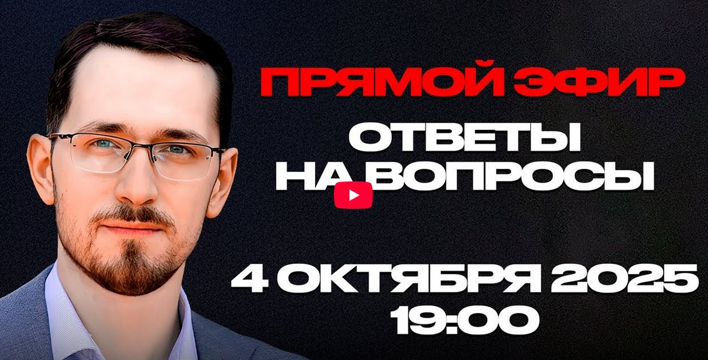

# Е.Голуб с П.Щелиным: Прямой эфир, ответы на вопросы.

04 октября 2025 г. [Аудиоверсия](https://www.youtube.com/watch?v=kZ0e7z1WpdI) 01:24:16

**Е.Голуб:**
Итак, хочется сказать здравствуйте, дорогие друзья.
В эфире очередной выпуск подкаста «В поисках смысла».
Но это не подкаст, это наша первая проба эфиров.
Поэтому будьте снисходительны.
Мы пока не знаем, как с этим обращаться.
Но у микрофона Евгений Голуб и...

**П.Щелин:**
Павел Щелин.
Здравствуйте.

**Е.Голуб:**
Отлично.
Итак, сегодня мы пробуем новый формат.
У нас есть вопросы, которые нам прислали заранее.
И я думаю, нам стоит начать с них.

Первый вопрос, который мы выбрали для разминки, касается гностиков.
Его нам задал Бузулук Александр.
Я немного сокращу, чтобы не долго читать вопросы.
Итак.

Речь идет о том, что Павел в своем курсе о гностическом мышлении описывает все современные идеологии.
И вот у людей не складывается картина, у человека этого, Александра, что гностики должны были, а не пневматики, они стремятся вернуться в клерому.
И почему вдруг гностики решили строить Царство Божие на земле?
На земле, где по их же верованиям все поделка демиурга неудачника.

Я думаю, здесь нужно начать с того, чтобы немного рассказать, что такое пневматики и что такое плерома.
Ну а затем логичный вопрос.
Как так случилось, что это все переросло в строительство рая на земле?

Павел.

**П.Щелин:**
Ну смотри, первое, то есть базовое понятие, то есть гностики – это определенный способ мышления, который является главной антитезой христианства, хотя на первый взгляд является очень на него похожей.
Исторический гностицизм, если там не брать мистические всякие трактовки, это вот начало первого века нашей эры, Родождества Христова.
И базовый смысл в том, что люди делятся принципиально на три класса по рождению.

Это те, условно, люди с искрой божественной души.
Это люди, которые уже это осознали, те самые пневматики.
Это те, в которых эта искра есть, но она спит, и просто ходячие животные, безо всякой божественной души.
Вот.

Мир изначально рассматривается как сотворенный демиургом-неудачником, да, а вот за пределами этого мира находится плерома, и там вот, в зависимости от конкретного гностика, по-разному это интерпретация, но вот смысл, условно, жизни настоящего пневматика – вернуть свою душу, в классической трактовке, из вот этого мира в мир правильный, вот в эту самую плерому, да.

**Е.Голуб:**
Минутку, Павел.
Говорят, тебя плохо слышно.
Действительно, тебя слышно тихо.
Может быть, тебе нужно что-то поправить в микрофоне?

**П.Щелин:**
Даже не знаю.
Сейчас посмотрим, что можно...
Сейчас, наверное, будет слышно сильно лучше.

**Е.Голуб:**
Но другое же дело, конечно.

**П.Щелин:**
Продолжаем.
Вот.
Продолжаем технические вещи.

Ну, это вот что-то называется гностицизм 1.0.
То, что я описывал.
А вот то, с чем связан вопрос уважаемого Александра, это уже современное гностическое мышление.
И современное гностическое мышление это уже плод середины, я бы сказал, между XVI и XVIII веками.
То есть это рождение нашей модерновой цивилизации.

То есть это, сохранив ключевые элементы гностицизма, прежде всего деление людей на вот эти воук-невоук, по сути, пробужденные, будители и ходячие орудия, скрестили с христианским оптимизмом.
Другими словами, это уже мир после благой вести.
Ты не забываешь, что в мире античного человека никакого радикального оптимизма в принципе быть не может, потому что все умрем и все под фатумом ходим и все, условно, в серое царство мертвых отправимся.
Даже герои, они там на своем острове пируют, но это не так.
Массовые вообще не очень тоже решают проблему.
То есть в мире античного человека очень трагично.

А вот мир христианского человека радикально оптимистичен, именно потому что постулируется идея о возможности принципиально выхода из круга смерти.
Так вот, гностики современные наши, они уже пропитаны этим контекстом, они уже постхристиане.
И они творчески соединили, по сути, гностицизм с идеями Йохи Мохлорского.
Это вот эта идея трех царств, идея миллениаризма.
То, что перед вторым пришествием будет, условно говоря, тысячелетнее царство Божье на Земле.

Это, не забывая, очень популярная трактовка, постоянно возникает внутри христианской традиции, особенно в рамках западной христианской традиции.
И особенно на фоне таких больших потрясений, как чума, события и прочее.
И добавили потом к этому еще вот такую идею, как христианский стоицизм и усталипсия.
То есть это вот такой был тоже философ малоизвестный, но его идея была в том, что надо работать и надо трудиться.

И вот у тебя возникает гремучая смесь.
То есть, с одной стороны, расовое деление на избранные и неизбранные, по сути, духовный расизм.
Который соединяется с остатками христианского оптимизма, с уверенностью в собственных силах определенной, и потом просто из этой картины выносится Бог за скобки, и у нас уже получается та же самая идеология, но уже без прямой отсылки к религии.
Это вот краткое содержание.
Вряд ли мы на каждый вопрос можем давать суперподробный ответ.

**Е.Голуб:**
Ну, ты знаешь, давай я расскажу, как я понимаю, я всегда пытаюсь перевести на понятный мне язык, потому что ты рассказываешь глубокие вещи довольно сейчас непростым языком.

Ты говорил когда-то в наших разговорах, а не только, что на определенном, скажем, этапе историческом элита устала ждать конца света и прихода Бога на Землю.
И получается, что в этот момент гностические учения, они трансформировались.
И вот этот совершенный мир, плерома, которая мыслилась ими как то, куда нужно перейти, она переместилась в их понимании на землю.

Мы теперь сами строим плерому, и, по сути дела, именно в этом элемент гностического мышления во всех этих идеологиях.
От Маркса до Маска, по сути дела.
Мы строим лучший мир, либо при помощи технологий, классовую борьбу включаем.

**П.Щелин:**
Всегда при помощи знания.
Почему гнозис?
У нас есть определенное знание, как этот лучший мир построить.

И это знание может быть диалектика, расовая теория, законы космодинамики, законы рынка.
Суть не меняется.
Главное то, что у нас есть особое знание, как вот это райское состояние на Земле создать быстренько и в нашей жизни.
Ну относительно.

**Е.Голуб:**
Еще из вопросов, продолжение этой темы, логичное.

Отличие веры от знания или отношения веры и знания.
Этот вопрос был в другом в другом списке, давай я тебе сейчас буду его экспромтом выдавать.
Это то, что и меня волнует.
Поэтому я пользуюсь своим положением.

Вот у меня есть такая гипотеза, поправь меня, если ошибаюсь, что на определенном этапе вера стала постепенно обесцениваться как источник знания, как источник понимания мира и взаимодействия с ним.
И знание приобрело такое абсолютное, стало абсолютом.
Знание – это, да, что можем доказать, что можем пощупать, что можем исследовать.
Наука – это знание.
А вера – это что-то несерьезное.
Что ты думаешь по этому поводу?

**П.Щелин:**
У меня возникает здесь огромное желание.
Рвать и метать, на самом деле, вскипает ярость благородная.

**Е.Голуб:**
Давай, давай.
Люди хотят эмоций.

**П.Щелин:**
Даже твой вопрос, он опять отражает вот эту подмену.
То есть ты даже не все знание описал, ты описал конкретную подвид знания - научное знание.
Огромная часть знания в принципе не является научным знанием.
Научное знание это подвид общего знания.

Ну пресловутая философия это не научное знание.
Но от этого знанием быть не перестаёт.
И более того, всё научное познание, что бы тебе ни говорил учёный, висит на метафизике.
Ты без метафизики никакой эксперимент провести не сможешь, потому что с чего бы ты будешь утверждать, что твои чувства тебя не обманывают, да?
С чего вообще мысль о возможности познаваемости мира закрадывается в твою голову?

Это философская категория, это не категория научного.
Ну, классический пример – знаменитая вилка Юма, что утверждение, что только научный метод познания является истинным, не является полученным научным методом.
Это философское утверждение, сделанное по законам философии.
Поэтому нет в классическом понимании противоречия между верой и знанием.
Вот в таком понимании нету.

То есть, если мы в широком берем категорию знаний.
Другое дело то, что если ваша цель исключительно научное познание, то да, разумеется, вера это не то, что ты можешь проверить экспериментом.
И вера, если угодно тебе, ну вот как я это по-простому объясняю, вера сверхрациональна.
Вот условно научное познание скажет, что вера недорациональна, да?
То есть, она недо логос.

А я, условно, сторонник той философии, в том числе, как бы секрет Полишенеля, что это сверх, если угодно, сверх рацио.
То есть это превосходит любые категории рациональности, но самый близкий пример любому человеку будет - любовь.
Вот условно.

Вот любовь вы в формулу не запишите, да, ни химические реакции мозга.
И знак тождества между ними и любовью не поставите.
Но от этого любовь не перестает быть реальной.
И вот это, значит, категория сверхрациональности.
Но это вот то, что мы обсуждали в проблематике мифа на наших, помнишь, еще когда мы в Стамбуле с тобой общались, то, что есть категории, которые в каком-то смысле сверх-истинны.

Более того, очень важно понимать, что мы не можем из этих категорий убежать.
То есть все равно все наше познание, все наше условное взаимодействие с миром все равно происходит внутри некого рассказа.
И вот этот рассказ по отношению к нам имеет сверхрациональный характер.

**Е.Голуб:**
Хорошо, кратко.

Ну что ж, перейдем к вопросу из чата к этой трансляции, чтобы не разочаровывать людей, которые нам пишут, и немного приблизимся к актуальной повестке.
Очень немного пока.
Наш участник этой трансляции под ником OIS спрашивает.
И здоровается, Павел.

> Здравствуйте.
> Скажите, пожалуйста, что вы думаете о состоянии теологического образования в России?
> Можете ли вы посоветовать места, например, какие-нибудь православные академии для обучения?
> Спасибо.

**П.Щелин:**
На такой вопрос я вам прикладной ответ дать не могу, потому что в России есть православная академия.
Если вас интересует научная карьера, то, в принципе, можете идти в любую академию, все равно диссертацию писать придется.
Весь вопрос, наверное, в чем у вас запрос.
Тут ключевой вопрос для человека.

И, в принципе, те же самые методы, которые применимы при выборе института, будут применимы для вас в выборе конкретного учебного заведения.
Но в целом, если говорить, мое мнение, вы знаете, то что я большой сторонник самообразования, я считаю то, что в принципе ценность вот этого классического академического образования на данном этапе на какое-то время уйдет в сторону, потому что сама структура академии оказалась заложником, если тебе угодно, вот этого научного так называемого метода.

То есть даже в тех областях, где по-хорошему его не надо было бы быть заложником, оно все равно становится.
Поэтому прикладные такие в целом советы не только к этому вопросу, а по образованию в целом.
Если вас интересует гуманитаристика, без самообразования не вывезете.
То есть это однозначно.
Все равно главное для вас будет это вопрос самообразования.

Что может помочь?

Идите на преподавателя.
То есть если у вас есть преподаватель, который по каким-то причинам является для вас авторитетным человеком, я не знаю, в вашей дисциплине, или вы посмотрели его видео, или были на его гостевых лекциях, и вот вы загорелись желанием повзаимодействовать с ним, условно написать у него диссертацию, вот это может являться очень сильным фактором при выборе любого места для обучения.
То есть идти не на институцию, а идти на человека.
Вот, наверное, базовый такой был бы призыв.

**Е.Голуб:**
То есть мы возвращаемся к практике практически вечной, когда образование – это суть взаимодействия учителя и ученика.
Мы идем к человеку и получаем знания не только в виде текстов, а скорее как передачу некоторой энергии его личности, его убеждений, его ценностей.
То есть это все идет в комплексе.

**П.Щелин:**
А если, единственное, мы говорим про теологическую историю, то всё-таки важный призыв такой для этой дисциплины.
Хорошо бы, что тот, у кого вы учитесь теологии, в Бога бы верил.
Это вот я так скажу.

**Е.Голуб:**
Да, это немаловажно.
И совершенно не...

**П.Щелин:**
Самоочевидно.
Вот это не самый очевидный факт.
На полном серьёзе.
Ну, в общем, есть.
Распространено.

То есть теология — это тот опыт опять-таки, потому что субъект первичен, то есть гораздо важнее, чтобы ваш учитель, если вы учите теологию, сам в Бога верил, чем был бы лучшим специалистом по условно арамейскому языку.
Но вот для вас в этой дисциплине оно так лучше.
Она вот обладает этой особенностью.

**Е.Голуб:**
Хорошо.
Слушай, нам нужно как-то сократить время ответов, потому что вопросов очень много, и мы так...

**П.Щелин:**
У нас полтора часа.

**Е.Голуб:**
Тормозить.
Хорошо.

Значит, продолжение образования.
Анна Лекомцева спрашивает.

> Павел, как вы относитесь к семейному образованию?
> Насколько, по-вашему, этот путь может быть полезен детям в условиях нынешнего состояния системы образования опять в России?

**П.Щелин:**
Ну, не только в России, во всем мире.
У меня есть знакомые, которые посвятили себя вот этой практике.
И если вы можете ее вывезти, потому что это большой труд.
То есть семейное домашнее образование явно с двумя рабочими родителями не получится.
У каждого свои условия для современной жизни.

А так, в практике, я отношусь с огромным уважением и в нынешних условиях очень часто, мне кажется, является рабочим методом.
То есть если вы готовы взять на себя эту ношу, посвятить себя, то есть вот эту программу, выбрать и обеспечить эту работу, то да, это хороший метод.
Ну, то есть никаких фундаментальных препятствий я не вижу.

**Е.Голуб:**
Хорошо, тогда вернёмся ещё к вопросам, предварительно отправленным нам.
Есть два вопроса, которые я хочу обязательно, чтобы ты ответил на них.

Первый вопрос.
Это современное неоязычество.
Вопрос от Евгения, от тезки моего.

> Павел, прокомментируйте, пожалуйста, рост количества язычников в России, истоки, причины, будущее язычества Российской Федерации.
> Оставьте комментарии касаемо бума неоязычества в рядах ВСУ.
> О чем идет речь, когда Патриарх вся Руси говорит, что РПЦ противостоит этому?
> Объявление новой холодной гражданской войны внутри страны?

Ну, я как бы здесь повторяю.

**П.Щелин:**
Ну, и тут очень много вопросов.
Давай я вообще в целом базу оставим.
Фактор про неязычество.

Действительно, очень интересный вопрос, потому что один из таких парадоксальных тезисов, мне кажется, который для нас вообще является открытием, что современный человек, мы на словах заявляем о том, что мы очень рациональны и мы очень научны, а на практике мы просто чаще всего являемся нечестными язычниками.
То есть мы точно так же служим каким-нибудь идолам, мы используем разные иерархии внимания, мы приносим им жертвы, мы пытаемся заключать сделки с разными, так сказать, силами.
Ну, условно, идол карьеры, идол успеха, идол богатства.
Вот это все абсолютно точно так же в нашей практике жизни работает.

Тем не менее, вопрос более конкретный, про, по сути говоря, военные особые мужские тусовки, связанные с военной службой.
Там действительно отмечается рост неоязыческих настроений, который, тем не менее, всегда был характерен для этой среды, на самом деле.
Дохристианский период точно, но и в христианский период всегда есть особый элемент искушения.

Связано это с тем, что опыт войны это всегда предельный опыт.
Человек волей-неволей там находится в зоне, где граница между миром материальным и нематериальным, между жизнью и смертью является очень тонкой.
И на войне практически невозможно остаться нейтральным.
Ты условно либо проваливаешься вниз, либо поднимаешься наверх.
И соответственно в той мере, в которой человек не поднимается наверх, в той мере он проваливается вниз.
И вот с этим связан вот этот условный феномен.

Но это классическая история.
Здесь вот Генон был хороший образ с этим яйцом.
У него был условно верхний мир, наш мир и нижний мир.
То есть условно ангелы, наш мир и демоны.
Так вот условно предпосылка, одна из фундаментальных проблем Модерна.
То есть он думает, что закрыв небеса, он всех удержит вот в этом среднем состоянии.
А на практике получается, что, закрыв небеса, человек начинает в ад бурить.
То есть человек не может оставаться вот в этом нейтральном положении.
Поэтому если человек в условиях постоянного столкновения с пределом не поднимается и не двинется наверх, он, разумеется, скорее всего, будет погружаться вниз.

**Е.Голуб:**
Ну вот для тебя язычество — это то, что погружается вниз.

**П.Щелин:**
Да, особенно для современного человека, потому что тут отдельный эпизод.
Ладно, рассказываю эту историю.

Современный человек честным язычником, постхристианин быть не может.
То есть честным язычником можно было быть до христиан.
Можешь видеть такие примеры в России, там глубинные шаманы из лесов.
На Гавайях всякие тоже, всякие аханы, маханы.
Вот это история.
Племена Амазонки, племена Австралии, там остались люди, которые могут быть условно честными язычниками.

Но давай простой пример.
Я напоминаю, что чтобы быть честным язычником, там такой протокол надо соблюдать при взаимодействии с этой духовной реальностью, что нашему современному расслабленному сердцу это близко нет.
Но чтобы ты понимал, в серьезных языческих традициях, культурах, где все эти шаманы, там если тень от человека падает не на ту тень от их вождя, который входит в духовный мир, то казнить надо и вождя, и человека.
Протокол такой.

Серьезное отношение к язычеству предполагает примерно вот это.
А сегодня это, по сути говоря, демонология.
Люди развлекаются, думают, что это несерьезно, а на практике влезают в трансформаторную будку и куда убьет.

**Е.Голуб:**
Хорошо.
Вопросы из чата.

Хотят знать, что такое служить идолам.
Конкретнее, что такое служить, как термин?
Даниил.

**П.Щелин:**
Приносить жертву.
Служить значит приносить жертву.
Сочетание двух факторов.

Первое – приоритезация нечто относительно всего остального.
То есть это занимает определенное место в вершине вашей иерархии внимания.
А второе то, что поскольку вы поставили это на вершину, вы начинаете к этому двигаться, двигаетесь к этому, принося в жертву.

В жертву можно принести что-то материальное, но чаще всего мы приносим самое ценное – наше время.
Вот наше время является главным, скажем так, жертвенным, если тебе угодно, ресурсом, который мы в состоянии принести.

**Е.Голуб:**
Получается, что, жертвуя время, мы, по сути дела, жертвуем свою жизнь?

**П.Щелин:**
Ага, именно так.

**Е.Голуб:**
Знаешь, спрашивают, есть такой не очень серьезный вопрос.

Что за картина у тебя за спиной?
Самая нижняя.
Почему-то всех очень интересует.
Ну, ответьте же, наконец.

**П.Щелин:**
Это гравюра, которую я купил пару лет назад.
Отступление французов через Березину.

В общем, своего рода такой...
В общем, два года назад это было, знаете, в контексте всяких очень громких заявлений разных французских лидеров.
Вот что-то мне как-то она очень сильно приглянулась и с тех пор висит, нравится.

**Е.Голуб:**
Хорошо, тогда через эту картину перейдем к вопросам по поводу искусственного интеллекта.
Есть целая группа этих вопросов, и я задам тот, который нам прислали заранее, поскольку он, в общем, отражает все вопросы на эту тему.
Искусственный интеллект.

Я зачитаю вопрос, поэтому, кому кажется, что я долго его задаю, пожалуйста, потерпите.

> ИИ позволяет быстрее и эффективнее решать мои рабочие вопросы

говорит Стас.

> И я уже активно использую его в работе.
> От выполнения рутинных задач до консультации, написания готовых решений.
> Искусственный интеллект для меня практически неотъемлемый помощник.
> Без использования искусственного интеллекта меня не уволят, но моя продуктивность и широта решаемых задач сократятся.
>
> В ваших подкастах искусственный интеллект представляется как сатанинское зло, которое искушает людей, лишает их воли, забирает мозги.
> На ваш взгляд, возможно, все-таки, продуктивное взаимодействие искусственного интеллекта с человеком?

**П.Щелин:**
Ну, неразрушительное, наверное.

**Е.Голуб:**
Неразрушительное, да.

> И если да, каким вы его видите?

Павел, вы сказали, что для того, чтобы технология не поработила тебя, нужно повышать свою субъектность, пропорционально росту могущества технологии.
Раскройте, пожалуйста, эти слова на каком-нибудь примере.

Ну, вот такой комплексный вопрос, да?
Попробуй ответить.

**П.Щелин:**
Ну, первое, все-таки, уточнение.
Я бы, вот если делать важное уточнение, всё-таки не ИИ как сатанинское зло, а ИИ как сосуд сатанинского зла.
Всё-таки это более важно для меня.
То есть, скорее всего, это некий сосуд, который может быть использован для, скажем так, трансляции той или иной воли.
Такой важный комментарий.

А вот про субъектность раскрою сначала на своем примере, а потом на примере применительно вашем.
Что значит повышать рост субъектности пропорционально использованию технологии?
Это значит, что от использования технологии вы не теряете то, что у вас было до того, как вы эту технологию начали использовать.

Приведу пример.
Вы, допустим, программист.
То есть у вас есть определенный навык написания кода.
Вот если вы, условно говоря, пользуясь искусственным интеллектом, сохраняете свой навык написания кода, то это вам не вредит.
А вот если вы там за время использования интеллекта сами код писать разучитесь, тогда он вашу субъектность поглотит.

То есть вам нужно каким-то образом, не знаю, через намеренное, возможно, нудение и самопринуждение тратить определенную часть времени, вопреки императиву эффективности, на то, чтобы сохранять свою способность, которая изначально сделала вас тем, кем вы были.
Понимаешь, о чем логика?

**Е.Голуб:**
Я не понимаю, а зачем, если уже не требуются такие навыки?
То есть человек тратит время на навык, который не востребован уже.

**П.Щелин:**
А этот навык нужен, чтобы как раз ты имел возможность оценить то, что делает эта машина.
А главное, сохранить свою возможность быть ее господином, а не слугой.
Это принципиальный момент.

Ну применительно в моем случае, допустим.
Общий пример с чтением связанный.
Что рекомендую?
Учить стихи.
Классический пример.
Письменность нас же тоже во многом разрушила.

Идеальным примером мыслимым было бы, если бы мы научились читать книги и писать книги, сохранив способность запоминать поэмы.
Или помнить условную Илиаду, Одиссею наизусть.
Вот как это было и стандартом до массового, скажем так, вхождения письменности.

То есть мы, сохранив бы наш предыдущий опыт памяти, усилили его, допустим, теми преимуществами, которые дает книгопечатание.
Мне кажется, субъектное отношение технологии подразумевает твой осознанный выбор, который, повторюсь, не рационален с точки зрения market efficiency вообще, но он рационален с антропологической точки зрения по сохранению себя как субъекта.

**Е.Голуб:**
Ну хорошо, я думаю, можно эту дискуссию продолжить очень долго.
Давай на этом остановимся пока, потому что вопрос...

**П.Щелин:**
Ну общий образ, повторюсь, именно в том, что если вот условно мы переходим там...
Да, ИИ может помочь вам многое что-то суммировать, допустим, пример.
ИИ делает summary прекрасный разных материалов, да, но значит вам нужно самим тратить свое время, вопреки рациональности, на чтение бумажной там, условно, книги, чтобы тупо сохранить навык чтения длинного текста, потому что вообще-то это разные навыки.
То есть это разные навыки с точки зрения мышления.
Вот простой пример.

Хотя, да, технически удобно нажать на кнопку, дай мне summary этой книги.
Но есть определенная ценность, чтобы ты сам прочел эту книгу, сохранив навык чтения длинного текста.
И вот эта способность и возможность к этому выбору есть, мне кажется, та самая субъектность, о которой мы говорим с тобой в нашем эфире.

**Е.Голуб:**
Ой, что-то звук пропал.

**П.Щелин:**
Алло.

**Е.Голуб:**
А, всё, извини, это у меня маленькая проблема была.
Итак, знаешь, очень много вопросов на политическую тему.

**П.Щелин:**
Выбери поинтереснее.

**Е.Голуб:**
Да, но тут, в общем, многое сводится к вопросу о государе.
Мы же с тобой много и в личных беседах, и в подкасте спорили на тему самодержавия.

Ну давай я задам вопрос, который в той или иной степени формулируется многими.

Почему в России президент такой, как Владимир Путин, воспринимается как государь?
И что-то там было еще, а в других странах президенты это менеджеры.

Ну, как спрашивают, так спрашивают.

**П.Щелин:**
Потому что Россия не до конца масонская республика.
Что я могу сказать?
Не до конца.

**Е.Голуб:**
Разверни.

**П.Щелин:**
Ну, разверну.
Потому что вот эта идея президента-менеджера подразумевает то, что власть находится в каком-то другом месте.
Не в народе.
Ну если есть управляющие предприятием, то есть и владелец предприятия, да?
Если у вас президент-менеджер, то вопрос, кто владелец этого предприятия.

**Е.Голуб:**
Угу.
Если президент - менеджер, то кто владелец?
Ну, он, видимо, подразумевает, что владелец — это народ?

**П.Щелин:**
Ну давайте, у нас, я думаю, аудитория серьезная, в сказки она не верит, поэтому вот можете заняться.
А Россия, она власть выведена на вид.
То есть краткий ответ, потому что в России президент реально хоть какой-то властью обладает.
Именно поэтому он не государь, но в данном случае я его называю ио государя.
Полнотой он не обладает власти.

**Е.Голуб:**
Местоблюститель.

**П.Щелин:**
Местоблюститель.

Но хоть какой-то властью он обладает.
То есть в России контур реальной власти хоть каким-то образом выведен вовне.
Не вся власть – скрытая власть.

А условно в классической демократической модели, пока особенно постмодернистского типа, конечно, настоящая власть необходимо скрыта.
Причем мы все это говорили много раз.
Причина, почему настоящая власть скрывает себя, очень прикладная, чтобы не отвечать.

То есть это уникальный процесс, когда у тебя вся полнота власти, но отвечать ни за что тебе не надо.
Отвечать будет управляемец.
Очень удобно.

**Е.Голуб:**
Хорошо, продолжаем тему политики и уже немножко в футуризм заглянем.
Ну, извините, люди хотят знать, мы должны отвечать на эти вопросы, какие бы они ни были.
Итак.

Хотят люди знать, как ты видишь будущее России?
Одновременно, не пора ли выработать новую идеологию для Российской Федерации, пока не скатились в гражданскую войну?
Поздно уже может быть это делать, пойдем вместе со всем миром и так далее.
Комплекс вопросов вот в этой сфере я постарался их как-то обобщить.

**П.Щелин:**
Я вижу вижу по-разному это будущее предопределено, но не для всех.
Я его не знаю.
Промыслительно оно, конечно, предопределено, но тюрбана у меня пока нет, хотя иногда возникает желание прикупить и, что называется, смотреть через хрустальный шар наверняка.

Есть разные сценарии и разные степени вероятности.
Базовый оптимистический сценарий для России, на самом деле, связан с тем, что случилось, мы с тобой тоже заняты.
Это выработка своего политического языка.

То есть главная уязвимость России на данный момент находится не в зоне экономики, даже не в зоне войны, не в зоне тем более геополитики.
Главная слабость России находится в зоне когнитивной.
То есть в зоне ума, в зоне языка.

До сих пор Россия пытается формулировать свое миросознание, миропозицию на языке чужих смыслов, на языке, соответственно, чужой этики, на языке чужой более большой категории онтологии, да, то есть чужого представления о бытии.
Ну, по-простому, она говорит на языке просвещения, хотя ей тошно от этого языка просвещения.
Но она продолжает с упорством лучшего превосходства и за неимением лучшего использовать формулы просвещения, что выглядит биполярно, шизофренично и раскалывает, ну скажем так, некую внутреннюю силу.
Ну пресловутый вот предыдущий был вопрос, о чем у нас президент ведет себя как государь.
Ну действительно хороший вопрос.
Что он государем не называется, а называется президентом.

Ну короткий ответ, потому что так принято, потому что после ООН так принято, что вот монархия это плохо, государей нет и так далее и тому подобное.
Но это все является по сути чужим заимствованием, если угодно, онтологией, которая неадекватна российским реалиям.

На данный момент речь идет о своем политическом языке, как главном фронте безопасности, соответственно.
И в том случае, если этот язык со временем выработается и суть будет приведена хоть в более близкое соответствие с формой, то есть единство формы и содержания, то тогда это повысит, скажем так, шансы на то, что люди могут назвать более оптимистический сценарий развития.
И если этого не произойдет, то тогда, скажем так, энтропия внутри системы нарастает, но подключок все равно произойдет.

На самом деле здесь итог-то один.
То есть, как это, либо выживешь, либо не выживешь.
И если выживаешь, то тогда весь вопрос просто, сколько цены заплачено промежуточной, чтобы дойти до этой точки.

**Е.Голуб:**
Участники чата негодуют, требуют отвечать на вопросы, которые оставляли в чате.
Но в чате, коллеги, 300 вопросов, мы физически не можем на них ответить, поэтому мы как-то пытаемся балансировать между чатом и терпением.
Поэтому, пожалуйста, терпение и понимание.
Великодушие, великодушного терпения просим.

Есть комплекс вопросов, связанных с идеологией.
Вот ты сейчас как-то упомянул об этом.
Давай я попробую заострить.

Разве можно придумать веру?
Люди говорят, а давайте выработаем новую идею рациональную, идеологию.
Вот мы сейчас посидим-посидим и придумаем что-то и поверим.
Для меня это какой-то абсурд.

**П.Щелин:**
Нет, ты абсолютно прав.
И здесь нужно разделить две вещи.
Первая вещь, что может ли условно быть некая целостность без того, что называется идеологией?

Короткий ответ нет.

**Е.Голуб:**
Давай другое слово использовать, идеология.
Используем веру все-таки.

**П.Щелин:**
Общая вера, общее доверие.
Хорошо, кого-то будет на идеологию загораться лампочка, у кого-то на веру.
Я попытаюсь объяснить суть.

Любая целостность, главный ее, скажем так, залог ее существования, это вот эта ткань доверия между ее составляющими членами.
Если говорить по-простому, нету текста без контекста, нету целостности без доверия.
Соответственно, вот эта ткань доверия является производной от того невыраженного, которое не кодифицировано обязательно в законе, но которое де-факто составляет вот эту этическую норму внутри некой целостности.
Ну там по Пушкину любовь к родному пепелищу, любовь к отеческим богам, у римлян храм своих богов и могила тоже своих предков.
В общем, смысл заключается в том, что есть некий свод ценностей, который выражен может быть по-разному.

Высшая, на мой взгляд, самая честная, это вера, то есть это предельная.
На более низком секулярном виде это культура.
Общая культура.
Вот реально людей в целостности объединяет общая культура.

И вот пока эта общая культура есть, она не может, очень важный момент, быть нейтральной.
Вот эта идея, что она может быть нейтральной, может быть какая угодно культура, и мы до сих пор при этом остаемся целостностью, вот так не работает нигде.
Это надо прекрасно понимать, и всегда это строится по принципу исключения.
Мой любимый пример — никакой свободы врагам свободы.
Такая либеральная максима.

То есть это вот очень такой классический пример, который выражает, что все равно какая-то реальная, общая, скажем так, вот этот объединяющий, называй это кодекс, называй это культура, называй это вера.
То есть какое-то воплощение вот этого общего духа, оно присутствует.
Далее вопрос, как ему отдать место.

Должно ли быть оно зафиктировано в Конституции или оно должно быть зафиксировано в каком-то другом символическом ряде.
Но в каких-то символических рядах оно должно быть очень четко выражено, должно быть отдано ему должное, честь, почет, уважение, слава.
И тогда целостность условно удерживает и вдохновляет себя.
Сейчас это делается как бы кривенько и немножко через задний ход, прямо скажем.
Потому что мы в целом в современных обществах мы делаем вид, что на самом деле мы толерантны ко всему, на самом деле у нас все равнозначно, и только потом эмпирическим путем ты реально узнаешь, что где равнозначно, где неравнозначно и вообще что является приоритетом.
Хотелось бы больше все-таки открытости, ясности, честности в этом вопросе.

А второй аргумент, можно ли это вот придумать.
И вот на мой взгляд принципиальный ответ - нет.

То есть, нет, давай так.
Есть традиции, в которых можно, ну, пресловутые идеологии.
Вот идеология — это масонское изобретение.
Как создать симулякр веры?
Вот ребята практикуют 400 лет, нормально, хорошо получается.
В кавычках «хорошо».
А что противостоит этому?

Органичность.
Технологии предстоит органический подход, и органический подход стоит на том, что ты не можешь ничего придумать, но ты можешь воплотить.
Воплотить некий смысл, который не от тебя, но через тебя.
И вот в этом контексте, мне кажется, и есть решение вот этого вопроса об идеологии.

**Е.Голуб:**
Знаешь, по-прежнему приходят вопросы, связанные с попами на мерседесах, но если их как-то обобщить, то это общее недоумение, скептицизм, такой достаточно жесткий, выражающийся во фразе одного из участников чата, который сказал, ну ведь искренняя вера уже невозможна.
О чем мы говорим?
Церковь дискредитировала, там используются более жесткие в чате слова.

**П.Щелин:**
Я понял, понял.

**Е.Голуб:**
Веры-то не будет уже, все, мы не способны верить, говорят люди.

**П.Щелин:**
Отдельно тема, насколько мы способны верить, это интересный вопрос.
Но для практики в какой-то мере способны, вы же все верите во что-то.
То есть вы все равно как были религиозными, мы по природе своей как были религиозными, так и остались.
Если бы вы ни во что не верили, ваша жизнь выглядела бы совсем по-другому.

Например, вы верите в то, что вас не пырнут на улице просто так, когда вы на нее выйдете.
Это же не акт математического расчета, это акт веры.
Просто к тому, что очень много вещей вы по-прежнему принимаете исключительно на веру.
А если говорить про вот этот фундаментальный тезис об отсутствии веры и попах на меседесах, тут есть несколько линий ответа.

Первая линия ответа, ну, поездите, скажем так, ты видел, я видел, то есть и ты был в монастырях, и я был в монастырях, и в приходах, так что веру я видел, то, что вы ее не видите, не значит, что ее нет.
Это первый очень важный ответ.

Второй очень важный ответ про в целом мерседесы.
Это я позаимствовал у Андрея Ткачева.
Прекрасная была история.
Такой, проведите мысленный эксперимент.

Предположим, что вот вам человек, который, скажем так, воцерковлен, знаком с этой средой, предложит, реально, честно, с гарантией ручается, окей, попы на мерседесе, все понятно, тебя это смущает.
Даю тебе адрес, сельский батюшка, который там реально пятеро детей, за жизнь ни одной копейки, руками восстанавливает свой храм.
В общем, в чем-чем, а в попе на мерседесе, никакого мерседеса у него нет, чуть ли не на кобыле ездят.
Я тебе его покажу, и ты к нему год на литургии будешь ходить.
Согласен?

Вот если у вас ответ внутренний на такой мысленный эксперимент - согласен, то тогда рано или поздно вы такого человека найдете.
А если ответ все-таки не согласен, типа да зачем оно мне нужно, то тогда поп на мерседесе это наша внутренний отговорка, которую мы используем для оправдания собственной духовной ленности.
Вот это вот такой очень важный ответ.

**Е.Голуб:**
Я хотел сделать здесь комментарий.
Уже простите меня, ребята.
Я знаю, что вы пришли слушать Щелина, но мне важно кое-что вам сказать.

Я недавно, буквально неделю назад, чуть больше, был на Афоне в паломничестве.
Причем я был на Афоне с группой довольно серьезных философов.
И, к моему удивлению, многие из них оказались искренними православными, воцерковленными, хотя об этом никогда не говорили публично.
Но больше всего меня поразило количество молодых мужчин, ну как молодых, в моей возрасте это такое большое пространство, скажем так, от 30 до 45.
В храмах, что в греческих, в греческом монастыре, что в русском монастыре.

Это десятки, в русском может быть сотни человек, которые, в общем, по крайней мере, внешне выглядели такими людьми, которые пришли туда не просто так.
И вот по поводу искренней веры, давайте все-таки здесь оставим некоторое место для надежды, которая эта надежда подтверждается фактами последних лет, как это ни парадоксально.

Хорошо, давай тогда дальше.
Евгений Евгранов.

Очень он деликатно так подошел, говорит, Евгений, спросите, пожалуйста, Павла Александровича прокомментировать проблемы православной антропологии.
Есть ли такие на его, то есть на твой взгляд, имеются.

Есть у тебя по этому поводу о проблемах православной антропологии?

**П.Щелин:**
У меня нет проблем с православной антропологией.
У меня единственная есть проблема то, что личного характера, но это не для публичного обсуждения, для разговоров с духовником.
Слишком плохо ей соответствует.

Именно, если говорить серьезно, то именно православная антропология для меня стала одним из таких больших именно открытий.
Насколько мы ее не знаем, не понимаем, и насколько она, не люблю это слово, современна, что ли.
Но смысл в том, что чем глубже ты погружаешься в православную антропологию, тем больше ты поражаешься, насколько эти люди пишут о проблемах, которые именно мучают современного человека.
Именно причем, мне сложно поверить, чтобы они прямо так мучили условно человека первого тысячелетия, честно сказать.

**Е.Голуб:**
Да, нужно сказать, насколько они писали тысячу лет назад о том, что мучает нас сейчас.

**П.Щелин:**
Да, да.
Причем именно так, что вся вот эта, условно, психология просто отдыхает.
Такие тонкие понимания вот этих глубин, движений сердца, души, ума и прочего, и именно отношения между ними, то есть просто безумно.

**Е.Голуб:**
Так, минутка рекламы.

Многое о том, что сейчас Павел говорит, мы обсуждали в наших подкастах.
Если кто еще не был на подкастах наших, уже 5 сезонов, слава богу, в поисках смысла, там есть ответы на вопросы позиции Павла об искусственном интеллекте, православной антропологии и так далее.
Уже 52 выпуска, ну вот явно там многое найдете, что можно принять в качестве ответа.

Продолжаем.

В каких странах, по твоему мнению, адекватно устроена власть?
Где власть не менеджерская, а реальная и субъектная?

Ну и тут же сразу в догонку вопрос из чата по поводу Ирана.
Вот же, пожалуйста, казалось бы, государственная власть, основанная на религии полностью, на ценностях, ну как-то она не выглядит убедительно.

**П.Щелин:**
Первое насчет, выглядит ли она убедительно, на мой взгляд, она выглядит достаточно убедительно, если учитывать тот масштаб давления, с которым эта страна столкнулась, если вот говорить серьезно.
Да, сегодняшние примеры будут, скорее всего, для нас звучать странно, дико и неубедительно, потому что они расположены, на мой взгляд, власть, реальная она, если именно в связи с государством, присутствует сейчас в двух очень странных полюсах.

Либо это полюс предельно монархический, то есть условный Лихтенштейн, вот там власть прекрасно соединена.
Напомню, Лихтенштейн абсолютная монархия, для тех, кто не в курсе.
Вот это государство в горах Швейцарии.

Британия.
Именно за фактор короля, вот этот, говорю не о премьер-министерах, но я говорю о королевской семье как носителях реальной власти, присутствует.

Либо мы уходим в вот этот экзотический жанр, который действительно для современного человека звучит как изгои и больные люди на голову, условные какие-нибудь талибы и, прости господи, Северная Корея.
Но опять-таки, если мы задаем критерий, где власть и управление находятся хотя бы примерно, где власть не полностью скрыта, то мы получим либо монархические истории, причем, видимо, монархические истории, либо мы получим истории очень такие специфические, можно даже сказать, болезненные, тех, у кого не осталось все иного выбора.
То есть, будучи поставлены в положение либо выживи, либо умри, власть вышла на поверхность этих сообществ.
Вот я бы так это сформулировал.

Это не значит, что они обязательно являются примерами для подражания во всех остальных вопросах, но в целом на длинной дистанции мы действительно живем в очень интересный период.
У меня был эфир, который мне понравился, на прошлой неделе с Камилем Аскархановым.
К сожалению, там было шокальное качество аудиосвязи, за что приносим извинения тем, кто это слушает.
Но мы там довольно подробно описывали особенность современного момента, что большая часть современных так называемых государств не являются государствами, а являются такими большими геодронами по сути своей, которыми управляют сетевые операторы, которые не имеют такой территориальной привязки, то есть власть, ну, сделав очень такой интересный трюк, себя отсоединила от территории в массе своей.

Это был очень интересный процесс, но это имеет те самые большие издержки, о которых мы постоянно жалуемся в наших, ну, в кавычках, в наших обсуждениях на кухне.
А почему они живут на другой планете?
Ну, потому что они живут на другой планете, потому что у них абсолютно другое восприятие.

**Е.Голуб:**
Из твоих слов можно сделать такой вывод, что те страны, которые декларируют в качестве своей модели республиканскую, в кавычках, потому что это не совсем республиканская, ну, скажем так, власть, основанную на публичной, представительной, извините, демократии, выборной, то это именно тот случай, когда реальная власть находится в тени.
И так как другого способа власти нам неизвестно, скажем так, в той части мира, которая все-таки считает себя там западной, заговорюсь куда-нибудь, то видим демократию, понимаем, что власть где-то в тени.
Так, нет?

**П.Щелин:**
Да, да.
Все то, что называется современная демократия, необходимо означает, что реальная власть является скрытой.

Смотрите, ну да, это даже уже сейчас, правда, стало проявляться в институтах, но из последних таких больших примеров, выборы в Румынии были очень хорошие в прошлом году.
По принципу, где находится реальная власть вообще?
Вот источники всех вот этих властей, да?

То есть, допустим, кто определит, что это демократические выборы, а кто не демократические выборы, да?
И вот очень простой критерий, где находится власть, например.
Кто тут демократ, а кто нет, определяет точно не на румынский народ, условно.

**Е.Голуб:**
Слушай, ну в Молдавии было же то же самое.
Это было просто прекрасно.
Ну я следил за этим, я же родом-то из Кишинева.
И мне не безразлично, что там происходит, хотя надежды у меня особенно нет на что-то хорошее.

Было прекрасно, когда Майя Санду примерно в середине дня говорит, я не исключаю, что мы отменим результаты выборов, потому что уже очень много злоупотреблений, фейков.
А в конце дня, когда они успешно порешали все вопросы, все, выборы состоялись.
Спасибо народу, он сделал правильный выбор.
Та же самая фигня.
В общем, если бы, наверное, результаты им не удалось сконструировать таким образом, то...

**П.Щелин:**
И в целом весь вопрос идет же тоже о тех, кого выбирают.
Это значит явно то, что даже условно кандидаты не являются носителями власти.
Опять вопрос в том, что она действительно является скрытой.
Там, опять-таки, как я говорю, папочек мне не носят, если мне попросите пофамильный список тех, у кого власть конкретно, то не назову я вам.
Они для этого, собственно, и работают.
Кому надо, тот будет знать, а кому не надо...
Как мы.
Мы, как это говорил Семен Уралов, мне нравится, мы это определяем по остаточным признакам, как охотники по следам и фекалиям.
Вот примерно так мы этим анализируем.

**Е.Голуб:**
Продолжение твоей реплики.
Есть вопрос от Дмитрия.
Точнее, реплика вот такая, утверждение.

Вы, Павел, говорит Дмитрий, нередко появляетесь в качестве гостя на каналах, авторы которых не православные, а коммунисты-материалисты, оккультисты-астрологи и атеисты.
Ну и, в общем, есть вопрос.

Что это для тебя?
Это миссионерская деятельность или что-то еще?

**П.Щелин:**
Давайте первое, важный комментарий все-таки сделать.

Я не подвизывался и благословления ни на какое миссионерство не получал.
Поэтому я, следовательно, называю себя именно политфилософом, а не какой-либо другой категорией.
Это все-таки важный дисклеймер.
У многих слушателей может возникнуть неправильное представление в любой непонятной ситуации.

Я очень рад, если кого-то мои выступления заставляют задумываться о вопросах веры и православия, но дальше надо идти в церковь, а не оставаться условно на Ютьюбе.
Это первый самый важный комментарий.
То есть можно сколько угодно слушать разные интересные рассуждения и дебаты, но это не заменит вашего личного живого опыта на конкретном приходе, с конкретным батюшкой и с конкретными его отношениями.
Это первый очень важный дисклеймер, который я хочу сделать.

Теперь вопрос, куда я хожу и зачем я хожу.
У меня на самом деле довольно простые принципы, куда я хожу и какие на них ограничения.
То есть мне нужно, главное, чтобы мне было интересно.
То есть мне нужна площадка, на которой интересные вопросы, интересные собеседники, интересные темы, и на которой меня не цензурируют.
Ну, в буквальном смысле.
То есть мне дают возможность высказать свое мнение, мысль по интересующему меня вопросу.

Ну и третий важный фактор, мне там не хамят.
То есть последний момент очень важный, то что условно хамство и прочие вещи, вот это является, после этого табу на определенную площадку, на определенные взаимодействия.

В принципе, при удовлетворении трех этих условий, я готов рассматривать самые разные предложения, что, собственно, Евгений, человек, который эти предложения рассматривает, весьма и весьма в курсе.
Поэтому вот такого рода ограничения.
Вот, в принципе, так и есть.

**Е.Голуб:**
Хорошо, да.
Неспокойно нашим зрителям, нашим слушателям.
Они все никак не могут понять.
Зачем возрождать, вот не могу прочитать, Вяк спрашивает.

Ну вот зачем возрождать старые идеи, старые.
Просвещение, христианство, идеология, если они были продуктом ушедших экономических укладов.
Ну вот марксизм, ты понимаешь?

**П.Щелин:**
Я боюсь, для этого зрителя мой ответ в любом случае будет неудовлетворительным, потому что я не считаю, что экономический уклад первичен.
Я не принадлежу, скажем так, традиции, в которой бытие определяет сознание.
У меня, наоборот, сознание определяет бытие.
То есть я в этом плане философски нахожусь прямо в другом лагере.
Но при этом я могу отдать им должное.
То есть очень важно это подчеркнуть.

Давай отметим то, что я последнее, что я хотел бы сделать, призывать возрождать что-то старое.
И мы с тобой в наших подкастах вообще очень часто говорим о том, что мы не являемся консерваторами.
Вот очень важная для меня позиция, то, что мы не являемся консерваторами в том смысле, как, значит, вернуть все взад.
А лишь бы оно было, как при бабушке.
А вот сохранить старое ради сохранения старого.
Нет.

Ценность традиции заключается не в том, что она консервирует старое, а в том, что она удерживает связь с вечным.
Вот это принципиальный момент.
То, что ценность традиции, то, о чем мы говорим, и то самое ценное в тех вопросах, которые мы понимаем как альтернативы, это не про старое, это про вечное.
А вот категория вечная, это та самая важнейшая категория, которая про всегда.

Ну вот у Высоцкого лучше всего, я обычно иллюстрирую это через Высоцкого, а может быть так слушателю будет понятно.

> Чистоту, простоту, мы у древних берем
> Саги, сказки, легенды из прошлого тащим
> Потому что добро остается добром
> В прошлом, будущем и настоящем

Вот традиционализм, вера, она говорит про вот эту категорию, которая принципиально превосходит традиционный вот этот временной прогрессивный подход хронологический от худшего к лучшему из прошлого к будущему.

**Е.Голуб:**
Ну, ты понимаешь, насколько трудно современному человеку вообще вот это как-то воспринимать всерьез.
Уже мозги переформатированы вот этим прогрессизмом, постмодернизмом.
Какое вечное, ничего вечного нет.
Какие традиции, все относительно, у каждого своя правда, пусть каждый живет как хочет.
Но это же, ну, надо тоже это как-то воспринимать, и мне кажется...

**П.Щелин:**
Я понимаю.
Но поэтому мы же спокойно, мы же безо всяких, знаешь, революционных призывов.
Я не говорю, что это должно быстро произойти, но к вопросу, прихожу на эфир и свидетельствую в том числе и эту позицию.
И это получается интересно и дает результат.
Но это сложно, ты, конечно, прав, это сложно.
Это прям нам очень сложно.

**Е.Голуб:**
Да, время такое.
То, что казалось совершенно очевидным людям еще каких-нибудь 150 лет назад, сейчас вызывает недоумение и даже агрессию.
Ну хорошо, продолжаем.

Многих интересует, что ты думаешь, должна ли Россия вновь именовать и оформить себя, именоваться и оформить себя официально как империя или царство.
А президента переименовать в государя, императора или царя.

Без комментариев.
Вопрос есть.

**П.Щелин:**
Вопрос есть.
Поскольку я не скрываю, что я являюсь монархистом, мне кажется, конечно, форма монархии для России является более органическим соответствием формы и содержания даже текущей системы отношений, чем федерации и республика.
Но это опять вопрос должна, это тут тоже...
Что мы должны все?
Мы должны соответствовать форме и содержанию.
Вот мы должны стремиться к соответствующей форме и содержанию.

Поэтому вот в этом контексте, да, ну это было бы более последовательно.
А вот что она должна, я не носитель власти, поэтому не могу тут сказать - идите делайте, так оно не работает.

**Е.Голуб:**
Слушай, ну вот люди ставят знак равенства между империей и царством.
Тоже, понимаешь, вследствие советского образования.
Государь-император, империя, царство, и тут смешивается все в кучу.
И царство божие, и империя, которая, по сути дела, если разбираться, что такое империя, кто такой император, там, в общем, он наверное мало общего...

**П.Щелин:**
Не, ну император самый простой, это все-таки царь царей можно описать на таком земном уровне.
То есть это, если царство оно все-таки, как правило, ограничено какой-то, вот более конкретным там условно народом, то империя, она может, скажем, вбирать в себя больше царств, чем изначально.
Поэтому там условно же, если смотришь на традиционные императорские титулы, там и перечисляется император, такой-то, такой-то, такой-то и по списку пошло, да?
То есть это просто отражение формы.

Не, ну Россия в этом плане, конечно, больше соответствует имперской форме, чем царской форме, но это уже конкретные рассуждения.

**Е.Голуб:**
Ладно, ладно, не будем выходить туда, я бы поспорил, уходя в историю Римской империи, что такое империум.

**П.Щелин:**
Да, ну империум это вообще изначально что пошло, да, и откуда пошел август и кто такой август.

**Е.Голуб:**
Не будем, не будем уходить.
Давай почитаем, что пишут нам люди.
Что-то давно мне...

У нас за кадром работает замечательный человек Марыся, наш модератор чата "смыслы самоочевидного".
Она мне присылает вопросы.

Что такое?
Так, где вопросы свеженькие?
Минуточку.
Сейчас посмотрим.
Хочется какую-нибудь актуальщину.
Так, вот все-таки по-прежнему про царя монарха для Руси.

**П.Щелин:**
Что людей волнует, мне нравится, это идет.

**Е.Голуб:**
Вот, и все люди спрашивают, ну вот как можно, точнее не так, вот кое-кто с интересным аватаром спрашивает, возможно ли легитимировать монархию в атеистическом обществе?
Ну, как это сделать?
Недоумевает кое-кто.

**П.Щелин:**
Ну, первое, потому что, как я уже говорил, общество в России не атеистическое, оно и везде не атеистическое, оно в массе своей языческое, если вот к предыдущему нашему вопросу.
Ну то есть атеизм это такое современное красивое название, повторюсь, для прикладного язычества.
Ну, допустим, культ Мамоны у нас процветает по полной программе.
Я это говорю всегда по принципу, там, условно, бабло побеждает зло, это чистый культ Мамоны, вот, в самом таком, прям, правильном выражении.
Всякие там, условно, онлифэнсы-инстаграммы, это культ Кибелы в самом прикладном исполнении.
Короче, общество не атеистическое.

Второе, более фундаментальный момент.
Понимаете, можно ли, нельзя, это вопрос вторичный.
Главное, вот, я думаю, и мне, и нашим зрителям понять.
О таких вещах нас с вами не спросят.
У нас есть очень важная иллюзия, что от нашего с вами мнения очень многое зависит.
Но я напомню, что все самые важные события в истории любой целостности совершались всегда действующим меньшинством.

Условно говоря, никто не спрашивал народ, хочет ли он революцию 17-го года.
Или потом, никто не спрашивал народ, хочет ли он развала советского союза.
Точнее, спрашивали, но его мнение никакого значения не имело к тому, что происходило.
И так далее, и тому подобное.

Поэтому это представление о том, что нужно мнение большинства, чтобы что-то случилось, оно антиисторическое.
Ну, оно просто антиисторическое.
И вот это, наверное, то, что я могу уже утверждать с определенной уверенностью.
Если, скажем так, будет принято решение промыслительное, или сложатся обстоятельства, сложности причинности, что в России будет возрождена монархия, она точно не возродится, потому что, условно говоря, таково будет общественное мнение.
Это не так происходит.

**Е.Голуб:**
Ну что ж, тут я не могу удержаться.
Мне задал. вопрос Дмитрий Онищенко.

Мол, хорошо было бы когда-нибудь увидеть беседу Павла Щелина и Андрея Вячеславича Кураева.
Была бы, скорее всего, дискуссия жесткая, но гениальная.

Уважаемый Дмитрий, я сейчас живу в Праге, где, собственно, живет сейчас и Андрей Вячеславович Кураев.
Мы с ним некоторое время назад лично познакомились на книжной выставке.
И, в общем, у меня есть, я лелею такую, как бы, надежду, что мне удастся с ним продолжить отношения и в одной из итераций попробуем такое общение организовать.

Андрей Вячеславович гениальный полемист, жесткий, поэтому не могу обещать, но если это покажется разумным, реальным и продуктивным, я обязательно такую встречу устрою.

Так, запись эфира будет.

**П.Щелин:**
Сам задал, сам ответил.
Молодец.

**Е.Голуб:**
Извини, извини, но я тоже хочу что-нибудь.
Но ты же не против?
Не против Кураева?

**П.Щелин:**
Нет, я с тобой хорошо обозначил условия.
Я не против никого, но ты сам знаешь, продуктивность самое главное.

То есть свои критерии я выше обозначил, поэтому если мы сможем найти интересные пересечения, то это да.
Жанр дебатов, ты знаешь, я не люблю.
Тоже важный момент.

**Е.Голуб:**
И я не люблю.

**П.Щелин:**
Поэтому вот дебатировать это...
На мой взгляд...

Кстати, интересный вопрос об оффтопом, про нашу современную культуру.
Важный комментарий тоже.

Часто спрашивают, почему там условно не хотите это, не хотите не это.
Потому что в современных условиях жанр дебатов, он имеет характер, по сути, такого турнирного развлечения на потеху, к сожалению, публике.
И более того, он имеет для самого участника, прямо тебе скажу, как человека, который немножко имел опыт, честно говоря, негативное воздействие.

Потому что жанр дебатов тебе прям рождает желание отдоминировать, победить, унизить и прочее.
И, в общем, честно говоря, очень сложно удержаться, чтобы не проявить худшие качества самого себя.
Поэтому, условно, жанр дебатов, на мой взгляд, является глубоко переоцененным.
Не путать с публичным разговором в поисках истины.

Но вот это надо понимать, что в современных реалиях дебаты это не про поиск истины, это про отколошмать оппонента словами на фоне публики и самоутвердись за его счет.
Это не только в России, это даже в России не такой популярный жанр, дебатировать это все-таки не совсем русская академическая традиция.
А вот на Западе, где вот эти debate societies из Оксфорда и прочего, выглядит все очень прилично, но даже в лучших версиях я не мог отделаться от ощущения, что люди там вот, ну, ты не можешь не упасть вот в это желание постучать человеку по голове и самоутвердиться.
А этого и так слишком много сегодня.

**Е.Голуб:**
Извини, пожалуйста, я воспользуюсь случаем, чтобы прорекламировать книжечку Сергея Иннокентьевича Павернина, которую он написал больше 100 лет назад «Искусство спора».
Это совершенно гениальная книга.
Я не буду долго тратить время нашего эфира, но просто если вы захотите понять, что такое полемика и чем отличается спорт ради победы от совместного исследования истины, то эта маленькая книга вам поможет.

Продолжаем.

**П.Щелин:**
Рекомендую.

**Е.Голуб:**
Да, ты же тоже готов присоединиться к моей рекомендации?

**П.Щелин:**
Да, я рекомендую.
Книжку рекомендую, хорошее введение в тему.

**Е.Голуб:**
Да.
Так, продолжаем.
У нас еще полчасика.
Выдержим еще полчаса?

**П.Щелин:**
Да.
Если есть вопросы, выдержим.

**Е.Голуб:**
Вопросов много.
И теперь вопрос, я считаю, очень важный для многих наших слушателей.
Задал его его Роланд Усманов или Роланд.

Спрашивает он, русский это кто?
Только православный?
Я, пишет наш слушатель, татарин и по воле всевышнего мусульманин, но считаю себя до мозгакостей русским.
Как, по-вашему, встраиваться в понятие русский все неправославные?

Вот, вот давай, отвечай.

**П.Щелин:**
Хорошо.
В общем, довольно простой ответ, это, в принципе, понятно, к вопросу об империи.
Через служение.

То есть, если вы служите русской культуре, русской традиции, русскому престолу, то вы русский.
В этом вопросе.

**Е.Голуб:**
Так...

**П.Щелин:**
Особенность понятия русский в том, что оно не этническая категория.
У меня есть отдельный эфир по критике национализма, и слово русский действительно является многозначным.
Это правда есть.
Оно не сводимо исключительно к этнической категории, и ключевой его категорией является категория служения.
Да, у него есть четкое и понятной, что называется, цивилизационное ядро.
Есть определенные этнические свойства и православная вера.
Православная, в широком смысле, церковь.

Но это его не исключает, и если вы все-таки сопрягаете себя со служением этому общему делу, вот из всех традиций это, наверное, самое открытое к такому условному подходу.
Ну, условно говоря, не вы первый служивый татарин, если вы смотрите исторический термин, был такой в российской истории, так и назывался.
Служивые татары.

К вопросу, скажем так, то, что я ничего из головы не придумываю, просто отражаю русский, скажем так, исторический опыт.
Но, повторюсь, самая суть ответа очень простая.
Этот ответ называется служение.
То есть все это в России определяется через служение.

**Е.Голуб:**
Слушай, ну вот меня на месте татарина бы задело служение русской культуре.
Ну есть татарская культура, она своеобразная, да?

**П.Щелин:**
А, ну это в тебе уже говорит вот этот посткоммунистический национализм.
Вот если для вас татарская культура важнее, чем русская культура, именно важнее, да, и в этой иерархии, то тогда вот это возникает тот самый конфликт, и внутри целостности начинается энтропия.
Ну, если тебя это задевает, то да.

**Е.Голуб:**
Ну, меня, я не татарин, меня не задевает.

**П.Щелин:**
Нет, нет, нет, смотри, вот ты воспроизводишь нормальную националистическую логику.
Это вот парадигма идеологии национализма, да?

Да, национализм является по определению, скажем так, ну, это уже опять был эфир по национализму, смотрите его, где я говорю, конечно, что хуже мононационализма, только многонационализм.
Вообще, даже с точки зрения теории национализма является шизофрения.
А противостоит этому идея, повторюсь, идея народа и служения.
И, условно говоря, нескольких таких ну кругов, если угодно, гравитации, притяжений.
Но исторически всегда это решалось через присягу.
Кому-то присягнул...

**Е.Голуб:**
Давай я тебе попробую, прости, пожалуйста, за наглость, как-то откорректировать.

**П.Щелин:**
Ну, давай спорим.

**Е.Голуб:**
Я бы не сказал так, служение русской культуре.
Вот служение общему делу, да.

**П.Щелин:**
Нет.
Не бывает абстрактного общего дела.
Нет, это ты подключаешь республиканский аргумент.

На мой взгляд, республиканский аргумент в России тоже не работает, потому что, напоминаю, что историческая республика является сборищем, варбандой мужиков, которые собрались поделить землю.
Ну, читаем жизнеописание Ромула, так сказать, как он основывал Рим.
Там это очень красочно описано, как вот возникает самый идеальный, если угодно, архетипический республиканский образец.

Нет, Россия обладает исторической конкретностью.
Это не любое общее дело.
Это тысячелетняя, повторюсь, история.
Поэтому это не любое общее дело, которое можно переопределить.
Это более того, если тебе угодно, определенная мета-историческая ответственность.
Не люблю этого философа по многим причинам, но эта цитата у него хорошая.
Владимир Соловьев.

> важно не то, что народ думает сам о себе, а то, что Бог думает о народе.

То есть это вот к вопросу мета, скажем так, историческом подходе, метаисторическом нарративе и подводя итог, вот если ты входишь в вот этот завет некего общего дела, то есть общее дело это не договор, общее дело это завет и это очень разное понимаешь мироощущение.
Вотв республике это звучит - вот мы так переторговались, договорились, можем переторговаться, договориться по-другому.
Вот с моей точки зрения оно так не работает, честно скажу.

**Е.Голуб:**
Понимаешь, я...
Прошу прощения у слушателей, но вопрос очень важный.
Ведь мы знаем, что царство разделенное в самом себе не устоит, с одной стороны.
С другой стороны, закатывать всех в одну парадигму или в одни взгляды, в одну веру тоже, кажется...

**П.Щелин:**
Это называется философская проблема единства множества.
И заметь, ты прямо сейчас невольно совершаешь подмену тезисов.
Где я говорил о каком-то закатывании?

**Е.Голуб:**
Служение русской культуры.
А как можно служить русской культуре и служить другой культуре?

**П.Щелин:**
Чингиз Айтматова, например, спроси.

**Е.Голуб:**
Кого?

**П.Щелин:**
Чингиз Айтматов.

**Е.Голуб:**
Хорошо, ладно, оставим, это может быть только мои недоумения.

**П.Щелин:**
Нет, смотри, ты подмечаешь, давай так, философски.
Ты первое подмечаешь важную мысль, это всегда динамическое равновесие.
Это очень важный момент.

У тебя нет никогда уникального идеального ответа на все случаи жизни в любой момент времени и точке.
Но базовый принцип остается следующим.
Если ты в иерархии внимания ставишь, допустим...
Любой националист, так не знаю, баски, давай так, всех болит на русском, приведу пример из какой-нибудь Испании.
То есть если для тебя твоя каталонская идентичность важнее твоей общей испанской идентичности, именно важнее, то рано или поздно это создает энтропийное напряжение, которое, скорее всего, на длинной дистанции приведет к распаду этой целостности.

**Е.Голуб:**
Получается, что это как матрешка, извините за сравнение.
То есть, есть идентичность в семье, идентичность принадлежности к какому-то соседству, где ты вырос, землячество, тоже есть идентичность, откуда ты, это важно.
Есть идентичность по той вере, в которой ты рожден и воспитан.

И есть какая-то более высокая идентичность, как ты говоришь, если я тебя правильно понимаю.
Это идентичность, я даже не знаю что, пространства культуры, потому что, видимо, надо говорить о том, что русская культура, это же не этническая культура, это сплетение культур, наверное.
Ну вот видишь, я все хоу найти...

**П.Щелин:**
Нет, русская культура, это универсальная имперская культура.
То есть, потому что на светском языке называется мировая культура, но это вот действительно есть.
Это признак империи, то что культура, которая претендует на универсальность, сохраняя определенную, уникальную, этическую, особый этический взгляд.
В данном случае это является, ну если не угодно, немножко distilled, то есть как бы...
В общем, русская культура — это светское выражение русской этики, которая является производной от православия.
Вот это работает по вот такой лестнице.

**Е.Голуб:**
Да, пожалуйста, еще просим вас посмотреть на наши эфиры подкастов.
Мы разбирали в археологии понятия, что такое империя, и как это понятие демонизировали, и почему теперь это харам, в принципе, когда это была довольно устойчивая система взаимоотношений разных идентичностей.
Да?

**П.Щелин:**
Да, и вот точно, это все-таки важно, всегда готов повторять, вот что-что об Империи, прости ранее, повторюсь, вот в Империи надо очень сильно постараться, прям реально постараться, ты должен прям сделать так, что вот эта твоя местная идентичность прям кушать не могу, насколько важна, и я вечно буду с вами воевать с империей, вот чтобы империя реально решила этот вопрос каким-то образом радикальным.
Всегда здесь рекомендую, прочитайте Иосиф Флаавий «История иудейской войны», где великолепный диалог между, условно говоря, римским императором и восставшими иудеями.
Вот там примерно хорошо описаны и имперский взгляд, и националистический взгляд, то есть насколько нужно постараться, чтобы империя реально вот к вам пришла с такими вещами.
Так империя гораздо гибче.

А вот в национальном государстве там гораздо все быстрее и жестче.

**Е.Голуб:**
Это да.
То есть, если кто и закатывает всех в асфальт, это национальное государство, что я знаю по собственному опыту.
Ну, не будем об этом говорить.

Неспокойно нашим слушателям.
Я думаю, что тебе придется еще не одну сотню раз разъяснять и пояснять, что такое традиционализм и почему монархия и...

Вот написано.
Звездный рыцарь нас спрашивает.
Стеллар Найт.

Что вот монархия и батюшка, чем это отличается от консерватизма, на каком языке они будут со мной разговаривать, насколько это живое знание.
Ну, видишь, не пробиваемся, это трудно пробиться через это все, через скорлупу вот этого.

**П.Щелин:**
Хорошо.

**Е.Голуб:**
Попробуй, пожалуйста, еще раз.
Мы повторимся, что делать.

**П.Щелин:**
В лучшем случае они будут разговаривать с вами на языке вечном.
Ну монарх больше на историческом.
То есть это личное воплощение истории, если на то пошло.
Очень важно, не абстрактное выражение, а конкретно личное выражение.
Опять вспоминать идею про два тела короля Конторовича, знаменитая работа.
То есть монарх в себе выражает лично историю вот этой всей той целостности.
В каком-то смысле он тащит на себе ее крест.
А батюшка говорит уже даже о вечности.
То есть вечность как категория вот эта трансцендентно-этическая.

Не знаю, насколько это поможет человеку, но тут очень интересный вопрос опять-таки.
То есть тоже разница между нашим более традиционалистическим мировоззрением и индивидуалистическим номиналистическим.
Аргумент звучит не как я буду говорить с вечностью, а как вечность будет говорить.
Опять, да, исходная референтная точка отсчета является вот - я, как центр вселенной.
Это вот очень интересный, понятный нам современный взгляд, но он с длинной дистанции является очень-очень на самом деле нетипичным.
Для большей части всего нашего опыта исторического, ты являешься не ты, как вот в этом вакууме, да, конь в вакууме, а ты являешься всегда частью органичной какой-то структуры, там, лист на дереве, ветка на дереве, да, и тогда вопрос так не встанет, если у тебя такое мироощущение.

Ну да, мы живем как бы вот кони в вакууме, общаемся между собой.

**Е.Голуб:**
Продолжу на эту тему, надо проговорить.
Слушай, ну вот такие вопросы.

Что ты подразумеваешь под монархизмом в 21 веке?
Сословное общество, право по рождению?
Говорит нам Ярик Диз, что даже конституционная монархия содержит в себе эти элементы.
А Патрон, такой ник, саркастически замечает, ну кто же будет царем на России?
Это видимо...

**П.Щелин:**
Понятно откуда.

**Е.Голуб:**
Адам Кадыров, ну да, или из Германии привезут.

**П.Щелин:**
Смотри, первое.
Если комментарий не саркастический, вот он как раз особенность предыдущего вопроса Империи.
А кого помажут, тот и будет.

Вот на самом деле, с точки зрения русской традиции, и немка, и условно, ну опять же, если брать Екатерину II, на которую идет отсылка, то у нее крови Рюрика, скажем так, потомков Рюриковой крови сильно не меньше было, чем у кого-то других.
Длинные истории крови играют очень интересный вопрос.
Ну да, культурно была немкой, но приехала на русский престол и послужила России так, как многие, скажем так, люди с правильными фамилиями и близко не служили.
То есть тоже интересный вопрос.
Поэтому вот эти все иронизации, то есть если ты встаешь на монархическую логику, то тебя в принципе, если честно, эти вопросы волновать очень сильно перестают.
То есть, если произошло таинство, таинство царепомазывания, и это таинство, которое совершено теми, кто имеет на это право, то, в принципе, да кто угодно в коротком ответе, если он служит тому кресту, который на него условно кладется.
Это первый момент.
И вот это, ерничая в именно вопросе, повторюсь, на этническом вопросе, оно как раз выдает националистическую логику вопрошающих.

Далее к вопросу о конкретных формах.
По сути своей, точно так же, как и всегда, здесь давайте так, минутку саморекламы.
Я читаю курсы, посвященные политтеологии, там мы разбираем довольно подробно на занятиях, откуда вообще берется царь, как он относится к целостности, какие у него там особенности, кресты и традиции, чтобы все это не суммировать.
В общем, минутку саморекламы, уходите туда.

Но вкратце, как было, так и будет.
Как и любая власть работает, никаких проблем нет.
Более интересный вопрос о сословном обществе.
С ним просто копья ломались по полной программе.
У меня в чате были год назад просто тотальные дебаты на эту тему, и я своей позиции не скрываю.

Я считаю, что в определенной мере сословие является органической частью любого здорового сообщества, если мы понимаем то, что сословие это прежде всего не привилегия, а ответственность.
То есть принцип сословия, из школьных учебников чаще всего нам привили мысль о том, что сословие это про незаслуженные привилегии.
И скрывать не буду, в истории действительно часто сословие эволюционировало в сторону незаслуженной привилегии.
Что не отменяет того факта, что по своей природе сословие это сначала ответственность, и только потом, чтобы хоть как-то компенсировать вот эту особую ответственность перед твоим любимым общим делом, получает в обмен на эту ответственность определенную привилегию.

Допустим, классический пример.
Я думаю, вряд ли кто сразу встанет, скажем так, лампочка вверх, если я скажу, что учителя и врачи должны иметь определенные сословные привилегии в обществе, если это общество хочет сохраниться на длинные дистанции.
Вопрос, насколько эти привилегии должны передаваться по наследству, иметь какой характер, какой объем и так далее.
Это все творческий, динамический вопрос под конкретные уже исторические обстоятельства.

Но сама идея о том, что все должны быть равны вне зависимости от того, что они делают, на мой взгляд является самоопровержимой, потому что она и сейчас не работает.
У нас госслужащие во всех странах де-факто являются особым сословием, военные де-факто являются особым сословием и многие-многие категории, я говорю не только про Россию, я говорю про все страны, де-факто являются сословиями.
Поэтому я вас расстрою, вы уже живете в сословном обществе.
Просто вы его так не называете.

**Е.Голуб:**
Итак, значит, я сейчас отвечу на вопрос, будет ли эфир в записи?
Будет, я уже говорил об этом.
Будет на канале вот этом, "Эфиры Павла Щелина" и на собственном канале Павла.

Ну, а теперь, так сказать, под градом, так сказать, замечаний, что я не даю тебе возможности ответить на вопросы, значит, переходим к завершению, к блиц.
Да, давай сейчас сделаем так.
Я сейчас открою прям, какие будут вопросы, и ты быстренько отвечай, чтобы как можно больше людям было ощущение, что их не игнорируют.

Итак, где искать пророка для своей новой религии?

**П.Щелин:**
Не надо, не ищите.
До свидания.
Бросьте это дело.

**Е.Голуб:**
Так, хорошо.
Как избежать духовного возрождения России революционным путем и достичь его эволюционным путем?

**П.Щелин:**
Чем больше слова соответствуют делам, тем больше шансов на то, что удастся проскочить революционные перемены.

**Е.Голуб:**
Извини, как еще раз?

**П.Щелин:**
Чем больше слова соответствуют делам, тем больше шансов на то, что удастся проскочить смуту.
Я не люблю слово революция, скажем так, смутные времена.

**Е.Голуб:**
Интересуется воцерковленный ли ты христианин?

**П.Щелин:**
Да.

**Е.Голуб:**
Ну, совсем коротко.
Так...
Так, вот, ругают меня, ругают.
Сейчас, минуточку.
Так, так, так.

**П.Щелин:**
Не надо ругать Евгению.

**Е.Голуб:**
Да, пожалуйста.

Кого можно назвать традиционалистами в русской культуре?

**П.Щелин:**
Достоевский величайший, конечно.
Почти вся классика русской литературы.
Условно Пушкин, славянофилы, Достоевский и далее по списку очень длинному.
В широком смысле.

**Е.Голуб:**
Знаком ли ты с трудами Сергея Николаевича Лазорева?

**П.Щелин:**
Нет.

**Е.Голуб:**
Не знаком.
Так.
Про идеи мортальности.
Так.

Уровень Плинтуса, мне говорит Елена Чернявская.
Спасибо, Елена.

Так, что еще?
Русская культура – это во что?
Или про что?
По-моему, ты ответил.

Так, смотрим еще.
Тут уже люди начинают между собой разговаривать, конечно.

Фиксируете ли вы, Павел, свои аналитические размышления в какие-нибудь работы, труды, книги, или только устно работаете по политико-философской аналитике?

**П.Щелин:**
На 90% устно.
Это такой хороший вопрос.
Спасибо, что обращаете внимание.
Даст Бог, с Божьей помощью, что-нибудь и зафиксируем.

**Е.Голуб:**
Так...
Слушай, я вижу, что есть технология.
Люди повторяют одни и те же вопросы.
Грубости говорят.
Иди, мол, ты в попы, какой философ, рекорд религиозный.
Ну, да, ребята, сложно вам.
Невежество оно такое, оно обычно активное.

Так, Павел, Русь до Крещения – это что?
Спрашивает Алеша.

**П.Щелин:**
Это очень хороший вопрос, который, я надеюсь, со временем мы узнаем даже по-большему, чем нам хотелось бы.
Впрочем, история первого тысячелетия этих земель, в свое время мы про него узнаем гораздо больше.
Единственное, что я скажу, то, что я являюсь сторонником той версии, то, что христианские общины, именно не как государственная религия, а как христианские общины, на Руси существовали задолго до того, как христианство стало государственной религией.

Скажем так, есть у нас отсылки к этим, скажем так, фактам, в том числе и в хрониках.
Но это вот тот интересный вопрос.
Какие хроники, где были о первом тысячелетии этих земель, это очень такая тема, действительно, дискуссионная.

**Е.Голуб:**
Спрашивают, как ты относишься к идеям Тиля.

**П.Щелин:**
Я их не поддерживаю.
Отношусь с большой печалью.
Для меня кажется, что идеи Тиля – это идеи очень искреннего, но в глубине отчаявшегося человека.

**Е.Голуб:**
Так, сейчас, минуточку.
Тут уже такие вопросы, знаешь, риторические.

**П.Щелин:**
Пропускай.

**Е.Голуб:**
Да, да, да.

Монархия была, чем закончилась знаем, на это воля Божья, как это вяжется у Щелина.
Ну, ты просто можешь игнорировать этот вопрос, но в принципе все уже более не менее понятно.
Я думаю...

Так, к Панченко в эфиры ходить, это очень стыдно будет.
Содержательные вопросы закончились, поэтому можно потихонечку завершать.
Может быть, в следующий раз, знаешь, нам стоит объявить это форматом нашего подкаста, потому что люди возмущаются, что мы с тобой разговариваем, хотя, по сути, мы с тобой просто удовольствие всегда получаем от общения.

**П.Щелин:**
Нет, давай так.
Главный смысл, уважаемая аудитория, ответов на вопросы в данном контексте, действительно мы это официально, может быть, не объявили, но мы это рассматриваем как продолжение истории с подкастом.
То есть мы посмотрим, как этот пройдет эфир в дальнейшем, но я рассчитываю делать это раз в месяц.
И да, посмотрим, как это пойдет.
Мне это в таком формате удобно.
Я не являюсь сторонником, скажем так, исключительно бесконтрольного монологического общения.
Мне нравится всегда диалог, поэтому я получил удовольствие.
Так что все хорошо.

**Е.Голуб:**
Хорошо, тогда тебе вопрос от меня, я его приберег.
Мы его не обсуждали, он будет провокационным.

Смотри, люди к тебе обращаются, ну, если позитивно, то есть, если хорошо, относятся в трёх ролях.
Три роли у тебя.

Первая роль у тебя – оракул, предскажи будущее.
Вторая роль – проповедник.
Скажи нам, како веруешь и как надо верить.
И третья роль – это учитель жизни, политической жизни.
Что будем делать?
Как нам Россию-матушку спасать?

**П.Щелин:**
Как обустроить Россию?

**Е.Голуб:**
Какая роль тебе ближе?

**П.Щелин:**
Честно говоря, ни одна из них.
Я вот сам себя в таком виде-то не ощущаю.
Мне больше всего близка роль рассказчика интересных историй.
То есть, то, что ты обсуждаешь, для меня представляет, прежде всего, характер интересной истории.
Вот уж извини меня за тоталогию.
То есть, сказитель.
Вот туда больше.

**Е.Голуб:**
То есть, ты отрицаешь себя как гуру.
Говоришь, не гуру я.

**П.Щелин:**
Нет, я точно не являюсь гуру, но я хорошо понимаю причинности.
Давай так, это важный вопрос.
Потому что здесь можно сказать немножко лицемерие.
Отрицай сколько угодно, а факт он происходит.
Отношения такое в том числе есть.

Это имеет отношение к большой теме, которую весь эфир подспудно сквозит в вопросах.
То, что якобы мы очень атеистические.
Я просто понимаю, что сегодня постмодернистский человек живет в состоянии на самом деле глубинного голода по разговору о важном, искреннему, и разговору о смыслах.
Поэтому любая площадка, на которой эти вопросы поднимаются без лишнего хайпа, без...
Поднимаются, как раньше поднимались в разговорах на кухне.

Вот если вот это, скажем так, топология советского кухонного разговора по душам, то вот это начинается восприниматься, приобретать особое общественное значение.
Поэтому я не отрицаю вот это так называемое общественное значение тех бесед, которые вне зависимости от моего намерения происходят.
Но если твой вопрос был о моем личном состоянии, то мое отношение к ним прежде всего строится на том, что я отвечаю на интересные мне вопросы.
То есть это аргумент от любопытства и аргумент от истории.
И рассказываю интересные мне истории.

А если кто-то из этого получает ответы на большие вопросы, и вот твои оракульские, и мировоззренческие, и там политологические, могу только порадоваться.
Вот так для себя я ответил на эти вопросы, которые ты мне задавал.

**Е.Голуб:**
Хорошо, хорошо.
Давай уже завершать потихонечку.

Сейчас я кое-что скажу, а потом тебе дам слово, и ты завершишь, потому что, в общем, это, конечно же, в основном или только твоя аудитория, не моя.

Друзья, большое вам спасибо за вопросы, за участие, за критику, за терпимость, кто удержался от таких резких высказываний.
Мы подумаем, как нам этот формат дальше совершенствовать, как сделать его еще более содержательным.
И приглашаем вас следить за эфирами Павла Щелина и присоединяться к ним.

Павел.

**П.Щелин:**
Большое спасибо, дорогие зрители, за участие и терпение.
Как говорится, не судите строго.
Первый блин получился даже не комом, чему я рад.
Ну и до новых встреч.
