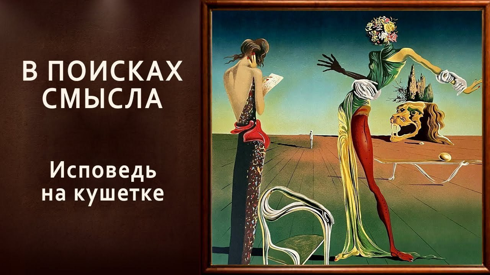

# Исповедь на кушетке

14 февраля 2025 [Аудиоверсия](https://paradoks-pinkera-pilotnyy-vypusk.simplecast.com/episodes/confession) 29:06

Что общего у психотерапии и духовной практики? Может ли психотерапия заменить религию?
Или наоборот — вера делает терапию ненужной? Размышляем на эту тему, осмысливая личный опыт.

**Е.Голуб:**
Здравствуйте, дорогие друзья!
В эфире очередной выпуск подкаста «В поисках смысла».
Подкаст ведёт Евгений Голуб и...

**П.Щелин:**
... Павел Шелин.
Всё тот же самый.

**Е.Голуб:**
Ну и сегодня мы немного поменяемся местами, поскольку вводную часть темы нашего подкаста задаст Павел.

**П.Щелин:**
У нас вроде бы сегодня подкаст на тему, напрямую не связанной с основной тематикой нашего сезона.
Посвящен он терапии, терапевтическому человеку, отношению терапевтического человека со своим психологом, и как это связано с духовной реальностью, идеализмом и проблематикой истинной лжи, собственно, который посвящен так или иначе весь наш сезон.

У этого подкаста есть интересная предыстория.
Он родился из моих, в кавычках, дистанционных кухонных бесед с одним моим очень хорошим другом, который обратился ко мне с таким...
Неочевидной самоочевидностью, как мне понять, где границы моей терапии на фоне моей духовной жизни, и, в общем, как мне понять, что это мне во благо, а это мне не вредит, и вообще, как вообще ориентироваться в этом пространстве.
Разговор ушёл на несколько часов, но в нём родилось несколько интересных наблюдений, которые мне было бы интересно обсудить с тобой, дорогой Евгений, и, возможно, предложить нашим слушателям для рассмотрения.

**Е.Голуб:**
Да, есть о чём подумать.
У каждого из нас есть свой опыт и такой, я бы не звал это конфликт, но явное противоречие между практикой духовной и практикой терапевтической, которая де-факто претендует на то, чтобы быть и духовной практикой.
Как к этому не относись?

Вот этот конфликт мне очень хорошо известен.
И давай двинемся потихоньку, по шагам, обменяемся опытом и наше рассуждение предложим нашим слушателям как повод задуматься.

**П.Щелин:**
Парадокс заключается в том, что по своему имени и психология, и, по сути говоря, религия работает, претендует на работу с одним и тем же феноменом, с психией, она же душа.
Соответственно, логичным образом должно возникнуть необходимое некое противоречие.
Почему противоречие?

Потому что методы работы, ну, прямо скажем, отличаются полной программой.
Психология претендует на естественно-научный статус, она проводит исследования так или иначе, стоит на рецензируемых научных журналах и следует научному позитивизму, по крайней мере, очень часто в своих базовых установках.
Претендует на определенный материализм и виртуальность.
В строгом смысле духовный мир, мир символический.
Есть, конечно, некоторые психологические школы, которые пытаются с этим работать, и они очень интересны, но в строгом смысле даже эту работу они пытаются все время переводить на научный язык.

А духовные практики, они отдают, на мой взгляд, должное должному и прямым образом говорят о том, что та сфера, с которой человек взаимодействует, когда он задается этими вопросами, она не про науку, она не про исчислимые знания, а она вот про этот мир невидимый, мир духовный.
Вот такое первое важное различие, первое важное противоречие.

И у человека современного, так или иначе, с терапией взаимодействующего очень часто, возникает действительно этот самый конфликт.
Я вроде бы и всё понимаю, и хочу вести духовную жизнь, и пытаюсь вести духовную жизнь.
Но и в терапии вижу какие-то определённые плюсы.
Она мне как-то помогает или не помогает.
Но дальше начинается период сомнений.
А является ли это помощью искушением?
А не является ли это помощь каким-то продвинутым самообманом?
Подобный список вопросов, которые, думаю, знакомы тебе и мне.

**Е.Голуб:**
Да, знакомы очень хорошо.
В своё время я пришёл в терапию по совету моего близкого друга.
А друг этот мой был из православного прихода, где в то время мы вместе были в Киеве.
У меня были сомнения, но для меня товарищ до сих пор обладает серьезным авторитетом и опытом во многих делах, поэтому я пришел.

И дальше интересно получилось, потому что сейчас я буду категорично выражать свое личное мнение.
Конечно же, психотерапия, особенно психоанализ в практике своей находится в непримиримом конфликте с православной практикой, назовём так, да, с церковностью, с пониманием человека в православии, с таинствами, в непримиримом противоречии, конфликте, да.
Я тебе расскажу такой интересный случай, касается, конечно, каких-то аспектов моей жизни, но очень ярко.

Я начал посещать терапевта, очень глубокого, хорошо образованного человека.
Никогда ни до, ни после я не встречал такого специалиста.
Он, к сожалению, скоропостижно скончался некоторое время назад.
Да, и в то же время я был прихожанином одного из приходов в Киеве, близких мне людей, очень искренних и глубоко верующих людей, моих ровесников, там старше, младше, неважно.
Это была хорошая сплочённая община.

В какой-то момент оказалось, что у меня есть серьёзные риски, скажем так, по здоровью, предельные.
И в этот момент как раз вот этот конфликт интересно обозначился, потому что, оставаясь в православной практике и оставаясь членом церкви, мой естественный порыв, на который откликнулись и мои близкие в приходе, это собраться вместе и помолиться.
Вместе помолиться, соборно, обо мне.
Так получилось, что собрались тогда в тот же день и в то же время, примерно, когда у меня должна была быть встреча с терапевтом.
Ну и я её перенёс заранее.

После этого мой терапевт, очень серьёзный, образованный и глубокий человек, через какое-то время он мне вспоминал.
Вот помните, да, когда вам нужна была поддержка, и, в принципе, я вам её же потом оказывал, вы там поменяли мою практику на что?
Чем вы там занимались?
Пошли туда-то и туда-то.

**П.Щелин:**
Именно так, да.
Очень знакомая история.
Вот ровно такая же история, которая у моего друга.
Ну, вот он на эту терапии ходит несколько, там, по-моему, 4-3 года, и он как раз года 3 назад начал, ну, как бы мы сказали, воцерковляться.
Ну, это вот сейчас я понимаю, что воцерковление, а там началось очень издалёка, там, по сути, началось с интереса к философии, с интереса к символическим системам картин мира, вообще, что такое символизм.
Больше именно в американской даже традиции это вот условно community symbolic world.

Вот у него вот появился к этому интерес, и оттуда пошёл, но вот в итоге сейчас воцерковился.
У него с терапевтом часто проходили, ну не то что конфликты, не конфликты, но дословная цитата была примерно такая 

> не несите мне своего Щелина сюда и не несите мне свою религию сюда.

Дословно вот такая цитата.
И здесь возникает как раз тот вопрос, который ты поднял, а является ли это противоречием неизбежным и необходимым?

К удивлению для себя, честно тебе скажу, первая реакция была, конечно, сказать «да».
Но сейчас я скорее рискну предположить, что нет, не является необходимым.
Это наиболее вероятное развитие истории, но не необходимое.
Я тебе вот здесь попробую выразить определенную гипотезу.
Почему?

**Е.Голуб:**
Давай, потому что у меня есть и другой пример.
У меня есть мой очень близкий мне человек, игумен одного из монастырей, который сознательно изучает, он тоже очень хорошо образованный человек, философски образованный, с широким кругозором, который сознательно стал изучать некоторые аспекты терапии, психиатрии и других вещей, потому что в его практике взаимодействия с людьми встречаются случаи, когда такое знание необходимо.
Он пошёл на это совершенно сознательно, и никакого конфликта в этом для него нет.

**П.Щелин:**
Я такие случаи тоже знаю.
И вот тут возникает вопрос, так в чём же разница?

Мой базовый ответ, как ни парадоксально, в любимом слове современного психологического словаря «в границах».
В четком понимании границ и в четком понимании задач.
Сейчас объясню на образах.

Я предлагаю нам представить человека, приходящего в терапию, как человека без одной ноги.
Ну, для примера.
Пусть будет человек без одной ноги.
Вот у тебя нога отсутствует.
У меня нога отсутствует по разным причинам.
Это вот таr называемая травма, боль, проблема, поломанность.
Называйте, как хотите.
Вот то, с чем человек в эту самую терапию приходит.
Дальше, что возникает, вопрос о пределах возможностей, честности и границах.
Что может сделать хороший терапевт?

Он может научить тебя пользоваться костылем и может научить тебя ходить на неком протезе.
То есть предложить тебе техническое адаптивное решение к проблеме, отсутствующей у тебя ноги.
И в этом есть определенная, конечно, польза.
Ну, потому что без ноги ходить тяжело, мягко говоря, это проблема.
Это создает тебе реальные проблемы.
Ты там, не знаю, из дома выйти не можешь или что-то подобное.
Кстати, плохой терапевт в этом контексте даст тебе наркотик, чтобы ты забыл о том, что у тебя нога отсутствует.
Это вот совсем, скажем так, низкий уровень.
Это вот самый терапевт, который условно только вредит.
И это вот та самая медикализация человеческого бытия, о котором мы с тобой обсуждали в других подкастах.
В рамках этой метафоры это безногому просто вколоть кучу наркоты, чтобы он забыл, что у него нога отсутствует.
Хороший терапевт признает, что у тебя отсутствует нога и будет учить тебя ходить на костыле или ходить с некой формой протеза.
Но он не будет врать тебе, что он может тебе новую ногу отрастить на месте вот этой отсутствующей.
А в чём стоит радикальность предложения, условно?

Ну не предложения, а радикальность духовного опыта в этих вопросах, что вот Христос тебе новую ногу дать может.

**Е.Голуб:**
Давай как-то и поясни, потому что наши слушатели сейчас...

**П.Щелин:**
Требуешь разъяснений.
Но вот смысл в том, что насколько я сейчас понимаю, к какому выводу пришёл, что терапия излечения предложить никакого тебе не может.
Она может тебя научить жить с твоей болезнью.
Жить с твоим вот там, я не знаю...

**Е.Голуб:**
Особенностью, болью, ситуацию принять, как-то её переосмыслить, найти такой для себя нарратив или такой сценарий, в котором то, что происходит с тобой, имеет смысл, или наоборот, то, что тебя мучает, от него можно отказаться и не страдать по этому поводу.
Ну да, хорошо, так.

**П.Щелин:**
Образ, а тот, скажем так, та высота, которую предлагает христианство, в частности, ну, Христос.
Конкретно мы это постоянно видим в евангельских образах, это из ничего создать глаза больному.
То есть вылечить болезнь.
Не научить тебя жить с болезнью, а преобразить твою болезнь и вылечить твою болезнь.
В этом и есть радикальная разница.

То, что духовный путь, он своей конечной целью имеет надежду ставить не научить тебя жить с болезнью, а вылечить тебя.
В то время как самая лучшая терапия, все, что может делать, научить тебя адаптироваться к твоей особенности.
И в этом их, если угодно, различие и даже определенная комплементарность.
Потому что на пути к излечению у тебя есть длинный путь, в рамках которого, ну, условно говоря, пока нога не выросла, полезно научиться и на костыле ходить, чтобы, условно говоря, окружающих палками не бить, да?
Или чтобы из дома смочь научиться выходить.

Но здесь есть вот эта грань, есть вот эта разница, есть граница.
Вот такой образ у меня родился в беседе.
Мне интересно, что ты думаешь.

**Е.Голуб:**
Я хочу сказать, что я сейчас превращусь в агрессивного нашего слушателя какого-нибудь и начну на тебя нападать.
Ты просто приготовься, чтобы не было сюрпризов.

Агрессивный слушатель скажет, так, Павел.
Я что-то не припомню, чтобы в последнее время случались такого рода чудеса, так сказать, в православной церкви, что у кого-то там глаза открывались, ноги отрастали или что-то подобное.
Поэтому какие ноги отрастущие?
О чём это речь?
Что это за мистика?

**П.Щелин:**
Сложно общаться с агрессивным слушателем, у которого нет метафорического восприятия мира, да и который метафору не понимает.

**Е.Голуб:**
Ну хорошо, тогда поясните метафору.
Если мы говорим о том, что терапия даёт костыль, и значит, душевную боль, отсутствие какого-то душевного элемента, оно чем-то заменяет.

**П.Щелин:**
Не сколько заменяет, сколько учит тебя с этим жить.

**Е.Голуб:**
Хорошо, да.

**П.Щелин:**
А духовный путь через таинство и через прочее учит тебя не с этим жить, а учит тебя, условно, отрастить ногу и исцелить твою болезнь.
И здесь, поскольку ты вот просто прямой пример, который ты произнес, то, что не видел я примеров с отрощенными ногами, но это от плохого наблюдения.
Примеры сплошь преображенных людей мы видим в церквях сплошь и рядом.
То есть, условно говоря, по-настоящему такие тайны, как человек простил своего врага.
Ну хорошо, давай пример такой.

Классическая терапевтическая история.
У человека никогда не было отца, и вот эту дыру ему никакая терапия не заполнит.
В принципе, она может тебя научить жить с отсутствующей фигурой отца.
Научить тебя обращаться с этой проблемой и возникающими из нее комплексами.
Но решить эту принципиально на глубине твоего духа не может.
То есть она может тебя научить сознательно с этим обращаться, минимизировать издержки.
Допустим, у тебя из-за этого прокрастинация.
Ты научился обходить вопросы прокрастинации через разные технические решения.
Но сам зуд в твоем сердце терапия снять не может.

А вот таинства могут.
И духовная жизнь может.

**Е.Голуб:**
Ну тут вот этот наш условный агрессивно-атеистический слушатель скажет, ну слушайте, Павел, ну давайте, это же всё достаточно понятно, ну перенесёте вы свою, так сказать, фигуру отца на фигуру Бога, да?
Ну и полегчает вам.
Ну любой психолог или любой психиатр вам это объяснит за три минуты, да?

Что-то скажет наш несогласный слушатель, что-то здесь не то.
Или объяснение ваше страдает неполнотой, или метафоры недостаточно удачные, или этот опыт невозможно передать таким образом.
Давай я попробую порассуждать, возвращаясь на позицию солидарности с тобой.

Я думаю, что ряд психических страданий вызвано серьёзными нарушениями такого, скажем, физического характера.
Когда речь идёт о серьёзных болезнях, шизофрении серьёзной, психопатии и так далее.
Здесь требуется профессиональная помощь.
Конечно же, оставляя место и время чуду, мы говорим, что всё-таки, если человек, очевидно, страдает от патологии, ему нужно идти к специалисту.
Но достаточно много примеров, не доходящих до такой грани всё-таки.

Достаточно много людей, которые на своём жизненном пути, следуя страстям, о которых мы иногда вспоминаем с тобой, заходят в потакание этим страстям, слабостям своим, потому что их нет числа, в такую горящую яму, где жить совершенно невозможно.
И здесь обращение к практике христианского, к вере, к пониманию истин христианства, здесь, став на этот путь, они могут выйти совершенно на другой уровень понимания жизни и вообще своей жизненной ситуации, жизненной практики.
То, что ты говоришь, преобразится.
Можно, наверное, так порассуждать?
Как ты считаешь?

**П.Щелин:**
Ну да, мне кажется, возможно, кому-то твой образный ряд и твой метафорический язык окажутся более близким и более понятным.
Тут для меня вот еще есть один принципиальный момент, и, может быть, это про мой опыт терапии.
Да, я тоже имел опыт терапии, дисклеймер.
Человек своего времени.
Что для меня ключевое отличие?

Вот когда речь идет, ты упомянул, ну, вам обычный терапевт объяснит, что просто делаете хитрый перенос, и через это решаете свой anxiety.
Вот проблема-то как раз в том, что когда я это делаю в рамках терапевтической штуки, я знаю, что я это делаю, я понимаю иллюзорность этого решения.
Да, это полезная иллюзия.
Да, это иллюзия, которой я пользуюсь как инструментом, чтобы решать свои технические, скажем так, проблемки.
Назовем это так.

Но.
Я знаю, что это именно виртуальное, по сути, решение, что оно по-настоящему нереальное.
Я по-настоящему не могу решить вот эту зудящую, условно, пустоту, дырку, называй, как хочешь, болезнь в глубине сердца, которая и является первопричиной всех, скажем так, последствий.
А вот в рамках духовной жизни тебе предлагают путь, по которому есть шанс разобраться с первопричиной, и это разобирательство будет не иллюзорное, а предельно реальное, и можно даже сказать, сверхреальное.
И вот в этом большая разница.
Да, пока на этом пути, и вот поэтому здесь для меня и пролегает граница.
То есть если ты в терапии понимаешь, чем ты занят, и понимаешь, что тебе нужны функциональные технические решения в рамках определенной, скажем так, комнаты, я этого конфликта поэтому не вижу необходимым.

Но вот если ты тешишь себя иллюзией, что вот эти технические решения решат вот эту глубинную пустоту, здесь, я боюсь, рано или поздно ты столкнешься с разочарованием.
И с конфликтом в том числе и с терапевтом.

**Е.Голуб:**
Да, но я скажу и с другой стороны.
Давай посмотрим на другую сторону.
Ведь если вернуться к теме лжи, притворства и лукавства, и к твоему тезису о том, что встав на духовный путь, ты можешь решить свою проблему или избавиться от боли просто потому, что ты сущностно изменишься.
Вот это сущностное твое изменение.

**П.Щелин:**
Ты там как раз не один.
Там вот как раз есть проблема то, что это делаешь не только и не сколько ты сам с собой, а еще через тебя с тобой.
Вот это очень такая большая разница.

**Е.Голуб:**
Да, я имею в виду, что как результат твоя суть преобразится.
Других слов не найти.

Но тут начинается несколько больших но, но, но.
Ведь этот путь, это же не просто приходить в храм и выполнять ритуальные какие-то вещи, о чем в большинстве думают наши современники.
И это даже не радость от существования в уютной общине близких и милых людей, к чему тоже очень много часто всё сводится.

Что церковь и община — это не убежище.
К сожалению, большей части туда люди идут как в убежище, прячась от жизни и закрываясь там, убегая от себя.
И в этом случае мне сомнительно, что будет какой-то результат.

**П.Щелин:**
Необходимым условием является предельная честность и предельная открытость.

**Е.Голуб:**
Предельная честность.
Ты знаешь что?
Мне кажется, здесь найдётся пересечение нашей темы.
Именно.

Духовное преображение возможно только в предельной честности.
Только в предельной честности.
И вот когда мы говорим, что духовные идеалы православия, может быть, даже не только православие, монашество православное — это аскеза, и это постоянное наблюдение за собой и уличение и удаление от себя любого рода лжи и притворства.

Интересно получается, что для того, чтобы жить в сегодняшнем мире, необходимо лгать.
Понимаешь ты это, не понимаешь, притворяешь.
Это как бы по умолчанию такое свойство.
Все врут, тебе придется, что делать.
Такова жизнь.

А для того, чтобы двигаться на духовном пути, надо быть честным.
Там места лжи нет, она тебя будет все время отравлять.
Не давать тебе двигаться дальше.

**П.Щелин:**
Да.
И вот там это является необходимым препятствием.
Давай так, требования к честности гораздо в терапии ниже.
Они тоже необходимы.

**Е.Голуб:**
Нет-нет, мне мой аналитик говорил, вы можете мне врать совершенно спокойно.
Я от вас не требую к честности.
Говорите, просто разговаривайте.
Говорить правду не обязательно.

**П.Щелин:**
Интересно, мне такого не говорили.
Ну вот видишь, да, то есть как минимум требования гораздо ниже, то есть как бы мягко говоря.
Опять-таки, там же это объясняется именно тоже, простите за эту тавталогию, терапевтическим аргументом.
Любой способ приспособления, который вам подходит, он рабочий.

**Е.Голуб:**
Да.
То есть главное избавить от боли, найти способ существования, который будет приемлем, терпим и продуктивен.
Человек сможет быть социально адаптирован.

**П.Щелин:**
Продуктивен с точки зрения тех целей, которые человек ставит перед собой.
Давай уточним.

**Е.Голуб:**
Смог работать, работу работать, делать что-то, общаться в семье.
Молодец.
Все.
Задача решена.

Перестал просыпаться по ночам три раза паническими атаками.
Да, да, да.
Все.
Задача решена.
Ну что скажешь?

**П.Щелин:**
Мне это, кажется, понравилось.
Собственно, закругляюсь тогда, что получается.

Чтобы не сложилось впечатление, что там условно я против терапии, или ты там, так далее, против терапии.
Мы не против, мы за честность.
То есть можно сказать, что в терапии действительно присутствует большой потенциал, особенно для современного, скажем так, человека.
Необходимого противоречия с духовной жизнью в условиях честности с ней нет.
Но именно в условиях честности.
Если вы понимаете, зачем вы идёте на терапию, если вы понимаете её принципиальные границы, очень важный этот момент, ну и если вы адекватно ставите себе цели и задачи.
Вот я бы так это для себя сформулировал.

**Е.Голуб:**
Я попробую тебя продолжить.
Сейчас школ терапии десятки, если не больше.
Есть там КПТ, которая доказала якобы научную свою действенность.
Есть там миллион всего.

Но я бы сказал, что природа этого воздействия на человека, она просто принципиально другая, чем то, что происходит с человеком, когда он меняется.
Происходит его обОжение в какой-то степени.
Прости, Господи, меня за такого рода слова упомянутые, может быть, не к месту.
Но это просто принципиально разные вещи.
И сводить практику исповеди к психотерапии неверно.

**П.Щелин:**
Вот.
В том-то и дело.
Они очень с виду похожи, но на самом деле они очень сильно про разное.
И вот это разное надо понимать.
Да, вот здесь я с тобой очень сильно согласен.
Хорошо, что ты это сказал.

Это именно про разное, хотя в обществе вроде бы стремятся выполнять одну и ту же функцию.
Вот это, кстати, очень большой такой парадокс.

**Е.Голуб:**
И очень часто путают одно с другим.
Ведь и принято говорить, ну, конечно, раньше функцию терапевта выполнял священник, а вот он теперь выполняет.
Может быть, он невольно и выполнял эту функцию, но это не его суть, это побочное явление, то есть это какой-то эффект облегчения человека в чём-то, но задача-то не в этом состоит.

Почему-то даже самые благожелательно настроенные к христианству люди, они предпочитают как-то обходить такой момент, что вообще-то целью жизни человека с позиции христианства является обОжение, то есть приближение к Богу, спасение, вечная жизнь.
В повседневной жизни это, соблюдение норм каких-то моральных, быть хорошим человеком.
Кто же против?
Пожалуйста, будьте.

Но вообще-то это же не про это.
Это же, собственно, тоже некоторый побочный эффект.

**П.Щелин:**
Это именно побочный эффект.
Я тебе, знаешь, вот сейчас, вот говоришь, вспомнил, чтобы подкрепить цитату, то, что это не мы всё придумали, на самом деле, прям в посланиях апостолов есть несколько строчек, которые Павел говорит ровно об этом.
Здесь просто на нескольких языках придётся.

> Душевный человек не принимает того, что Духа Божия, потому что он почитает это безумием и не может разуметь, потому о сём надобно судить духовно.
> Но духовный судит о всем, а о нём судить никто не может.

Вот тут это интересно, что то, что на русском звучит как «душевный», в английском языке звучит как «natural», а на греческом — «physical».

**Е.Голуб:**
Интересно.

**П.Щелин:**
То есть вот терапия, она про душевного, natural, physical.

**Е.Голуб:**
Physical, да.
Отлично.
Сейчас же вообще говорить о духовной реальности, как сказать, вот как грекам 2000 лет назад, да, безумие.
Какая духовная реальность?
Что за эзотерику мне парите, да?
Это же, блин, не здесь.

**П.Щелин:**
Нет, ну с греками как раз было гораздо проще.

**Е.Голуб:**
Нет, ну так они про воскресшего бога, да?
То есть это же безумие.

**П.Щелин:**
Нет, воскресший бог — это, конечно, безумие, но то, что там духовная реальность есть, это их не ставило под сомнение.

**Е.Голуб:**
Ну да.
Сейчас это всё безумие, да?

В лучшем случае можно сказать, что да, да, квантовая физика, суперпозиции и всё такое, ну может быть, но, конечно, это всё за пределами повседневного разговора.
Поэтому давай так, я тебе расскажу, как я вижу.

Терапевт — это профессиональное зеркало.
Грамотная, профессиональная, хорошо обученная, понимающая, как нужно, под каким углом нужно себя терапевту поставить, чтобы ты отразился в своей полноте, потому что чаще всего мы не видим вот этих вещей в себе, которые у нас болят, и почему.
То есть мы не видим тех шипов, их природу, не можем их из себя вытащить.

Ещё моя любимая поговорка моего покойного терапевта, что чтение меню не делает человека сытым.
Да, ведь тоже понимание того, что с тобой происходит, как мы знаем, тоже далеко не всегда помогает.
А терапия очень часто утверждает, что вот там вам нужно понять...

**П.Щелин:**
А делать-то мне с этим что?
Да, это, кстати, очень хорошее наблюдение, что очень часто терапия...
Окей, я понял, что со мной...
Ну, я понял, почему мне там плохо, делать-то мне с этим что?

Ну и дальше, как говорил мой терапевт, давайте посмотрим, как вы к этому адаптируетесь.

**Е.Голуб:**
Да, да.
Ну вот, да, понимаешь?

А вот практика в христианстве, я даже не знаю, понимаете, что под словом «практика» я имею в виду духовную жизнь.
Если ты начинаешь в этом смысле куда-то двигаться, она принципиально другая.
Ты знаешь, что тебе делать.
Никогда не возникает вопроса, что тебе делать, когда ты видишь своё состояние.

Вот я хотел ещё сказать, что, повторяю это несколько раз в разных наших выпусках, меня потрясает понимание всех особенностей и движений, микродвижений души человека, страдающей у православных писателей, христианских писателей XIII века, XIV века.
Это просто, когда слушаешь, читаешь Паламу, то это верх какой-то рефлексии.
То есть человек, видно, сам пережил и глубоко понимает, что происходит в душе человека с какими-то там серьёзными внутренними вопросами.
Это, конечно, невозможно просто передать моего чувства изумления, когда с этим сталкиваешься.
Кажется, что эти-то люди должны были вообще быть далеки от такого рода переживаний, но нет.
Все движения наши и вверх, и вниз им хорошо были знакомы.

**П.Щелин:**
То есть парадоксальным образом получается, что действительно реальная проблема всегда заключается в обмане.
Либо в обмане относительно предмета возможности, либо об обмане границ возможного, либо об обмане целей действий и так далее и тому подобное.
Либо в обмане, в отрицании первопричин.

Ну, допустим, если проблема вот на языке, вот то, что мы использовали.
То есть, можно сказать так, духовные проблемы имеют физические вот эти natural, душевные последствия, назовем это так, для человека.
Чаще всего они тесно связаны.

В чем вызов и проблема терапии, то, что она может работать только с последствиями.
Но очень часто она претендует на то, что, работая с последствиями, она может устранить причину.
А вот это не так.
Устранить причину она не может.
И мы себе пока не признаем реальность причин, обречены на исключительно работу со следствиями, в которых самом по себе нет ничего плохого, но если мы делаем из этого идола и начинаем считать, что это решит нашу первопричинную проблему, мы просто врём сами себе.

**Е.Голуб:**
Ну, скажем так, надеемся на что-то, что не имеет сущностного основания.
Итак, если болит, то нужно идти к врачу.
Если рвёт на части, если ты находишься на шпагате в жизненных ситуациях, не понимая, куда двигаться дальше, надо идти к терапевту, к специалисту, с которым, по крайней мере, вы можете поговорить.
Потому что зачастую, ну, я прямо скажу, что сегодня в том состоянии, в котором находится практика современной православной церкви, далеко не всегда вы встретите в приходском храме священника, который будет в состоянии вам помочь именно как терапевт.
То есть он честно выполнит какую-то обрядовую составляющую, но она будет работать только тогда, когда вы будете идти по духовному пути, когда у вас с вашей стороны движение.
И тогда вот эта внешняя форма, она будет на полном содержании.
Не слишком ли далеко я зашел в своих вещах?

**П.Щелин:**
Нет, по-моему, ты зашел прекрасно.
По-моему, это хорошее завершение этого выпуска.
Мне понравилось, как он спонтанно и естественно получился.
И мне правда будет интересно, что скажут наши слушатели, потому что, значит, всех тем, которые мы обсуждали в этом выпуске, мне кажется, это в каком-то смысле самое близкое будет для многих наших зрителей, потому что кто из нас сегодня не задается этими вопросами?

По крайней мере, в моей среде практически доля людей, которые так или иначе лично с этим сталкиваются, крайне велика.
И мне интересно послушать то, что они нам скажут.

**Е.Голуб:**
Да, я опять-таки рискну сказать некоторые банальности или упроститься до искажения.
Но ведь чему нас учит практика и наблюдение древних?

То, что есть дух, душа и тело.
То есть если дух повреждён, то страдает душа, а потом страдает тело.
То, что принято потом психосоматикой называть и так далее.
И мы с психосоматикой приходим к врачу, он отправляет нас к терапевту.
Но по-хорошему терапевт, разобравшись с такими поверхностными повреждениями, должен был отправить нас куда-то ещё, но, конечно же, этого не делает.
Поэтому стоит просто об этом задуматься.
Задуматься о духовной реальности.
Ну и дальше там что-то будет с вами.
Или не будет.

**П.Щелин:**
Или не будет.
А что будет точно, будет следующий выпуск подкаста, который мы с тобой запишем в скором времени.

**Е.Голуб:**
Да, да, да.
И обещаем, я обещаю себе и тебе не вторгаться в такие тонкие материи, потому что я в них чувствую себя очень неловко, заходя на почву, где не считаю, что имею право как-то говорить об этом.

**П.Щелин:**
Ну, мы здесь, поэтому, кажется, прошлись по хорошей тонкой грани, больше делились в том числе и своим личным опытом, наблюдением, поэтому, я думаю, получилось хорошо.

**Е.Голуб:**
Всем спасибо, кто дослушал.
Заранее прошу простить, если каким-то неловким рассуждением я заделал чьи-то чувства или какими-то формулировками догматические принципы христианские каким-то образом потревожил, но зла в намерении этом не было.

**П.Щелин:**
До встречи.

**Е.Голуб:**
До встречи.
