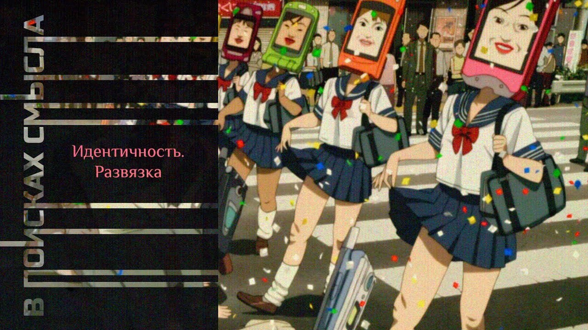

# Идентичность. Развязка

13 ноября 2023 [Аудиоверсия](https://paradoks-pinkera-pilotnyy-vypusk.simplecast.com/episodes/identity-conclusion) 31:29

Либерализм, как мировоззрение, в своем пределе, требует для человека освобождения от любых ограничений в выборе идентичности.
В стремление к освобождению, ставка сделана на развитие технологий.
Развязка драмы эпохи модерна уже близка.

**Е.Голуб:**
Здравствуйте, друзья!
В эфире подкаст «В поисках смысла» Павел Щелин и Евгений Голуб.

**П.Щелин:**
Здравствуйте!

**Е.Голуб:**
Сегодня мы продолжим говорить об идентичности, но темой сегодняшнего разговора будет соединение понятия идентичности, личности и технологии.
Павел, почему тебя занимает эта тема именно в этом разрезе, в этом ключе?

**П.Щелин:**
Ну, потому что наш подкаст подходит к завершению своего второго сезона, и пора производить некоторые выводы, суммировать какие-то наблюдения и соединять воедино элементы мозаики, которые мы собирали с тобой на протяжении предыдущих выпусков.
И мне кажется то, что для современной дискуссии, которую мы косвенно пытаемся вести, именно эти три понятия предоставляют одну из сущностных проблематик, обсуждение которой позволит нам прийти к некоторым вроде бы относительно простым, но довольно глубоким выводам.
Вот поэтому я это и хочу сейчас с тобой обсудить.

**Е.Голуб:**
Хорошо.
С чего начнём?

**П.Щелин:**
Начнём с некоторых выводов и наблюдений, которые мы с тобой сделали во время предыдущих выпусков.
Первое, мы пришли к выводу о том, что наличие идентичности как определённого способа принадлежности группе, с одной стороны, через разделение определённого мифа, истории, нарратива, представления о мире, то есть мировоззрения, является неотъемлемой частью человека как социального животного.

**Е.Голуб:**
Можем сказать, неотъемлемой частью личности человека, кроме унаследованных физико-химических реакций, его особенностей.

**П.Щелин:**
Можно, но здесь есть интересно.
Пока я бы личность вёл немножко попозже, потому что слово «личность» для меня обладает очень точным значением.
Проговорим, что личность, конечно, прежде всего понимается традиционно, я предлагаю придерживаться этого понимания, как социальное проявление человеческой индивидуальности.

**Е.Голуб:**
Хорошо.
А идентичность?

**П.Щелин:**
Сначала тогда немножко про личность.
Почему личность?
Потому что личность — это от лик, личина, маска.
То есть это то, как мы взаимодействуем с другими людьми в обществе.
Личность — это прежде всего про социальность.
Очень важный момент.

А идентичность — это действительно может быть наполнением этой самой личности.
Но при этом идентичность не принадлежит только личности.
Она может затрагивать глубинные человеческие какие-то основы.

На самом деле ты прав.
Чаще всего идентичность — это тоже принадлежность именно социального.
То есть есть какая-то несводимая глубина в сердце человека, которую идентичность не достигает, условно говоря.
Святой Вечности — зерно Лермонтовское.
Но в обществе работают и действуют прежде всего действительно личности и групповые идентичности с ними связанные.

**Е.Голуб:**
То есть мы говорим о том, что личность — это более широкое понятие, чем идентичность.
Идентичность — это какое-то свойство личности, наполнение, но кроме идентичности, как набора концептуального представления о мире, о всех его аспектах и своей роли в этом мире.
Кроме этого набора, личности присущи ещё какие-то компоненты, которые мы сейчас не рассматриваем, чтобы не усложнять.

**П.Щелин:**
Мы, на самом деле, сейчас будем рассматривать.
Почему?

Потому что вот здесь одно из ключевых, на самом деле, противоречий, или, если тебе угодно, споров, собственно, что есть человек.
Является ли человек исключительно суммой его социальных отношений, либо он также включает в себя некое уникальное, несводимое какое-то зерно и в каком статусе это зерно существует.
Вот здесь как раз начинаются глубочайшие философские споры и дебаты, которые имеют прямое отношение к нашей всей проблематике.
Почему это важно?

Потому что если личность — это исключительно отношение с другими людьми, то пересобирая эти отношения, меняя эти отношения, меняется твое «я» на всю глубину твоего существования.
Здесь есть большой соблазн по созданию нового человека.
Мы сейчас эти связи будем показывать.
Если мы поменяем социальные отношения в обществе, мы создадим нового человека.

**Е.Голуб:**
Я понимаю, у меня борется много вопросов, потому что для меня личность, конечно, это намного больше, чем набор концепций и представлений о себе и о мире.
Тут есть и психические особенности, физиологические и так далее.

**П.Щелин:**
Ты абсолютно прав, просто это вопрос языка.
Вот то, что ты описываешь, предпочитаю называть человеком, условно говоря, как некую цельность.
Личность все-таки ограничивать до социальности.
Но твой вопрос очень хорошо ложится в проблематику отсутствия точности в наших словах при обсуждении этих феноменов, и это не случайно.

**Е.Голуб:**
Ну, мы можем договориться об этом понятии, принять твою трактовку и двинуться дальше.

**П.Щелин:**
По крайней мере, на, скажем так, этап этого выпуска.
Дальше наступает следующий наш вывод, который тоже связан.
Какая взаимосвязь идентичности, социальности, действия и личностей?

Ну, если совсем упрощать, то именно идентичность является одной из ключевых мотиваций для действий человека.
Поэтому она нам интересна.
Поэтому об этом и стоит иметь смысл говорить.
Это не нечто, что мы можем только воображать аналитически.
Это то, что напрямую влияет на жизнь как человека, так и общества.
А уж тем более на уровне любой коллективности.

В любой коллективности ключевое топливо, которое позволяет ей воевать, строить, именно как некое коллективное действие — это именно идентичность.
Действительно.

**Е.Голуб:**
Под идентичностью мы сейчас подразумеваем некоторый набор представлений о том, что такое хорошо, что такое плохо, где мы, где мир, где мы в мире, и когда мы, и почему в мире.
То есть создаётся некоторая разность потенциалов, которая приводит к движению.
Если мы хотим идти от плохого к хорошему, мы двигаемся.
Если мы хотим идти от маленькой и незначительной роли к большей роли, мы двигаемся.
Вот это, собственно, то, что создаёт мотивацию к действию.

**П.Щелин:**
И на уровне коллективности она сопряжена с очень древними феноменами и практиками по сути коллективного бессмертия.
В том или ином виде любая коллективная идентичность уходит своей глубиннейшей мотивацией в форму коллективного бессмертия для человека.
Она отвечает за преодоление страха смерти.

Прямо скажу, это не единственный способ работы с этим.
Есть еще два других пути.
Но, по сути, к концу сезона понял то, что мы разбирали и говорили именно об этическом, если тебе угодно, об идентичностном, коллективном идентичностном.

**Е.Голуб:**
Я ещё раз хочу сделать шаг назад, прости меня, пожалуйста.
Для меня это разные вещи, то есть коллективная идентичность, я как принадлежность к некоторой культуре, к некоторому, может быть, даже выдуманному виртуальному сообществу, но всё-таки я как принадлежность сообщества, и я как я.

**П.Щелин:**
Абсолютно.

**Е.Голуб:**
И я могу отделять себя от этого.
И мы сейчас говорим только о коллективной идентичности, что во мне является частью, которой я соотношу себя с общим.
Или мы говорим о идентичности в каком-то другом смысле?

**П.Щелин:**
Нет, мы говорим именно об этих двух вещах одновременно.
И о двух подходах, которые существуют при взаимодействии вот этих двух вещей, которых мы, собственно, и вот тот вывод, которому я подвожу.

Есть два способа взаимоотношения между твоим «я» и твоим «я как часть Х».
Условно, между твоим «я» и твоим коллективным «я».
Эти два способа взаимоотношений исторически, собственно, определяют движение очень сильно последних столетий, как минимум.
Я предлагаю в рамках нашего вот этого выпуска называть их следующими терминами.

Один способ — это органический, а второй способ — это технический или технологический.
В чем разница?

В обоих случаях ты можешь производить аналитическое разделение.
То есть очень важно понимать.
Ты действительно можешь аналитически, в разуме разделить.
Условно говоря, себя как вот это несводимое, уникальное «я» от твоего «я» как части некоторой и так далее группы.

Но в органическом подходе все эти части рассматриваются как живое органическое продолжение тебя как некой цельности.
Условно говоря, ты не можешь просто произвольно выкидывать вот эти части свои коллективного «я», потому что они являются частью твоего развития.
Ты всю жизнь их выстраиваешь.

Мы в прошлом выпуске проводили метафору «колец дерева».
В нем есть вот это зерно, и вокруг него постепенно происходит расширение, развитие вот этих, так сказать, колец и форм твоей идентичности.
Аналитически ты можешь их разделить, но просто взять и вырезать лобзиком - для тебя это больно.
Это разрушает тебя как цельность.

**Е.Голуб:**
Для меня, откровенно говоря, это вообще невозможно, потому что это некоторый опыт, который уникален, и он настолько неповторим, особенно опыт детства, младенчества, юности, что он навсегда запечатлевается в личности человека.
Что родное?
Мы говорим, конечно же, о языке, о сказках, об образах, героях, о всей этой этической системе, которую мы усваиваем.
И, на мой взгляд, если говорить об изменении такого способа постижения мира или соотношения себя с миром, то только через катастрофу его можно изменить, потому что это как лишиться ноги, руки, потерять память в результате аварии, физического повреждения.

**П.Щелин:**
Я с тобой согласен, прямо тебе скажу.
Я являюсь тоже сторонником органического подхода к идентичности, но он не единственный, и более того, он не доминирующий.
Доминирует сейчас технологический взгляд на этот процесс.

Технологический взгляд как раз предполагает другое.
Технологический взгляд предполагает действительно, причем объяснить он это не может, потому что слово «душа» он избегает, что вот это зерно есть, а дальше оно начинает взаимодействовать с окружающим миром в произвольном, волюнтаристском, даже можно сказать, самовольном порядке.
Любые части вот этих колец становятся не живыми, а становятся, если тебе угодно, строчками некого кода.
А твое зерно становится некоторой формой программиста, который может эти строчки кода в произвольном порядке пересобирать всю свою жизнь, как тебе угодно.

**Е.Голуб:**
Нечто.
Оно должно каким-то образом тоже сформироваться, да?

**П.Щелин:**
Нет, оно просто есть.
Это они объяснить не могут, как оно существует.

**Е.Голуб:**
Ну хорошо, а как вот это зерно, которое непонятно что, делает выбор?

То есть для того, чтобы делать выбор, нужно что-то от чего-то отличать.
А если ты зерно, то у тебя там ничего.

**П.Щелин:**
Понимаешь, я тебе могу только привести здесь цитату Ивана Васильевича Киревского, еще с XIX века, которая отвечает на твой вопрос.

> Весь частный и общественный быт Запада основывается на понятии об индивидуальной, отдельной, независимости, предполагающей индивидуальную изолированность.

**Е.Голуб:**
Ну то есть как будто бы индивидуум появляется на свет с какими-то свойствами априорными, которые позволяют затем взаимодействовать со всей поступающей информацией произвольно, не присоединяться к ней или не отказываться от неё, а именно выбирать.
Вот это мы берём, а здесь мы не берём.
Здесь я выбираю такой набор кубиков и выстраиваюсь в такую вот картинку или пазликов.
Как если бы это было в силах вот этой, я не знаю чего, какой-то части, совершенно для меня непонятной, себя пересобирать в зависимости от чего бы то ни было.

**П.Щелин:**
Могу сказать даже на философском языке.
По сути, этот подход говорит о том, что любые родовые или видовые характеристики являются произвольными для человека.

**Е.Голуб:**
То есть неважно, на каком языке тебе мама пела песенки, ты можешь пересобрать себя по-другому.
Пели тебе на русском, потом ты решил стать китайцем, и всё, и присоединился, и очень даже ничего.
Совершенно такой же китаец, как тот, который родился в Китае.
Но это же из опыта не так.
Ну как можно отрицать это?

**П.Щелин:**
Можно.
У нас на этом стоит большинство современной западной академии, поэтому нормально это отрицается, и деньги хорошие на этом собираются, и все как бы происходит.
Это мейнстримовская парадигма.

Как раз то, что ты сейчас позиционируешь, вот этот феминологический взгляд, это является сейчас позицией.
Просто для контекста.
Сам факт наличия оппозиции не делает его более правым, но я с тобой согласен.

**Е.Голуб:**
Есть некий взгляд на человека, который говорит о его способности этого человека пересобирать свою идентичность и индивидуальность в произвольном порядке, в зависимости от собственного желания или потребности какой-то.
Я сегодня принадлежу французской культуре и ходил во французскую школу, детский садик.
А тут я достиг какого-то возраста 25 лет и понял, что французская культура мне чужда, а вот культура жителей Ямайки, да, это вот оно моё.
И я, значит, спокойненько постирал себе, что-то у меня было в опыте, и пересобрал себя как ямайца, и очень даже совершенно спокойно стал таким же, как они.

**П.Щелин:**
Абсолютно, да.
Именно так.
И с точки зрения либерализма, название вот этого мировоззрения как раз является либерализмом.
Что является в ядре либерализма именно вот такой взгляд на, по сути говоря, идентичность.
И он возникает не случайно.

Здесь нужно сделать все-таки фундаментальную оговорку, отступление или констатацию.
Такой взгляд действительно является следствием объективного феномена.
Объективный феномен заключается в том, что при естественном подходе к этой проблематике невозможно признать самовольную свободу человека.
Ты не можешь быть свободен от своих идентичностей.
Они являются частью тебя.
В какой-то степени, да, там есть пространство для творчества, они меняются в течение твоей жизни, но любое имя в рамках такого подхода действительно является ограничением.

**Е.Голуб:**
А как иначе, если у меня нет хвоста?
Это вот потому, что я гомо-сапиенс, да?
То я могу сколько угодно фантазировать на тему, что у меня есть хвост, да?
И какие-то еще другие атрибуты, но у меня их нет.
Это ограничение природное.
Что с ним делать?

**П.Щелин:**
Что с ним делать?

Развивать технологии, чтобы у тебя была возможность сделать хвост, если тебе так оно захочется.

**Е.Голуб:**
Ага, вот в чем дело.
То есть ты говоришь о том, что либерализм неизбежно в своём развитии приводит нас к тому, что технология должна превратить человека во что угодно.

**П.Щелин:**
Дать человеку возможность произвольно в любой момент времени преодолевать любое ограничение.
И сначала, ты абсолютно прав, это касалось социальных вещей.
И здесь, в принципе, понятно как.

Ну, условно, выучи иной язык, переедь в иную страну, начни изучать ее там, в том числе, какие-то обычаи, хотя непонятно зачем, потому что вроде это же тоже произвольно, но оставим этот момент.
Но как-то еще мы можем себе представить.
В конце концов, миграция — это исторический процесс, она была постоянно.

Либерализм же, по сути, о чем говорил в своем, скажем так, пиаре, назовем это так, ну и чем он подкупает сердца.
То, что ты оказался в идентичности, и ты ощущаешь ее как некую тиранию.
И в этом он прав.
В любой идентичности есть тиранический элемент.
Тиранический как ограничительный.
То есть он тебя как в каком-то смысле ограничивает.
А либерализм тебе вот дает освобождение.
Ты можешь освободиться от этого ограничения и, соответственно, перейти в иное состояние.

**Е.Голуб:**
Ну, сразу приходят в голову мозги в банке пелевинские, да, которые приходят в любое состояние вообще без каких-либо ограничений.

**П.Щелин:**
А это ты уже сразу делаешь логический эксперимент, где это необходимо должно закончиться.
Но сначала оно пройдет очень длинную дорогу.
Там от культуры, от языка, на следующем этапе к физическим характеристикам.
И пол является таким же ограничением, и отсутствие у тебя хвоста является таким же ограничением.

**Е.Голуб:**
Тираническим.

**П.Щелин:**
Тираническим.
И то, что ты прыгать на 3 метра не можешь - тирания.
И так далее и тому подобное.

**Е.Голуб:**
Ну какое-то слово может быть неудачное.
Ну послушайте, ну где тут тирания?
Меня не особенно тиранит то, что я не могу прыгать на 3 метра.
А кого тиранит это всё дело?
Ну ограничивает, да.
Почему слово тиранит?
Тиранит — это негативную такую коннотацию несёт слово.

**П.Щелин:**
Я намеренно сгущаю, я согласен, но это то, как воспринимается человеком.
В рамках такого либерального мировоззрения такие ограничения воспринимаются как искренняя тирания по отношению вот к этому authentic self.

**Е.Голуб:**
То есть трансгуманизм — это именно об этом?

**П.Щелин:**
Конечно.
Трансгуманизм — это неизбежное развитие вот этого самого технологического подхода.
То есть почему еще раз технологического?

Технологический подход, по сути, говорит, что есть некое вот это authentic self.
Кстати, сразу тебе скажу, вообще не могут объяснить, каким откуда оно берется, потому что это же вроде просто химические реакции в мозгу, но тем не менее оно есть.
С социальной точки зрения на этом все строится.
У тебя вот есть некий твой authentic self.
Ну, христиане бы сказали, что они так душу интерпретируют, но у них как бы чаще всего души тоже нет, но это так.
Тем не менее, есть вот этот authentic self.

И дальше он должен получить возможность, и в этом есть истинная добродетель, почему-то это является этически благим, наделить вот этот authentic self возможностью пересобирать все следующие вот эти, если тебе угодно, уровни человеческого взаимодействия.
И поэтому мое утверждение заключается в следующем.

При таком подходе неизбежно технологией станет все.
Любовь, общество, государство, человек главное, сам человек становится технологией.
И это неизбежное следствие этого подхода.

В попытке освободить человека от неизбежного ограничение любой определенности, любая определенность накладывает на тебя ограничение и невозможность менять ее в произвольном порядке.
Любое изменение тоже должно быть органичным.
Его там условно надо выстрадать, выстроить, там всю жизнь условно там прорасти.
Условно говоря, дерево может как-то попытаться сменить направление своего роста.

А либерализм говорит, что вот это все не надо.
Нужно в любой момент иметь человеку возможность ради самореализации, как они это называют, технологично менять всю окружающую составляющую его существования.

**Е.Голуб:**
Вообще для меня это звучит несколько шизофренически.
Безумие.
Это же противоречит нашему опыту.

В чем смысл такой свободы?
В чем смысл этого либерализма?
Кто эти люди?
Кому это нужно?

**П.Щелин:**
Давай так.
Опыт нам говорит о том, что привлекает.
В опыте надо понимать, что последние 400 лет мы двигались по этой парадигме.

Возникает это в нашем любимом 17 веке на фоне развития научного прогресса, на фоне развития того, что называется «картезианская физика», то есть Рене Декарт, который начинает рассматривать мир, как огромный часовой механизм и элементы его как определенные шестеренки.
Отсюда у тебя не такой большой, если тебе угодно, путь для того, чтобы представить точно так же общество, а потом, чтобы точно так же представить человека.

Кому это нужно?

Это нужно, опять-таки, обещание-то очень большое.
На самом-то деле привлекательна такая обманка, что твоя жизнь полна ограничений.

**Е.Голуб:**
Ну что, опять будете как боги?
Я не понимаю, о чем речь.

**П.Щелин:**
Ну, извини, люди пять тысяч лет не меняются, да.
То есть это однозначно.
На самом деле, конечно.
Это то, что человек может сам себя переделать абсолютно вот в произвольном порядке.
Да, ты, конечно, здесь абсолютно прав.
Да, это утопия.

**Е.Голуб:**
Ничего другого не приходит в голову.
Ну, давайте опять познание добра и зла.

**П.Щелин:**
Конечно.
Но, тем не менее, они отменяют, что оно так работает.
И работает оно именно потому, что, и поэтому я в третий раз повторю за этот выпуск, нужно это признать.
Мы часто, как традиционалисты, признать этого боимся и тоже пытаемся играть в игры с то, что мы тоже типа за свободу.

Мы, конечно, за свободу, но в трактовке от Евангелия от Иоанна.
А на самом деле мы признаем то, что действительно в любой определенности, в любой идентичности есть элемент ограничительный.

**Е.Голуб:**
Ну, поэтому она и определенность.

**П.Щелин:**
Да, и мы просто признаем условно это как вот неотъемлемую часть человеческой жизни.
Ну, сейчас это оппозиционный взгляд.

При этом ты абсолютно правильное слово употребил.
Платой за такое превращение человека в технологию, общества в технологию, идентичности в технологию, становится, конечно, шизофрения.
Помнишь, в самом начале нашего с тобой вообще подкастного проекта мы обсуждали этот так называемый парадокс Пинкера, что материальное благосостояние растет, счастье не прибавляется, количество психических заболеваний не уменьшается.
Вот оно связано именно с этим.

По такому вектору рано или поздно человек, оказывается, необходимо оказывается, более того, даже не рано или поздно, а в самый первый момент в рамках этой онтологии человек оказывается в состоянии расщепления между твоим вот этим истинным «я» и твоим «я» коллективным.

**Е.Голуб:**
Должен же быть какой-то сигнал системы самосохранения.
И если остаётся какая-то точка самоконтроля, какая-то красная лампочка должна мигать.
Конечно, это здорово, но как-то я перестаю понимать, что происходит в мире.
Я теряю контроль над реальностью и получаю одни тычки, затрещины от реальности.

**П.Щелин:**
Я тоже бы ожидал, что это происходило бы чаще, чем нет.
Нет, это чаще не происходит.

Чаще всего начинаются поиски того, значит, это я просто неправильную технологию подобрал.
Значит, мне надо сменить вот этот внешний, ну, какую-нибудь другую идентичность надеть, и тогда у меня все легче станет.

**Е.Голуб:**
Ну, хорошо, давай так.
Вот этот мир полный безумцами.
Должен быть кто-то со стороны, кто все-таки, отдавая себе отчет о том, что происходит, управляет этим процессом.
Потому что если, скажем так, те, кто двигают эту тему как прогрессивную, будут искренне в нее погружены, то и движение остановится, потому что оно вообще не подразумевает никакой опоры в реальности, потому что реальности нет.

**П.Щелин:**
Во-первых, ты правильно сформулировал то, что на самом деле движение-то им особо-то сейчас уже не нужно.
Это мортальная идеология, то есть та, которая направлена к смерти.
В конечном итоге они направлены к смерти.

Поэтому чем меньше людей, тем лучше.
И поэтому чем возможности помещения всего, если тебе угодно, естественного свойств жизни, такой как в том числе секс, рождение, умирание, технологизация и этого процесса, то есть помещение вот этих проблем, условно говоря, в зону технологическую.
В этом это все неизбежное следствие.

Я здесь не собираюсь оправдывать теорию заговора, это так не работает.
Работает это через мировоззрение.
Если вы будете общаться с богатыми людьми, такими на высоком уровне, ты увидишь, да, они искренне думают, что таким образом это приносит благо.

**Е.Голуб:**
Что может двигать человеком?
Ну, разные там, допустим, у каждого уровня развития.
Бессмертие?
Божественность?

**П.Щелин:**
Бессмертие, конечно.
Как и всё связанное с человеком, это тоже желание бессмертия, просто в другой оболочке.
Причём это желание бессмертия, которое ты сам для себя сделал.

То есть не то, что ты его получаешь в подарок от кого-то, а ты его сам себе создаешь.
Отсюда все вот эти технологии, например, по продлению жизни.
Повторюсь, два произведения на самом деле...
То есть мы на самом деле много говорим, но если слушателям захочется образно прикоснуться к вот этой всей проблематике и понять, как выглядит позитивный сценарий развития человечества для этих людей, то советую читать «Дивный новый мир» Олдоса Хаксли и советую читать «Мерзейщую мощь» Клайва Стейплза Льюиса.
Вот два произведения, прочитав которые, вы очень глубоко поймете внутреннее мировоззрение людей, которые, скажем так, задвигают эту повестку.
Причем, повторюсь, на абсолютно глобальном уровне оно так и есть.

Мы же просто подчеркиваем вот этот философский выбор.
Выбор состоит именно между взглядом на реальность, мир, идентичность человека, как на технологию, то есть как некоторые объекты, которые мы можем вот как инженер на заводе пересобирать или программист в программе, либо как на некую органику, которая прорастает, которая живет и умирает в конце концов.

**Е.Голуб:**
То есть ставка на материальное и стремление сохранить какой-то вид материальности в бесконечности.
Но опять-таки, ну есть же мировой опыт, что там долгая жизнь — это не обязательно несёт какое-то удовлетворение.

**П.Щелин:**
Это потому, что у нас ещё недостаточно хорошо развита технология.

**Е.Голуб:**
То есть совершенствование технологии в пределе должно привести к тому, что некоторое ограниченное количество высших существ, которые уже не будут людьми, это будут существа, которые, используя человека как некоторый зародыш или прототип, какой-то материал, из этого материала будут производиться при помощи технологий все лучшие и лучшие существа, которые будут бессмертны и получать такое удовольствие от своей свободы, которое вам, друзья, еще и не снилось.
Поэтому вперед с нами в светлое, светлейшее будущее.
Так что ли?

**П.Щелин:**
Ну, образ, да.
При этом все будет очень гармонично, никто там не будет несчастлив.
Все будут счастливы, еще очень важно.
И они таким образом счастье еще достигают.

**Е.Голуб:**
Конечно, остается вопрос, кто они эти все?
Что они эти все?

**П.Щелин:**
Все люди, разделяющие такое мировоззрение, я тебе прямо скажу.
Это вопрос мировоззренческий как раз.
Очень иронично, что это тоже является своего рода идентичностью, которая воспроизводится и которая передается.
То есть иронично, что это тоже, по сути, органическая система.

**Е.Голуб:**
Можно ли сказать, что вот этим нашим выпуском или что ли этим твоим высказыванием мы фактически дошли до предела темы идентичности?

Если мы смотрим на эту тему с этой позиции, то тогда вся эволюция развития идентичности как рефлексируемого феномена, вот оно начинается с того, что мы очень ограничены своим коконом, но зато нам в нём уютно и комфортно.
Мы понимаем, что вот он мир, вот мы свои, вот чужие.
Ну и дальше мы начинаем расширяться, расширяться, расширяться.
Наша групповая идентичность теряет признаки какого-то объективного чего-то, а становится вымышленной, виртуальной, придуманной, воображённой, словами известного автора.

И в конечном итоге мы говорим о том, что в любой идентичности есть зло.
Мы можем эту идентичность менять 10 раз за час.
И вот это настоящая свобода.

**П.Щелин:**
Условно говоря, задача общества при этом, очень важный момент, реагировать.
Ни в коем случае, если общество пытается препятствовать реализации этого желания, то оно осуществляет акт, ну, самой страшной вот такой агрессии, назовем это так, или там тирании, или прочего-прочего-прочего.
То есть задача общества — перманентно подстраиваться под все изменяющиеся желания.
Но это на первом этапе.

Надо понимать, что заканчивается это, постепенно говорю, в сторону будет дивного нового мира, когда все будет, наоборот, гораздо проще.
Но на вот таком этапе, скажем так, своего развития, эта идеология, да, оказывается в той точке, где, по идее, вот в тот момент, когда я заявил, что моя идентичность резко изменилась, обязанность всех окружающих изменить свое отношение ко мне, не задавая вообще никаких вопросов, а просто принять это как реализацию моего authentic self, моей аутентической воли.

**Е.Голуб:**
Хорошо, но у меня остался один вопрос к этому.

Все идеи, которые до этого двигали либеральный дискурс, которые, начиная с ажитации Великой Французской революции, они выглядели привлекательно для большинства.
Был некоторый лозунг, он был понятен, его можно было как-то осознать и представить.
Хорошо.
Даже если в конечном итоге оказывалась химера, тем не менее, это была представимая химера.

То, о чём ты говоришь, химера малопредставимая и, откровенно говоря, пугающая.
Ещё с одной точки зрения я не могу заметить вокруг себя никого, кто бы с восторгом говорил, давайте, вот вы знаете, настоящая эта жизнь, она же другая.
Что это значит?

Что состояние общества в целом, цивилизации ещё таково, что этот слой, стремящийся к этому трансгуманистическому будущему, он очень тонок, что этих людей еще мало?

**П.Щелин:**
Осознанных мало.
С другой стороны, фундаментальные установки, на которых строится трансгуманизм, разделяются большинством общества.

**Е.Голуб:**
Я тут протестую.

**П.Щелин:**
Все же хотят иметь право и не нести ответственность.
Ну вот оно вот разделяется в массе.
Если ты кому-то скажешь, что тебе нужно чем-то жертвовать ради коллективности, тебя пошлют.

Я уникальная личность, моя персона, не мешайте моему саморазвитию.
А все ваши коллективные проекты засуньте себе в одно место.

**Е.Голуб:**
Мне кажется, ты очень сильно сгущаешь краски.

**П.Щелин:**
Я, может быть, немножко их и сгущаю, но я просто довольно большой опыт путешествий, довольно большой опыт в разных поколениях.
Давай так, общая парадигма, то, что отношение между индивидом и любой формой коллективности чисто потребительское.

**Е.Голуб:**
Да.

**П.Щелин:**
Что мне это может дать?
А это вот фундаментальный базис.
То есть это технология.

**Е.Голуб:**
Тема служения не популярна никак.
Я — самоценная прекрасная сущность, которая может жертвовать частью своей свободы взамен на благо.
А ни в коем случае не добровольно, сознательно, ради других.
То есть это антихристианство такое принципиальное.

**П.Щелин:**
Конечно.
Сейчас это базовая позиция.
Просто она не выражена в трансгуманизме.
Но именно это основание трансгуманизма.
То есть в том-то и проблема.

То, что вот конечного сценария, условно трансгуманистического, ты прав, сейчас почти никто не хочет.
Но неизбежно вы должны прийти к нему, если вы стоите на этом основании, если вы стоите на этом мировоззрении.
То тогда в вашем мировоззрении нет ничего, что бы не позволило вам бы к нему прийти.

**Е.Голуб:**
Хорошо, для меня это звучит слишком смело и слишком вероятностно.
Я бы сказал, что я по-прежнему, как человек с каким-то другим опытом, думаю, что это одна из развилок и веточка, о которой ты говоришь, она не является основной дорогой.
Это какое-то ответвление, которое возможно.

**П.Щелин:**
Я могу с тобой согласиться, но это будет та дорога, по которой пойдёт при сохранении такой же философской парадигмы внутри человека, мировоззренческой.
То есть я как раз о том и говорю.
Нравится нам или не нравится, но если нам не нравится тот итог, тот вектор, к которому это логически необходимо приводит, то придется разбираться с основаниями.

**Е.Голуб:**
Ну, хорошо.
Ну, а если реальность всё-таки неизбежно даст по башке трансгуманистам и заставит их там собирать коренья и сопать, значит, овощи, то, вероятно, им будет не до вот этих всех вещей.

**П.Щелин:**
Да, абсолютно ты прав.

**Е.Голуб:**
То есть что, записываемся в лудиты, выдёргиваем вилки из розеток?

**П.Щелин:**
Да не надо никуда записываться, не надо историю торопить, она сама всё сделает.
Важно просто понимать и делать выбор относительно себя.

**Е.Голуб:**
Хорошо, я готов отнестись к твоим словам, как к некоторому предупреждению о том, куда может завести то, что сейчас находится в тренде, о некоторой угрозе.

**П.Щелин:**
Повторюсь, Женя, это не сейчас.
Для меня это не сейчас, это 400 лет этого тренда.
Как это работает с точки зрения философии?

Идея раскрывается во времени.
Дальнейшее развитие вот этой идеи во времени, оно должно привести к этому, логически должно.

**Е.Голуб:**
Хочу здесь сделать дисклеймер, что всё, что было сказано до сих пор, это философская позиция и размышления Павла Щелина.
Я в данном случае просто человек, который слушает, недоумевает, иногда впадает в ступор.
Ну и моя роль, скажем, постараться прояснить мысли Павла для того, чтобы вы, дорогие слушатели, могли их оспорить, согласиться и продискутировать.

Ну, я думаю, что для этого выпуска достаточно, потому что кипит мой разум, так сказать, возмущенный.

**П.Щелин:**
Важный момент, Жень.
Я думаю, сейчас будет небольшая пауза, потому что, я думаю, стоит сделать, как во время прошлого сезона, собрать вопросы и ответить на них.

**Е.Голуб:**
Хорошо.

Тогда приглашаем всех наших слушателей, которые присоединились к нам в Телеграм, задавать свои вопросы, и мы постараемся следующий выпуск посвятить ответам на вопросы.
К любому из выпусков.
Особенно, мне кажется, вот к этому выпуску должно быть много вопросов и уточнений.

Спасибо, Павел.
Спасибо всем, кто нас дослушал.
До новых встреч.

**П.Щелин:**
До новых встреч.
