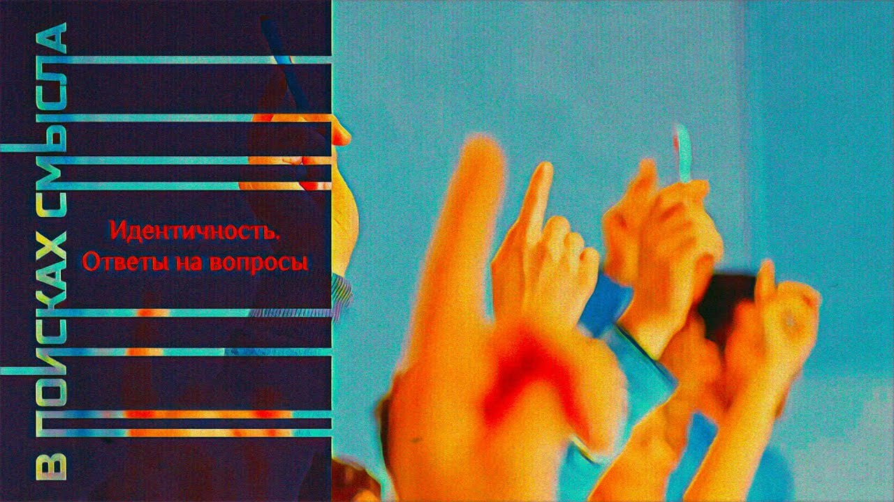

# Идентичность. Ответы на вопросы

26 ноября 2023 [Аудиоверсия](https://paradoks-pinkera-pilotnyy-vypusk.simplecast.com/episodes/identity-qa-part-i) 32:37

В этом выпуске мы отвечаем на вопросы слушателей.
Зовут ли традиционалисты своих последователей вернуться к сохе?
Прогресс, цивилизация модерна и поиск баланса между самоволием и самовластием.
Внутренняя честность, как фундамент личность идентичности.
Фундаментальная наука и трансцендентное.
Подвижные идентичности в глобальном взаимосвязанном мире.

**Е.Голуб:**
Здравствуйте, друзья!
В эфире наш очередной выпуск подкаста «В поисках смысла».
Я Евгений Голуб и со мной Павел Щелин.

**П.Щелин:**
Здравствуйте!

**Е.Голуб:**
Сегодня этот выпуск будет необычным.
Мы будем отвечать на вопросы, которые задавали наши слушатели в специальной теме в нашем Телеграм-канале.
Мы попросили задавать нам вопросы, и сегодня постараемся на них ответить.

Эти вопросы лично для меня будут поводом для того, чтобы постараться и самому себе ответить, а может быть, Павел поможет мне сформулировать эти ответы, на мои внутренние вопросы по поводу того, а куда же, собственно, мы зовём наших дорогих слушателей, сомысленников, однодумцев, есть такое украинское слово.
Ну и начнём, пожалуй, с того, что все вопросы, по сути, можно сгруппировать в три основных темы.

Первая, которую мы начнём, это «Не зовём ли мы с Павлом народ к сохе?» Вот очень повторяется.
Что ж, традиционалисты — это возврат к сохе?
Что это?
Известный христианский социализм, толстовство?
О чём идёт речь?

Возможно ли, как пишет нам один из слушателей, христианское сообщество, христианский уклад жизни и высокотехнологическая цивилизация?
Или же наша цель — деиндустриализация и переход к той же самой пресловутой сохе?

**П.Щелин:**
Сразу хочется сделать несколько комментариев.
Первый комментарий шуточный.

Читая вопросы слушателей, мне попался на глаза один хороший мем, посвященный вообще проблематике философии, заключающийся в том, что, ну, картинка на нем, вот эта знаменитая история с очень большой сильной собакой и с очень маленькой слабой собакой.
И вот под очень большой сильной собакой надпись то, что философы, когда они рассматривают существующие проблемы, а под маленькой слабой, философы, когда они предлагают практические решения.
Поэтому вот с такой большой долей самоиронии я буду относиться в том числе к ряду своих ответов на данный вопрос.

Если говорить серьезно, то вся проблематика, и, возможно, я не до конца точно формулировал это в наших выпусках подкаста, применительно к христианству, технологиям, к сохе, индустриализации и прочим, звучит для меня в расстановке приоритетов.
Другими словами, в практической реализации принципа из Евангелия от Матфея ищите прежде всего Царствие Божие, а остальное приложится.
Это не значит, что не нужно искать и другого.
Важно то, что это должно происходить, на мой взгляд, в определенной смысловой иерархии.

Другими словами, технологический прогресс ради технологического прогресса, вот это, мне кажется, является ошибочным вектором направления цивилизации модерна.
Другими словами, я лично, поскольку вопросы ко мне, могу сказать, я никогда, разумеется, не выступаю против прогресса технологий.
Я выступаю за то, чтобы этот прогресс был осознанным.
Чтобы мы осознанно выбирали, какие технологии имплементировать в общественный уклад, понимая в меру сил и способностей хотя бы ближайшие, а в идеале и долгоидущие последствия того или иного решения.
Для меня речь идет скорее об этом.
Правильная иерархия ценностей.

Не то, что мы были как будто безвольной щепкой в океане технологического развития, а чтобы мы формировали эти русла, чтобы строили где надо плотины, чтобы они не разрушали наши дома и так далее и тому подобное.
Вот такой метафорический ответ.

**Е.Голуб:**
Ты знаешь, неубедительно для меня звучит, потому что я понимаю содержание, я понимаю интенцию, направленность.
Но как ты будешь осознанно управлять развитием технологий?

Это уже джин выпущенный из бутылки, особенно в современном обществе, в капиталистическом, когда любая технология рассматривается как возможность снизить издержки, больше заработать или открыть новые рынки, создать новые потребности.
Когда весь уклад жизни основан, по сути, на культивировании, не хочется говорить такие слова, но, видимо, придётся.
Это на жадности, по сути, на стремлении к комфорту, на индивидуализме, на эгоизме в большей степени.
Да, много есть исследований, которые пытаются обосновать, что, ну вот посмотрите, как капитализм прекрасным образом, эксплуатируя, можно сказать, худшие черты человеческого естества, человеческой природы, приводит к повышению общего блага.

**П.Щелин:**
Ну, это знаменитая еще с 17 века Мандерлей притча пчелх.
Британский либерализм в его оригинальном значении.

Состоит идея в том, что из индивидуальных пороков буквально рождается общее благо.
Честно говоря, сходу-то и не помню конкретный сюжет, но помню вывод из неё, да, то, что именно на этой основе, собственно, либерализм получал свою привлекательность перед традиционализмом, потому что он раскрепощал человека, включая его творческое начало.

**Е.Голуб:**
Ну так вот, вот корень, да?

Смотри, с одной стороны, традиционализм или традиция, она неизбежно ограничивает человека, прежде всего, в проявлении его самовольной тяги.
Это всегда некоторые ограничения.

**П.Щелин:**
А традиция противоставляет ему самовластие, властвовать над самим собой.

**Е.Голуб:**
Да, и вот где та граница, где та мера, когда мы говорим, что ограничения эти не становятся давящими, не становятся настолько тираничными, что приводят к коллапсу личности.

**П.Щелин:**
А мне кажется, здесь ответ не может быть как раз универсальным, и он не может быть логическим.
Он ответ всегда практический и феминологический.
Другими словами, это проявляется в опыте жизни того или иного сообщества.
Как раз вот здесь, я думаю, то, что не бывает единого универсального ответа для всех цивилизаций, для всех культур, для всех сообществ.

Здесь как раз и проявляется творческое начало по балансировке этих двух сил.
Другими словами, у тебя ответ на этот вопрос будет зависеть от того контекста, тех привычек, языка, норм, культур, правил, истории того или иного сообщества.
Вот ответ на твой вопрос о балансе между самоволеем и самовластием.

**Е.Голуб:**
Сейчас то, что принято считать, будем говорить в терминологии СМИ, свободный мир, Запад, мир максимального возможного освобождения человека.
Кто-то говорит о разнузданности, кто-то говорит о свободе выбора, всего того, о чём мы говорили.
Я не знаю, давай с тобой вместе поразмышляем.
Нужно ли сказать, что то, что одновременно эта часть мира является и наиболее богатой, наиболее материальной, демонстрирует наилучшие, самые современные технологии в развитии?

**П.Щелин:**
Сейчас мы уйдём от философии и перейдём к практике.
Правда заключается в том, что уже не совсем.
И уже не везде это самая богатая часть мира, и уже не везде это самая технологичная, смотря на то, о какой технологии мы будем говорить.
По некоторым технологиям Китай впереди, по некоторым технологиям даже Россия впереди, если мы будем брать атомную энергетику, то передовая атомная энергетика находится в России, а не в Штатах, и не тем более в какой-либо другой стране.
По технологиям гиперзвука, все обладатели гиперзвука не являются странами Запада.
То есть не все так однозначно на полном серьезе.
Технологическое развитие, доминирование Запада как модерна уже перестало быть столь тотальным, как оно было в XIX веке, в начале XX века, даже в середине XX века.
То есть это уже не факт.

Если смотреть уровень жизни, то это тоже уже понятие относительное.
Тут уже скорее мы вошли в эпоху, когда неважно, в какой стране ты живешь, важно быть богатым.
Условно говоря, жизнь среднего класса на Западе и жизнь среднего класса в Индии может очень сильно отличаться между собой, а с другой стороны может не очень отличаться.
Происходит определенная унификация потребления, во многом чего западный вот этот образ государства всеобщего благоденствия, который у нас остался как картинка, это уже прошлое Запада.
Это не его настоящее.
Вот того государства всеобщего благоденствия, которое мы представляли себе там в 80-е, 90-е, сегодня его уже нет.

**Е.Голуб:**
Может быть, тогда стоит предположить, что связь между либеральной идеологией, либеральной идеей и материальным благополучием общества, может быть корреляция, а не прямая связь.
Это может быть сочетание разных факторов.

**П.Щелин:**
Скажем так, нет, я думаю, там есть элемент каузации, но просто до определенной точки и до определенного момента.
А после определенной точки, действительно начинаются гораздо более сложные многофакторные процессы.
Главное другое.
Вопрос, сколько еще это может длиться.

Мое-то мнение заключается в том, что этот исторический кризис, который начался и который мы обсуждаем, он именно только в своей зачаточной фазе.
Вот этот большой шок падения западного общества потребления мы только увидим в ближайшие 5-10 лет.
Скажем так, у меня есть очень большая тревога то, что будет откат к очень базовой настройке, которая будет очень несимпатичной и очень нелиберальной.
Есть даже основания так считать не только на основе моих наблюдений, но и на основе рассуждений таких авторов, которые очень популярны в элитной среде, а поэтому их идеи имеют значение.
В частности, Фрэнсис Фукуяма пишет о таком словосочетании как национал-либерализм для Западной Европы.

**Е.Голуб:**
Это что-то новенькое?

**П.Щелин:**
Ну, это не очень что-то новенькое на самом деле.
Не хочу вешать ярлыки, потому что особенно сейчас в такое время все очень нервные, и, услышав ярлык, не услышат мыслей.
Но, по сути, говорит о сильном национальном государстве, как бы с сочетанием лояльности к либеральным принципам.
Но на самом деле речь идет о либеральной диктатуре, конечно.

**Е.Голуб:**
Ну, то есть о диктатуре идеи либерализма.
То есть у тебя нет выбора не быть либералом.
В этом смысле диктатуре.

**П.Щелин:**
На уровне национального государства, да, что-то типа такого.

**Е.Голуб:**
То есть у нас тут либерализм, и с этим строго.

**П.Щелин:**
Типа того, да.

**Е.Голуб:**
И это не обсуждается.
И вы не свободны отказаться от нашего либерализма.
Так что ли?

**П.Щелин:**
Ну, свободны, но не очень сильно.
Очень в рамках дозволенного.

**Е.Голуб:**
Хорошо, давай вернёмся к сохе.
Мы как-то уходим от этого.
Давай я тебе ещё расскажу, какие мысли у меня были по этому поводу.

Смотри, вернёмся к предмодерну, вернёмся к эпохе, которая совершенно неопределённая, но всё-таки называется Ренессанс.
И ведь нельзя же отрицать того, что вот этот взрыв искусства, архитектуры, научных открытий, он сопровождался одновременно с тем самым освобождением, если так можно сказать, от ограничений дисциплинарного средневековья.
Вот этот переход от очень схематичной иконографии к всем этим изображениям.

**П.Щелин:**
Вот здесь очень сильно могу спорить, потому что как раз иконография — это вершина искусства, это символизм.

**Е.Голуб:**
Я с тобой не спорю.
И для меня символизм — это тоже искусство.
Но я хочу сказать, что как-то это связано, да?

**П.Щелин:**
Конечно, связано.
Ты поменял центр, то, что ты сказал, тебе интересно человеческое чувство и человеческое переживание.
И, соответственно, вот тебе и пошли другие формы.
Поэтому это как раз с философской, смены парадигмы происходит.

**Е.Голуб:**
Да, это более чем отказ от высшей формы искусства символической, да?
Но ведь как следствие, наверное, или как связанная вещь, опять-таки скажи мне, что это, мы видим просто фундамент всего того, что потом вылилось в модерн.

**П.Щелин:**
Да, ты абсолютно прав.
И здесь есть один нюанс, о котором мы забываем.
Возрождение — это термин, почему только применим для Западной Европы.

Ответ на самом деле лежит на поверхности, потому что Восток его не забывал.
Это на Западе тебе надо было сходить в крестовые походы, чтобы взять греческий текст, с его основы перечитать Аристотеля.
А условно в Византии эти тексты никто не забывал.
Вся патристика восточных отцов церкви, она в контексте всей вот этой философии Платона, Аристотеля и прочего.
И поэтому это западная проблема.

**Е.Голуб:**
Опять-таки это же всё схлопывается, да?
То есть как раз Византия схлопнулась окончательно в период...

**П.Щелин:**
Конечно, она к тому моменту схлопнулась, но нужно понимать, что на уровне идей возрождать на Востоке не нужно было.
Это не потому то, что они были варварами, а напротив, потому что для них это был пройденный этап.
А это вот Запад как бы подзабыл сам себя и потом стал с радостью переоткрывать, как будто в поисках нового откровения.
Это отдельное, я бы сказал, очень искаженное представление о хронологическом порядке, которое имеет прямое большое значение для вот этой вообще духа реформы и реформации, вот это ощущение переоткрытия и возможности переделки, которая появляется в западном контексте.

Возвращаясь все равно применительно к тому, к чему я призываю, вот если говорить прямо скажу, лучшего ответа ты от меня все равно не добьешься, просто потому что я не знаю.
Я призываю к осознанности.
Я призываю к осознанности в вашем использовании технологий.
И на индивидуальном, и на коллективном уровне.
И на уровне общества.
Ты правильно сказал, джина из бутылки ты не загонишь.

Но традиция всегда обращается к человеку как к субъекту, как способному принимать решения и нести за них ответственность.
Вот к этому я призываю.
Какие формы оно будет принимать, зависит от культурного контекста, условно говоря.
Являются ли иные формы хозяйственной деятельности разумными и возможными?
Да, являются.

Например, интуитивно мне близка такая штука, как артель.
Мне нравятся идеи артели, как они работают, и как они разные примеры.
Есть разные эксперименты, в том числе в кавычках крестьянского социализма, которые очень вовлечены в рынок.
Ну, условно, там коммунный мандрагон в Испании, может быть, слышал.
То есть очень древний такой, по сути, кооператив, который уже, по-моему, 70 лет существует и экономически успешен.

**Е.Голуб:**
Я понимаю, о чем ты говоришь.
Это все выглядит очень симпатично.
Пример общин Брудерхоф выглядит очень симпатично, и люди там такие светлые, и это всё замечательно, но они фактически встроены в существующий миропорядок и находятся в таком карманчике капиталистического мира.
То есть ты там нашёл себе какую-то заводь, устроил там прекрасное сообщество по строгим правилам, но всё равно продаёшь экологически чистые продукты и мебель детскую в тот мир, который это всё потребляет как часть своей капиталистической потребности.

**П.Щелин:**
Мне кажется, что вообще бороться против волн — это не самая умная задача, да?
Твоя задача — свидетельствовать о своих принципах и адаптироваться.
То есть не изменяя своим принципам.
Это вообще очень достойно, если мы говорим о таком частном индивидуальном уровне.

И тогда, когда эти, скажем так, циклы будут проходить естественный, скажем так, путь, ты не будешь в шоке, и ты будешь встречать эти перемены без страха.
Ну, условно говоря, представим, что наступает масштабный экономический кризис, но эти общины нормально адаптируются и выживут, потому что в них есть главное - чувство сплоченности, чувство взаимопомощи и так далее.
Они адаптируются.
Они адаптируются хоть к капитализму, хоть к социализму, хоть к еще чему-нибудь.
Поэтому речь идет об этом.

Вот, условно говоря, если вы ждете от нас призывов идти во власть с какой-то такой идеологической программой, нет, я вообще не считаю, что это адекватный, если честно, путь.
То есть я гораздо больше расцениваю, особенно для обычного нашего слушателя, я все-таки подозреваю, то, что гораздо более прагматичная задача — займитесь своим подъездом, познакомьтесь с соседями, найдите единомышленников и вместе что-то сделайте.
Через это обретается сила.
Да, и делайте это осознанно, так, чтобы вы при этом своим собственным принципам не изменяли.

И тогда у вас кризис, который мы ощущаем и который мы во многом описываем, включая идентичностный, он начнет разрешаться в здоровой образе.
У вас будет здоровая идентичность, подкрепленная реальностью, которую вы можете в том числе и пощупать.
И это очень важно.

**Е.Голуб:**
Звучит это всё крайне туманно, расплывчато и неубедительно.
Кризис сейчас таков, что нервы напряжены до предела, натянуты, как струны.
Очевидна несправедливость и порочность, и какая-то ущербность существующего порядка, да?

**П.Щелин:**
Жень, ну справедливости-то люди не хотят.
Прости меня здесь, если ты уж хочешь поднять до такой степени убедительности, то я прямо скажу, правильный вопрос не за что это, а зачем это?

А зачем это даётся, чтобы происходило самообучение.
Потому что по-хорошему люди учиться не хотят.
Ну история так действует.

**Е.Голуб:**
Да, но ты говоришь про осознанность.
Ты говоришь о том, чтобы делать свой выбор, понимая...

**П.Щелин:**
Принять ответственность за собственную жизнь.

**Е.Голуб:**
Ответственность за собственную жизнь.
Но ведь эта осознанность, эта ответственность может строиться на разных ценностных основах, на разном фундаменте.
Мы с тобой говорим и подразумеваем, что у людей есть хотя бы какой-то остаток христианских ценностей и мировоззрения.
А ведь это уже совсем не так очень часто.

**П.Щелин:**
Ты прав, это совсем не так.
Возможно, что вообще в каких-то других местах, скажем так, это место будут занимать другие более сильные асабии, но у меня нет по этому поводу какой-то тревоги, потому что...
Ну, это, наверное, знаешь, моя профдеформация историческая.
В истории было много всего очень разного.
Это не самый важный для человека вопрос, благо нам не дано знать времена и сроков таких основных вот событий.
Слишком много на эту тему заморачиваться, на мой взгляд, это отвлечение ваших творческих сил на негодный объект.

Давай тогда сформулирую еще жестче, что для меня является важным во всем этом процессе на человеческом уровне.
Внутренняя честность.
Очень важный момент.
Чтобы ты понимал свои собственные желания, чего ты хочешь на самом деле и для себя, и для тех людей, которые вокруг тебя.

Потому что вот, прости, простой пример.
Ты упомянул слово «справедливость».
Но поверь мне, люди в целом справедливости совершенно не хотят.
Потому что справедливость — это воздание должного должному.
Ну, то есть очень мало людей на самом деле хотело бы, чтобы им воздавали должное за их поступки.

Потому что справедливость принципиально отрицает в том числе и равенство.
Справедливость принципиально построена на идее неравенства, потому что в разной степени долженствования справедливость принципиальна и иерархична.
Поэтому, знаешь, хороший совет – разберитесь в своих желаниях.
Поэтому я возвращаюсь к теме осознанности.

Да, это может звучать очень, знаешь, не вдохновляющим на первом этапе, но, на мой взгляд, это самый сущностный ответ для человека.
На самом деле, именно в ближайший год, условно говоря, когда это еще мы находимся на стадии, когда волна цунами только поднимается.
В идеале, когда она по нам ударит, хорошо бы, чтобы эта осознанность уже была хотя бы в какой-то небольшой зачаточной форме у человека.

Ну и возвращаясь к конкретному вопросу, христианство и высокотехнологическое общество, это, конечно, возможно.
Более того, если уж по-честному, то мне кажется, что как раз, если нас не ждет возврат в полноценный каменный век, а технологическое развитие будет происходить со все большей степенью технологий, развитой технологии материалов, оптимизация, возможности сетевого образа жизни, то есть как раз, когда большие города станут не самым эффективным с точки зрения экономики, с точки зрения технологической организации пространства, а допустим, им станут города на 100-300 тысяч.
Это зависит, допустим, от ядерного реактора, маленького, удобного.
Это зависит от распределенных систем энергетики.
В общем, есть ряд оснований считать, что в будущем как раз мегаполисы станут не нужны.
Возможно, такой вариант.
Но так тем более.

Именно тогда ключевое, скажем так, значение приобретут только те навыки, к которым только человек и способен.
То есть настоящие творческие навыки.
Здесь мы возвращаемся к тому, что, на мой взгляд, вот это творческое начало из самоволия, оно себя исчерпало.
Ну это я вижу в музыке, в культуре, в искусстве, в живописи.
Вот ты можешь сказать, что, прости меня, что началось с Ренессанса, закончилось сортиром в художественной галерее.
Это конкретный пример из галерей современного искусства.
В буквальном смысле стоит там сортир, простите, или банан, приклеенный к стенке.
Ну, это, простите, искусственному интеллекту вообще не проблема среплицировать.

А вот настоящий творческий порыв, настоящее стихотворение, настоящее такое творческое начало, оно, на мой взгляд, будет возможно только на ценностном основании, когда вы в этом будете видеть некое священное призвание, подобно тому, как писали поэты, Пушкин, ну, как у Пушкина там про священные жертвы, когда вы призваны, условно говоря.
Так что здесь как раз я вижу большой оптимизм, и напротив.

Более того, я это отвечал частично на вопрос в чате.
Меня спрашивали, что будет с фундаментальной наукой.
На мой взгляд, только в контексте установки на трансцендентное, на Творца, на Создателя мира, и вообще появляется интерес к фундаментальным исследованиям.
Потому что в противном случае нас интересуют только прикладные вопросы, нас интересует только, как это пересобрать, чтобы получить прибыль.
То есть нас интересует инжиниринг, нас не интересует фундаментальная физика.
Фундаментальная физика может интересовать человека, только если он видит в этом, ну, простите, служение, определенное служение священного порядка.

**Е.Голуб:**
Я с тобой полностью согласен.
То есть грант выиграть — это не мотив.
Получить деньги на то, чтобы продлить свою лабораторию, — это не мотив.
А сегодня, к сожалению, это основные двигатели прогресса научного, который, как мы знаем, все, кто не заангажирован, которые смотрят на вещи трезво и знакомы с материалом, знают, что последние, особенно десятилетия, очень во многом наука ушла от таких, скажем так, исследований фундаментальных, а по сути либо полирует то, что было доступно до этого, либо пытается поддержать повесточку, либо следует в русле потребления какого-то...

**П.Щелин:**
Ну инжинирингом.
Она в широком смысле занимается инженерией.
Пресловутая наука о материалах — это не фундаментальное исследование, но это очень важно.
Там действительно производится огромное количество прикладных открытий, но это не фундаментальная наука.
По большому счёту, на мой взгляд, реальная фундаментальная наука на уровне Бора, Резерфорда, Эйнштейна и прочего возможна только при осознании священности этого занятия.

**Е.Голуб:**
Да, но никто не говорит о том, что нет людей, которые не занимаются этим как служением, но это просто сейчас не мейнстрим, не основное направление.

**П.Щелин:**
Ну да, и деньги на это не выделяются, прямо можно сказать, да.
А это очень дорого.
Ну, с точки зрения капитализма, это очень дорого, потому что это огромные инвестиции с вообще непредсказуемой отдачей.
То есть это нерациональные инвестиции на самом деле.

**Е.Голуб:**
Хорошо, тогда давай завершим тему сохи.
То есть ни о какой сохе, упрощении, деиндустриализации речь не идёт.
Речь идёт об ответственном отношении к технологии и, наверное, в какой-то мере о понимании тупика служения технологии потребления.

**П.Щелин:**
Разумеется, именно об этом и идет речь.
Что технология не должна становиться вашим идолом.
Только об этом идет речь.

А уж тем более технология, исключительно понимаемая как потребление, не должна становиться вашим идолом.
Вы должны понимать, что опять же, есть пространство технологии, проблемы, которые она решить может, а есть проблемы, которые она решить не может.
Условно, технология не сделает вас счастливыми.
Технология не принесет человеку счастье.
Она не принесет ему смысл жизни.
Вот ничего этого она сделать не сможет.
Речь идет именно об этом.

**Е.Голуб:**
Да, вот это очень важный комментарий, что технология не сможет сделать человека счастливым в принципе никогда.
Это невозможно.
Счастье не в этом.
Не лежит в этом поле.

Я недавно разговаривал с одним разумным человеком, и он мне откровенно признался, что он идейный противник наш с тобой в том смысле, что он всё-таки считает, что выход именно в трансгуманизме, именно в слиянии с искусственным интеллектом, преобразовании и так далее.
Ну и, конечно же, большой вопрос, а кто будет это существо?
Или что это будет такое?
Это же явно уже будет не человек.
Но вот здесь мы перестали разговаривать на эту тему.

Хорошо, всё, договорились про этот вопрос, поставили точку, двигаемся к следующей группе вопросов, связанных с идентичностью, достаточно простые.
Почему-то некоторые из наших слушателей поняли идентичность как рассмотрение того, кто на кого похож.
То есть идентичность как похожесть, как сравнение.
Какой ты можешь оставить здесь комментарий?

**П.Щелин:**
Я удивлён.
Это скорее камень в наш огород, что-то мы не точно формулировали, потому что, конечно, речь идёт не о простой похожести, где речь идёт о мировоззрении.

**Е.Голуб:**
Об осознании себя кем-то.
То есть как ты себя называешь?
Не на кого ты похож, а кто ты есть.
Скажи, кто ты есть, и это будет твоя идентичность.
Или, по крайней мере, опиши, с чем ты сродни.

**П.Щелин:**
Дальше мы пытались описать, откуда вот это «скажи, кто ты есть» возникает.
Произною, это мы делать пытались.
Но это причинно-следственный порядок, конечно, другой.

**Е.Голуб:**
Хорошо.
Ещё был вопрос относительно идентичности в современной реальности, когда люди способны и могут перемещаться между пространствами разными и фактически между разными временами, попадать в разные культуры, географии.

**П.Щелин:**
Да, ты абсолютно прав.
Здесь это не в первый раз происходит.
Я повторюсь, я читал речь Рестида из первого века нашей эры.
Это речь оратора, который восхваляет Римскую империю.
И, по сути, он описывает современную глобализацию просто на языке Римской империи.
Схожий момент.

Есть, видимо, общее правило, что при достижении определенного уровня взаимосвязанности все идентичности начинают становиться гораздо более подвижными.
Начинается инфлуктуация, простите за умное слово, между ними.
И при этом же внутри нарастает огромное противоречие людей, которые не могут эту сложность удерживать.
Это как раз и есть то, что я называю перегрузкой сложностью.

Помимо нашего времени, такое же было накануне Первой мировой войны.
Началось огромное движение капиталов, пароходов, взаимосвязей, коммуникаций, телефоны, телеграфы и прочее.
И на самом деле это привело к глубочайшему кризису, одним из ответов на которых-то и стала Первая мировая война.
Потому что, вот это все забывают, но Первая мировая война была встречена с радостью абсолютно в каждой европейской стране.

Это не какие-то русские варвары или немецкие варвары, это абсолютно все встретили с радостью.
От простых лавочников до самых выдающихся людей своего времени.
Томаса Мана, Бернарда Шоу, то есть там прям вот такого уровня люди, химики, физики, писали восторженные письма в поддержку войны.
Потому что люди почувствовали определенность.
Они почувствовали, кто мы.

Я же тебе говорил, что война — это место проявления вот этого коллективного начала.
Именно на войне ты вынужденно ставишь перед собой вопрос, а чей я?
Кто я, за что я готов сражаться, за что я готов умирать.
Это просто подтверждает тезис, опять-таки, о важности осознанности мировоззрения, потому что взаимосвязанность все равно будет значительно больше у нас, чем она была ранее.
Ее полностью избежать не удастся.
Чем осознаннее человек к ней подходит, тем более он будет устойчив.

А неустойчивость, она приводит вот к этому внутреннему психологическому расколу, внутреннему психологическому напряжению.
Есть взаимосвязь между тем, что мир становится все более и более взаимосвязанным, и огромным ростом внутреннего напряжения в человеке, потому что он в этой сложности полностью потерянный был.

Это лучше всего, ты знаешь, кем было выражено, мне кажется.
Помнишь такое стихотворение «Небоскребы, небоскребы, а я маленький такой»?
Это вот про вот это чувство.

**Е.Голуб:**
То есть это потерянность человека в большом мире и приводит к тому, что вопрос идентичности становится на первое место.

**П.Щелин:**
Ну да.

**Е.Голуб:**
Можно ли так сказать?

**П.Щелин:**
Можно, можно, можно.
Это такая вот самоподдерживающаяся система и самосбывающееся пророчество, если тебе угодно.

Одно из решений проблем, конечно, является идентичности более малого порядка.
Это субкультурные идентичности.
То есть люди начинают вот эту, скажем так, пустоту заполнять субкультурой.
Отсюда там вот сленг, отсюда определенные...
Ну, стандартные вещи.
Сленг, форма одежды, форма культурного потребления.

Но опять это работает в относительно устойчивые времена.
То есть это когда пресловутый у нас мир доковидный.
Вот в доковидном мире это работало.

А вот после ковида, когда вот эта взаимосвязанность начала, по сути, разрушаться, мы стали все входить в период кризиса большого.
Условно говоря, субкультуры достаточно, чтобы заглушить вот эту тоску в сиюминутном моменте, но ее недостаточно, чтобы, условно говоря, вытащить вас, когда вокруг вас начнет рушиться мир.
Вот я примерно так это сформулирую.

**Е.Голуб:**
Ну, как всякий эрзац, он даёт ощущение, но по сути не даёт вам содержания, которое вы там предполагаете или хотите найти.

**П.Щелин:**
Ну и опять возвращаемся к этому фундаментальному тезису «Выбери снова» — к проблеме осознанности.
Ключевая проблема в том, что именно во времена вот такого смешения возрастает роль осознанности.
Самой такой базовой, простой модели идентичности ты усваиваешь, условно, с молоком матери.

Вот тебя батя воспитал, там мама молоком вскормила, в деревне ты своей побегал, хоп, идентичность сформировалась, и вот у тебя ментальная устойчивость.
Чем больше сложность, тем больше тебе требуется осознанности по принятию и интеграции этой самой идентичности не на поверхностном уровне каких-то лозунгов, а на глубоком ее понимании, начиная даже от религии, заканчивая языком и так далее и тому подобное.

**Е.Голуб:**
Наверное, тут смогут нам поставить в упрек, что не слишком ли вы многого требуете от человека, не слишком ли большой...

**П.Щелин:**
Это не я, это мир.
Мы просто описываем, как есть.
Вам может не нравиться то, что если вы наступите на грабли, вам они прилетят по лбу, но вот они все равно прилетят.
Мы просто описываем, как оно есть.

**Е.Голуб:**
Ладно, хорошо.
Будем считать, что с вопросом о флюидной идентичности мы тоже разобрались.
Ну и осталось еще две темы, которые я хотел бы успеть в этом выпуске затронуть.

Просят, чтобы ты постарался сравнить или сопоставить либерализм, либеральную идеологию и традиционные такие религии, как ислам и индуизм?

**П.Щелин:**
Короткий ответ, потому что я не являюсь принципиально специалистом ни по исламу, ни по индуизму, но тут просто есть ответ, что либерализм противоречит любой традиционной религии.
Вот простой ответ.

**Е.Голуб:**
Ну, потому что он противоречит любому ограничению, любой определённости, любым рамкам.
Поэтому либерализм и религия — это несовместимые вещи, антагонисты.

**П.Щелин:**
Но он принципиально арелигиозен.
Арелигиозен — это в лучшем варианте, то есть безразличен к этому вопросу.
С точки зрения политинститутов он принципиально антирелигиозен, то есть его принципиально не устраивает это, потому что это прямой конкурент.

**Е.Голуб:**
Ну и, конечно же, это прослеживается через масс-культуру.
Я всё время удивлялся, как с какого-то времени в фильмах, в сериалах, во всём этом деле нет-нет, нужно-не нужно, а обязательно пнут традиционную религию.
Так или иначе, все священники какие-то педофилы, лицемеры, сёстры-монахи они угнетаемые.
Постоянно создание образа верующих людей, живущих в традиции, как мракобесов, причём с оттенком извращения.
И я думаю, зачем это нужно?
Почему?
По сюжету часто это не требуется.

Но красной нитью проходит, что если ты встречаешь упоминания монашества, священства, то жди, что там что-то будет пакостное, мерзкое, такое отвратительное, рядышком примазанное.
Видимо, это вот ответ либерализма.

**П.Щелин:**
И здесь он как бы действительно нейтрален.
Условно говоря, для либерализма искренне верующий хоть в Магомета, хоть в Иисуса, хоть в Будду, одинаково угрозу представляет.

**Е.Голуб:**
Ну да, поэтому ислам — это, конечно же, фанатики и джихад, и всё остальное.
Христиане — это извращенцы и педофилы.
Ну, про православных говорить нечего.
Тут тоже всё уже наклеено всё ярлыками.
Про индуизм, правда, я ещё немного...

**П.Щелин:**
Да, но, видимо, просто не дошли.
Не так их там много, чтобы на него реагировать.

**Е.Голуб:**
Нет, их там много, достаточно много, миллионы, но просто не настолько они видимы, что ли.
Они очень географически так сгруппированы.

Хорошо.
Итак, с вопросом о либерализме, исламе и индуизме мы покончили очень просто.
Павел не специалист в этом вопросе, я тем более не специалист.
Поэтому остаётся ещё один вопрос, и это, по сути, завершение этого выпуска.
Вопрос звучит так.

Ладно, ребята, вы там закопались в тему идентичности, и там можно долго находиться.
Будет ли ещё какой-то разговор, будет ли ещё какая-то тема, которой вы посвятите своё время?

**П.Щелин:**
Простой ответ, разумеется, будет.
Мы не собираемся заканчивать выпуски наших подкастов на, скажем так, этой теме.
Но, признаюсь честно, на данный момент конкретного ответа у меня нет.
Есть другой вопрос от слушателей, и мне кажется, что нам с тобой об этом стоит задуматься.

Может быть, сделать отдельный сезон, в котором мы с тобой с философской точки зрения рассмотрим некоторые культурные артефакты нашей эпохи.
Посмотрим, как вот эти проблематики...
Мы же подняли достаточно большое количество таких больших тем в первых двух сезонах.
Можно посмотреть, как это отражается в культуре, скажем так, в сериалах, в фильмах и так далее и тому подобное.
Это вот такая из мыслей, которые я потенциально думаю на третий сезон, признаюсь.

**Е.Голуб:**
Хорошо.
Тогда предложим нашим слушателям, те, кто уже находится с нами в Телеграм-канале, видимо, проголосовать, насколько эта тема, такой подход будет интересен.
Предложить, может быть, свои какие-то вопросы неотвеченные или темы, которые хотелось бы, с их точки зрения, исследовать.
Посмотрим.
Может быть, и в эту сторону тоже, в предложенную нам тему окунёмся.

Ну а пока спасибо всем, кто был с нами всё это время.
Спасибо вам за ваши вопросы.
Спасибо за неравнодушие.
И до новых встреч.

**П.Щелин:**
До новых встреч, уважаемые слушатели.
Спасибо вам.

**Е.Голуб:**
Всего доброго.
