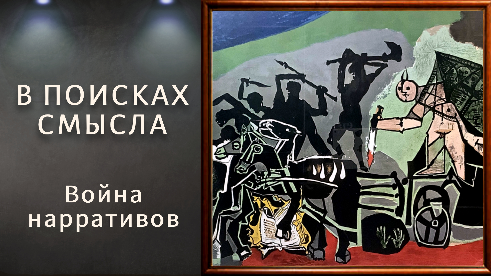

# Война нарративов

23 мая 2025 [Аудиоверсия](https://paradoks-pinkera-pilotnyy-vypusk.simplecast.com/episodes/narrative-wars) 36:38

Как распад единого «мифа Победы» превращает 9 мая из общего, объединяющего праздника в точку цивилизационного раскола.
Авторы рассуждают о различиях между историей и мифом, причинах утраты общего нарратива и возможных последствиях — от глобального кризиса доверия до новых «религиозных» войн.

**Е.Голуб:**
Здравствуйте, дорогие друзья!
Мы записываем с Павлом Щелином очередной выпуск подкаста «В поисках смысла».
Как всегда, у микрофона я, Евгений Голуб.
Ну и, конечно же…

**П.Щелин:**
И я, Павел Щелин.

**Е.Голуб:**
Сегодня запись этого выпуска произошла немного спонтанно и, по предложению Павла, на тему, о которой мне сложно говорить, наверное, сложнее, чем Павлу, потому что нас разделяет довольно большая разница в возрасте.
И я принадлежу к тому поколению, которое достаточно долго общалось, я лично общался с теми, кто прошёл войну, с теми, кто видел в глаза смерть, и с теми, кто мог о ней рассказать.
Поэтому для меня эта тема довольно чувствительная.
Я предпочитаю не высказываться на эту тему, именно потому что в последние лет 10, а может быть, 15, по нарастающей, отношение к празднику 9 мая, отношение к тому, что я и моё поколение называют «Днём Победы», поколение последующее, и тем более сейчас, называют как попало и относятся иногда довольно резко.

Итак, Павел предложил поговорить о уже прошедшем празднике.
Даю слово Павлу.

**П.Щелин:**
Спасибо, Евгений.
Я действительно хотел поговорить не сколько даже о конкретном празднике, сколько как раз о том феномене, который ты обозначил в своём вступлении.
О том, что ранее, можно сказать, при всех формальных нюансах, то есть детали отличались, какие-то настроения отличались, но по сути оставалось достаточно консенсусной точкой восприятия.
Я усилю, не только в постсоветских странах, но и в том числе в странах западных, таких, допустим, как Германия, Франция даже, в той мере, в которой это было, это было довольно консенсусное представление о случившемся событии и последовательно на протяжении, на самом деле, 30 лет, но в особенности в последние 15, стало некоторым, можно сказать, яблоком раздора.

И здесь именно этот переход, именно этот феномен, мне, как философу, и интересен.
То, что единая история, если угодно, единый рассказ, единый миф перестал быть таковым.
Самое важное для меня, он уже перестал им быть.
Не то, что это в каком-то процессе, не то, что это можно склеить снова, а это уже, на мой взгляд, разъединено, разошлось достаточно безвозвратно, и достаточно неотвратимо.
В точках перехода об основных новых, если угодно, группах новых рассказов и мифов, которые выросли уже на руине этого большого старого рассказа и мифа, мне и хотелось поговорить сегодня, а главное, о тех очень неприятных последствиях, на самом деле, которые это имеет для всех нас.
Довольно такая амбициозная тема.

**Е.Голуб:**
Да, но давай только для наших слушателей ещё раз обозначим границы понятий и вообще там содержание понятий, потому что, мне кажется, что иногда мы сами немного размываем границы того понятия, которое мы берёмся обсуждать.
Поэтому в этот раз я хотел бы с самого начала определить это понятие.
Когда мы говорим «миф», мы имеем в виду не что-то, что не имело места в реальности, а некоторую интерпретацию событий.

**П.Щелин:**
То есть можно сказать - оптику.

**Е.Голуб:**
Можно сказать, нарратив — это, видимо, что-то меньшее по масштабу, а миф — это что-то большее по масштабу.

**П.Щелин:**
Для меня тут ещё есть авторское понимание.
Для меня миф используется как некое, в целом, понятие позитивное, а нарратив — как понятие негативное.

Условно говоря, нарратив для меня — это миф с намеренным искажением.
Вот если в мифе искажение необходимое, то есть в чём базовый принцип мифа?
Любое событие бесконечно по своему фактажу.
Попытка фактически точно описать практически любое событие, сколько-либо значимое, она заранее обречена.

**Е.Голуб:**
То, что 8-го или какого-то там мая Германия подписала капитуляцию — это факт?

**П.Щелин:**
Нет, другого факта нет.

**Е.Голуб:**
Красная армия в то время захватила Берлин — это тоже факт.

**П.Щелин:**
Но празднуют не это, в строгом смысле.

**Е.Голуб:**
То есть, когда ты говоришь о том, что факты...
Как ты выразился, что их бесконечное количество?

**П.Щелин:**
Невозможно фактически исчерпывающее описание событий.
Ну, условно говоря, даже в акте подписания капитуляции 8-го мая можно представить себе бесконечные (практически) точки зрения на события, которые происходили в этот день на всём там протяжении фронтов, внутри разных стран и так далее и тому подобное.

**Е.Голуб:**
Да, но давай я тогда попробую ещё раз осмыслить то, что ты говоришь.
Событие произошло фактически, оно действительно имело место.
Но интерпретация и взгляд на это событие с попыткой другими фактами обосновать эту же точку зрения, вот этих интерпретаций может быть довольно много, если не бесконечное количество.
Так можно выразиться, чтобы понять?

**П.Щелин:**
Можно.
Более того, что тогда в этом контексте миф?
Давайте объясню.

Миф — это есть та оптика, через которую ты, условно говоря, выделяешь события, как более важное и менее важное, и придаёшь ему значение.
То есть это то, благодаря чему какое-то событие выносится на первый план, какое-то на второй план, выделяется, отвергается, интерпретируется.
Вот это та самая оптика, через которую, ну, в английском это называется make sense.
Ты делаешь океан фактов, выстраиваешь его в некую картинку, такую структуру, иерархию.
Вот что такое миф.

**Е.Голуб:**
Да, вот я тогда для наших слушателей приведу пример.

Недавно я пересматривал грандиозный фильм, многосерийный, «Огнём и мечом», который снимали поляки.
И там очень интересно видеть другую оптику.
Оптику польскую на события 17 века.
Эта оптика очень неблагожелательна к украинцам и казакам, и к русским.
И зная эти события из другой оптики, это бросается в глаза.
Хотя, наверное, когда поляк смотрит этот фильм, у него вообще не возникает никакого диссонанса.

Мы говорим о том, что миф — это некоторый набор акцентов по отношению к какому-либо историческому событию, например.
Некоторая интерпретация через, как ты выразился, особый набор приоритетов в важности того или иного события, например.
Можно так сказать?
Или ещё что-то нужно добавить?

**П.Щелин:**
Близко к этому.
Просто подчеркну то, что ты немножко сгладил значение это.
А я как раз хотел бы подчеркнуть радикальность.
Потому что только через миф...

Вот пример, условно говоря, фильма «Огнём и мечом», который ты упомянул, тоже можно сказать пример мифа.
Он же не описывает исчерпывающим образом всю полноту событий, которая происходила в 17 веке в том регионе.
Невозможно это просто сделать.
Но он даёт ключ, оптику, через которую вот этот хаос событий превращается в цельный рассказ, уже оперируя которым человек имеет определённые прикладные последствия мировоззренческого толка.

**Е.Голуб:**
Отлично.
Я думаю, что можно двигаться дальше.

**П.Щелин:**
Замечательно.
Договорились о понятиях.

Тут важный аргумент, что именно неизбежность мифа.
Мы не можем говорить о любом сколь-либо большом событии в отрыве от рассказа.
Пока мы не встроили событие в рассказ, оно в строгом смысле, ну вот факт и факт.
Как ты правильно сказал, ну какие-то люди оставили подписи на бумаге, ну и что?
Вот условно примерно такой будет ответ.
Пока событие не встроено в рассказ, пока событие не встроено в миф, оно не то чтобы не имеет значения в каком-то онтологическом смысле, но оно не отзывается, не регистрируется в субъекте.

**Е.Голуб:**
Мировоззрение, да?
Это событие не взаимодействует с личностью.
Личность несёт мировоззрение, и это событие встречается только в истории некоторой.
Вне истории оно не встречается, если так можно выразиться, с личностью, нет отношения.

**П.Щелин:**
Абсолютно.
И тогда, собственно, одна из как раз градаций, фундаментально, главные линии разделения в мире, на самом деле, они не геоэкономические, не геополитические, не границы юридические государств, а это как раз те самые мифы, истории, относительно фундаментальных событий, в которых эти сообщности живут.

**Е.Голуб:**
Это кажется совершенно понятным.
Я прожил в Украине довольно долгий срок.
Я был свидетелем того, как шла перепрошивка вот этого мифа.
Один миф растворялся и уходил, иногда сопротивляясь, иногда нет.
А другой сразу же создавался.

Он создавался на материале тех же самых событий, на каких существовал предыдущий в твоей терминологии миф, что выглядело парадоксально.
Вроде как события одни и те же, а оптика, мягко говоря, разная.

**П.Щелин:**
Хороший пример.
Мы сейчас о них уйдём в подробность небольшую.
Но сначала я хочу заметить очень такой для меня философский, неочевидный, может быть, для многих комментарий, что именно общий рассказ, общая история, если угодно, история не как набор фактов, вот эта история, like story, общий миф предшествует и, можно сказать, даже подлежит системе отношений политической, экономической, геоэкономической, которая возникает на фундаменте, базе этого мифа.

И вот здесь миф о победе, в широком смысле этого слова, вот миф Дня Победы, в целом майский миф, он ни много ни мало, именно его история лежала в основе всего того международного порядка, который существовал последние 80 лет.
Я попробую сейчас доказать этот тезис, если не против.

**Е.Голуб:**
Ну, я, конечно же, сразу готов с тобой не согласиться, потому что мы знаем, что в Америке был свой миф победы над Германией.
Он довольно существенно отличался от мифа советского.
Разве не так?

**П.Щелин:**
Вот прямо не так.

То есть ты абсолютно прав, он, конечно, отличался, особенно на более низких уровнях.
Тут, надо понимать, мифы устроены иерархично.
Есть иерархия мифа, и меня в данном контексте интересует консенсус хотя бы на самом высоком уровне.
И на самом высоком уровне консенсус был, и это очень простая формулировка этого консенсуса.
Великий сюжет был очень простой.

> Общая победа над абсолютным злом.

**Е.Голуб:**
Да.

**П.Щелин:**
Вот, собственно, весь миф заключается в этой фразе.
И в этой фразе был консенсус.

Дальше начинался спор, кто кому Рабинович, кто кому меньше, кто кому больше.
Кто был важнее, кто был менее важен, кто как поспособствовал этому великому злу.
Но это всё можно было заносить под ковёр.
Потому что на вот этом самом высоком уровне восприятия консенсус был.

**Е.Голуб:**
Согласен.

**П.Щелин:**
Это и есть ялтинско-патсдамский консенсус.

**Е.Голуб:**
Да, но я недавно прочитал интересное мнение, что для Советского Союза Ялта носит позитивную такую коннотацию, встреча трёх лидеров в Ялте.
Тогда как для всех остальных эта коннотация негативная.
Вот, значит, сдали Советскому Союзу часть Европы.

**П.Щелин:**
Это уже позднее.
Это уже было начало расхождения мифа.
Но он удерживался, не позволяя влезать вот в эту верховную рамку контекста.
Потому что были основополагающие три, на самом деле, точки, а не ялтинско-потсдамские.
Это Холокост, токийский и нюрнбергский процессы.
Два трибунала и Холокост.
И это создавало вот эту ту самую общую рамку.

На самом деле звучала она, в том числе, имела такой элемент, как теневой моральный кредит.
Мы, как победители, не задаём друг другу по-настоящему неудобных вопросов, потому что мы вместе победили ад.

**Е.Голуб:**
Да.

**П.Щелин:**
Вот примерно.
Или победили дьявола.
Я говорю сейчас, как работает эта мифологическая конструкция.

**Е.Голуб:**
Я понимаю.
И тогда бомбардировка Дрездена, она остаётся за скобками.
И сброшенные на Прагу бомбы тоже остаются за скобками.
И американские лётчики, которых пичкали наркотиками, тоже за скобками.
Ну и всякое остальное разное, что со всех сторон бывало.

**П.Щелин:**
То есть мы не задаём друг другу вопросы по-настоящему, о Риббентропе-Молотове, но и с вас за Мюнхен мы так уж сильно не спрашиваем.
Мы в междусобойчиках внутри можем как-то ещё об этом поспорить, пожаловаться, но на высоком уровне вот это есть общая кода.
Почему она необходима?

Да потому что на этом самом мифе висит на самом деле весь миф о глобализации.
Весь миф глобализации, весь миф конвергенции, весь миф "миру-мир".
Всё висит, весь лозунг "мы будем просто торговать".
Он весь на самом деле возможен только внутри вот этой мифологической базы, только внутри вот этой мифологической конструкции.
Потому что у нас есть позитивный опыт, что, несмотря на все наши различия, вы вообще коммунисты, а вы вообще проклятые капиталисты, буржуи и демократы, но в этом каком-то абсолютно предельном вопросе мы ради блага всего человечества смогли преодолеть наши разногласия и победить вселенское зло.
Ни много, ни мало.
Этот миф подлежит всему вот этому консенсусу, на котором мы живем.

**Е.Голуб:**
Подожди, но торговали державы и до этого без опыта победы над злом?

**П.Щелин:**
На таком уровне глобализации нет.
Это была гораздо более блоковая торговля, дорогой мой друг.
Все-таки глобализации в современном понимании и какой-нибудь конвергенции не было.
Это именно очень новая история.
Мир на этом стоит.
Мы все люди, в конце концов.
По-простому даже на это, это утверждение тоже стоит на мифе о великой победе над абсолютным злом.
В широком смысле.

**Е.Голуб:**
Хорошо.
И что же произошло дальше?

**П.Щелин:**
А проблема в том, что этого мифа, больше его нет уже.
И весь тот мир, который на нем был построен, сейчас находится в кризисе.
Этот кризис можно рассматривать как раз как следствие разрушения этого самого общего мифа.

Сейчас можно выделить, на самом деле, как минимум 4-5 мифов, которые возникли вокруг этого события и которые прямо противоречат друг другу.
И между которыми консенсуса и сотрудничества быть не может.
По метафоре можно сказать, что на обломках общего мифа новые субъекты пытаются создать свои литургии, свои каноны, свои веры.
И поэтому конфликт вокруг интерпретации событий 80-летней давности перешел из проблемы личной памяти и строго в смысле исторической переживания, уже перешел в конфликт религиозный и чисто мифологический.
Никого в строгом смысле реальные исторические события уже не интересуют.

**Е.Голуб:**
Да, по сути ты куда присягаешь?
Ты несешь цветы 9 мая или нет?
Если ты несешь, то ты исполняешь приношение ложным богам, с одной точки зрения.
А если ты не несешь и отворачиваешься, значит ты там предатель и чуть ли не сразу скрытый неонацист.

**П.Щелин:**
В одном из контекстов да, это работает так.
Но абсолютно это религиозное разделение.
Ты какому богу служишь и относительно этого бога ты либо верующий, либо ты еретик.
А это уже мифологическое, если угодно, полит-теологическое вопрошание.

**Е.Голуб:**
Ну да, то есть любые разговоры о том, что друзья, ну у меня там дед воевал и мы много времени вместе проводили.
Я чту его память, как участника трагических событий и как участника той силы, которая все-таки победила в этой войне.
Поэтому оставьте свои вопли для других дат.
Но это не работает.
Ты просто либо свой, либо чужой.

**П.Щелин:**
Это все, это уже не будет работать нигде.
Да, это уже перешло в эту зону.
Это уже стало чистой зоной политического разделения.
И мы это во многом не заметили.
Тут есть очень интересная такая историческая...
Можно провести реконструкцию, как разрушался этот миф.
Он прошел несколько важных этапов разрушения.
Там было несколько реперных точек, на которых он ломался.

Но сейчас важно просто заметить, что его уже нет.
Как единого мифа общей победы над абсолютным злом - его нет.
Некоторые, в том числе политические, силы пытаются за него зацепляться и удержаться.
Как раз, может быть, интуитивно понимая, что полный от него отказ гарантированно спускает нас в новый виток 30-летней, по сути, войны религиозной по этому вопросу.
Но, к сожалению, его уже не удержать.
Он уже ушел.

**Е.Голуб:**
Когда сломалось общее согласие относительно вот этого самого верхнего уровня, о котором ты сказал, когда этот миф дискредитирован, то есть можно не верить, можно верить по-другому, то обратно это не склеить.
Это, в общем, имеет, наверное, какую-то аналогию с тем, когда произошло движение протестантов, я думаю, что именно вследствие такого раскола и вот то, о чем мы часто говорим с тобой, событий 30-летней войны 17 века.
То есть атеизм — это следствие вот этого.
Если можно и так, и так, то можно и никак.
И ничего страшного не происходит.

Когда консенсус относительно единого взгляда на веру в Западной, скажем так, Европе, он сломался.
Так видимо, сейчас похожая вещь, нет?

**П.Щелин:**
Подобная вещь.
Подобно тому, как протестантизм взорвал "пакс христиана", западный "пакс христиана".
Так-то "пакс христиана" рухнул в 1054 году, по инерции двигался.
Но вот окончательно в протестантизме он взрывается, и мы по инерции можем говорить о какой-то там христианской цивилизации, но это неправда.
Нет единой христианской цивилизации сегодня.
Либо постхристианская, либо она католическая цивилизация, протестантская цивилизация, православная, но она не единая цивилизация.
Это разные цивилизации.

Да, с общим таким генезисом? есть общие черты, но они уже разные.
Так и сегодня, условно говоря, коллапс этого мифа, он делает невозможным всю ту систему отношений, которая существовала в рамках этого рассказа.
Он её уже сделал невозможным.
Очень важно это сейчас отметить, потому что это одна из таких, мне кажется, больших причинностей того, что происходит сегодня.

**Е.Голуб:**
Я думаю, это очень глубокое, очень верное наблюдение.
Мы часто пропускаем вот такие сломы мировоззренческие.
Может быть, они иногда ранят нас лично, поскольку идут вразрез с тем, к чему привыкли.

**П.Щелин:**
Ты правильно подчеркнул.
Тут есть элемент же личный, семейной памяти исторически, поэтому понятно, что она нас по инерции ранит.
И вообще мы не склонны об этом думать.
Мифы — это та вода, в которой мы плаваем, воздух, которыv мы дышим.
Они для нас самоочевидны.

**Е.Голуб:**
Оценить влияние этих изменений более глобально бывает сложно.
И я тебе очень благодарен, очень здорово, что ты эту мысль так ясно сформулировал.
Мне не приходилось слышать о такой формулировке или о такой оценке последствий того, что, в общем-то, очевидно, именно отказ от мифа и отказ этот понятен.
Если мы союзники, которые победили общее зло, то как же мы сейчас друг к другу отправляем ракеты и беспилотники?
Что ж это такое?

Это как если мы все христиане, то что ж мы режем христиан?
Надо сказать, что это не христиане, это паписты, а это еретики.
Тогда всё становится на свои места.
А сейчас нужно называть друг друга фашистами и нацистами, и тогда это тоже даёт право на то, чтобы вести военные действия с той или с другой стороны.

**П.Щелин:**
Ну там ещё забавнее сейчас происходит.
Ты вот заметил, фашизм тоже полностью оторвался, и нацизм от своего исторического какого-либо содержания стал чисто ругательным словом.
Все стороны называют друг друга фашистами.

**Е.Голуб:**
Что забавно, если спросить человека, чем фашизм отличается от нацизма, то там, я думаю, 99 из 100 вообще не смогут внятно объяснить.

**П.Щелин:**
Мы можем поговорить про то, какие мифы возникают на обломках, но смысл в том, что попытки исторического подхода к этому рассуждению сейчас уже будто обречены.

**Е.Голуб:**
Нет, они не работают, конечно.

**П.Щелин:**
Они останутся как такое хобби в узких исторических кругах, но нужно понимать, что в широком смысле, даже вы, уважаемые слушатели, вступая в споры там, я не знаю, упаси вас Бог, в интернете, вы хоть понимайте, что речь идёт не об истории.

**Е.Голуб:**
Речь идёт о убеждениях, о картинах мира, о том, что затрагивает ценностную структуру личности.
И с этой позиции кто как воевал с монголо-татарами, и были ли монголы-татары в целом, и как повлияло эта иго на судьбу стран, это становится не вопросом истории, а вопросом отношения.
А с этой стороны, знаешь, меня всегда до глубины души забавляло, если так можно выразиться, основываясь на том, кто кого когда победил, конкретно живущий человек считал себя вправе на некоторый капитал социальный.

**П.Щелин:**
Оно только так и работает.

**Е.Голуб:**
Мы вас всегда побеждали.
Кто мы?
Ты там мусор вовремя из дома не вынесешь, не говоря о том, чтобы в личной схватке проткнуть человека пикой.
То же самое, что вот мы там вас били.

**П.Щелин:**
Ну, потому что это историческое "мы", то есть то, что называется симфоническая личность.
Мы, как симфоническая личность, к которой я принадлежу, ну, то есть, условно, мы как род, да?
Ну, это базовая структура.
Это то, что называется, если условно, в этнографии - родовая память.
Вот мой род, мой род медведя.
Это, кстати, еще наследие нашего неполностью атомизированного.
Ты прав, у атомизированного человека есть полный разрыв.
Но если ты не атомизирован, ну, логично, что я как звено в цепи из прошлого в будущее.
Да, мы вас побеждали.
Как вот это: моя цепь против твоей цепи, да?

**Е.Голуб:**
Ну да, мой квартал против твоего квартала.
Наши деды всегда били ваших дедов, поэтому сиди и не отсвечивай.
Символический капитал такой.

**П.Щелин:**
А вокруг него все строится, потому что именно этот симфонический капитал является источником права на власть.
И там разные структуры.
Там постоянно эти структуры, интересно разбирать их семантику.
Там необходимо есть фигуры умолчания, фигура жертвы.
Это все очень интересно внутри устроено, но вот этот взгляд со стороны нужно понимать, я вот, прикладной совет, принимайте со смирением.

Изнутри ты его слушать не будешь, и более того, выбор мифа-то неизбежен.
Полностью объективную позицию занять не получится.
Опять-таки, тоже важный момент.
Хоть в каком-то мифе вам придется взаимодействовать.

**Е.Голуб:**
Да, вы можете притвориться объективным, но внутри все равно у вас будет что-то вызывать острую реакцию, а к чему-то вы будете равнодушны.
Но если мы поговорим о истории, там, не знаю, Полинезии или Перу, то что бы мы ни говорили, нам абсолютно все равно.
Когда мы говорим о истории тех стран или мест, с которыми связано прошлое наших семей или той общности, которой мы принадлежим, о, тут уже, конечно, все начинает светиться совершенно другим светом и играть другими красками.

**П.Щелин:**
Абсолютно.

**Е.Голуб:**
То есть ты говоришь о том, что вот этот кризис, который мы сейчас наблюдаем, происходящий вокруг нас..
Вот теперь вопрос тебе.
Это следствие, причина, или как раз кризис может быть более глубокий, а одним из следствий, из последствий имеет разрушение этого мифа окончательное?

**П.Щелин:**
Хорошо, прекрасный вопрос.
Окончательного ответа у меня нет.
То, что мне более точно понятно, что вот эта крушение общего мифа, вот этого макромифа о великой победе над общим злом, это одна из фундаментальных причин всех тех кризисов, которые мы сегодня оказались.
Начиная от кризиса глобализации, заканчивая кризисами новой войны и вообще каких-то новых совершенно географий, ментальных, которые возникают, геоэкономических, геополитических вокруг нас.

Но вот является ли вот это крушение мифа первопричиной, я не уверен до конца.
Тут нужно смотреть глубоко, вот это крушение общего мифа, общего рассказа, была ли у него своя вот эта причина или оно органически возникло?
Вот там у меня неуверенность.
Вот то, что именно сначала крушится общая история, а потом крушатся общие отношения, вот это для меня очевидно.

**Е.Голуб:**
Да, и особенно очевидно, когда мы смотрим на отношение к войне, к прошлой войне, то тут начинают играть такие же оттенки слов, как в предлогах «в Украину» или «на Украину».
Либо ты говоришь о Второй мировой войне, либо ты говоришь о Великой Отечественной войне.
Это всё становится маркерами отношения «ты чей будешь?».

**П.Щелин:**
Ты какой церкви принадлежишь?
Ты папист или нормальный лютеранин?

**Е.Голуб:**
И здесь я себя ловлю на том, что начинаешь, вообще говоря, чувствовать себя тревожно.
Вообще я вот с тобой говорил, я сказал «на Украине» или «в Украине», блин. А потом думаешь - какого беса?
Я буду говорить так, как мне органично.
И если я говорю о празднике 9 мая, то я говорю о Великой Отечественной войне.
Если я говорю о событиях, начавшихся в 1939 году и закончившихся в сентябре 1945, я говорю «второй мировой».
И всё.

**П.Щелин:**
Но это вот у тебя исторический взгляд.
Вот это ты вносишь нормальный рациональный исторический подход.
Чисто исторический.
Чисто исторический подход невозможен, но гораздо ближе к этому.
Я тебя здесь лично-то поддерживаю, но просто я уже понимаю, насколько это тоже позиция, которая имеет свою цену.

**Е.Голуб:**
Да, имеет свою цену, я эту цену чётко увидел в комментариях к моему довольно нейтральному, в общем-то, посту в Фейсбуке.
Я вообще ничего не пишу, но тут я, глядя на то, что происходит вокруг, немножко отрефлексировал, как и у меня возникает внутри мысль.
И тут же пришёл человек, который сказал, что я лью воду на мельницу Путина.

**П.Щелин:**
Ты дьяволу служишь?

**Е.Голуб:**
Да, да.
Хотя я всего лишь сказал, что вообще говоря, в моё время это был семейный праздник, и в советское время это был, может быть, единственный праздник, который был таким очень искренним, очень настоящим, не отравленным цинизмом и всей пропагандой, которая вокруг него крутилась.
Но это оказалось достаточным, чтобы обвинить в служении не той, так сказать, церкви.

**П.Щелин:**
Прямо - сатане.
Тут абсолютно работает религиозный язык.
Я здесь без всякого сарказма.
Это чисто религиозная логика, если мы хотим серьёзно понимать происходящие процессы и происходящие дискуссии.
Потому что худшее, что здесь может делаться у вас в споре, вы можете пытаться спорить об истории, когда речь идёт о вопросе символа веры.

**Е.Голуб:**
Это также во всём.
История Украины, история России, история этих стран, она же просто обилует такими кочками или минами, развилками.
Ты куда поворачиваешь?
В сторону Киевской Руси или говоришь, что Киевской Руси не было, это поздний конструкт.
Ты говоришь, что этот князь русский или украинский.
Ты говоришь, что Украина — это топоним, или это всегда бывшее название из древних веков.

И это вот всё какие-то течения внутри общего мифа, который определяет твою особенную, скажем так, церковь, что ты исповедуешь.
Можно было относиться к этому с некоторой иронией, если бы в результате не случались войны.

**П.Щелин:**
Безо всякой иронии.

Собственно, главный мой тезис, к сожалению, я не назвал эти основные мифы, но поверьте, что я их выделил сейчас основные четыре, даже можно пять.
Есть американский миф, есть западный миф, есть восточноевропейский миф, есть русский миф и есть азиатский миф.
Вот эти мифы относительно всех этих событий.
Вывод-то страшный.
Именно потому, что общей истории нет, общего мифа нет, вся система отношений на нём построенная рушится.
И подобно тому, как в 17 веке крушение общего католического мифа погрузило в огромную 30-летнюю войну, так, к сожалению, вот это крушение нам прокладывает прямо в путь в следующий религиозный, новый следующий виток религиозной войны, пока не устаканится новый договор подобно вестфальскому миру, или подобно новому общему мифу, как не крути.

Но это очень как раз, ты абсолютно прав, вообще не смешно.
Ну, с точки зрения такого хиханьки.
Это как раз предельный очень вопрос.
На самом деле неожиданно, собственно, почему я предложил записать подкаст, для меня это стало таким неожиданным подтверждением вот этой интуиции, что, к сожалению, быстрым миром оно у нас как-то не закончится.
Я вот всё никак не понимал, что же нет, и вот тогда вот этот ответ, что нету вот этой общей рамки интерпретационной, на основе которой оно может закончиться.
И пока этой рамки не появится, оно не склеится.

**Е.Голуб:**
Ну, я сейчас скажу страшную вещь, прежде всего мне саму, что вестфальский мир стал возможен после рек крови и страшной резни чудовищной.
В Германии чуть ли не треть населения, насколько я помню, погибло вследствие войны и голода.
Не стоит ли нам ждать такой катастрофы, такого ужаса, который только и может быть настоящей причиной согласия или снятия мелких противоречий?
Понимаешь?

**П.Щелин:**
Ну, я боюсь, что да.

**Е.Голуб:**
Из логики того, что ты говоришь, и то, что я понимаю, оглядываясь назад, ну, в общем, кажется, что ничего прочного без катастрофы эпических масштабов не может возникнуть.

**П.Щелин:**
И даже это создаёт оно временно.
Вот здесь отдельный вопрос, который как раз очень интересно нужно сейчас было бы поразмышлять, но это требует просто чуть больше погружения в тему.

Всё-таки, что послужило первопричиной крушения вот этого ялтинского мифа, да, тут очень интересно.
Сам он стал, его крушение стало причиной нынешних событий, но вот что послужило его крушением, мне пока до конца не ясно.

**Е.Голуб:**
Посмотри, ведь это же только некоторые вещи, которые мы затронули.
А есть ещё Версальский мир.
То есть все вот эти «миры», в кавычках, им предшествовала резня.

**П.Щелин:**
Потом на основе резни заключался миф, картина мира, в каждой из которых были козлы отпущения, общие фигуры исключения, те, кто вписан, те, кто не вписан, и за чей счёт, если угодно, он строится.
Очень важна вся эта конструкция.

**Е.Голуб:**
Да, и здесь неважно, по какую сторону ты находился, главное, что ты в этот миф был вписан.
Ты либо был частью добра, либо частью истории зла.
Ну, скажем так, либо жертва, либо агрессор, а либо защитник.

**П.Щелин:**
Архетипические фигуры.

**Е.Голуб:**
Да.
Ну и давай в заключение какой-то сделаем позитивный, в смысле конструктивного совета тем, кто нас слушает.
Ты мог бы несколькими словами описать, что ты посоветуешь людям, стремящимся к сохранению здравого, там, не знаю, адекватного восприятия мира?

**П.Щелин:**
Ну, первый совет очень прикладной, хотя он очень мало чем поможет на длинной дистанции.
Ну, в таком глобальном масштабе, но на индивидуальном помогает.

Научиться различать, ну, для нас, как бы, воспитанных советской школой в широком смысле или наследством советской школы с её материализмом очень сложно, но первый прикладной этап — научиться разделять историю как набор фактов, событий, исследований, и миф как рассказ об истории.
Это две разные вещи.
Научиться это разделять — это принципиальный навык, который просто позволяет сохранить в нынешних условиях способность работы с информацией.
Мой личный опыт.

**Е.Голуб:**
Да, давай я приведу это в более прикладное значение.

Встречаясь с человеком, который принял для себя другую мифологическую картину, не атакуйте его как человека, не атакуйте его убеждения.
Это ни к чему не приведёт.
Миф основан на ценностной структуре внутри человека.
Он искренне верит в эту картину миру по тем или иным причинам.
И пытаться её расшатать, я думаю, смысла нет.

**П.Щелин:**
Умом, логосом в строгом смысле, вы её точно не измените.
Неважно, с какой вы стороны.
Прямо скажу, вы можете перевести какой угодно набор фактов, его интерпретационная рамка их переинтерпретирует.

**Е.Голуб:**
Да, поверьте, многолетнему опыту попыток разрушить чужие мифы, апеллируя к фактам и к аргументам, это не работает.
А что делать тогда?
Группироваться, кучковаться по своим?

**П.Щелин:**
Ну, принять определённые трагизм, к сожалению, кучковаться по своим.
Тут нужно понимать, что только общий миф, только общая история, вот внутри него можно примерять разные правды.
Но если нет единства на вот этой общей рамке, оно не получится.

**Е.Голуб:**
То есть мы говорим, что есть некоторый мета-миф?

**П.Щелин:**
Да.

**Е.Голуб:**
И вот внутри этого мета-мифа можно договариваться.
Но если на верхнем уровне это совершенно разные вещи, то это как разные цивилизации, как разные планеты.
То есть это инопланетяне.
И пытаться в своей системе коммуникации найти понимание бессмысленно.

**П.Щелин:**
Абсолютно бессмысленно.
И это побочный эффект.
Но вот что, например, точно произошло в 90-е, это я вот для себя понял.
Ну, просто это в том числе и мой опыт, исследуя историческую память.

Как раз со стороны Российской Федерации, её исторического сообщества, как раз была попытка по-научному разобраться со сложными вопросами истории, назовём это так, включая с восточноевропейскими партнёрами.
Они туда пришли, как условные историки на конференцию, не поняв то, что там уже идёт война жрецов.

**Е.Голуб:**
Нет, я думаю, что всё понимали.
И Алексея Миллера я очень много слушал и отношусь к нему с огромным уважением.
Я видел его встречу с читателями, с аудиторией в Одессе, помню, лет 9 назад.
И он произвёл на меня очень сильное впечатление тем, что он пытался пробиться через эмоциональные реакции людей.
И ему уже было очевидно, что это невозможно.
И особенно это очевидно было для тех, кто смотрел это на YouTube.

**П.Щелин:**
Но ты уже берёшь поздний этап.
А я говорю о чуть более раннем, после крушения Советского Союза, когда был в России глоток правды.
Вот мы сейчас на основе правды сейчас укрепим этот общий мир, сделаем его лучше, чище, ясней.
Вот было непонимание, что вы пришли уже на религиозную войну.

**Е.Голуб:**
Я сейчас знаешь, что осознал?
Что разрушение при помощи гласности мифов советских, которые проходили под лозунгом «наконец-то мы поймём правду, и эта правда делает нас свободными», на самом деле это было разрушение несущей конструкции мифа советского, на котором держалось единство очень многих людей.
Это не было понятно или не было достаточно ясно, наверное, тем людям, которые...

**П.Щелин:**
Нет, потому что в марксистской онтологии не было разницы.
Понимаешь, даже то, что я скажу, там нельзя было разделить историю от мифа.

**Е.Голуб:**
Да, да, правильно.

**П.Щелин:**
Вот очень важный момент.
Они думали, что они очищают историю, но они разрушали миф.

**Е.Голуб:**
Да, они разрушали миф, на котором всё держалось.
В отличие от того, что сделали китайцы, они этот миф мягко модернизировали, реконструировали.
Они сохранили этот мета-миф, вот эту общую рамку, а внутри они мягко повернули какие-то моменты, какие-то истории по-другому, не меняя общую оптику взгляда на происходящее в экономике или в политике.
Это пример того, когда разрушение мифа привело к последствиям такого планетарного характера.

**П.Щелин:**
Ну смотри, ну ещё раз, это просто общий вывод.
Действительно, разрушение мифа, разрушение истории или рассказа всегда приводит к разрушению всей системы отношений, существующих внутри этого контекста.
Потому что любые отношения всегда существуют в контексте.
Именно контекст обеспечивает нам базовые параметры доверия внутри вот этих людей.
Как только их нет, всё ломается.

**Е.Голуб:**
Вот ты сказал ключевое слово.
Отношения в любом случае нуждаются в элементе доверия.

Мы не можем законтрактовать все наши межличностные транзакции.
Даже если мы оформляем сделку в виде документа, мы всё равно должны иметь какой-то уровень доверия к тому, что эта бумага для нас значит что-то.
И когда речь идёт об отношениях между народами, общности с ними какими-то, то здесь отсутствие доверия ведёт именно к войне.
А если мы не разделяем миф...

**П.Щелин:**
У нас и контекста нет.
Если мы не согласны даже о каких-то самых базовых, фундаментальных вещах, то как мы можем доверять в каких-то более болезненных вопросах?
Никак невозможно.

Поэтому на твой исходный вопрос - принять этот трагизм.
Ну, к сожалению, да, группироваться по своим, убеждаться, что у вас есть хотя бы общая мета-рамка, внутри которой уже можно разбираться и обсуждать в том числе самые сложные исторические проблемы, вопросы и так далее, а без общей рамки не наступать на эти грабли, но и в целом, да, смирение, искренность и прочее.
Ну, честно, вот таких прям позитивных советов у меня сейчас нет.
У меня этот эфир немножко для самого себя не очень позитивный получился во многом.
Хотелось бы сказать, что чуть более позитивные вещи, но вот как есть.

**Е.Голуб:**
Знаешь, мне пришло в голову, походу, наверное, выходом было бы создание такого мифа или мета-мифа, мета-нарратива, который бы включал все остальные и создал общую рамку для людей поверх всех этих маленьких или там средних историй.
И мне кажется, что христианский, если хочешь, миф в этом контексте, он как раз и является таким мета-нарративом, в котором возможно, наверное, понимание другого, как такого же, как я.

**П.Щелин:**
Ты абсолютно прав, но опять весь исторический опыт нам показывает, что, несмотря на то, что это возможно теоретически, практически это почти у нас не работает, потому что у нас нету...
Ну, давай прямо скажем, это возможно только в рамках общей Евхаристии.

**Е.Голуб:**
Ну да.

**П.Щелин:**
В рамках общей чаши.
Вот эта фраза очень ключевая, помнишь, из апостола Павла.

> Во Христе нет ни эллина, ни иудея.

Так вот здесь обе части важны.
Не то, что нет ни эллина, ни иудея, а то, что их во Христе нету.
Если мы объединены на самой общей верховной рамке восприятия по-настоящему, если у нас есть согласие по вот этому самому верховному важному вопросу, тогда у нас есть шанс интегрировать наши более низовые различия.
Но если у нас там наверху этого согласия нет, то они и внизу точно не согласятся.
Вот это такой трагизм, если угодно.

**Е.Голуб:**
Да, то есть мы можем оставаться кто эллином, кто иудеем, но мы едины во Христе.
И в этом нет противоречия.

**П.Щелин:**
Но если мы не едины, то я эллин, а ты иудей, и между нами, честно говоря, общего почти ничего нет.
Вообще.
Вот пытаться сказать, ну мы все же люди, как бы, вроде бы должно работать, но не работает оно как-то исторически.
Вот честно, вот не работает.

**Е.Голуб:**
Я думаю, мы наговорили уже много интересного.
Будем рады, приглашаем наших слушателей, согласных с нами, или не согласных с нами.
Вот в этом выпуске мы с Павлом практически сошлись во всем, в отличие от предыдущего.

**П.Щелин:**
Что тоже хорошо.

**Е.Голуб:**
Да.
Поэтому будет особенно интересно выслушать тех, кто нас как-то поправит или внесет какие-то свои аргументированные замечания.

**П.Щелин:**
Конкретно в этом сезоне мне очень нравится читать обсуждения, которые разворачиваются по выпускам.
Это вот отдельный комментарий, за что я благодарю тех, кто принимает в этом участие.

**Е.Голуб:**
Да, я тоже очень благодарен нашим слушателям, которые присоединились к нашему Телеграм-сообществу.
И чем дальше, тем больше людей, читать комментарии которых очень интересно, и которым я лично очень благодарен.

**П.Щелин:**
Вот и позитивная нота для конца.

**Е.Голуб:**
Нам остался еще один выпуск в этом сезоне, после чего мы возьмем некоторую паузу и подумаем над тем, стоит ли нам продолжать записывать подкаст в этом формате или поменять его на какие-то другие форматы.
Эти вопросы мы будем обсуждать в том числе в следующий раз, а пока вам всего доброго и оставайтесь людьми.

**П.Щелин:**
Оставайтесь людьми и, вскрывая карты свои - с Днем Победы.

**Е.Голуб:**
С Днем Победы.
С прошедшим уже.

До новых встреч!
