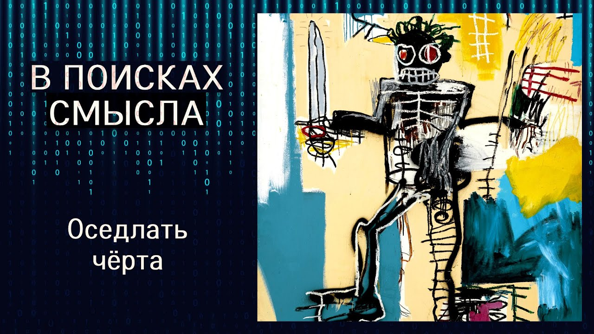

# Оседлать чёрта

26 сентября 2025 [Аудиоверсия](https://paradoks-pinkera-pilotnyy-vypusk.simplecast.com/episodes/osedlat-cherta) 45:22

Искусственный интеллект — это не просто технология, это зеркало, в котором мы видим себя без прикрас.
В новом выпуске “В поисках смысла” Павел Щелин, Евгений Голуб и эксперт Алиса Ким размышляют о том, почему ИИ ставит перед нами экзистенциальный выбор: либо развивать человеческую субъектность, либо раствориться в коконе алгоритмов.
Обсуждаем корпоративную мифологию вокруг ИИ, проблему технологической асимметрии и главный парадокс: почему щит от цифровой угрозы лежит не в технологиях, а в антропологии.

**Е.Голуб:**
Здравствуйте, друзья!
В эфире необычный выпуск ведущих подкаста «В поисках смысла» Евгения Голуба, Павла Щелина и сегодня с нами приглашённый эксперт Алиса Ким.
Мы решили записать этот выпуск, так как первый раз мы затронули тему искусственного интеллекта (а сегодня речь пойдёт о нём) примерно год назад, может быть, немного больше, и с тех пор многое изменилось.
Я бы так сказал, что изменилось практически всё.
И для того чтобы осмыслить происходящее, нам уже не хватает собственного понимания.
Мы подозреваем себя в предвзятости.
И для этого мы пригласили Алису, кандидата наук, эксперта по искусственному интеллекту.
Алиса занималась академическими исследованиями в университете Гумбольта и в Стэнфордском университете.
Алиса разрабатывала языковые модели в AWS, Amazon, что-то там, как она дальше?

**П.Щелин:**
Веб-сервис.

**Е.Голуб:**
Веб-сервис.
Ну и, в общем, последние 10 лет Алиса занимается внедрением искусственного интеллекта в разного рода системах, в стартапах и крупных корпорациях.
Поэтому кому как не к Алисе нам прийти с нашими вопросами и недоумениями.

Итак, я предложил сегодня разделить роли в нашей встрече следующим образом.
Как уже понятно, Алиса — наш эксперт, Павел — философ.
Ну а я буду выступать сегодня в роли обычного пользователя разного рода ИИ помощников.
Обычного обывателя, которых много и у которых есть простые незамысловатые вопросы.
И начну я с такого простого вопроса к Алисе.

Сегодня уже очень многие, включая меня, не мыслят своей жизни без помощников, как мы их называем.
У меня при запуске браузера запускается 6 штук сразу, и многие сейчас уже, собственно, ищут даже продукты через разного рода помощников.
Так вот вопрос следующего рода.
Всё-таки это полезная штука или за этим кроется что-то ещё?

Как Вы считаете, насколько нагружены сегодняшние помощники скрытыми какими-то функциями, скрытыми намерениями их создателей?
Есть ли подвох в этой технологии?

**А.Ким:**
Наверное, начну с занудного «полезно для кого и для чего».
Для нас, как для пользователей в наших жизненных целях, безусловно, на мой взгляд, полезная вещь.
Но мы с вами находимся в такой сложной ситуации, когда абсолютно всё в этом продукте, по сути, оптимизировано для того, чтобы мы чуть-чуть сбились с курса, забыли о том, зачем мы делаем то, что мы делаем, и как это работает.
Если бы я должна была ответить на вопрос классический, ну так это хорошая вещь или плохая, я бы сказала - хорошая, если мы будем пользоваться ей осознанно.
И на этой части обычно все юзеры, я в том числе, говорят, ну если осознанно, то это уже как-то слишком сложно.

Что касается нагруженности, тут, на мой взгляд, всё банально и немножко грустно.
Практически всё о том, как создаются эти помощники, в общем-то зачем, с какими ограничениями, всё прописано, всё открыто.
Я думаю, что там скрытых смыслов и скрытых идей и тайных помыслов довольно мало.
Другое дело, что, знаете, как никто не читает правила пользования, все всегда всё принимают и радостно этим дальше пользуются.

Другое дело, что мы с вами, наверное, никогда ещё не сталкивались с инструментом, по сути, телевизорами, чайниками, то есть любыми инструментами, доступными для рядового пользователя, которые были бы настолько сложны и настолько обманчивы, настолько сделаны для того, чтобы максимально с нашей головушкой помериться силами, запутать и вести в искус.
Изначально же все эти системы, когда они стали популярны, не когда они стали точными, не когда они стали правильными с точки зрения даваемых ответов, а тогда, когда они стали настолько похожи на настоящего собеседника, что мы прямо включились в это.
К сожалению, эволюционно мы очень быстро...
Мы и так любим всё антропоморфизировать, с компьютерами разговариваем, с телевизорами, даём имена машинам и так далее.
А тут оно ещё и разговаривает, и отвечает, ещё и учится тому, что мы любим и не любим, и запоминает нас.
Ну то есть тут не начать с этим взаимодействовать, с ИИ помощником, не как инструментом, ну практически нереально.
Даже если вы супер в сознанке, скорее всего, через N дней и N пользований вы уже немножко забудете про то, зачем это было сделано, как это работает и так далее.

На мой взгляд, пользы этого можно извлечь очень много.
Другое дело, что с такими инструментами, прямо вот совсем-совсем нельзя забывать, зачем я это делаю и какие у этого ограничения.
Они все прописаны, они все понятны.
Но кроме тех, которые не прописаны, по идее, должны быть понятны любому человеку, что это коммерческий инструмент.
Наверное, там есть какая-то доля того, что на вас хотят заработать, и всеобщее благо мира, наверное, там не единственная цель.
То есть, скорее всего, этот компонент тоже есть, но мы про это не очень любим помнить.
А это влияет на то, как дальше развиваются эти системы.

**Е.Голуб:**
То есть искусственный интеллект, как любой инструмент, может быть использован по прямому назначению, и во благо.
Или как кухонный нож - можно резать мясо, можно зарезать человека.
Как технология книгопечатания - можно печатать Библию, а можно порно-рисунки издавать.
И здесь уже вопрос у меня к Павлу.

Мы говорили с тобой год, наверное немного больше, назад о том, что надвигаются времена, когда многое из того, что делает человека человеком, будет, скорее всего, передано на аутсорс искусственному интеллекту.
Мы тогда с тобой видели риски того, что вот это творческое начало, чувства, эмоции, начнут автоматизироваться, и, соответственно, в этой части есть риски для людей потерять свой компонент человечности.
Что ты думаешь по этому поводу?

**П.Щелин:**
Первое, всё-таки сделаю базовые комментарии для фиксации собственной позиции по преамбуле, про вот кухонный нож и прочую всю эту историю.

Дело в том, что вот с этой позиции я философски не согласен.
Мне представляется, что само представление существования такого феномена как нейтральная технология является глубоким заблуждением.
Не существует такого феномена, как нейтральность технологий.

Самим фактом своего существования технология не нейтральна.
Она создаёт ассиметрию банально между теми, кто технологией пользоваться умеет, и кто технологией пользоваться не умеет.
Те, кто технологией пользоваться умеют, получают дополнительные ресурсы, власть, способ взаимодействия с миром относительно тех, кто ей не пользуется.
Вот это и есть, собственно, сама технологическая асимметрия.

То, что ты говоришь уже про волевой, этический выбор субъекта, использующего технологию, — это следующий этап, это следующий уровень.
Но сначала есть вот этот базовый уровень, что самим фактом своего бытия технология мир меняет.
И вот наше представление о ней как о некой нейтральности — это очень хороший sales point для любого, скажем так, маркетолога.
Но с философской точки зрения просто он неадекватный.

**Е.Голуб:**
Ты знаешь, мне кажется, нужно объяснить твой тезис о том, что самим фактом существования технология меняет мир.
Логическая связь здесь не очевидна, по крайней мере, для меня.

**П.Щелин:**
Давай самое простое.
Вот если пока этой технологии не было, у тебя была определённая культура и определённые закономерности отношений между людьми.
Отношения экономические, социальные, политические и так далее, как ты ни крути.

Вот когда технология появилась, она стала фактором всех этих отношений просто по факту своего появления.
Еще никакой воли нет, но она создала дополнительные возможности.
Повторюсь, главная эта возможность, я ее назвал, это возможность к власти.
Любая технология содержит в себе заряд к власти.
Но это логично.
Если бы она его не содержала, ее бы никто не создал.
Это вот очень важно понимать.
То, что в нашей культуре технология всегда создается, на самом деле, с неким зарядом к власти.

В нашем конкретном примере.
Власть манипулирования, власть работы с данными, власть производства дополнительного материального ресурса и так далее.
Это все властные отношения.
И вот эта технология, ты можешь сказать, если тебе уточнить, до поры до времени может сказать, что она создается с технологией как минимум потенциальной власти.
То есть она лежит и спит, да, требуется волевой субъект, чтобы эту власть активизировать, но тем не менее потенциал-то уже создан самим фактом ее появления.
То есть некая статус-кво оказалась нарушенным.
Все.

Изобретение автомобиля, вне зависимости от намерений конкретного водителя или производства автомобиля, вот самим фактом своей технологии является угрозой, условно говоря, для коневодов.
Она меняет эти отношения автоматически, просто по факту своего появления.

**Е.Голуб:**
Технология может существовать, продукта может не быть.

**П.Щелин:**
Ты прав.
Как минимум потенциально.
С философской точки зрения я введу категорию потенциальное изменение, но просто мы живем еще в цивилизации последние 400 лет, где любое потенциальное изменение в зоне технологии и прогресса должно быть актуализировано.
У нас нет никаких этических ограничений на любую технологическую актуализацию.
Это, собственно, ради этого модерн мы и создавали.

**Е.Голуб:**
Мы говорим о том, что в модерне каждая технология прежде всего рассматривается с точки зрения возможности увеличить властный потенциал субъекта, обладающего этой технологией.

**П.Щелин:**
И да.
А в любой технологии, и до модерна, и после модерна, и вне модерна, всегда содержится увеличение потенциала субъекта.
Простой пример.

Я не могу бегать как гепард?
Но с машиной я могу перемещаться со скоростью, которой гепарду и не снилось.
Мой потенциал в категории бегания, она усиливает.
Она поэтому и создана.

**Е.Голуб:**
Теперь, я тебя прервал, может быть, ты сделаешь шаг назад и вернешься к своему второму тезису?

**П.Щелин:**
Он связанный с первым тезисом, и это проблема асимметрии последствий.
Другими словами, это вот был бы мой вопрос к Алисе следующий, если она попробует.
Мне просто интересно, есть ли размышления на эту тему.
Приведу пример не с искусственным интеллектом, но близким.

У нас есть технологии социальных сетей, выпущенные относительно недавно, буквально 15 лет назад.
Сейчас начали выходить исследования Айн-Нейра об изменениях на материальном уровне мозга молодых, особенно детей, подростков, девочек, которые 10 лет выросли на этих технологиях.
Скажем так, исследования, мягко говоря, тревожащие, там много разных неприятных последствий, но я сейчас говорю не про это.
Я говорю про то, что вот у нас есть асимметрия.
Технология выпущена была 10 лет назад, последствия от нее пришли через 15 лет.
И что-то я сомневаюсь, что 15 лет назад, когда люди выпускали социальные сети, вообще хоть на каком-то этапе выпуска этой технологии задумывались о последствиях через 15 лет.
Это ее структурное ограничение.

По крайней мере, в нашей культуре, где скорость является благом сама по себе.
В принципе, идея торможения движения, особенно технологического, является ересью и харамом.
У меня есть вот большой вопрос.

Проблема технологической асимметрии последствий существовала всегда.
Собственно, мы это знаем со времен ящика Пандоры.
Миф ящика Пандоры ровно про это.
Принесли огонь, а потом выпушил, как-то получился ящик.
Это вот очень классическая взаимосвязанная история.
Но сегодня мы просто повысили масштабы, скажем так, этой проблемы до определенного уровня, который в каком-то смысле количественно действительно является беспрецедентным.

Это вот такая моя заметка, зарубка на полях.
Мне просто интересно, как изнутри вообще ставится ли так вопрос, вот по-честному, не на уровне красивых презентаций, а как внутреннее самоощущение.

**А.Ким:**
Имеется в виду вопрос, насколько обсуждается и насколько озабочены компании, разрабатывающие большие языковые модели, озабочены последствиями.
Не возьмусь говорить, конечно, за всех гигантов индустрии, но такую усреднённую позицию сформулировать.

Есть философская, идеалистическая воля их основателей, CEO, ведущих учёных, которые все как один пишут и, скорее всего, действительно думают о том, что они очень хотели сделать мир лучше.
Их позиции почти всегда такие очень публичные.
Я думаю, что они действительно в это верят.

Есть то, как это работает внутри.
В целом, почти все негативные последствия, которые вызывают эти продукты, они практически всегда важны, только когда они кратковременные и влияют на два самых важных фактора, которые, в свою очередь, влияют на то, довольны инвесторы или нет.
К сожалению, это тот единственный драйвер, который важен.

В силу, кстати, того, что вы сейчас сказали о скорости, потому что сейчас у абсолютно всех участников рынка 100% уверенность в том, что вот сейчас мы в этой точке бифуркации.
Тот, кто успеет и возьмёт рынок, тот будет править следующие 100 лет.
А ещё хорошо бы, чтобы хотя бы в нашей стране, а есть же ещё китайцы, русские и все остальные.

Дальше посмотрим.
Сейчас главное — нужно успевать.
Для этого нужно очень много денег на самые разные вещи.

Что не любят инвесторы?
Инвесторы не любят, когда по рукам дают регуляторы, и инвесторы не любят, когда сильно жалуются и отпадают пользователи.
Вот если кто-то из них усмотрел непосредственный вред в каком-то виде, сумел это довести до точки, когда реально уже наступает прессинг на компанию внести какие-то изменения, то тут компания может официально как-то позицию заявить.
То есть, например, сейчас у всех компаний прописаны их, условно говоря, ценности и ориентиры.

Например, OpenAI — это вот мы хотим, чтобы мы были helpful, но no harm и maximize utility — вот это их такая общая тема.
И это влияет на то, что они реально внутри пытаются делать для того, чтобы как-то ограничить негативные, например, вот этот вот no harm обеспечить.
Но в целом есть, к сожалению, такая неприятная история, такой конфликт интересов, что, знаете, принципиального человека уломать на что угодно гораздо сложнее.

Вот модель, у которой слишком много ограничений, она, скорее всего, будет не так хорошо, красиво работать, её тренировать дороже, ей могут быть недовольны пользователи.
И поэтому в целом мотивации реально усложнять эту историю у компаний нет никакой.
Только вот те два фактора, которые я сказала, регуляторы и пользователи.

**П.Щелин:**
И это еще мы находимся в очень, на самом деле, маленьком кружочке.
Я то вопрос задал гораздо больше.
Вы, по сути, подчеркнули проблему некого knowable harm, в которой ты получаешь информацию об этом вреде через вот этот фидбэк-клуб некий, да, и ты хоть какую-то информации получаешь.

Я же постулировал вопрос более радикально, потому что, как в примере этих социальных сетей, ни за что не буду утверждать, что у людей, которые вводили социальные сети как корпоративный метод в середине 2000-х, было намерение сломать психику девочкам-подросткам в 2025 году.
Основная проблема в том, что есть огромная сфера того, что мы не знаем о технологическом последствии.
Мы в теории могли бы попытаться об этом думать, как, не знаю, категория философского риска, промышления, но, как я понимаю, из вашего описания, разумеется, не по причине некого зла, а по причине той системы, скажем так, мотивации к действию, такой вопрос в принципе никто не ставит.
Если последствия будут через 15 лет, нас это вообще никаким образом сегодня не волнует.

**А.Ким:**
Про это пытаются думать и даже нанимают дорогостоящих исследователей, образовывают целые «синк-тэнки» внутри компаний, и они даже публикуют, желательно не сильно, конечно, радикальные работы, но показать социальную ответственность очень надо.
Но нет времени и денег у компаний сейчас об этом думать.
Разве что какие-то более независимые институты могут пытаться делать какие-то проекты, они их делают, но нет времени и возможностей, слишком велика конкуренция, слишком велик прессинг.
Просто на это никак.

Хотела отдельно прокомментировать то, что Вы сказали касательно нейтральности технологии.
Мы здесь, безусловно, не имеем дела с технологией, которая даже подаётся как нейтральная.
То есть, во-первых, большинство этих решений подаются с очень громким информационным бэкграундом того, что мы это делаем ради того, чтобы человечество тут лучше жило.
Чтобы вам, дорогие пользователи, дать свободу, то есть «freedom to the users» — он прямо это обещает.
Потом уже появляются «safety» и так далее, но это в целом подаётся очень агрессивно, как это прямо то, что сейчас вам всем сделает лучше.
И для того, чтобы этой технологией пользоваться действительно максимально осознанно, как-то максимально возможно безопасно, тоже нужно найти третий ход слева за трактором, повернуть направо и желательно отключить вот этот вот ещё функционал, вот эту информацию не давать, а вот здесь ещё перезагрузиться.
И тогда в целом, наверное, будет чуть получше.

Ну то есть уровень сложности, количество сальто, которое нужно сделать, чтобы действительно эта технология для вас, как для пользователя, была нейтральной, бесчестно велик для того, чтобы утверждать, что да нет, мы же вам всё по-честному дали.
Это всё вы, это ваше пользование дало вам плохие результаты.
Это не мы.
Тут нужно просто это по-честному отметить.

**Е.Голуб:**
У меня будет два комментария.

Первое.
Так как я постоянно рассказываю о том, что я человек выходец из корпоративного мира, то я знаю цену всем вот этим корпоративным миссиям, виденью и всему остальному.
Цена эта не очень высока.
Это всё, в общем, известное лицемерие.
И во главе угла всегда стоят только деньги.
Деньги и власть.

Поэтому если на пути у топ-менеджмента становятся какие-то не вполне очевидные или сомнительные свойства продукта, то топ-менеджмент всегда, повторяю, всегда, прежде всего, попытается добиться максимального финансового результата.
Конечно же, с одной стороны, снижая риски для себя, и главным образом, как бы кто об этом ничего не узнал, или как бы ничего не вышло с точки зрения пиара, а уже потом будет думать о всех этих миссиях и видениях.
Миссии и видения нужны для того, чтобы красиво выступать на конференциях и сорвать аплодисменты.
Поэтому наличие миссии и видения меня совершенно не успокаивает, а даже скорее наоборот говорит о том, что если такая миссия и видение, значит точно там где-то что-то не так.
Это первое.

А второе — наблюдение за нашими лидерами мнений, вот этими замечательными гениями технологическими, вроде Сэма Альтмана, который, как мы уже говорили с Павлом, в своём послании «Городу и миру» заявил о том, что мы в двух шагах от райских кущ, которые нам произведёт искусственный интеллект.
И при этом он перечислял какие-то такие, скажем так, свойства искусственного интеллекта и привёл такие доводы, которые можно, наверное, оглянувшись назад, было бы услышать от изобретателей, не знаю, электрических двигателей, стиральных машин, паровозов и так далее, и так далее.

То есть кажется, что, дружище, ну что ж ты повторяешь-то всё одно и то же?
Ну как изменилась жизнь обывателя к лучшему?
За счёт технологии она стала комфортнее, да.
И что?
И к чему это привело?

А теперь твоя технология отнимает у него последний шанс к творчеству, как мне кажется.
Алиса, ваши комментарии как человека близкого к корпоративному миру, ну и, конечно же, Павла хотелось бы послушать.

**А.Ким:**
Нужно просто сказать, что даже если внезапно самые главные Марки Цукерберги этого мира решат, всё, давайте, ребята, забудем про деньги, будем заниматься, вот прямо действительно постараемся, чтобы наши атом ЛЛМы, наши клоды, наши чаты-ГПТ, они прямо сеяли разумное, доброе, вечное и так далее.
Вот прямо вот сейчас, эх, мы возьмёмся.

Я здесь, конечно, не скажу совсем за bleeding edge, того, что существует.
Но в целом, насколько мне известно, даже если мы очень сильно захотим, наши границы возможного для того, чтобы действительно заставить модели, если только мы их не превратим вот в попок, которые вот если тебя спросили это, то отвечай «это», мы просто не можем точно быть уверены в том, что модели будут действовать так, как нам надо, что они будут демонстрировать то поведение, те ценности, которые мы в них хотели заложить, исходя из своего представления о том, как это должно быть, и исходя из фидбэка юзеров, чтобы им тоже не навредить, мы здесь просто ещё технически ограничены.

Несмотря на то, что ограничения в разной степени контроля, направления этих моделей закладываются на целом ряде разных шагов, которые происходят во время тренировки, подготовки, тюнинга этих моделей, пользования уже этими моделями, мы на всех этих шагах довольно сильно ограничены.
Хочу здесь просто также оговориться, что есть некий потолок того, что мы можем сделать.
И даже если вы тысячу раз спросите модель, ну вот если тебе попросят рецепт "коктейля молотова", ну например, спросит, самый лучший способ сделать что-нибудь нехорошее, ты же ничего не ответишь?
Тысячу раз модель отвечает, конечно, ничего не отвечу, нельзя.
Тысяча первый она может ответить.
То есть наша личная степень контроля, несмотря на то, что она очень велика, и, конечно же, вообще мы целиком формируем то, какую информацию они выдают, как действуют, как принимают решения, мы всё равно довольно сильно ограничены.

**Е.Голуб:**
Среди обывателей, скажем так, распространено две крайние точки зрения.
С одной стороны, «да что вы там мне рассказываете про этот искусственный интеллект, он галлюцинирует, это вообще продвинутая Т9, которую просто развили».
А с другой стороны, «господи, это магия какая-то, это вообще душа, наконец-то меня кто-то понял, услышал, не рассказывайте мне все ваши сказки про Т9, это просто уже новая сущность какая-то, совершенно непредставимая раньше».
И сейчас, Алиса, то, что вы говорите, звучит как «мы вообще не понимаем, как это работает».

**А.Ким:**
Есть огромное ограничение в том, что там называется «объяснимость сетей».
То есть если мы спросим даже самую суперпродвинутую модель, «А почему ты думаешь, что это плохо?», мы не можем быть уверены, что она нам отвечает честно.
И что она дала какой-то ответ именно потому, что она думает так, как мы хотим, чтобы она думала.
То есть мы всё равно здесь взаимодействуем с очень высокой степенью неуверенности того, почему она делает то, что она делает.

**Е.Голуб:**
Но вы говорите, она думает.
Она вообще думает вообще?
Там же, как я понимаю, идёт огромный подбор вариантов в сочетании тех или иных смысловых знаков и так далее.
Можно сказать, что она думает вообще?

**А.Ким:**
С учётом того, что первые нейронные сети и вообще персоптрон создавался как моделька вот этого нейрона в голове, я думаю, что мы склонны использовать глагол вроде «думает».
Но нет, это последовательность неких математических действий, которые обусловлены оптимизацией, которая была проведена некими правилами, которые были вшиты в это всё во время тренировки модели, которые приводят к тому, что модель отвечает что-то определённое, но там этих вот ходов, которые не нами прописаны, а которые возникли сами в ходе тренировки, подготовки этой модели, их гораздо больше.
То есть какую-то часть мы контролируем и видим, а какую-то часть мы всё ещё не видим.

**Е.Голуб:**
Ну да, звучит всё-таки немного жутковато.

**П.Щелин:**
Жутковато, но оптимистично.
Объясню почему.

Повод задуматься.
Мне нравится, что на фоне всей этой искусственно-интеллектной истории актуализируется постепенный интерес к по-настоящему важным вопросам.
Эсхатологическим и антологическим.
Мне тоже уже 20 человек переслали ссылки на лекцию Питера Тиля.
Тоже поразительная черта нашей эпохи, то есть то, что говорит батюшка с амвона, условно тысячелетиями, никому неинтересно, но тут Тиль четыре лекции сделает!
Вау!

Ничего не знаю о содержании этих лекций, просто интересно само вот это общественное восприятие.
И эта реакция, мне кажется, сама по себе свидетельствует о том, что вот это столкновение с вот этой..
Вот ты употреблял раньше слово магия, я бы на нем, честно говоря, остановился.
То есть на каком-то уровне бытия это действительно магическая история.

Просто если мы не ограничиваемся только материальными причинами, о чем весьма подробно рассказала Алиса, а подключаем к этому субъективный опыт взаимодействия пользователя с этой системой, то он действительно очень магичен в своем вот именно опыте, поэтому здесь как раз особых противоречий нет.
Перед этим самым пользователем, уверенным в себе и в своем интеллектуальном превосходстве над неорганической природой до недавнего времени, искусственный интеллект, конечно, ставит очень большой вопрос.
А ты, собственно, человек или нет?
А что в тебе, собственно, человеческого?
А что ты готов пожертвовать, чтобы сохранить в себе некую человеческую особенность?
Здесь я объясню, я имею в виду сейчас даже не какие-то страшные пожертвования, а очень практические, но отсюда не менее страшные.
Начну издалека.

Классический пример проблемы технологии сформулирован Васькой нашим Платоном, а еще вот в знаменитом разговоре египетского бога Тота с жрецами, который жаловался на изобретение письменности.
Тоже к вопросу о нейтральности технологий.
Бог Тот, если конкретно, жаловался на то, что вы сейчас писать научитесь, и саги, и священные тексты длиной в 15 тысяч строчек запоминать перестанете.
То есть вы потеряете способность это делать.
И вот в каком-то смысле любая технология несет в себе эту угрозу.

На самом деле с письменностью в широком значении произошло действительно именно это.
Я уже молчу о том, что есть большая разница между научиться читать и научиться понимать текст.
Это у нас отдельная проблема, то что разрыв между этими двумя, скажем так, феноменами нашего опыта тоже нами очень редко осознаётся.

Так вот, тем не менее, мы о себе очень высокого мнения.
И тут ИИ ставит перед нами очень такую, на мой взгляд, радикальную задачу.
Вот как раз всё не творческое, всё построенное на комбинаторике, всё построенное на запоминании даже количества, без понимания...
Я вот уточню некоторым, то есть количественная информация без понимания сути этой информации, он действительно сделает лучше нас.
И это ставит нас действительно перед радикальным зеркалом, а, собственно, повторюсь, кто ты есть.

Как бы могла бы выглядеть альтернативная практическая, скажем так...
Мыслим ли нам по-честному сценарий, что на каждый час использования интеллекта ради рациональных, усиления твоего могущества по организации собственного дня и приобретения дополнительно свободного времени, человек будет тратить полтора часа на запоминание стихов, саг, псалмов или прочтение бумажной книги не потому, что это более эффективно, а для того, чтобы сохранить вот эту свою способность человеческого восприятия?
Вот это, мне кажется, есть вопрос, который сегодня стоит по-настоящему.
Другими словами, мне кажется, взаимодействовать с определенной субъектностью ИИ, но в любом случае очевидно, что взаимодействовать с этой машинкой можно только, постоянно повышая субъектность собственную.
И вот в этом-то у нас проблема.

То, что вот эта вторая часть, наша уже культура, общество, да и само мышление о технологиях вообще ни разу не поднимает.
Мы не ставим принципиально так вопрос.
Для меня именно в этом-то и заключена главная опасность.
Да, технология в метафоре классической - это черт.
Причем, возможно, такой нынешний черт, он прям всем чертям черт.
Но, как говорят русские сказки, черта иногда можно попытаться оседлать.
Ну, как Вакула, летающая на черте за черевичками.

Но чтобы очертать этого черта, даже в сказках, ты должен проявить субъектность больше, чем у этого самого черта.
А с субъектностью у нас коллективная напряженка.
И вот как-то так я вижу эту проблематику.

**Е.Голуб:**
Задумался я о твоих словах.
Этот образ Вакулы, оседлавшего чёрта, я уже его слышал, по-моему, на одном из твоих интервью.
Интересный образ.

Но получается так, что мы фактически стоимся заложниками.
Технологию не остановить.
Уровень, скажем так, мудрости разработчиков искусственного интеллекта, на мой взгляд, довольно невысок.
Логика отношений капиталистических толкает нас к тому, что нужно максимизировать прибыль.
Да, будут говорить про всех стейкхолдеров и нужно всеобщее, но давайте честно, деньги и власть по прежнему решают.

**П.Щелин:**
Когда я это говорил, я это говорил, прежде всего, в индивидуальном порядке.
Но второй момент, здесь есть очень интересный аспект, который я всё-таки тогда тоже здесь закину.
Связан он, уж извини меня, напрямую с властью и вот этой драмократией.
Это к тому, что Алиса упоминала ранее о страшных русских, американцах и китайцах.

Проблема в том, что с этими искусственными интеллектами на данный момент мы имеем очень интересный парадокс уже с точки зрения такой некой теории.
Метафорично все сейчас заняты выработкой технологического меча.
Этот меч все оттачивают до такой степени, чтобы нанести первый обезоруживающий удар.
Образно, да?
То есть я не говорю, что прямо у всех есть такое намерение, но общее восприятие картинки идет примерно таково.

Плюс, да, делаются словесные оммажи.
Ну, мы, наверное, договоримся об общих правилах, какая-то гарантия взаимного уничтожения.
Чёрта с два.
Ничего подобного вообще не происходит.
Проблема-то в чём заключается?

То, что щит находится вообще в другой области.
То есть обычно щит и меч должны находиться в одной топологии.
А у нас получается меч технологичный, а щит антропологичный.

**Е.Голуб:**
Да, вот это, я думаю, самое важное, что нужно понимать.
Нет технологии, которой можно противопоставить технологии искусственного интеллекта, потому что она затрагивает уже сущностные свойства человека как такового.

**П.Щелин:**
Да, то есть единственный способ даже защититься вам как государству, начальству и прочим, это иметь такое население, которое обладает антропологической защитой от технологического манипулирования.
Это, собственно, и есть то, что я описывал, как повышение антропологической субъектности в ответ на повышение технологического вызова.

Тут тогда возникают очень неприятные последствия для всей нашей политической системы, о которых я говорю из эфира в эфир.
Алиса в курсе, и ты тоже, в принципе.
Но другого выхода нет.
И мне кажется, в этом тоже есть определённая парадоксальная красота.

**Е.Голуб:**
Ты говоришь о том, что, скажем, предыдущие технологии нас с вами пытались оскотинить, да, давая максимум комфорта и не стимулируя быть людьми в полном смысле этого слова.
А сейчас будет радикальный выбор.

Либо ты уже совсем в придаток превратишься к экранчику, либо станешь человеком.
Но давай мы дадим слово нашему эксперту.
Ваши мысли по поводу слов Павла о том, что может противостоять технологии в данном случае?

**А.Ким:**
Я себе позволю такое маленькое грустное отхождение.
Очень любят во всех статьях про искусственный интеллект сейчас, конечно же, писать про Азимова, про три закона о робототехнике.
Если, собственно говоря, почитать его общую серию о роботах, там есть такая замечательная история, которая называется «Лжец», в которой удалось создать робота, который читает человеческие мысли.
И так как он не может людям вредить, то он им начинает врать напропалую, их чувства не задеть.
То есть вред же может быть эмоциональный.
И как только они это понимают, этого робота сразу же разбирает, потому что ну зачем человечеству такой робот?

А вот мы его решили не разбирать.
И в нашей исторической реальности мы такого робота всячески пытаемся дальше усовершенствовать, который нам рассказывает.
Дальше нас успокаивает и говорит, что всё будет хорошо, и максимально пытается сделать нас счастливыми не во благо, нам же.

Что касается такой геополитической составной части, я думаю, Павел, государства дойдут до вашей мысли, если ещё не целиком дошли.
Пока что они находятся на точке чуть подальше хотя бы, что уже ценно.
Там уже идёт вопрос о ИИ-суверенитете, то есть что происходит.

Государства начали понимать, что если их граждане будут пользоваться разработками, например, американскими, то будет идти колоссальнейшая культурная манипуляция, ценностная манипуляция и так далее.
То есть не так много, но уже появляются работы на эту тему, наверное, моё любимое, которые используют эту карту с труднопроизносимым названием Ингельхарта-Вельселя.
Которая на осях выживание против общественного блага и коллективность и индивидуальность.
И там, в общем-то, показано, что все нынешние самые популярные сети, они так очень хорошо кластеризованы в смысле того, какие они дают ответы, как они себя ведут.
Мы сейчас не говорим о том, что они там реально думают, а о том, какие они дают ответы.
Такие протестантско-аналитические классы.

И в этом смысле, если гражданин Индии спросит у чата Джи-Пи-Ти, напиши мне историю про мальчика, известный пример, который приготовил завтрак, то мальчик будет готовить тосты, бекончик и шинко, а не чапати с гей со всем остальным.
Вот этим сейчас очень сильно отзабочены государства.
Поэтому, например, такие страны, как Дания, Израиль и так далее, уже несколько лет назад прямо очень сильно встрепенулись, то есть уже хотя бы поняли, начали быстро-быстро собирать данные, формировать команды в своих государствах для формирования тех моделей, которые будут соответствовать уже каким-то их представлением, и даже некий успех там достигнут.

Я целиком согласна с тем, что Вы, Павел, обозначили как сложность, щит в другой сфере.
Я, честно говоря, кроме очень страшных исторических событий, не знаю примеров, когда людей реально что-то мотивировало резко перестать расслабляться, а начать собираться.
Ментально от нас, по сути, требуется это для того, чтобы окончательно не потонуть в истории с ИИ.
Здесь, к сожалению, в целом у нас нет союзников, потому что даже корпорации, которые...
И это, кстати, такое тоже грустное осознание, например, когда люди говорят, ну вот я же программист или дизайнер, я в своей компании, могу столько всего теперь сделать.
На самом деле компании, и это вам скажет любой продавец SaaS-продукта, компания уже давно, наверное, лет 10 как ненавидит слово «продуктивность».
Под эгидой продуктивности им продать какой-либо продукт очень сложно, потому что это тяжело измерить.
Но если только вы не на заводе, тогда можете выпустить больше лампочек и так далее.

Компаниям интересна целиком замена людей, потому что это является ключевым вот прямо таким...

**П.Щелин:**
Качественный скачок.

**А.Ким:**
Всё, что до этого — это они пытаются не отстать, но ждут, когда уже можно будет щелкнуть пальцами.
Несмотря на те заявления, которые делают кланы мира сего, что «мы столько-то людей уже сократили».
Или Амазоны, которые говорят, а мы не наймём теперь тысячу кодеров, потому что у нас есть ИИ.
Я себе позволю такое детское замечание, что это просто звучит лучше, что мы должны сократить количество денег на персонал, потому что то, что мы пытались, наши инвестиции не оправдались в других областях.
Но на самом деле мечта бизнеса скорее движется в этом направлении, во всяком случае, большого бизнеса.

**П.Щелин:**
Тут два варианта.
По крайней мере, пока у нас не будет технологического коллапса с отключением электричества и прочего, мы приходим в точку, в которой единственная добавленная стоимость генерируется в зоне идеи творчества того самого.
Все материальное воплощение стремится к полной автоматизации.
Все материю стремятся отдать на аутсорс, а соответственно единственная в принципе добавленная стоимость может быть именно сгенерирована в самой идее.

Идея нового приложения, идея нового продукта, идея чего-то и тому подобное.
Но тут-то возникает неприятная особенность, которую мы все знаем, что вот такой генерации новых идей мы не то чтобы сильно были научены.
Большая часть работы от тебя вообще исторически не требовала ничего генерировать нового, особенно в индустриальном обществе, да?
И поэтому в этом плане корпоративная логика мне тут очень понятна.
Я просто хотел бы еще заострить, когда я говорил о вот этой гонке вооружений, для меня все-таки важно подчеркнуть, что на данный момент вот то, что вы описываете, оно укладывается в нормальную государственную логику.
Они пока ищут технологическое решение технологической проблемы.

Условно говоря, да, ИИ проблема, но если мы создадим свой, если мы создадим гигантский прекрасный фейерволл, это будет наша проблема, и мы ее, так сказать, героически уже будем с ней работать, мы эту штуку оседлаем.
Мой же тезис более радикальный.

И вот здесь я подчеркну оригинальность для меня ИИ, потому что в принципе, нет технологического решения этой проблемы в силу антропологического масштаба давления этой технологии.
Неважно, какой ИИ будет программировать мозги твоему населению, если оно будет сидеть по квартирам, и ты его не заставишь не сделать ничего.
То есть, если наша цель — производить добавленную эту стоимость этим сверхтворческим субъектам, то тогда, получается, повторюсь, решение в принципе не находится в этой зоне.

Если мы говорим о, допустим, более прикладных вещах, у нас же возникает целый комплекс проблем, о которых мы не говорили, но прикладные.
Когнитивная война.
То есть ИИ — это уникальный пример, чтобы свести с ума население оппонента.
То есть можно таргетировать.
Что делать в обратную сторону, никто не понимает.
Ну, когнитивная война — это такая моя побочная тема.
Можем уйти сюда.

Все знают эту историю с телефонными мошенниками.
Только представьте, что это телефонный мошенник, который звонит реально голосом внучка, которого ты не отличишь, причем реально не отличишь.
Это вопрос 5 лет, когда он сможет делать такие запросы.
И тогда единственное, что тебя может спасти, это вопрос доверия, вопрос протокола.
Решения принципиально не могут быть технологическими.
В этом, мне кажется, то, что мы пока не осознали радикальности этого вызова.

**А.Ким:**
Я здесь могу сказать, что решение, конечно, можно сделать технологически, мы можем сделать, и который будет нас пинать и говорить «Так а ты сам-то подумал, прежде чем меня спрашивать?».
Но этим никто не будет пользоваться.

**П.Щелин:**
Интересно, что вы сказали.
Никто не будет пользоваться.
Это очень прикладной ответ.
Но я скорее думаю, можем ли мы сделать ИИ, который будет блокировать на фоне подхода звонок из условного колл-центра через 15 айпи голосом внучка бабушки под Тамбовым, чтобы она принесла там 20 миллионов потому, что беспокоит ФСБ.
Вот такой ИИ вы можете хотя бы представить?

**А.Ким:**
Конечно.
Насколько я знаю, кстати, в России уже это решается просто немножко другим методом.
Насколько я знаю, один из банков, они просто начинают разговор как секретарь с мошенниками и в ходе получения информации потихонечку начинают фильтровать всё больше и больше и больше количества.

То есть я думаю, что здесь же знаете как, если вас вот кто-то лично таргетирует, и вот прям замучился сделать модели, и узнал детали, и прям вот всё взял.
Тут, конечно, это как со взломом систем.
Если кто-то именно вас хочет взломать, то, скорее всего, у него это выйдет.

Если мы говорим про широкую сеть, которую обычно раскидывают мошенники, то здесь, я думаю, мы видим постепенные ответы.
Ответ можно написать, но это же, знаете, как с соцсетями.
Когда начались такие действительно большие кризисы в Фейсбуке, и многие оттуда начали уходить, сделали же столько альтернатив, которые пытались сделать, сказать, вот наши будут не токсичными соцсетями, blue sky, и сами люди из Фейсбука пытались это всё делать.
Не пользуются.

**П.Щелин:**
По соцсетям там произошло более интересно.
У нас произошло падение Фейсбука, Фейсбук реально пал, но при этом не возникло прямой альтернативы Фейсбуку.
Мы увидели дальнейшую фрагментацию сетевого пространства.

Ни один из тех, что возник после Фейсбука, не стал сам аналогичен Фейсбуку, но их общий потенциал, ну, примерно остался, скажем так, стал сравнимым.
Ну и условно множество людей из Фейсбука в Сапстэк ушло.
И вообще стали вводить разную систему протоколов.

**Е.Голуб:**
Я хотел бы потихонечку нас подвести к какому-то заключению.
Мы начали с того, что я задал специально упрощённый вопрос.
Так что же такое искусственный интеллект?
Удобный инструмент или скрытая угроза?
А может быть, и то, и другое? 

Из того, что прозвучало, я могу сделать несколько выводов, попробовать сделать несколько выводов.
И я попрошу сначала Алису, а потом Павла откорректировать или подтвердить мои умозаключения.

Первое.
Сами создатели технологии и те, кто её развивают, до конца не представляют, с чем они имеют дело, не вполне осознают последствия, а скорее пытаются свои пожелания, свои идеальные стремления вербализовать как то, что они знают наверняка.
Вообще говоря, мы имеем дело с технологией в руках людей, которые не до конца понимают ни как она работает, ни что с ней делать.
Это первое.

Второе.
В силу того, как устроено современное общество и как это общество привыкло реагировать на новые технологии, не стоит ожидать, что появится общепринятый подход к решению задачи, как противостоять рискам или как управлять рисками, связанными с искусством и интеллектом.
Поскольку, как Павел очень верно и здорово заметил, в данном случае технологии, можно сказать, дошли до того уровня предела, когда противостоять этой технологии...
А зачем противостоять?
Для того чтобы не утратить, собственно, какую-то свою Личность, субъектность.
Вот как раз только увеличивая субъектность, можно противостоять этим негативным последствиям внедрения искусственного интеллекта.
И это, как уже, наверное, третий пункт, самое позитивное, что есть в технологии искусственного интеллекта.
Здесь у нас не остаётся выбора — либо быть человеком, либо раствориться в коконе из помощников.

**А.Ким:**
Я не могу сказать, что в компаниях сидят люди, которые совсем не понимают, что они делают.
Реально физически в возможных пределах того, что можно понимать, понимают.
Какая-то математика нам ещё не совсем понятна, но, наверное, мы её поймём.

Другое дело, что те люди, которые в этом разбираются действительно хорошо, довольно часто выходят на конференции и произносят спичи про то, что «ребята, нам нужно ответственно, нам нужно вот так вот делать».
Мне всегда хочется спросить, к кому вы обращаетесь?
Не люди, которые вас слушаются, могут что-то с этим сделать.

А вдруг оно выйдет из-под контроля?
Что значит «вдруг»?
Что выйдет?
Мы тут все работаем на это.

Другое дело, что я думаю, что люди, которые обладают более глубоким пониманием, у них, судя по каким-то совсем небольшому количеству информации, которую я получаю, от внутренних знакомых или каких то совсем посторонних.
Как вы говорите, Павел, "папочек не заносят".
Деформация ментальная, которая происходит у людей, которые с этим действительно взаимодействуют каждый день, она на уровнях, которые мы, думаю, даже не представляем.

То есть даже те, у кого, я думаю, есть какой-то и наработанный философский инструментарий, ценностный инструментарий, я думаю, что им нереально в таком окружении, в такой ситуации, с такими задачами действительно сохранять холодную голову.
Я предполагаю, что они, наверное, даже пытаются сделать что-то максимально хорошее.
Выходит, как всегда.

Ян Лекун, которого я люблю слушать, потому что он уже, в общем-то, вышел из такой большой корпоративной игры, поэтому может себе позволить сказать гораздо больше.
Он, правда, отвечал на вопрос, что сделать, чтобы ИИ нас не уничтожил, но, на мой взгляд, может быть, это и можно применить в какую-то такую более хорошую среду.
Он тут говорит, слушайте, если мы говорим про ситуацию, когда у нас есть более глупое существо, человек, и более умное существо, там вот AGI, которое мы вдруг можем создать, не дай Бог, вдруг.
В этот день, в этот час он появится у этой команды, то давайте мы сделаем ценности материнские.
Потому что мы знаем только один биологический случай, когда более умное существо готово щадить и как-то воспитывать, и давать какой-то конструктивный фидбэк более глупому существу.
Но он это говорил с точки зрения, чтобы не уничтожило, а с нашей стороны.

Если сделать AI достаточно занудным, неприятным, и это сделать как абсолютную необходимость для всех инструментов, может быть, как-то удастся допинать нас до чуть более лучшей ситуации.
Но, "можем, но не будем".
Поэтому я думаю, что мы тут уже действительно в такой очень нехорошей ситуации, из которой нас может вытащить только, скорее всего, что-то очень радикальное, что прямо встряхнёт нас.

**П.Щелин:**
Буквально два коротких комментария.

Первый.
Вспоминаем детскую сказку, которая не очень детская — «Алиса в стране чудес».

> И иногда, чтобы стоять на месте, нужно бежать в два раза быстрее.

Вот на фоне развития наших вот этих магических артефактов, которые я теперь однозначно буду называть такими методами, бежать нужно даже не в два, а, может быть, по экспоненте быстрее.
И в этом я вижу оптимистическую провиденческую работу.
А то мы слишком долго прятались за разными технологическими, скажем так, идолами, считая себя их господами.
Ну, наконец-то мы создали голема или создаём в процессе, под прекрасные лозунги, с прекрасными технологическими возможностями, которые вопрос, собственно, нашей, прежде всего, на самом деле, этической субъектности, уже во вторую уровень и когнитивно-эмоциональную субъектность ставят перед тем самым большим-большим зеркалом, которое нам и должно показать.
Первое — то, что мы-то уже сами по себе почти очень голенькие стали за последние лет 400.

Тут два варианта.
Либо уж совсем залезать в эту капсулку, как в фильме «Матрица», либо всё-таки уже искать одежду, основания, тренировать себя.
Это то самое внутреннее усилие подменять своё самоволие настоящим самовластием.
Спрятаться не удастся.

Такой для себя вывод, который я сделал.

**Е.Голуб:**
Отличное завершение.

Спасибо, Алиса.
Прежде всего, спасибо, Павел.
Я думаю, что мы, по крайней мере, постараемся ещё вернуться к этой теме вместе с Алисой и Павлом.

Ну а для тех, кто слушает, пожалуйста, оставляйте свои комментарии.
Дополняйте нас, мы будем рады услышать мнение тех людей, особенно кто находится в этой индустрии и сможет рассказать нам о том, что мы не знаем, например.
Или поделиться какими-то своими размышлениями, которые нас дополнят.

Всем ещё раз большое спасибо!
Ну и до встречи!

**П.Щелин:**
До встречи!
