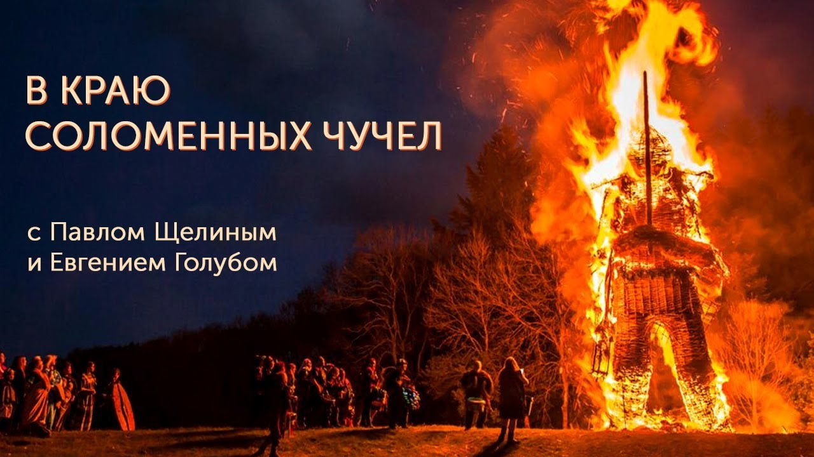

# В краю соломенных чучел

29 июня 2024 [Аудиоверсия](https://www.youtube.com/watch?v=Od4vg2oQA8o) 49:45

Авторы подкаста «В поисках Смысла», Павел Щелин и Евгений Голуб, говорят об особенностях заочной полемики с оппонентами в YouTube. 

Одна из самых древних и сомнительных уловок в споре называется «соломенное чучело» - опровержение фиктивной точки зрения.
Мы сторонники иного формата дискуссии об основах мировоззрения. 

Примеры «соломенных чучел» взяты  из прозвучавшей публично критики философской позиции Павла Щелина и содержания выпусков подкаста.

Ссылка на книгу Сергея Иннокентьевича Поварнина, «Искусство спора. О теории и практике спора» - https://evolkov.net/

**Е.Голуб:**
Здравствуйте, друзья.
Сегодня мы решили записать видео-версию подкаста «В поисках смысла».
Так что начинаем, как обычно мы начинаем подкаст.
У микрофона Евгений Голуб.

**П.Щелин:**
И Павел Щелин.
Все так же у микрофона.

**Е.Голуб:**
Обычно с такой же задержкой у нас происходит это и при записи.
Но этот выпуск, это будет видео-выпуск, мы решили назвать «В краю соломенных чучел».
Почему так, вы поймете немного позже.
А пока я хочу рассказать вводную часть, о чем пойдет речь, что мы хотели бы обсудить с вами, поделиться своими мыслями, выводами, печалью и надеждой.

Так вот, наши усилия с Павлом, ну и, конечно, эфиры Павла привели к тому, что в последние полгода, месяца 3-4 вышло достаточно много критики, если хотите, если так можно сказать, обсуждений того, что мы делаем.
И не вдаваясь в подробности содержания этой критики, мне хотелось бы поговорить о форме, поскольку, вообще говоря, это беда или боль той полемики, которую мы слышим каждый день, если смотрим YouTube, слышим, смотрим.
И я расскажу вам, если кто не знает, о том, что такое соломенная чучела.
Наверное, многие знают, но я все-таки повторюсь.

Итак, есть такой полемический прием, он называется подмена тезиса.
Ну а если рассказать как-то проще, то это ситуация, когда оппонент или желающий критиковать кого-то вместо действительных тезисов, слов своего противника, приписывает этому человеку то, что он либо не говорил, либо выдергивает из контекста какие-то фразы.
В общем, лепит такое соломенное чучелко, который потом с удовольствием пинает на радость публике.
Ну и так как это чучелка, оно не сопротивляется, не отвечает, его можно победить.
И радостно, измазав грязью, потом говорить, вот посмотрите, какое-то жалкое, безобразное чучело.
Оно побеждено.

Но при этом вместо чучела используется имя своего оппонента.
В общем, прием довольно известный.
И, собственно, этот образ был создан, по-моему, чуть ли не в средние века, а то и раньше.
Почему чучело?

Потому что образ был такой, что стрелки из лука, такие неуклюжие, неловкие, подходили к соломенному чучелу вместо мишени, стреляли в него с близи и потом демонстрировали свои удачные выстрелы как бы.
Ну и, в общем, сегодня, к сожалению, такого рода полемика, это основная полемика, которую мы встречаем на YouTube-каналах с обсуждением, конечно же, не только нашего подкаста, но и многих других подкастов.
Чуть кто кем не доволен, тут же лепит соломенного чучелка, попинает его, и потом торжествует победу.

Павел, что скажешь?
Согласен с этим?

**П.Щелин:**
Я скажу, что я не знал, что эта фраза исходит корнями к лучникам средневековым.
Так что спасибо, что просветил.
А в остальном полностью согласен.
Я просто не знал этой этимологии.

**Е.Голуб:**
Вот.
И мне, к сожалению, никак не удается найти людей, которые бы разделяли со мной вот эту любовь к фразе Григория Померанца, известного философа, интеллектуала, уже, к сожалению, покойного, который как-то написал, что буквально, сейчас минутку, что 

> стиль полемики важнее предмета полемики и даже важнее правоты в споре.

И вот мне хотелось бы немного об этом поговорить.

**П.Щелин:**
Ну вот я могу сразу сказать, что я не могу полностью согласиться с уважаемым Померанцем, хотя я его действительно очень уважаю.
Я бы сказал, не менее важен.
Вот про важнее не уверен, но не менее важен.
Это, я бы сказал, условие минимальное, но недостаточное.

**Е.Голуб:**
Тогда я продолжу эту цитату.
Она звучит полностью так.

> Ибо правота никогда не бывает совершенной, и никогда нет такого ясного и твердого добра, что против его оппонента хороши все средства.
> Отстаивая добро, мы постоянно грешим против добра.
> 
> Даже тогда, когда в формальном правовом плане мы чисты, кто знает все последствия этих действий.

**П.Щелин:**
В этом смысле, да.
Ну вот в раскрытии согласен.
Просто вот в коротком виде она немножко звучит, как будто, знаешь, оправдывает софистику такую.
Потому что как бы истина не важна, а важно, как мы об этом говорим.
Поэтому я обычно на короткую цитату, у меня есть такая небольшая, загорается внутренняя лампочка.
Но применительно к нашему контексту, я с тобой полностью согласен.

**Е.Голуб:**
А я продолжу.
Потому что для меня эта фраза, она связана еще с тем, как очень известный логик, Сергей Иннокентьевич Поварнин, написавший, на мой взгляд, лучшее популярное руководство для тех, кто желает вести полемику, это «Искусство спора».
Книга, написанная сто лет назад и не потерявшая свою актуальность.

**П.Щелин:**
Смотрите в описании.

**Е.Голуб:**
Хорошо, добавим в описание.

Так вот, он делил спор на пять разных категорий.
Я не буду останавливаться на споре, как игре и споре, как спорте.
Но вот у нас сейчас в пространстве присутствуют три типа полемики, спора.

Это спор для победы.
Очень редко, но все-таки спор для убеждения.
И вот никогда, никогда, спор для проверки истины.

И, собственно, мы хотели бы в нашем разговоре прийти к тому, чтобы предложить вам такой формат спора.
Ну а сейчас я хотел бы перейти к тому, как выглядит вот эта порка чучела в конкретных условиях нашего, так сказать, контекста, в нашем контексте.
Что-то, Павел, я много говорю.
Давай ты добавишь что-нибудь.

**П.Щелин:**
Пока добавить даже нечего.
Я очень как раз рад здесь ненадолго поменяться с тобой ролями и выступить слушателем.
Единственное, могу добавить, просто потому, что я с тобой полностью согласен, но у тебя присутствует вот этот элемент хорошего спокойствия, который позволяет эту мысль донести очень глубоко и искренне.
Я, наверное, уже отношусь просто к той стадии, где я это просто принимаю, знаешь, как это, не то чтобы смиренно, но как неизбежное следствие любой публичной деятельности, что вот эти соломенные...
То есть какая-то норма YouTube.
Не хотите, чтобы из вас делали соломенного чучела, не идите на YouTube, условно.
Что даже заставляет немного забыть, что в целом-то вообще-то это, конечно, ненормальная ситуация.

**Е.Голуб:**
Да, ну и меня больше всего печалит, что много людей действительно одаренных интеллектуально, полемически, с быстрым умом и хорошим кругозором.
И вот они тратят свое время не на то, чтобы разобраться в сути взглядов, которые им не симпатичны или с которыми они не согласны, а в том, чтобы свести эти взгляды к какому-то примитиву, редуцировать до вот этой соломы, потом сжечь ее, так сказать, публично и водить возле этого хороводы.
В чем смысл?
Это какое-то недостойное, что ли?
Недостойно человека, недостойно разумного человека.
Хочешь ты там что-то, какую-то суггестию произвести, типа посмотрите, мы правы, мы правы.

А вот эти два аргумента в основном против оппонентов, они в любой последовательности.
Либо они продались, либо они сошли с ума.
Или они сначала сошли с ума и продались, либо они продались, а потом сошли с ума.
Вот, собственно, если послушать твоих оппонентов, Павел, то в основном оно как бы можно свести к двум моментам.

Ну а дальше идет, скажем так, конструирование на глазах изумленной публики этого соломенного чучела, которое начинает изрекать всякую ахинею.
Причем, как интересно, что происходит.
Вытаскиваются какие-то из контекста вырванные фразы.

**П.Щелин:**
Или придумываются.

**Е.Голуб:**
Это же глупость, глупость, глупость.
Посмотрите, ну что, это может говорить только безумный человек.
Да, он безумен, у него, так сказать, поехала крыша.
Окей.

А еще интереснее, когда человек с миллионами подписчиков, с известностью, вдруг начинает выдумывать полностью не присущие тебе фразы и начинает просто многократно повторять, как известное всем высказывание, которого не было никогда.

**П.Щелин:**
Это же и есть софистический прием, мы их в дальнейшем обсудим.
Но это и раз и есть базовое, это же и есть основа соломенного чучела, как там..

> Ложь, повторенная тысячу раз, становится правдой в восприятии слушателя.

Что-то типа такого.
Это парафраз, не помню чьей цитаты.
Но это именно...
Давай просто расскажем слушателям разницу между риторикой и логикой.
Это классический риторический прием.
То, что ты описываешь, он эффективный, надо признать, он эффективно работает.

**Е.Голуб:**
Как появилась логика, она появилась достаточно давно.
Скорее всего, мы здесь вспомним и формальную логику Аристотеля.
А риторика появилась еще раньше.

То, что мы говорим софистика, это риторические приемы, которые были отработаны тысячелетиями.
И фундаментальная разница между логикой и риторикой в том, что логика признана проверить основания, проверить, насколько выверено суждение, насколько можно считать его истинным, основываясь на законах логического доказательства.
Дедукции, прежде всего.

**П.Щелин:**
Индукции там много.

**Е.Голуб:**
Но все-таки есть понятные вещи.
Берем тезис и начинаем его проверять.
Конечно, в конечном итоге мы можем опереться на какой-то аксиом, но тем не менее.
В любом случае мы понимаем, о чем идет речь.

Риторика, задача риторики — это убедить другого человека.
Да, конечно, эти два, скажем так, два способа мышления или два способа изложения мыслей участвуют друг в друге.
Они применяются совместно.

**П.Щелин:**
Давай я даже усилю.
Все-таки вот с риторикой есть проблема в том, что, когда мы говорим метод убеждения, это звучит благородно.
Нет ничего плохого, чтобы человека в чем-то убедить.
И, в принципе, в риторике такое тоже присутствует сплошь и рядом.

Другое дело в том, что в силу вот этого, как бы можно сказать, технологии убеждения, риторика всегда имеет своей теневой стороной манипуляцию.
То есть риторика очень хорошо позволяет тебе манипулировать.
И вот когда вместо слова убеждение ты произносишь слово манипуляция, тогда вот это противоречие становится даже более выпукло видным.

**Е.Голуб:**
Да, ты понимаешь, есть дозволенные риторические приемы и недозволенные риторические приемы.
То есть условно джентльменский и не джентльменский.
Вот подмена тезиса — это не джентльменское поведение.

Но в прямом споре, не в заочном, не за спиной у человека, когда человек присутствует, можно сказать, подождите, минутку.
Я этого не говорил, вы мне приписываете ложное высказывание.
Если у вас есть ссылки на источник, пожалуйста, продемонстрируйте.
Если нет, то я прошу вас отозвать.
То есть это ложь.

А когда человека нет, ему можно прислать все, что угодно.
Можно сослаться на то, что это было сказано в частном разговоре.
Звучит на самом деле еще хуже, но тем не менее.
Или можно просто незаметно подменить тезис.
Например, ты печалишься по поводу какого-то террористического акта.
А тебе приписывают, что ты сочувствуешь взглядам человека, который погиб в результате этого террористического акта.

**П.Щелин:**
Классический прием.

**Е.Голуб:**
То есть фактически на тезис нет никакой реакции.
А есть реакция на придуманный тезис, на фальшивый тезис.
И он дальше начинает раздуваться.
Посмотрите, как можно иметь дело с этим человеком.
Он же враг, враг, враг, вражина.
Он же агент, агент, агент.
Он же там сумасшедший, сумасшедший, сумасшедший.
Ну и в общем, конечно, это все печально.
И не хотелось бы на это тратить много времени.
А хотелось бы привести цитату, которую приводит Поварнин в своей книжке.
Он приводит цитату Спенсера.
Вот я хотел бы ее прочитать.
Потому что для меня она воплощает то, чем мне было бы интересно заниматься в полемике.
Что меня на самом деле интересует.
Звучит цитата таким образом, зачитаю.

> Чем более мы любим правду, чем менее мы дорожим победой, тем пламенней мы желаем узнать, почему наш противник обладает той точкой зрения, которая у него есть.

Дальше я уже просто по памяти.
То есть, если человек стремится к тому, чтобы прояснить тезис оппонента, если им движет не желание унизить, не желание развенчать, победить, сплясать возле этого костра, то в конечном итоге это приносит пользу и одному, и второму.
Как ты думаешь?

**П.Щелин:**
Ну, я полностью согласен.
Мы как бы до этого дойдем.
Но давай тогда сразу этот основной тезис скажу.

Второй элемент вот этого нашего такого плача, который есть в этом разговоре, это то, что как раз именно из-за доминирования манипулятивной риторики, давай так это сформулируем, и перестало возможным проведение, собственно, разговоров, в кавычках, дебатов.
Я не особо люблю слово «дебаты» даже сегодня, потому что оно очень специфический жанр, который планируется в американских, в частности, институтах.
Там есть свои манипулятивные элементы.
Я, скорее, имею в виду очень простое.

Я считаю то, что мы живем в мире, когда все очень запутано.
Сейчас особенно.
Когда непонятно, что вытекает из чего.
Из каких посылок вообще человек строит свою картину мира, свою картину убеждений.
И в итоге люди, как у нас называется группа у подкаста, смысла самоочевидного.

Вообще одна из таких больших тем, с которыми мы работаем, это как раз прояснение самоочевидного.
То, что многие самоочевидные вещи для вас совершенно не являются такими самоочевидными вещами для другого.

**Е.Голуб:**
То, что кажется самоочевидным, давай так скажем.

**П.Щелин:**
Да, то, что кажется самым самоочевидным, не является таковым ни для другого человека, более того, чаще всего оно и для вас-то не является.
Вы сами не знаете, почему для вас это самоочевидно.
И как раз вот жанр хорошего спора, в том числе и публичного, он и полезен для аудитории тем, что они могут понять, из каких оснований вытекают какие мировоззрения, почему из одного вытекает другого, и тогда они приобретают, ну, все коллективно увеличивают свою субъектность.

Потому что мы все равно не можем знать человека, то есть как преподаватель, я часто повторяю, что как преподаватель на самом деле ты никого ни в чем не убедишь.
Это всегда вопрос личного субъектного выбора человека.
В конечном итоге принимать и принимать.
Все, что ты можешь сделать, максимально честно, максимально полно, ну, условно говоря, показать то основание, на котором ты находишься, допустим, или то основание, почему вот у тебя вот этот комплекс возникает, то есть своего рода послужить неким проводником, чтобы делать шаг или не делать шаг.
И вот тогда, чем чище вот этот проводник, твой долг быть максимально чистым проводником, чтобы человек знал, куда он идет.
А в итоге мы оказываемся вот в ситуации, как это, помнишь, у Пушкина?

Сбились мы, куда идти, в поле бес нас водит видно, и не видно ничего вокруг.

Ну, то есть вот эта ситуация постоянной какой-то потерянности, мутки, где носятся вот эти бураны, где непонятно что, почему, ты вроде шел-шел, и тебе внезапно в лицо буран.
С чего бы там, или шел-шел, или там внезапно упал в овраг.
Вот такого рода вещи.

И в этом плане, возвращаясь к твоему изначальному вопросу, конечно, хотелось бы, чтобы была альтернатива.
Просто, как я говорю, у меня уже произошла своя профдеформация, я уже почти смирился с тем, что это невозможно.
Ну, это вот такое.

**Е.Голуб:**
Мы можем пробовать.
Для меня, два замечания здесь я могу сделать.

Конечно же, там, развитие или появление социальных сетей внесло здесь свою лепту в распространение нового такого...
Я думаю, что Поварнин не знал об этом жанре.
Это заочная полемика ради хейта, ненависти и собирания лайков.

Посмотрите, как я удачно победил, как я с каким счетом разгромным победил вот это соломенное чучело своего выдуманного партнера.
Ставьте лайк, подписывайтесь на мой канал.
Правда же, вам понравилось, да?
Ну, какой-то эрзац такой.

**П.Щелин:**
Нет, ну это фундаментальная проблема.
Тут надо прямо сказать, ты подметил социальные сети.
Проведены же исследования, что к сожалению их...
Как бы тебе объяснить?
Архитектура построена таким образом, что основным топливом является эмоция.
Причем чем сильнее эмоция, тем лучше.

А эмоция ненависти или хейта, или ату его, или прочее, это хорошая рабочая эмоция, которая работает.
К вопросу, вот проблема, то есть у тебя архитектура построена таким образом, что она стимулирует такое поведение.

**Е.Голуб:**
Ну да, я мог бы высказать, постараюсь сейчас сформулировать, такое некоторое предостережение.

Если вы, друзья, ловите себя на том, что вы смотрите такое заочное обсуждение чьих-то высказываний или позиций, которые выглядят как торжествующее глумление и уничижительные реплики, то, скорее всего, используя эмоции, вас индоктринируют в противоположную позицию, для того, чтобы закрепить у вас эмоциональное отторжение, то, что, может быть, вам непонятно до конца.

Ведь на самом деле, чаще всего, мы не можем понять до конца наших оппонентов и отвергаем их просто потому, что нам настолько отвратительно то, что мы слышим, настолько не совпадает с нашей картиной мира, что все, тут же стоп.
А вот те, кто сможет приложить некоторые усилия и выслушать, дойти до основ, до основания этого мышления, как ты говоришь, до набора аксиом, аксиоматики этого мышления, то, по меньшей мере, ваша картина мира, расширится.
Вы сможете понять, на чем основана эта позиция, и в конечном итоге сможете, если это вам очень нужно, понять, как оппонировать, обращаясь уже не к выдуманным соломенным оппонентам, а к их реальным взглядам.
И тогда вы сможете надеяться на то, что вы измените позицию оппонента в конечном итоге, если вы найдете достаточно основательные аргументы.

**П.Щелин:**
Как минимум, давай так, даже, может быть, не измените, это вопрос гораздо сложнее.
Тут включается очень большой внутренний психологический элемент.
Человек не является полностью рациональным существом.
На мой взгляд, все аксиомы, они выходят за границу рациональности.
Но это отдельный момент.

Но, как минимум, вы сможете очень четко понимать вот этот элемент выбери снова.
Вы, как минимум, иммунитет настоящий приобретаете против позиции вашего оппонента, потому что вы его понимаете, как он есть, а не как вы его себе придумали.
Как бы, это очень важный момент, в том числе и для вас.

Давай так, просто зафиксирую, это важный момент, чтобы нас не упрекнули, мы не выступаем тут такой хиппи-коммунной.
Мы не считаем, что, условно говоря, все могут со всеми договориться, все могут всех понять.
Но именно поэтому так важно понимать, с чем именно ты не соглашаешься.
Это вот это очень важное.

**Е.Голуб:**
Да.
И тут две вещи.

Во-первых, основание своей точки зрения становится яснее.

Во-вторых, и оппонент, может быть, до конца разберется в том, на какой аксиоматике строится его позиция.

И если не изменит ее немедленно, ну, по крайней мере, начнет задумываться, если мы с вами уверены, что эта аксиоматика ложная, то мы сможем проясняющими вопросами, не подвергая ее, эту аксиоматику, какой-то уничижительной критике, просто поставить к этим тезисам вопросы, на которые ему придется или ей искать ответы.
И тогда это конструктивно, тогда это здорово, тогда это раздевающе.

**П.Щелин:**
Тогда в этом есть какой-то смысл.

**Е.Голуб:**
Да.
Вот, вот мы искали смысл, нашли в полемике.
Так вот...
Вот сбил меня с мысли.

**П.Щелин:**
Ты не видел ни одной площадки.

**Е.Голуб:**
Да, да, да.
Я вот не знаю, может быть, ты знаешь, где сейчас, может быть, не в русскоязычном пространстве, может быть, в западном пространстве, есть такие площадки не для дебатов, потому что все-таки дебаты — это вроде спорта, это именно...

**П.Щелин:**
Это именно, это спорт.

**Е.Голуб:**
Это неинтересно.

**П.Щелин:**
Ну, то есть это вот, допустим, Oxford Debate Club, то есть вот такие вещи, это вот у таких университетов, у них есть.

**Е.Голуб:**
Это полезно, да.

**П.Щелин:**
Но это спорт.
Это именно спорт.

**Е.Голуб:**
Это круто.
Интересно смотреть, но это спорт.
Но, слушайте, ну на самом деле, если задача разобраться, тут нет спорта.

Ты должен прийти с вопросами к основаниям своего оппонента, его позиции, а уйти с пониманием или с осознанием того, что ты наконец-то понимаешь, на чем он основывается.
И это должно завершаться тем, что оппоненты повторяют тезисы другого так, своими словами, чтобы тот понял, что его услышали, что именно то, что он говорит, и понято так, как он говорит.
Тоже здесь есть вопросы, но тем не менее.
Хотя бы так.

**П.Щелин:**
Как ориентир хотя бы.
Я с тобой согласен.
Хотя бы как ориентир.
Да.

**Е.Голуб:**
Хотя бы ориентир.
Но нет такого пока что не встречается мне.
Какая-то пляска, так сказать, с соломенными чучелами, торжественное их уничтожение, там, смоление, поджигание и все.
И разошлись по своим информационным пузырям с чувством выполненного долга.
Как ты думаешь вообще?
Возможно такое, о чем я говорил?
Или это все-таки некоторый идеалистический порыв, который никогда не найдет применения?
Стоит ли этим заниматься?

**П.Щелин:**
Первое.
Ты задал разные вопросы.

**Е.Голуб:**
Хорошо.

**П.Щелин:**
Первое.
Возможно ли, Невозможно - не знаю.
То есть, честно скажу.
Насколько это идеалистический порыв, покажет время.

Стоит ли попробовать этим позаниматься?
Стоит.
Я вот так ответил на твой вопрос.
У меня, конечно, пессимизм есть весьма значительный.
Именно в силу, как тебе это объяснить...
В силу структурных ограничений, в том числе и социальных.
В силу того, что есть давление среды объективное.
А как говорил в свое время теоретик медиа Маклюэн.
У него вот великая есть фраза «medium is the message».

То есть то, каким образом распространяется сообщение, уже содержит в себе определенное сообщение.
И то есть, условно говоря, поскольку социальные сети — это энергия хайпа, то они и воспроизводят хайп.
Условно.
Вот это ты вкладывал.
А мы все равно будем работать через соцсети.
Но попробовать однозначно стоит.

И как бы, вот ты абсолютно правильно сказал то, что сейчас этим никто не занимается.
Поэтому, может быть, не то, что может быть, сейчас к концу дойдем, скажем, что мы решили попробовать этим заняться.
Там уже посмотрим, что из этого получится.

Просто прежде, чем к этому перейти, я все-таки, как часть нашей беседы, давай разберем хотя бы три основных или два основных соломенных чучела, которые конкретно применяются к моей скромной персоне.
Просто для чистоты понимания.
Потому что ты объяснил теорию соломенного чучела.
Но чучело сейчас покажем на практике, как это работает.

**Е.Голуб:**
Хорошо.
Есть расхожее, так сказать, убеждение, которое тебе приписывается.
И оно звучит примерно так.

Что Павел Щелин — это фундаменталист, который цитатами из Ветхого Завета, оправдывает любые зверства, чинимые почему-то только российской армией во время военных действий в Украине.
Послушайте, что он говорит.
Для него война — это нормально.
А значит, и отсюда такая логика.
Зверства — нормально.
И слушайте, вот то случилось, и это случилось.
А Щелин это все оправдывает.
Кровавый людожор, людоед.

**П.Щелин:**
Людожор, отлично.
Щелин — кровавый людоед.

Но вот единственное, что косвенно можно назвать истиной в этом утверждении — это фраза «война — это нормально».
Но если под «нормально» понимать ее научное слово.
Норма — это то, что случается чаще всего.
Условно говоря, понятие «нормальное распределение» означает, что у вас, условно говоря, 80% случаев попадают в зону вот этой нормы.
У вас есть 10% исключений с одной стороны позитивных, 10% с другой стороны совсем негативных.
А 80% попадают, условно говоря, в базовую модель.
И вот с этой точки зрения фраза «война — это нормально», понимаемая как «война — это базовый сценарий развития человеческих сообществ на протяжении истории», с этой фразой я бы мог согласиться.
Вот именно в таком контексте и вот именно в таком описании.
Это единственное, по сути, истинное, что содержится в этом утверждении.

**Е.Голуб:**
А если мы попробуем, подожди, вот я сейчас выступаю прояснителем.

Если мы попробуем заменить слово «нормальный», потому что норма, вот в моем восприятии, норма — это то, что приемлемо.
Если мы попробуем другое слово выбрать вместо «нормально» для того, что передать смысл.
То, что война — это то, что характеризует развитие людского сообщества, как неотъемлемая характеристика человеческого сообщества.

**П.Щелин:**
Я вот именно так бы сказал.
Война — это неотъемлемая часть движения.
Даже необязательное развитие, может быть и деградация, да, условно говоря.
Но война — это неотъемлемая часть движения человеческих сообществ в истории.
Даже вот если давать совсем полную цитату, как бы я это ответил?
Именно в истории.

Потому что есть два временных горизонта, которые я рассматриваю — история и вечность.
Это разные временные горизонты.
Но вот история, как место, где действуют государства, где действуют народы, где действуют вот эти все проекты, силы и прочее.
Ее основным движителем всю историю, ну, всю, простите за тавтологию, историю, начиная там с древних Египтов, Месопотамии и прочего, заканчивая сегодняшним днем — это война.
Простите, Чарльз Тилли — это один из фундаментальных теоретиков современной западной такой мысли — прямо говорит, что война, например, создала государство.
Еще Гераклит в свое время говорил, два абсолютно разных конца временных, но Гераклит говорил, что война — отец всех вещей.
Вот этот внутренний конфликт запускает процессы вот этого самого развития, условно говоря.

Мы нигде не вносим то, что это хорошо, кстати.
Вот это очень важный момент.
Давай так просто сакцентирую, потому что здесь связана вот эта фундаментальная манипуляция, которая тоже была изначально в соломенном чучеле.
В этом соломенном чучеле интуитивно заложено, что Щелин считает, что война — это хорошо.
Которая фраза никогда нигде не утверждалась.
Я намеренно теперь вынужден это проговаривать.
Поскольку к вопросу о самоочевидностях.

То, что война — это не есть что-то хорошее, тезис является самоочевидным.
Точно так же, как рак легких не является чем-то хорошим.
Или цирроз печени, простите, не является чем-то хорошим.

**Е.Голуб:**
Или извержение вулкана, которое вызвано сочетанием разных факторов и погубило города, и погибли люди.
Мы, изучая это явление, говорим, ага, значит, для этого пояса такое извержение может происходить, потому что оно происходит в силу таких то обстоятельств.
Мы теперь понимаем.

Это не значит, что мы говорим, о, нормально, все в порядке, хорошо, подумаешь, извержение - чудесно.
Я склонен думать, что законы развития человеческих сообществ, они также, скажем так, неумолимы, как законы физики или химии.
Если ты производишь какие-то действия с веществами, ты получаешь результат, который, может быть, предсказуем, может быть, нет, и тогда ты ищешь новые законы.
Так и в общественной жизни, видимо, похожие вещи творятся.

Если ты идешь на возрастающий конфликт с интересами какой-либо из сторон, то можно с вероятностью предположить, что эта сторона будет вести себя агрессивно.
И это, опять-таки, не является оправданием агрессии, это является объяснением причин.

**П.Щелин:**
Объяснением.
Вообще фраза, давай сейчас еще один кусочек подмечу.
Для меня вообще фраза "оправдания агрессии", "оправдание войны", оправдание прочего-прочего-прочего выдает очень, прости, прямо интеллектуальную нечестность.
Она очень сейчас развита в самых разных средах, начиная, прости меня, от разного активизма, от природного до полового, заканчивая всей вот этой восточноевропейской дискуссией, посвященной проблеме государственного устройства.
Фраза оправдания чего-то либо, смотри, какая здесь скроется логическая ловушка и подмена, предполагает, что у тебя есть некий моральный авторитет, исходя из которого ты можешь, вот именно ты, выносить морально-этическое обязывающее суждение, что является абсолютно просто взятым из ниоткуда тезисом, откровенно говоря.
Простите меня, чтобы выносить моральное оправдание, моральное осуждение, уж если говорить правильно, чтобы вставать на стульчик морального превосходства, ну это надо таким белым пальто обладать самим, то есть это настолько надо быть святым, можно так сказать, чтобы с этой позиции еще выносить подобного рода суждение.

Но здесь мы, кстати, заметим исторически очень интересный момент, что святые особо в это дело не лезли.
Реальные святые особо не занимались осуждением происходящих вокруг них мировых событий, уж если на то пошло.
Но тем не менее, вот скажем так, вот это и есть такая очень большая эмоция.
Это такая классическая эмоциональная манипуляция.
Отсутствует категория, вот как раз то, что ты пытался описать, разговора о причинно-следственных связях.
Соответственно, вот условно говоря, как это работает на практике?

Человек употребляет значительное количество алкоголя, очень значительное количество алкоголя.

**Е.Голуб:**
Регулярно, видимо.

**П.Щелин:**
Регулярно.
Это приводит его к циррозу печени.
Ты ему говоришь, друг мой, то, что у тебя цирроз печени, это следствие твоего бесконечного беспробудного злоупотребления алкоголем.
А он тебе в ответ, а ты, сволочь, ты оправдываешь болезнь моей печени?

**Е.Голуб:**
Ты мне не сочувствуешь?
Ты говоришь о том, что так мне и надо, да?
Вот это ты мне хочешь сказать, да?

**П.Щелин:**
Ну, это мы не знаем.
Просто мы показываем, как это работает.

Вот просто на примере вот этого биологического примера то же самое работает в межгосударственных отношениях, в межобщественных отношениях.
Но поскольку, скажем так, по отношению к циррозу печени у нас еще логика немножко включается со стороны, хотя изнутри часто не включается.
Давайте по-честному.
Психологи могут рассказать, что если ты вот конкретно даже в этом случае будешь рассказывать человеку то, что цирроз печени является следствием его алкоголизма, у него как раз может быть эмоциональная реакция, что ты, сволочь, меня как-то осуждаешь.

**Е.Голуб:**
Я бы сказал, что здесь вот мы с тобой к этим алкоголикам переходя, наверное, может быть и не стоит им об этом говорить, скажут нам последователи, наши сторонники, что если человек уже страдает от цирроза или от войны, то зачем ему рассказывать, что это следствие его предыдущей жизни, привычек плохих.
Но это может быть важно для других.
Для того, чтобы сделать выводы о том, как и почему не надо себя вести определенным образом, чтобы не накликать на себя.

**П.Щелин:**
Опять даже надо - не надо.
Я вот заметь, я даже не буду идти так далеко, надо - не надо.
Я просто скажу о том, что единственное, что надо, надо понимать причинно-следственные связи.

Вы сами можете сделать выбор, заняться алкоголизмом и получить цирроз печени.
В конце концов это свобода воли, ее у вас никто не отнимает.
Но вот ты очень правильно подметил, может быть алкоголику-то говорить об этом не надо и не надо лезть к нему.
Не надо бегать за алкоголиком и рассказывать ему, какой он плохой.

Но если тебя спросят алкоголик ли, родственник алкоголика ли, там еще человек вокруг, а есть ли связь между этими двумя событиями или почему ему так плохо, то тогда уже твой долг не грешить против истины и описывать причинно-следственную связь.
Вне зависимости от того, насколько она эмоционально приятна, эмоционально неприятна.

**Е.Голуб:**
Ну в общем да, я думаю здесь достаточно понятна аналогия.
Это уже риторический прием - аналогии.

Но мы здесь должны четко понимать, что к сожалению или к счастью, ты говоришь с широкой аудиторией.
Есть люди, для которых описание причинно-следственных связей звучит больно.
Так же как человеку, который вследствие какого-то своего неверно выбранного пути получил тяжелые для себя последствия.
И сейчас нуждается просто в поддержке и утешении, а не в разъяснении причин.
Ну как бы здесь уже...

**П.Щелин:**
Правильно, просто это другой жанр.
Я же не спорю.
И тогда опять свобода воли, ну не слушайте.
Тут действительно есть свобода воли, ну не слушайте.
Потому что если вам нужно эмоциональное утешение, это один жанр.

**Е.Голуб:**
Специально обученные люди, которых много, они вас утешат и расскажут, как будет приятно.
И на этом многие построили свою популярность и карьеру.
Мы все этих людей знаем.
Наверное, они делают тоже полезное дело.
Если кто-то в результате такого рода информирования спал спокойно или спокойнее, наверное, тоже неплохо.
Просто не нужно путать, скажем так, терапию с хирургией.
Разные вещи.

**П.Щелин:**
Разные терапии.
Есть терапия, как терапевт, у которого задача показать причинно-следственные связи.
Но есть вот то, что ты имел в виду.

**Е.Голуб:**
Боль снять, да.

**П.Щелин:**
Да.
Но это просто проблема.

**Е.Голуб:**
Здесь разные пациенты должны обращаться к разным врачам.

**П.Щелин:**
Ну и да.
И здесь все-таки есть объективная проблема.
Потому что особенно, когда мы говорим об общественном уровне, все-таки это очень важный момент.
Что когда у тебя происходит, уж извини меня, полная доминация как раз вот того, что называется терапевтического человека.
Мы, кстати, с тобой в подкастах об этом обсуждали, по-моему, про поколение снежинок.
У вас просто наступает dead lock обратной связи в обществе.
То есть вы на самом деле себе еще большую яму начинаете выкапывать.
Потому что вы не понимаете связи между тем, что вы наступили на граблю и вам прилетело по голове.
То есть боль-то, мы же не отрицаем боль.
Вам действительно больно.
Это правда.

Но если вы не понимаете, что причина этой боли действия вашей ноги, вы будете продолжать бегать по этим граблям и вам будет еще больнее.
И вот тут как бы есть определенная вообще-то интеллектуальная задача публичных деятелей.
Кстати, к вопросу о традиционных, да.
Вот как оно предполагалось очень часто в дизайне разных систем.
Вообще-то предполагалось, что публичная деятельность, она в том числе и про вот это.
То есть она в том числе и про вот это.
Может быть не только про вот это, но и про это хотя бы тоже.

**Е.Голуб:**
Так, подожди, я запутался.
Про вот это или про вот это?

**П.Щелин:**
Про объяснение реальных причин.
А не только про эмоциональное утешение.
Не только про утешение, но еще и все-таки хоть немножко про обратную связь с реальностью.
Про вот этот механизм.

**Е.Голуб:**
Ну хорошо, давай так.
Вот это основное соломенное чучело, которое тебе клеят, все остальное звучит просто ложью такой неприкрытой.
И даже комментировать это не хочется, потому что идет просто сплошное передергивание тезисов, насмешка, какое-то глупое хихиканье, непонимание сути слов и выражений.
Ну как бы можно только пожать плечами.
Но всем, кто это слышит, в общем-то понятно, что люди беспомощны.
И занимаются злопыхательством.

**П.Щелин:**
Могу привести все-таки еще, я бы, ну время есть на самом деле, я бы раскрыл эту тему.

**Е.Голуб:**
Давай.

**П.Щелин:**
Это тоже было, короче, приведу параллельный пример вот точно такого же непонимания тезиса.
Вот конкретно был автор Хуан Доносо Кортес, крупнейший испанский традиционалист.
Он в свое время произнес знаменитую речь о диктатуре, где в частности он сказал то, что зло естественным образом...
Что победа зла над добром естественна, а с другой стороны победа Бога над злом сверхестественна.
В итоге его обвинили в манихействе.

И вот он подробно объяснял как раз о том то, что вы, простите меня, мой тезис переворачиваете.
Дословно, что он пишет.

> Будто я верю в неизбежный триумф зла, столь далеко от правды, что сказал я ровно противоположное.
> Посредством потопа добро восторжествовало над злом, с пришествием Господа добро восторжествовало над злом.
> На страшном суде добро восторжествует над злом, и его торжество не будет иметь конца, поскольку времена завершаться, а вечность конца не имеет.
> 
> Я сказал лишь, что зло естественным образом торжествует над добром.
> А это высказывание, помимо того, что совершенно не подлежит сомнению, полностью совпадает с католическим вероучением.
> 
> Католичество не говорит, что человек столь могущественен, чтобы восторжествовать над злом.
> Оно учит абсолютно противоположноve, поскольку утверждает, что ни общество не может одержать победу над злом, иначе, как при поддержке Бога, ни человек, иначе, как с помощью его благодати.
> Затем утверждает, что с одной стороны победа зла над добром естественна, а с другой стороны победа над злом сверхъестественна.
> 
> Я всего лишь свожу в одну краткую и понятную формулу основные начала, которые основаны на вере во всемогущество Бога и слабости человека.

И так далее и тому подобное.

То есть, его оппоненты выкидывают одну из фраз, и он говорит, что, условно говоря, зло равносильно добру, и вот начинается классическая манипуляция.
Это тоже классический, в моем случае, условно говоря, он говорит, что война — это хорошо, он оправдывает войну.
Хотя, между тем, он говорит, в моем случае, то, что я говорю, то, что в рамках развития человеческих сообществ соблюдается закон, что как бы нет мира нечестивым, то есть нечестивым нет мира.
Это вот из пророка Исаии.
Это не цитата из Ветхого Завета, это выражение вот того самого исторического закона, о котором ты говоришь.

Если ты совершаешь ошибки, если ты постоянно не ведешь духовную работу на индивидуальном и коллективном уровне, то рано или поздно твои действия приведут к набору последствий, частью из которых является война.
А поскольку большую часть человеческой истории, человеческое население этим не занимается, поэтому война и является основным механизмом развития человеческой истории.
Вот мой тезис.

**Е.Голуб:**
Кажется, что твой тезис значительно яснее, чем тот, который ты привел до этого, честно говоря.
Но тем не менее, мы здесь в конечном итоге упираемся, повторюсь, в задачи.
Если задача ставится, например, каким-то образом заклеймить оппонента, убрать, скажем так, или снизить, или отвратить от его работы, от его тезисов какую-то часть аудитории, то ну вот, пожалуйста, там клеймо поставлено, все.

А, Щелин.
Знаю, мне Рабинович насвистел.
Что я буду его слушать?
Он там мне, так сказать, насвистели.
Не буду дальше слушать, это все.

Ну, если эта задача ставится так, ну отлично, тогда мы говорим, что такая деятельность осмысленна.
Но вопрос в основном к нашим зрителям и слушателям.
А вам это нужно?
Вы хотите быть кем?
Субъектом или объектом?

Субъектом, который пытается построить свое мировоззрение?
Или там объектом, которым манипулируют в интересах чьих-то?

Я думаю, что, наверное, достаточно.

**П.Щелин:**
Наверное, достаточно.
Я думаю, да, конкретно по вот этому моменту достаточно.
На удивление удалось довольно быстро и четко сформулировать основное противоречие.
Ты правильно сказал то, что основные, остальные тезисы, это уже даже не просто соломенная чучела, это уже откровенная, ну, как бы, в том тезисе, что мы разобрали, хотя бы был элемент искажений.
Назовем это так, да?

Хотя бы действительно берется одно из, ну, часто используемых моих тезисов, просто он видоизменен и, соответственно, критикуется именно в видоизмененном виде.
Примеры соломенных чучел второго типа, это уж, простите, классические, вот то, что ты упомянул - "он на зарплате".

**Е.Голуб:**
Это вообще прелесть, ты знаешь, я помню, мне прислали ссылочку на каких-то энтузиастов, которые рассуждали с таким умным видом, что, ну, посмотрите, там, какие же деньги задействованы, там, наверняка, я прямо чувствую по стилистике здесь Суркова, или там, вот, администрация президента взяла в заложники близких Павла, и теперь, значит, он поет...

Господи, думаешь, люди, что вы курите?
Что вы курите?
Я помню, что когда про деньги стали говорить, я так громко засмеялся, что на меня прохожие стали оборачиваться.
Это очень забавно.
Но люди всерьез об этом рассуждают, что тут скажешь.

**П.Щелин:**
Ну, да, но просто такие вещи вообще комментировать невозможно, ну, как бы, условно говоря, то есть просто вот примеры, уважаемые слушатели, насколько тут интересно происходит вот логика с тезисом, с распространением информации.
Можно выдвинуть тезис, тезис уже оказывает эмоциональное воздействие на аудиторию, и в целом на него, как бы, реагировать невозможно.
Это вот такая издержка вот этого риторического приема, тут с ним вступать в дискуссию невозможно, потому что как невозможно вступать в дискуссию с прямой ложью.
Ну, потому что, ну, вот, если вас ведет прямая ложь, то тут как бы...

**Е.Голуб:**
Тут, собственно, у нас есть пример Карлсона, который Фрэкин Бок говорил, что продолжаете ли вы пить коньяк по утрам, каждое утро?
Ну, давай.
Пожалуйста, рассказывай, какой коньяк.
Так все-таки да или нет?
Отвечайте, да или нет?
Вы на зарплате, Щелин?
Вы на зарплате?
Кто вам платит, Щелин?
Кто вас оплачивает?

**П.Щелин:**
Меня оплачивают мои подписчики на Патреоне, куда всех уважаемых зрителей призываю.
Пользуясь случаем.

**Е.Голуб:**
Так что, друзья, давай мы, наверное, потихоньку уже будем...

**П.Щелин:**
Давай главное скажем, в общем.
Финал мы завершаем следующим.
Проведя наш такой сеанс плача, все-таки мы решили попробовать сделать из этого что-то конструктивное.

**Е.Голуб:**
Так, подожди, стоп, стоп, я не согласен с плачем.
Ну, какой плач?
Мне кажется, мы достаточно неплохо повеселились и, может быть, посокрушались.

**П.Щелин:**
Сарказм.
Сарказм, это мой уж, извините.
Вот.
Главное.
Главное то, что вот...
Как это правильно описать?

У нас есть огромный ресурс, который выражается в тебе.
Потому что, на мой взгляд, Евгений является самым лучшим на русскоязычном пространстве человеком, который способен поддерживать максимально действительно уважительную атмосферу в общении и который искренне всегда настроен на прояснение, уточнение и прочее.
Для тех, кто, скажем так, является постоянным слушателем наших подкастов, все знают, насколько он точно может собрать там 10-минутное рассуждение, летающее в облаках, перефразировать его так.

Я правильно понял, что - 3-4 предложения, после чего вот это как раз огромное облако становится сжатым в очень такие конкретно упакованные тезисы.

И вот, чтобы такой талант не пропадал зря, мы действительно готовы предложить вот эту площадку, то есть, ну, в данном случае, мой YouTube-канал и, ну, в том числе, потенциально канал еще, если он будет развиваться, наш дополнительный.
Ну, на данный момент, давайте прямо скажем, мой YouTube-канал, он самый такой большой, из того, что у нас есть, для как раз подобных дискуссий, в том числе, людей, которые не согласны с тезисами наших подкастов, то есть, как бы не согласны с чем-то, то есть, имеют осмысленную позицию, которые не согласны либо с тезисами, высказанными в подкасте, либо, да, в том числе и в моей публичной остальной деятельности.

Единственные входные правила.

Ну, первое, это, что называется, взаимное уважение и взаимный настрой на логику.
Вот те, кто хотят риторики, сюда не приглашаются.
Это вот уж, извините, действительно входной билет.
То есть, вы должны быть настроены на логическое прояснение позиций.

И, второе, важно, вы должны быть способны к проведению подобной дискуссии.
Это, как бы, очень важный тест, на который, честно подумайте, разного рода спикеры, насколько вы способны к такому действию.
Ну, и конкретно тоже упомяну, что приглашение действительно является абсолютно открытым, в том числе для товарищей, которые любят заниматься хайпом.

Единственное ограничение, что входным билетом является - за публичную ложь придется приносить публичные извинения.
А после этого двери открыты и для подобного прояснения позиций.
Вот.
Это вот, как я это вижу.

**Е.Голуб:**
Спасибо, Павел, за очень высокую оценку моих скромных усилий.
Я только могу сказать, что я делаю то, что мне интересно, и мне искренне интересны твои тезисы.
Поэтому я и не могу, как бы, иначе реагировать.
Не знаю, что бы и как бы я себя вел, если бы был человек, который откровенно занимается пропагандой.
Но учимся, и, дай бог, будет получаться еще лучше.
Если ты позволишь, я сейчас постараюсь коротко сформулировать то, о чем идет речь.

Друзья, это видеосообщение является приглашением для открытой полемики относительно оснований мировоззрения Павла Щелина или мировоззрения традиционалистов, к которым мы оба себя относим.
И те, кто захотят откликнуться на это приглашение, пожалуйста, пишите на электронный адрес, который мы оставим под этим видео.
Мы с вами поговорим, обсудим и решим, как это сделать.

Основная наша цель – принести пользу не только двум полемистам, но еще и аудитории, которая сможет лучше понять основания мировоззрения, ну и пусть различных мировоззрений, но тем не менее их основания.
А соответственно, сможет критиковать или относится к ним осознанно, и относится именно к ним, а не к тем чучелам, которые нам представляют под маской тех людей, которые эти мировоззрения разделяют. 

Ну что же, наверное достаточно на этот раз?

**П.Щелин:**
На мой взгляд, более чем.
Все по сути и по делу.

**Е.Голуб:**
Итак, выберитесь из края соломенных чучел, нам нужны живые люди,
И будем наслаждаться общением, радоваться и задавать новые стандарты в пространстве YouTube.

**П.Щелин:**
Вот такие мы амбициозные товарищи.
А вам до тех пор, уважаемые зрители, как раз мудрости и терпения, холодной, в хорошем смысле головы, и до новых встреч.

**Е.Голуб:**
Ну и как принято говорить на пространстве YouTube, пожалуйста пишите? что вы думаете по поводу нашей инициативы.

**П.Щелин:**
В комментариях.
Кстати, если серьезно, напишите, это сильно интересно, насколько у вас внутренне есть на такое запрос.
Хотя бы нам свою аудиторию лучше понимать.

Может это мы придумали, что есть запрос на прояснение позиций.
Может быть, на самом деле, всех все устраивает в том виде, который есть.
Напишите что вы думаете.

**Е.Голуб:**
Мы конечно же это все внимательно прочитаем, но делать будем все равно.
Потому что а если бы мы, как говорил Генри Форд, если бы мы слушали, что нужно людям, то до сих пор бы ездили на лошадях.

Поэтому будем будем пытаться задать новый формат.
Формат открытого, свободного, уважительного диалога для прояснения позиции двух людей с различными точками зрения.

До встречи, всего вам доброго, слушайте подкасты.
3 сезон будет скоро опубликован, или уже опубликован к моменту этого видео.
Будем рады видеть вас в телеграм-канале нашего подкаста.

До новых встреч.

**П.Щелин:**
До новых встреч.
