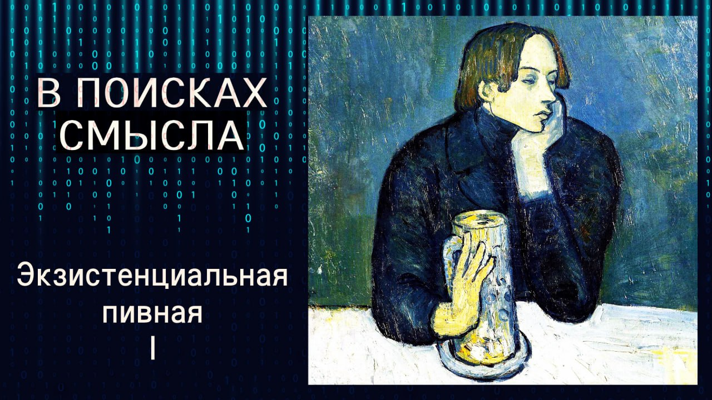

# Экзистенциальная пивная

01 ноября 2025 г. [Аудиоверсия](https://paradoks-pinkera-pilotnyy-vypusk.simplecast.com/episodes/the-existential-pub) 46:37

Авторы полемизируют с гостем подкаста, философом Сергеем Григоришиным, о природе человечности, начав с примера посетителей пивной под окна квартиры Евгения. 

Обсуждаются два пути к осознанию себя человеком: через "закупоривание" в собственной экзистенции или через обращение к божественному.
Почему для одних человек становится человеком, только задав себе вопрос о бытии, а для других — он уже является человеком по божественному замыслу.
Разговор получился жарким, местами туманным, но затронул самую суть вопроса о том, что делает нас людьми в эпоху ИИ.

**Е.Голуб:**
Здравствуйте, друзья!
В эфире очередной выпуск подкаста «В поисках смысла».
Сегодня мы с Павлом пригласили в гости Сергея Григоришина.

Так что сейчас у микрофона, как обычно, Евгений Голуб.

**П.Щелин:**
И Павел Щелин.

**С.Григоришин:**
И Сергей Григоришин.

**Е.Голуб:**
Мы с Павлом Сергеем начали говорить, и уже несколько выпусков говорили о вызовах, которые стоят перед нами, перед человечеством как видом, связанные с тем, что технологии достигли уже того уровня, когда начинают ставить под вопрос, собственно, содержание человеческого, когда технологии настолько хорошо уже имитируют человеческие эмоции, производят нечто такое, что раньше мы считали прерогативой человека.
Вот эта ситуация ставит вопрос, а что же такое человек?

Если в человеке что-то такое, и что это, что нельзя сымитировать или воспроизвести при помощи технологии искусственного интеллекта, такой, какой она есть сейчас, и такой, какой она обещает быть в будущем.
Этот вопрос или эти размышления вначале я хотел бы услышать от Павла.

**П.Щелин:**
Чем больше мы обсуждаем проблемы искусственного интеллекта, чем больше мы обсуждаем проблему технологии, тем более мне самоочевидно, что внутри технологической структуры, то есть именно объект-объектных отношений, искусство или навык превращения чего-то живого в какой-то инструмент использования, будь то теперь человеческое мышление, человеческий голос даже, невозможно будет защититься от тех вызовов, которые технологическая цивилизация ставит перед своими пользователями.
Решение лежит в отношениях субъекта и субъекта, одного волевого агента, обладающего несводимыми ни к чему характеристиками, то есть здесь опять упираемся в слово «личность», которое мне дико не нравится, но пусть будет предварительно личность, то есть взаимодействие одной человеческой личности к другой человеческой личности, которая как целая является бесконечно больше суммы ее частей.

**Е.Голуб:**
В чем, собственно, предмет нашего разговора.
К чему несводим человек или что остается от человека, когда мы...

**П.Щелин:**
Человек несводим к количеству его признаков.

**Е.Голуб:**
Тогда, принимая тот пас, который ты мне отдал, я расскажу, почему я решил пригласить Сергея, и рад, что ты с этим согласился.
Мы с Сергеем встретились на собрании, в небольшом семинаре философов, где я с Сергеем познакомился.
Сергей — профессиональный философ, родом из Украины.
Ну и, собственно, пусть Сергей сам о себе немного расскажет.
Мне показалась его позиция, наши дискуссии, которые предваряли эту встречу, достаточно интересными, чтобы включить Сергея в пространство нашего подкаста.

**С.Григоришин:**
С удовольствием представлюсь.
Я кандидат философских наук, защищался в Киево-Мегелянской академии.
У меня диссертация по Эдмунду Гуссерлю, по трансцендентальной феноменологии, хотя я от этой темы давно уже отошел.
Но феноменология всегда со мной.
Я преподавал в университете приблизительно 15 лет.
В последнее время, не преподаю, а живу в Германии.
Наверное, пока информации обо мне достаточно.

**Е.Голуб:**
Хорошо.
Насколько мне известно, у вас была возможность послушать наши с Павлом разговоры, и некоторые позиции, высказанные Павлом, и вопросы, которые я задавал, ответы на них полученные, вызвали у вас желание их как-то прокомментировать.
Вот сейчас, не возвращаясь к теме этих выпусков, я хотел бы включить вас в разговор о человечности.

Павел высказал свои мысли по этому поводу, что человек не является суммой признаков.
Что вы думаете по этому поводу?
Как бы вы отреагировали на это?

**С.Григоришин:**
Я целиком согласен, что человек не является суммой признаков, а то, чем он является, — это сущность.
Я бы говорил о сущности человека и вообще о субстанциональном онтологическом подходе к этому вопросу.
Постараюсь во время нашего разговора удерживать эту парадигму онтологической интерпретации сущности человека и буду её по-своему защищать.
Из размышлений Павла, давайте я буду только ориентироваться на то, что было сказано сейчас.

Я считаю, что мы во многом искусственный интеллект преображаем в нечто более подходящее к понятию божества.
Во многом мы же с вами гуманитарии, не все мы технарии.
Я только, кстати, увидел у вас одну дискуссию с профессионалом в области искусственного интеллекта.
Это было очень интересно смотреть, как люди из двух совершенно непересекающихся культур, как они ведут диалог.
И понятно, что там довольно-таки мало есть возможности найти общий язык, что мыслит совершенно в разных дискурсах, на мой взгляд.

Я думаю, что не искусственный интеллект сейчас должен быть в качестве основного вопроса в проблеме человечности, а переформулировал бы немножко иначе.
Я бы сказал, что насколько мы сегодня в 21 веке, уже прошла первая четверть 21 века, насколько мы сегодня, вот те, какие мы есть, какие мы себя ощущаем, видим, слышим, насколько мы остаёмся людьми, насколько нас искусственный интеллект не преобразовал.
Я вот буду с этой точки зрения развивать свои положения.
Ну и если получится, буду немного ещё дискутировать с Павлом.

**Е.Голуб:**
Сергей, вы сразу перешли на язык профессиональный.
Напомню, что моя роль — это переводить непонятное в более простое.

Я уже немного потерял нить рассуждений.
Есть ли какое-то противоречие в том, что говорил Павел, с тем, что говорите вы?
Или в позициях, или в подходе?

**С.Григоришин:**
Пока на основе высказанного противоречия нет.
Я тоже не свожу человека к сумме его признаков.
Я так понимаю, что предпосылкой Павла как раз является то, что человек — это определённая сущность.
Другое дело, что скорее всего мы по-разному это понятие сущности интерпретируем.

**Е.Голуб:**
Хорошо.
Павел, как ты интерпретируешь понятие сущности человека?

**П.Щелин:**
Если переводить на простой язык, то я стою на том, что сущность человека является не арифметической суммой его признаков, не является суммой его состояний, даже не является суммой тех отношений, которые этот человек имел в своей жизни.
Эта сущность является логосом, пре-данным и пре-заданным его божественной природой.

**Е.Голуб:**
Давайте попробуем думать апофатически.
Можем ли мы сказать, что любой homo sapiens — представитель вида homo sapiens является человеком?

Маугли — человек, воспитанный волками, не знаю, животными.
Он человек?

**П.Щелин:**
Для меня, да.

**Е.Голуб:**
Для вас, Сергей?

**С.Григоришин:**
Я, во-первых, соглашусь с тем, что у человека есть некая предзаданная природа, данная ему Богом.
Здесь у нас тоже с Павлом довольно сильно совпадают точки зрения.
Я тоже стою на теологической позиции, и мне очень важно слышать то, что он сейчас проговорил.

В отношении Маугли история немножко сложнее, поскольку человеческое должно трактоваться по определённым признакам.
Если у Маугли есть эта сущность, он является человеком.
Если сущности нет, то, скорее всего, нет.

**Е.Голуб:**
Какие признаки?

**С.Григоришин:**
Человек либо понимает свою сущность, либо нет.
Между человеком и его бытием есть смысл.
И тот, кто понимает смысл своего бытия, даже если остаётся в непрояснённости определённых терминов, вот есть предзаданность понимания смысла своего бытия, это существо уже можно назвать человеком.
Если же это существо находится в забвении своего бытия, он считает, я, например, анаконда.
Я медведь.
Вот тогда он, ну, наверное, не человек.

**П.Щелин:**
Я здесь не согласен.
Просто в моей терминологии ты же меня спросил, является ли он.
То есть для меня ответ будет логосный ответ, да?
То есть по логосу, конечно, является.
Вот с тропосом проблемы.

**Е.Голуб:**
Логос-тропос.
Давайте поясним для тех, кто, допустим, первый раз вообще в эту тему включился.
О чём идёт речь?

**П.Щелин:**
Слово логос, ну, это и есть та самая сущность, которая имеет свою природу в нематериальном мире, если угодно, находится в божественной природе, и которая воплощается уже в мире материальном.
Так вот, тропос — это и есть образ воплощения этой самой природы.

Поэтому в твоём примере с Маугли, по логосу Маугли, конечно, человек, а вот тропос, то есть образ её воплощения, мягко говоря, сильно недорабатывает.
Но опять же, православная традиция у всех, кроме Иисуса Христа и, потом уже, святых, с тропосами большие проблемы.
Ну, то есть, условно, я по логосу, конечно, тоже человек, но в том мире, в котором я не достигаю святости, у меня с моим тропосом воплощения этой, собственно, моего логоса большие проблемы.

**Е.Голуб:**
Можно ли измерять уровень?

**П.Щелин:**
Ну, измерять количественно — нет.
Какая-то мера есть, но мы этой меры не знаем.

Просто что меня задело в Сергее, ну, в чём главное несогласие в высказывании, то, что логосно, хоть бы я себя сколько белкой не считал, я от этого белкой по логосу не стану.
И вот это принципиальный момент.
И вот этот некий переход к субъективизму, он мне немножко здесь непонятен.

**Е.Голуб:**
Так, друзья, я немного переключу вас от Маугли в более насущные проблемы.

Я живу в доме, и подо мной внизу находится пивная.
И вот иногда, довольно часто, поздно вечером, мне приходится слышать всякие звуки, которые явно издают представители рода Homo sapiens и какие-то другие, значит, проявления их жизнедеятельности, которые, на мой взгляд, ну, скажем, далеки от того, что бы я в полноте бы считал проявлением человечности.
Кроме того, здесь, в этом районе, достаточно много людей, которые в силу разных причин стали бродяжничать, и их проявления в жизни, на мой взгляд, ближе, конечно, извините, ну, если так прямо говорить, к животному миру, чем к человеческому.
Это первый пример.

Вопрос в том, они расчеловечиваются, они теряют свой, этот тропос у них растворяется, они становятся менее людьми, отказываются от своей человечности.
Или это моё отношение больное?

Я сразу два примера дам уже, простите меня, слушатели.

Работяга, который живёт в парадигме встал, пошёл на работу, вечером выпил пиво, завалился на телевизор, заснул, проснулся, опять пошёл.

Да, какие там у него логосы?
Как быть его человечностью?
Сергей?

**С.Григоришин:**
Смотрите, я не считаю, что человек, упавший в какую-то бездну, перестаёт быть человеком.
Я это подчёркиваю.
Потом хотел бы продолжить своё рассуждение, но хочу, чтобы не забыть, немножко откомментировать слова Павла о том, что ему не понравилось в моём ответе.
Я подумал, что он посчитал субъективизм как некое сконструированное понятие, что я такой не перенеалист, не мыслящая сущность.

**Е.Голуб:**
Не кто?

**С.Григоришин:**
Перенеалист.
Это философия перенес, вечная философия.
Человек, который считает, что все категории вечны и неизменны.

Так вот, я тоже выступаю за сущностное, просто там, наверное, у нас просто недопонимание в том примере было.
Это для меня важно подчеркнуть, что там, где у нас есть общее, этим стоит дорожить.
Я думаю, мы ещё не раз сможем с вами разойтись по каким-то другим вопросам.

Поэтому в отношении ваших соседей по дому, которые в пивной проводят время, это вообще не проблема для сущности человека.
Так же, как и не проблема быть, скажем так, на нижних уровнях иерархии мира человеческого.
Вопрос о сущности, он стоит немножко в ином ключе.
И если человек задумывается, если ему болит своё бытие, вне зависимости от его социального статуса, возраста, пола, тогда он уже находится в онтологической парадигме.

Онтология — наука о бытии.
И когда я говорю «понятие бытия» или «понятие сущее», это всё и есть онтология.
Иногда буду это слово заменять словом «метафизика», потому что Аристотель использовал слово «метафизика», а многие мои рассуждения, основываются на Аристотеле, поскольку на них основывался Гуссерль, которого я очень сильно уважаю, и потом целое поколение экзистенциалистов, чтобы было понятно.
То есть Аристотель, Гуссерль и 30 экзистенциалистов, скажем так.

Соответственно, если это была такая интеллектуальная ловушка, что «а вот эти люди в пивной, они-то скажите, пожалуйста, они люди или не люди, Сергей, скажите».
Люди, конечно же, люди.
Но это ответ этический.

Онтологически так мы даже не можем вопрос поставить.
Онтологически только изнутри конкретного бытия можно получить вопрос о том, раскрывает ли человек свое бытие, понимает ли он его смысл или не понимает.
А это уже такая высшая математика, ну, как образно говоря.

**П.Щелин:**
Нет, ну, короткий ответ на твои изначальные вопросы, конечно, да.

**Е.Голуб:**
Все люди, да?
Как бы низко они не пали.

**П.Щелин:**
Все люди, даже нелюди.

**С.Григоришин:**
Даже нелюди люди.

**Е.Голуб:**
Я буду вас мучить глупыми сравнениями.

Вы, если видели, сейчас идет усиленное конструирование человекоподобных роботов, естественно, запряженных искусственным интеллектом.
Внешне уже практически неотличимых от человека, по крайней мере, до груди, да?
Показывают лица, мимику, рассуждения, ответы.
И, скажем так, мы же по идее можем достичь очень скоро такого состояния, когда такая модель человека, мы можем ее легко перепутать с самим человеком.

**П.Щелин:**
Смотри, тут два момента.

Первый, возвращаясь к твоему предыдущему вопросу, вот это уже не люди, ну, не человек.
У них сущность другая.
Вот то, что ты описываешь, условно, человекоподобный робот, наделенный искусственным интеллектом, не является человеком.
Это вот то, что у него по сущности другой, по природе другой.
Другой логос он воплощает.
И нам это интуитивно абсолютно понятно.
Именно не по тропосу, то есть не по образу.
То есть он как раз по образу может быть очень на нас похожим.
Это, знаешь, такое ложное сходство.
Такое в природе часто случается.
Что-то, что вроде выглядит одинаково, но вообще является абсолютно разными вещами по своей природе.
Так вот и здесь.
Мы попадаем ровно в эту же ловушку.

А второй навык, это уже, собственно, к изначальному моему тезису.
Насколько мы можем отличать одно от другого?
И насколько мы сами можем во взаимодействии с тем, что очень на нас похоже по внешнему виду, сохранять навык сущностного различения?

**Е.Голуб:**
Когда я беседую с чатом GPT, да, с последними моделями, и эта, не знаю, сущность другая реагирует на мои вопросы, замечания, размышления, там, какие-то специально окрашенные эмоционально суждения, точно так же, как бы это отреагировал, а может быть, ещё более глубоко, чем отреагировал мой, скажем так, коллега по виду из пивной, да, то как бы понять, что сущность у него другая, то есть она внешне может быть неотличима, вообще никак.
Всё логично, глубоко, содержательно, гораздо более содержательно.

Я пытаюсь вести вопрос к тому, что с позиции, например, технологии, мне кажется, отличия нет.
То есть, чтобы выявить человека, нам нужно вот от этого технологического утилитарного подхода как-то отходить, и отходить, получается, в трансцендентное, да, вот в какую-то другую онтологию.
Так или нет?

**П.Щелин:**
О том и речь и идёт, что кроме трансцендентного отношения к человеку, ничто другое не имеет смысла, чем дальше мы двигаемся по картине технологического мира.
Во всех наших выпусках показываем, демонстрируем самыми разными примерами, самыми разными парадоксами абсурдность нетрансцендентного отношения к человеку.
То есть, любые попытки либо свести человека к чему-то количественному и лишить его вот этого трансцендентного измерения, они всегда, оканчиваются, ну, трагикомичными, скажем так, историями.

**Е.Голуб:**
Правильно ли я понимаю, что когда мы видим сегодняшний подход к человеку как к эдемической единице, как к производственной единице, как к потребителю, вот это вот объектное отношение, то мы фактически лишаем этого человека, его человеческой сущности?

**П.Щелин:**
Абсолютно.
Мы делаем вид, что мы можем игнорировать вопрос о сущности.
Мне кажется, вот это более интересный момент.

С одной стороны, есть процесс лишения, более-менее осознанного, но это происходит всю нашу историю.
Это проблема объективизации и даже, прости господи, в таких ее странных преломлениях, как проблема отчуждения.
Но второе, вот уже более актуально для нашего сегодняшнего дня, мне кажется, это проблема игнорирования.
Давайте просто закроем вообще глаза, что такая проблема существует.

**Е.Голуб:**
Какая проблема?

**П.Щелин:**
Проблема о человечности.
Давайте сделаем вид, что проблемы о человечности, ну, в контексте нашего разговора, по логосу или по сущности не существует, и будем обсуждать только признаки и формы.

**С.Григоришин:**
Соглашусь с тем, что это попытка игнорировать вопрос о сущности человека, она существует.
Но она существует естественным образом, поскольку проблема искусственного интеллекта сегодня звучит из всех чайников, и мы просто не можем никак не отреагировать, не отрефлексировать в каждом отдельном случае на то или иное новое событие в связи с развитием искусственного интеллекта.
И, конечно, если бы так часто говорили о сущности человека, может быть, мы об этом и размышляли бы, гораздо более продуктивнее.

Но я вот думаю вот о чём.
Мы, как люди, привыкли думать о сущности уже исходя из предпосылки, что мы являемся теми, кого можно назвать человеком.

**Е.Голуб:**
Мы — это здесь говорящие или кто?

**С.Григоришин:**
Мы, как люди, и в том числе говорящие здесь.
То есть, когда мы говорим о различии искусственного интеллекта и человека, как будто бы для нас, может быть, с искусственным интеллектом ещё какие-то проблемы существуют, но о себе мы знаем всё очень хорошо и подробно.

У меня есть гипотеза, и я её давно обрабатываю, думаю, размышляю на эту тему, что человек с момента возникновения интернета немного изменился.
Он стал другим.
Произошла определённая мутация.
И эта мутация существует и с нами здесь и сейчас.

Поскольку, смотрите, мы сейчас с вами говорим с помощью интернет-связи, и для нас опосредованность общения кажется естественным.
Прошло не так много времени, когда мы привыкли к общению с помощью различных программ.
Но насколько это естественно для человека как такового?

**Е.Голуб:**
А что неестественно?
Ну, общаемся мы, ну, как если бы вы были здесь рядышком у меня в комнате, что это принципиально меняет от того, как мы общались, там, не знаю, там, 200 лет назад?

**С.Григоришин:**
Меняет всё очень существенно.
Опять же, мы сегодня вспоминали с вами Аристотеля, всё познаётся в сравнении.

Если вы, Евгений, почитаете, я думаю, вы не раз уже читали книги философов 100-летней давности, то там, когда прорабатывается и анализируется тема человеческой природы, мы видим, насколько эта глубина погружения в человека сильнее, чем когда сегодня мы рефлексируем на те же темы.
И, конечно, для меня, естественно, задать вопрос, а не изменились ли мы в какую-то сторону?
Не стали ли мы сами более искусственными и в размышлении об искусственном интеллекте не учитываем одну предпосылку?
Возможно, мы, как люди, уже не способны отрефлексировать искусственный интеллект, как это бы сделал человек, который не жил в эпоху искусственного интеллекта.

Знаете, есть в древнееврейской традиции два понятия благословение и проклятие.
То есть есть период благословения, когда всё хорошо, всё по божеской воле происходит.
А есть уже ситуация проклятия.
Я думаю, что с теологической точки зрения мы находимся в такой ситуации проклятия для человека, когда вопросы уже давно решённые нашими предшественниками мы задаём снова и снова, и на каждом этапе формулировки вопросов сами эти вопросы мы упрощаем.

**П.Щелин:**
Ну я могу только добавить, что, конечно, когда я говорю о человеке, мне кажется, действительно, постановка вопроса о человеке как таковом лишена смысла.
То есть разговор о сущности человека имеет только смысл в отношении беседы о бого-человеке.

И в каком-то смысле понять человека можно только через то, как мы понимаем и взаимодействуем.
То есть понимаем тоже слово не совсем точно, потому что оно сразу отсылает исключительно к разуму.
И поэтому давайте прямо, тоже важный дисклеймер.
Когда мы говорим про искусственный интеллект, для меня это лишь повод.
То есть я всё-таки хотел бы уточнить, я здесь, конечно, не могу до конца согласиться, что это некое качественное изменение.
Я здесь скорее отстаюсь на платонической логике.
По сути, тот же самый процесс, что изобретение письменности, тот же самый процесс искусственный интеллект, сам феномен техники, сам феномен объектификации, сам феномен внешних частей тела, по сути, выноса части моего тела вовне, будь то мозг, память, зрение, слух, руки и так далее, он начался не сегодня, просто сегодня он скорее из абстрактной философской комнаты стал более понятен всем тем, кто открывает и использует этот чат-джипити изнутри.

И для меня то основная надежда именно в том, постановка нас лицом к зеркалам перед вот этой проблемой не то чтобы нечеловечности и, может быть, даже проблемы нечеловеческого того, что выглядит как разум, насколько это разум, насколько это мысль, это отдельный вопрос, отдельная тема, я считаю, нет, но точно я считаю, что оно очень хорошо выглядит как разум, оно имеет прямое отношение, но оно ставит вопрос, повторюсь, о нас, насколько мы выглядим как люди, насколько мы выглядим, как будто мы думаем, насколько мы кажемся, а не есть.

Вот весь этот комплекс вопросов, он сегодня встает, и на мой взгляд, вот здесь, то что можно согласиться с Сергеем, контраст с тем, как мы сегодня это обсуждаем с умным видом, очень смешон, если мы будем читать, повторюсь, какого-нибудь и Святого Отца, и ту глубину проблемы, и ту глубину вопроса, ну, например, Максима Исповедника, Григория Нивского и вот великие сирийские отцы, великие капподакийцы, потому что мы увидим, что вопрос о по существу, собственно, что есть человечность, они ставят гораздо более полный и радикальный через именно разговор о богочеловечности и богочеловеческой природе.
В каком-то смысле здесь мы находимся в парадоксе.
Чем хуже, тем лучше.

**Е.Голуб:**
Я попробую сделать промежуточный вывод, как человек не столь философски подкованный.
Как это звучит для меня.

Мы любим говорить с тобой, Павел, о том, что там 500-600 лет назад человек по разным причинам сделал ставку на разум, сделал ставку на культивирование технологии и потихонечку-полегонечку двинулся в сторону решения вопроса о том, кто он есть, через то, что он может сделать во внешнем мире.
И радовался тому, что как много может теперь человек, человечество совершить во внешнем мире.

И в последнее время ускорилось.
Мы дошли до такой ситуации, когда настолько забыли о себе, о своей человеческой логостной сущности, что, в общем, приходится задавать те вопросы, которые были совершенно актуальными или понятными, или хорошо проработанными сотни лет назад.
Потому что мы отошли от этого понимания себя сознательно, ушли в технологии.

Как это звучит?
Очень по-детски?

**П.Щелин:**
Да нет, вполне нормально звучит.

**С.Григоришин:**
Я буду реагировать сразу и на слова Павла, и на ваш Евгений, что я стараюсь удерживать всё вместе.

Есть первая точка расхождения.
К счастью или нет, когда Павел говорит о том, что можно ставить вопросы человеку только с точки зрения богочеловека, богочеловечности, и это есть актуальный, и приводит в пример святых отцов, я соглашусь с тем, что да, святые отцы мыслили теологически эту проблему, проблему человеческого, и только в отсвете вопроса о Боге мы понимали всё, что касается человека.

Но здесь есть одна, на мой взгляд, я назову это словом уловка.
Когда мы говорим, что никакой другой вопрос не интересует, кроме богочеловечности, значит, мы вот этого конкретного человека, этого человека из пивной, любого человека конкретного, мы его исключаем как некий элемент разговора о сущности.
То есть богочеловеческое, я так понимаю, всё-таки это божественное.
Это Логос, это Христос, вот с этой точки зрения богочеловеческое.
То есть нечто трансцендентное, святое, вечное.

**П.Щелин:**
Не согласен с этим возражением именно по той причине, что, мне кажется, вопрос о человеке в пивной только и можно поставить через призму богочеловечности.
Только через призму вот этой общей трансцендентной в каком-то смысле человеческой природы.
Потому что если мы не ставим вопрос о человеке, то и дела до этого человека из пивной у меня вообще никакого нет.

**С.Григоришин:**
А мне вот есть.
Я думаю, что здесь есть смещение акцента.
Когда мы говорим о богочеловеческом, о божественном, мы переходим на такой достаточно высокий штиль, и всё-таки мы, эту конкретность бытия, она как бы затирается в вопросе о божественном.
Если мы говорим только, о божественном, я так понимаю, что в понимании Павла человек это некая общая идея.
То есть мы не говорим о конкретном человеке, о его экзистенции.

**П.Щелин:**
Нет, не так.

**С.Григоришин:**
Ну, возможно, я ошибаюсь.
Я, может быть, слова Павла неких там в своё содержание включаю.

**Е.Голуб:**
Давайте проясним.
Вот раз зашла речь о расхождении, нужно убедиться, что оно действительно существует.

**С.Григоришин:**
Или не существует.

**Е.Голуб:**
Или не существует, да.

**П.Щелин:**
Разумеется, речь идёт об общей экзистенции.
Так вот, для меня только через постановку вопроса об общем возникает вопрос о частном.
Другими словами, для меня не существует самого противоречия.
Вот эта частная экзистенция, она имеет значение в отсвете общим, а общее имеет значение в отсвете вот этого частного.
То есть это отношение подобия и символического, а не отношение логического и, скажем так, категорийного, исключительного, если уж на то пошло.

**Е.Голуб:**
Как можно перевести слова Павла на язык обывателя?
Я даже уже и не знаю.
У меня ломается сейчас голова.

То есть твой тезис звучит так.
Человек, остаётся человеком, потому как он является собой подобие Бога.
Может быть искажённое, заплёванное, там, затёртое, но всё равно он всегда есть подобие.
И как это подобие, мы его распознаём как человека.

**П.Щелин:**
Более того, я как подобие распознаю его как подобие именно через это того, что каждый из нас является подобием того самого богочеловека.
В противном случае мне до его экзистенции нет никакого дела.
Есть она там, нет она там.
Мне как Личности никакого дела до этого нет.
Я это всегда говорил.

То, что если не христианство, то Ницше.
Вот очень простой.
Вся вот эта ваша экзистенция и других частных случаев, включая твоих соседей в пивной, летят они глубоким лесом.
Если нет вот этого общего отношения, подобия и всеединства.

**Е.Голуб:**
У меня нет никаких отношений с ними.

**П.Щелин:**
Нет, ну у тебя нету, но если по большому счёту, если бы не наша вот эта общая человеческая природа, её бытие, первичность её бытия, то наше подобное частное бытие решалось бы вопросом, у кого дубинка побольше, и пистолет погромче.

Но смысл базовый в том, что для меня сама постановка вот этого частного существования, первичности некого частного существования имеет смысл только в отношении вопроса о первичности трансцендентного существования.
Потому что в противном случае мы упираемся в проблему Соловьёва.

> Человек произошёл от обезьяны, так давайте же любить друг друга.

У каждого есть своя экзистенция, только до какого это дело мне.
Та же в том числе, как и познающего субъекта и взаимодействующего субъекта.

**С.Григоришин:**
Вспомнил в одном из ваших подкастов, Павел говорил, что я не люблю вступать в дискуссию потому что в таком случае мы проявляем худшие стороны своей природы.
Вот я думаю, как же мне вот с этой ситуацией, которую сам спровоцировал, уйти немножко?

**Е.Голуб:**
У нас нет конфликта.
У нас есть попытка разобраться в подходах.

Никакого антагонизма я пока не чувствую.
Есть точка расхождения, которая мне до конца не ясна.
Может быть, Сергей, вы поможете?

**П.Щелин:**
Хорошо, Сергей, давай попробуем показать, в чём точка, собственно, расхождения.
Наверное, если есть что-то ценное в этом сейчас моменте, то будет именно в этом.
В чём именно мы не согласны.

**С.Григоришин:**
Смотрите, я исхожу из первичности частного бытия, частной экзистенции.
Павел говорит, что ему дело нет до такой частной экзистенции.
Если она не сопряжена с вопросом трансцендентным, то пусть она идёт лесом.

Я считаю, что вопрос трансцендентного, он тоже вопрос частного, но частного не в платоновском смысле.
Кстати, Павел довольно-таки строго придерживается платоновской точки зрения.
Я же исхожу из аристотелевской.

Вот мы сейчас играем в такую игру в бисер, которую играют в основном философы последние, ну, минимум, две тысячи лет.
Я исхожу из первичности частного конкретного бытия.
Вот есть конкретный, уникальный Павел, и он важен не как отдельный представитель или образ Бога, или скажем так, частный экземпляр рода человеческого.
Мне важен Павел как конкретность бытия.

Если это не он, то кто-то другой будет уже совершенно чем-то другим, понимаете?
Конкретный человек, конкретная экзистенция, конкретное существование, оно как раз и есть та загадка в отношении вопросов того, где мы сейчас обитаем в плане решения смысла жизненных вопросов.
То есть когда мы говорим об искусственном интеллекте, мы говорим о неком общем понятии вообще искусственного интеллекта и противопоставляем его нашему естественному интеллекту.
И мы вроде как, вот мы тут полномочные представители человечества, боремся с искусственным интеллектом, или как-то, не знаю, таким неолудизмом занимаемся, предположим.

Я же исхожу из того, что человека в общих понятиях-то можно его изучать и нужно, потому что категория — это и есть общее понятие, и понятие сущность — это общая категория.
Но все эти общие категории применимы к конкретному человеку, только к одному, и другого человека в принципе нет.
То есть есть вот этот один человек, и он может отрефлексировать себя с помощью философских категорий, общих категорий, понятия трансцендентного тоже общее только тогда, когда мы мыслим из вот этой вселенной или острова отдельного человека.
И я на этом буду настаивать.

**Е.Голуб:**
Ну прекрасно, замечательно.
Я вижу, что Павел с этим не согласен.

**П.Щелин:**
Ты что-то понял из того, что мы сейчас обсудили?

**Е.Голуб:**
Я понял это так, что для тебя первично трансцендентное его образ в человеке, и мы говорим о человеке, что он человек в той мере человек, в которой он приближается к образу Бога.

**П.Щелин:**
Не просто к образу Бога, а образу себя в Боге.
И это принципиальный момент, потому что для меня вопрос о постановке о частном является бессмысленным без наличия общего.
Но при этом наличие общего не отменяет то самое частное, о котором говорит Сергей.
То есть для меня в каком-то смысле, я отрицаю саму ту постановку вопроса, из которой исходит Сергей.

Разумеется, моё первичное бытие, вы разговариваетесь со мной не как просто, как с частым случаем, допустим, там, божественной природы или человеческой природы, а как с очень конкретным мною.
Но вот этот конкретный я в моей оптике, имеет смысл только через призму моего подобия, соучастия в этом всеедином, общем логостном природе.
Но при этом вот этот логос, он одновременно, конечно, и логос человека как такового, богочеловека как такового, но и меня, конкретного меня как такового.

**Е.Голуб:**
Я скажу попроще, каждый образ уникален.
То есть он одновременно и образ, и уникальность образа, воплощённого в конкретном человеке, или возможность, или скорее как потенция воплотиться в конкретном человеке.
И в этом смысле мы соединяем уникальность и общность.

**П.Щелин:**
Я ближе к этой позиции.
Дадим слово Сергею сказать.
Давай сформулируй его, пожалуйста.

**Е.Голуб:**
Его позиция мне до конца непонятна, но звучит она, что, ребят, всё-таки вот эта уникальность его рефлексии, его понимания, вот это вот, она в некотором смысле более важна.

**П.Щелин:**
Не просто она важна, мне кажется, она антологически первична, если я понимаю тезис Сергея верно.

**С.Григоришин:**
Но, смотрите, онтологически первична божественная сущность, а не человеческая.
Но я понимаю божественную сущность и понятие Бога, Человека, Христа как экзистенцию, как индивидуальную сущность, а не общую.
Для меня это принципиальный момент.

Смотрите, я хочу чётче сформулировать позицию.
Есть мышление от общего к частному, есть мышление от частного к общему.
Обычно в учебнике истории и философии это мышление от общего к частному называлось рационализмом, от частного к общему — эмпиризмом.
Это внутри гносеологии находится.
Но мы сейчас говорим не о гносеологии, мы сейчас говорим об онтологии, о сущности.
Это означает, что первичность частного или общего здесь имеет совершенно другую природу.

Я считаю, что отдельный конкретный человек может сколько угодно размышлять категориями всемирного исторического процесса, от Древнего Египта до искусственного интеллекта, от смысла Второй мировой войны до ещё чего-то.
То есть наше мышление позволяет нам мыслить практически всё в общих категориях.
Но всё, что касается нашего бытия, смысла, если мы начинаем мыслить об этом, а не о всемирно-историческом процессе, чтобы оставаться онтологичным, оно должно касаться только отдельного, конкретного человека.
Всемирно-исторический процесс живёт в какой-то своей реальности.

Мы обсуждаем политические вопросы, мы обсуждаем общественные вопросы, мы обсуждаем исторические вопросы.
Но это мышление в общих категориях, когда мы переходим к вопросу о смысле собственного бытия, они теряют любую ценность.
Поскольку когда мы мыслим о себе, о своей сущности, тогда мы должны включить в наш разговор совершенно другой словарь, и разговор пойдёт совершенно, в другом ключе.
Нам нужно разобраться в том, кто я есть, как я могу доказать, что я человек.
И если я это могу доказать, то это само по себе является проблемой.
То есть я должен определённые усилия сделать и объяснить себе, почему я в данный момент не искусственный, а живой.
Само по себе это уже вопрос.

То есть когда я обращаюсь к вопросам внешним, серьёзным, всемирно-историческим, не решив вопроса о себе, кто я есть, и насколько я могу вот этими мирами двигать, насколько я вообще могу говорить о чём-то объективном, тем более когда мы с вами говорим о трансцендентном, трансцендентное, на всякий случай это непознаваемое.
Правильно?
И когда мы говорим о трансцендентном, как непознаваемом, ну в смысле божественном, то, что находится в недоступности нашего разума, а мы вот так вот легко вертим богочеловечество, человека божественного.

**П.Щелин:**
Сергей последовательно в рамках той оптики, которую он излагает, тут как раз причина моего принципиального несогласия с той оптикой, поэтому, например, я и, собственно, индуктивному, и дезиндуктивному предпочитаю разговор о подобии, в котором подобие является категорией, которая преодолевает вот эту оппозицию индукции и дедукции.
Это символическое и подобное меняет оппозицию индукции, где частное к общему именно про отношение, а не просто как логическую последовательность.
Вот это если мы уж, простите, уйдём в эти дебри.

Второе, мне, конечно, вот опять мы говорим о знании, я должен сам себе доказать, я должен познать, но здесь, я думаю, вот в этом частном вопросе Сергей меня поддерживает, будучи экзистенциалистом, что бытие — первичнее знание об бытии.
Действительно.
У нас есть просто разница в том, чьё бытие.

**С.Григоришин:**
Как его определить?

**Е.Голуб:**
Чьё бытие и как определить — это вот вопросы разные.

**С.Григоришин:**
Тяжба за бытие, а тяжба об бытии.

**П.Щелин:**
Да, тут идёт уже тяжба об бытии, но в любом случае здесь есть согласие, что опыт бытия предшествует знанию об этом опыте в каком-то ключе.

**Е.Голуб:**
Здесь точка согласия, да?
То есть опыт об бытии предшествует знанию.

А дальше где вы начинаете расходиться?

**П.Щелин:**
Потому что для меня вот этот опыт бытия — опять вопрос, чьего бытия, да?
То есть у меня неотделим вопрос о бытии от вопроса личности этого бытия, но вопрос личности не имеет смысла без контекстности личности Бога.
Опять слово «личность» неправильно, но тем не менее.
Вот это троичность, если угодно, вот этой всей целостности, через которую это всё открывается.
И уже потом через подобные фракталы, соответственно, воспроизведение этих самых отношений на каждом уровне реальности.

**Е.Голуб:**
Так, друзья мои, я думаю, что к этому моменту обычные слушатели нашего подкаста начинают крутить пальцем у виска и говорят, "Ребята, вы вообще о чём?"
О чём?
Куда вы ушли?
Нам вообще ни хрена не понятно.
Что за фракталы онтологического бытия?

Я-то получаю удовольствие, слушая вас.
И мне бы хотелось, чтобы мы попытались свести наш разговор хотя бы к констатации вот этих двух оптик, что вот они существуют.
Есть оптика одна, есть оптика другая.
И из этих оптик мы на человечность и человека смотрим несколько по-разному.
Вот хорошо бы, чтобы мы завершили наш сегодняшний разговор вот этой дифференциацией.

А пока комментарий Сергея.

**С.Григоришин:**
Когда вы говорите, что это всё непонятно, о чём мы говорим, потому что подкаст не идёт от конкретности, а от экзистенции, а идёт от общего.
Поэтому здесь и возникают те сложности и ломка.

**П.Щелин:**
Подкаст идёт от очень конкретной конкретности, а именно конкретность моего и Евгения интереса.
Опровергну опыт на это утверждение.

Хотел бы всё-таки подчеркнуть один принципиально важный момент.
И моя позиция, и позиция Сергея, ну или там оптики, являются перпендикулярными базовой оптике, которая вообще является на сегодняшний момент самой распространённой.
В каком-то смысле и то, о чём говорю я, и то, о чём говорит он, оно противоречит той классической оппозиции, которую мы с тобой разбираем в большей части наших выпусков.
Просто это было для понимания.

Недаром первую часть эфира шло довольно больше согласий, там полудиферамбы друг к другу.
Но далее уже наступает действительно большое разногласие, которое условно в философской традиции действительно представлено образами со всеми оговорками того самого Платона и Аристотеля, так что они вот здесь не случайно пришли в дискуссию.

Но сегодня я бы сформулировал позицию примерно так.
Я отстаиваю картину подобия и символизма, то есть я говорю из этой позиции, а это, соответственно, позиция, в которой оппозиция общего и частного разрешается не через умаление значения ни того, ни другого, в то время как позиция Сергея, на мой взгляд, он пусть поправит, если я неправильно её сформулировал, заключается именно то, что сначала опыт частного, частного бытия, а потом уже всё остальное.

**С.Григоришин:**
Вполне правильно Павел отразил мою мысль, только я хотел бы уточнить, что опыт отдельного бытия не обычного человека, а того, кто поставил вопрос о бытии.

**Е.Голуб:**
А тот, кто не ставил, он человек вообще?

**С.Григоришин:**
Он человек, но он не попадает в рамки онтологии.
Он в качестве онтологического вопрошания.
Человек сам находится в неком забвении бытия, и это выбор.

**Е.Голуб:**
Скажу по-простому.
Если человек не задумывается о смысле, то он не человек.

**С.Григоришин:**
Он человеком остаётся, но без постановки вопроса о смысле бытия он не входит в круг онтологических вопросов, обыдийственных вопросов.
То есть есть человек, и если он поставил для себя вопрос о смысле бытия, он должен его длить каждый день, читать книги об этом и входить в суть вопроса.
Когда мы чем-то хотим заниматься, мы погружаемся, поэтому возникает определённая экспертность.
В этом случае тоже есть определённая экспертность.
Экспертность в смысле бытия.

**Е.Голуб:**
Звучит это так.
Павел представляет себе, любого человека как подобие, и в этом смысле как образ.
Задаёт он вопросы о смыслах бытия, не задаёт вопрос о смыслах бытия, всё равно он остаётся подобием.

Сергей говорит, что да, это всё так, но, и вот дальше после «но» нужно мне медленно разобраться.
То есть человек, не задающийся предельным вопросом о смысле своего бытия, он как бы и человек, но он какой-то вот не вполне, так сказать, как получается человек.
Он человек вне онтологии.
И что это значит?

То есть бухарики вот внизу, они как бы вот не задаются смыслом бытия или задаются там «ты меня уважаешь» или там что-то ещё, но это не тот вопрос.
У Сергея я слышу, Сергей, я прошу прощения, это я слышу, это не вы говорите, что мы в той мере люди, в которой мы задаём вопросы о смысле своей экзистенции.

**С.Григоришин:**
Да, вы очень точно сформулировали.

**П.Щелин:**
Для меня сама такая постановка вопроса является достаточно абсурдной, то есть как раз мы экзистируем вне зависимости от того, насколько мы задаёмся вопросом о нашей экзистенции.

**Е.Голуб:**
А экзистировать это как, Павел?

**С.Григоришин:**
Существовать.

**П.Щелин:**
Экзистовать, существовать.

А вот о качестве нашего существования, это уже вопрос, насколько мы воплощаем в себе тот предзаданный логос и тот логос богочеловека, в котором мы есть.
То есть для меня качество, если угодно, вот это, то есть бытийствование, да, факт первичный, но дальше это только начало вопроса, а именно о том, кого мы бытийстуем, если угодно.
Дальше для меня начинается тот самый вопрос о субъекте личности и переход к вопросу о субъекте, если угодно.

**Е.Голуб:**
Сергей, как бы вы обозначили, точки разногласия?

Потому что мне кажется, что после моих вот этих попыток это сформулировать, может быть, вам будет проще на моём языке указать различия.
Я не призываю соглашаться или не соглашаться, а просто показать различия в подходах.

**С.Григоришин:**
Я думаю, что наше основное различие в понятийном аппарате.
Павел использует понятие образа и подобия, которое, конечно, нас вводит в контекст книги бытия и человека как образа и подобия Бога.
И я, собственно говоря, с этим не спорю ни капли.

Просто если я перевожу на язык экзистенциальной философии, то вопрос образа и подобия превращается в вопросы бытия и сущности.
И вот уже, когда мы об этом говорим, о сущности человеческой Личности, о бытии человеческой Личности, я говорю через конкретность бытия.
То есть я отстаиваю, что отдельный человек — это такой неопознаваемый объект, это неочевидность.
Мы не можем человека просто сказать «вот есть человек».
И он как некая частная, а должен быть подчинён категории общего, человеческое, божественное.

То есть я считаю, что конкретность бытия — это большой вопрос.
Отдельный человек себя знает очень плохо именно в онтологическом измерении.
Он знаком о себе психологически, физически, он может знать всё, что угодно в плане, опять же, политики или истории.
Но знакомство с собой на уровне бытия — это только начало разговора.
И вот это знакомство может возникнуть лишь тогда, когда человек, и это моя точка зрения, и принципиальное расхождение с Павлом, закупорится в своей экзистенции, в своём вот этом внутреннем мире, в своём маленьком бытии, станет этим маленьким тростником, очень хрупким, и начнёт рефлексировать о себе, притом понимая, что рефлексия о себе — она вторично, а бытие — первично.

**П.Щелин:**
Я при этом соглашаюсь, что рефлексия тоже вторичное, а бытие — первичное, но вместо закупоривания настаиваю на том, что этот разговор возможен только при открытии этого человека в вечности.
То есть наоборот.

Раскупоривание этого самого человека и встрече с той самой вечностью.
Единственное, что мой язык, конечно, полностью отрицает вот эту логику некой тираничности, о которой, по сути, говорит Сергей, только относительно вот этой общей категории от человечности относительно человека.
Тот язык, на котором говорю я, говорит о воплощении.
О воплощении принципиально про танец, про сотрудничество, про снятие проблемы этой оппозиции.

**Е.Голуб:**
Я попробую сказать, как, уважаемые господа, философы и мыслители.

Человечевание в полной мере, по Сергею, — это сосредоточение на себе и рефлексия относительно того, кто же я такой и что со мной происходит в этом мире.
По Павлу, очеловечивание происходит, когда человек в принципе выходит из себя и стремится постичь вот это божественное через попытку строить с ним диалог в молитве, вслушивании в волю Божией.
Вот это всё дело.
То есть мы как бы здесь расходимся.

**С.Григоришин:**
Ну смотрите, я не против молитвы на всякий случай, чтобы тоже понятно.
То есть этот теологический дискурс тоже входит в мою точку зрения.
Я просто не пользуюсь этим понятийным аппаратом.

Смотрите, я хочу сказать, что я считаю, что когда мы сосредоточены на трансцендентном, это очень замечательно, очень хорошо и очень правильно.
Но в этот момент мы теряем точку, из которой смотрим.
То есть мы полностью уходим в этот экран, мы теряем возможность увидеть, кто есть мы в этот момент.
И вот конкретно я.
Когда я смотрю на что-то, вот я смотрю на вас.
Мой взгляд направлен на вас.
Это есть вот такая моя интенция, направленность взгляда.

И когда я смотрю на вас, в моём сознании есть вы.
Но то, что есть я, оно немного исчезает из моей постоянной рефлексии, когда я переключаюсь на вас.
И моя точка зрения состоит в том, что рефлексия о себе должна быть каждый раз как будильник определённый.
Потому что когда вот только у нас гипнотический взгляд заводит смотреть на внешний объект, мы должны себя разбудить и ещё раз подумать о том, насколько я являюсь собой.
Вот кто я есть, когда я размышляю о том или ином вопросе.

**Е.Голуб:**
Я больше понимаю, кто я, когда я обращаюсь наверх.
То есть я лучше себя вижу, чувствую, когда я смотрю к Богу, а не когда я взглядываюсь в себя.
Когда я обращаюсь к трансцендентному, моя природа и моя сущность, все мои вот эти внутренние события, они мне как раз яснее почему-то.
Вот это такая особенность.
Мы же не просто смотрим друг на друга, мы же смотрим вверх.
Не просто взгляд, когда ты изучаешь объект, погружаясь в него и отказываясь от себя.

**П.Щелин:**
По сути, да.
Позиция хорошо сформулирована на самом деле.
В чём позиционная радикальность.
На мой взгляд, обращение в себя только возможно, как другой отблик обращения наверх.
На мой взгляд, без обращения наверх ты в себя-то никак не вглянешься.

**Е.Голуб:**
Друзья мои, мы как бы хорошо походили сегодня.
Так прямо я чувствую.

Сергей, спасибо, что присоединились к нам.
Надеюсь, что вы не разочаровались.
В наших попытках познать человека.

**С.Григоришин:**
Наоборот, я очарован и хочу ещё раз высказать свою благодарность за приглашение.
Очень приятно быть в вашей компании.

**П.Щелин:**
Спасибо, Сергей, что пришли.
На самом деле, хороший пример философского разговора в современных условиях.
Мне кажется, нашим уважаемым слушателям, кто досидит.
Но надеюсь, это как минимум пробудет любопытство.

Ну, всё-таки люди такими словами оперируют, и не просто так немножко.
И вроде бы проблема имеет отношение к самым таким прикладным проблемам, как что делать с соседом бомжом.
Очень важный на самом деле вопрос.
То есть, как встретиться с этой частью бытия?
То есть, очень такой прикладной.
Несмотря на довольно высокий полёт, получился разговор, за что я Сергею благодарен.

Как минимум, у нас есть согласие в главном.
Вот этот самый безумный разговор именно в контексте нашего огромного внешнего успеха, ускорения и технологии приобретает всё больше и больше значения.

**Е.Голуб:**
Спасибо, Сергей.
Спасибо, Павел.
Спасибо тем, кто дослушал.

Задавайте вопросы, пишите, комментируйте, поправляйте, где кто проскочил, какую-то точку понимания.
Ну что ж, продолжим размышлять о человеке и человечности в следующих выпусках нашего подкаста.

Всего доброго!
