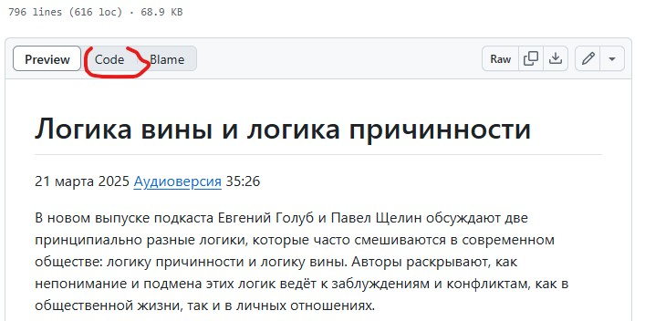
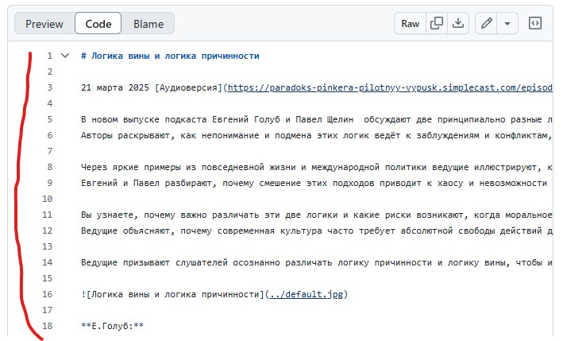
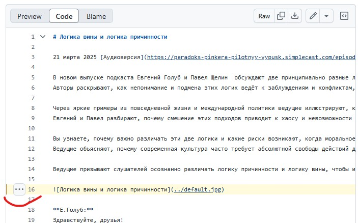
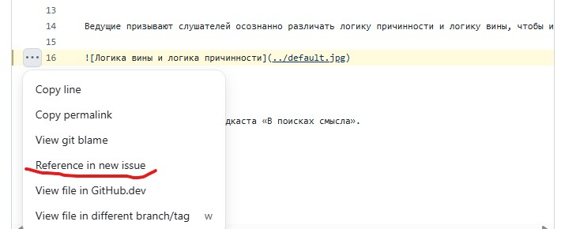
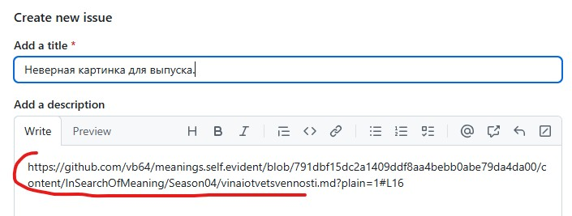
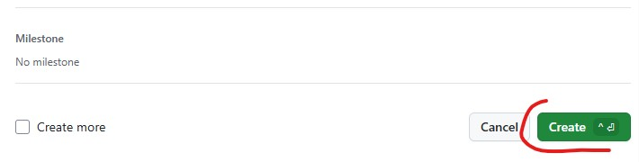

# Как сообщать об ошибках в отредактированных выпусках

Если вы заметили ошибку в отредактированной стенограмме выпуска, то вы можете сообщить о ней администраторам проекта.
Лучше всего это сделать при помощи встроенных инструментов сайта github.com.

Для этого вам нужно создать аккаунт на [github.com](https://github.com) и войти в него.

Затем перейдите на страницу с текстом стенограммы выпуска и включите режим просмотра "код", нажав отмеченную на скриншоте кнопку.

Вид текста изменится на формат `markdown`. Слева будет отображаться колонка с номерами строк.

Выберите строку текста, в которой обнаружена ошибка, нажав на номер этой строки.

Слева от строки появится кнопка с тремя точками.

При нажатии на эту кнопку появится меню. Из этого меню нужно выбрать пункт "Reference in new issue".

Откроется форма сообщения об ошибке. В поле описания ошибки будет добавлена ссылка на выделенную строку текста соответствующей стенограммы.

В поле темы введите текст с описанием ошибки.

В поле описания ошибки после ссылки можно добавить более подробные сведения, если это нужно.

Затем внизу формы нажмите зеленую кнопку "Create".

Ваше сообщение будет добавлено в список сообщений об ошибках в проекте.

Администраторы проекта автоматически получат на почту уведомление о том, что в проекте создано новое сообщение об ошибке.
При просмотре этого сообщения администратор по предоставленной вами ссылке перейдет к нужной строке нужной стенограммы и сможет исправить ошибку, не задавая дополнительных вопросов.
