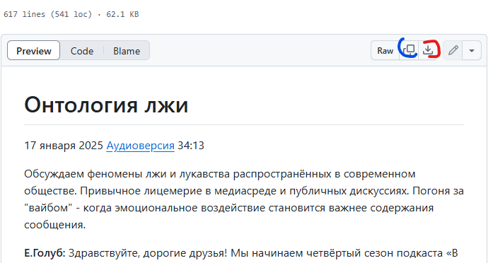

# Инструкция для желающих помочь в обработке машинного перевода

Перейдите на [корневую страницу](https://github.com/vb64/meanings.self.evident/blob/main/content/README.md) проекта.

По ссылкам сезонов и выпусков выберите интересующий вас выпуск.

Нажмите одну из отмеченных на скриншоте кнопок.

Отмеченная синим кнопка скопирует текст выпуска в буфер обмена.

Отмеченная красным кнопка загрузит файл с тестом выпуска на ваш компьютер.

Вы получите текст, который можно редактировать любым текстовым редактором.
Например "Блокнот" ("Notepad").

По ссылке "Аудиоверсия" на странице выпуска перейдите на страницу с аудиофайлом и запустите воспроизведение.
Отредактируйте текст выпуска так, чтобы он максимально точно соответствовал сказанному авторами.

Пожалуйста, проверяйте результат, если вы использовали автоматическую обработку текста ИИ-инструментами.
Обычно это приводит к получению вольного пересказа беседы в исполнении ИИ-модели, а не к получению требуемой **стенограммы** беседы.

По окончании работы над текстом отправьте соответствующий файл модераторам группы "Смыслы самоочевидного" в мессенджере Telegram.
