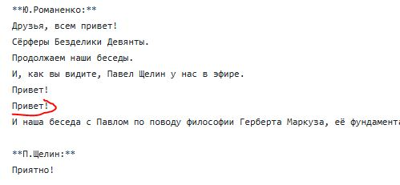
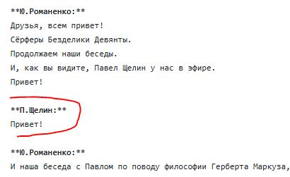
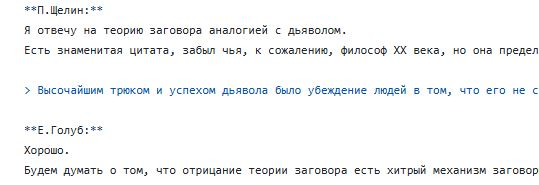
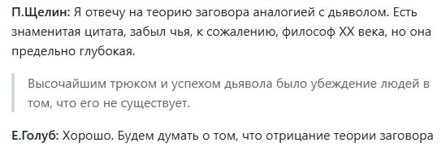
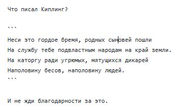
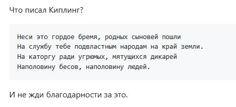

# Требования по оформлению стенограммы в формате markdown

## Формат markdown

Машинный перевод из аудиозаписи представляет собой текст в [формате markdown](https://gist.github.com/Jekins/2bf2d0638163f1294637) в кодировке `UTF-8`.
При редактировании необходимо сохранить этот формат.
Для этого текст нужно редактировать в программе Блокнот (не MS Word!) либо другом текстовом редакторе, работающем с "чистым текстом" (plain text).

## Имена собеседников

Машинный перевод содержит разбиение на части по именам собеседников.
Имя собеседника указывается на отдельной строке и обрамляется с двух сторон двойными звездочками.

Если какая-то фраза одного собеседника по из-за ошибки машинного распознавания включена в блок другого собеседника, эту ошибку нужно исправить.



Перед такой фразой нужно добавить строку с именем правильного собеседника и отделить пустой строкой от текста другого собеседника.



## Разбиение на абзацы

Каждое предложение стенограммы должно быть на отдельной строке.
При отображении строки группируются в один абзац.

Разбиение большого куска текста на смысловые абзацы можно делать добавлением пустых строк.

## Цитаты

При использовании одним из собеседников длинных нерифмованных цитат, такие цитаты можно выделять правой угловой скобкой в первой позиции строки.

Редактирование цитаты:



Отображение цитаты:



## Стихи

Стихотворения и цитаты Библии для правильного разбиения по строкам нужно обрамлять тройным символом обратного апострофа (буква ё в русской раскладке).

Редактирование стиха:



Отображение стиха:



## Неразборчивые фрагменты

Если в аудиозаписи присутствуют фрагменты неразборчивой речи, то в стенограмме в этом месте должно быть слово "неразборчиво", обрамленное символами подчеркивания.

```
_неразборчиво_
```
