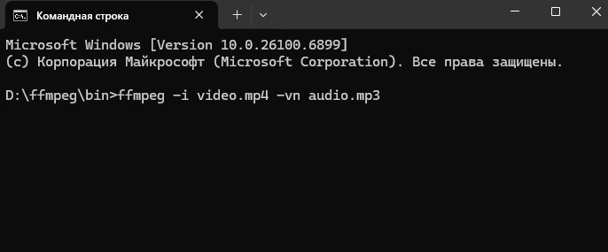
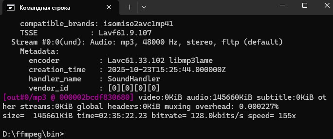

# Инструкция для конвертации видео файлов в mp3 в Windows.

Задача. У вас на компьютере под управлением Windows 11 есть видеофайл `video.mp4`. Требуется извлечь из этого файла звук и сохранить его в файл `audio.mp3`.

[Скачать архивный файл](https://drive.google.com/file/d/12bcdhKBfRiqU67Vc-AuY-79sDErbIxBC/view?usp=drive_link) с программой FFmpeg и распаковать ее в папку с видеофайлом `video.mp4`.

_Также можно скачать самую последнюю версию с [официальной страницы проекта FFmpeg](https://github.com/BtbN/FFmpeg-Builds/releases/tag/latest)._

В этой папке правой кнопкой мыши вызвать контекстное меню и выбрать из него пункт `Открыть в терминале`.



В открывшемся окне набрать с клавиатуры следующую команду и нажать Enter.

```bash
ffmpeg -i video.mp4 -vn audio.mp3
```



После завершения работы программы в папке будет создан файл `audio.mp3`.
