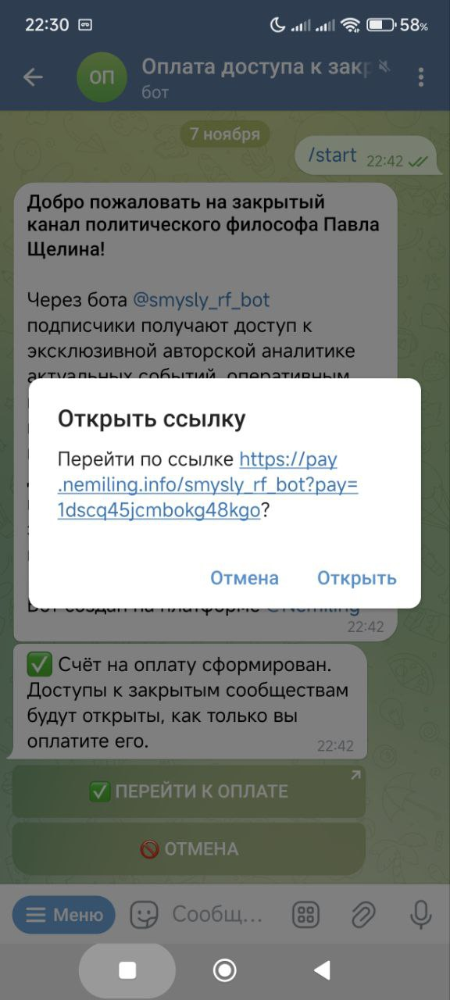
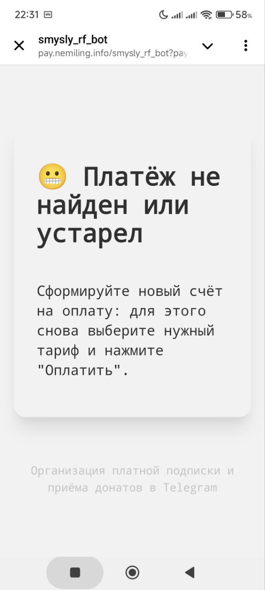
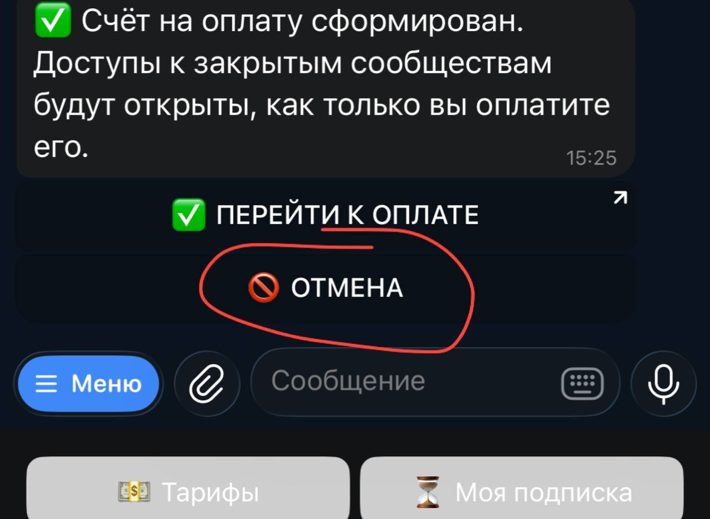

# Проблемы при оплате доступа к платному каналу в РФ

## Ссылка на страницу оплаты не открывается

Вы работаете не из РФ, а из страны, для которой ограничен доступ к ресурсам финансовых организаций РФ.

Можно использовать VPN с сервером, расположенным в РФ.

---

Вы работаете из РФ с включенным VPN.

Выключить VPN

---

При работе со смартфона может быть проблема с браузером, который запускается по умолчанию.

Можно попробовать оплатить не с телефона, а с компа/планшета.

## На странице оплаты выводится сообщение "Платеж не найден или устарел"

С момента формирования счета на платеж отводится 10 минут. После этого времени счет устаревает.

Надо нажать отмену платежа, после этого таймер счета перезапустится.

