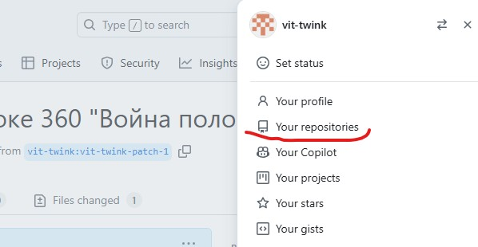
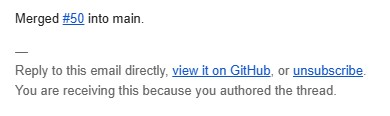

# Как самостоятельно редактировать тексты стенограмм на гитхаб

В тексте стенограммы обнаружена ошибка и созданы следующие сообщения в журнале ошибок.

Первое сообщение.

Второе сообщение.

Нужно самостоятельного отредактировать текст соответствующей стенограммы и исправить эти ошибки.

Для этого вам нужно создать аккаунт на [github.com](https://github.com) и войти в него.

После этого перейдите на [корневую страницу проекта стенограмм](https://github.com/vb64/meanings.self.evident) и нажмите отмеченную на скриншоте кнопку "Fork".

В открывшейся форме нажмите зеленую кнопку "Create fork".

Вы создали копию проекта стенограмм в своем аккаунте.

По ссылкам с главной страницы перейдите к нужной стенограмме. Затем нажмите отмеченную на скриншоте кнопку.

Откроется форма редактирования текста стенограммы с номерами строк.
Перейдите на указанную в сообщении об ошибке строку и отредактируйте текст, согласно замечаниям в первом сообщении об ошибке.

После этого нажмите зеленую кнопку "Commit changes".

В открывшейся форме в поле "Commit message" введите описание сделанных вами изменений.
Если требуются дополнительные пояснения, укажите их в поле "Extended description".

Установите переключатель внизу формы в положение "Create a new branch for this commit and start a pull request".
Под переключателем появится поле с автоматически сгенерированным именем ветки для изменений.
Вам нужно запомнить это имя.

Затем нажмите зеленую кнопку "Propose changes".

Откроется страницы с описанием сделанных вами изменений.
Нажмите на отмеченную на скриншоте ссылку вверху страницы.

Вид блока элементов под этой ссылкой немного изменится.
Нажмите на отмеченный на скриншоте элемент.

В появившемся меню выберите элемент "vb64/meanings.self.evident"

На странице с описанием изменений нажмите зеленую кнопку "Create pull request".

В открывшейся форме создания пулл-реквеста проверьте правильность заполнения заголовка.
Текст заголовка будет скопирован из описания ваших изменений.

Нажмите зеленую кнопку "Create pull request".

Поздравляем, вы успешно создали запрос на внесение ваших изменений в проект стенограмм.
Админы проекта автоматически получат на почту оповещение о том, что в проекте создан запрос на внесение правок от имени вашего аккаунта гитхаб.
Осталось дождаться одобрения вашего запроса админами проекта.

Но тут мы получаем на почту письмо от гитхаб. Нам сообщают, что админы проекта прокомментировали наш запрос следующим образом.

Действительно, мы немного поторопились и исправили только ошибку из первого сообщения, но забыли про второе сообщение.

Поэтому возвращаемся на гитхаб и продолжаем работу.

Нужно вернуться в копию проекта стенограмм на вашем аккаунте.
Для этого нажимаем на кнопку в правом верхнем углу сайта.
Вид кнопки для вашего аккаунта может отличаться в зависимости от настроек вашего аккаунта.

В появившемся меню выбираем пункт "Your repositoriws".

На странице со списком репозитарев выбираем "meanings.self.evident".

На странице репозитария кликаем на отмеченной на скриншоте кнопке.

В появившемся меню выбираем элемент с именем, которое ранее нужно было запомнить.

По ссылкам переходим к нужной стенограмме. И снова нажмимаем отмеченную на скриншоте кнопку редактирования.

Повторям ранее сделанные действия для редактирования стенограммы и вносим изменения из второго сообщения об ошибке.
Нажимаем зеленую кнопку "Commit changes".

Делаем описание новых изменений. Переключатель оставляем в положении "Commit directly ...".
Нажимаем зеленую кнопку "Commit changes".

Новые изменения автоматически отправились в проект стенограмм на утверждение админам проекта.

На этот раз админы одобрили наши правки и добавили наши изменения в проект стенограмм.
Мы получаем на почту письмо следующего содержания.

Это означает что пулл-реквест с нашими внедрен в основной проект стенограмм.
